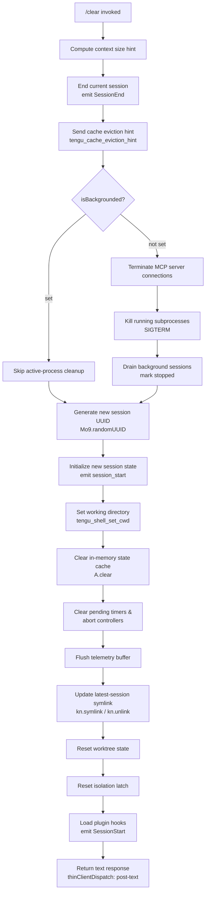

# `/clear`

> Analysis basis: CC v2.1.132 bundle.js (AST extraction + Claude interpretation)
> Minimum version: v2.1.132

---

## Overview

`/clear` starts a fresh conversation session by discarding in-memory context, generating a new session UUID, and reinitializing all session-scoped state. The previous session is persisted to disk and remains resumable via `/resume`; no conversation history is permanently deleted. The command is aliased as `/reset` and `/new`, which are functionally identical.

## Registration

| Field | Value |
|---|---|
| type | `local` |
| name | `clear` |
| description | Start a new session with empty context; previous session stays on disk (resumable with /resume) |
| aliases | `reset`, `new` |
| supportsNonInteractive | `true` |
| thinClientDispatch | `post-text` |
| module_id | `Oo9` |

Analysis basis: CC v2.1.132 bundle.js:+9828649

## Input Branching

`/clear` accepts no meaningful arguments. All branching within the core implementation is driven entirely by runtime state rather than user input.



## Behavioral Spec

### Context Size Hint Computation

```
function computeContextHint(rawInput):
    parsed = parseInt(rawInput, 10)
    if not Number.isFinite(parsed):
        parsed = 0
    clamped = clamp(parsed, low=0, high=1000)
    return applyContextPolicy(clamped)
```

Called before session teardown to supply the cache eviction subsystem with a bounded numeric hint. The floor `0` and ceiling `1000` are hardcoded literal constants; `Math.max` and `Math.min` enforce the clamp.

Analysis basis: CC v2.1.132 bundle.js:+11912024, +11912035, +11912046, +11912068, +11912211, +11912242, +11912255

### Current Session Teardown

```
function endCurrentSession(sessionState):
    runSessionEndCallbacks(sessionState)
    persist(sessionState)
    emit("SessionEnd", sessionState)
```

Emits the `SessionEnd` lifecycle event and triggers all registered teardown callbacks. The old session record is written to disk before the in-memory representation is released.

Analysis basis: CC v2.1.132 bundle.js:+9826761, +11904023

### Cache Eviction Hint Dispatch

After session teardown, a `tengu_cache_eviction_hint` telemetry event is sent carrying the context size hint computed in the previous step. This signals the caching layer to prepare for context replacement.

Analysis basis: CC v2.1.132 bundle.js:+9826853

### Backgrounded-State Guard

The literal key `"isBackgrounded"` is checked against session state immediately after the eviction hint is dispatched. When set, the subprocess termination and MCP connection cleanup steps are bypassed; execution resumes at new-session UUID generation.

Analysis basis: CC v2.1.132 bundle.js:+9826956

### MCP Server Connection Teardown

```
function teardownMcpConnections(connectionRegistry):
    for each connection in connectionRegistry.values():
        retryOrClose(connection)
    emitTelemetry("tengu_mcp_retry_failed_remote")   // on retry failure
```

Iterates all active MCP server connections and attempts a graceful shutdown. Failed retry attempts emit the `tengu_mcp_retry_failed_remote` telemetry event.

Analysis basis: CC v2.1.132 bundle.js:+9827033, +13846663

### Subprocess Termination

```
function killAllSubprocesses(processRegistry):
    for each process in processRegistry.values():
        process.kill("SIGTERM")
```

Iterates the live subprocess registry and sends `SIGTERM` to every tracked child process. Runs only when `isBackgrounded` is not set.

Analysis basis: CC v2.1.132 bundle.js:+9827071, +14131416, +14131448, +14131382

### Background Session Drain

```
function drainBackgroundSessions(backgroundRegistry):
    for each session in backgroundRegistry:
        if session.status == "stopped":
            continue
        session.status = "stopped"
        logInfo("background session", session.id)
```

Marks any in-flight background sessions as `"stopped"` before the new foreground session initializes.

Analysis basis: CC v2.1.132 bundle.js:+9827153, +14163882, +14163925

### Jitter Delay Helper

```
function jitterDelay(maxFactor):
    factor = Math.random() * maxFactor      // maxFactor = 2
    setTimeout(resolve, factor * baseDelay)
```

A small randomized delay used internally around connection retry logic to avoid thundering-herd reconnect patterns. The multiplier ceiling is the literal `2`.

Analysis basis: CC v2.1.132 bundle.js:+9827141, +12264283, +12264285, +12264322

### New Session Initialization

```
function initializeNewSession(config):
    sessionId = crypto.randomUUID()
    newSession = buildSessionState(
        id       = sessionId,
        config   = config,
        status   = "running"
    )
    loadSessionModules(newSession)
    loadSessionConfig(newSession)
    emit("session_start", newSession)
    return newSession
```

Generates a fresh UUID, constructs a clean session-state record, wires all session-scoped services, and emits the `session_start` lifecycle event.

Analysis basis: CC v2.1.132 bundle.js:+9827155, +9827176, +9825783

### Working Directory Reset

```
function setWorkingDirectory(cwd):
    if not path.isAbsolute(cwd):
        cwd = path.resolve(cwd)
    if not directoryExists(cwd):
        throw Error("CWD not accessible")
    applyWorkingDirectory(cwd)
    emitTelemetry("tengu_shell_set_cwd", {cwd})
```

Re-anchors the shell working directory for the new session. Handles both absolute and relative inputs and validates existence before applying.

Analysis basis: CC v2.1.132 bundle.js:+9827185, +8363894, +8363914, +8363996, +8364053

### State Cache and Timer Cleanup

`A.clear()` wipes the in-memory key/value memoization store. Each registered timer handle is cancelled via `clearTimeout`, and abort-controller references stored under the key `"abortController"` are released.

Analysis basis: CC v2.1.132 bundle.js:+9827194, +9827482, +9827518

### Telemetry Buffer Flush

```
function flushTelemetryBuffer(sessionId):
    buffer = telemetryIndex.get(sessionId)
    if buffer exists:
        stateCache.flush(buffer)
        telemetryIndex.delete(sessionId)
```

Ensures any in-flight telemetry events from the ending session are durably written before the session reference is dropped.

Analysis basis: CC v2.1.132 bundle.js:+9827583, +11874045, +11874066, +11874088, +11874098

### Latest-Session Symlink Update

```
function updateLatestSymlink(newSessionPath):
    try:
        fs.symlink(newSessionPath, "latest")
    catch EEXIST:
        fs.unlink("latest")
        fs.symlink(newSessionPath, "latest")
    catch other:
        logError(error)
        recordInErrorStore(error)
```

Atomically re-points the `latest` convenience symlink to the new session directory. `EEXIST` is the expected and handled case; all other errors are logged.

Analysis basis: CC v2.1.132 bundle.js:+9828252, +11874850, +11874909, +11874886, +11874969, +11874975

### Session Title Propagation

```
function propagateSessionTitle(messages, sessionId):
    firstUserMsg = findFirst(messages, where role == "user")
    if firstUserMsg has kind "custom-title":
        newTitle = firstUserMsg.title
        emit("session_renamed", {sessionId, title: newTitle})
        emitTelemetry("tengu_session_renamed")
```

If the new session inherits a custom title from the most recent user message, the rename event is emitted immediately and recorded in telemetry.

Analysis basis: CC v2.1.132 bundle.js:+9828178, +11811189, +11811227, +11811319

### Worktree State Reset

```
function resetWorktreeState(sessionId):
    emit("worktree-state", {sessionId, state: null})
    emitLvh(sessionId)
```

Clears carry-over worktree metadata so the new session starts without an inherited worktree binding.

Analysis basis: CC v2.1.132 bundle.js:+9828296, +11814728, +11814704

### Isolation Latch Reset

```
function resetIsolationLatch(sessionId):
    clearLatch("isolation-latch", sessionId)
```

Releases the isolation latch so the new session starts in a non-isolated state.

Analysis basis: CC v2.1.132 bundle.js:+9828316, +11814215

### Plugin Hook Loading

```
function loadPluginHooksForSession(session, options):
    if options.allowManagedHooksOnly and no managed plugins present:
        log("Skipping plugin hooks - allowManagedHooksOnly is enabled and no managed plugins")
        return

    for each plugin in resolvedPlugins:
        try:
            cloneOrUpdate(plugin.source, fs)
            validateAndLoad(plugin)
        catch ETIMEDOUT | ENOTFOUND:
            reportError("network", "Check your internet connection and try again.")
        catch EACCES | EPERM:
            reportError("permissions", "Check file permissions on ~/.claude/plugins/")
        catch parse | schema error:
            reportError("configuration", "Check your plugin settings in .claude/settings.json")

    emitTelemetry("load_plugin_hooks")
    attachContext("hook_additional_context", session)
    emit("SessionStart", session)
```

Runs after all state resets. Resolves, loads, and activates plugin hooks for the freshly initialized session. Emits `SessionStart` as the final lifecycle event of the clear sequence.

Analysis basis: CC v2.1.132 bundle.js:+9828342, +5223392, +5223407, +5223509, +5223533, +5223816, +5223847, +5223870, +5223895, +5223910, +5224046, +5224068, +5224079, +5224185, +5224261, +5224364, +5224922, +5224967

## State & Side Effects

| Item | Detail |
|---|---|
| Telemetry (always) | `tengu_cache_eviction_hint` — bundle.js:+9826853 |
| Telemetry (always) | `tengu_shell_set_cwd` — bundle.js:+8364053 |
| Telemetry (on MCP retry failure) | `tengu_mcp_retry_failed_remote` — bundle.js:+13846663 |
| Telemetry (conditional) | `tengu_session_renamed` — only when custom title applies — bundle.js:+11811319 |
| Lifecycle events fired (in order) | `SessionEnd` → `conversation_clear` → `session_start` → `SessionStart` |
| Internal event | `conversation_clear` emitted during teardown phase — bundle.js:+9826888 |
| appState: sessionId | Replaced with new UUID via `Mo9.randomUUID` — bundle.js:+9827155 |
| appState: cache | Wiped via `A.clear` — bundle.js:+9827194 |
| appState: timers | All pending `clearTimeout` handles released — bundle.js:+9827482 |
| appState: abortControllers | All `abortController` references released — bundle.js:+9827518 |
| appState: latest symlink | Re-pointed to new session directory — bundle.js:+11874850 |
| appState: worktree-state | Reset to `null` for new session — bundle.js:+11814728 |
| appState: isolation-latch | Cleared for new session — bundle.js:+11814215 |
| appState: subagents | Subagent state context reset — bundle.js:+11783808 |
| Subprocess side-effect | All child processes sent `SIGTERM` when not backgrounded — bundle.js:+14131382 |
| Plugin hooks | `SessionStart` hooks loaded and activated for new session — bundle.js:+5224967 |
| Disk writes | Previous session record persisted to disk before teardown |
| Non-interactive support | `supportsNonInteractive: true`; exits cleanly without a TTY |
| Thin-client dispatch | `post-text` — result delivered as a text block in thin-client environments — bundle.js:+9828577 |
| Sound | <!-- TODO: not found in depth-2 traversal; needs --depth 4 --> |

## Version History

| Version | Change |
|---|---|
| v2.1.132 | Initial analysis |

## Common Mistakes

1. **Expecting permanent deletion**: `/clear` discards in-memory context but persists the session to disk. The old session remains fully resumable via `/resume`.
2. **Confusing aliases**: `/reset` and `/new` are exact aliases for `/clear`. There is no functional difference between them.
3. **Assuming plugin hooks do not re-run**: Plugin `SessionStart` hooks execute on every `/clear` for the newly created session, not only at process startup.
4. **Assuming no subprocesses are killed**: Any child processes tracked by CC at the time of `/clear` receive `SIGTERM`. Tools or shell commands running in the background are terminated.
5. **Invoking inside a backgrounded session expecting full cleanup**: When `isBackgrounded` is set, MCP teardown and subprocess termination are skipped. Force the session to the foreground first if a full cleanup is required.
6. **Expecting CWD to resolve from the old session's directory**: Working directory is re-resolved against the process CWD at the moment `/clear` runs. Relative paths passed to the underlying CWD setter are evaluated at call time, not relative to the previous session root.

## Appendix — Identifier Mapping

> For bundle debugging only. Identifiers change across versions.

| Identifier | Role |
|---|---|
| `ge4` | Command dispatch entry point |
| `XJ6` | Clear session core implementation |
| `WJ6` | Context size hint computation (parseInt / clamp) |
| `oZH` | Current session teardown — emits `SessionEnd` |
| `soH` | <!-- TODO: not found in depth-2 traversal; needs --depth 4 --> |
| `d` | Telemetry emit helper |
| `M` | MCP server connection manager |
| `X` | Process stream / I/O handler (Buffer, subarray) |
| `xj` | <!-- TODO: not found in depth-2 traversal; needs --depth 4 --> |
| `J` | Subprocess kill manager (`SIGTERM`) |
| `j` | Process registry wrapper |
| `LY` | <!-- TODO: not found in depth-2 traversal; needs --depth 4 --> |
| `H` | Jitter/delay helper (`Math.random` + `setTimeout`) |
| `O` | Background session drain manager |
| `YVA` | New session initializer — emits `session_start` |
| `kD` | Working directory setter — emits `tengu_shell_set_cwd` |
| `_A` | State reset helper |
| `A` | In-memory state cache store (`clear` / `flush`) |
| `nWH` | <!-- TODO: not found in depth-2 traversal; needs --depth 4 --> |
| `$` | Notification / event dispatch helper |
| `xv` | Running-state checker (`"running"` key) |
| `fH` | Error logger (`EQ.logError`) |
| `uO` | Telemetry buffer flusher |
| `nBH` | Notification handler |
| `yi1` | <!-- TODO: not found in depth-2 traversal; needs --depth 4 --> |
| `k$` | <!-- TODO: not found in depth-2 traversal; needs --depth 4 --> |
| `v6` | Application state accessor |
| `PJ6` | <!-- TODO: not found in depth-2 traversal; needs --depth 4 --> |
| `T28` | Session event emitter (`randomUUID` + `_G6.emit`) |
| `oF` | <!-- TODO: not found in depth-2 traversal; needs --depth 4 --> |
| `_m` | Session rename / title propagation handler — emits `tengu_session_renamed` |
| `KZH` | Latest-session symlink manager (`kn.symlink` / `kn.unlink`) |
| `hG` | Subagent state manager |
| `nf` | <!-- TODO: not found in depth-2 traversal; needs --depth 4 --> |
| `Vf` | <!-- TODO: not found in depth-2 traversal; needs --depth 4 --> |
| `OC` | Worktree state reset handler (`"worktree-state"`) |
| `qe` | Isolation latch reset handler (`"isolation-latch"`) |
| `wu` | Plugin hooks loader — emits `SessionStart` |
