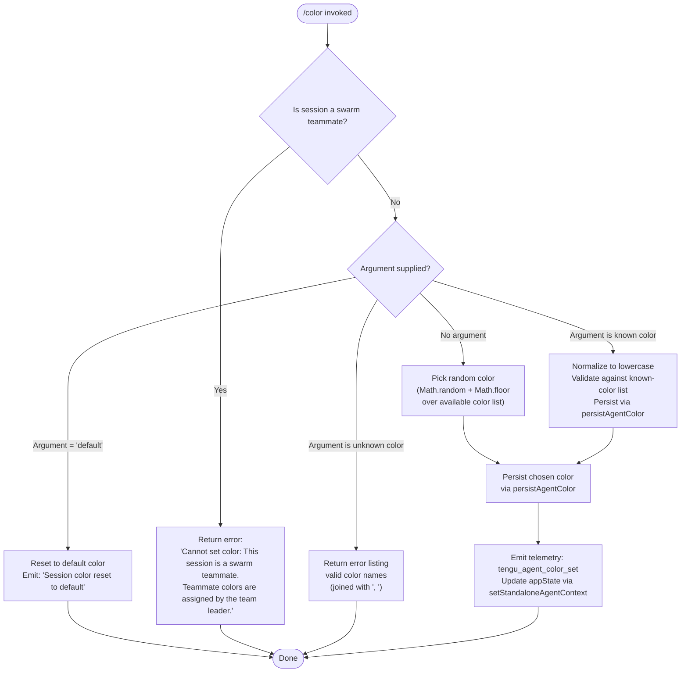

# `/color`

> Analysis basis: CC v2.1.133 bundle.js (AST extraction + Claude interpretation)
> Minimum version: v2.1.133

---

## Overview

The `/color` command sets the prompt bar color for the current Claude Code session. It accepts an optional color name argument; when invoked without an argument (or with `"default"`), it resets the prompt bar to its default appearance. In swarm-agent sessions, the command is blocked because teammate colors are controlled exclusively by the swarm team leader.

---

## Registration

| Field | Value |
|---|---|
| type | `local-jsx` |
| name | `color` |
| description | Set the prompt bar color for this session |
| argumentHint | *(none)* |
| immediate | `true` |
| module\_id | `Qo9` |

Analysis basis: CC v2.1.133 bundle.js:+9844233

---

## Input Branching

The command handler (`commandExecutor`) dispatches across four distinct paths depending on session context and the value of the argument supplied.



Analysis basis: CC v2.1.133 bundle.js:+9843220 – +9843662

---

## Behavioral Spec

### Swarm-Teammate Guard

Before any color logic runs, the handler checks whether the current session is a swarm teammate agent by reading application state through the global store accessor.

```
function checkSwarmGuard(appStateStore):
    currentState = appStateStore.getStore()
    if currentState.isSwarmTeammate == true:
        return errorResult(
            "Cannot set color: This session is a swarm teammate. " +
            "Teammate colors are assigned by the team leader."
        )
    return null  // guard passed
```

Analysis basis: CC v2.1.133 bundle.js:+9843220, +9843231, +2125187, +2124046

---

### Argument Normalization and Validation

After the swarm guard passes, the raw argument string is normalized to lowercase and checked against the list of recognized color identifiers (`knownColorList`).

```
function normalizeAndValidate(rawArgument, knownColorList):
    normalized = rawArgument.toLowerCase()
    if knownColorList.includes(normalized):
        return { valid: true, color: normalized }
    else:
        return {
            valid: false,
            message: "Unknown color. Valid colors: " + knownColorList.join(", ")
        }
```

Analysis basis: CC v2.1.133 bundle.js:+9843403, +9843421, +9843445, +9843467, +9843475

---

### Random Color Selection

When no argument is provided, the handler selects a color at random from the known-color list using integer-floor sampling.

```
function selectRandomColor(knownColorList):
    index = Math.floor(Math.random() * knownColorList.length)
    return knownColorList[index]
```

Analysis basis: CC v2.1.133 bundle.js:+9843366, +9843377

---

### Default Reset Path

When the argument resolves to `"default"`, the session color is cleared and a confirmation message is surfaced to the user.

```
function resetToDefault(appState):
    appState.promptBarColor = "default"
    return successResult("Session color reset to default")
```

The string constant `"default"` is the sentinel value that triggers this branch.
Analysis basis: CC v2.1.133 bundle.js:+9843565, +9843673

---

### Color Persistence (`persistAgentColor`)

Once a valid non-default color is resolved (whether via random selection or explicit argument), it is persisted to durable storage so the color survives process restarts within the session.

```
function persistAgentColor(color, storageConfig):
    // Ensure parent directory exists
    targetDir = path.dirname(storageConfig.filePath)
    fs.mkdirSync(targetDir, { recursive: true })

    // Write color entry, keyed "agent-color", to append-style config file
    // Uses fixed-width slots: 384 bytes for entry body, 448 bytes for directory record
    fs.appendFileSync(
        storageConfig.filePath,
        serializeEntry("agent-color", color)
    )
    // Emit telemetry after successful write
    emitTelemetry("tengu_agent_color_set", { color: color })
```

The persistence key is the string `"agent-color"`.
Entry body slot size: 384 bytes. Directory record slot size: 448 bytes.

Analysis basis: CC v2.1.133 bundle.js:+11832965, +11829572, +11829593, +11829632, +11829644, +11829620, +11829664, +11833049

---

### App-State Update

After persistence, the handler calls `setStandaloneAgentContext` on the application state to propagate the new color into the live UI without requiring a restart.

```
function applyColorToAppState(appStateHandle, color):
    appStateHandle.setStandaloneAgentContext({ promptBarColor: color })
```

Analysis basis: CC v2.1.133 bundle.js:+9843614

---

### Response Rendering (`renderColorResponse`)

The JSX render function (`responseRenderer`) builds the command output. It reads current app state, constructs a result message, and may pad display strings to a fixed column width of 40 characters.

```
function renderColorResponse(appState, resultMessage):
    lines = resultMessage.lines.map(line =>
        line.padEnd(40, " ")
    )
    return renderJSX(lines)
```

Padding width: 40 characters.
Analysis basis: CC v2.1.133 bundle.js:+9843759, +9843814, +9843819, +9843849, +9843901, +9843919, +14181334, +14179342, +14179363

---

### Context Initialization (`initializeAgentContext`)

The command initializes a standalone agent context before executing, which involves resolving the working directory path via `path.join`, reading a file cache (`fileCache`), and loading agent state ordering fields (`"order"`, `"stateOrder"`).

```
function initializeAgentContext(workDir, fileCache):
    resolvedPath = path.join(workDir, ...)
    cachedEntry  = fileCache.get(resolvedPath)
    if cachedEntry is missing:
        raw = fs.readFile(resolvedPath, "utf-8")
        parsed = parseAgentState(raw)
        // Validate ordering fields: "order", "stateOrder"
        // Cache result with key limit 1000 entries
        fileCache.set(resolvedPath, parsed)
    return cachedEntry or parsed
```

File encoding: `"utf-8"`. Cache eviction threshold: 1000 entries.
Analysis basis: CC v2.1.133 bundle.js:+3883618, +3880692, +3880700, +3881339, +3881424, +3881437, +3881366, +3881387, +3881837, +3882301

---

## State & Side Effects

| Item | Detail |
|---|---|
| Telemetry | `tengu_agent_color_set` — fired once per successful color set (not fired on reset-to-default or error paths) |
| Hook registration | `immediate: true` — command executes without waiting for the user to press Enter |
| appState changes | `setStandaloneAgentContext` is called to update the live prompt-bar color in the running UI session |
| File persistence | Color is written to a session-scoped config file under a managed directory; parent directory is created if absent |
| File cache | Agent context file cache is consulted and populated during initialization; evicts at 1000 entries |
| Sound | <!-- TODO: not found in depth-2 traversal; needs --depth 4 --> |
| Swarm block | In swarm-teammate sessions, the command returns an error immediately and performs no state mutation |

Analysis basis: CC v2.1.133 bundle.js:+11833049, +9843614, +9844233, +3882301

---

## Version History

| Version | Change |
|---|---|
| v2.1.133 | Initial analysis — swarm guard, random selection, default reset, file persistence, and telemetry documented |

---

## Common Mistakes

1. **Using `/color` inside a swarm teammate session** — the command is unconditionally blocked; only the team leader agent may assign colors to teammates. The error message is explicit but non-actionable from within the teammate session.
2. **Expecting persistence across unrelated sessions** — the `"agent-color"` entry is written to a session-scoped file; a brand-new session will not inherit a color set in a previous one unless the same file path is reused.
3. **Supplying a color name with mixed case** — the argument is normalized to lowercase before validation, so `"Red"` and `"RED"` are equivalent to `"red"`. However, if the exact lowercase form is not in the known-color list, the command will reject the input and list valid names.
4. **Omitting the argument expecting a "no-op"** — invoking `/color` with no argument does **not** reset to default; it triggers **random color selection**. Use `/color default` explicitly to reset.
5. **Assuming instant disk durability** — the persistence layer uses `appendFileSync` with directory creation; if the process is killed between directory creation and the append, the file may be partially written.

---

## Appendix — Identifier Mapping

> For bundle debugging only. Identifiers change across versions.

| Identifier | Role |
|---|---|
| `j67` | Module entry point / command export object |
| `L38` | Main command handler / executor function |
| `m7` | Swarm-teammate session check helper |
| `pP` | Global store accessor (reads application state store) |
| `v6` | JSX/React element factory |
| `ef` | Inline result message renderer |
| `tg` | Text node or styled span builder (used by result renderer) |
| `LA` | Layout or alignment helper (used by result renderer) |
| `CJ6` | Color persistence orchestrator (`persistAgentColor`) |
| `HN` | Persistence inner write helper |
| `wVH` | Low-level file write helper (mkdir + appendFileSync) |
| `RK` | Post-write telemetry dispatcher |
| `d` | Telemetry event emitter (final sink) |
| `A` | App-state handle (exposes `setStandaloneAgentContext`) |
| `tn6` | Agent context initializer |
| `xL` | Working-directory path resolver (path.join wrapper) |
| `vW` | Basename extractor utility |
| `H` | Random delay / jitter utility (Math.random + setTimeout) |
| `r9` | File cache read/write coordinator |
| `lP` | File cache entry deleter |
| `Pf` | Agent state file loader (readFile + cache population) |
| `D8` | ENOENT / missing-file error handler |
| `fH` | Error logging and push handler |
| `P67` | Response render function (JSX output builder) |
| `dl` | App-state reader inside render function |
| `L` | Display line formatter (padEnd wrapper) |
| `Qt` | Final JSX output assembler |
| `_` | String utility namespace (toLowerCase, etc.) |
| `f` | Closeable resource / string fragment handle |