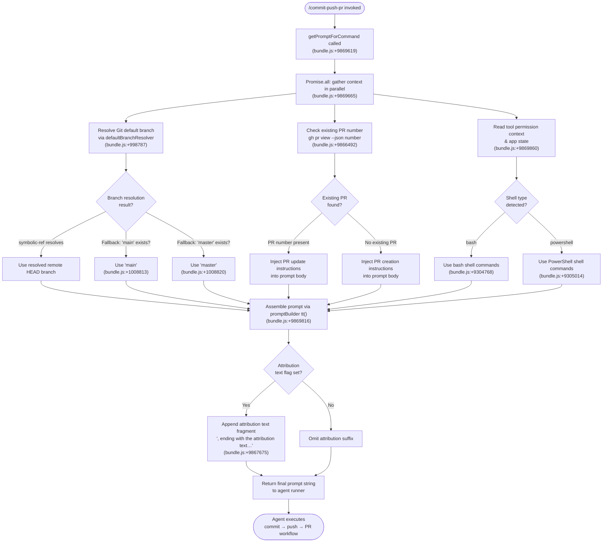

# `/commit-push-pr`

> Analysis basis: CC v2.1.133 bundle.js (AST extraction + Claude interpretation)
> Minimum version: v2.1.133

---

## Overview

`/commit-push-pr` is a `prompt`-type slash command that instructs the Claude Code agent to perform a three-step Git workflow: stage and commit all current changes, push the resulting commit to a remote branch, and then open a pull request via the GitHub CLI (`gh`). The command generates its agent-facing prompt at invocation time through the `getPromptForCommand` handler method, which resolves contextual details such as the current Git default branch and any existing PR number before composing the final instruction.

---

## Registration

| Field | Value |
|---|---|
| `type` | `prompt` |
| `name` | `commit-push-pr` |
| `description` | Commit, push, and open a PR |
| `loc_byte` | `9869415` |
| `loc_byte_end` | `9870155` |
| `loc_line` | `5636` |
| `handler_method` | `getPromptForCommand` |
| `handler_method_start` | `9869619` |
| `handler_method_end` | `9870154` |
| `prompt_body.length` | `203` characters |
| `prompt_body.trace` | `call→tt(...) (1 literals)` |
| `arbor_handler.name` | `getPromptForCommand` |
| `arbor_handler.kind` | `Method` |
| `arbor_handler.resolution_path` | `direct` |
| `arbor_handler.fqn` | `claude-2.1.133::getPromptForCommand` |
| `arbor_handler.n_hits` | `4` |

Analysis basis: CC v2.1.133 bundle.js:+9869415

---

## Input Branching

The handler resolves multiple contextual state dimensions before building the prompt string. Five or more distinct code paths exist (shell type, OS platform, existing PR presence, default-branch resolution, and attribution-text inclusion), so a Mermaid flowchart is used.



---

## Behavioral Spec

### Handler Entry — `getPromptForCommand`

The registration object carries the handler inline as an `ObjectMethod` named `getPromptForCommand`. Arbor resolved this via `direct` path (symbol falls inside the registration byte range `9869415`–`9870155`). The BFS synthetic entry `__handler_commit-push-pr` is bookkeeping only; the real bundle name is `getPromptForCommand`.

Analysis basis: CC v2.1.133 bundle.js:+9869619

### Context Gathering

```
async function getPromptForCommand(appContext):
    [defaultBranch, existingPrJson, permContext, appState] =
        await Promise.all([
            resolveDefaultBranch(appContext),   // defaultBranchResolver
            runGhPrView(appContext),             // ka9 / ya9
            appContext.getToolPermissionContext(),
            appContext.getAppState()
        ])
    return buildPrompt(defaultBranch, existingPrJson, permContext, appState)
```

Analysis basis: CC v2.1.133 bundle.js:+9869665

### Default Branch Resolution

`resolveDefaultBranch` (identifier `LZ`) operates as follows:

```
function resolveDefaultBranch(ctx):
    // Attempt 1: ask Git for the remote HEAD pointer
    result = runGit(["symbolic-ref", "--short", "refs/remotes/origin/HEAD"])
    if result.exitCode == 0:
        branch = result.stdout.trim()
        // Strip leading "origin/" if present
        return branch
    
    // Attempt 2: look up cached "defaultBranch" key from H4H store
    cached = H4H.get("defaultBranch")
    if cached:
        return cached

    // Attempt 3: check if "main" ref exists
    mainExists = runGit(["show-ref", "--verify", "--quiet", "refs/remotes/origin/main"])
    if mainExists.exitCode == 0:
        return "main"

    // Attempt 4: check if "master" ref exists
    masterExists = runGit(["show-ref", "--verify", "--quiet", "refs/remotes/origin/master"])
    if masterExists.exitCode == 0:
        return "master"

    // Final fallback
    return "main"
```

Analysis basis: CC v2.1.133 bundle.js:+1008633 (resolver entry), +998787 (`"defaultBranch"` key), +1008675 (`"symbolic-ref"`), +1008813 (`"main"`), +1008820 (`"master"`), +1008882 (`"show-ref"`), +1008893 (`"--verify"`), +1008904 (`"--quiet"`)

### Existing PR Detection

`existingPrDetector` (identifier `ka9`) shells out to `gh pr view` using the appropriate shell syntax for the detected platform:

```
function detectExistingPr(ctx):
    shell = detectShell(ctx)   // "bash" or "powershell"
    if shell == "bash":
        cmd = "gh pr view --json number 2>/dev/null || true"
    else:  // powershell
        cmd = "gh pr view --json number 2>$null; if (-not $?) { \"\" }"
    
    output = runShellCommand(cmd)
    return parseJsonOrEmpty(output)
```

Analysis basis: CC v2.1.133 bundle.js:+9866492 (`bash` variant), +9866539 (`powershell` variant), +9865610 (detector entry `tZH`), +9869706 (`ka9` call site)

### Shell Detection

`shellTypeResolver` (identifier `tZH` / inner `mq`) checks whether the current runtime shell is `"bash"` or `"powershell"`:

```
function resolveShellType(ctx):
    shellName = ctx.getShell().toLowerCase().trim()
    if shellName == "bash":
        return "bash"
    if shellName == "powershell":
        return "powershell"
    return "bash"   // default
```

Analysis basis: CC v2.1.133 bundle.js:+9304768 (`"bash"`), +9305014 (`"powershell"`)

### Prompt Construction — `tt()`

`promptBuilder` (identifier `tt`) assembles the final string sent to the agent. The body is approximately 203 characters before dynamic interpolation and is constructed via a tagged-template / string-join helper. Key observable behaviors derived from the call graph and literals:

```
function buildPromptString(defaultBranch, existingPr, shellType, includeAttribution):
    // 1. Resolve model-context suffix (e.g., " (1M context)")
    //    used only if the current model supports extended context
    
    // 2. Replace any "`!`" escape sequences in shell commands
    //    (bundle.js:+9305084 literal "!`")
    
    // 3. Determine PR action phrase
    if existingPr.number is not null:
        prAction = "update the existing PR #" + existingPr.number
    else:
        prAction = "open a new PR"
    
    // 4. Compose core instruction: commit staged/unstaged changes,
    //    push to remote, then perform prAction against defaultBranch
    
    // 5. If includeAttribution:
    //    append ", ending with the attribution text shown in the example below"
    //    (bundle.js:+9867675)
    
    // 6. Append deduplicated memory/memories sections if present
    //    (bundle.js:+9584431, +9584440)
    
    return joinedPromptString
```

Analysis basis: CC v2.1.133 bundle.js:+9869816 (`tt` call site), +9305055 (`H.matchAll`), +9305073 (`H.includes`), +9305127 (`Promise.all`), +9867675 (attribution literal), +9305610 (`L.replace`)

### Attribution Text Handling

When the user's session has the PR-attribution feature flag enabled, the prompt body includes a trailing instruction fragment (citing the literal at bundle.js:+9867675: `", ending with the attribution text shown in the example below"`). This tells the agent to append a standardised "Generated with Claude Code" attribution line to the PR description.

Analysis basis: CC v2.1.133 bundle.js:+9867675

### PR Attribution Fallback Logging

If PR attribution data cannot be resolved, a debug log entry is emitted with the message `"PR Attribution: returning default (no data)"`.

Analysis basis: CC v2.1.133 bundle.js:+9584356

### Tool Permission Context

At invocation the handler reads both `getToolPermissionContext()` and `getAppState()` from the calling context. These values are forwarded into the prompt builder to allow the agent runner (`ZJ` / `bt4` / `Rt4`) to apply standard Bash-tool permission checks before executing any shell commands the agent subsequently emits.

Analysis basis: CC v2.1.133 bundle.js:+9869860 (`A.getToolPermissionContext`), +9869976 (`A.getAppState`)

### Command Name Literal

The string `"/commit-push-pr"` appears at bundle.js:+9870133, confirming this is the canonical self-referencing name used inside the registration object's closing section.

Analysis basis: CC v2.1.133 bundle.js:+9870133

---

## State & Side Effects

| Item | Detail |
|---|---|
| Telemetry — `tengu_auto_mode_fallback_to_ask` | Emitted if the auto-mode classifier falls back to asking for permission during subsequent Bash execution (bundle.js:+9659457) |
| Telemetry — `tengu_auto_mode_decision` | Emitted with classifier decision data for each Bash tool call the agent makes (bundle.js:+9660229) |
| Telemetry — `tengu_auto_mode_outcome` | Emitted after the auto-mode classification resolves (bundle.js:+7940063) |
| Telemetry — `tengu_auto_mode_config` | Emitted with auto-mode classifier configuration snapshot (bundle.js:+7939203) |
| Telemetry — `tengu_bash_allowlist_strip_all` | Emitted if all allowlist entries are stripped from Bash permission context (bundle.js:+9661537) |
| Telemetry — `tengu_tool_empty_result` | Emitted if a Bash tool call returns an empty result (bundle.js:+4391922) |
| Telemetry — `tengu_tool_result_persisted` | Emitted after a tool result is successfully persisted to transcript (bundle.js:+4392162) |
| Telemetry — `tengu_iron_gate_closed` | Emitted when auto-mode classifier is unavailable and request is denied (bundle.js:+9664063) |
| Telemetry — `tengu_auto_mode_denial_limit_exceeded` | Emitted if the agent exceeds the classifier denial limit in headless mode (bundle.js:+9653518) |
| Telemetry — `tengu_cobalt_ridge` | Emitted in the prompt-builder's `ox` path (bundle.js:+4266841) |
| Telemetry — `tengu_auto_mode_malformed_tool_input` | Emitted if the classifier receives a malformed tool-input block (bundle.js:+7925507) |
| `appState` changes | `setAppState` may be called by `ZlH` to update conversation state after the agent processes tool results (bundle.js:+9653064) |
| Hook registration | The permission layer (`IK_`) registers `"exit"` and `"error"` event listeners on the child process handle via `H.on` (bundle.js:+982792, +982797, +982844) |
| Shell process lifecycle | Bash/PowerShell child processes are spawned by `sJH`; SIGTERM (bundle.js:+975621) then SIGKILL escalation is used for cleanup |
| Sound | <!-- TODO: not found in depth-2 traversal; needs --depth 4 --> |

---

## Version History

| Version | Change |
|---|---|
| v2.1.133 | Initial analysis — `getPromptForCommand` handler confirmed at byte range `9869619`–`9870154`; PowerShell variant of `gh pr view` added; PR attribution suffix feature present |

---

## Common Mistakes

1. **Running without `gh` CLI installed.** The command shells out to `gh pr view` and ultimately `gh pr create` / `gh pr edit`. If the GitHub CLI is not on `PATH`, the agent will encounter a command-not-found error and the PR step will fail silently (the `2>/dev/null || true` guard swallows the error during PR detection).

2. **No remote configured.** If the repository has no `origin` remote, the default-branch resolver's `git symbolic-ref refs/remotes/origin/HEAD` call will fail and all four fallback probes will also fail, leaving the agent with the hardcoded `"main"` default, which may not match the actual repository structure.

3. **Uncommitted merge conflicts.** The command instructs the agent to commit *all* changes. If the working tree contains conflict markers, `git commit` will fail. The agent will typically surface the error but cannot resolve merge conflicts autonomously.

4. **Wrong shell inferred on Windows without Git Bash.** On Windows, if Git Bash is absent and the resolved shell is `"powershell"`, the PowerShell variant of the `gh pr view` command is used. Users who force `shell: bash` in their configuration without Git Bash installed will receive the error described in the `prompt_body` trace.

5. **Attribution text appended unexpectedly.** If the PR-attribution feature flag is active, the agent will append a "Generated with Claude Code" footer to every PR description created through this command. Users who want clean PR descriptions should be aware this behavior is controlled by a server-side flag, not a local setting.

6. **Invoking on a detached HEAD.** The command does not explicitly detect a detached HEAD state. The push step will fail because there is no upstream branch reference; the default-branch resolver may still succeed if the remote refs are present, leading to a confusing error only at push time.

---

## Appendix — Identifier Mapping

> For bundle debugging only. Identifiers change across versions.

| Identifier | Role |
|---|---|
| `__handler_commit-push-pr` | BFS synthetic entry point for the command handler (not a real bundle symbol) |
| `LZ` | Default-branch resolver — orchestrates `git symbolic-ref` and fallback probes |
| `Gh8` | Inner helper inside default-branch resolver; performs `H4H.get("defaultBranch")` cache lookup |
| `GA` | Async shell executor — runs Git/shell subprocesses and collects stdout |
| `sJH` | Low-level child-process spawner with event wiring (exit, error, SIGTERM/SIGKILL) |
| `BK_` | Platform-normalizer for shell executable paths (handles `win32` / `.exe` / `cmd /q`) |
| `Kh8` | Stdout stream handler within shell executor |
| `fh8` | Stderr stream handler within shell executor |
| `$h8` | Buffered-data aggregator for shell executor |
| `iL_` | Numeric validation helper (`Number.isFinite` guard; throws `TypeError`) |
| `UH6` | Exit-code result builder — converts raw process exit into structured result |
| `Lh8` | `Reflect.apply` / `Reflect.defineProperty` wrapper for process object patching |
| `IK_` | Event-listener registrar — attaches `"exit"` and `"error"` handlers to process handle |
| `nL_` | Timeout race helper — `Promise.race` with `setTimeout`/`clearTimeout` |
| `rL_` | Kill-and-finalize helper — calls `H.kill` then `q.finally` |
| `cL_` | Stdout pipe builder (bound method) |
| `lL_` | Kill handler (bound method) |
| `TK_` | Multi-stream collector — `Promise.all` over stdout/stderr/all streams |
| `QH6` | Result formatter (`Uy8`) |
| `GK_` | Stream pipeline connector (`_.pipe`) |
| `EK_` | Stream adder (`_.add`) |
| `tL_` | Readline binding helper (`ry8.bind`) |
| `Y` | Background-daemon session manager (memory-aware spawn loop) |
| `J6` | Session registry — manages `b5H`, `cU`, `pq6` sets |
| `sFA` | Free-memory reporter for macOS (feeds `tengu_bg_low_mem_mb`) |
| `lFA` | Spare-session spawner — `Bun.spawn` with `--bg-pty-host` / `--bg-spare` args |
| `fH` | Logging helper — pushes to `cyH` log ring and calls `yQ.logError` |
| `qPL` | String coercion helper (`String(...)`) |
| `Tn9` | Prompt-context assembler — gathers conversation history, settings, MCP tools, model info |
| `NNH` | Remote-type checker (literal `"remote"`) |
| `i46` | MCP tool-set accessor |
| `JD` | API environment resolver (`_local_`, `_staging_`, production URLs) |
| `A_` | Module initialization helper (`__esModule`, `SgA.set`) |
| `PqA` | API URL constructor (`IUK`) |
| `mA` | Settings loader orchestrator — calls `db`/`vWL` and emits `settings_load_*` telemetry |
| `db` | Settings-from-disk reader (`Yp`, `vWL`, `Oq`, `$cA`) |
| `vWL` | Settings file parser and merger (policy + flag settings) |
| `Oq` | Memory-usage sampler (`process.memoryUsage`) |
| `H` | Jitter-sleep helper for daemon reconnection (`Math.random` + `setTimeout`) |
| `k` | Shell command formatter — uppercases, trims, redacts sensitive values |
| `Ztq` | Locale/encoding initializer (`aT`, `Ttq`, `xcA`) |
| `xcA` | OS-level encoding setup (`doq`, `coq`) |
| `SH` | JSON serializer (`JSON.stringify`) |
| `Uf` | Sensitive-value redactor — replaces secrets with `"[REDACTED]"` |
| `rnA` | Regex-map builder for redaction patterns |
| `LkH` | Terminal write helper (`UnA` / `H.write`) |
| `vtq` | Conversation-file writer — `appendFile`, `mkdir`, `rename`, checksum via `Buffer.byteLength` |
| `uNH` | Debounced I/O flusher — `setTimeout`/`setImmediate`/`clearTimeout` |
| `aHH` | Atomic write helper (`tnA`, `iwH.join`, `n8`, `v6`) |
| `dG8` | EISDIR error handler (`w8`) |
| `_iA` | Path joiner for conversation files |
| `AiA` | File-rename-with-stat helper (`$V.stat`, `$V.rename`, `$V.unlink`) |
| `Vtq` | Append-file-with-rotation variant |
| `y1` | Active-file-set tracker (`d08.add`, `d08.delete`, `Object.assign`) |
| `Es4` | MCP tool enumerator (`Array.from`, `_.keys`, `Object.keys`, `ZOA`) |
| `ZOA` | MCP server tool loader — stat, hash, and map individual tool definitions |
| `w$H` | Model-info resolver (`N6`, `YK`, `LA`) |
| `eK9` | File-extension classifier for MCP tool schemas |
| `tf4` | MCP tool diff runner (`git diff --cached --name-status`, limit 5000) |
| `A49` | MCP tool stat reader (`q49.stat`, `Math.max`, `Math.round`, `parseInt`) |
| `Is4` | Conversation-history slicer — `findLastIndex`, `slice`, `Gs4`, `Zs4` |
| `ef` | Conversation-file path resolver (`tg`, `L$`, `LA`, `O$.join`) |
| `WN6` | Binary file reader (`Buffer.allocUnsafe`, `xb.open`, `f.read`, 8 MB limit) |
| `jXL` | `compact_boundary` marker reader (`Buffer.from`) |
| `EXL` | Line-delimited chunk parser (utf-8 decoder) |
| `TXL` | Binary chunk parser variant |
| `ZXL` | Buffer copy accumulator |
| `IXL` | Fixed-size buffer reader |
| `VXL` | Final-chunk boundary parser |
| `LXH` | Conversation JSON parser — delegates to `UPL`, `FPL`, `BPL` |
| `pPL` | JSON parser entry guard |
| `UPL` | Index-of-based JSON splitter |
| `FPL` | NDJSON line parser (`JSON.parse` per line) |
| `BPL` | Streaming JSON parser variant |
| `Gs4` | User-message filter (`H.filter` on role = `"user"`) |
| `Ws4` | Sidechain / meta / compactSummary message filter |
| `Zs4` | Tool-use message classifier (`Ts4.has`, `uIA`) |
| `uIA` | Team-member file checker (`Xn9.isTeamMemFile`) |
| `B9` | Model display-name builder (`qx6`, `gY`, `m08`, `mP`) |
| `qx6` | Model-entry fetcher (`mA`, `Object.entries`) |
| `gY` | Model-string normalizer (`H.toLowerCase`, `H.includes`, `H.replace`) |
| `mP` | Model-name pattern replacer |
| `mq` | Shell/model resolution hub — calls `PU`, `Gq`, `fX` |
| `PU` | Primary model resolver (`AV`, `L_`, `v7H`) |
| `v7H` | Model-string parser and token-count annotator |
| `Gq` | Canonical model-ID normalizer — handles opus/sonnet/haiku aliases and `"opusplan"` |
| `B0` | `T8H` model-tier resolver |
| `W8H` | Model include-list checker (`P8H.includes`) |
| `pV` | Model provider pair resolver (`zM`, `DM`) |
| `URH` | Provider DM resolver |
| `Ek` | Provider/model struct builder (`zM`, `DM`) |
| `Lc_` | Wraps `Ek` for provider selection |
| `zM` | First-party provider resolver (`Q_`) |
| `hu6` | Extended-context model checker (`X6K.includes`) |
| `BRH` | Hex-color lookup for model badge (`kH`) |
| `fX` | Shell-and-model combiner (`Gq`, `fW`) |
| `fW` | Full model-context struct builder (`C_`, `kr`, `k7H`, `FRH`, `Ek`, `LX`, `zM`, `Q_`, `DM`, `pV`) |
| `L49` | Model-ID include-list checker |
| `ka9` | Existing-PR detector — orchestrates `tZH`, `ya9`, `KL` |
| `tZH` | Core PR-detection logic — runs `gh pr view` via shell, feeds `mq`/`N7H`/`Fg8`/`mA` |
| `N7H` | PR JSON field extractor (`H.endsWith`, `B9`) |
| `Fg8` | PR field formatter (`N7H` wrapper) |
| `ya9` | PR-output sanitizer (`H.replace`) |
| `KL` | Shell-command runner used by PR detector (`a6`, `v6H`) |
| `tt` | Prompt-string builder — the core `getPromptForCommand` implementation |
| `ox` | Prompt preamble builder (`a6`, `kH`, `Zq`, `v6H`, `J6`; emits `tengu_cobalt_ridge`) |
| `kH` | String converter (`String(...)`) |
| `Zq` | Alternative string converter |
| `Bo6` | Attribution-text replacer (`H.replace`) |
| `ZJ` | Agent agentic-loop runner — permission gating, tool dispatch, state management |
| `bt4` | Bash-tool permission evaluator (sandboxing, auto-allow, deny/ask/allow rules) |
| `D58` | Permission state initializer (`QzH`, `oIA`, `Di9`) |
| `Yi9` | Permission state setter (`vlH`, `oIA`, `Di9`) |
| `av` | Sandboxing-aware permission gater (`NW`, `tfH`, `gA.isSandboxingEnabled`) |
| `x5` | Permission-reason accumulator (`n4`, `YJ6`, `Wa`, `d8`, `y6H`) |
| `CM8` | Recursive safety-check helper |
| `gzH` | Dangerous-operation detector (`"Dangerous rm operation"`, `"Dangerous rmdir operation"`) |
| `St4` | Permission-state reader (`VlH`, `oIA`) |
| `ZlH` | App-state merger (`Object.assign`, `H.setAppState`) |
| `A9` | `Object.hasOwn` / `H.startsWith` guard |
| `re6` | Permission-result mapper |
| `Xb` | High-risk action annotator |
| `hjA` | Auto-mode allowlist checker |
| `ut1` | Allowlist set adder (`q.add`) |
| `kz6` | Auto-mode XML classifier orchestrator (stage1 / stage2, timeout, `tengu_auto_mode_*` events) |
| `qT9` | Classifier input setter (`A.set`) |
| `KT9` | Classifier response parser (`LT9`) |
| `iE9` | Classifier model selector (`J6`, `mq`) |
| `wk4` | Classifier prompt template filler (`<permissions_template>`, `<settings_deny_rules>`) |
| `_T9` | Classifier input builder (`attachment`, `queued_command` fields) |
| `zk4` | Classifier stage orchestrator (`f08`, `BF`, `XL8`) |
| `LT9` | Classifier response decoder (`q.toAutoClassifierInput`, `rE9`, `SH`) |
| `w` | Background-session subprocess wrapper (dispatch, kill, memory checks) |
| `wJ` | Classifier result formatter (`UMH`, `Em1`, `y76`, `QZ`) |
| `XL8` | Auto-mode timer/label helper (`zTH`, `"auto_mode"`, `"1h"`) |
| `Zk4` | Classifier fast-path handler (`OT9`) |
| `Ek4` | Two-stage classifier runner (stage1 → stage2 decision tree) |
| `Ik4` | Classifier interrupt handler (`OT9`) |
| `nE9` | Classifier no-tool-use detector |
| `a1H` | Classifier input assembler (`I9`, `Array.isArray`, `xP`, `q.filter`) |
| `NjA` | Classifier output formatter (`YT`, `Tk4`, `NR`, `f`) |
| `VjA` | Classifier verdict mapper |
| `TaH` | Classifier timing tracker |
| `vjA` | Classifier secondary verdict mapper |
| `BE9` | Classifier tool-block finder (`H.find`) |
| `UF` | Auto-mode outcome reporter (`hH`, `uH`, `Z8`, `d`; emits `tengu_auto_mode_outcome`) |
| `jL8` | Classifier token counter |
| `FE9` | Classifier schema validator (`A.safeParse`) |
| `DT9` | Classifier result persister (`s1A`) |
| `vH` | String coercer (`String(...)`) |
| `AT9` | Classifier prompt writer (`$TH.mkdir`, `$TH.writeFile`) |
| `zT9` | Classifier timeout handler (`dwH`, `w8`, `"wall_clock_timeout"`, `"connection_timeout"`, `"connection_error"`) |
| `t_H` | Allowlist entry remover (`q.delete`) |
| `ku6` | Permission context merger (`V7H`) |
| `V7H` | Context field combiner (`z6K`, `O6K`) |
| `$aH` | `inputTokens` usage accumulator |
| `xN` | `outputTokens` usage accumulator |
| `OaH` | `cacheReadInputTokens` usage accumulator |
| `zaH` | `cacheCreationInputTokens` usage accumulator |
| `VE` | Session registry updater (`J6`) |
| `Gi9` | Agent-loop post-iteration hook |
| `Zt1` | Agent-loop abort handler |
| `Ct4` | Agent-state updater (`It1`, `d`, `A9`, `k`, `ZlH`) |
| `Rt4` | Bash-tool executor — full lifecycle including permission request, hook rewrite, run, result persist |
| `r9H` | Permission request builder (`PermissionRequest`, `aK`, `_P`) |
| `wJ6` | Hook-rewritten input handler |
| `LZH` | Permission re-evaluator after hook rewrite |
| `iS` | Hook result extractor (`za`) |
| `RZ` | Hook runner (`Wf`) |
| `HA` | Error stringifier (`Error`, `String`) |
| `ji9` | Post-tool cleanup hook |
| `Yw` | Stop-sequence / end-of-message handler |
| `si9` | UUID generator for stop sequence (`SG.randomUUID`) |
| `YpH` | Tool-result-to-block mapper (`gm1`, `Bm1`) |
| `gm1` | Tool result formatter (text/image/document content normalization) |
| `ZgK` | Empty-content checker (`H.trim`, `Array.isArray`, `H.every`) |
| `cm1` | Array-content type checker |
| `lm1` | Content reducer (`H.reduce`) |
| `gMH` | Large-result file writer (`Fo6.writeFile`; emits `tengu_tool_result_persisted`) |
| `dMH` | Result truncation helper |
| `QMH` | Result-size calculator (`p9`) |
| `Bm1` | Token-count limiter (`Number.isFinite`, `Math.min`) |
| `eQ9` | Prompt-section joiner (trims parts, joins with `q.join`) |
| `Oi4` | Prompt-section builder (`eQ9`, `vH`) |
| `d` | Generic deferred/cleanup value (context-dependent) |
| `A` | Generic array/accumulator (context-dependent) |
| `L` | Generic list/accumulator (context-dependent) |
| `K` | Generic set/registry (context-dependent) |
| `f` | Generic file handle / set (context-dependent) |
| `D` | Daemon supervisor write/config handler |
| `z` | Daemon stop controller (`hH`, `uH`, `bS`, `cC`) |
| `_` | Readable/writable stream or utility object (context-dependent) |
| `w` | Background-session process handle (context-dependent; dual use — see also agent loop) |
| `m08` | Model display-name override lookup |
| `F6` | File-type classifier helper |

---

Note: index built via Arbor fallback; some signals (telemetry, literals) may be missing — see arbor-fallback.js.