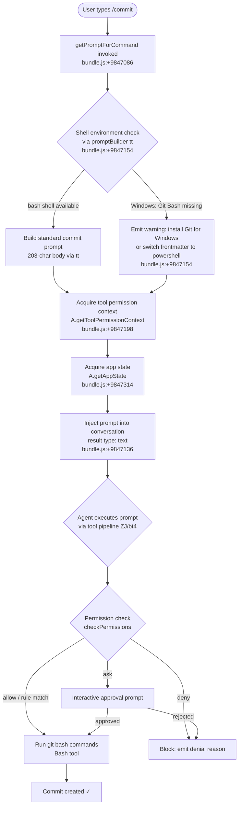

# `/commit`

> Analysis basis: CC v2.1.133 bundle.js (AST extraction + Claude interpretation)
> Minimum version: v2.1.133

---

## Overview

The `/commit` slash command instructs the Claude Code agent to create a git commit by composing a prompt that drives the agent through the standard tool-execution pipeline. It is a `prompt`-type command: invoking it constructs a natural-language instruction (via `getPromptForCommand`) and injects it into the active conversation, whereupon the agent uses its Bash tool to run git operations. The command also checks the shell environment before building the prompt and emits the literal `/commit` marker as part of the final prompt text.

---

## Registration

| Field | Value |
|---|---|
| type | `prompt` |
| name | `commit` |
| description | `Create a git commit` |
| loc_byte | `9846933` |
| loc_byte_end | `9847485` |
| loc_line | `5556` |
| handler_method | `getPromptForCommand` |
| handler_method_start | `9847080` |
| handler_method_end | `9847484` |
| prompt_body.length | `203` characters |
| prompt_body.trace | `call→tt(...) (1 literals)` |
| prompt_body.trace notes | The body is assembled by calling the prompt-builder `tt` with one string literal injected; the literal `"/commit"` appears at `+9847471` |
| arbor_handler.name | `getPromptForCommand` |
| arbor_handler.kind | `Method` |
| arbor_handler.resolution_path | `direct` (symbol falls inside the registration byte range) |
| arbor_handler.fqn | `claude-2.1.133::getPromptForCommand` |
| arbor_handler.n_hits | `3` |

Analysis basis: CC v2.1.133 bundle.js:+9846933

---

## Input Branching

The handler exhibits three or more distinct branches: (1) shell detection for Windows Git Bash vs PowerShell, (2) normal prompt construction and tool-permission context acquisition, and (3) the full agent tool-execution path including permission checks. A Mermaid flowchart is therefore used.



---

## Behavioral Spec

### 1. Handler Entry — `getPromptForCommand`

The Arbor-resolved handler `getPromptForCommand` is an ObjectMethod defined inline on the registration object (bytes `+9847080`–`+9847484`). It is the sole entry point when the user invokes `/commit`.

```
function getPromptForCommand(context):
    shellInfo = detectShellEnvironment(context)   // via promptBuilder
    if shellInfo.isWindows and not shellInfo.gitBashFound:
        warningFragment = buildWindowsShellWarning(
            requiredShell = "bash",
            installUrl    = "https://git-scm.com/downloads/win",
            fallback      = "powershell"
        )
    else:
        warningFragment = ""

    promptText = buildPromptBody(warningFragment)  // tt(), 203 chars total
    // promptText ends with the literal marker "/commit" (+9847471)

    permCtx  = context.getToolPermissionContext()  // +9847198
    appState = context.getAppState()               // +9847314

    return {
        type: "text",                              // +9847136
        content: promptText,
        permissionContext: permCtx,
        appState: appState
    }
```

Analysis basis: CC v2.1.133 bundle.js:+9847080

---

### 2. Prompt Assembly — `promptBuilder` (`tt`)

`tt` is the prompt-builder called by the handler. It accepts one string literal argument and returns the 203-character prompt body. It also resolves the environment alias table (`KL`/`ox`) and handles shell-type branching (`bash` at `+9304768`, `powershell` at `+9305014`).

```
function promptBuilder(shellLiteral):
    envAlias = resolveEnvironmentAlias()   // KL → ox
    if shellLiteral == "bash":
        shellOk = checkBashAvailability()
    elif shellLiteral == "powershell":
        shellOk = true

    if not shellOk:
        raise buildShellMissingError()     // Error() at +9304788

    parts = []
    for match in promptTemplate.matchAll(pattern):   // +9305055
        parts.push(processMatch(match))

    if promptTemplate.includes("!`"):                // +9305084 sentinel
        parts = sanitizeBacktickEscapes(parts)       // Bo6 at +9305090

    results = await Promise.all(parts)               // +9305127

    uuid    = crypto.randomUUID()                    // tQ9.randomUUID +9305527
    payload = assemblePayload(results, uuid)         // eQ9 at +9305585

    payload = payload.replace(/<placeholder>/, "")  // L.replace +9305610

    return payload
```

Analysis basis: CC v2.1.133 bundle.js:+9304777

---

### 3. Shell / Environment Resolution (`shellContextResolver` → `E67` → `tZH`)

Before the prompt is finalised, the handler calls `shellContextResolver` (`E67`) which in turn calls `environmentGatherer` (`tZH`). This chain collects:

- **Connection type** — the literal `"remote"` is tested at `+9581634`; local connections are identified by the `"_local_"` sentinel at `+4234082` and the `"localhost"` hostname at `+4234111`.
- **Model resolution** — `modelNormalizer` (`mq`) normalises the active model name: trims whitespace, lowercases, strips the `"[1M]"` suffix (`+2120429`), and maps tier aliases (`"opusplan"` → `+2120403`, `"sonnet"` → `+2120444`, `"haiku"` → `+2120483`, `"opus"` → `+2120522`, `"best"` → `+2120559`) against a concrete model list (`claude-opus-4-7` through `claude-3-5-haiku`).
- **Model display suffix** — `modelSuffixFormatter` (`N7H`) appends `" (1M context)"` for 1M-context variants (`+2119599`).
- **Settings load** — `settingsLoader` (`mA` → `db`) fires the `"loadSettingsFromDisk_end"` event at `+1168557`.

```
function shellContextResolver(context):
    env = environmentGatherer(context)      // tZH
    alias = environmentAliasBuilder(env)    // KL

    env.connectionType = env.isRemote ? "remote" : "_local_"
    env.modelId        = modelNormalizer(env.rawModelId)    // mq/Gq
    env.modelSuffix    = modelSuffixFormatter(env.modelId)  // N7H/B9
    env.settings       = settingsLoader()                   // mA/db

    return env
```

Analysis basis: CC v2.1.133 bundle.js:+9847117 (E67), +9581626 (tZH)

---

### 4. Tool Execution Pipeline (`toolExecutor` → `ZJ` → `bt4`)

After the prompt is injected, the agent's standard tool pipeline runs. The key sub-functions reached within depth-2 of `ZJ` are:

```
function toolExecutionCoordinator(toolCall, context):
    appState  = context.getAppState()           // +9658563
    permState = buildPermissionState(appState)  // bt4 at +9658521

    // Permission evaluation order:
    decision = evaluatePermissions(toolCall, permState)
    // Outcomes: "deny" (+9655382), "rule" (+9655410),
    //           "ask" (+9655631), "allow" (+9656615),
    //           "bypassPermissions" (+9656212), "plan" (+9656264)

    if decision == "deny":
        emitTelemetry("tengu_auto_mode_fallback_to_ask")   // +9659457
        return denyResult(toolCall)

    if decision == "ask":
        if context.isHeadless:
            raise "Action requires interactive approval..."  // +9659339
        return interactiveApproval(toolCall, context)

    if decision == "allow" or decision == "bypassPermissions":
        appState.setAppState(merge(appState, updatedInput))  // ZlH +9653064
        return dispatchToolCall(toolCall)                    // kz6

    // Safety checks for dangerous operations:
    if toolCall.input.includes("rm"):
        warn("Dangerous rm operation")     // +9656400
    if toolCall.input.includes("rmdir"):
        warn("Dangerous rmdir operation")  // +9656447
```

Analysis basis: CC v2.1.133 bundle.js:+9661139 (ZJ entry), +9655312 (bt4)

---

### 5. Permission Resolution Detail (`permissionEvaluator` → `bt4`)

```
function permissionEvaluator(toolCall, appState):
    // Step 1: rule-based check
    ruleResult = checkSettingsRules(toolCall)    // D58/Yi9
    if ruleResult.matched:
        return ruleResult.outcome   // "allow" | "deny"

    // Step 2: sandboxing
    if sandbox.isSandboxingEnabled():
        if sandbox.isAutoAllowBashIfSandboxedEnabled():
            return "allow"
        unsandboxedAllowed = sandbox.areUnsandboxedCommandsAllowed()
        // av at +9648192 / Vt4

    // Step 3: permission prompt tool
    // Resolves subcommandResults, passthrough, sandboxOverride,
    // workingDir, safetyCheck, asyncAgent fields
    // x5 at +9649272 / Wa / d8

    // Step 4: hook check
    hookResult = checkHooks(toolCall)            // fH at +9655861
    if hookResult.error:
        logError(hookResult)                     // yQ.logError

    // Step 5: auto-mode classifier
    classifierResult = runAutoModeClassifier()   // CM8 / gzH
    // Stages: xml_fast, xml_thinking, xml_2stage (+9929463–9929505)
    // Outcomes logged to tengu_auto_mode_decision (+9660229)

    return classifierResult.outcome
```

Analysis basis: CC v2.1.133 bundle.js:+9655312 (bt4), +9648192 (av)

---

### 6. Auto-Mode Classifier (`autoModeClassifier` → `kz6`)

The auto-mode classifier (`kz6`) is a multi-stage pipeline reached from `ZJ` at `+9661189`. It is relevant to `/commit` because running `git commit` via Bash always passes through this classifier in auto mode.

```
function autoModeClassifier(toolCall, context):
    config = loadAutoModeConfig()     // iE9 → mq/J6  (+7939200)
    // Emits: tengu_auto_mode_config  (+7939203)

    strategy = selectStrategy(config)
    // Strategies: "fast", "thinking", "both", "xml_2stage",
    //             "xml_fast", "xml_thinking"

    if strategy in ["xml_fast", "xml_2stage", "xml_thinking", "both"]:
        stage1 = runStage1Classifier(toolCall)   // Ek4
        // Max tokens stage 1: 256 (+7929845), 64 spare (+7929849)
        // Outcomes: "success", "refusal", "max_tokens",
        //           "policy_refusal", "unparseable", "parse_failure"
        if stage1.outcome == "success":
            // "Allowed by fast classifier" (+7930403)
            emit("tengu_auto_mode_outcome", stage1)
            return "allow"
        if stage1.outcome == "refusal":
            // "Blocked by fast classifier" (+7931021)
            if strategy == "xml_2stage":
                stage2 = runStage2Classifier(toolCall)  // Ek4 stage2
                // Max tokens stage 2: 4096 (+7931213)
            return stage2.outcome

    if classifierUnavailable:
        if context.isHeadless:
            // "tengu_iron_gate_closed" → abort agent  (+9664063)
            raise "Auto mode classifier unavailable, denying..."
        else:
            // fail open: "classifier_unavailable_fail_open" (+9664495)
            return "ask"

    emit("tengu_auto_mode_outcome")  // +7940063
    return resolvedOutcome
```

Analysis basis: CC v2.1.133 bundle.js:+9661189 (kz6 call), +7934962 (kz6 body)

---

### 7. Windows Shell Warning Logic

The prompt body (203 chars) contains a branch that fires when the host is Windows and Git Bash is not found. The relevant fragment (paraphrased, not quoted verbatim) explains that the skill requires `shell: bash` in frontmatter but Git Bash was not located, and directs the user to install Git for Windows (`https://git-scm.com/downloads/win`) or change the frontmatter to `shell: powershell`.

```
function buildWindowsShellWarning(shellRequired, installUrl, fallback):
    if shellRequired == "bash" and not gitBashDetected():
        return formatWarning(
            shell       = shellRequired,
            installUrl  = installUrl,
            alternative = fallback   // "powershell"
        )
    return ""
```

Analysis basis: CC v2.1.133 bundle.js:+9847154 (tt call in handler), +9305014 (powershell literal)

---

## State & Side Effects

| Item | Detail |
|---|---|
| Telemetry — `tengu_auto_mode_fallback_to_ask` | Fired when the permission evaluator demotes an auto-mode decision to interactive ask (`+9659457`) |
| Telemetry — `tengu_auto_mode_decision` | Fired after each permission decision in auto mode (`+9660229`) |
| Telemetry — `tengu_auto_mode_config` | Fired when the auto-mode classifier loads its configuration (`+7939203`) |
| Telemetry — `tengu_auto_mode_malformed_tool_input` | Fired when the classifier receives malformed tool input (`+7925507`) |
| Telemetry — `tengu_auto_mode_outcome` | Fired after classifier produces a final allow/deny outcome (`+7940063`) |
| Telemetry — `tengu_cobalt_ridge` | Fired during environment alias resolution (`+4266841`) |
| Telemetry — `tengu_bash_allowlist_strip_all` | Fired when the entire Bash allowlist is stripped (`+9661537`) |
| Telemetry — `tengu_iron_gate_closed` | Fired when the auto-mode classifier is unavailable in headless mode and the agent is aborted (`+9664063`) |
| Telemetry — `tengu_auto_mode_denial_limit_exceeded` | Fired when consecutive or total classifier denials exceed the configured limit (`+9653518`) |
| Telemetry — `tengu_tool_empty_result` | Fired when a tool returns an empty result (`+4391922`) |
| Telemetry — `tengu_tool_result_persisted` | Fired when a tool result is written to disk for persistence (`+4392162`) |
| Telemetry — `tengu_bg_dispatch_sigkill_escalate` | Fired when a background dispatch escalates to SIGKILL (`+14157040`) |
| Telemetry — `tengu_bg_dispatch_low_mem` | Fired when background dispatch detects low memory (`+14157619`) |
| Telemetry — `tengu_bg_spare_enable` | Fired when a spare background agent is enabled (`+14158234`) |
| Telemetry — `tengu_bg_spare_claim` | Fired when a spare background agent is claimed (`+14158355`) |
| Telemetry — `tengu_bg_spare_claim_fail` | Fired when claiming a spare background agent fails (`+14158618`) |
| appState changes | `ZlH` merges `updatedInput` into app state via `Object.assign` and calls `setAppState` (`+9653064`) |
| Permission context | `getToolPermissionContext` is acquired by the handler at `+9847198`; also updated via `q.setToolPermissionContext` at `+9652467` |
| File I/O | Tool results containing only text content may be written to disk via `Fo6.writeFile` (`+4390906`) when persistence is enabled |
| Process management | Background dispatch may spawn child processes (`gm.spawn` at `+14158677`) and send SIGKILL after 30 s (`+14156995`) / 15 s (`+14157006`) grace periods |
| UUID generation | Each tool invocation generates a UUID via `crypto.randomUUID` (`tQ9.randomUUID` at `+9305527`, `SG.randomUUID` via `si9` at `+9696397`) |
| Settings load side effect | `settingsLoader` (`mA`/`db`) emits `"loadSettingsFromDisk_end"` during environment resolution (`+1168557`) |
| Hook registration | `fH` registers/fires pre-execution hooks; errors are pushed to `cyH` and logged via `yQ.logError` (`+912821`, `+912861`) |
| Temp file cleanup | `q` calls `Ydq.unlinkSync` to clean up temporary files after use (`+14137065`) |

---

## Version History

| Version | Change |
|---|---|
| v2.1.133 | Initial analysis; `getPromptForCommand` confirmed as direct Arbor-resolved handler (3 hits); prompt body 203 chars; Windows Git Bash warning present |

---

## Common Mistakes

1. **Running `/commit` on a Windows host without Git for Windows installed** — the handler detects the missing `bash` shell and emits a warning rather than silently failing. Install Git for Windows from `https://git-scm.com/downloads/win` or change the skill frontmatter to `shell: powershell`.
2. **Expecting `/commit` to work in headless mode with auto-mode classifier unavailable** — when the classifier is down and the session is headless, the `tengu_iron_gate_closed` event fires and the agent is aborted. Run in interactive mode or ensure classifier availability.
3. **Assuming `/commit` bypasses normal permission checks** — it does not. The full `bt4`/`ZJ` permission pipeline applies, including sandbox rules, deny rules, hook checks, and the auto-mode classifier. A `deny` or unresolved `ask` in headless mode will block the commit.
4. **Triggering consecutive denial limits** — repeatedly running `/commit` in an auto-mode session where the classifier denies the Bash tool use will eventually fire `tengu_auto_mode_denial_limit_exceeded` and abort the agent (`+9653518`).
5. **Confusing `/commit` with a direct `git commit` wrapper** — it is a `prompt`-type command. It instructs the agent in natural language; the agent then decides how to run git operations via Bash. The exact git flags and commit message strategy are determined by the agent, not hardcoded by the command.

---

## Appendix — Identifier Mapping

> For bundle debugging only. Identifiers change across versions.

| Identifier | Role |
|---|---|
| `__handler_commit` | Synthetic BFS entry point for the `/commit` command handler (not a real bundle symbol) |
| `E67` | Shell/environment context resolver called by the handler |
| `tZH` | Environment gatherer (collects connection type, model, settings) |
| `NNH` | Sub-helper within environment gatherer |
| `i46` | Sub-helper within environment gatherer / permission context |
| `JD` | Sub-helper within environment gatherer |
| `A_` | Module initialiser / ES-module export setup |
| `q` | Temp-file cleanup helper (calls `Ydq.unlinkSync`) |
| `PqA` | Sub-helper within environment gatherer |
| `mq` | Model name normaliser |
| `PU` | Model name pre-processor |
| `Gq` | Model alias mapper (opusplan, sonnet, haiku, opus, best) |
| `fX` | Model alias lookup wrapper |
| `N7H` | Model display suffix formatter (appends " (1M context)") |
| `H` | Generic utility (random, setTimeout, string ops — context-dependent) |
| `B9` | Model suffix sub-helper |
| `Fg8` | Model suffix formatter wrapper |
| `mA` | Settings loader entry point |
| `db` | Settings-from-disk loader |
| `KL` | Environment alias builder |
| `tt` | Prompt body builder (assembles 203-char commit prompt) |
| `ox` | Environment alias resolver sub-helper |
| `kH` | String coercion helper |
| `Zq` | String coercion helper (variant) |
| `J6` | Tool registry / tool lookup |
| `Bq6` | Tool registry sub-helper |
| `gq6` | Tool registry sub-helper |
| `Po` | Tool parameter formatter |
| `_d6` | Tool deduplication / seen-set manager |
| `R6` | Tool invocation dispatcher |
| `Bo6` | Backtick-escape sanitiser for prompt strings |
| `ZJ` | Tool execution coordinator (main async tool pipeline) |
| `bt4` | Permission state builder / evaluator |
| `_` | Generic accessor (getAppState, getLowercase model name) |
| `D58` | Settings deny-rule evaluator |
| `Yi9` | Settings allow-rule evaluator |
| `av` | Sandbox permission resolver |
| `x5` | Permission prompt tool argument builder |
| `fH` | Hook executor / hook error logger |
| `CM8` | Auto-mode classifier orchestrator (recursive) |
| `gzH` | Dangerous-operation guard (rm/rmdir detection) |
| `Oi9` | Permission pipeline sub-step |
| `St4` | Permission rule applier |
| `k` | Permission outcome formatter / debug serialiser |
| `SH` | JSON serialiser wrapper |
| `TM6` | App-state transition helper |
| `ZlH` | App-state merger (Object.assign + setAppState) |
| `Pi9` | Permission pipeline sub-step |
| `d` | Generic data accessor |
| `A9` | Tool-name prefix checker (mcp__ detection) |
| `re6` | Permission re-evaluation helper |
| `Xb` | Permission context builder |
| `hjA` | Permission pipeline sub-step |
| `ut1` | Active-tool-set adder |
| `kz6` | Auto-mode classifier main function |
| `qT9` | Classifier config setter |
| `KT9` | Classifier strategy selector (delegates to LT9) |
| `iE9` | Classifier initialiser (loads model + tool config) |
| `wk4` | Permissions template formatter |
| `_T9` | Classifier input array builder |
| `zk4` | Classifier transcript builder |
| `LT9` | Classifier strategy loader / auto-classifier input mapper |
| `w` | Background process / subprocess manager |
| `wJ` | Token-count / slice utility |
| `f` | Stream / file handle manager |
| `BF` | Classifier result formatter |
| `XL8` | Auto-mode cache key builder |
| `Zk4` | Classifier stage router |
| `Ek4` | Classifier stage executor (stages 1 and 2) |
| `Ik4` | Classifier stage router (variant) |
| `nE9` | Classifier config accessor |
| `$T9` | Classifier timestamp recorder |
| `a1H` | Context-window / ephemeral cache builder |
| `NjA` | Classifier allow-result builder |
| `VjA` | Classifier deny-result builder |
| `TaH` | Classifier result annotator |
| `vjA` | Classifier outcome formatter (variant) |
| `BE9` | Tool-use block finder |
| `UF` | Classifier API caller |
| `jL8` | Classifier log emitter |
| `FE9` | Classifier response schema validator |
| `DT9` | Prompt-too-long error builder |
| `vH` | String coercion utility |
| `AT9` | Classifier prompt file writer |
| `zT9` | Classifier timeout handler |
| `t_H` | Active-tool-set deleter |
| `ku6` | Tool result post-processor |
| `V7H` | Tool result formatter |
| `$aH` | Input-token counter |
| `xN` | Output-token counter |
| `OaH` | Cache-read-token counter |
| `zaH` | Cache-creation-token counter |
| `VE` | Tool allowlist enforcer |
| `Gi9` | Permission pipeline finaliser |
| `Zt1` | Permission pipeline sub-step |
| `Ct4` | App-state denial-limit enforcer |
| `It1` | Denial-count tracker |
| `Wi9` | Permission pipeline sub-step |
| `Rt4` | Permission request handler |
| `r9H` | PermissionRequest object builder |
| `wJ6` | Permission outcome formatter |
| `LZH` | Permission re-evaluation with fresh app state |
| `iS` | Permission request serialiser |
| `RZ` | Interactive permission approval handler |
| `HA` | Error constructor wrapper |
| `ji9` | Permission pipeline terminal step |
| `Yw` | Agent loop orchestrator |
| `si9` | UUID generator wrapper (crypto.randomUUID) |
| `K` | Async task tracker (add/delete/finally) |
| `YpH` | Tool result mapper (mapToolResultToToolResultBlockParam) |
| `gm1` | Tool result processor |
| `ZgK` | Tool result content validator |
| `cm1` | Tool result array type checker |
| `lm1` | Tool result reducer |
| `gMH` | Non-text content persistence guard |
| `dMH` | Tool result sub-processor |
| `QMH` | Tool result sub-processor (variant) |
| `Bm1` | Token-limit enforcer for tool results |
| `eQ9` | Prompt part assembler (trim + join) |
| `A` | Generic accessor / string utility |
| `L` | String padding / map utility |
| `Oi4` | Prompt variant builder |

---

Note: index built via Arbor fallback; some signals (telemetry, literals) may be missing — see arbor-fallback.js.