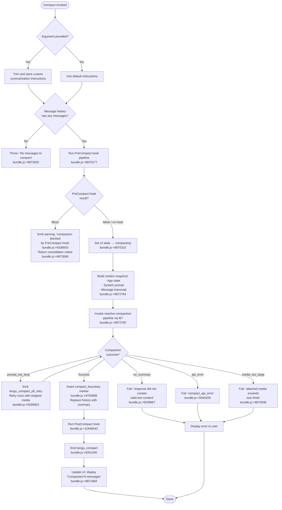

# `/compact`

> Analysis basis: CC v2.1.133 bundle.js (AST extraction + Claude interpretation)
> Minimum version: v2.1.133

---

## Overview

The `/compact` command reduces the active conversation's token footprint by invoking a summarization pipeline that replaces the existing message history with a single compressed summary. It accepts an optional argument for custom summarization instructions, and can be triggered manually by the user or automatically by the runtime when the context window approaches its limit. After a successful compaction, a `compact_boundary` marker is inserted and the conversation continues from the summary.

---

## Registration

| Field | Value |
|---|---|
| type | `local` |
| name | `compact` |
| description | `Free up context by summarizing the conversation so far` |
| argumentHint | `<optional custom summarization instructions>` |
| supportsNonInteractive | `true` |
| thinClientDispatch | `post-text` |
| module_id | `ba9` |
| load_inline | `true` |
| loc_byte | `9873451` |
| loc_byte_end | `9873764` |
| loc_line | `5642` |
| arbor_handler.name | `c67` |
| arbor_handler.fqn | `claude-2.1.133::c67` |
| arbor_handler.kind | `AsyncFunction` |
| arbor_handler.resolution_path | `module_id` |
| arbor_handler.n_hits | `0` |

Analysis basis: CC v2.1.133 bundle.js:+9873451

---

## Input Branching

There are more than 3 distinct branches in the handler based on argument presence, message count, hook gating, and compaction outcome. A flowchart is used.



---

## Behavioral Spec

### 1. Handler Entry Point (`compactCommandHandler` / `c67`)

The handler is an `AsyncFunction` resolved by Arbor under the identifier `c67` via `module_id` resolution path.

```
async function compactCommandHandler(commandInput, context):
    customInstructions = commandInput.argument?.trim() ?? ""
    
    if context.messages is empty:
        throw Error("No messages to compact")
    
    preCompactResult = await runPreCompactHook(context)
    if preCompactResult.blocked:
        emitWarning("compaction-blocked-by-hook")
        return { text: "Compaction canceled." }
    
    setUIState("compacting")
    
    [snapshot, mcpState] = await Promise.all([
        buildContextSnapshot(context),
        collectMCPState(context)
    ])
    
    result = await runCompactionPipeline(snapshot, customInstructions)
    
    handleCompactionResult(result, context)
```

Analysis basis: CC v2.1.133 bundle.js:+9872571

---

### 2. Pre-Compact Hook Gate (`runPreCompactHook` / `OF` → `YP`)

Before compaction begins, all registered `PreCompact` hook handlers are executed in parallel. If any hook returns a blocking signal, the compaction is aborted and a cancellation message is returned to the user.

```
async function runPreCompactHook(context):
    hooks = collectHooksOfType("PreCompact")    // literal "PreCompact" at +11919094
    results = await Promise.all(hooks.map(h => executeHook(h, context)))
    
    for result in results:
        if result.decision == "block":
            logWarning("compaction-blocked-by-hook")
            return { blocked: true }
    
    return { blocked: false }
```

Analysis basis: CC v2.1.133 bundle.js:+11919094, +9338003

---

### 3. Context Snapshot Builder (`buildContextSnapshot` / `Ca9`)

Assembles the data passed to the summarization model: the current app state, system prompt, and the full message transcript.

```
async function buildContextSnapshot(context):
    appState    = context.getAppState()
    systemPrompt = buildSystemPromptArray(context)    // via AC at +9872182
    messages    = Array.from(context.messages)
    
    [resolvedPrompt, resolvedMessages] = await Promise.all([
        resolveSystemPrompt(systemPrompt),    // XD at +9872381
        resolveMessages(messages)             // Kw at +9872386
    ])
    
    return { appState, systemPrompt: resolvedPrompt, messages: resolvedMessages }
```

Analysis basis: CC v2.1.133 bundle.js:+9872107, +9872182, +9872368

---

### 4. Compaction Pipeline (`runCompactionPipeline` / `l67`)

This is the core orchestration function. It measures elapsed time with `performance.now`, triggers the reactive compaction, resets post-compaction state, and fires lifecycle hooks.

```
async function runCompactionPipeline(snapshot, customInstructions):
    startTime = performance.now()
    
    setUIState("requesting")        // literal at +9870542
    
    compactionRequest = {
        trigger: "manual",          // literal at +9870404
        snapshot,
        customInstructions
    }
    
    emitLifecycleEvent("compact_start")    // literal at +9870610
    
    result = await reactiveCompact(compactionRequest)    // QZ at +9870352
    
    if result.error:
        handleCompactionError(result.error)
        return
    
    runPostCompactCleanup()    // ec at +9871198
    updateConversationState()  // nWH at +9871223
    
    compactMetadata = buildCompactMetadata(result)    // literal "compactMetadata" +9871145
    
    await triggerPostCompactHook(compactMetadata)    // Ra9 at +9871425
    
    emitLifecycleEvent("compact_end")    // literal at +9871606
    
    displaySummaryCount(result.messageCount)    // "Compacted " literal at +9871984
    
    return result
```

Analysis basis: CC v2.1.133 bundle.js:+9870330, +9870352, +9870404, +9870478

---

### 5. Reactive Compaction Core (`reactiveCompact` / `QZ` → `Wr4` → `SZA`)

Sends the assembled transcript to the summarization model. The compaction agent operates under a restrictive policy: tool use is explicitly denied during compaction (literal `"deny"` / `"Tool use is not allowed during compaction"` at +9347948/+9347963). It produces a plain-text summary.

```
async function reactiveCompact(request):
    // Build prompt from transcript
    prompt = buildCompactionPrompt(request.snapshot, request.customInstructions)
    
    // Identify summarization model (default matches active model family)
    model = selectSummarizationModel(request.snapshot.appState)
    
    // Call API with tool use blocked
    response = await callModelAPI({
        model,
        messages: prompt,
        toolPolicy: "deny",    // +9347948
        systemNote: "You are a helpful AI assistant tasked with summarizing conversations."
                               // literal at +9349917
    })
    
    if response has no text content:
        return { error: "no_summary" }    // literal at +9339868
    
    summaryText = extractText(response)
    
    if summaryText is empty:
        return { error: "summarization produced empty response" }    // +5284025
    
    return { summary: summaryText, messageCount: request.snapshot.messages.length }
```

Analysis basis: CC v2.1.133 bundle.js:+9384751, +9347948, +9349917

---

### 6. Compact Boundary Insertion (`insertCompactBoundary` / `e3` → `Ne4`)

After a successful summary is received, the message history is replaced. A `compact_boundary` sentinel message is prepended, followed by the summary content.

```
function insertCompactBoundary(summary, messages):
    boundaryMessage = {
        role: "system",                // literal at +9750886
        type: "compact_boundary",      // literal at +9750908
        index: 1                       // literal value 1 at +9750962
    }
    
    summaryMessage = buildSummaryMessage(summary)
    
    // Slice original messages, keeping tail after boundary
    newHistory = [boundaryMessage, summaryMessage, ...messages.slice(tailIndex)]
    
    return newHistory
```

Analysis basis: CC v2.1.133 bundle.js:+9750886, +9750908, +9750962, +9872571

---

### 7. Post-Compact Cleanup (`runPostCompactCleanup` / `ec`)

Resets volatile runtime state accumulated during the compacted session. This includes clearing tool-call caches, resetting the autonomous loop counter, and preparing the state for the resumed conversation.

```
function runPostCompactCleanup(context):
    if context.startsWith("repl_main_thread"):    // literal at +5307988
        clearToolCallCache()        // $H8 at +5308131
        clearHookResponseCache()    // ss1 at +5308137
        resetAutonomousLoopCounter()    // uA4.resetAutonomousLoopDelivered at +5308145
        clearOutputTokenCount()     // xN at +5308195
    
    runPostCompactContextActions()    // H3A at +5308301
```

Analysis basis: CC v2.1.133 bundle.js:+5307988, +5308040, +5308131, +5308145

---

### 8. Error Handling in `l67`

Several named failure modes are observable via literals in the bundle:

| Failure mode | Literal | Location |
|---|---|---|
| Prompt too long | `"compact_prompt_too_long"` | +9339563 |
| No summary returned | `"compact_no_summary"` | +9339939 |
| API error (with 60 s back-off) | `"compact_api_error"` | +9340205 |
| Media too large | `"Compaction failed · attached media exceeds size limits"` | +9870936 |
| General failure | `"Compaction failed · conversation could not be reduced below the context limit"` | +9870813 |

```
function handleCompactionError(errorKind, context):
    match errorKind:
        case "prompt_too_long":
            // Retry once stripping binary media, then emit tengu_compact_ptl_retry
            retryWithStrippedMedia(context)
        case "no_summary" | "api_error":
            displayError(localizeError(errorKind))
        case "media_too_large":
            displayError("Compaction failed · attached media exceeds size limits")
        default:
            displayError("unknown error")    // literal at +9871061
```

Analysis basis: CC v2.1.133 bundle.js:+9339563, +9339939, +9340205, +9870813, +9870936

---

### 9. Auto-Compact Mode (`autoCompactEnabled` / `XH8` → `XZA`)

The setting `"autoCompactEnabled"` (literal at +9356871) governs whether the runtime triggers compaction automatically when the context window fills. When active, the value `"auto"` (literal at +9355074) is set as the trigger mode. Thresholds parsed during auto-compact decisions use:

- Percentage divisor: 1000 (literal at +9355179)
- Percentage ceiling: 100 (literal at +9355215)
- Rounding via `Math.round` at +9355288

Analysis basis: CC v2.1.133 bundle.js:+9355074, +9355179, +9355215, +9356871

---

## State & Side Effects

| Item | Detail |
|---|---|
| Telemetry — compact lifecycle | `tengu_compact` (+9341345), `tengu_compact_cache_prefix` (+9339152), `tengu_compact_cache_sharing_success` (+9348724), `tengu_compact_cache_sharing_fallback` (+9349309) |
| Telemetry — reactive compaction | `tengu_reactive_compact_attempt` (+5285197), `tengu_reactive_compact_failed` (+5310971), `tengu_reactive_compact_succeeded` (+5312797) |
| Telemetry — error paths | `tengu_compact_failed` (+9351083), `tengu_compact_ptl_retry` (+9339603) |
| Telemetry — post-compact | `tengu_post_compact_file_restore_success` (+9351565), `tengu_post_compact_file_restore_error` (+9351607) |
| Telemetry — precomputed compact | `tengu_precomputed_compact_discarded` (+5291615) |
| PreCompact hook | Executed before summarization. A `"block"` result aborts compaction entirely (+9338003). |
| PostCompact hook | Executed after summary is committed. Hook type literal `"PostCompact"` at +11948442. |
| appState changes | UI phase transitions: `"compacting"` → `"requesting"` → reset. State written via `nWH` → `M76.setState` at +4298942. |
| compact_boundary marker | Written into message history with role `"system"` and type `"compact_boundary"` at +9750908. |
| Tool use during compaction | All tool use is denied (`"deny"` at +9347948) for the summarization call. |
| Auto-loop counter reset | `uA4.resetAutonomousLoopDelivered` called as part of post-compact cleanup at +5308145. |
| Cache clear | `GM6.clear` and `hMA.clear` via `ss1` at +5237011/+5237023. |
| Sound | <!-- TODO: not found in depth-2 traversal; needs --depth 4 --> |

---

## Version History

| Version | Change |
|---|---|
| v2.1.133 | Initial analysis |

---

## Common Mistakes

1. **Invoking `/compact` on an empty conversation.** The handler explicitly throws `"No messages to compact"` (+9872602) when no messages exist. There is nothing to summarize; the command will return an error immediately.

2. **Expecting tool calls to succeed during compaction.** The summarization API call uses a `"deny"` tool-use policy (+9347948). Any attempt to reference or trigger tools within the summarization model call will be rejected with `"Tool use is not allowed during compaction"`.

3. **Assuming custom instructions override the summarization role.** Custom instructions are appended as supplemental guidance. The base system role (`"You are a helpful AI assistant tasked with summarizing conversations."` at +9349917) is always prepended and cannot be removed by the user argument.

4. **Expecting `/compact` to succeed when a `PreCompact` hook blocks it.** A hook registered for the `"PreCompact"` event that returns a block decision silently cancels the operation and displays `"Compaction canceled."` (+9873069). Check configured hooks if compaction unexpectedly stops.

5. **Relying on message indices being stable after compaction.** The `compact_boundary` marker is inserted at a computed tail position, and all messages before it are replaced. Any downstream code or tooling that caches message indices will see stale data after a successful compact.

6. **Not accounting for the retry on `prompt_too_long`.** When the assembled transcript is too long for the summarization model's input, the runtime retries once with binary media stripped (telemetry `tengu_compact_ptl_retry` at +9339603). This means a single `/compact` invocation may issue two API calls.

---

## Appendix — Identifier Mapping

> For bundle debugging only. Identifiers change across versions.

| Identifier | Role |
|---|---|
| `c67` | Main handler (`AsyncFunction`) for `/compact` command |
| `e3` | Compact boundary insertion utility |
| `Ne4` | Boundary message constructor |
| `RX` | Message history slicer / replacer |
| `H$H` | Context fetch and model-selection orchestrator |
| `kM6` | Model capability resolver |
| `J6` | Conversation message fetcher |
| `Bq6` | Message grouper (for reactive compaction) |
| `gq6` | Group boundary detector |
| `Po` | Per-message content normalizer |
| `_d6` | Deduplication set manager |
| `R6` | Message record builder |
| `Tj` | Token-count estimator |
| `kH` | String coercion helper |
| `B0` | Model max-tokens table lookup |
| `T8H` | Model name normalizer |
| `eQ` | Model family classifier |
| `B9` | Model string matcher |
| `$S` | First-party endpoint resolver |
| `iw` | Auth-provider selector |
| `E8H` | Extended model family matcher |
| `QF6` | Model output-token cap resolver |
| `kY` | Active model accessor |
| `XH8` | Auto-compact threshold evaluator |
| `FW` | Auto-compact config reader |
| `_5` | Legacy-config profile loader |
| `XZA` | Auto-compact percentage parser |
| `l67` | Compaction pipeline orchestrator |
| `QZ` | Reactive compaction dispatcher |
| `Wr4` | Compaction prompt builder |
| `lmH` | Elapsed-time accumulator |
| `SZA` | Compaction prompt serializer |
| `OF` | MCP state collector for compaction |
| `aK` | API client factory for compaction call |
| `YP` | Hook runner (PreCompact / PostCompact) |
| `nqH` | Hook loader |
| `RxA` | Hook type classifier |
| `A2q` | Async hook runner |
| `SxA` | Third-party hook filter |
| `_2q` | Hook result aggregator |
| `SH` | JSON serializer (hook payload) |
| `fH` | Error logger |
| `uH` | App-state reader |
| `UJH` | Non-volatile state accessor |
| `YT` | Hook timeout manager |
| `ce` | Hook cancellation coordinator |
| `RC` | Hook result interpreter |
| `yxA` | MCP-based hook executor |
| `Dw8` | Hook output parser (plain-text path) |
| `kxA` | HTTP hook executor |
| `H2q` | HTTP hook response parser |
| `Yw8` | Shell/spawn hook executor |
| `Ca9` | Context snapshot builder |
| `aW` | System-prompt assembler |
| `dxA` | Prompt-part constructor |
| `Bi9` | Multi-root file resolver |
| `mA` | Memory-file loader |
| `pE7` | Code-style guideline injector |
| `UE7` | Environment info block builder |
| `ixA` | Session-specific guidance injector |
| `JT7` | Guidance chain runner |
| `df6` | Conversation-state context appender |
| `BE7` | Conversation-state wrapper |
| `sE7` | Scheduled-routine loader |
| `CP6` | Memory-file prompt combiner |
| `LT7` | Static env-info builder |
| `qT7` | Dynamic env-info builder |
| `MT7` | Background-session context builder |
| `wT7` | Scratchpad prompt builder |
| `HT7` | Focus-mode prompt injector |
| `Rt1` | Computed-value cache resolver |
| `lE7` | Code-reading-style block builder |
| `nE7` | Task-guidance block builder |
| `rE7` | Tool-use guidance block builder |
| `tE7` | Tone-and-style block builder |
| `njq` | Memory-update injector |
| `T5H` | Planning-mode prompt builder |
| `AC` | System-prompt array builder |
| `dq` | Prompt segment deduplicator |
| `$w` | Prompt cache-key generator |
| `hf8` | Hook-context preparer |
| `DZA` | Pre-compact state serializer |
| `_3A` | Full reactive-compact runner |
| `wJ` | Message-history accessor |
| `UMH` | Persistent message store accessor |
| `HH8` | Message group summarization loop |
| `EBH` | Content part accumulator |
| `w` | Background session manager |
| `jA4` | Single-group compaction executor |
| `WA4` | Group compaction result aggregator |
| `Z8` | State snapshot persister |
| `He1` | Post-compaction state writer |
| `Z76` | History entry transformer |
| `tWH` | Compact-result metadata builder |
| `CB` | Compact token-count updater |
| `f76` | File-reference restorer |
| `ZNH` | Cache warm-up coordinator |
| `SBH` | Compact cache key builder |
| `yM6` | Random UUID generator (compaction) |
| `Gs` | Compaction telemetry emitter |
| `UA4` | Async compaction sub-task runner |
| `_$H` | Summarization API caller |
| `q3A` | Last-turn accessor |
| `H1H` | Human message counter |
| `Re6` | Token-ratio calculator |
| `Se6` | Message statistics aggregator |
| `ec` | Post-compact cleanup orchestrator |
| `ex` | SDK-context cleanup |
| `LH8` | Precomputed compact cache accessor |
| `qH8` | Precomputed compact entry reader |
| `gt1` | Precomputed compact freshness checker |
| `V76` | Compact result verifier |
| `gZ` | Compact verification helper |
| `Ws` | Post-compact hook state preparers |
| `S08` | Hook state serializer |
| `B08` | Hook state builder |
| `pt1` | Post-compact conversation rebuilder |
| `sc` | Summarization scope selector |
| `$H8` | Tool-call cache clearer |
| `ss1` | Hook-response cache clearer |
| `xN` | Output-token counter resetter |
| `H3A` | Post-compact context action runner |
| `nWH` | UI state writer (setState) |
| `Ra9` | Post-compact hook dispatcher |
| `dQH` | Compact result display builder |
| `My4` | Message-count display formatter |
| `jX` | Keybinding registrar |
| `VI1` | Keybinding lookup |
| `ul6` | Last-action finder |
| `lMH` | OTEL telemetry emitter |
| `I4` | OTEL span builder |
| `jpH` | OTEL attribute injector |
| `ha` | App-state update trigger |
| `Xu1` | State-update executor |
| `RcH` | Compaction execution coordinator (auto/manual) |
| `PBH` | Compaction permission checker |
| `te6` | String trimmer |
| `$8` | UUID generator |
| `bd9` | Compaction agent loop |
| `oU9` | Compaction progress poller |
| `rU9` | Poll-result formatter |
| `eE` | Main API event loop |
| `UMA` | Permission context builder |
| `Eu` | Random-bytes generator |
| `Ps` | Response-policy enforcer |
| `SR` | Subagent exit recorder |
| `QMA` | Token-budget calculator |
| `s_H` | Max-output-tokens resolver |
| `E5H` | Per-model token-cap enforcer |
| `ba` | Token-cap parser |
| `K2` | Last-message finder |
| `yy` | Content-array type guard |
| `Rw6` | Tool-search mode evaluator |
| `AA` | Empty-check utility |
| `PwH` | Tool-list filter |
| `TGH` | Model-family matcher (tool search) |
| `GZH` | Tool-search availability checker |
| `IZA` | Tool-search context builder |
| `zr4` | Tool-search dispatch |
| `gMA` | Message content serializer |
| `ui4` | Tool-result filter |
| `mi4` | Tool-call map builder |
| `zZA` | Recursive content traverser |
| `kd9` | Surrogate-pair detector |
| `YcH` | Tool-permission evaluator |
| `NZA` | Permission flag builder |
| `i2q` | Main agent query runner |
| `XG` | Message normalizer |
| `ot4` | Content-block orderer |
| `He4` | Content-type dispatchers |
| `Ae4` | Media-presence checker |
| `uM8` | Media-type selector |
| `De4` | Message UUID assigner |
| `rPA` | Rejection-media remover |
| `mM8` | Tool-result content builder |
| `fm` | Tool-use context builder |
| `YVA` | Array-content flattener |
| `at4` | Tool-reference resolver |
| `qe4` | Trailing-content pruner |
| `_e4` | Tool-result post-processor |
| `wz6` | Orphaned-thinking-block filter |
| `ye4` | Single-message content accessor |
| `Yz6` | Whitespace-only message filter |
| `he4` | Empty-assistant-content fixer |
| `Ke4` | Message-slot rebuilder |
| `fr9` | Content-block sequence builder |
| `Mr9` | Final message appender |
| `et4` | Tool-use deduplication filter |
| `hd9` | History slice selector |
| `ri6` | Token estimation helper |
| `PWH` | Content-array validator |
| `s1A` | Token parser |
| `Mc` | Path prefix checker |
| `zH8` | File-context restorer |
| `pi4` | File-path set builder |
| `Nd6` | Path prefix validator |
| `c_` | Path normalizer |
| `Bi4` | File-read context builder |
| `YG` | File content reader |
| `K2H` | CLAUDE.md file loader |
| `$TA` | File attachment builder |
| `pcH` | File-content reader (cached) |
| `VN6` | Absolute-path resolver |
| `jxH` | Path type classifier |
| `Tc4` | Large-file chunker |
| `dZ` | Token estimator for file |
| `aJH` | Byte-to-token ratio estimator |
| `l4` | String index locator |
| `M1` | UUID generator (session) |
| `s5` | Timer utility (round) |
| `JH8` | Local-agent context builder |
| `L3` | Task-list builder |
| `gdH` | Task file reader |
| `DH8` | Working-directory context builder |
| `UW` | Directory listing helper |
| `D8` | Write-stream utility |
| `wH8` | Git worktree context builder |
| `YH8` | File-watch context builder |
| `v08` | Settings key writer |
| `Ui4` | File-watch token estimator |
| `A$H` | Tool-list context builder |
| `zTA` | Deferred-tools pool updater |
| `z` | Logging utility |
| `j` | Socket framer |
| `v1` | Signal emitter |
| `pE` | Telemetry attribute builder |
| `yBH` | Permission-context builder |
| `GfA` | Agent-list builder |
| `Zq` | String coercer |
| `d_H` | Denied-tools set builder |
| `wD6` | MCP tool availability checker |
| `QzH` | MCP tool-list flattener |
| `jf6` | Built-in tool filter |
| `_t6` | Tool-name matcher |
| `U9` | Tool-permission policy builder |
| `rY` | Permission rule resolver |
| `EfA` | Agent-list permission builder |
| `hBH` | Tool-schema context builder |
| `no1` | MCP-instructions pool manager |
| `Wu` | Plugin hook loader |
| `HK` | Plugin path validator |
| `hX` | Plugin settings reader |
| `h8` | File system reader |
| `GpH` | Plugin manifest parser |
| `ryH` | Plugin hook logger |
| `E8` | Log file appender |
| `jM6` | Plugin hook executor |
| `_P` | REPL agent query runner |
| `ef` | Request-tag builder |
| `DX` | Context-type classifier |
| `ah` | Context-mode helper |
| `sq6` | REPL-context selector |
| `IM6` | Inline-content expander |
| `XA4` | Content pattern replacer |
| `wc` | Persistent-store key writer |
| `Cd9` | Compaction error handler |
| `vH` | String coercer (safe) |
| `xE` | Notification queue manager |
| `PZA` | Auto-compact enabled checker |

---

Note: index built via Arbor fallback; some signals (telemetry, literals) may be missing — see arbor-fallback.js.