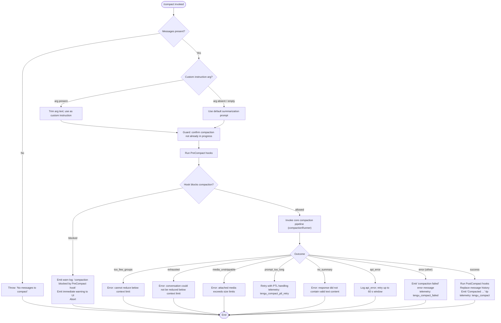

# `/compact`

> Analysis basis: CC v2.1.133 bundle.js (AST extraction + Claude interpretation)
> Minimum version: v2.1.133

---

## Overview

The `/compact` command reduces the active conversation's context footprint by replacing the full message history with a concise AI-generated summary, thereby freeing up token space for continued work. It accepts an optional natural-language instruction that customizes how the summary is produced. The command operates in both interactive and non-interactive (headless) modes, dispatching over a `post-text` thin-client path when running remotely.

---

## Registration

| Field | Value |
|---|---|
| type | `local` |
| name | `compact` |
| description | Free up context by summarizing the conversation so far |
| argumentHint | `<optional custom summarization instructions>` |
| supportsNonInteractive | `true` |
| thinClientDispatch | `post-text` |
| module_id | `ba9` |

Analysis basis: CC v2.1.133 bundle.js:+9873451

---

## Input Branching

The top-level command handler (`commandEntryPoint`) branches immediately on whether a message history exists, and then on whether a custom instruction argument was supplied.



Analysis basis: CC v2.1.133 bundle.js:+9872571, +9872596, +9872602, +9872634, +9870277, +9338003, +9870719, +9870787, +9870901, +9339473, +9339868, +9340109, +9341345

---

## Behavioral Spec

### 1. Guard — Empty History Check

```
function guardEmptyHistory(messageList):
    if messageList is empty:
        raise Error("No messages to compact")
    return messageList
```

Analysis basis: CC v2.1.133 bundle.js:+9872596, +9872602

---

### 2. Custom Instruction Extraction

```
function extractCustomInstruction(rawArg):
    trimmed = rawArg.trim()
    if trimmed is non-empty:
        return trimmed          # user-supplied summarization directive
    else:
        return null             # pipeline will use built-in summarization prompt
```

Analysis basis: CC v2.1.133 bundle.js:+9872634

---

### 3. PreCompact Hook Execution

Before any summarization API call is made, the hook subsystem fires all registered `PreCompact` hooks in sequence.

```
function runPreCompactHooks(hookContext):
    hookResults = executeHooks(event="PreCompact", context=hookContext)
    for result in hookResults:
        if result.blocks == true:
            log(level="warn", code="compaction-blocked-by-hook",
                message="compaction blocked by PreCompact hook")
            emitUIWarning(severity="warning", display="immediate")
            return BLOCKED
    return ALLOWED
```

Hook event name literal: `"PreCompact"` (bundle.js:+11919094)
Block log code literal: `"compaction-blocked-by-hook"` (bundle.js:+9337969)

Analysis basis: CC v2.1.133 bundle.js:+9870277, +9338003, +9338052, +9338070

---

### 4. Conversation Snapshot & Message Grouping

Prior to issuing the summarization request the pipeline reads the current app state and slices the message list into groups. A safety margin of **0.2** (20 %) is applied when computing maximum group boundaries.

```
function buildMessageGroups(messages, contextLimit):
    safetyMargin = 0.2                        # bundle.js:+9337647
    effectiveLimit = contextLimit * (1 - safetyMargin)
    groups = []
    currentGroup = []
    for message in messages:
        if estimatedTokens(currentGroup + [message]) > effectiveLimit:
            groups.append(currentGroup)
            currentGroup = [message]
        else:
            currentGroup.append(message)
    if currentGroup is non-empty:
        groups.append(currentGroup)
    if length(groups) < MIN_GROUPS:
        return TOO_FEW_GROUPS_ERROR
    return groups
```

Analysis basis: CC v2.1.133 bundle.js:+9337477, +9337616, +9337627, +9337647, +9337658, +9870719

---

### 5. Summarization API Request

The summarization sub-request is dispatched as a separate streaming inference call, distinct from the main conversation turn.

```
function requestSummary(messageGroups, customInstruction, modelOverride):
    systemPrompt = "You are a helpful AI assistant tasked with summarizing conversations."
    # bundle.js:+9349917

    userPrompt = buildSummaryPrompt(messageGroups, customInstruction)

    request = {
        model:   modelOverride ?? "claude-opus-4-7",   # bundle.js:+9355426
        system:  systemPrompt,
        messages: userPrompt,
        tools:   "disabled",                           # bundle.js:+9350012
        stream:  true,
    }

    # Poll interval for streaming: setInterval at 30 000 ms maximum  bundle.js:+9348330
    responseText = ""
    for event in streamResponse(request):
        if event.type == "content_block_start" and event.content.type == "text":
            set state "responding"
        elif event.type == "content_block_delta" and event.delta.type == "text_delta":
            responseText += event.delta.text

    if responseText is empty:
        emit telemetry("tengu_compact_failed")     # bundle.js:+9351083
        raise NoSummaryError("no_text_response")
    return responseText
```

Cache-sharing optimistic path emits `tengu_compact_cache_sharing_success`; on failure falls back and emits `tengu_compact_cache_sharing_fallback`.

Analysis basis: CC v2.1.133 bundle.js:+9349917, +9350012, +9355426, +9348330, +9350638, +9350777, +9350821, +9348724, +9349309

---

### 6. Prompt-Too-Long Retry

When the summarization request itself overflows the model's context window the pipeline catches the `prompt_too_long` error and retries after shedding the oldest message group.

```
function handlePromptTooLong(groups, customInstruction, model):
    emit telemetry("tengu_compact_ptl_retry")    # bundle.js:+9339603
    trimmedGroups = dropOldestGroup(groups)
    return requestSummary(trimmedGroups, customInstruction, model)
```

Error code literal: `"prompt_too_long"` (bundle.js:+9339473)
Telemetry event: `tengu_compact_ptl_retry` (bundle.js:+9339603)

Analysis basis: CC v2.1.133 bundle.js:+9339473, +9339563, +9339603

---

### 7. API Error Handling with Timeout

Transient API errors trigger a bounded retry window.

```
function handleApiError(error, startTime):
    MAX_RETRY_SECONDS = 60              # bundle.js:+9340143
    elapsed = (performance.now() - startTime) / 1000
    if elapsed < MAX_RETRY_SECONDS:
        scheduleRetry()
    else:
        emit telemetry("tengu_compact_api_error")   # bundle.js:+9340205
        raise error
```

Maximum API retry window: 60 seconds (bundle.js:+9340143)

Analysis basis: CC v2.1.133 bundle.js:+9340109, +9340143, +9340205

---

### 8. Post-Compact History Replacement

On a successful summary the pipeline replaces the in-memory message history and writes compact metadata.

```
function applyCompactionResult(summary, originalMessages, compactionMode):
    compactBoundaryMessage = buildSystemMessage(
        role   = "system",
        marker = "compact_boundary",           # bundle.js:+9871125
        text   = "Conversation compacted"      # bundle.js:+9750418
    )
    summaryMessage = buildSystemMessage(
        role = "system",
        key  = "compactMetadata",              # bundle.js:+9871145
        text = summary
    )
    newHistory = [compactBoundaryMessage, summaryMessage]

    updateAppState(messages = newHistory)
    emit telemetry("tengu_compact")            # bundle.js:+9341345
    runPostCompactHooks(event="PostCompact")   # bundle.js:+9342367, +11920020

    displayTip(
        type    = "tip",
        action  = "app:toggleTranscript",      # bundle.js:+9871845
        keybind = "ctrl+o",                    # bundle.js:+9871877
        scope   = "Global",
        text    = "Compacted " + formattedTokenCount
    )
```

Analysis basis: CC v2.1.133 bundle.js:+9871125, +9871145, +9750418, +9341345, +9342367, +9871833, +9871845, +9871877, +9871984

---

### 9. PostCompact Hook Execution and File Restore

```
function runPostCompactHooks(hookContext):
    hookResults = executeHooks(event="PostCompact", context=hookContext)
    for result in hookResults:
        try:
            restoreFiles(result.fileSet)
            emit telemetry("tengu_post_compact_file_restore_success")
                                                # bundle.js:+9351565
        catch err:
            emit telemetry("tengu_post_compact_file_restore_error")
                                                # bundle.js:+9351607
            logError(err)
```

Analysis basis: CC v2.1.133 bundle.js:+9342367, +9351565, +9351607

---

### 10. Reactive (Automatic) Compaction Path

Separate from the manual `/compact` command, the runtime can trigger compaction automatically when context usage crosses a threshold. Failures on this path emit a distinct telemetry event and do not surface as blocking errors.

```
function reactiveCompactionHandler(trigger):
    try:
        result = runCompactionPipeline(mode="auto",   # bundle.js:+5311482
                                       trigger=trigger)
        if result.status == "aborted":               # bundle.js:+5311141
            recordEvent("compact_reactive",          # bundle.js:+5311154
                        status="aborted")
    catch err:
        emit telemetry("tengu_reactive_compact_failed")  # bundle.js:+5310971
        logError("reactive compaction failed")           # bundle.js:+9871481
```

Analysis basis: CC v2.1.133 bundle.js:+5310971, +5311141, +5311154, +5311482, +9871481

---

### 11. Compaction Mode Tagging

Every compaction run is tagged with a mode string that is persisted in telemetry and metadata.

| Mode constant | Literal value | Source byte |
|---|---|---|
| Manual (via `/compact`) | `"compact_manual"` | +9338551 |
| Automatic / reactive | `"compact_auto"` | +9338536 |
| Headless / non-interactive | `"manual"` (trigger origin) | +9870404 |

Analysis basis: CC v2.1.133 bundle.js:+9338536, +9338551, +9870404

---

### 12. Cancellation Path

When the user cancels the in-progress compaction (for example by pressing the abort key) the pipeline emits a human-readable message.

```
function handleCancellation():
    displayMessage("Compaction canceled.")      # bundle.js:+9873069
    clearInProgressState()
```

Analysis basis: CC v2.1.133 bundle.js:+9873069

---

## State & Side Effects

| Item | Detail |
|---|---|
| Telemetry — generic compact | `tengu_compact` (bundle.js:+9341345) |
| Telemetry — reactive compact failed | `tengu_reactive_compact_failed` (bundle.js:+5310971) |
| Telemetry — PTL retry | `tengu_compact_ptl_retry` (bundle.js:+9339603) |
| Telemetry — cache sharing success | `tengu_compact_cache_sharing_success` (bundle.js:+9348724) |
| Telemetry — cache sharing fallback | `tengu_compact_cache_sharing_fallback` (bundle.js:+9349309) |
| Telemetry — compact failed | `tengu_compact_failed` (bundle.js:+9351083) |
| Telemetry — API error | `tengu_compact_api_error` (bundle.js:+9340205) |
| Telemetry — file restore success | `tengu_post_compact_file_restore_success` (bundle.js:+9351565) |
| Telemetry — file restore error | `tengu_post_compact_file_restore_error` (bundle.js:+9351607) |
| Telemetry — cache prefix | `tengu_compact_cache_prefix` (bundle.js:+9339152) |
| Telemetry — cobalt raccoon (model profile) | `tengu_cobalt_raccoon` (bundle.js:+5308442) |
| Telemetry — amber redwood2 (model profile) | `tengu_amber_redwood2` (bundle.js:+9355460) |
| Telemetry — feature ok | `tengu_feature_ok` (bundle.js:+907381) |
| Telemetry — feature bad | `tengu_feature_bad` (bundle.js:+907437) |
| Telemetry — slate harbor | `tengu_slate_harbor` (bundle.js:+3140544) |
| Hook registration — pre | `PreCompact` hooks executed before summarization API call (bundle.js:+11919094) |
| Hook registration — post | `PostCompact` hooks executed after history replacement (bundle.js:+11920020) |
| appState changes | Message history replaced with `[compactBoundaryMessage, summaryMessage]`; `compactMetadata` key written (bundle.js:+9871125, +9871145) |
| UI state | `M76.setState` called to reflect in-progress and completed compaction (bundle.js:+4298942, +4298978) |
| Autonomous loop reset | `uA4.resetAutonomousLoopDelivered` called during post-compact cleanup (bundle.js:+5308145) |
| Sound | <!-- TODO: not found in depth-2 traversal; needs --depth 4 --> |
| Timing | `performance.now()` used to measure total compaction duration; result rounded and logged as `"compaction"` metric (bundle.js:+9870330, +4409192) |
| Streaming poll interval | `setInterval` at up to 30 000 ms during summarization streaming (bundle.js:+9348330); cleared with `clearInterval` on completion (bundle.js:+9351232) |
| UUID generation | New message IDs generated via `crypto.randomUUID()` for summary and boundary messages (bundle.js:+9697392, +9750493) |

---

## Version History

| Version | Change |
|---|---|
| v2.1.133 | Initial analysis |

---

## Common Mistakes

1. **Running `/compact` on an empty session** — the command throws immediately with `"No messages to compact"` if the message list is empty; there is nothing to summarize and no API call is made.

2. **Expecting the original transcript to persist** — compaction is destructive to the in-memory history; the full turn-by-turn exchange is replaced by the summary. Use `ctrl+o` (toggle transcript) to review the archived transcript if available.

3. **Assuming custom instructions override the system prompt entirely** — the custom instruction argument is an additive directive appended to the standard summarization prompt, not a replacement for it.

4. **Triggering `/compact` while a compaction is already running** — the pipeline guards against re-entrant compaction; a second invocation while the first is in-flight will be rejected or produce undefined results.

5. **Assuming the same model as the main conversation is used** — the summarization sub-request uses the model `"claude-opus-4-7"` (bundle.js:+9355426) regardless of the model selected for the active session unless overridden by a profile.

6. **Ignoring PreCompact hook blocks** — if a registered `PreCompact` hook blocks compaction, the command silently aborts with a UI warning; no error is raised to the caller and the conversation remains unchanged.

7. **Expecting compaction to always succeed in very large sessions with embedded media** — if attached media cannot be stripped to fit within limits the pipeline fails with `"media_unstrippable"` and emits `"Compaction failed · attached media exceeds size limits"` (bundle.js:+9870936).

---

## Appendix — Identifier Mapping

> For bundle debugging only. Identifiers change across versions.

| Identifier | Role |
|---|---|
| `c67` | Top-level command handler / entry point for `/compact` |
| `e3` | Message list accessor / history reader |
| `Ne4` | Message list index helper |
| `H$H` | Model profile resolution function |
| `kM6` | Inner model ID lookup (reads NA, J6) |
| `Tj` | Token / integer parsing utility (uses parseInt, isNaN) |
| `kY` | Context-limit constant accessor |
| `B9` | Application-inference-profile detector |
| `XH8` | Model override resolver (supplies "claude-opus-4-7" fallback) |
| `l67` | Core compaction orchestrator / pipeline runner |
| `QZ` | Context/app-state query helper |
| `OF` | Conversation message formatter / prompt builder |
| `Ca9` | App-state snapshot collector (reads getAppState, Array.from) |
| `hf8` | File-handle or resource acquisition helper |
| `DZA` | Deferred/async cleanup dispatcher |
| `_3A` | Compaction timing and telemetry recorder |
| `ec` | Post-compact cleanup sequence (resets loop, marks boundary) |
| `nWH` | UI state setter (wraps M76.setState) |
| `Ra9` | Success tip / "Compacted …" notification builder |
| `lMH` | Compaction duration formatter (String + Math.round) |
| `ha` | In-progress state activator (wraps Xu1 → M76.setState) |
| `Xu1` | Low-level UI state applicator |
| `RcH` | Automatic / reactive compaction runner |
| `uH` | Error wrapper / error-type tagger |
| `wJ` | Message-slice helper for API request construction |
| `PBH` | Pre-flight context-size checker |
| `J6` | Cache-prefix/key registry accessor |
| `te6` | Instruction text trimmer |
| `$8` | UUID generator (wraps crypto.randomUUID) |
| `bd9` | Summarization API streaming request executor |
| `yy` | Array type guard (wraps Array.isArray) |
| `hd9` | Message group slicer (applies 0.2 safety margin) |
| `d` | Low-level logger / debug emitter |
| `k` | Log-level dispatcher (debug/warn/error routing) |
| `SH` | JSON serializer (wraps JSON.stringify) |
| `Mc` | String prefix matcher |
| `v` | Backoff / retry timer with focus/blur state |
| `Z76` | Object map transformer (Object.fromEntries) |
| `tWH` | Thin-client dispatch adapter |
| `zH8` | Post-compact file restore orchestrator |
| `JH8` | Local-agent task status poller |
| `DH8` | Plan-mode message injector |
| `wH8` | Plan-file-reference message builder |
| `YH8` | Invoked-skills message assembler |
| `A$H` | Deferred-tools-delta event emitter |
| `M1` | Attachment message factory (uses randomUUID) |
| `yBH` | Agent-listing-delta dispatcher and tool-permission resolver |
| `hBH` | MCP-instructions-delta emitter |
| `Wu` | Plugin hook loader and executor |
| `yM6` | Compact summary message UUID factory |
| `Gs` | Message array builder / accumulator |
| `ef` | Environment/context label assembler |
| `DX` | Client-type discriminator (cli vs remote) |
| `sq6` | REPL context accessor |
| `IM6` | Instruction-message creator |
| `wc` | Usage metadata extender |
| `UMH` | Usage-tracking registry checker |
| `pE` | Unknown-state sentinel handler |
| `Re6` | Percentage calculator (Math.round / 100) |
| `Se6` | Hook output statistics recorder |
| `fH` | Error logger with structured payload |
| `CB` | Confirmation / boolean flag resolver |
| `f76` | Transaction/task store getter |
| `ZNH` | Null/undefined guard utility |
| `SBH` | Runtime key emitter (wraps RK) |
| `_$H` | PostCompact hook prompt assembler |
| `hH` | Shallow-log helper |
| `Cd9` | Error-compacting-conversation notification emitter |
| `PZA` | Compact boundary system message builder |
| `kH` | String coercion utility |
| `nHH` | Notification / alert dispatcher |