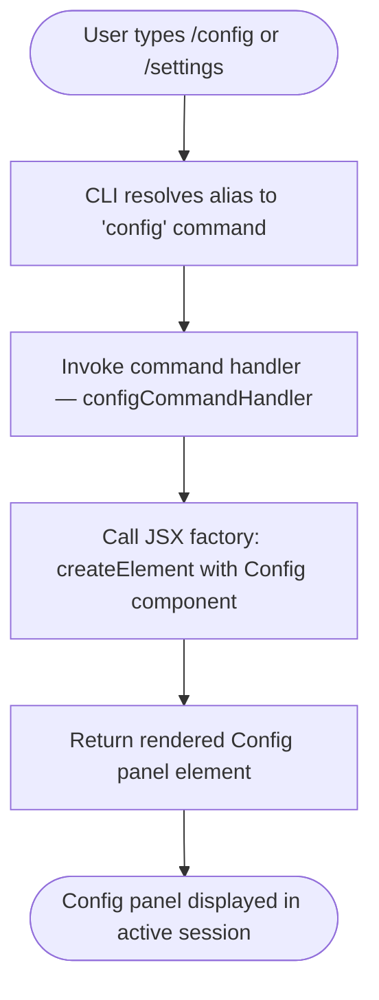

# `/config`

> Analysis basis: CC v2.1.133 bundle.js (AST extraction + Claude interpretation)
> Minimum version: v2.1.133

---

## Overview

The `/config` command (also accessible via `/settings`) opens the configuration panel UI within the Claude Code CLI session. It is implemented as a local JSX command, meaning its output is a rendered React element rather than plain text. When invoked, the command delegates to a JSX factory call that mounts the `Config` panel component into the active interface.

---

## Registration

| Field | Value |
|---|---|
| type | `local-jsx` |
| name | `config` |
| description | `Open config panel` |
| aliases | `["settings"]` |
| module_id | `ct9` |

Analysis basis: CC v2.1.133 bundle.js:+10245088

---

## Input Branching

The `/config` command accepts no arguments. Its execution path is linear: the command handler is invoked, it calls the JSX element factory with the `Config` component, and returns the resulting element for rendering. There is no argument parsing, sub-command dispatch, or conditional branching observed at depth ≤ 2 of the call graph.



Analysis basis: CC v2.1.133 bundle.js:+10244954, +10245088

---

## Behavioral Spec

### Config Panel Rendering

The sole observable behavior of this command at traversal depth ≤ 2 is the construction and return of a JSX element representing the configuration panel.

```
function configCommandHandler(context):
    element = jsxElementFactory(ConfigPanelComponent, props=null)
    return element
```

- The command handler calls the JSX element factory (`createElement`) with `ConfigPanelComponent` as the target component.
- The string literal `"Config"` present in the implementation suggests a display name or panel title assignment for the component.
- No arguments from the user invocation are forwarded to the component at this depth.
- No async operations, filesystem reads, or network calls are observable at depth ≤ 2.

Analysis basis: CC v2.1.133 bundle.js:+10244954 (JSX factory call), +10245008 (string literal `"Config"`)

### Alias Resolution

The command is registered with the alias `settings`, meaning both `/config` and `/settings` are resolved to the same handler by the CLI command dispatch layer.

```
function resolveCommandName(input):
    if input == "settings":
        input = "config"
    return lookupCommand(input)
```

Analysis basis: CC v2.1.133 bundle.js:+10245088

---

## State & Side Effects

| Item | Detail |
|---|---|
| Telemetry | None — no `tengu_*` events emitted by this command |
| Hook registration | <!-- TODO: not found in depth-2 traversal; needs --depth 4 --> |
| appState changes | <!-- TODO: not found in depth-2 traversal; needs --depth 4 --> |
| Sound | <!-- TODO: not found in depth-2 traversal; needs --depth 4 --> |

---

## Version History

| Version | Change |
|---|---|
| v2.1.133 | Initial analysis |

---

## Common Mistakes

1. **Expecting plain-text output**: Because `/config` is of type `local-jsx`, it renders a React component rather than emitting text to the terminal stream. Tooling that intercepts stdout expecting text output will not capture the config panel.
2. **Assuming `/settings` behaves differently**: `/settings` is a registered alias and resolves to exactly the same handler as `/config`. There is no behavioral distinction between the two invocations.
3. **Passing arguments**: The registration and call graph show no argument parsing. Any text supplied after `/config` is silently ignored at this traversal depth; behavior with extra arguments is not guaranteed.
4. **Expecting telemetry side effects**: Unlike many other commands, `/config` emits no telemetry events. Monitoring pipelines that depend on `tengu_*` events to detect config panel usage will receive no signal from this command.

---

## Appendix — Identifier Mapping

> For bundle debugging only. Identifiers change across versions.

| Identifier | Role |
|---|---|
| `_17` | Config command handler function — the entry-point invoked by the CLI dispatcher when `/config` or `/settings` is typed |