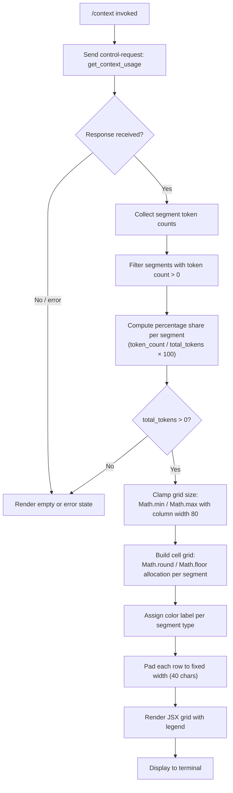

# `/context`

> Analysis basis: CC v2.1.133 bundle.js (AST extraction + Claude interpretation)
> Minimum version: v2.1.133

---

## Overview

The `/context` command visualizes the current context window usage as a colored grid rendered in the terminal. It dispatches a `get_context_usage` control request to the runtime, collects token-count breakdowns across all context segments (system prompt, memory files, tools, messages, etc.), and renders each segment as a labeled, color-coded block of cells proportional to its token consumption.

---

## Registration

| Field | Value |
|---|---|
| type | `local-jsx` |
| name | `context` |
| description | `Visualize current context usage as a colored grid` |
| thinClientDispatch | `control-request` |
| module_id | `qe9` |

Analysis basis: CC v2.1.133 bundle.js:+10261504

---

## Input Branching

The command takes no user-supplied arguments. All branching is driven by the runtime response to the `get_context_usage` control request and by the state of the current session.



Analysis basis: CC v2.1.133 bundle.js:+10260232, +10260259, +10260319, +10260404, +10260577, +10260640, +10260652

---

## Behavioral Spec

### 1. Control Request Dispatch

When invoked, the command handler immediately issues a control request with the action identifier `"get_context_usage"` via the runtime's control channel.

```
function dispatchContextRequest(session):
    send controlRequest(
        action = "get_context_usage",
        session = session
    )
    await response
    return response.data
```

Analysis basis: CC v2.1.133 bundle.js:+10260259, +10260289

---

### 2. Segment Collection and Filtering

The response payload is walked to extract named context segments. Each segment carries a token count and a category label. Segments with a count of zero are excluded from further processing.

```
function collectSegments(rawResponse):
    allSegments = filterFunction(rawResponse, segment => segment.tokenCount > 0)

    // Known segment categories resolved from literals:
    knownCategories = [
        { key: "system",          label: "System prompt"           },
        { key: "promptBorder",    label: "System prompt (border)"  },
        { key: "systemTools",     label: "System tools"            },
        { key: "mcpTools",        label: "MCP tools"               },
        { key: "mcpDeferred",     label: "MCP tools (deferred)"    },
        { key: "systemDeferred",  label: "System tools (deferred)" },
        { key: "customAgents",    label: "Custom agents"           },
        { key: "memoryFiles",     label: "Memory files"            },
        { key: "skills",          label: "Skills"                  },
        { key: "messages",        label: "Messages"                },
        { key: "freeSpace",       label: "Free space"              },
        { key: "autocompact",     label: "Autocompact buffer"      },
    ]

    return allSegments
```

Analysis basis: CC v2.1.133 bundle.js:+10258386, +10258421, +10258444, +9367129, +9367207, +9367270, +9367345, +9367430, +9367518, +9367584, +9367645, +9368147

---

### 3. System Prompt Source Classification

Before rendering, the command identifies which settings layer supplied the active system prompt. The result is used for labeling in the grid legend.

```
function classifySystemPromptSource(session):
    // Attempt to locate the system prompt in each settings scope in priority order
    for each scope in ["projectSettings", "userSettings", "localSettings",
                        "flagSettings", "policySettings", "plugin", "built-in"]:
        value = session.getSystemPrompt(scope)
        if value is not null:
            return scopeLabelMap[scope]
            // scopeLabelMap: { projectSettings->"Project", userSettings->"User",
            //   localSettings->"Local", flagSettings->"Flag",
            //   policySettings->"Policy", plugin->"Plugin",
            //   built-in->"Built-in" }

    // Check for managed/main-thread system prompt
    if session has managed system prompt:
        return "Managed"

    return null
```

Analysis basis: CC v2.1.133 bundle.js:+10259370, +10259390, +10259410, +10259427, +10259444, +10259462, +10259480, +10259497, +10259514, +10259533, +10259552, +10259563, +10259582, +10259595, +7843872

---

### 4. Percentage and Cell Computation

Token percentages are computed as integer-rounded shares. The grid is constrained to a maximum column width of 80 characters. Cell count per segment is computed with `Math.round` and `Math.floor` to avoid fractional cells.

```
function computeCellAllocation(segments, totalTokens, gridWidth = 80):
    cellsPerSegment = []

    for each segment in segments:
        pct = (segment.tokenCount / totalTokens) * 100          // percentage share
        rawCells = (pct / 100) * gridWidth
        cells = Math.round(rawCells)                             // round to nearest cell
        cellsPerSegment.push({ segment, pct, cells })

    // Clamp total to gridWidth using Math.max / Math.min
    total = sum(cellsPerSegment.map(x => x.cells))
    if total > gridWidth:
        cellsPerSegment.last.cells -= (total - gridWidth)        // trim overflow from last segment

    return cellsPerSegment
```

Analysis basis: CC v2.1.133 bundle.js:+10260635, +9368561, +9368723, +9367973, +9367984, +10258636

---

### 5. Color and Label Assignment

Each segment type is assigned a terminal color. Two colors are marked for sub-agent contexts only.

```
function assignSegmentColor(segmentKey):
    colorMap = {
        "system"         : "promptBorder",
        "systemTools"    : "inactive",
        "mcpTools"       : "cyan_FOR_SUBAGENTS_ONLY",
        "mcpDeferred"    : "cyan_FOR_SUBAGENTS_ONLY",
        "systemDeferred" : "inactive",
        "customAgents"   : "permission",
        "memoryFiles"    : "claude",
        "skills"         : "warning",
        "messages"       : "purple_FOR_SUBAGENTS_ONLY",
        "freeSpace"      : (default / no color),
        "autocompact"    : (default / no color),
    }
    return colorMap[segmentKey] ?? defaultColor
```

Analysis basis: CC v2.1.133 bundle.js:+9367160, +9367237, +9367297, +9367345, +9367430, +9367549, +9367614, +9367669, +9368173

---

### 6. Grid Row Rendering

Each row of the grid is assembled by mapping cells to colored block characters and padding the result to a fixed width of 40 characters using `String.prototype.padEnd` with a two-space fill string.

```
function renderGridRow(cells, terminalWidth):
    row = cells.map(cell => colorBlock(cell.color))
    paddedRow = row.join("").padEnd(40, "  ")    // pad to 40 chars with two-space fill
    return paddedRow
```

Analysis basis: CC v2.1.133 bundle.js:+14179329, +14179342, +14181334, +14179363

---

### 7. Legend Construction

A legend entry is appended below the grid for each segment with a non-zero token count. Each entry shows the segment label, its token count as a string, and its percentage rounded to one decimal place (the `".0"` suffix literal is appended when the fractional part is zero).

```
function buildLegend(cellsPerSegment, totalTokens):
    legend = []
    for each entry in cellsPerSegment:
        pctString = formatPercent(entry.pct)    // appends ".0" when fractional part is zero
        legend.push({
            color  : assignSegmentColor(entry.segment.key),
            label  : entry.segment.label,
            tokens : String(entry.segment.tokenCount),
            pct    : pctString,
        })
    return legend
```

Analysis basis: CC v2.1.133 bundle.js:+167486, +167500, +10259622

---

### 8. Token Limit Resolution (Auto-Compact Window)

The command resolves the effective context window limit by consulting (in priority order): the `CLAUDE_CODE_AUTO_COMPACT_WINDOW` environment variable, the `autoCompactEnabled` settings flag, and a hard-coded ceiling of 1,000,000 tokens. `Math.max` and `Math.min` are used to clamp the resolved value within valid bounds.

```
function resolveContextWindowLimit(env, settings):
    envValue = env["CLAUDE_CODE_AUTO_COMPACT_WINDOW"]
    if envValue is present and valid:
        limit = parseInt(envValue)
    else if settings.autoCompactEnabled is set:
        limit = resolveFromSettings(settings)
    else:
        limit = 1000000    // hard ceiling

    if limit == "invalid":
        limit = defaultWindowSize

    return Math.max(minimumWindow, Math.min(limit, 1000000))
```

Analysis basis: CC v2.1.133 bundle.js:+9355648, +9356871, +5308520, +9355749, +9355766, +9355806

---

### 9. JSX Component Assembly

The final output is assembled as a JSX element tree. The grid rows and legend are composed into a single component returned by the command handler. The `local-jsx` registration type means the component is rendered inline in the terminal UI without spawning a subprocess.

```
function buildContextComponent(session, controlResponse):
    segments      = collectSegments(controlResponse)
    totalTokens   = sum(segments.map(s => s.tokenCount))
    windowLimit   = resolveContextWindowLimit(env, settings)
    allocation    = computeCellAllocation(segments, totalTokens, gridWidth=80)
    legend        = buildLegend(allocation, totalTokens)
    gridRows      = renderGridRow(allocation, terminalWidth)

    return createElement(ContextGrid, {
        rows   : gridRows,
        legend : legend,
        total  : totalTokens,
        limit  : windowLimit,
    })
```

Analysis basis: CC v2.1.133 bundle.js:+10260323, +7371974, +10261504

---

### 10. State Update Side Effect

After the grid is rendered, the application state is updated to record that the context visualization was last displayed. This is performed through the shared app-state setter.

```
function recordDisplayState(appState):
    appState.setState({ contextVisualizationLastShown: Date.now() })
```

Analysis basis: CC v2.1.133 bundle.js:+4298978, +10260603

---

## State & Side Effects

| Item | Detail |
|---|---|
| Telemetry | No `tengu_*` events are emitted directly by the `/context` command implementation. The four events found in the traversal (`tengu_agent_memory_loaded`, `tengu_voice_circuit_breaker_tripped`, `tengu_voice_recording_started`, `tengu_voice_stream_early_retry`) originate in shared modules reachable at depth 2 (memory loading and voice subsystem); they are **not** triggered by `/context` itself. |
| Control request | Emits one `control-request` with action `"get_context_usage"` to the runtime control channel on every invocation. |
| `thinClientDispatch` | Registered as `"control-request"`, meaning the command routes through the thin-client control plane rather than the main message pipeline. |
| appState changes | Calls the app-state `setState` path (via `Xu1` → `M76.setState`) to record post-render state. Analysis basis: CC v2.1.133 bundle.js:+4298978 |
| Hook registration | Registers a listener via `L.on` during grid construction for receiving the streamed context data event labelled `"data"`. Analysis basis: CC v2.1.133 bundle.js:+7371907, +7371912 |
| Sound | None found in depth-2 traversal. |
| Randomization | Uses `Math.random` with a multiplier of `2` during an animation or staggered-rendering step in the grid display. Analysis basis: CC v2.1.133 bundle.js:+12285767, +12285769 |
| Deferred rendering | Uses `setTimeout` to schedule a secondary render pass. Analysis basis: CC v2.1.133 bundle.js:+12285806 |

---

## Version History

| Version | Change |
|---|---|
| v2.1.133 | Initial analysis. Command registered as `local-jsx` with `thinClientDispatch: "control-request"`. Grid width 80, legend row width 40. Token ceiling 1,000,000. |

---

## Common Mistakes

1. **Expecting text output in non-interactive / headless mode.** The command is registered as `local-jsx` and renders a JSX component. In headless or pipe mode the component may not display correctly or at all.

2. **Interpreting "Free space" and "Autocompact buffer" as errors.** Both are legitimate segment labels representing unused context capacity and the autocompact reservation respectively; their presence in the grid is normal.

3. **Assuming the percentage values sum to exactly 100 %.** Cell allocation uses `Math.round` followed by a tail-trim clamp, so individual percentages may be off by ±1 display cell due to rounding.

4. **Confusing sub-agent-only colors with errors.** The labels `"cyan_FOR_SUBAGENTS_ONLY"` and `"purple_FOR_SUBAGENTS_ONLY"` are internal color keys; they appear in the grid (for MCP tools and Messages) in all session types, not only sub-agent sessions. The naming reflects a color-palette convention, not a mode gate.

5. **Expecting the command to accept arguments.** `/context` takes no arguments. Any trailing text after the command name is ignored.

6. **Misreading the token ceiling as a model limit.** The 1,000,000-token ceiling (Analysis basis: CC v2.1.133 bundle.js:+5308520) is the upper bound used internally for grid-scaling math; it is not necessarily the active model's context window size, which is resolved separately via `CLAUDE_CODE_AUTO_COMPACT_WINDOW` or settings.

---

## Appendix — Identifier Mapping

> For bundle debugging only. Identifiers change across versions.

| Identifier | Role |
|---|---|
| `p17` | Top-level `/context` command handler function |
| `oM` | Pre-render initialization helper called by the command handler |
| `RwH` | Sub-routine called during initialization (depth 2 from `oM`) |
| `kgH` | Grid row builder; constructs individual colored cell rows |
| `bx` | Color/style resolver called within grid row builder |
| `iJ6` | Segment collection and filtering function |
| `ZK` | Numeric formatting helper (decimal suffix, e.g., `".0"`) used in segment collection |
| `ThH` | Segment post-processing step within segment collector |
| `vH` | String coercion utility for token counts |
| `m17` | Percentage computation coordinator |
| `e3` | Slice-based cell allocation helper called by percentage coordinator |
| `ha` | App-state update dispatcher |
| `Xu1` | App-state setter wrapper that calls `M76.setState` |
| `Cf8` | Master context-data aggregation function; orchestrates all sub-analyzers |
| `F0` | Model-tier resolver (resolves `"opusplan"` / `"plan"` / `"haiku"` tier strings) |
| `FW` | Auto-compact window fetch helper |
| `qn` | Auto-compact window limit calculator with `Math.max` / `Math.min` clamping |
| `aW` | System-prompt content loader; fetches all prompt segment content asynchronously |
| `AC` | System-prompt source classifier; calls `getSystemPrompt` and `Array.isArray` |
| `li4` | User-message segment analyzer |
| `ni4` | Tool-definition segment analyzer |
| `ii4` | Built-in tool analyzer (keyed by `"analyzeBuiltIn"`) |
| `ai4` | MCP tool analyzer (keyed by `"analyzeMcp"`) |
| `si4` | Attachment segment analyzer |
| `ri4` | File-read / resource segment analyzer |
| `Ar4` | Segment aggregation assembler; calls `ti4`, `ei4`, `Hr4` sub-steps |
| `oi4` | Prompt-injection / sub-agent prompt analyzer |
| `x9H` | Grid-width clamping function; applies `Math.min` against column limit |
| `xo6` | External notification dispatcher called after render |
| `H$H` | Token-ceiling resolver; references the 1,000,000 hard ceiling |
| `L6` | Working-directory context record builder |
| `IH` | MCP server connection record resolver |
| `GH` | Task-notification helper |
| `VH` | Rendered segment accumulator / output buffer |
| `g6` | MCP server detail record builder |
| `TH` | Async token-count fetch cache (Map with `.get`, `.set`, `.entries`) |