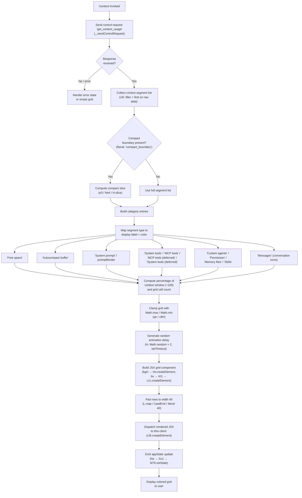

# `/context`

> Analysis basis: CC v2.1.133 bundle.js (AST extraction + Claude interpretation)
> Minimum version: v2.1.133

---

## Overview

The `/context` command renders a colored, grid-based visualization of the current conversation's context window usage directly in the terminal UI. It dispatches a `control-request` to the running session to retrieve live context statistics, then assembles and renders a JSX component that maps those statistics onto a grid of colored cells, allowing the user to see at a glance how much of the context window is consumed by each category (system prompt, tools, memory, messages, free space, auto-compact buffer, etc.).

---

## Registration

| Field | Value |
|---|---|
| type | `local-jsx` |
| name | `context` |
| description | `Visualize current context usage as a colored grid` |
| thinClientDispatch | `control-request` |
| module_id | `qe9` |
| load_inline | `true` |
| loc_byte | `10261504` |
| loc_byte_end | `10261709` |
| loc_line | `5694` |
| arbor_handler.name | `p17` |
| arbor_handler.fqn | `claude-2.1.133::p17` |
| arbor_handler.kind | `AsyncFunction` |
| arbor_handler.resolution_path | `module_id` |
| arbor_handler.n_hits | `0` |

Analysis basis: CC v2.1.133 bundle.js:+10261504

---

## Input Branching

The handler (`p17`) branches across more than three distinct paths depending on context data availability, compaction state, and the category of each context entry. A Mermaid flowchart is used.



---

## Behavioral Spec

### 1. Handler Entry Point — `contextCommandHandler` (`p17`)

`p17` is an `AsyncFunction` resolved via `module_id → qe9` (Arbor `resolution_path: module_id`).

```
async function contextCommandHandler(commandArgs):
    # Step 1: query the session for context usage data
    controlResponse = await sendControlRequest("get_context_usage")

    # Step 2: retrieve and filter context segment list
    segmentList = collectContextSegments(controlResponse)   # iJ6

    # Step 3: detect compact boundary
    compactEntry = segmentList.find(s => s.type == "compact_boundary")  # literal: "compact_boundary"
    if compactEntry:
        segmentList = sliceAtCompactBoundary(segmentList, compactEntry)  # e3 → Ne4 → H.slice

    # Step 4: compute display width (clamped to 80 columns)
    displayWidth = 80    # literal: 80

    # Step 5: resolve auto-compact window size
    windowSize = resolveAutoCompactWindow(segmentList)  # qn, uses env "CLAUDE_CODE_AUTO_COMPACT_WINDOW"

    # Step 6: build per-category entries with labels and colors
    entries = buildCategoryEntries(segmentList)         # Cf8 and sub-functions

    # Step 7: apply random reveal animation delay
    delay = randomAnimationDelay()                      # H: Math.random * 2, setTimeout

    # Step 8: render JSX grid
    gridJSX = renderContextGrid(entries, displayWidth)  # kgH → Ht.createElement, bx → KI1

    # Step 9: update app state
    updateAppState(gridJSX)                             # ha → Xu1 → M76.setState
```

Analysis basis: CC v2.1.133 bundle.js:+10260232 (handler start `p17→oM`), +10260259 (`sendControlRequest`), +10260319 (`kgH`), +10260368 (`H/Math.random`), +10260323 (`rJ6.createElement`), +10260603 (`ha`).

---

### 2. Control Request — `sendControlRequest`

```
function sendControlRequest(method):
    # Dispatches "get_context_usage" over the control channel
    # thinClientDispatch = "control-request"
    return _.sendControlRequest({ method: "get_context_usage" })
```

The string `"get_context_usage"` is the control method name used when dispatching the request.
Analysis basis: CC v2.1.133 bundle.js:+10260259, literal `"get_context_usage"` at +10260289.

---

### 3. Context Segment Collection — `collectContextSegments` (`iJ6`)

```
function collectContextSegments(rawData):
    # Filter: remove segments without token counts
    filtered = rawData.filter(s => s.tokenCount != null)   # iJ6 → _.filter

    # Find system-level slot
    systemSlot = filtered.find(s => s.role == "system")    # iJ6 → _.find

    # Convert token counts to strings for display
    for each segment in filtered:
        segment.displayCount = String(segment.tokenCount)  # iJ6 → String

    # Resolve tier (ThH maps segment types to display tiers)
    for each segment in filtered:
        segment.tier = resolveSegmentTier(segment)         # iJ6 → ThH

    return filtered
```

Analysis basis: CC v2.1.133 bundle.js:+10258345 (`iJ6→ZK`), +10258386 (`_.filter`), +10258704 (`_.find`), +10259622 (`String`), +10260054 (`ThH`).

The labels used for categories (extracted from literals):

| Literal key | Display label |
|---|---|
| `"Free space"` | Free space |
| `"Autocompact buffer"` | Autocompact buffer |
| `"System prompt"` | System prompt |
| `"System tools"` | System tools |
| `"MCP tools"` | MCP tools |
| `"MCP tools (deferred)"` | MCP tools (deferred) |
| `"System tools (deferred)"` | System tools (deferred) |
| `"Custom agents"` | Custom agents |
| `"Permission"` | Permission |
| `"Memory files"` | Memory files |
| `"Skills"` | Skills |
| `"Messages"` | Messages |

Analysis basis: CC v2.1.133 bundle.js:+10258421, +10258444, +9367129–+9367688.

---

### 4. Auto-Compact Window Resolver — `resolveAutoCompactWindow` (`qn`)

```
function resolveAutoCompactWindow(segmentList):
    # Priority order: env > settings > derived
    envValue = process.env["CLAUDE_CODE_AUTO_COMPACT_WINDOW"]  # literal at +9355648
    if envValue is set:
        parsed = parseInt(envValue)
        if not isNaN(parsed):
            return clamp(parsed, Math.min(...), Math.max(...))  # qn → Math.max / Math.min

    settingsValue = readSetting("autoCompactEnabled")           # literal "autoCompactEnabled" at +9356871
    if settingsValue is valid:
        return resolveFromSettings(settingsValue)               # XH8

    return deriveFromSegments(segmentList)                      # FW → _5 → R6
```

The `"auto"` literal at +9355074 represents the default compaction mode. The window calculation uses `s_H → E5H → ba` for token-budget math.
Analysis basis: CC v2.1.133 bundle.js:+9355766 (`Math.max`), +9355806 (`Math.min`), +9355928 (`FW`), +9355949 (`XH8`).

---

### 5. Category Entry Builder — `buildCategoryEntries` (`Cf8`)

This is the heaviest sub-function. It:

1. Calls `getSystemPromptLength` (`AC → H.getSystemPrompt`) — Analysis basis: +9366323, +7843717.
2. Aggregates built-in tool sizes (`li4 → AlH → Cw6`; uses `"count_tokens"` method) — Analysis basis: +9366857, +9360305, +9383681.
3. Aggregates MCP tool sizes (`ni4 → AlH`; `"global"` / `"count"` category keys) — Analysis basis: +9366906, +9384134.
4. Processes message history turns (`ii4 → RzH → uf8`; identifies `"assistant"` / `"tool_use"` / `"tool_result"` roles) — Analysis basis: +9366912, +9361789, +9361857.
5. Processes sub-agent / MCP contexts (`ai4`) — Analysis basis: +9366927.
6. Processes permission grants (`si4`) — Analysis basis: +9366942.
7. Processes memory files (`ri4 → k5A → Xp`) — Analysis basis: +9366949.
8. Produces per-category `{label, color, tokenCount, percentage}` records via `Ar4 → ti4 / ei4 / Hr4` — Analysis basis: +9366960, +9365875, +9365908, +9365949.
9. Maps counts to percentages: `percentage = Math.round(count / totalTokens * 100)` — Analysis basis: +9368561.
10. Clamps grid cells using `Math.floor` for rounding down — Analysis basis: +9368723.

```
function buildCategoryEntries(segmentList, systemPromptText, builtInTools, mcpTools, messages):
    entries = []

    # System prompt
    spTokens = countTokens(systemPromptText)
    entries.push({ label: "System prompt", color: "promptBorder", tokens: spTokens })

    # Built-in tools
    builtInTokens = sum(builtInTools.map(t => t.tokenCount))
    entries.push({ label: "System tools", color: "inactive", tokens: builtInTokens })

    # MCP tools
    mcpTokens = sum(mcpTools.map(t => t.tokenCount))
    entries.push({ label: "MCP tools", color: "cyan_FOR_SUBAGENTS_ONLY", tokens: mcpTokens })

    # Messages
    msgTokens = sum(messages.map(m => m.tokenCount))
    entries.push({ label: "Messages", color: "purple_FOR_SUBAGENTS_ONLY", tokens: msgTokens })

    # Free space
    usedTokens = sum(entries.map(e => e.tokens))
    freeTokens = contextWindowSize - usedTokens
    entries.push({ label: "Free space", color: "claude", tokens: freeTokens })

    # Autocompact buffer
    bufferTokens = computeAutoCompactBuffer(windowSize)
    entries.push({ label: "Autocompact buffer", color: "warning", tokens: bufferTokens })

    # Compute percentages (each entry gets a percentage of contextWindowSize)
    total = contextWindowSize
    for each entry:
        entry.percentage = Math.round(entry.tokens / total * 100)    # literal 100 at +10258636

    return entries
```

Analysis basis: CC v2.1.133 bundle.js:+9366173–+9369643.

---

### 6. Grid Renderer — `renderContextGrid` (`kgH`)

```
function renderContextGrid(entries, displayWidth):
    # Attach event listener for resize events
    listen(resizeEvent)             # kgH → L.on at +7371907

    # Convert token data to grid string representation
    rawString = entries.toString()  # kgH → f.toString at +7371944

    # Compute cell distribution
    cells = distributeIntoCells(entries, displayWidth)  # bx → $Z1 / KI1

    # Pad each row to exactly 40 characters
    for each row in cells:
        row = row.map(cell => cell.padEnd(2, "  "))     # L.map at +14179329, f.padEnd at +14179342
                                                         # literal 40 at +14181334, "  " (2 spaces) at +14179363

    # Wrap cells into JSX elements
    return Ht.createElement(GridComponent, { cells, entries })  # kgH → Ht.createElement at +7371974
```

Analysis basis: CC v2.1.133 bundle.js:+7371907, +7371944, +7371971, +7371974, +14179329, +14179342, +14181334.

---

### 7. Animation Delay — `randomAnimationDelay` (`H`)

```
function randomAnimationDelay():
    # Generates a jittered reveal delay in [0, 2) seconds
    delay = Math.random() * 2     # literal 2 at +12285767
    setTimeout(callback, delay)   # H → setTimeout at +12285806
    return delay
```

Analysis basis: CC v2.1.133 bundle.js:+12285769, +12285806.

---

### 8. App State Update — `updateAppState` (`ha`)

```
function updateAppState(renderedJSX):
    # Calls Xu1 which invokes M76.setState with the rendered context view
    Xu1(renderedJSX)              # ha → Xu1 at +4300242
    M76.setState({ contextView: renderedJSX })  # Xu1 → M76.setState at +4298978
```

Analysis basis: CC v2.1.133 bundle.js:+10260603, +4300242, +4298978.

---

## State & Side Effects

| Item | Detail |
|---|---|
| Telemetry | `tengu_amber_redwood2` (+9355460), `tengu_slate_harrier` (+12029532), `tengu_loud_sugary_rock2` (+5116734), `tengu_sparrow_ledger` (+12020077), `tengu_cobalt_raccoon` (+5308442), `tengu_harbor` (+10468446), `tengu_harbor_ledger` (+10468347) — all reachable from within the context-computation call graph |
| Control channel dispatch | Sends `"get_context_usage"` via `thinClientDispatch: "control-request"` (bundle.js:+10260289) |
| Hook registration | `kgH → L.on` registers a resize listener to reflow the grid on terminal width changes (bundle.js:+7371907) |
| appState changes | `ha → Xu1 → M76.setState` sets the rendered JSX context view in shared application state (bundle.js:+4298978) |
| File I/O | None directly; token counting helpers (`li4 / ni4`) may read cached tool schemas |
| Sound | None |
| Auto-compact env var | Reads `CLAUDE_CODE_AUTO_COMPACT_WINDOW` from `process.env` (bundle.js:+9355648) |
| Settings reads | Reads `"autoCompactEnabled"` setting (bundle.js:+9356871) |

---

## Version History

| Version | Change |
|---|---|
| v2.1.133 | Initial analysis. Handler `p17` (AsyncFunction, `module_id: qe9`). Grid width 80 columns, row padding to 40 cells. Color categories: `promptBorder`, `inactive`, `cyan_FOR_SUBAGENTS_ONLY`, `warning`, `claude`, `permission`, `purple_FOR_SUBAGENTS_ONLY`. Auto-compact window reads env var `CLAUDE_CODE_AUTO_COMPACT_WINDOW`. |

---

## Common Mistakes

1. **Expecting text output** — `/context` renders a JSX component (type `local-jsx`), not plain text. Piping it to a file or running it in a non-interactive or thin-client mode that does not support JSX will yield no visible output.
2. **Assuming static widths** — The grid pads rows to 40 characters (`f.padEnd`, literal `40`) but the outer display column target is 80. Terminal widths smaller than 80 columns will trigger the resize listener and re-render; very narrow terminals may produce garbled output.
3. **Confusing color names with standard ANSI** — Color labels such as `"cyan_FOR_SUBAGENTS_ONLY"` and `"purple_FOR_SUBAGENTS_ONLY"` are internal theme keys, not ANSI color codes. They will render differently or not at all in non-Claude-Code terminal environments.
4. **Misreading "Autocompact buffer" as free space** — The autocompact buffer is subtracted from the apparent free space; the grid shows them as separate segments. A session may show zero "Free space" while "Autocompact buffer" still appears non-zero.
5. **Running when no session is active** — The command dispatches a `control-request` to the active session. If no session daemon is running, `sendControlRequest("get_context_usage")` will fail silently or return an error state, and the grid will be empty.
6. **Expecting `compact_boundary` to always be present** — The `compact_boundary` segment only appears after at least one compaction event. Before any compaction, the slice logic in `e3 / Ne4` is skipped and the full segment list is used.

---

## Appendix — Identifier Mapping

> For bundle debugging only. Identifiers change across versions.

| Identifier | Role |
|---|---|
| `p17` | Main handler (`contextCommandHandler`), AsyncFunction, entry point for `/context` |
| `oM` | Control request dispatcher helper (calls `sendControlRequest`) |
| `RwH` | Low-level control-request transport |
| `kgH` | Grid renderer (builds JSX grid rows, registers resize listener) |
| `bx` | Cell distribution helper (maps token percentages to grid cells) |
| `KI1` | JSX element factory wrapper (calls `LI1.createElement`) |
| `iJ6` | Context segment collector (filter + find + String conversion) |
| `ZK` | Segment list initializer |
| `gq` | Raw context data accessor |
| `ytq` | Low-level context store reader |
| `ThH` | Segment tier resolver (maps segment type to display tier) |
| `vH` | Token count string formatter |
| `m17` | Compact boundary slicer orchestrator |
| `e3` | Compact boundary slice executor |
| `Ne4` | Compact boundary token extractor |
| `RX` | Compact boundary index finder |
| `ha` | App state update dispatcher |
| `Xu1` | App state setter (calls `M76.setState`) |
| `Cf8` | Category entry builder (main aggregation function) |
| `F0` | Context window size resolver |
| `PU` | Model context limit lookup |
| `v7H` | Model string parser / context limit table lookup |
| `Ek` | Context window computation step |
| `zM` | Context computation sub-step A |
| `DM` | Context computation sub-step B |
| `pV` | Context computation sub-step C |
| `FW` | Auto-compact window from settings |
| `kH` | General string coercer |
| `_5` | Legacy global config reader |
| `Lk` | Config set membership helper |
| `h8` | Config sub-reader |
| `R6` | Token budget recorder |
| `qn` | Auto-compact window resolver (env / settings / derived) |
| `B9` | Model display-name resolver |
| `qx6` | First-party model entry lookup |
| `gY` | Model name normalizer |
| `mP` | Model name replacer |
| `Tj` | Context limit table dispatcher |
| `B0` | Claude-3 context limit handler |
| `eQ` | Claude-3 family context lookup |
| `E8H` | Claude-3 extended context lookup |
| `QF6` | Claude-4+ context limit lookup |
| `kY` | Model key constant |
| `ba` | Token budget parser (parseInt / isNaN guard) |
| `k` | Color / style key resolver |
| `XH8` | Auto-compact window from settings resolver |
| `NA` | Numeric assertion helper |
| `J6` | Journal / event emitter |
| `XZA` | Numeric string parser (parseFloat / parseInt / Number.isFinite / Math.round) |
| `aW` | System prompt builder (assembles all prompt sections) |
| `dxA` | System prompt string coercer |
| `N6` | Async store accessor |
| `zN6` | AsyncLocalStorage store getter |
| `LA` | Locale / language accessor |
| `Bi9` | Built-in memory context loader |
| `mA` | Settings loader |
| `db` | Settings disk reader |
| `jG` | Session GUID generator |
| `pE7` | Code style guidance prompt section builder |
| `UE7` | Secondary guidance section builder |
| `ixA` | Tool schema serializer |
| `Zq` | String coercer wrapper |
| `JT7` | Tool schema serializer dispatcher |
| `df6` | Tool deferred-load helper |
| `BE7` | Deferred tool section builder |
| `sE7` | Scheduling / routines prompt section builder |
| `Xp` | Memory directory path resolver |
| `Tz` | Tool type string resolver |
| `oE7` | Routines section sub-builder |
| `Jf6` | Feature flag reader |
| `FZ` | Feature flag state resolver |
| `B4` | Boolean flag normalizer |
| `aE7` | Async hook section builder |
| `VqH` | Tone and style section builder |
| `Pm` | Flat-map prompt section assembler |
| `CP6` | Memory prompt builder |
| `vL` | Memory file loader |
| `lqH` | Memory directory creator |
| `bn` | Memory file type checker |
| `hH` | File handle helper |
| `Gz` | Memory path resolver |
| `$B9` | Memory prompt joiner |
| `XVH` | Memory prompt section assembler |
| `MB9` | Private memory prompt builder |
| `fB9` | Team memory prompt builder |
| `DxA` | Memory delta prompt builder |
| `d` | File system / path util |
| `gE7` | Growth-book feature flag section |
| `LT7` | Language / output-style prompt section builder |
| `MW` | Model display-name label builder |
| `cxA` | Output style description builder |
| `qT7` | Environment info prompt builder |
| `nxA` | OS info reader (`ZVH.version / .release / .type`) |
| `vf` | Working directory reader |
| `lxA` | Shell type detector |
| `mV` | Heuristic context helper |
| `QE7` | Language section builder |
| `dE7` | Output style section builder |
| `fT7` | Background session section builder |
| `MT7` | Scratchpad section builder |
| `de` | Scratchpad event emitter |
| `fYH` | Scratchpad path builder |
| `$T7` | FRC section builder |
| `zT7` | Summarize-tool-results section builder |
| `wT7` | Focus / brief section builder |
| `HT7` | Reproduce-verify workflow section builder |
| `Rt1` | Cached computation runner |
| `eLH` | Cache entry validator |
| `h08` | Cache computation function |
| `eE7` | Extra environment section |
| `cE7` | Companion intro section |
| `lE7` | Feature section builder A |
| `FE7` | Feature section sub-builder |
| `nE7` | Feature section builder B |
| `iE7` | Inline tool schema section |
| `rE7` | Tool use instructions section |
| `DX` | Tool use instruction builder |
| `tE7` | Tone section builder |
| `njq` | Memory dir inclusion guard |
| `ljq` | Memory dir loader wrapper |
| `T5H` | Model context token formatter |
| `VZ` | Context token display formatter |
| `o3` | Number formatter |
| `Q_` | String builder helper |
| `AC` | System prompt getter orchestrator |
| `dq` | System prompt sub-reader |
| `$w` | Prompt body extractor |
| `li4` | Built-in tool token counter orchestrator |
| `ci4` | Built-in tool schema parser |
| `xf8` | Per-server tool counter |
| `KT7` | Per-server environment info builder |
| `ijq` | Per-server memory loader |
| `J2q` | Tool schema path extractor |
| `AlH` | Tool token counting aggregator |
| `Cw6` | Token counting API caller |
| `fH` | Error logger / handler |
| `dd9` | Token count response parser |
| `ni4` | MCP tool token counter orchestrator |
| `v76` | MCP tool filter |
| `ii4` | Message history token counter |
| `M` | MCP session manager |
| `iZH` | MCP connection handler |
| `mFq` | MCP update applier |
| `$` | MCP client map accessor |
| `Og7` | MCP server orchestrator |
| `RzH` | Message batch token counter |
| `uf8` | Per-message token counter |
| `z` | Daemon stop handler |
| `uH` | File util helper |
| `bS` | Job stream helper |
| `cC` | Concurrency / race helper |
| `G` | MCP gate checker |
| `AJ6` | MCP gate action |
| `jP8` | MCP gate predicate |
| `j` | IPC message framer |
| `X` | IPC buffer helper |
| `w` | Daemon session worker |
| `ff` | Stream end helper |
| `md7` | IPC message dispatcher |
| `ai4` | Sub-agent context token counter |
| `s5` | Math.round wrapper |
| `SH` | JSON.stringify wrapper |
| `O` | Background session manager |
| `d8` | Session record accessor |
| `Y` | Session lifecycle manager |
| `sFA` | OS platform detector |
| `lFA` | Spare session spawner |
| `si4` | Permission entry token counter |
| `ri4` | Memory file token counter |
| `k5A` | Memory file loader wrapper |
| `B_H` | Memory file filter |
| `Qd9` | Memory file path validator |
| `sq` | Memory file finder |
| `Ar4` | Category entry record builder |
| `ti4` | System prompt entry builder |
| `ei4` | Tool entry builder |
| `Hr4` | Message entry builder |
| `XG` | Full message batch processor |
| `ot4` | Message segment flattener |
| `He4` | Message content type handler |
| `$VA` | API system message handler |
| `Ae4` | Attachment presence checker |
| `y` | Image attachment handler |
| `uM8` | Image attachment type checker |
| `De4` | UUID generator wrapper A |
| `$8` | UUID generator wrapper B |
| `v2` | Version string |
| `rPA` | Role-permission accessor |
| `mM8` | Message mutation helper |
| `fm` | Tool search feature flag |
| `YVA` | Tool reference cleaner A |
| `at4` | Tool reference cleaner B |
| `v` | Blur / focus heuristic |
| `E` | Key event handler |
| `I` | Focus state tracker |
| `st4` | Thinking block presence checker |
| `AK` | Attachment kind resolver |
| `Ir9` | Image rejection handler |
| `qe4` | Message content filter |
| `D` | Daemon IPC writer |
| `SZA` | Full system prompt assembler |
| `Ye4` | Prompt section joiner |
| `W` | Debounce / batch emitter |
| `_e4` | Message mutation step A |
| `wz6` | Thinking block orphan cleaner |
| `ye4` | Trailing thinking block cleaner |
| `Yz6` | Whitespace-only assistant cleaner |
| `he4` | Empty assistant content fixer |
| `Ke4` | Message slice and patch helper |
| `fr9` | Message segment indexer |
| `Mr9` | Message tail mutator |
| `et4` | Message content validator |
| `oi4` | Optional-attachment token counter |
| `y5A` | Optional memory loader |
| `kw6` | Optional token counter wrapper |
| `HA` | Error / string coercer |
| `x9H` | Context window clamper |
| `s_H` | Token budget clamp helper |
| `E5H` | Extended context limit handler |
| `t` | Voice / recording session manager |
| `Q` | File read/unlink dispatcher |
| `aJ6` | File reader |
| `Ce9` | File unlinker |
| `kBA` | Recording queue pusher |
| `c` | Active filter |
| `r` | Connection watcher |
| `g` | Permission classifier |
| `WL8` | Permission rule loader |
| `nt` | Permission gate evaluator |
| `o` | Main session orchestrator |
| `R` | File change watcher |
| `QO8` | Session-load state machine |
| `kE` | Base64 / binary util |
| `F` | Active session filter |
| `Et` | Session event handler |
| `T0` | Global event emitter |
| `mj` | Task metadata accessor |
| `t26` | Conversation file renamer |
| `Mg` | Recording key builder |
| `ht6` | Audio capture helper |
| `SZH` | Session recording key helper |
| `eVH` | Working-directory changer |
| `AW6` | Session attachment watcher |
| `EU` | Elapsed time tracker |
| `ge` | Metadata recorder |
| `_W6` | CWD change + state setter |
| `Fe` | Session metadata re-appender |
| `Z` | Session cleanup |
| `h` | Session handle |
| `$uq` | Voice noise floor calculator |
| `IH` | Message history array |
| `Ct` | Message sort helper |
| `YiH` | Message sort comparator |
| `UN` | Unread count tracker |
| `WH` | Session list |
| `hl` | Message deduplicator |
| `YH` | UI filter |
| `uG6` | Unread counter updater |
| `Cr6` | Cache getter/setter |
| `l` | Connection pair |
| `ENH` | Platform language normalizer |
| `OiA` | Date/time formatter |
| `_Y8` | Voice stream manager |
| `A7` | Voice session config |
| `q_` | OAuth endpoint resolver |
| `Xx` | Voice client platform tag builder |
| `zAH` | Voice stream auth header builder |
| `x6H` | OAuth token accessor |
| `Dr` | OAuth token refresher |
| `p6` | JSON parser |
| `MH` | Microphone handle |
| `fp7` | Audio frame processor |
| `jH` | WebSocket handle |
| `s` | Focus silence timer |
| `AH` | Silence timer callback |
| `qH` | Toggle silence timer |
| `VH` | Session view list |
| `RH` | Session replay handler |
| `TP6` | Replay chunk picker |
| `yn` | Session checkpoint checker |
| `be` | Checkpoint record |
| `fl` | Session record finder |
| `NBA` | Audio noise baseline calculator |
| `uK` | Audio util |
| `cw` | Git branch name fetcher |
| `Luq` | Branch name normalizer |
| `Kp7` | Branch name label builder |
| `xo6` | Usage tracker |
| `UMH` | Usage rate limiter |
| `H$H` | Context limit warning builder |
| `kM6` | Context limit warning sub-builder |
| `L6` | Plugin / tool session context |
| `lDH` | Plugin refresh orchestrator |
| `Bg9` | Plugin cache clearer |
| `_3` | Plugin event emitter |
| `JT9` | Plugin install checker |
| `dh9` | Plugin download helper |
| `Kt` | Plugin manifest parser |
| `uTH` | LSP config reader |
| `eD7` | LSP filter |
| `aiH` | Active plugin filter |
| `XT` | Tool session context builder |
| `Kd9` | Tool ID set builder |
| `$jq` | Tool type classifier |
| `w9H` | Tool context window entry |
| `GH` | App state getter |
| `N5` | App state setter |
| `YMH` | App state freeze + emit |
| `IWH` | App state queue runner |
| `g6` | Main session loop handler |
| `xH` | Plugin list accessor |
| `a` | Process exit wrapper |
| `QH` | MCP reconciler |
| `RJA` | MCP server entry builder |
| `SQq` | MCP server diff applier |
| `mH` | MCP server map |
| `v1` | MCP version checker |
| `dH` | MCP server record builder |
| `Fb` | Path normalizer |
| `Mt` | Display name builder |
| `BK` | claude.ai URL path stripper |
| `yIH` | Tool auth gate |
| `KkA` | Tool permission checker |
| `T1` | Tool allowed-path checker |
| `f$8` | Tool path validator |
| `TH` | Settings cache manager |
| `ryH` | Settings cache timestamp checker |
| `E8` | Settings log writer |
| `u68` | Settings schema validator |
| `zt` | Settings deserializer |
| `SEH` | Settings file parser |
| `Ot` | Settings entry iterator |
| `XO6` | Settings merge helper |
| `OQq` | Headless plugin install orchestrator |
| `HF` | Plugin zip cache helper |
| `_f8` | Plugin cache entry builder |
| `IzH` | Plugin cache clearer |
| `aE` | Plugin seed marketplace registrar |
| `F6` | File system stat helper |
| `Oi1` | Plugin marketplace validator A |
| `zi1` | Plugin marketplace validator B |
| `VzH` | Plugin version checker |
| `Bj8` | Plugin reconcile executor |
| `Ji1` | Plugin install finalizer |
| `MQq` | Marketplace change detector |
| `Sw8` | Plugin state machine |
| `y1` | Plugin state updater |
| `y6` | CLI argument router |
| `e_` | CLI session context A |
| `$q` | CLI session context B |
| `X1` | CLI session context C |
| `m1` | CLI session context D |
| `S_` | CLI fatal error printer |
| `LrH` | Performance metric rounder |

---

Note: index built via Arbor fallback; some signals (telemetry, literals) may be missing — see arbor-fallback.js.