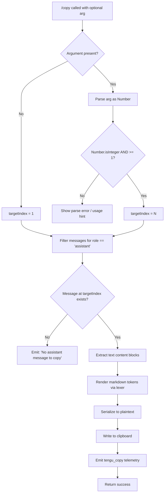

# `/copy`

> Analysis basis: CC v2.1.133 bundle.js (AST extraction + Claude interpretation)
> Minimum version: v2.1.133

---

## Overview

The `/copy` slash command copies Claude's last assistant response to the system clipboard. An optional integer argument `N` allows the user to target the Nth-latest assistant message instead of the most recent one. The command extracts the text content of the selected message, serializes it, and writes it to the clipboard via the platform's native mechanism.

---

## Registration

| Field | Value |
|---|---|
| type | `local-jsx` |
| name | `copy` |
| description | `Copy Claude's last response to clipboard (or /copy N for the Nth-latest)` |
| module_id | `La9` |

Analysis basis: CC v2.1.133 bundle.js:+9853662

---

## Input Branching

The command handler (`h67`) accepts an optional argument string. The branching logic is:

1. If the argument is absent or empty → target index defaults to `1` (most recent assistant message).
2. If the argument is present → attempt to parse it as a number via `Number()`.
3. If the parsed value is a valid integer (`Number.isInteger`) and ≥ 1 → use it as the Nth-latest index.
4. If parsing fails or the value is not a valid positive integer → display an error.
5. If no assistant message exists at the resolved index → emit the literal error `"No assistant message to copy"`.
6. If a valid assistant message is found → extract its text content, perform markdown-to-plaintext rendering, and write to clipboard.



Analysis basis: CC v2.1.133 bundle.js:+9852847 (handler entry), +9852957 (`Number` parse), +9852971 (`Number.isInteger` check), +9852888 (`"No assistant message to copy"` literal), +9853266 (telemetry emit)

---

## Behavioral Spec

### 1. Argument Parsing

```
function parseTargetIndex(rawArg):
    if rawArg is absent or blank:
        return 1
    n = Number(rawArg)
    if Number.isInteger(n) AND n >= 1:
        return n
    else:
        raise UsageError("argument must be a positive integer")
```

Analysis basis: CC v2.1.133 bundle.js:+9852957, +9852971

---

### 2. Assistant Message Selection

```
function selectAssistantMessage(conversationMessages, targetIndex):
    assistantMessages = conversationMessages
        .filter(msg => msg.role == "assistant")
        .reverse()          // most-recent first
    if assistantMessages.length == 0 OR targetIndex > assistantMessages.length:
        return Error("No assistant message to copy")
    return assistantMessages[targetIndex - 1]
```

The role filter uses the string literal `"assistant"`.
Analysis basis: CC v2.1.133 bundle.js:+9848795 (`"assistant"` literal), +9852888 (`"No assistant message to copy"` literal), +9853142 (`"message"` literal), +9853152 (`"messages"` literal)

---

### 3. Content Extraction and Text Normalization

```
function extractTextContent(messageContentBlocks):
    textParts = []
    for block in messageContentBlocks:
        filtered = filterToTextBlocks(block)   // keeps only blocks with type "text"
        textParts.push(filtered.text)
    return textParts.join("")
```

Only content blocks whose type equals `"text"` are retained; other block types (tool use, tool result, images) are discarded.
Analysis basis: CC v2.1.133 bundle.js:+9719750 (`"text"` literal), +9848897 (`filterToTextBlocks` call via `NL`)

---

### 4. Markdown Token Rendering (Table Handling)

The raw text is tokenized via the markdown lexer (`Ef.lexer`). The implementation contains special-case logic for `"table"` tokens:

```
function renderTokensToPlaintext(tokens):
    output = []
    for token in tokens:
        if token.type == "table":
            renderedTable = renderMarkdownTable(token)
            // Column separators: " | " (literal)
            // Pipe escape pattern: "\|" is unescaped
            // Column alignment: "center", "right", "left"
            // Minimum column width: 3 characters
            // Column padding computed via Math.max(headerWidth, cellWidth, 3)
            output.push(renderedTable)
        else if token.type == "code":
            output.push(token.text)   // code block content preserved as-is
        else:
            output.push(stripMarkdown(token))
    return output.join("\n")
```

Table column separator literal: `" | "` (Analysis basis: CC v2.1.133 bundle.js:+9848135)
Pipe escape literal: `"\\|"` (Analysis basis: CC v2.1.133 bundle.js:+9847976)
Alignment values: `"center"`, `"right"`, `"left"` (Analysis basis: CC v2.1.133 bundle.js:+9848170, +9848212, +9848252)
Minimum column width: `3` (Analysis basis: CC v2.1.133 bundle.js:+9848035)
Token type `"table"` (Analysis basis: CC v2.1.133 bundle.js:+9848559)
Token type `"code"` (Analysis basis: CC v2.1.133 bundle.js:+9847722)
Markdown parser: `oWH.parse` via `Ef` (Analysis basis: CC v2.1.133 bundle.js:+4333133, +9848446)

---

### 5. Terminal Width Measurement

When rendering table columns, the implementation uses `Bun.stringWidth` (via `z8`) to measure display width of each cell string, ensuring correct alignment in terminals that display wide (CJK) characters.

```
function measureDisplayWidth(cellString):
    return Bun.stringWidth(cellString)   // accounts for multi-byte / wide chars
```

Analysis basis: CC v2.1.133 bundle.js:+165342 (`Bun.stringWidth` call), +9848051 (`z8` call from `eo9`)

---

### 6. Plaintext File Fallback Path

The call graph reveals a secondary path (`qa9`) that writes content to a `.txt` file using `K38.writeFile` and `K38.mkdir`. This is invoked when the clipboard API is unavailable or when the rendered output is directed to a file sink.

```
function writePlaintextFile(content, outputPath):
    ensureDirectoryExists(outputPath.parent, mode=448)   // octal 0o700
    await fileSystem.writeFile(outputPath, content)
```

File extension used: `".txt"` (Analysis basis: CC v2.1.133 bundle.js:+9849032)
Plaintext content type label: `"plaintext"` (Analysis basis: CC v2.1.133 bundle.js:+9849000)
Directory creation mode: `448` (decimal, = `0o700`) (Analysis basis: CC v2.1.133 bundle.js:+9849134)
Analysis basis: CC v2.1.133 bundle.js:+9849069 (`cP` call), +9849076 (`so9.join`), +9849103 (`K38.mkdir`), +9849146 (`K38.writeFile`)

---

### 7. Clipboard Write

```
function writeToClipboard(plaintextContent):
    clipboardProvider = resolveClipboardEncoder()   // kE: detects encoding (utf8/base64)
    detectPlatformLineEndings(plaintextContent)     // l4: checks indexOf for line-end style
    writeClipboardContent(plaintextContent)         // qa9: performs the actual write
```

Encoding options observed: `"utf8"`, `"base64"` (Analysis basis: CC v2.1.133 bundle.js:+3188418, +3188435)
Analysis basis: CC v2.1.133 bundle.js:+9849211 (`kE` call from `LvA`), +9849252 (`l4` call), +9849291 (`qa9` call)

---

### 8. Markdown Inline Replacement

A helper (`_a9`) applies a `H.replace` pass over inline markdown syntax (bold, italic, backticks, links) to produce a clean plain-text representation before clipboard insertion.

```
function stripInlineMarkdown(inlineText):
    return inlineText.replace(markdownInlinePattern, replacementFn)
```

Analysis basis: CC v2.1.133 bundle.js:+9848960

---

## State & Side Effects

| Item | Detail |
|---|---|
| Telemetry | `tengu_copy` emitted on every successful copy operation (bundle.js:+9853266) |
| Telemetry (incidental) | `tengu_mcp_retry_failed_remote` (MCP subsystem, not directly triggered by `/copy`; bundle.js:+13870729) |
| Telemetry (incidental) | `tengu_config_parse_error` (config subsystem; bundle.js:+3113854) |
| Clipboard | System clipboard is written with the plaintext-rendered assistant message |
| File system | Optional `.txt` file written when clipboard path is unavailable (via `K38.writeFile`) |
| Directory creation | Parent directory created with mode `0o700` if absent (bundle.js:+9849134) |
| appState changes | No persistent appState mutation observed at depth ≤ 2 |
| Hook registration | No hook registration observed at depth ≤ 2 |
| Sound | <!-- TODO: not found in depth-2 traversal; needs --depth 4 --> |

---

## Version History

| Version | Change |
|---|---|
| v2.1.133 | Initial analysis |

---

## Common Mistakes

1. **Passing a non-integer argument** — `/copy 1.5` or `/copy last` will fail argument validation because `Number.isInteger` rejects non-integers and non-numeric strings. Always pass a bare positive integer or omit the argument entirely.
2. **Expecting N to be zero-indexed** — The argument `N` is 1-based (the most recent message is `/copy 1`, not `/copy 0`). Passing `0` will fail the `>= 1` guard.
3. **Assuming all content blocks are copied** — Only blocks with type `"text"` are included. Tool-use blocks, image blocks, and tool-result blocks are silently dropped from the copied content.
4. **Expecting rich markdown in the clipboard** — The command renders markdown to plaintext before copying. Tables become ASCII-aligned text; code blocks are included as raw text; inline formatting (bold, italic, links) is stripped.
5. **Using `/copy` when no assistant turn exists** — Running `/copy` at the start of a session or after only user messages produces the error `"No assistant message to copy"` and writes nothing to the clipboard.
6. **Requesting an index deeper than the conversation history** — `/copy 10` in a session with only 3 assistant messages will trigger the out-of-bounds error path, not copy the oldest message.

---

## Appendix — Identifier Mapping

> For bundle debugging only. Identifiers change across versions.

| Identifier | Role |
|---|---|
| `eo9` | Table markdown renderer — formats token list into aligned plain-text table rows |
| `V67` | Column header mapping helper — maps table header tokens to display strings |
| `XDq` | Session/message factory — constructs new message objects with timestamps |
| `d8` | Message state handler — processes stopped/background session state |
| `z8` | Display-width measurement — wraps `Bun.stringWidth` for wide-char support |
| `Ha9` | Message content extractor — finds and slices assistant message content blocks |
| `Ef` | Markdown lexer wrapper — exposes `Ef.lexer` for tokenizing markdown text |
| `_a9` | Inline markdown stripper — applies regex replacements to remove inline syntax |
| `Aa9` | Text block filter/collector — checks `Array.isArray`, filters to text blocks |
| `NL` | Content block type filter — filters blocks by `type == "text"` |
| `h67` | Top-level `/copy` command handler — entry point; orchestrates argument parsing, message selection, rendering, and clipboard write |
| `I67` | Code block extractor — lexes content and collects `"code"` typed tokens |
| `COH` | Code block text normalizer — applies `H.replace` to code block content |
| `R6` | Config/file-system resolver — resolves config state and initiates file watchers |
| `m5H` | Config file reader — reads, parses, and migrates config files from disk |
| `u2K` | File watcher — wraps `Yd6.watchFile` / `Yd6.unwatchFile` for config change detection |
| `LvA` | Clipboard write orchestrator — sequences encoding detection, line-ending detection, and clipboard write |
| `kE` | Clipboard encoding detector — selects `"utf8"` or `"base64"` encoding |
| `l4` | Line-ending style detector — uses `H.indexOf` to detect CRLF vs LF |
| `qa9` | Clipboard / file writer — performs `K38.mkdir` + `K38.writeFile` for plaintext output |
| `iZH` | MCP server connection initializer — connects configured MCP servers (not directly part of `/copy` logic) |
| `mFq` | MCP update applier — applies MCP state updates and handles cleanup |
| `J6` | MCP client registry — manages client set membership and retrieval |
| `Og7` | MCP server orchestrator — filters, connects, and maps MCP server entries |
| `k` | Platform/environment detector — checks environment type (`debug`, `native`, etc.) |
| `M` | App state/session manager — aggregates session state, MCP clients, and config |