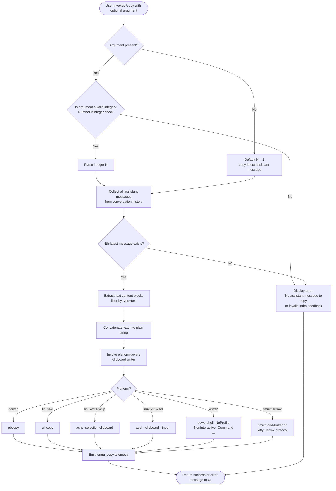

# `/copy`

> Analysis basis: CC v2.1.133 bundle.js (AST extraction + Claude interpretation)
> Minimum version: v2.1.133

---

## Overview

The `/copy` slash command copies Claude's most recent assistant response to the system clipboard. When given a numeric argument `N`, it copies the Nth-latest assistant message instead. The command resolves the target message from the conversation history, extracts its plain-text content, and delegates to a platform-aware clipboard writer.

---

## Registration

| Field | Value |
|---|---|
| type | `local-jsx` |
| name | `copy` |
| description | `Copy Claude's last response to clipboard (or /copy N for the Nth-latest)` |
| module_id | `La9` |
| load_inline | `true` |
| loc_byte | `9853662` |
| loc_byte_end | `9853848` |
| loc_line | `5564` |
| arbor_handler.name | `h67` |
| arbor_handler.fqn | `claude-2.1.133::h67` |
| arbor_handler.kind | `AsyncFunction` |
| arbor_handler.resolution_path | `module_id` |
| arbor_handler.n_hits | `0` |

Analysis basis: CC v2.1.133 bundle.js:+9853662

---

## Input Branching

Three distinct branches are present: no argument (copy last response), a valid integer argument (copy Nth-latest response), and an invalid/non-integer argument (error path). A Mermaid flowchart is used.



---

## Behavioral Spec

### Handler Entry Point (`h67`)

The Arbor-resolved handler is `h67` (AsyncFunction, resolved via `module_id` → `La9`).

Analysis basis: CC v2.1.133 bundle.js:+9852847

```
async function copyCommandHandler(args, conversationContext):
    // Step 1: Collect assistant messages from conversation history
    assistantMessages = collectAssistantMessages(conversationContext)
    // Aa9 at bundle.js:+9852847

    // Step 2: Parse numeric index from args (if provided)
    rawArg = args  // H at bundle.js:+9852886
    if rawArg is present:
        index = Number(rawArg)  // bundle.js:+9852957
        if not Number.isInteger(index):
            return errorResult("No assistant message to copy")
            // literal at bundle.js:+9852888
    else:
        index = 1  // default: latest message

    // Step 3: Retrieve Nth-latest assistant message
    // index=1 means the most recent; index=N means Nth from the end
    targetMessage = getNthLatestAssistantMessage(assistantMessages, index)
    // Ha9 at bundle.js:+9853201

    if targetMessage is null or undefined:
        return errorResult("No assistant message to copy")

    // Step 4: Extract plain text from target message
    plainText = extractTextContent(targetMessage)
    // filters content blocks where type == "text" (literal at bundle.js:+9719750)
    // NL/H.filter at bundle.js:+9719727

    // Step 5: Write text to system clipboard
    writeToClipboard(plainText)
    // LvA / kE at bundle.js:+9853355, +9849211

    // Step 6: Emit telemetry
    emit("tengu_copy")  // bundle.js:+9853266

    // Step 7: Return contextual result to UI
    // "message" / "messages" literals at bundle.js:+9853142, +9853152
    return successResult(targetMessage, index)
```

Analysis basis: CC v2.1.133 bundle.js:+9852847 – +9853662

---

### Assistant Message Collection (`Aa9`)

```
function collectAssistantMessages(conversationContext):
    // Array.isArray check at bundle.js:+9848865
    if not Array.isArray(conversationContext):
        return []

    result = []
    for each message in conversationContext:
        // filter role == "assistant" (literal at bundle.js:+9848795)
        if message.role == "assistant":
            result.push(message)  // A.push at bundle.js:+9848913

    // NL: further filters content blocks by type == "text"
    // H.filter at bundle.js:+9719727
    return result filtered to those with at least one text content block
```

Analysis basis: CC v2.1.133 bundle.js:+9848865

---

### Nth-Latest Message Retrieval (`Ha9`)

```
function getNthLatestAssistantMessage(assistantMessages, N):
    // Uses Ef.lexer for markdown-aware parsing at bundle.js:+9848446
    // H.indexOf at bundle.js:+9848492
    // eo9 — table rendering helper, invoked at bundle.js:+9848613
    // _.slice to extract sub-range at bundle.js:+9848624

    reversedMessages = assistantMessages.slice().reverse()
    if N < 1 or N > reversedMessages.length:
        return null
    return reversedMessages[N - 1]
```

The internal rendering path (`eo9`) prepares a table-formatted summary of messages (using column separators `" | "`, alignment `"center"`, `"right"`, `"left"` — literals at bundle.js:+9848135, +9848170, +9848212, +9848252) when displaying the index listing, but the actual clipboard payload is the raw text content, not the rendered table.

Analysis basis: CC v2.1.133 bundle.js:+9848446 – +9848624

---

### Table Rendering Helper (`eo9`)

This function formats multi-message listings for display (not copied to clipboard).

```
function renderMessageTable(messages, maxWidth):
    // V67.map — map over rows at bundle.js:+9847898
    // $.map — map over columns at bundle.js:+9847949
    // O.replace with "\|" escape at bundle.js:+9847960, +9847976
    // Math.max for column widths at bundle.js:+9848026
    // z8 (Bun.stringWidth) for terminal-aware width at bundle.js:+9848051
    // column minimum width = 3 (literal at bundle.js:+9848035)
    // separator = " | " (literal at bundle.js:+9848135)
    // alignment modes: "center", "right", "left"

    for each message row:
        escapedCells = cells.map(c => c.replace("|", "\\|"))
        colWidths     = Math.max(minWidth=3, terminalWidth(cell))
        alignedCells  = cells.map((cell, col) => align(cell, colWidths[col], alignment[col]))

    return rows joined by newline, columns joined by " | "
```

Analysis basis: CC v2.1.133 bundle.js:+9847933 – +9848404

---

### Platform-Aware Clipboard Writer (`kE` via `LvA`)

```
function writeToClipboard(text):
    platform = process.platform

    if platform == "darwin":          // bundle.js:+9853355 via kE/x0K/Y8/N6
        spawn("pbcopy", [], stdin=text)  // literal at bundle.js:+9188656 (pbcopy)

    else if platform == "linux":      // literal at bundle.js:+3188682
        if waylandAvailable():
            spawn("wl-copy", [], stdin=text)       // literal at bundle.js:+3188721
        else if xclipAvailable():
            spawn("xclip", ["-selection", "clipboard"], stdin=text)
            // literals at bundle.js:+3188767, +3188788, +3188801
        else if xselAvailable():
            spawn("xsel", ["--clipboard", "--input"], stdin=text)
            // literals at bundle.js:+3188833, +3188852, +3188866

    else if platform == "win32":      // literal at bundle.js:+3189133
        spawn("powershell", ["-NoProfile", "-NonInteractive", "-Command", <pipe-expr>], stdin=text)
        // literals at bundle.js:+3189145, +3189159, +3189172, +3189190

    // Terminal multiplexer / special terminal fallbacks:
    if insideTmux():
        // iTerm2/tmux load-buffer path
        // literals: "tmux" at bundle.js:+3188317, "load-buffer" at +3188255, "-w" at +3188289
        spawnTmux("load-buffer", "-w", tmpFile)

    if termProgram == "iTerm2":       // literal at bundle.js:+3188245
        useKittyProtocol(text)        // "kitty" literal at bundle.js:+3187755, "base64" at +3188435
```

The tmp-file path for tmux/iTerm2 uses `so9.join` and `K38.writeFile`/`K38.mkdir` (bundle.js:+9849076, +9849103, +9849146). The directory helper `cP` enforces permissions (mode `448` = octal `0700`, literal at bundle.js:+3752739) via `SRK` and `o2H.chmodSync` (bundle.js:+3752560).

Analysis basis: CC v2.1.133 bundle.js:+9849211 – +9849291

---

### Text Content Extraction (`NL`)

```
function extractTextContent(message):
    // H.filter at bundle.js:+9719727
    // type == "text" literal at bundle.js:+9719750
    textBlocks = message.content.filter(block => block.type == "text")
    return textBlocks.map(b => b.text).join("")
```

Analysis basis: CC v2.1.133 bundle.js:+9719727

---

## State & Side Effects

| Item | Detail |
|---|---|
| Telemetry | `tengu_copy` (bundle.js:+9853266) — emitted on every invocation of `/copy` |
| Clipboard mutation | Writes plain text to the OS clipboard via a platform-specific subprocess (`pbcopy`, `wl-copy`, `xclip`, `xsel`, `powershell`, `tmux load-buffer`, or Kitty/iTerm2 protocol) |
| Tmp file (tmux/iTerm2) | A temporary file may be written under the configured tmp directory (enforced mode `0700`) and subsequently cleaned up |
| appState changes | None observed in depth-2 traversal |
| Hook registration | None observed in depth-2 traversal |
| Sound | None observed in depth-2 traversal |
| Error literal | `"No assistant message to copy"` (bundle.js:+9852888) — shown when the conversation has no assistant messages or index `N` is out of range |

---

## Version History

| Version | Change |
|---|---|
| v2.1.133 | Initial analysis |

---

## Common Mistakes

1. **Passing a non-integer argument** — `/copy 1.5` or `/copy foo` fails the `Number.isInteger` check (bundle.js:+9852971) and returns the error message rather than copying anything.
2. **Expecting rich/formatted output** — `/copy` places plain concatenated text on the clipboard; markdown formatting, code fences, and table structures are not preserved in the copied content.
3. **Index off-by-one** — `/copy 1` retrieves the *latest* assistant response (index 1 from the end, not from the beginning). `/copy 2` is the second-latest, etc.
4. **Remote/SSH clipboard unavailability** — On SSH sessions without `DISPLAY` set and without Wayland, none of the Linux clipboard backends (`wl-copy`, `xclip`, `xsel`) may be reachable, causing a silent failure. The tmux path is the fallback in multiplexed sessions.
5. **Invoking before any assistant turn** — If no assistant message exists yet in the session, `/copy` immediately returns the error literal at bundle.js:+9852888.

---

## Appendix — Identifier Mapping

> For bundle debugging only. Identifiers change across versions.

| Identifier | Role |
|---|---|
| `h67` | Main async handler for `/copy` command (Arbor-resolved entry point) |
| `Aa9` | Assistant message collector — filters conversation history by role |
| `Ha9` | Nth-latest message retrieval — reverses list, selects by index |
| `eo9` | Table rendering helper — formats message index listing for display |
| `V67` | Row-map helper used inside table renderer |
| `I67` | Markdown lexer pass used during message rendering |
| `COH` | String replace helper used in lexer normalization |
| `NL` | Text content extractor — filters content blocks by `type == "text"` |
| `_a9` | String replace helper used in plaintext extraction path |
| `LvA` | Clipboard write dispatcher — selects platform strategy |
| `kE` | Core clipboard write implementation |
| `Nj` | Join helper used in clipboard encoding path |
| `x0K` | Darwin/macOS clipboard path selector |
| `Y8` | Clipboard subprocess spawner |
| `C0K` | Additional clipboard path constructor |
| `R0K` | String `replaceAll` helper in clipboard encoding |
| `l4` | `indexOf` helper used in clipboard path resolution |
| `qa9` | Tmp-directory setup for tmux/iTerm2 clipboard path |
| `cP` | Secure tmp-directory creator (enforces mode `0700`) |
| `SRK` | Directory permission validator and chmod helper |
| `z8` | Terminal-aware string width calculator (`Bun.stringWidth`) |
| `d8` | Auxiliary helper reached from table renderer |
| `eo9` | Message table renderer (column alignment, separator `" | "`) |
| `Ef` | Markdown lexer module |
| `y7H` | Text normalization helper (trim, 1000 ms threshold literal at +2123058) |
| `iY` | Atomic file write helper (random bytes, writeFile, rename) |
| `Sj6` | Daemon status path builder (`daemon.status.json`) |
| `SH` | `JSON.stringify` wrapper |
| `XDq` | Daemon status fetch/update helper |
| `yr` | Higher-level text extraction utility |

---

Note: index built via Arbor fallback; some signals (telemetry, literals) may be missing — see arbor-fallback.js.