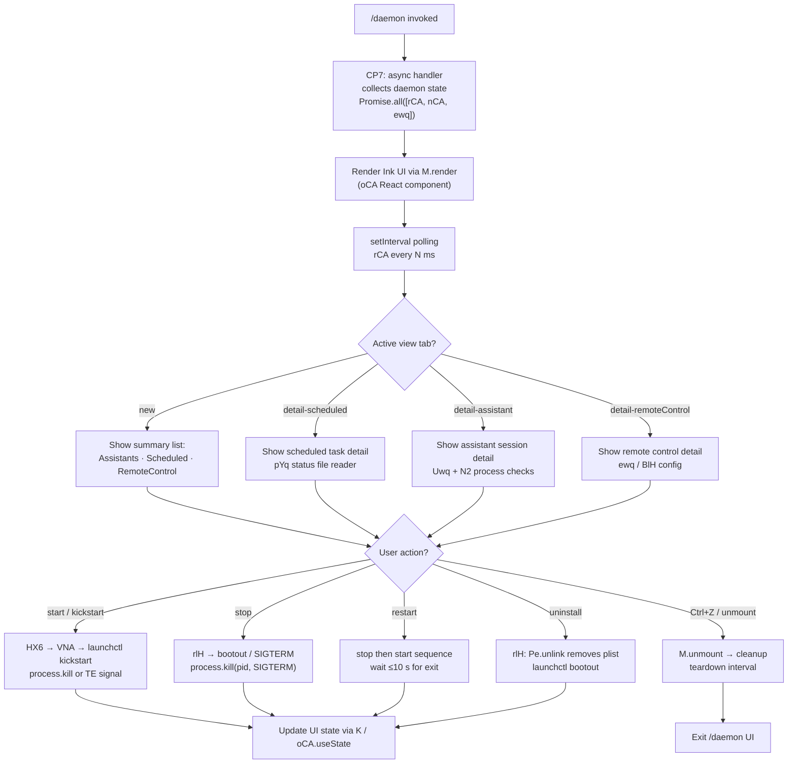

# `/daemon`

> Analysis basis: CC v2.1.133 bundle.js (AST extraction + Claude interpretation)
> Minimum version: v2.1.133

---

## Overview

The `/daemon` command provides an interactive management interface for Claude Code's background service infrastructure, encompassing three categories of background process: AI assistant sessions, scheduled tasks, and remote-control listeners. When invoked, it immediately renders a live terminal UI (via an Ink/React renderer) that polls daemon state at regular intervals and allows the user to inspect, start, stop, restart, and uninstall each service type. The command is classified `immediate`, meaning it runs without entering the normal agent turn loop.

---

## Registration

| Field | Value |
|---|---|
| `type` | `local-jsx` |
| `name` | `"daemon"` |
| `description` | `"Manage background services: assistants, scheduled tasks, and remote control"` |
| `immediate` | `true` |
| `module_id` | `"aCA"` |
| `load_inline` | `true` |
| `loc_byte` | `11617389` |
| `loc_byte_end` | `11617593` |
| `loc_line` | `7634` |
| `arbor_handler.name` | `CP7` |
| `arbor_handler.fqn` | `claude-2.1.133::CP7` |
| `arbor_handler.kind` | `AsyncFunction` |
| `arbor_handler.resolution_path` | `module_id` |
| `arbor_handler.n_hits` | `0` |

Analysis basis: CC v2.1.133 bundle.js:+11617389

The registration block spans bytes `11617389`–`11617593`. Arbor resolved the handler as `CP7` (an `AsyncFunction`) by following `module_id → "aCA"`. The `load_inline: true` flag means the handler is inlined as `load: () => Promise.resolve({ call: CP7 })` rather than being referenced via a separate module export.

---

## Input Branching

The command rendering path has more than three distinct branches based on the selected view tab (`"new"`, `"detail-scheduled"`, `"detail-assistant"`, `"detail-remoteControl"`) and the daemon sub-operation (`"start"`, `"stop"`, `"restart"`, `"uninstall"`, `"kickstart"`, `"bootout"`). A Mermaid flowchart is used.



Analysis basis: CC v2.1.133 bundle.js:+11606375 (oCA component), +11617389 (registration)

---

## Behavioral Spec

### Handler Entry Point — `asyncDaemonHandler` (`CP7`)

```
async function asyncDaemonHandler(context):
    [daemonStatus, assistantDir, scheduledStatus] = await Promise.all([
        collectDaemonStatus(),   // rCA
        resolveAssistantDir(),   // nCA
        loadScheduledStatus()    // ewq
    ])
    renderInkUI(daemonStatus, assistantDir, scheduledStatus)
```

Analysis basis: CC v2.1.133 bundle.js:+11606164 (`CP7` → `Promise.all`, `rCA`, `nCA`, `ewq`)

---

### Daemon Status Collector — `collectDaemonStatus` (`rCA`)

Reads multiple status files in parallel and merges results into a single status object:

```
async function collectDaemonStatus():
    results = await Promise.all([
        loadScheduledTasks(),       // nwq
        readAssistantStatus(),      // Uwq
        readDaemonProcessStatus(),  // N2
        readAssistantPidFile(),     // PDq  → "daemon.status.json"
        readScheduledPidFile(),     // pYq  → "daemon.scheduled.status.json"
        readRosterFile(),           // vm   → "roster.json"
        queryLaunchctlStatus()      // Dg
    ])
    keys = Object.keys(results)
    return mergedStatus
```

Key file names surfaced in literals:
- `"daemon.json"` — main daemon config (bundle.js:+10286617)
- `"daemon.status.json"` — assistant daemon PID/status (bundle.js:+11406987)
- `"daemon.scheduled.status.json"` — scheduled task status (bundle.js:+11496959)
- `"roster.json"` — background session roster (bundle.js:+10292647)

Analysis basis: CC v2.1.133 bundle.js:+11605685 (`rCA` body)

---

### Scheduled Task Loader — `loadScheduledTasks` (`nwq`)

```
async function loadScheduledTasks():
    [taskList, logBuffer] = await Promise.all([
        readScheduledTaskEntries(),   // SiH
        readLogBuffer()               // fH
    ])
    normalizedCount = N2(taskList)
    return { tasks: taskList, logs: logBuffer, count: normalizedCount }
```

`SiH` reads the task list, validates entries (calls `Array.isArray` via `kCA`), and for each entry with `type === "scheduled"` (literal at bundle.js:+11498464), pushes cleanup work via `q.push`. Stale lock files are removed via `Ydq.unlinkSync` (bundle.js:+14137065).

Analysis basis: CC v2.1.133 bundle.js:+11600477

---

### Scheduled Task File Reader — `readScheduledTaskFile` (`eRA`)

```
async function readScheduledTaskFile(path):
    raw = await fileSystem.readFile(path, "utf8")   // encoding literal: +11407809
    trimmed = trim(raw)
    parsed = JSON.parse(trimmed)
    if not Array.isArray(parsed):
        throw new Error("invalid task list")
    return parsed
```

Analysis basis: CC v2.1.133 bundle.js:+11407775

---

### Assistant Directory Resolver — `resolveAssistantDir` (`nCA`)

```
function resolveAssistantDir():
    home = os.homedir()                               // xwq.homedir
    dir  = path.join(home, assistantSubdir)          // UqH.join
    stat = fs.stat(dir)                              // sj6.stat
    if stat fails:
        return fallback via D8 error handler
    return dir
```

The literal `"assistant"` (bundle.js:+11590349) identifies the subdirectory name. The resolver uses `IN6` (a path-normalisation helper) and `F6` before returning.

Analysis basis: CC v2.1.133 bundle.js:+11590289

---

### Daemon Process Status Reader — `readDaemonProcessStatus` (`N2`)

```
async function readDaemonProcessStatus():
    pidData = await readPidFile()      // aJ6: VC.readFile
    try:
        process.kill(pid, 0)           // existence check, signal 0
    catch:
        pid is stale — return dead status
    cmdline = await readCmdline()      // GNA: reads /proc or ps output
    args    = cmdline.split(...).slice(...)
    return buildStatus(pid, args) via TE
```

Sends signal `0` to check liveness without actually killing the process. `GNA` reads the process command line, splits on whitespace, and slices the first 4 fields (literal `4` at bundle.js:+10286070). The human-readable label `"claude daemon"` (bundle.js:+10286043) is used in status display.

Analysis basis: CC v2.1.133 bundle.js:+10286124

---

### Roster File Reader — `readRosterFile` (`vm`)

```
async function readRosterFile():
    raw    = await slH.readFile(rosterPath)   // "roster.json"
    parsed = JSON.parse(raw)                  // p6
    path   = MqH(IIH(...))                    // builds roster dir path
    valid  = D8(parsed)                       // schema check
    age    = hNA()                            // Date.now-based age
    if age check fails or regex test fails:   // e9H.test
        throw new Error(...)
    entries = X97(parsed)                     // Array.isArray + Object.keys validation
    return entries
```

Maximum roster entry byte size: `448` (literal at bundle.js:+10296733). The roster path components include `"pty"` and `"pty-pids"` subdirectories (bundle.js:+10292830, +10293116).

Analysis basis: CC v2.1.133 bundle.js:+10295799

---

### launchctl Status Query — `queryLaunchctlStatus` (`Dg`)

```
async function queryLaunchctlStatus():
    result = await Y8(launchctlArgs)       // spawns "launchctl print …"
    uid    = me9()                         // process.getuid()
    status = p38(result, uid)
    return status
```

Literals confirm the macOS integration: `"launchctl"` (bundle.js:+10290141), `"print"` (bundle.js:+10290154), `"bootout"` (bundle.js:+10288702), `"kickstart"` (bundle.js:+10289064). On non-macOS platforms the launchctl path is skipped; the literal `"darwin"` (bundle.js:+10289712) guards these calls. A platform-check literal `"service uninstall not available on darwin"` (bundle.js:+10288833) appears for the uninstall path.

Analysis basis: CC v2.1.133 bundle.js:+10290138

---

### Ink UI Component — `daemonUIComponent` (`oCA`)

```
function daemonUIComponent(initialState):
    [state, setState] = useState(initialState)      // u9.useState
    [tick,  setTick]  = useState(Date.now())        // u9.useState

    useEffect(() => {
        interval = setInterval(() => {
            newState = rCA()          // re-fetch daemon status
            setState(newState)
            setTick(Date.now())
        }, POLL_INTERVAL)
        return () => clearInterval(interval)
    }, [])

    switch(state.view):
        case "new":              render summaryList(state)
        case "detail-scheduled": render scheduledDetail(state)
        case "detail-assistant": render assistantDetail(state)
        case "detail-remoteControl": render remoteControlDetail(state)

    // Key bindings
    onKey("Ctrl+Z"): M.unmount()
```

View tab literals (bundle.js): `"new"` (+11607085), `"detail-scheduled"` (+11606987), `"detail-assistant"` (+11607145), `"detail-remoteControl"` (+11607266).

UI section labels: `"Scheduled"` (+11607914), `"Remote Control"` (+11608235), `"Claude Daemon"` (+11608520).

Analysis basis: CC v2.1.133 bundle.js:+11606375

---

### Service Lifecycle Operations

#### Stop (`rlH`)

```
async function stopDaemon(options):
    plistPath = INA(TNA.homedir())    // ~/Library/LaunchAgents/<plist>
    status    = Y8(launchctlStatus)
    p38(status)                       // parse uid
    Pe.unlink(plistPath)              // remove plist for uninstall path
    D8(error) / vH(error)            // log
```

Analysis basis: CC v2.1.133 bundle.js:+10288674

#### Start / Kickstart (`HX6` → `VNA`)

```
async function startDaemon(action):    // action: "start"|"kickstart"|"restart"
    p38(getUID())
    Y8(launchctlQuery)
    if action == "restart":
        send SIGTERM, wait ≤50 polls × 200 ms = 10 s max
        if timeout: log "daemon did not exit within 10s of SIGTERM; restart aborted"
    VNA.setTimeout(kickstartCmd, delay)
```

Restart abort message literal: bundle.js:+10289386. Poll count limit: `50` (bundle.js:+10289357).

Analysis basis: CC v2.1.133 bundle.js:+10288947

---

### Background Session Supervisor — `supervisorLoop` (`w`)

The supervisor runs inside the daemon process. The `/daemon` command surface reads its state but does not directly invoke it. Key behaviours observed in the call graph:

```
function supervisorLoop(context):
    loop:
        sessions = _.values(sessionMap)
        for each session:
            if session.phase == "SIGKILL needed":
                session.kill("SIGKILL")         // tengu_bg_dispatch_sigkill_escalate
            checkMemory:
                free = hP8.freemem()
                if free < LOW_MEM_THRESHOLD:    // tengu_bg_dispatch_low_mem
                    shed load
            if session.isSettled():
                x.retireIfSettled(session)
        claimSpare()                            // tengu_bg_spare_claim
        sleep(Math.round(...))
        Date.now() tick
```

Memory thresholds observed: `30` and `15` (MB, bundle.js:+14156995, +14157006). Session blur/focus idle timeout: `3600000` ms = 1 hour (bundle.js:+12972668). Respawn back-off multiplier: `0.8` (bundle.js:+12972724).

Analysis basis: CC v2.1.133 bundle.js:+14156922 (`w` body)

---

### Wire Protocol — `daemonWireProtocol` (`md7`)

The daemon exposes a Unix-socket framed protocol. Message types found in literals:

| Message type | Direction |
|---|---|
| `"ping"` | client → daemon |
| `"nudge"` | client → daemon |
| `"yield"` | daemon → client |
| `"lease"` / `"leases"` | bidirectional |
| `"shutdown"` | client → daemon |
| `"dispatch"` | client → daemon |
| `"reply"` | daemon → client |
| `"resize"` | client → daemon |
| `"attach"` | client → daemon |
| `"list"` | client → daemon |
| `"has"` | client → daemon |
| `"snapshot"` | daemon → client |
| `"stream"` | daemon → client |
| `"subscribe"` | client → daemon |
| `"ensure-spare"` | client → daemon |
| `"permission-response"` | client → daemon |

Error codes found in literals: `"ESTARTING"`, `"EPROTO"`, `"ESTALE"`, `"ETIMEOUT"`, `"ENOJOB"`, `"ENOREPLY"`, `"EUNVERIFIED"`, `"ERESPAWNING"`, `"ETOOLARGE"`, `"EUNKNOWN"`.

Dispatch timeout: `30000` ms (bundle.js:+14144760). Maximum retries: `25` (bundle.js:+14144936).

Analysis basis: CC v2.1.133 bundle.js:+14145482

---

### MCP Server Management — `mcpServerManager` (`iZH`, `gZA`, `M`)

The daemon also manages MCP (Model Context Protocol) servers. Key sub-functions:

- `iZH` — iterates `Object.entries` of the MCP server map, calls `zt` for each entry to resolve server type (`"stdio"`, `"sse"`, `"http"`, `"ws-ide"`, `"sse-ide"`, `"claudeai-proxy"`), then starts/reconnects.
- `gZA` — manages a single MCP connection lifecycle including OAuth flows.
- `_e` — OAuth server (creates HTTP server on `127.0.0.1`, handles `/callback`, timeout `300000` ms = 5 min).
- `eF` — reconnect logic: on `"needs-auth"` result, clears cache and retries once (literal at bundle.js:+9473597).

MCP server config scope literals: `"enterprise"`, `"mcp"`, `"user"`, `"project"`, `"local"` (bundle.js:+7477185–7477415).

Analysis basis: CC v2.1.133 bundle.js:+9474779

---

## State & Side Effects

| Item | Detail |
|---|---|
| Telemetry: `tengu_bg_roster_parse_failed` | Fired when `roster.json` cannot be parsed (bundle.js:+10295889) |
| Telemetry: `tengu_bg_spare_enable` | Fired when spare session pool is enabled (bundle.js:+14156457) |
| Telemetry: `tengu_bg_spare_spawn` | Fired when a spare session is spawned (bundle.js:+14156817) |
| Telemetry: `tengu_bg_spare_claim` | Fired when a spare session is claimed by a foreground client (bundle.js:+14158355) |
| Telemetry: `tengu_bg_spare_claim_fail` | Fired on spare claim failure (bundle.js:+14158618) |
| Telemetry: `tengu_daemon_config_reload` | Fired when daemon config is hot-reloaded (bundle.js:+14170592) |
| Telemetry: `tengu_daemon_control` | Fired on daemon control operations (start/stop/restart) (bundle.js:+14191366) |
| Telemetry: `tengu_daemon_yield` | Fired when daemon yields to a foreground instance (bundle.js:+14174626) |
| Telemetry: `tengu_daemon_idle_exit` | Fired when daemon exits due to idle timeout (bundle.js:+14175380) |
| Telemetry: `tengu_bg_dispatch_sigkill_escalate` | Fired when SIGTERM is escalated to SIGKILL (bundle.js:+14157040) |
| Telemetry: `tengu_bg_dispatch_low_mem` | Fired when low-memory shedding is triggered (bundle.js:+14157619) |
| Telemetry: `tengu_bg_low_mem_mb` | Reports free-memory MB at low-mem event (bundle.js:+14156207) |
| Telemetry: `tengu_bg_sendclaim_failed` | Fired when send-claim to daemon socket fails (bundle.js:+14139405) |
| Telemetry: `tengu_bg_attach` | Fired on session attach (bundle.js:+14150138) |
| Telemetry: `tengu_bg_attach_stall_ms` | Reports stall duration on attach (bundle.js:+14142600) |
| Telemetry: `tengu_bg_attach_stall_gave_up` | Fired when attach stall exceeds retry limit (bundle.js:+14150972) |
| Telemetry: `tengu_bg_attach_stall_respawn` | Fired when stalled session is respawned (bundle.js:+14151241) |
| Telemetry: `tengu_bg_attach_legacy_autorespawn` | Fired when legacy job triggers auto-respawn (bundle.js:+14149728) |
| Telemetry: `tengu_bg_dispatch_stale_drop` | Fired when a stale dispatch is dropped (bundle.js:+14147847) |
| Telemetry: `tengu_bg_proto_mismatch` | Fired on wire protocol version mismatch (bundle.js:+14146608) |
| Telemetry: `tengu_bg_dispatch_sigkill_escalate` | See above |
| Telemetry: `tengu_mcp_oauth_flow_start` | MCP OAuth flow started (bundle.js:+9406234) |
| Telemetry: `tengu_mcp_oauth_flow_success` | MCP OAuth flow succeeded (bundle.js:+9410609) |
| Telemetry: `tengu_mcp_oauth_flow_error` | MCP OAuth flow failed (bundle.js:+9411696) |
| Telemetry: `tengu_mcp_retry_failed_remote` | MCP remote server retry exhausted (bundle.js:+13870729) |
| Telemetry: `tengu_config_auth_loss_prevented` | Auth data loss in config save prevented (bundle.js:+3108610) |
| Telemetry: `tengu_config_parse_error` | Config file parse error (bundle.js:+3113854) |
| Telemetry: `tengu_feature_ok` / `tengu_feature_bad` | Feature flag evaluation OK/bad (bundle.js:+907381, +907437) |
| Telemetry: `tengu_amber_anchor` | Background-service capability anchor event (bundle.js:+3105007) |
| Telemetry: `tengu_iron_gate_closed` | Iron-gate permission check closed (bundle.js:+7940935) |
| File writes | `daemon.json`, `daemon.status.json`, `daemon.scheduled.status.json`, `roster.json`, `mcp-needs-auth-cache.json` |
| Process signals | `SIGTERM` (graceful stop), `SIGKILL` (escalation), signal `0` (liveness check) |
| IPC socket | Unix domain socket; framed binary protocol via `Em` (Buffer framing) |
| Ink UI lifecycle | `M.render(oCA, ...)` on entry; `M.unmount()` on Ctrl+Z or exit |
| Polling interval | `setInterval` on `rCA`; cleared by `clearInterval` on unmount |
| launchctl integration | macOS only (`"darwin"` guard); uses `launchctl kickstart`, `launchctl print`, `launchctl bootout` |
| Plist file | Stored under `~/Library/LaunchAgents/`; removed by `Pe.unlink` on uninstall |

---

## Version History

| Version | Change |
|---|---|
| v2.1.133 | Initial analysis — `local-jsx` immediate command; handler `CP7` resolved via `module_id:"aCA"`; full daemon lifecycle management including MCP, background sessions, and launchctl |

---

## Common Mistakes

1. **Expecting a text response**: `/daemon` is `immediate` and `local-jsx` — it renders an Ink terminal UI directly, not an agent message. There is no text output to pipe or capture.
2. **Assuming cross-platform launchctl support**: The `"darwin"` guard means `kickstart`, `bootout`, and plist operations are macOS-only. On Linux/Windows the service-management paths diverge or are unavailable (literal `"service uninstall not available on darwin"` confirms a distinct Linux path).
3. **Confusing `/daemon` with the daemon process itself**: `/daemon` is a management UI command that _connects to_ or _reads state from_ a separately running daemon process. Invoking `/daemon` does not start the daemon; it displays its current state.
4. **Missing the 10-second restart timeout**: The restart path polls for process exit for at most 50 × 200 ms iterations. If the daemon does not exit within ~10 seconds of SIGTERM, the restart is aborted and an error is logged — no SIGKILL escalation is performed during the UI-driven restart (SIGKILL escalation is a supervisor-internal mechanism, not triggered by the UI restart action).
5. **Expecting MCP changes to appear immediately**: MCP server reconnection is asynchronous and governed by `Promise.race` in `gZA`. OAuth flows have a 300-second (5-minute) timeout; UI state may not refresh until the next poll interval completes.
6. **Detaching incorrectly**: The correct detach key is **Ctrl+Z**, which calls `M.unmount()`. Other interrupt keys may terminate the underlying process rather than cleanly detaching from the UI.

---

## Appendix — Identifier Mapping

> For bundle debugging only. Identifiers change across versions.

| Identifier | Role |
|---|---|
| `CP7` | Arbor-resolved async handler for `/daemon` command (entry point) |
| `FP7` | UI render orchestrator; calls `rCA`, `nCA`, `ewq`, `M.render`, `M.unmount` |
| `rCA` | Daemon status collector; fans out to all status readers |
| `LDH` | Sub-helper called at start of `rCA` |
| `nwq` | Scheduled task loader; `Promise.all([SiH, fH, N2])` |
| `SiH` | Scheduled task entry reader; validates array, pushes cleanup |
| `eRA` | Scheduled task file reader; reads UTF-8 JSON, validates array |
| `kCA` | Array-type validator for task entries |
| `fH` | Log-buffer / feature-flag reader |
| `HA` | Error formatter used in `fH` |
| `kH` | String coercion utility |
| `yq` | Traffic-priority helper (`"essential-traffic"`) |
| `NJL` | Ring-buffer shift/push utility |
| `N2` | Daemon process status reader; sends signal 0, reads cmdline |
| `aJ6` | PID file reader (VC.readFile) |
| `GNA` | Command-line argument reader; splits and slices process args |
| `TE` | Status builder / result formatter |
| `Uwq` | Assistant status reader; calls `eDH`, `oy`, `N2`, `A.map` |
| `eDH` | Config/MCP status file reader; handles ENOENT |
| `w8` | File-system error classifier |
| `lCA` | Config cache helper (calls `cCA`) |
| `vH` | String coercion / error string helper |
| `L` | Formatted display list builder (padEnd columns) |
| `oy` | Path joiner for daemon.json (`ENA.join`) |
| `PDq` | Assistant PID-file reader → `"daemon.status.json"` |
| `Sj6` | Path builder for `daemon.status.json` |
| `pYq` | Scheduled PID-file reader → `"daemon.scheduled.status.json"` |
| `mYq` | Path builder for `daemon.scheduled.status.json` |
| `vm` | Roster file reader (`"roster.json"`); validates schema, checks age |
| `p6` | JSON.parse wrapper |
| `MqH` | Roster directory path builder |
| `IIH` | Inner roster path component builder |
| `D8` | Error/ENOENT handler |
| `hNA` | Timestamp age checker (Date.now) |
| `ie9` | Roster rename/rotate helper |
| `X97` | Roster entry validator (Array.isArray + Object.keys) |
| `Dg` | launchctl status query orchestrator |
| `Y8` | launchctl command spawner |
| `GA` | Process spawner with output capture |
| `N6` | Child-process helper |
| `p38` | UID-aware status parser |
| `me9` | process.getuid() wrapper |
| `nCA` | Assistant directory resolver (homedir + stat) |
| `LA` | Platform/path utility |
| `IN6` | Path normaliser (`F6` + `D8`) |
| `F6` | Path resolution primitive |
| `H` | Random-delay / jitter helper (Math.random + setTimeout) |
| `M` | Ink renderer instance (render/unmount) |
| `iZH` | MCP server map iterator; dispatches per server type |
| `zt` | MCP server-type resolver |
| `SEH` | MCP server configuration processor (enterprise/user/project/local scopes) |
| `Ot` | MCP server option collector |
| `XO6` | MCP server deduplication map (q.has/set/get) |
| `$I` | MCP entry constructor |
| `dM` | MCP entry builder (OxH + R6 + I9) |
| `CJA` | MCP capability adjuster |
| `AA` | Display-name helper |
| `AJ6` | Display utility |
| `so4` | MCP needs-auth cache reader (KIA + Date.now) |
| `KIA` | MCP auth-cache file reader |
| `G98` | MCP server hash/key builder (sha256) |
| `Vl` | Key string formatter |
| `W98` | Deduplication key builder |
| `GJ` | SHA-256 hash generator (BX9.createHash) |
| `K8` | MCP debug logger (yQ.logMCPDebug) |
| `gZA` | MCP single-connection lifecycle manager |
| `qo4` | MCP connection factory |
| `lp` | MCP transport builder (Fb + BK) |
| `_e` | MCP OAuth HTTP server; handles /callback, 300 s timeout |
| `KlH` | Pending-auth set manager (of8) |
| `Y` | Memory/session metrics reporter (hP8.freemem) |
| `AM8` | MCP auth-cache file remover |
| `eF` | MCP reconnect logic; retries on needs-auth after cache clear |
| `Fb` | MCP transport base |
| `D` | Supervisor config-update dispatcher |
| `T7` | MCP error logger (yQ.logMCPError) |
| `Lo4` | MCP reconnect timeout helper |
| `_o4` | SSH-environment-aware URL builder |
| `QZA` | MCP OAuth complete-authentication tool handler |
| `LlH` | Active-auth-request registry getter (rf8) |
| `flH` | Pending-auth registry getter (of8) |
| `K` | Promise-tracking set (add/finally/delete) |
| `Yl9` | MCP auth-cache file writer |
| `JM8` | Auth-cache file path builder |
| `SH` | JSON.stringify wrapper |
| `BZA` | MCP token store (GJ + dK + Bw6) |
| `dK` | Token key builder |
| `Bw6` | Token read/update helper |
| `kJA` | MCP server capability filter |
| `e6` | MCP tool definition builder |
| `_` | String lowercase utility |
| `J` | Session kill helper (_.values + v.kill) |
| `v` | Background worker process object |
| `S` | Session writer |
| `z` | Output stream handler |
| `$l9` | Async-mapper wrapper (GMH) |
| `GMH` | Async-mapper core (AggregateError aware) |
| `_J6` | parseInt-based index parser |
| `fIA` | parseInt-based port parser |
| `mFq` | MCP update applier (H.applyMcpUpdate) |
| `XM8` | MCP state serialiser |
| `hI` | MCP cleanup coordinator (DlH + L.cleanup) |
| `DlH` | MCP server disposer |
| `k` | Terminal output formatter (SH + Uf + LkH + vtq) |
| `Ztq` | Terminal layout calculator |
| `xcA` | Terminal colour helper |
| `Uf` | Log-line truncator / redactor |
| `rnA` | Log-line mapper |
| `LkH` | Terminal write helper (UnA) |
| `UnA` | Raw terminal writer |
| `vtq` | File-backed log rotator |
| `uNH` | Buffered log flusher (setTimeout/setImmediate) |
| `aHH` | Log-file path builder |
| `dG8` | File-write error handler |
| `_iA` | Log-file path resolver |
| `AiA` | Log-file rotation handler (rename/unlink) |
| `Vtq` | Log append with rotation |
| `y1` | Active-write-set tracker |
| `$` | Daemon command dispatcher |
| `XDq` | Daemon socket frame writer (iY + SH) |
| `yr` | Timestamp wrapper |
| `iY` | Atomic file writer (randomBytes + writeFile + rename) |
| `J6` | Session store (Bq6 + gq6 + Po + _d6) |
| `Po` | Session lookup helper |
| `jo` | Session executor |
| `_d6` | Session-set deduplication (Ut8) |
| `pt8` | Session spawn (randomUUID + Xo.emit) |
| `ct8` | Session context builder |
| `R6` | Session lifecycle manager (Date.now + u2K) |
| `m5H` | Config file reader (readFileSync + statSync + mkdirSync) |
| `u2K` | File watcher (Yd6.watchFile / unwatchFile) |
| `Og7` | MCP retry-remote manager |
| `T98` | MCP server type checker (RT4 + CT4) |
| `r8` | Timer + retry wrapper (setTimeout + clearTimeout) |
| `O` | Background-session stop controller |
| `ewq` | Remote-control / scheduled status loader (BlH) |
| `BlH` | Remote-control config processor (U87 + model list) |
| `U87` | Model registry builder |
| `C_` | Model credential resolver |
| `kr` | Max-plan credential reader |
| `k7H` | Team credential reader |
| `FRH` | Enterprise credential reader |
| `W38` | Model config builder |
| `LX` | Model display builder |
| `yt` | Model tier helper |
| `vvA` | Model extra-info builder |
| `f` | Transport close handler |
| `Ys9` | Sonnet-1M model entry |
| `_9H` | Tier helper variant |
| `Ds9` | Sonnet base model entry |
| `Ws9` | Opus-1M model entry |
| `Ps9` | Opus model entry |
| `zM` | Model schema validator |
| `Ms9` | Custom model slot |
| `Os9` | Opus-1M alt entry |
| `Ks9` | Custom model slot alt |
| `fs9` | Sonnet model entry variant |
| `$s9` | Sonnet-1M entry variant |
| `zs9` | Custom model slot variant |
| `js9` | Haiku model entry |
| `C87` | Model capability flags |
| `b87` | Opus-1M entry (billed-extra) |
| `E8H` | Model base builder |
| `DM` | Model data mapper |
| `Js9` | Opus-4.6 entry |
| `Xs9` | Opus-4.6-1M entry |
| `u87` | Plan-mode model entry |
| `qs9` | Gateway model loader |
| `Hs9` | Gateway file path builder |
| `_s9` | Gateway model path resolver |
| `PU` | Allowlist-based model filter |
| `AV` | Allowlist checker |
| `v7H` | Model-list text parser |
| `VwH` | Model display formatter |
| `YIH` | Model filter + text-parse combinator |
| `p87` | Model extra-info injector |
| `F87` | Model entry finaliser |
| `MW` | Model name normaliser (toLowerCase) |
| `B87` | Model capability resolver |
| `oCA` | Ink React component for `/daemon` UI |
| `Z` | Interval handle |
| `w` | Supervisor loop / session manager |
| `y` | Clipboard/image handler |
| `WrH` | Image capture helper |
| `BEq` | Image path builder |
| `QEq` | Image queue processor |
| `GrH` | Image write helper |
| `gEq` | PNG file writer |
| `uH` | Error display helper |
| `hH` | Info display helper |
| `sFA` | macOS memory reporter |
| `x` | Retry timer manager (clearTimeout + $.write) |
| `nFA` | Claim-send helper (NP8.connect framed write) |
| `kd7` | Claim attempt with timeout (5000 ms) |
| `yd7` | Low-level socket connector |
| `Nd7` | Claim frame builder (gm.buildClaimFrame) |
| `Em` | Binary frame encoder (Buffer) |
| `tFA` | Background-task orchestrator (job tracking, roster, PTY paths) |
| `xL` | Project path resolver |
| `VW` | Project path builder |
| `r9` | Job file reader (stat + readFile + JSON + QfH cache) |
| `Hw` | Active-job tracker |
| `CE` | Concurrency envelope |
| `Pf` | Job file writer (iY + SH) |
| `lP` | Job cache invalidator |
| `tlH` | Daemon config writer (vm + iY + SH + Date.now) |
| `j97` | Config directory initialiser (mkdir + iY + SH) |
| `$qH` | PTY-pids file path builder |
| `vIH` | PTY path resolver |
| `_N` | PTY-pids reader/splitter |
| `Vm` | PTY manager (NNA + alH) |
| `NNA` | PTY worker starter |
| `alH` | PTY path helper |
| `u` | Session disposable |
| `X` | Session wrapper (calls `w`) |
| `rlH` | Daemon stop/uninstall handler (INA + Y8 + p38 + Pe.unlink) |
| `INA` | LaunchAgents plist path builder |
| `HX6` | Daemon start/restart UI handler (calls VNA) |
| `VNA` | launchctl kickstart orchestrator with restart timeout |
| `j` | IPC socket connection (md7 protocol) |
| `ff` | Socket end/close helper |
| `md7` | Daemon wire-protocol message dispatcher (all message types) |
| `pd7` | Protocol sub-dispatcher |
| `_Y` | Session store accessor (x5H) |
| `x5H` | Session lookup by ID |
| `oFA` | Output framing adjuster |
| `Pdq` | Dispatch-with-timeout helper (30 000 ms, 25 retries) |
| `h0` | Project-path resolver (eyH.join + TO) |
| `_Z` | Normalised project-path builder |
| `TO` | Path canonicaliser (replace + slice + wXL) |
| `r$` | Realpath resolver (xb.realpath) |
| `aKH` | Conversation-history scanner (readline interface) |
| `xd7` | Attach-stall window calculator |
| `HqH` | Heartbeat helper |
| `ud7` | Attach lifecycle controller (respawn/phase checks) |
| `l` | Transport pair (w + c) |
| `c` | Filtered transport |
| `W` | Permission-batch collector (z.add + rfH + et) |
| `rfH` | Policy-reload handler (aK + YP) |
| `_mH` | Policy-some checker |
| `Zf8` | Skill-set snapshot |
| `et` | Event emitter (f1H + a58 + Eg9) |
| `BcH` | Cache clearer (c58.clear) |
| `Q` | Output writer (aJ6 + Ce9) |
| `Ce9` | PID-file cleaner (VC.unlink) |
| `p` | Heartbeat ping sender |
| `h` | Low-level ping writer |
| `g` | Permission classifier (WL8 + nt) |
| `WL8` | Classification model (hjA + kz6 + VE) |
| `nt` | Classification executor (KL + Tz + vX + kH) |
| `QW6` | Socket write helper (H.destroy + H.write + SH) |
| `G` | Session-output collector (AJ6 + jP8) |
| `jP8` | Output-frame accessor |
| `P` | Output-stream manager (sv + Dm + Promise.all) |

---

Note: index built via Arbor fallback; some signals (telemetry, literals) may be missing — see arbor-fallback.js.