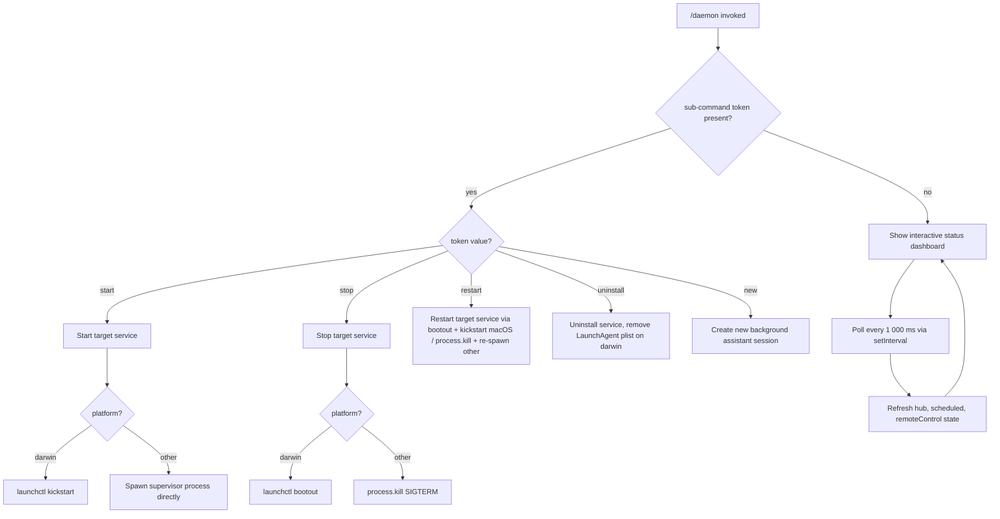

# `/daemon`

> Analysis basis: CC v2.1.133 bundle.js (AST extraction + Claude interpretation)
> Minimum version: v2.1.133

---

## Overview

The `/daemon` slash command manages Claude Code's background service layer, providing a unified interface for controlling background assistant sessions, scheduled tasks, and remote-control connections. It executes immediately upon invocation (`immediate: true`), initialising a React-based (Ink) UI that polls system state at 1-second intervals, renders live status for all three service types, and exposes sub-commands for starting, stopping, restarting, and uninstalling each service.

---

## Registration

| Field | Value |
|---|---|
| type | `local-jsx` |
| name | `daemon` |
| description | `Manage background services: assistants, scheduled tasks, and remote control` |
| immediate | `true` |
| module\_id | `aCA` |

Analysis basis: CC v2.1.133 bundle.js:+11617389

---

## Input Branching

The command accepts an optional sub-command token and an optional service-type argument. The top-level render entry point (`commandEntryPoint`) bootstraps the Ink UI and delegates all runtime logic to the main React component (`daemonRootComponent`).



Analysis basis: CC v2.1.133 bundle.js:+11606628 (setInterval), +11606798 (uninstall), +10289053 (start/kickstart), +10289089 (stop), +10289129 (restart), +11607085 (new)

---

## Behavioral Spec

### 1. Command Entry Point

```
function commandEntryPoint(args, context):
    initialState = gatherAllServiceState()   // parallel Promise.all
    mountInkUI(daemonRootComponent, { initialState, context })
    // UI unmounts when user presses Ctrl+C or sub-command completes
```

Analysis basis: CC v2.1.133 bundle.js:+11616346 (Promise.all), +11616763 (M.render), +11616977 (M.unmount)

---

### 2. Parallel State Initialisation

```
async function gatherAllServiceState():
    [hubState, scheduledState, remoteControlState] = await Promise.all([
        resolveHubServiceState(),       // background assistant sessions
        resolveScheduledServiceState(), // cron / scheduled tasks
        resolveRemoteControlState()     // remote-control server
    ])
    return { hub: hubState, scheduled: scheduledState, remoteControl: remoteControlState }
```

Analysis basis: CC v2.1.133 bundle.js:+11606164 (CP7 → Promise.all), +11606448 ("hub"), +11606474 ("scheduled"), +11607563 ("remoteControl")

---

### 3. Periodic Refresh Loop

```
function startRefreshLoop(setStateFn):
    intervalId = setInterval(async () => {
        fresh = await gatherAllServiceState()
        setStateFn(fresh)
    }, 1000)   // 1 000 ms polling interval

    return () => clearInterval(intervalId)
```

Polling interval: 1 000 ms (bundle.js:+11606680)

Analysis basis: CC v2.1.133 bundle.js:+11606628, +11606700

---

### 4. Service State Resolution — Hub (Background Assistant Sessions)

```
async function resolveHubServiceState():
    roster = await readRosterFile()          // reads PID/session list from disk
    for each entry in roster:
        pid  = entry.pid
        alive = checkProcessAlive(pid)       // process.kill(pid, 0) probe
        status = alive ? mapStatus(entry) : "stopped"
    return rosterEntries
```

Known session status values (literals): `"done"`, `"killed"`, `"stopped"`, `"blocked"`, `"crashed"`, `"working"`, `"active"`, `"idle"`, `"bg"`, `"daemon"`, `"spare"`, `"resuming"`, `"starting"`, `"adopted"`

Analysis basis: CC v2.1.133 bundle.js:+11605685 (rCA → LDH), +10286152 (process.kill), +14161445–14162839 (status string literals)

---

### 5. Service State Resolution — Scheduled Tasks

```
async function resolveScheduledServiceState():
    [pidFileData, lockData] = await Promise.all([
        readPidFile(),       // XD8.readFile, utf8
        readLockFile()       // bYq.readFile
    ])
    for each entry:
        alive = checkProcessAlive(pid)   // process.kill probe
    return scheduledEntries
```

Analysis basis: CC v2.1.133 bundle.js:+11407258 (PDq → XD8.readFile), +11497166 (pYq → bYq.readFile), +11600477 (nwq → Promise.all)

---

### 6. Service State Resolution — Remote Control

```
async function resolveRemoteControlState():
    entries = readDaemonConfigFile()   // Cwq.readFile
    for each server in entries:
        transport = server.transport   // "stdio" | "sse" | "http" | "sse-ide" | "ws-ide"
        if server.disabled:
            status = "disabled"
            continue
        if cached status == "needs-auth":
            log("Skipping connection (cached needs-auth)")
            status = "needs-auth"
            continue
        attempt connection
        if connected:
            status = "connected"
        else:
            status = "failed"
    return remoteControlEntries
```

Known transport types: `"stdio"`, `"sse"`, `"http"`, `"sse-ide"`, `"ws-ide"` (bundle.js:+9474979–9475114)

Analysis basis: CC v2.1.133 bundle.js:+11588676 (eDH → Cwq.readFile), +9474877 ("disabled"), +9475506 ("Skipping connection…"), +9475572 ("needs-auth"), +9475674 ("connected"), +9476241 ("failed")

---

### 7. macOS LaunchAgent Management

```
function resolveRosterFilePath():
    home = os.homedir()
    return path.join(home, "Library", "LaunchAgents", ...)

function stopDaemonDarwin(serviceLabel):
    run("launchctl", ["bootout", serviceLabel])

function startDaemonDarwin(serviceLabel):
    run("launchctl", ["kickstart", serviceLabel])

function restartDaemonDarwin(serviceLabel):
    run("launchctl", ["print", serviceLabel])   // status check
    stopDaemonDarwin(serviceLabel)
    // poll until exit, timeout = 10 × 200 ms polls = ~2 s fast-path,
    // hard deadline: 50 × 200 ms = 10 000 ms
    if not exited within deadline:
        throw "daemon did not exit within 10s of SIGTERM; restart aborted before kickstart"
    startDaemonDarwin(serviceLabel)

function uninstallDaemonDarwin():
    // "service uninstall not available on darwin" — delegates to bootout only
    Pe.unlink(plistPath)
```

Restart poll intervals: 200 ms step, 50 maximum iterations = 10 000 ms hard deadline (bundle.js:+10289218, +10289357)
Timeout error string: `"daemon did not exit within 10s of SIGTERM; restart aborted before kickstart"` (bundle.js:+10289386)

Analysis basis: CC v2.1.133 bundle.js:+10290141 ("launchctl"), +10290154 ("print"), +10288702 ("bootout"), +10289064 ("kickstart"), +10288833 ("service uninstall not available on darwin"), +10286931 ("Library"), +10286941 ("LaunchAgents")

---

### 8. Background Session Dispatch and Spare Pool

```
function dispatchBackgroundSession(job):
    freeMem = os.freemem()
    if freeMem < LOW_MEMORY_THRESHOLD_MB * 1024 * 1024:
        emit telemetry("tengu_bg_dispatch_low_mem")
        // may throttle or reject new sessions

    spareSession = claimSpareSession()
    if spareSession found:
        emit telemetry("tengu_bg_spare_claim")
        adoptSession(spareSession, job)
    else:
        emit telemetry("tengu_bg_spare_spawn")
        newSession = spawnSupervisor(job)

    // SIGKILL escalation path
    if session unresponsive after 100 ms:
        process.kill(pid, "SIGKILL")
        emit telemetry("tengu_bg_dispatch_sigkill_escalate")
```

Low-memory threshold: 1 024 MB (bundle.js:+14156229)
SIGKILL delay after unresponsive: 100 ms (bundle.js:+14157112)
Spare-pool session label: `"spare"` (bundle.js:+14157754)

Analysis basis: CC v2.1.133 bundle.js:+14157449 (hP8.freemem), +14157500 (Math.round), +14157350 ("daemon_bg_session_create"), +14157377 ("dup_retry_exhausted"), +14157619 (tengu_bg_dispatch_low_mem), +14157040 (tengu_bg_dispatch_sigkill_escalate), +14157088 ("SIGKILL"), +14157112 (100)

---

### 9. IPC Socket Protocol (Supervisor ↔ Worker)

The daemon uses a Unix-domain socket for attacher-to-supervisor IPC. Messages are framed as length-prefixed JSON. Known protocol message types:

| Message type | Direction | Purpose |
|---|---|---|
| `ping` | attacher → supervisor | Keepalive |
| `nudge` | attacher → supervisor | Wake idle session |
| `yield` | supervisor → attacher | Suspend token |
| `lease` / `leases` | both | Resource lease management |
| `shutdown` | supervisor → worker | Graceful termination |
| `dispatch` | attacher → supervisor | Assign new job |
| `reply` | supervisor → attacher | Job result |
| `kill` | attacher → supervisor | Terminate worker |
| `resize` | attacher → supervisor | Terminal resize |
| `attach` | attacher → supervisor | Attach to running session |
| `respawn` / `respawn-stale` | supervisor internal | Worker restart |
| `resume` | supervisor → attacher | Resume suspended session |
| `list` | attacher → supervisor | Enumerate sessions |
| `has` | attacher → supervisor | Check session existence |
| `snapshot` | supervisor → attacher | Terminal state dump |
| `settled` | supervisor → attacher | Session finished |
| `stream` | supervisor → attacher | Incremental output |
| `state` | supervisor → attacher | Status update |
| `subscribe` | attacher → supervisor | Subscribe to events |
| `ensure-spare` | attacher → supervisor | Pre-warm spare session |
| `permission-response` | attacher → supervisor | User permission answer |

Maximum buffer size before `ETOOLARGE` error: 20 frames (bundle.js:+14143951)

Known protocol error codes: `EUNKNOWN`, `ESTARTING`, `EPROTO`, `ENOJOB`, `ENOREPLY`, `EUNVERIFIED`, `ERESPAWNING`

Analysis basis: CC v2.1.133 bundle.js:+14145653 ("ping"), +14146078 ("nudge"), +14146146 ("yield"), +14146206–14146284 ("lease"/"leases"), +14146345 ("shutdown"), +14147911 ("dispatch"), +14148296 ("reply"), +14139632 ("kill"), +14148923 ("resize"), +14150039 ("attach"), +14149802 ("respawn"), +14149827 ("resume"), +14147502 ("list"), +14147661 ("has"), +14152845 ("snapshot"), +14152935 ("settled"), +14153032 ("stream"), +14153088 ("state"), +14152689 ("subscribe"), +14152596 ("ensure-spare"), +14152661 ("permission-response"), +14143909 ("ETOOLARGE"), +14143951 (20)

---

### 10. Session Attach Flow

```
async function attachToSession(sessionId):
    socket = connectUnixSocket(supervisorSocketPath)
    send({ type: "attach", id: sessionId })

    state = await readFramedResponse()

    if state == "starting" or state == "adopted":
        showMessage("Session is starting — it will appear once ready. Ctrl+Z to detach")
        waitForRedraw()

    if stall detected (no draw within threshold):
        stallCount++
        if stallCount >= STALL_GIVE_UP_THRESHOLD:
            emit telemetry("tengu_bg_attach_stall_gave_up")
            showMessage("Session keeps stalling at startup.")
        else:
            emit telemetry("tengu_bg_attach_stall_respawn")
            showMessage("Session not responding — restarting it…")
            send({ type: "kill" })
            waitThenReattach()

    if error == "ERESPAWNING":
        if legacy worker:
            emit telemetry("tengu_bg_attach_legacy_autorespawn")
            waitThenReattach()
        else:
            showMessage("ERESPAWNING: worker stalled, restarting")
```

Startup stall message: `"Session is starting — it will appear once ready. Ctrl+Z to detach"` (bundle.js:+14150635)
Redraw wait message: `"Waiting for session to redraw… Ctrl+Z to detach"` (bundle.js:+14150708)
Stall give-up message: `"Session keeps stalling at startup."` (bundle.js:+14151017)

Analysis basis: CC v2.1.133 bundle.js:+14150138 (tengu_bg_attach), +14150972 (tengu_bg_attach_stall_gave_up), +14151241 (tengu_bg_attach_stall_respawn), +14149728 (tengu_bg_attach_legacy_autorespawn), +14150578 ("starting"), +14150610 ("adopted")

---

### 11. MCP Connection Retry Logic

```
function mcpRetryManager(remoteServers):
    pendingRetries = filterRemoteServers(remoteServers)
    for each server in pendingRetries:
        status = server.getClients().connectionStatus
        if all remote servers recovered:
            log("[MCP] Retry: all remote servers recovered, stopping")
            stopRetryTimer()
            return
        attempt reconnect(server)
        if failed:
            emit telemetry("tengu_mcp_retry_failed_remote")
            update server entry via applyMcpUpdate()
```

Log message on full recovery: `"[MCP] Retry: all remote servers recovered, stopping"` (bundle.js:+13871486)

Analysis basis: CC v2.1.133 bundle.js:+13870729 (tengu_mcp_retry_failed_remote), +13870916 (H.applyMcpUpdate), +13871337 (A.getClients), +13871684 (iZH), +13871693 (mFq)

---

### 12. Config Reload and Remote Control

```
function reloadDaemonConfig():
    newConfig = readDaemonConfigFile()
    for each entry in currentRunningServices:
        if entry removed from config:
            entry.stop()
            activeMap.delete(entry.id)
        elif entry config changed:
            entry.stop()
            entry.updateConfig(newConfig[entry.id])
            entry.start()
        elif entry new in config:
            newEntry = createEntry(newConfig[entry.id])
            newEntry.start()
            activeMap.set(entry.id, newEntry)
    emit telemetry("tengu_daemon_config_reload")

function remoteControlSection():
    // Renders "Remote Control" panel (bundle.js:+11608235)
    // Renders "Claude Daemon" panel (bundle.js:+11608520)
    // Handles permission responses (bundle.js:+11608607)
    // heartbeat: "heartbeat" (bundle.js:+14169021)
    // supervisor socket label: "supervisor" (bundle.js:+14169799)
```

Analysis basis: CC v2.1.133 bundle.js:+14170592 (tengu_daemon_config_reload), +14170067 (E.stop), +14170196 (I.updateConfig), +14170214 (I.start), +14170372 (Z.start)

---

### 13. Focus / Blur Idle Timeout

```
function focusBlurIdleManager(windowFocusState):
    // focusStates: "focused", "blurred", "system", "api_metrics", "away_summary"
    MAX_IDLE_DURATION_MS = 3_600_000   // 1 hour
    IDLE_FRACTION_THRESHOLD = 0.8      // 80% of max idle triggers action

    elapsed = Date.now() - lastActivityTimestamp
    cappedElapsed = Math.min(elapsed, MAX_IDLE_DURATION_MS)
    if windowFocusState == "blurred" and cappedElapsed / MAX_IDLE_DURATION_MS >= IDLE_FRACTION_THRESHOLD:
        triggerIdleAction()
```

Maximum idle duration: 3 600 000 ms (1 hour) (bundle.js:+12972668)
Idle trigger fraction: 0.8 (bundle.js:+12972724)

Analysis basis: CC v2.1.133 bundle.js:+12972595 (rU), +12972628 (Date.now), +12972703 (Math.min), +12972757 ("focused"), +12972607 ("blurred")

---

### 14. Roster File Parsing

```
function parseBgRosterFile(filePath):
    raw = slH.readFile(filePath)
    parsed = JSON.parse(raw)
    validate fields (MqH, D8, hNA)
    // "same-dir" working-directory mode detected via BqH.basename
    if parse fails:
        emit telemetry("tengu_bg_roster_parse_failed")
        return empty roster
```

Working-directory mode literal: `"same-dir"` (bundle.js:+11594212)

Analysis basis: CC v2.1.133 bundle.js:+10295808 (vm → slH.readFile), +10295889 (tengu_bg_roster_parse_failed), +11594169 (BqH.basename), +11594212 ("same-dir")

---

### 15. Detail Views

The UI renders three distinct detail sub-views depending on which service the user has selected:

| View key | Label | Literal |
|---|---|---|
| `detail-scheduled` | Scheduled task detail | bundle.js:+11606987 |
| `detail-assistant` | Background assistant detail | bundle.js:+11607145 |
| `detail-remoteControl` | Remote control detail | bundle.js:+11607266 |

Analysis basis: CC v2.1.133 bundle.js:+11606987, +11607145, +11607266

---

## State & Side Effects

| Item | Detail |
|---|---|
| Telemetry — `tengu_bg_roster_parse_failed` | Fired when the background session roster file cannot be parsed (bundle.js:+10295889) |
| Telemetry — `tengu_mcp_retry_failed_remote` | Fired when a remote MCP server reconnection attempt fails (bundle.js:+13870729) |
| Telemetry — `tengu_bg_dispatch_sigkill_escalate` | Fired when a background session is forcibly killed with SIGKILL after becoming unresponsive (bundle.js:+14157040) |
| Telemetry — `tengu_feature_bad` | Fired on feature-flag parse error (bundle.js:+907437) |
| Telemetry — `tengu_feature_ok` | Fired on successful feature-flag validation (bundle.js:+907381) |
| Telemetry — `tengu_bg_low_mem_mb` | Fired when free memory falls below threshold (bundle.js:+14156207) |
| Telemetry — `tengu_bg_dispatch_low_mem` | Fired when a dispatch is throttled due to low memory (bundle.js:+14157619) |
| Telemetry — `tengu_bg_spare_enable` | Fired when the spare-session pool is activated (bundle.js:+14158234) |
| Telemetry — `tengu_bg_sendclaim_failed` | Fired when a claim message to the spare pool supervisor fails (bundle.js:+14139405) |
| Telemetry — `tengu_bg_spare_claim` | Fired when a spare session is successfully claimed (bundle.js:+14158355) |
| Telemetry — `tengu_bg_spare_spawn` | Fired when a new spare session is spawned (bundle.js:+14156817) |
| Telemetry — `tengu_bg_spare_claim_fail` | Fired when spare session claim fails (bundle.js:+14158618) |
| Telemetry — `tengu_bg_proto_mismatch` | Fired when the IPC protocol version does not match (bundle.js:+14146608) |
| Telemetry — `tengu_bg_dispatch_stale_drop` | Fired when a stale dispatch is dropped (bundle.js:+14147847) |
| Telemetry — `tengu_bg_attach_legacy_autorespawn` | Fired when a legacy worker auto-respawns during attach (bundle.js:+14149728) |
| Telemetry — `tengu_bg_attach` | Fired on successful session attach (bundle.js:+14150138) |
| Telemetry — `tengu_bg_attach_stall_gave_up` | Fired when attach gives up after repeated stalls (bundle.js:+14150972) |
| Telemetry — `tengu_bg_attach_stall_respawn` | Fired when attach triggers a respawn due to stalling (bundle.js:+14151241) |
| Telemetry — `tengu_daemon_control` | Fired on daemon start/stop control actions (bundle.js:+14191366) |
| Telemetry — `tengu_daemon_config_reload` | Fired when daemon configuration is reloaded (bundle.js:+14170592) |
| setInterval / clearInterval | 1 000 ms polling loop started in `useEffect`, torn down on unmount (bundle.js:+11606628, +11606700) |
| Ink UI mount / unmount | `M.render` on start, `M.unmount` on exit (bundle.js:+11616763, +11616977) |
| Unix socket | Created and destroyed per-attach via `NP8.connect` / `f.end` (bundle.js:+14139552, +14139656) |
| Roster file unlink | `IY.unlink` removes the roster entry when a session fully exits (bundle.js:+14162405) |
| LaunchAgent plist unlink | `Pe.unlink` removes the plist file on uninstall (darwin only) (bundle.js:+10288742) |
| Socket file unlink | `Ydq.unlinkSync` cleans up the IPC socket file (bundle.js:+14137065) |
| Filesystem `stat` | `sj6.stat` checks whether the config directory exists during `nCA` init (bundle.js:+11590372) |
| `process.kill` probes | Zero-signal kill used to check liveness of supervisor and worker PIDs (bundle.js:+10286152, +11407465, +11497365) |
| `gm.spawn` | Spawns a new supervisor process when no spare session is available (bundle.js:+14158677) |
| `gm.claim` | Claims an existing spare session socket from the pool (bundle.js:+14139279) |
| `u.dispose` / `$.dispose` | Disposes of session resources on exit (bundle.js:+14158658, +14156491) |

---

## Version History

| Version | Change |
|---|---|
| v2.1.133 | Initial analysis |

---

## Common Mistakes

1. **Expecting uninstall to work on macOS**: The implementation explicitly notes that service uninstall via plist removal is the only supported path on darwin; `launchctl`-level uninstall is not performed. Calling `/daemon uninstall` on macOS removes the plist file and runs `bootout` but does not call `launchctl remove`. (Analysis basis: bundle.js:+10288833)

2. **Assuming instant stop**: The restart path polls up to 50 times at 200 ms intervals (10 seconds total) before aborting. Scripts or integrations that expect `/daemon restart` to return quickly may time out. (Analysis basis: bundle.js:+10289218, +10289357, +10289386)

3. **Ignoring `needs-auth` caching**: If a remote-control server previously returned `needs-auth`, the daemon caches that state and skips reconnection attempts entirely on subsequent refreshes. Re-authentication must be triggered explicitly; simply re-running `/daemon` will not retry. (Analysis basis: bundle.js:+9475506, +9475572)

4. **Expecting cross-platform LaunchAgent behavior**: The `launchctl`/`bootout`/`kickstart` code paths are gated on `"darwin"` (bundle.js:+10289712). On non-macOS hosts the daemon uses direct `process.kill` and `gm.spawn` instead, and the `"service uninstall not available on darwin"` message is never shown.

5. **Misreading spare-pool failures**: `tengu_bg_spare_claim_fail` and `tengu_bg_sendclaim_failed` are distinct events. The former means the spare pool had no available session; the latter means the IPC message to claim one was not acknowledged. Only the latter indicates a socket-level fault. (Analysis basis: bundle.js:+14158618, +14139405)

6. **Assuming model names are stable**: The model resolution helper (`BlH`) handles aliases such as `"opus"`, `"opusplan"`, `"opus[1m]"`, and expands them to versioned identifiers like `"claude-opus-4-6"`. Hard-coding these aliases in external scripts may break across versions. (Analysis basis: bundle.js:+9911435, +9911483, +9911535, +9911591)

---

## Appendix — Identifier Mapping

> For bundle debugging only. Identifiers change across versions.

| Identifier | Role |
|---|---|
| `FP7` | Command entry point function |
| `rCA` | Service-state aggregation function (hub + scheduled + remote) |
| `LDH` | Hub roster loader |
| `nwq` | Scheduled-task state resolver |
| `Uwq` | Remote-control state resolver |
| `N2` | Process-liveness probe (process.kill 0-signal) |
| `PDq` | Scheduled PID-file reader |
| `pYq` | Scheduled lock-file reader |
| `vm` | Roster file parser |
| `Dg` | macOS launchctl status query helper (launchctl print) |
| `nCA` | Config directory initialiser |
| `LA` | Config path helper |
| `IN6` | Feature-flag loader |
| `D8` | Error normaliser / ENOENT handler |
| `fH` | Feature-flag validator |
| `L` | Session list formatter (padEnd) |
| `K` | Async task tracker (add/delete/finally) |
| `f` | Session handle (close, on, write, end) |
| `H` | Random-delay jitter generator (Math.random + setTimeout) |
| `A` | Session collection / array |
| `M` | Ink UI instance (render, unmount) |
| `iZH` | MCP server connection iterator |
| `mFq` | MCP connection update applier (applyMcpUpdate) |
| `k` | Model-name resolver / alias expander |
| `$` | Session map accessor (XDq) |
| `J6` | Roster-entry manager |
| `Og7` | MCP retry orchestrator |
| `ewq` | Model-selection helper |
| `BlH` | Model alias expansion and selection |
| `CP7` | Parallel state pre-loader (used before UI mount) |
| `oCA` | Root daemon React component |
| `Z` | Window / blur state tracker |
| `v` | Idle-time calculator |
| `rU` | Focus/blur event source |
| `I` | Scheduled service controller (stop/updateConfig/start) |
| `bRq` | Away-summary generator |
| `w` | Daemon supervisor tick / main loop |
| `_` | Session registry map |
| `d` | Logger / debug sink |
| `y` | Signal dispatcher (WrH, GrH) |
| `uH` | Feature-ok reporter |
| `hH` | Feature-bad reporter |
| `sFA` | Spare session availability checker |
| `x` | Session timeout manager (clearTimeout / $.write) |
| `nFA` | Spare session claim sender (gm.claim + socket write) |
| `tFA` | Session lifecycle manager (spawn → track → unlink) |
| `Y` | Session disposal and respawn manager |
| `w8` | Warning logger |
| `u` | Session resource handle (dispose, unref) |
| `X` | Daemon tick wrapper (calls w) |
| `rlH` | macOS LaunchAgent stop (bootout) helper |
| `INA` | LaunchAgent plist path resolver |
| `Y8` | launchctl command runner |
| `p38` | launchctl output parser |
| `vH` | String coercion utility |
| `HX6` | macOS LaunchAgent start (kickstart) helper |
| `VNA` | macOS LaunchAgent restart orchestrator |
| `j` | IPC framed-socket reader |
| `ff` | IPC error response sender |
| `md7` | IPC message dispatcher / protocol handler |
| `O` | Background-session UI panel renderer |
| `d8` | Background-session panel string builder |
| `q` | Socket-file cleanup helper (unlinkSync) |
| `G` | Scheduled-task UI panel renderer |
| `AJ6` | Scheduled-task string builder |
| `jP8` | Remote-control connection helper |
| `P` | Remote-control connection runner |
| `HA` | Error wrapper (wraps Error + String) |
| `W` | Notification / event flush debouncer |
| `z` | Notification-set manager (hH, uH, bS, cC) |
| `rfH` | Config-change event handler |
| `_mH` | Skills-change detector |
| `Zf8` | Policy-settings event source |
| `et` | Event emitter bundle (f1H, a58, Eg9) |
| `BcH` | Cache-clear helper (c58.clear) |
| `D` | Config-reload + scheduled-task updater |
| `eDH` | Daemon config file reader and parser |
| `bwq` | Config key-width formatter |
| `E` | Remote-control-at-startup controller |
| `Bdq` | Heartbeat manager (Go) |