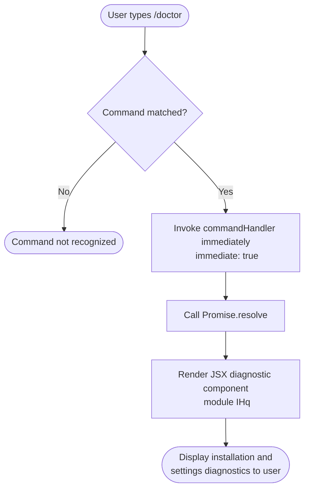

# `/doctor`

> Analysis basis: CC v2.1.133 bundle.js (AST extraction + Claude interpretation)
> Minimum version: v2.1.133

---

## Overview

The `/doctor` command performs a diagnostic check of the Claude Code CLI installation and its configuration settings, presenting the results to the user as a JSX-rendered UI component. It resolves immediately upon invocation, making it a synchronous-style, non-blocking diagnostic tool that does not require additional user input.

## Registration

| Field | Value |
|---|---|
| type | `local-jsx` |
| name | `doctor` |
| description | `Diagnose and verify your Claude Code installation and settings` |
| immediate | `true` |
| module_id | `IHq` |

Analysis basis: CC v2.1.133 bundle.js:+10330400

## Input Branching

Because the `/doctor` command is registered with `immediate: true` and its implementation resolves via `Promise.resolve` with no literals governing conditional branches found at depth ≤ 2, the command exhibits a single unconditional execution path: it is invoked, it resolves, and it renders its diagnostic JSX output.



Analysis basis: CC v2.1.133 bundle.js:+10330267 (Promise.resolve call edge), +10330400 (registration)

## Behavioral Spec

### Command Invocation and Immediate Resolution

Because `immediate` is `true` in the registration object, the CLI does not wait for any follow-up user input before beginning execution. The command handler is dispatched as soon as the slash command is matched.

```
function doctorCommandHandler(inputArgs):
    # No input arguments are consumed; the command takes no parameters
    result = Promise.resolve()
    return result
    # Resolution triggers the JSX render pipeline for module IHq
```

Analysis basis: CC v2.1.133 bundle.js:+10330267, +10330400

### JSX Rendering Pipeline

The command is typed `local-jsx`, meaning its output is rendered through the CLI's internal React/Ink JSX rendering layer rather than producing raw text output. The diagnostic component is housed in module `IHq`.

```
function renderDoctorOutput():
    component = loadModule("IHq")
    # Component is responsible for gathering and displaying:
    #   - Installation validity checks
    #   - Settings verification results
    #   - Any environmental diagnostics
    render(component)
```

<!-- TODO: not found in depth-2 traversal; needs --depth 4 -->
The specific checks performed inside the JSX component (e.g., API key validity, binary integrity, configuration file presence) are not enumerated in the depth-2 call graph. A deeper traversal of module `IHq` would be required to enumerate individual diagnostic sub-checks.

## State & Side Effects

| Item | Detail |
|---|---|
| Telemetry | None detected at depth ≤ 2 traversal (no `tengu_*` events found) |
| Hook registration | None detected at depth ≤ 2 traversal |
| appState changes | <!-- TODO: not found in depth-2 traversal; needs --depth 4 --> |
| Sound | <!-- TODO: not found in depth-2 traversal; needs --depth 4 --> |
| Resolution strategy | Synchronous-style via `Promise.resolve` — no async waiting on external I/O at the dispatch layer |
| Rendering type | `local-jsx` — output rendered via JSX component in module `IHq` |

## Version History

| Version | Change |
|---|---|
| v2.1.133 | Initial analysis — command registered as `local-jsx`, `immediate: true`, resolves via `Promise.resolve` |

## Common Mistakes

1. **Expecting text output instead of a rendered UI panel.** Because the command type is `local-jsx`, the output is a rendered component, not plain text. Attempting to pipe or capture `/doctor` output as raw text may yield unexpected results.
2. **Passing arguments to `/doctor`.** No input literals or argument-parsing logic were found at depth ≤ 2. The command does not accept parameters; any text typed after `/doctor` is likely ignored or handled by the top-level argument dispatcher rather than the command itself.
3. **Assuming telemetry is emitted on invocation.** No `tengu_*` telemetry events were found in the implementation at depth ≤ 2. Do not rely on telemetry side effects from this command for observability purposes.
4. **Confusing `immediate: true` with background execution.** The `immediate` flag means the command fires without prompting for additional input — it does not mean the command runs in the background or deferred. The diagnostic render happens inline in the current session.

## Appendix — Identifier Mapping

> For bundle debugging only. Identifiers change across versions.

| Identifier | Role |
|---|---|
| `g97` | Doctor command handler function — the primary entry point for the `/doctor` command; calls `Promise.resolve` to immediately resolve and trigger JSX rendering |