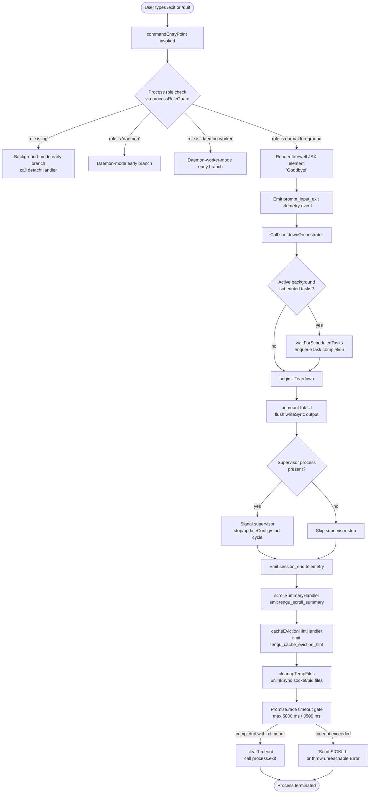

# `/exit`

> Analysis basis: CC v2.1.133 bundle.js (AST extraction + Claude interpretation)
> Minimum version: v2.1.133

---

## Overview

The `/exit` command (also aliased as `/quit`) terminates the current Claude Code CLI session immediately upon invocation, without waiting for any further user input. It triggers a multi-phase shutdown sequence: displaying a farewell message, flushing pending I/O, emitting a `session_end` telemetry event, and finally calling `process.exit`. The command is registered as `immediate`, meaning it executes before any normal input processing cycle.

---

## Registration

| Field | Value |
|---|---|
| type | `local-jsx` |
| name | `exit` |
| description | *(null — no help text registered)* |
| aliases | `["quit"]` |
| immediate | `true` |
| module\_id | `bOq` |

Analysis basis: CC v2.1.133 bundle.js:+11344232

---

## Input Branching

When `/exit` (or `/quit`) is invoked, the command handler (`commandEntryPoint`) performs an immediate pre-flight check on the current process role before initiating shutdown. The shutdown sequence itself (`shutdownOrchestrator`) branches further depending on session state and whether background tasks are active.



Analysis basis: CC v2.1.133 bundle.js:+11343482, +11343559, +11343665, +5052261, +5052478, +5051132, +5051157

---

## Behavioral Spec

### Command Entry Point

```
function commandEntryPoint(context):
    role = processRoleGuard(context)          // checks "bg", "daemon", "daemon-worker"
    if role in ["bg", "daemon", "daemon-worker"]:
        return detachOrDaemonBranch(role, context)
    farewellElement = renderFarewellElement()  // produces "Goodbye!" JSX node
    emitTelemetry("prompt_input_exit")
    return shutdownOrchestrator(context)
```

Analysis basis: CC v2.1.133 bundle.js:+11343482, +11343494, +11343498, +11343559, +11343652, +11343665, +11343670

---

### Process Role Guard

```
function processRoleGuard(context):
    // Reads a role string from the process/app state
    // Known role literals: "bg", "daemon", "daemon-worker"
    role = readProcessRole()
    return role
```

The role strings `"bg"`, `"daemon"`, and `"daemon-worker"` are the only recognized non-foreground roles.

Analysis basis: CC v2.1.133 bundle.js:+2126512, +2126522, +2126536

---

### Detach Handler (background / tmux path)

When the process role is non-foreground, a detach flow is used instead of a full shutdown:

```
function detachOrDaemonBranch(role, context):
    sendDetachRequest("detach-request")       // writes to rl interface
    result = spawnSync("tmux", ["detach-client"], {stdio: "ignore"})
    return result
```

The `spawnSync` call targets the `"tmux"` binary with the `"detach-client"` subcommand, and stdio is set to `"ignore"`.

Analysis basis: CC v2.1.133 bundle.js:+9859945, +9860018, +9860026, +9860050

---

### Farewell Renderer

```
function renderFarewellElement():
    // Constructs a JSX element containing the string "Goodbye!"
    element = NRA.createElement(farewellComponent, null, "Goodbye!")
    return element
```

The literal string `"Goodbye!"` is the only text rendered to the terminal before shutdown begins.

Analysis basis: CC v2.1.133 bundle.js:+11343446, +11343559

---

### Scheduled Task Flusher

Before tearing down the UI, any pending scheduled tasks are awaited:

```
function waitForScheduledTasks(taskQueue):
    // taskQueue entries have kind "scheduled task"
    for task in taskQueue:
        enqueueCompletion(task)               // uses mN + H.push internally
        timing = computeTaskTiming(           // uses Math.max, Date.now, _.getTime
            referenceTime,
            Date.now()
        )
        dispatchTaskResult(timing)            // calls xq internally
    return
```

The string literal `"scheduled task"` labels entries in the task queue.

Analysis basis: CC v2.1.133 bundle.js:+9853896, +9853901, +9853915, +9853942, +9854120, +9854131, +9854143

---

### UI Teardown (`beginUiTeardown`)

```
function beginUiTeardown(appHandle, renderMap):
    flushOutput(UUH.writeSync)                // synchronous write before unmount
    componentRef = renderMap.get(appHandle)
    componentRef.unmount()                    // detach Ink render tree
    runFinalizers(Fk)                         // call registered finalizer hooks
    writeExitOutput(wl6)                      // any post-unmount output
    signalComplete(kH)
```

Analysis basis: CC v2.1.133 bundle.js:+5050455, +5050481, +5050532, +5050566, +5050614, +5050621

---

### Final Output Formatter (`finalOutputFormatter`)

```
function finalOutputFormatter(outputLines):
    // Escapes backslashes and double-quotes in output text before final write
    escaped = outputLines
        .replaceAll("\\", "\\\\")
        .replaceAll('"', '\\"')
    // Pads column entries with two spaces "  "
    formatted = outputLines.map(entry => entry.padEnd(colWidth, "  "))
    UUH.writeSync(formatted)                  // synchronous terminal write
    applyDimStyle(M6.dim)
```

Analysis basis: CC v2.1.133 bundle.js:+5050825, +5050843, +5050866, +5050924, +5050940, +14179329, +14179342, +14179363

---

### Supervisor Reload Cycle

When a supervisor process is detected:

```
function supervisorReloadCycle(supervisorHandle):
    supervisorHandle.stop()
    supervisorHandle.updateConfig(newConfig)
    supervisorHandle.start()
    emitTelemetry("tengu_daemon_config_reload")
    // also writes "supervisor" label to output stream
```

Analysis basis: CC v2.1.133 bundle.js:+14169799, +14170067, +14170196, +14170214, +14170592

---

### Shutdown Timeout Gate (`shutdownOrchestrator`)

The main shutdown coordinator races all cleanup promises against a hard deadline:

```
function shutdownOrchestrator(context):
    Promise.resolve()
    waitForAllSubsystems = mNH(            // Promise.all over Array.from of subsystem set
        collectActiveSubsystems()
    )

    timeoutHandle = setTimeout(            // outer watchdog: 5000 ms
        forceKillCallback,
        Math.max(5000, 3500)               // effectively 5000 ms
    )
    timeoutHandle.unref()                  // do not keep event loop alive

    result = await Promise.race([
        waitForAllSubsystems,
        AbortSignal.timeout(2000)          // inner abort signal: 2000 ms
    ])

    clearTimeout(timeoutHandle)

    // Cleanup temp files (socket, pid)
    cleanupTempFiles()                     // calls Ydq.unlinkSync

    // Final synchronous write before exit
    UUH.writeSync(finalBuffer)

    emitTelemetry("session_end")
    clearTimeout(secondaryHandle)

    process.exit(0)
```

- Outer watchdog timeout: **5000 ms** Analysis basis: CC v2.1.133 bundle.js:+5052358
- Secondary watchdog: **3500 ms** Analysis basis: CC v2.1.133 bundle.js:+5052365
- Inner abort signal timeout: **2000 ms** Analysis basis: CC v2.1.133 bundle.js:+5052543
- `U3H.unref()` is called on the timer so it does not prevent event-loop drain. Analysis basis: CC v2.1.133 bundle.js:+5052374

---

### Force Kill Callback (`forceKillCallback`)

```
function forceKillCallback(processRef):
    clearTimeout(allPendingTimers)
    childPid = processRef.get()
    process.exit(1)                        // attempt graceful exit first
    if still running:
        process.kill(childPid, "SIGKILL")  // escalate to SIGKILL
    throw new Error("unreachable")         // guard — should never be reached
```

The signal name `"SIGKILL"` and the message `"unreachable"` are hard-coded literals.

Analysis basis: CC v2.1.133 bundle.js:+5051051, +5051084, +5051132, +5051157, +5051182, +5051199, +5051205

---

### Scroll Summary Handler

```
function scrollSummaryHandler(state):
    nT(state)                              // normalize terminal state
    scrollData = buildScrollSummary(state)
    emitTelemetry("tengu_scroll_summary", scrollData)
    dispatchSummary(scrollData)
    storeSessionResult(state)
```

Analysis basis: CC v2.1.133 bundle.js:+5051899, +5051905, +5051911, +5051913, +5051940, +5051957

---

### Cache Eviction Hint Handler

```
function cacheEvictionHintHandler(context):
    hint = buildEvictionHint(context)
    emitTelemetry("tengu_cache_eviction_hint", hint)
```

Analysis basis: CC v2.1.133 bundle.js:+5052694

---

### Startup Profiling Report (conditional)

On shutdown, if profiling data is available, a startup profiling report is written to disk:

```
function writeStartupProfilingReport(outputPath):
    dir = oE6.dirname(outputPath)
    content = readProfilingData("utf8")
    if content:
        writeFileWithPrefix("Startup profiling report:", content)
```

Analysis basis: CC v2.1.133 bundle.js:+170699, +170724, +170757, +170762, +170778, +170798

---

### Background Session State Transition

```
function backgroundSessionStateTransition(session):
    // Marks session as "stopped" with label "background session"
    updateSessionState(session, "stopped")
    writeSessionLabel("background session")
    // calls d8 internally
```

Analysis basis: CC v2.1.133 bundle.js:+14191200, +14191238, +14191243

---

### Promise Abort Wrapper (`promiseAbortWrapper`)

Used within the shutdown race to wrap promises that should be cancellable:

```
function promiseAbortWrapper(promiseFn, signal):
    try:
        result = await promiseFn()
        return result
    catch error:
        if error.message == "aborted":
            signalAbort("abort")
            setTimeout(cleanupCallback, 500)
            clearTimeout(cleanupCallback)
            K.unref()
            throw error
        throw new Error(error)
```

- Abort retry delay: **500 ms** Analysis basis: CC v2.1.133 bundle.js:+5052965, +5052968
- Abort string literals: `"aborted"`, `"abort"` Analysis basis: CC v2.1.133 bundle.js:+2167068, +2167146

---

## State & Side Effects

| Item | Detail |
|---|---|
| Telemetry: `prompt_input_exit` | Fired immediately when `/exit` or `/quit` is entered, before shutdown begins. Analysis basis: CC v2.1.133 bundle.js:+11343670 |
| Telemetry: `session_end` | Fired late in the shutdown sequence, just before `process.exit`. Analysis basis: CC v2.1.133 bundle.js:+5052729 |
| Telemetry: `tengu_scroll_summary` | Fired during shutdown to record scroll/terminal summary data. Analysis basis: CC v2.1.133 bundle.js:+5051913 |
| Telemetry: `tengu_cache_eviction_hint` | Fired during shutdown to flush cache eviction metadata. Analysis basis: CC v2.1.133 bundle.js:+5052694 |
| Telemetry: `tengu_daemon_config_reload` | Fired only when a supervisor process is present and restarted. Analysis basis: CC v2.1.133 bundle.js:+14170592 |
| UI unmount | Ink render tree is unmounted synchronously via `componentRef.unmount()`. Analysis basis: CC v2.1.133 bundle.js:+5050532 |
| Temp file cleanup | Socket / PID files are removed via `unlinkSync`. Analysis basis: CC v2.1.133 bundle.js:+14137065 |
| Supervisor cycle | If a supervisor is detected: `stop → updateConfig → start` before final exit. Analysis basis: CC v2.1.133 bundle.js:+14170067, +14170196, +14170214 |
| Background session label | Session state is written as `"stopped"` / `"background session"`. Analysis basis: CC v2.1.133 bundle.js:+14191200, +14191243 |
| SIGKILL escalation | If shutdown exceeds the 5000 ms watchdog, `SIGKILL` is sent to child processes. Analysis basis: CC v2.1.133 bundle.js:+5051157, +5051182 |
| Sound | <!-- TODO: not found in depth-2 traversal; needs --depth 4 --> |
| Hook registration | <!-- TODO: not found in depth-2 traversal; needs --depth 4 --> |

---

## Timeouts & Limits Reference

| Constant | Value | Purpose |
|---|---|---|
| Outer watchdog | 5000 ms | Hard deadline for full shutdown; triggers force-kill. Analysis basis: CC v2.1.133 bundle.js:+5052358 |
| Secondary watchdog | 3500 ms | Secondary deadline used in `Math.max` comparison. Analysis basis: CC v2.1.133 bundle.js:+5052365 |
| Inner abort signal | 2000 ms | `AbortSignal.timeout` used inside `Promise.race`. Analysis basis: CC v2.1.133 bundle.js:+5052543 |
| Abort retry delay | 500 ms | Delay before cleanup callback fires on abort. Analysis basis: CC v2.1.133 bundle.js:+5052968 |
| Random range multiplier | 2 (upper), 1 (lower) | Used in randomized delay within farewell/sound path. Analysis basis: CC v2.1.133 bundle.js:+12285767, +12285783 |

---

## Version History

| Version | Change |
|---|---|
| v2.1.133 | Initial analysis. `/exit` and `/quit` both registered. `immediate: true`. Multi-phase shutdown with 5 s hard watchdog. |

---

## Common Mistakes

1. **Using `/exit` to cancel a running agent task**: `/exit` does not cancel in-flight agent tool calls gracefully — it triggers the shutdown sequence immediately. In-progress LLM calls may be abandoned without saving state. Use `Ctrl-C` or a task-level abort if you need controlled cancellation.
2. **Expecting `/quit` to behave differently from `/exit`**: `/quit` is a registered alias and is functionally identical. There is no behavioral difference between the two.
3. **Assuming shutdown is instantaneous**: The shutdown sequence includes async cleanup, telemetry flushing, UI unmounting, and temp file removal. Terminal output may persist for up to 5000 ms before the process actually exits.
4. **Running `/exit` inside a daemon or background worker expecting a clean daemon stop**: In `"daemon"` or `"daemon-worker"` roles, the command takes a detach path (tmux `detach-client`) rather than a full `process.exit` shutdown. The daemon process itself is not terminated.
5. **Expecting a confirmation prompt**: Because the command is registered with `immediate: true`, there is no confirmation dialog. The shutdown sequence begins as soon as the command is recognized.

---

## Appendix — Identifier Mapping

> For bundle debugging only. Identifiers change across versions.

| Identifier | Role |
|---|---|
| `vw7` | Command entry point function — top-level `/exit` handler |
| `E9` | Process role guard — reads current process role string |
| `hr` | Role-string reader helper, called from process role guard |
| `H` | Randomized delay / farewell sound scheduler (uses `Math.random` + `setTimeout`) |
| `AqH` | Detach handler — handles `"bg"` / tmux detach path |
| `xu6` | Detach pre-flight helper, called from detach handler |
| `Da9` | Detach state writer — sets detach-request state |
| `ot` | readline writer — sends `"detach-request"` to rl interface |
| `HqH` | Detach post-processing helper |
| `vf` | Farewell component reference passed to `NRA.createElement` |
| `f38` | Scheduled task flusher — drains pending `"scheduled task"` queue |
| `mN` | Task enqueue helper, called from scheduled task flusher |
| `R67` | Task timing calculator — uses `Math.max`, `Date.now`, `_.getTime` |
| `c9` | String segment utility — uses `indexOf`, `substring` |
| `Vw7` | Farewell JSX sub-component renderer |
| `Q1` | Shutdown orchestrator — main async shutdown coordinator |
| `L` | Column formatter — pads output entries with `"  "` (two spaces) |
| `FUH` | UI teardown initiator — unmounts Ink, flushes output |
| `HfA` | Final output formatter — escapes and writes terminal output |
| `AfA` | Force-kill callback — escalates to `SIGKILL` on watchdog expiry |
| `mNH` | Subsystem collector — wraps `Promise.all(Array.from(...))` |
| `D` | Supervisor reload cycle — stop / updateConfig / start |
| `q` | Temp file cleanup — calls `unlinkSync` on socket/pid files |
| `CsH` | Startup profiling report writer |
| `kt6` | Scroll summary handler — emits `tengu_scroll_summary` |
| `DaH` | Cache eviction hint handler — emits `tengu_cache_eviction_hint` |
| `d` | Session state dispatcher — shared utility |
| `$` | Background session state transition helper |
| `O` | Session stop marker — writes `"stopped"` / `"background session"` |
| `r8` | Promise abort wrapper — handles `"aborted"` / `"abort"` error paths |