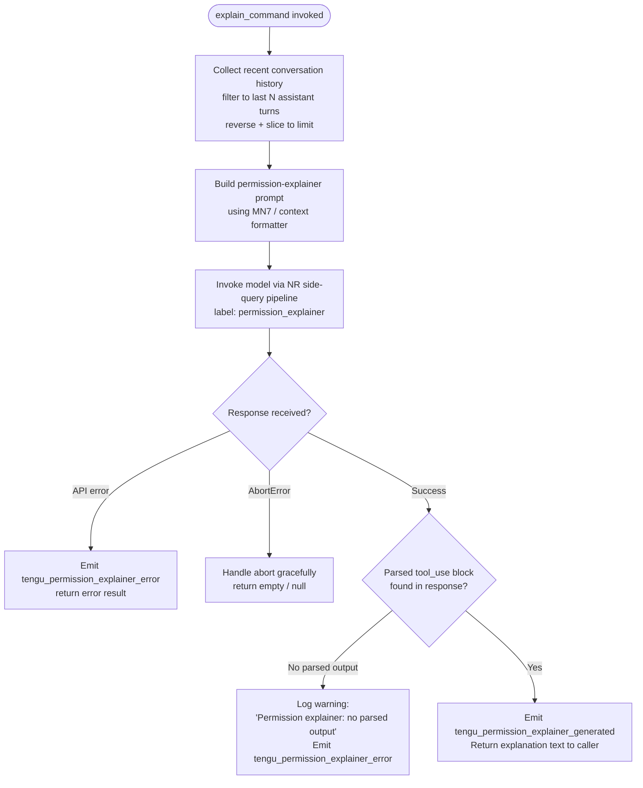

# `/explain_command`

> Analysis basis: CC v2.1.133 bundle.js (AST extraction + Claude interpretation)
> Minimum version: v2.1.133

---

## Overview

The `explain_command` slash command is a **tool-type** command that invokes a dedicated "permission explainer" agent pipeline. When a user asks Claude Code to explain why a particular tool or command requires certain permissions, this command assembles recent conversation context (last few assistant turns), constructs an API request to the model under the label `permission_explainer`, and returns a human-readable explanation extracted from the model's structured response. It is a side-query — it does not modify the primary conversation thread.

---

## Registration

| Field | Value |
|---|---|
| `type` | `tool` |
| `name` | `explain_command` |
| `description` | `null` (not present in registration object) |
| `loc_byte` | `12406747` |
| `loc_byte_end` | `12406783` |
| `loc_line` | `9141` |
| `handler_method` | *(not set; handler is a standalone async function)* |
| `load_ident` | *(not set)* |
| `dynamic_name` | `false` — fixed name `"explain_command"` (literal at bundle.js:+12406765) |
| `arbor_handler.name` | `STq` |
| `arbor_handler.fqn` | `claude-2.1.133::STq` |
| `arbor_handler.kind` | `AsyncFunction` |
| `arbor_handler.resolution_path` | `direct` (symbol falls inside registration byte range) |
| `arbor_handler.n_hits` | `1` |

Analysis basis: CC v2.1.133 bundle.js:+12406747

---

## Input Branching

The handler has three or more meaningful branches (no tool-call output found → log error; abort signal received → handle gracefully; API error → emit telemetry; success → parse and return). A Mermaid flowchart is used.



Analysis basis: CC v2.1.133 bundle.js:+12406442, +12406487, +12406505, +12406652, +12406665, +12407038, +12407072, +12407228, +12407280, +12407329, +12407524, +12407577, +12407781, +12407890, +12407961

---

## Behavioral Spec

### 1. Entry Point — Main Handler (`STq`)

`STq` is an `AsyncFunction` registered directly as the `explain_command` tool handler.

```
async function explainCommandHandler(toolInput, context):
    startTime = Date.now()                        // +12406466

    // Step 1: Format recent conversation context
    contextSnippet = formatConversationContext(context)   // calls MN7 (+12406487)

    // Step 2: Build filtered message list
    filteredMessages = buildMessageWindow(context.messages)   // calls $N7 (+12406505)

    // Step 3: Build and dispatch side-query API request
    apiResponse = await dispatchSideQuery(contextSnippet, filteredMessages)  // calls mq (+12406652), NR (+12406665)

    // Step 4: Classify and emit telemetry
    result = parseExplainerResponse(apiResponse)   // calls k (+12406845), SH (+12407038)

    // Step 5: Validate output and emit final telemetry
    if result contains no parsed tool_use output:
        log("Permission explainer: no parsed output in response")  // +12407577
        emit(tengu_permission_explainer_error)                     // +12407442
        return error result

    emit(tengu_permission_explainer_generated)   // +12407230
    return result.explanation
```

Analysis basis: CC v2.1.133 bundle.js:+12406442

---

### 2. Conversation Context Formatter (`MN7`)

Converts raw conversation state into a compact string representation suitable for the permission-explainer prompt.

```
function formatConversationContext(conversationState):
    // Serialize the relevant portion of state using stringify helper (SH → JSON.stringify)
    serialized = stringify(conversationState)              // SH calls JSON.stringify (+143548)

    // Convert to string with a fixed truncation limit (literal: 2 at +12405962)
    result = String(serialized).slice(0, CONTEXT_LIMIT)   // String() call at +12405978
    return result
```

Analysis basis: CC v2.1.133 bundle.js:+12405952, +12405962, +12405978

---

### 3. Message Window Builder (`$N7`)

Selects the most recent assistant messages to supply as context to the explainer model.

```
function buildMessageWindow(messages):
    // Filter to assistant-role messages only (literal "assistant" at +12406041)
    assistantMessages = messages.filter(m => m.role === "assistant")   // +12406018

    // Reverse chronological order
    recent = assistantMessages.reverse()                               // +12406086

    // Slice to a maximum of 3 messages (literal 3 at +12406061)
    window = recent.slice(0, MAX_MESSAGES)                             // +12406229

    // Prepend "..." sentinel (literal "..." at +12406242) to signal truncation
    window.unshift("...")                                              // +12406250

    // Filter to text-type content blocks only (literal "text" at +12406144)
    // Join with separator for the prompt
    return window
        .filter(m => m.type === "text")
        .join(separator)                                               // +12406283
```

Constants:
- Maximum assistant messages included: **3** (bundle.js:+12406061)
- Message age limit threshold: **1000** ms (bundle.js:+12406006)
- Truncation sentinel string: `"..."` (bundle.js:+12406242)

Analysis basis: CC v2.1.133 bundle.js:+12406018, +12406041, +12406061, +12406086, +12406144, +12406229, +12406242, +12406250, +12406283

---

### 4. Side-Query Dispatcher (`mq` → `PU` → `v7H`)

Builds the model request payload and dispatches it as a labelled side-query. The label `"permission_explainer"` is used to distinguish it from the primary conversation request.

```
async function dispatchSideQuery(contextSnippet, messageWindow):
    // Resolve provider/model parameters (PU at +2116553)
    modelParams = resolveModelParameters()     // PU calls AV, L_, v7H

    // Normalize the model identifier string (v7H trims and validates prefix)
    // Checks for "anthropic." prefix (literal at +2114916)
    modelId = normalizeModelId(modelParams.model)

    // Build the tool_use schema wrapper
    // Literal "tool_use" at +12406960
    // Literal "permission_explainer" at +12406805
    payload = buildToolPayload({
        name:    "permission_explainer",
        context: contextSnippet,
        window:  messageWindow,
    })

    response = await sendAPIRequest(payload)   // NR pipeline
    return response
```

Analysis basis: CC v2.1.133 bundle.js:+2116553, +2116587, +2116650, +2116693, +2116729, +2114916, +12406805, +12406960

---

### 5. Primary API Request Pipeline (`NR` → `Jx`)

`NR` is the primary API call function reached from the handler. `Jx` is the inner request orchestrator that handles authentication, header injection, streaming, and abort logic.

```
async function sendAPIRequest(payload):
    // Authenticate: resolve OAuth token or API key (Va8 / A7 path)
    token = await resolveAuthToken()           // Va8 at +2887388, Jx P.getToken at +2851136

    // Build request headers including:
    //   "User-Agent"                  (+2847122)
    //   "X-Claude-Code-Session-Id"    (+2847140)
    //   "x-app": "cli"                (+2847116)
    //   "x-anthropic-additional-protection" (+2847498)
    //   label: "side_query"           (+12081857)
    headers = buildHeaders(token, sessionId)

    // Dispatch fetch (globalThis.fetch at +12081910 or Lm6 fetch at +2169223)
    // Timeout: 600000 ms (literal at +2847796)
    response = await fetch(endpoint, { headers, signal: abortSignal, timeout: 600000 })

    // Stream and parse response (j / md7 pipeline)
    parsed = await parseStreamingResponse(response)

    return parsed
```

Key constants:
- Request timeout: **600 000 ms** (10 minutes) (bundle.js:+2847796)
- WIF token exchange label: `"wif_token_exchange"` (bundle.js:+2169714)
- Side-query label: `"side_query"` (bundle.js:+12081857)

Analysis basis: CC v2.1.133 bundle.js:+12081825, +12081857, +12081910, +2847122, +2847140, +2847796, +2851136

---

### 6. Response Parser and Output Validator (`fN7`, `k`, `SH`, `A9`)

After the API response is received, the handler extracts the structured tool-use output block, checks for the `permission_explainer` tool call, and validates the output.

```
function parseExplainerResponse(apiResponse):
    // Locate tool_use blocks in response content
    // Checks content type against literal "tool_use" (+12406960)
    toolUseBlocks = apiResponse.content.filter(b => b.type === "tool_use")

    // Check for mcp__ prefix on tool names (A9: Object.hasOwn + H.startsWith "mcp__" at +3065723)
    // Filters out MCP tool calls from consideration
    explainerBlock = toolUseBlocks.find(b => b.name === "permission_explainer")

    if not explainerBlock:
        logError("Permission explainer: no parsed output in response")  // +12407577
        return { error: true }

    return { explanation: explainerBlock.input }
```

Analysis basis: CC v2.1.133 bundle.js:+12406845, +12407038, +12407072, +12407280, +12407524, +12407577, +3065723

---

### 7. Config & File System Access (`R6` → `m5H`)

The handler chain reaches `R6` and `m5H`, which implement configuration loading with file system operations. These functions supply context about active permissions and tool configurations to the explainer.

```
function loadConfigForExplainer():
    // Guard: config must not be accessed before initialization
    // Error message literal: "Config accessed before allowed." (+3113217)
    if not configReady:
        throw Error("Config accessed before allowed.")

    // Read config file synchronously (UTF-8 encoding, literal at +3113300)
    raw = fs.readFileSync(configPath, "utf-8")

    // Parse JSON content
    config = JSON.parse(raw)   // via p6 → JSON.parse (+144287)

    // Handle ENOENT (file not found, literal at +3113447)
    // and EEXIST (already exists, literal at +3114068) errors

    // Backup directory name: "backups" (+3112785)
    // Copy file with timestamp: Date.now() (+3114344), fs.copyFileSync (+3114362)

    return config
```

Analysis basis: CC v2.1.133 bundle.js:+3110101, +3113217, +3113273, +3113300, +3113447, +3112785, +3114033, +3114068, +3114344, +3114362

---

## State & Side Effects

| Item | Detail |
|---|---|
| **Telemetry: `tengu_permission_explainer_generated`** | Emitted on successful generation of an explanation (bundle.js:+12407230) |
| **Telemetry: `tengu_permission_explainer_error`** | Emitted on API error or missing parsed output (bundle.js:+12407442) |
| **Telemetry: `tengu_api_success`** | Emitted by the shared API pipeline on any successful API round-trip (bundle.js:+12083281) |
| **Telemetry: `tengu_config_parse_error`** | Emitted if the config file cannot be parsed during context loading (bundle.js:+3113854) |
| **Telemetry: `tengu_config_auth_loss_prevented`** | Emitted if a config save would erase cached auth data (bundle.js:+3108610) |
| **Telemetry: `tengu_prompt_cache_1h_config`** | Emitted when the 1-hour prompt-cache configuration is active (bundle.js:+12045606) |
| **Telemetry: `tengu_oauth_token_refresh_*`** | A family of OAuth lifecycle events may fire if the token needs refresh before the side-query (bundle.js:+2887773–+2889239) |
| **Telemetry: `tengu_stream_watchdog_default_on`** | Byte-watchdog is enabled by default on the streaming path (bundle.js:+2854244) |
| **Telemetry: `tengu_byte_watchdog_fired_late`** | Emitted if the stream byte watchdog fires late (bundle.js:+2853783) |
| **Hook registration** | None detected in depth-2 traversal |
| **appState changes** | None detected; this is a read-only side-query |
| **Sound** | None detected |
| **File system** | Config file read (`readFileSync`, `statSync`); backup copy may be written (`copyFileSync`) |
| **Abort handling** | `AbortError` (literal at +12407890) is caught and results in a graceful empty return |
| **API label** | Request is tagged `"side_query"` (+12081857) and `"permission_explainer"` (+12406805); does not appear in the primary conversation stream |

---

## Version History

| Version | Change |
|---|---|
| v2.1.133 | Initial analysis |

---

## Common Mistakes

1. **Expecting output in the primary conversation thread.** `explain_command` dispatches a `"side_query"` labelled API call that is entirely separate from the active session's message history. Its output is returned directly to the caller, not streamed into the main REPL.

2. **Assuming it works without a valid auth token.** The handler runs the full OAuth/API-key resolution pipeline (`Va8`, `A7`, `P.getToken`). If credentials are absent or expired and refresh fails, the command will emit `tengu_permission_explainer_error` and return nothing.

3. **Misreading a missing `description` field as a bug.** The registration object intentionally has `description: null` for this command (bundle.js:+12406747–+12406783). The command is surfaced internally, not through the user-facing `/help` listing that relies on descriptions.

4. **Expecting more than 3 assistant turns in the context window.** The message-window builder hard-caps the lookback at the **3 most recent assistant messages** (bundle.js:+12406061). Older context is not included regardless of session length.

5. **Ignoring the `"Config accessed before allowed."` guard.** If `explain_command` is invoked very early in the CLI lifecycle before configuration has been loaded, the config accessor (`m5H`) throws this error and the command fails silently. Wait for the config-ready signal before invoking.

6. **Confusing `permission_explainer` (tool name) with `explain_command` (slash-command name).** The slash command is named `explain_command`; the tool-use block that the model is asked to emit is named `permission_explainer`. These are two distinct identifiers.

---

## Appendix — Identifier Mapping

> For bundle debugging only. Identifiers change across versions.

| Identifier | Role |
|---|---|
| `STq` | Main async handler for `explain_command` (arbor handler, direct resolution) |
| `ymA` | Intermediate caller from registration into `STq` |
| `R6` | Configuration access orchestrator; calls file-system and watch utilities |
| `F6` | Utility: feature-flag or environment accessor |
| `He8` | Configuration helper (called from `R6`) |
| `m5H` | Config file reader; handles `readFileSync`, JSON parse, backup copy |
| `p6` | JSON parse wrapper |
| `nh` | String prefix/slice utility (used in config path handling) |
| `w8` | Internal utility called during config load |
| `PX1` | Directory listing / path resolution helper |
| `k` | General-purpose string classification / language-tag formatter |
| `fH` | Log / error emission helper |
| `Me8` | Path join helper for backup directories |
| `u2K` | File watcher setup/teardown (`watchFile` / `unwatchFile`) |
| `kd` | Watch callback utility |
| `y1` | Set management helper (add/delete/assign) |
| `MN7` | Conversation context formatter (serializes state for explainer prompt) |
| `SH` | JSON stringify wrapper |
| `$N7` | Message-window builder (filter/reverse/slice/join assistant messages) |
| `mq` | Side-query payload builder and dispatcher |
| `PU` | Model parameter resolver |
| `AV` | Provider/auth variant selector |
| `v7H` | Model ID normalizer and parameter assembler |
| `qx6` | Object-entries iterator helper |
| `pRH` | Model provider inclusion check |
| `qc_` | Provider index lookup |
| `w6K` | Model string inclusion checker |
| `W8H` | Provider set membership check |
| `Gq` | Model name normalization (trim/lowercase/replace) |
| `J6K` | Model alias resolver |
| `fX` | Prompt formatter wrapper |
| `fW` | Prompt construction orchestrator |
| `C_` | Prompt segment assembler |
| `kr` | Plan-tier prompt injector (`max` tier) |
| `k7H` | Team-tier prompt injector |
| `FRH` | Enterprise-tier prompt injector |
| `Ek` | Token-budget / extended-thinking assembler |
| `LX` | Prompt cache configuration builder |
| `zM` | Thinking/budget token builder |
| `Q_` | Raw request body builder |
| `DM` | Request dispatch mapper |
| `pV` | Prompt variant selector |
| `NR` | Primary API request function |
| `Jx` | Inner request orchestrator (auth, headers, streaming, abort) |
| `fYK` | Request header field splitter/parser |
| `E9` | Background-mode flag inspector |
| `hr` | Background-mode identifier |
| `Xx` | Async-local-storage context reader |
| `Lg6` | Store reader for session context |
| `v6` | Version/capability flag |
| `kH` | String coercion wrapper |
| `A7` | Auth token resolution entry point |
| `Va8` | OAuth token manager (lock, refresh, expiry logic) |
| `LYK` | Streaming response handler setup |
| `EbH` | Stream event handler |
| `NA` | No-auth / anonymous path handler |
| `eS6` | Proxy-auth helper executor |
| `xXH` | Proxy auth string builder |
| `lT_` | Proxy auth string alternate builder |
| `nmL` | Integer-parse + NaN check utility |
| `$U` | Auth bypass/override checker |
| `RP` | Proxy response handler |
| `OYK` | SSE/streaming session manager |
| `o3` | Stream object factory |
| `zYK` | Header sanitizer (redacts `authorization`) |
| `$YK` | Log entry formatter for API calls |
| `Ka8` | Backoff/retry counter |
| `MYK` | Byte-stream watchdog and timeout manager |
| `iw` | Provider type resolver |
| `Ax6` | Provider capability builder |
| `psL` | Provider prefix checker |
| `Au_` | Provider name case normalizer |
| `yO` | Proxy configuration loader |
| `M8H` | Proxy URL parser |
| `Bk6` | Proxy auth credential builder |
| `nT_` | Proxy config finalizer |
| `KYK` | Endpoint URL builder |
| `BF6` | Endpoint path assembler |
| `iT` | URL template filler |
| `BNH` | Base-URL resolver |
| `xwH` | Region/endpoint prefix matcher |
| `q_` | Custom OAuth URL validator |
| `UF6` | Query-parameter lowercaser |
| `NPH` | SDK error logger |
| `_s_` | Request retry policy |
| `Bq1` | Retry back-off calculator |
| `tq1` | Response status classifier |
| `kPH` | Concurrent request limiter |
| `mF6` | Multi-part payload builder |
| `pF6` | Response stream decoder |
| `G` | Global session accessor |
| `HX` | HTTP response handler |
| `_O` | Low-level HTTP socket manager |
| `NS` | Network session state tracker |
| `zx6` | DNS / host resolution helper |
| `HK` | Keep-alive connection handler |
| `o96` | Session-state string converter |
| `Gr` | OAuth file-descriptor token reader |
| `Wx` | Connection lifecycle manager |
| `sRH` | WIF (Workload Identity Federation) credential handler |
| `Lm6` | WIF token exchange HTTP caller |
| `hH` | Feature-flag "ok" emitter helper |
| `uH` | Feature-flag "bad" emitter helper |
| `$8K` | WIF error classifier |
| `P` | Token provider (getToken) |
| `HA` | Error constructor helper |
| `j` | Daemon socket message framer |
| `X` | Daemon connection state machine |
| `ff` | Socket end/stringify wrapper |
| `md7` | Daemon IPC message dispatcher |
| `pd7` | IPC payload serializer |
| `$` | Output stream writer |
| `_Y` | Background service label accessor |
| `oFA` | IPC framing utility |
| `Pdq` | Dispatch retry-delay calculator |
| `r8` | Async timeout/abort wrapper |
| `h0` | PTY path joiner |
| `r$` | Realpath / normalize helper |
| `aKH` | Log-file line reader |
| `xd7` | Terminal dimension calculator |
| `x` | Timer-clear-and-write helper |
| `HqH` | IPC heartbeat handler |
| `xL` | Working-directory path builder |
| `ud7` | Daemon session lifecycle manager |
| `v` | Focus-blur session timer |
| `l` | Permission allow-list accessor |
| `c` | Active request filter |
| `W` | Skills / permission-response batch emitter |
| `Q` | Output channel writer |
| `p` | Transient IPC write helper |
| `g` | Permission classification dispatcher |
| `QW6` | Socket destroy/write/stringify helper |
| `vH` | String coercion (String constructor) |
| `yPH` | Response post-processor (model name normalization) |
| `B9` | Model family resolver |
| `gY` | Model string include/replace helper |
| `m08` | Model metadata accessor |
| `mP` | Model display-name formatter |
| `$S` | Provider-to-request-body mapper |
| `rT7` | Message role finder |
| `oxA` | SHA-256 hash builder (`createHash`) |
| `Gd6` | Cache-control header builder |
| `Zq` | String coercion variant |
| `Wd6` | Request-body finalizer |
| `zTH` | Prompt-cache configuration injector |
| `C08` | Cache-control type constant holder |
| `J6` | Conversation message manager (get/set/add to active context) |
| `Bq6` | Message-store batch getter |
| `gq6` | Message-store batch setter |
| `Po` | Conversation turn builder |
| `_d6` | Deduplication tracker for messages |
| `b08` | Cache-block presence checker |
| `VZ` | Response content extractor |
| `Da8` | Content-block mapper |
| `r2q` | Response usage extractor |
| `lF6` | Temperature / sampling parameter injector |
| `xP` | Multi-content mapper |
| `LMH` | Tool-result assembler (builds `tool_use` / `tool_result` blocks) |
| `pU` | Crypto random bytes caller (for request IDs) |
| `e6` | Config writer / saver |
| `F7` | Streaming response finalizer |
| `rY` | HTTP response parser |
| `TwH` | Token usage logger |
| `F76` | Agent capability checker |
| `cgK` | Builtin agent identifier matcher |
| `A0H` | Agent allow-list checker |
| `ma` | MCP tool-name parser |
| `dgK` | MCP tool-name prefix splitter |
| `dLA` | MCP server prefix handler |
| `TqA` | Tool-name index/slice utility |
| `IMH` | Thread-type prefix checker |
| `YaH` | Response metadata logger |
| `A9` | Tool-name ownership checker (`Object.hasOwn` + `startsWith "mcp__"`) |
| `Z8` | Feature-flag "sad" emitter helper |

---

Note: index built via Arbor fallback; some signals (telemetry, literals) may be missing — see arbor-fallback.js.