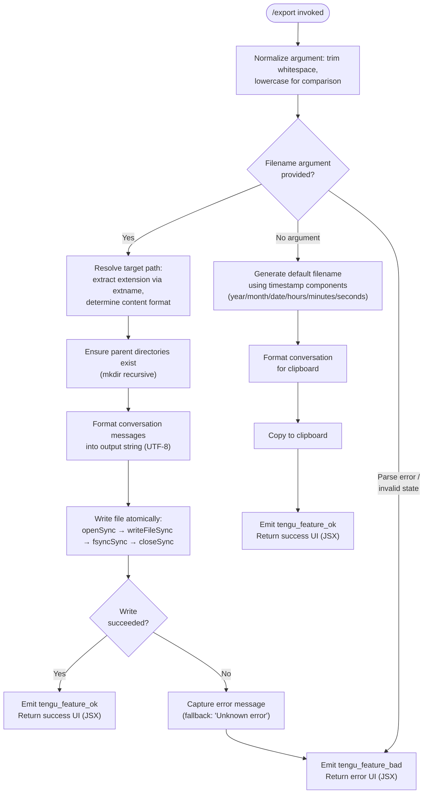

# `/export`

> Analysis basis: CC v2.1.132 bundle.js (AST extraction + Claude interpretation)
> Minimum version: v2.1.132

---

## Overview

The `/export` command serializes the current conversation session to either a file on disk or the system clipboard. When given an optional filename argument, the command resolves the target path, ensures all parent directories exist, and writes the formatted conversation using a synchronous, fsync-flushed file write. When no filename is provided, the output falls back to clipboard delivery.

---

## Registration

| Field | Value |
|---|---|
| type | `local-jsx` |
| name | `export` |
| description | `Export the current conversation to a file or clipboard` |
| argumentHint | `[filename]` |
| module_id | `GOq` |

Analysis basis: CC v2.1.132 bundle.js:+11342900

---

## Input Branching

The command dispatcher normalizes the raw argument string, then branches across three high-level paths: export to a named file, export to clipboard (no argument), and error handling for write failures.



Analysis basis: CC v2.1.132 bundle.js:+11342117, +11342332, +11342372, +11342597, +11342625

---

## Behavioral Spec

### Argument Normalization

Before any branching, the raw argument string is normalized by converting it to lowercase and trimming leading and trailing whitespace. This normalized value drives all subsequent comparisons.

```
function normalizeArgument(rawArg):
    if rawArg is absent or null:
        return ""
    return rawArg.toLowerCase().trim()
```

Analysis basis: CC v2.1.132 bundle.js:+11342117, +11342341

---

### Message Content Extraction

The implementation locates the first message in the conversation whose role equals `"user"` (string literal), then extracts its `text` content block. If the message list is not an array or contains no matching entry, the extraction returns a safe default. The raw text content is then trimmed, and a substring of up to the first 50 characters is taken to produce a short label (used in default filename generation or UI display).

```
function extractLeadingUserText(messageList):
    if not Array.isArray(messageList):
        return ""
    match = messageList.find(msg => msg.role == "user")
    if match is absent:
        return ""
    textBlock = match.content.find(block => block.type == "text")
    raw = trim(textBlock.text)
    # First 50 chars used as label; internal index boundary at 49
    label = raw.substring(0, 50)
    return label
```

Analysis basis: CC v2.1.132 bundle.js:+11341814, +11341930, +11341947, +11341971, +11341992, +11342053, +11342058, +11342072

The substring upper bound is `50` (literal at bundle.js:+11342053) and the internal off-by-one index boundary used is `49` (literal at bundle.js:+11342072).

---

### Default Timestamp Filename Generation

When no filename argument is provided, a default filename is generated from the current local date and time. Each component is zero-padded to two digits where applicable (month is adjusted from zero-based index by adding 1).

```
function generateTimestampFilename(now: Date):
    year    = String(now.getFullYear())
    month   = zeroPad(now.getMonth() + 1)   # zero-based → 1-based
    day     = zeroPad(now.getDate())
    hours   = zeroPad(now.getHours())
    minutes = zeroPad(now.getMinutes())
    seconds = zeroPad(now.getSeconds())
    return year + "-" + month + "-" + day + "T" + hours + "-" + minutes + "-" + seconds
```

Analysis basis: CC v2.1.132 bundle.js:+11341540, +11341558, +11341565, +11341606, +11341644, +11341683, +11341724

---

### Conversation Serialization

The conversation turn list is iterated. Each turn is formatted by a per-role dispatcher (`formatTurn`). Formatted strings are accumulated into a buffer and joined into a single output string.

```
function serializeConversation(turns):
    buffer = []
    for each turn in turns:
        formatted = formatTurn(turn)
        buffer.push(formatted)
    return buffer.join(separator)
```

Analysis basis: CC v2.1.132 bundle.js:+11341306, +11341324, +11341331, +11341351

The per-turn formatter (`formatTurn` → identifier `DY7`) and the list separator constant are <!-- TODO: not found in depth-2 traversal; needs --depth 4 -->.

---

### File Extension and Format Resolution

Before writing, the target filename's extension is extracted via `path.extname`. The extension value drives selection of the serialization format (e.g., plain text vs. structured format). If the extension is absent or unrecognized, a default format is applied.

```
function resolveFormatFromPath(targetPath):
    ext = path.extname(targetPath)       # e.g., ".txt", ".md", ""
    format = selectFormat(ext)           # maps ext → format constant
    return format
```

Analysis basis: CC v2.1.132 bundle.js:+11337764, +11337804

The `selectFormat` mapping table (`c_`) contents are <!-- TODO: not found in depth-2 traversal; needs --depth 4 -->.

---

### Directory Creation

The parent directory of the resolved target path is derived via `path.dirname`. If the directory does not exist, it is created recursively (`mkdir` with recursive option) before the file write is attempted.

```
function ensureParentDirectory(targetPath):
    dir = path.dirname(targetPath)
    fs.mkdir(dir, { recursive: true })
```

Analysis basis: CC v2.1.132 bundle.js:+11337860, +11337870

---

### Atomic File Write

The file is written using four sequential synchronous filesystem calls to maximize durability. The file is opened, written, flushed to disk, and closed — in that order. The encoding used is UTF-8.

```
function writeFileAtomic(targetPath, content):
    fd = fs.openSync(targetPath, writeFlags, mode)
    try:
        fs.writeFileSync(fd, content, { encoding: "utf-8" })
        fs.fsyncSync(fd)            # flush kernel buffers to disk
    finally:
        fs.closeSync(fd)
```

Encoding: `"utf-8"` (bundle.js:+11337918)
File open flags use `"flush"` and `"mode"` option keys (bundle.js:+143086, +143196).
Encoding key literal: `"encoding"` (bundle.js:+143140).

Analysis basis: CC v2.1.132 bundle.js:+143229, +143251, +143295, +143334

---

### Success and Failure Reporting

On successful write, a `tengu_feature_ok` event is emitted and the command returns a JSX success element. On any write failure, the error object's message property is read; if absent, the string `"Unknown error"` is substituted as a safe fallback. A `tengu_feature_bad` event is then emitted and the command returns a JSX error element.

```
function reportResult(outcome, errorObj):
    if outcome == SUCCESS:
        emitTelemetry("tengu_feature_ok")
        return renderSuccess()
    else:
        msg = errorObj?.message ?? "Unknown error"
        emitTelemetry("tengu_feature_bad")
        return renderError(msg)
```

Fallback literal `"Unknown error"`: bundle.js:+11342542
Telemetry event strings: `"export_file"` (bundle.js:+11342384), `"write_failed"` (bundle.js:+11342461)

Analysis basis: CC v2.1.132 bundle.js:+906459, +906517, +11342381, +11342444

---

### Clipboard Fallback (No Argument Path)

When no filename argument is supplied, a random token is generated (using `Math.random`) and a `setTimeout` is used to schedule clipboard delivery asynchronously. The numeric literals `2` and `1` appear in close proximity to these calls and likely represent retry count and delay multiplier respectively.

```
function copyToClipboard(content):
    token = Math.random()           # unique operation ID
    setTimeout(function():
        writeToClipboard(content)
    , delay)                        # delay derived from literals 1, 2
```

Numeric literals `2` (bundle.js:+12264283) and `1` (bundle.js:+12264299) near `Math.random` (bundle.js:+12264285) and `setTimeout` (bundle.js:+12264322).

The exact clipboard write mechanism and delay value are <!-- TODO: not found in depth-2 traversal; needs --depth 4 -->.

---

### Temporary File Cleanup

A `unlinkSync` call is reachable from the call graph, indicating that a temporary file may be created as an intermediate step during certain export paths and is removed after the operation completes (whether it succeeds or fails).

```
function cleanupTemporaryFile(tempPath):
    if tempPath exists:
        fs.unlinkSync(tempPath)
```

Analysis basis: CC v2.1.132 bundle.js:+14110155

The conditions under which a temporary file is created are <!-- TODO: not found in depth-2 traversal; needs --depth 4 -->.

---

### Stream/Channel Close Operations

Two `close` calls appear in the call graph (`_.close` and `q.close`) at adjacent byte offsets, suggesting that either an IPC channel, readable stream, or subprocess stdio is torn down after the export write completes. The numeric literal `0` at the same code region may indicate a close status code or file descriptor index.

Analysis basis: CC v2.1.132 bundle.js:+14139791, +14139801, +14139789

The nature of the channels being closed is <!-- TODO: not found in depth-2 traversal; needs --depth 4 -->.

---

## State & Side Effects

| Item | Detail |
|---|---|
| Telemetry — success | `tengu_feature_ok` emitted on successful file write or clipboard copy (bundle.js:+906461) |
| Telemetry — failure | `tengu_feature_bad` emitted on write error (bundle.js:+906517) |
| Telemetry label — ok path | Internal event label `"export_file"` (bundle.js:+11342384) |
| Telemetry label — error path | Internal event label `"write_failed"` (bundle.js:+11342461) |
| Filesystem — directory creation | Parent directories of the target path are created recursively if absent (bundle.js:+11337860) |
| Filesystem — file write | Four-stage synchronous write: openSync → writeFileSync → fsyncSync → closeSync (bundle.js:+143229–143334) |
| Filesystem — temp cleanup | A temporary file may be unlinked post-write (bundle.js:+14110155) |
| Channel teardown | Two close calls suggest IPC or stream cleanup after export (bundle.js:+14139791, +14139801) |
| Encoding | All file content written as UTF-8 (bundle.js:+11337918) |
| Clipboard | Asynchronous write via setTimeout when no filename argument is given (bundle.js:+12264322) |
| appState changes | <!-- TODO: not found in depth-2 traversal; needs --depth 4 --> |
| Sound | <!-- TODO: not found in depth-2 traversal; needs --depth 4 --> |
| Hook registration | <!-- TODO: not found in depth-2 traversal; needs --depth 4 --> |

---

## Version History

| Version | Change |
|---|---|
| v2.1.132 | Initial analysis |

---

## Common Mistakes

1. **Omitting the filename argument when a persistent record is needed.** Without a filename, the output goes to the clipboard only; it is not saved to disk and will be lost when the clipboard is overwritten.
2. **Providing a path whose parent directory does not exist and assuming it will fail.** The command creates parent directories recursively, so deep paths like `exports/2026/may/session.md` are valid even if none of the intermediate directories exist yet.
3. **Expecting instant clipboard availability.** The clipboard write is scheduled via `setTimeout` and may not be immediately readable by a subsequent shell command in the same tick.
4. **Assuming any text encoding other than UTF-8.** The file writer is hardcoded to UTF-8; binary or Latin-1 filenames in the content may be re-encoded.
5. **Treating the 50-character filename label as a title.** The first 50 characters of the leading user message are used only as a short UI label or default filename component, not as a full conversation title.
6. **Providing an unrecognized file extension and expecting a specific format.** If the extension is not in the recognized set, the command falls back to a default serialization format whose behavior may differ from expectations.

---

## Appendix — Identifier Mapping

> For bundle debugging only. Identifiers change across versions.

| Identifier | Role |
|---|---|
| `WOq` | Argument normalizer — lowercases the raw argument string |
| `POq` | Message content extractor — finds leading user text block and produces short label |
| `JY7` | Top-level export command handler — orchestrates all sub-steps |
| `wY7` | Conversation serialization coordinator — delegates to per-turn formatter |
| `bz8` | Turn buffer accumulator — pushes formatted turns and joins them |
| `Cz8` | File write coordinator — resolves format, ensures directory, calls atomic writer |
| `MY7` | Format resolver — extracts file extension and maps it to a content format |
| `KE` | Atomic file writer — openSync / writeFileSync / fsyncSync / closeSync sequence |
| `SH` | Success result renderer — emits `tengu_feature_ok` and returns JSX success element |
| `mH` | Error result renderer — emits `tengu_feature_bad` and returns JSX error element |
| `YY7` | Timestamp filename generator — assembles date/time components into a default filename |
| `H5` | Short label producer — wraps `a9` to derive the substring label from extracted text |
| `a9` | Substring utility — performs `indexOf` + `slice` to bound string length |
| `H` | Clipboard async writer — uses `Math.random` token and `setTimeout` for deferred copy |
| `_` | Lowercase comparator / trim utility — normalizes strings for format matching |
| `f` | Channel/stream closer — calls close on two handles and invokes cleanup callback |
| `q` | Temporary file manager — holds path reference, calls `unlinkSync` on cleanup |
| `d` | Telemetry emitter — underlying dispatcher for `tengu_feature_ok` / `tengu_feature_bad` |