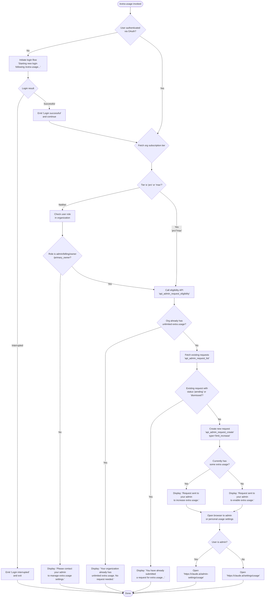

# `/extra-usage`

> Analysis basis: CC v2.1.133 bundle.js (AST extraction + Claude interpretation)
> Minimum version: v2.1.133

---

## Overview

`/extra-usage` allows a Claude Code user to configure or request extra API usage capacity so that work can continue when usage limits have been reached. When invoked, the command inspects the user's subscription tier and organizational role, checks for existing requests, and either sends a new limit-increase request to an admin, opens a browser-based usage settings page, or notifies the user that no action is needed. If the user is not authenticated via OAuth, the command may initiate a login flow before proceeding.

---

## Registration

| Field | Value |
|---|---|
| type | `local-jsx` |
| name | `extra-usage` |
| description | `Configure extra usage to keep working when limits are hit` |
| loc_byte | `8043940` |
| loc_byte_end | `8044145` |
| loc_line | `3011` |
| module_id | `iZ9` |
| load_inline | `true` |
| arbor_handler.name | `sz6` |
| arbor_handler.fqn | `claude-2.1.133::sz6` |
| arbor_handler.kind | `AsyncFunction` |
| arbor_handler.resolution_path | `module_id` |
| arbor_handler.n_hits | `0` |

Analysis basis: CC v2.1.133 bundle.js:+8043940

---

## Input Branching

The command has more than three distinct execution branches (unlimited org, non-admin user, pending/dismissed request, successful new request, and browser-open fallback), so a Mermaid flowchart is used.



Analysis basis: CC v2.1.133 bundle.js:+8042900, +8042984, +7998098, +7998255, +7998438, +7998627, +7998681, +7998895, +7998936

---

## Behavioral Spec

### Main Handler (`sz6`) — Async Entry Point

The handler is an `AsyncFunction` resolved via `module_id → iZ9` by the Arbor symbol graph.

```
async function handleExtraUsage(context):

    planTier = getSubscriptionPlanInfo()         // checks for "pro" / "max"
    experimentFlags = fetchExperimentFlags()     // J6: Growthbook experiment state

    isAuthenticated = checkOAuthStatus()         // Z5H / C_ / F7
    if not isAuthenticated:
        print("Starting new login following /extra-usage. " +
              "Exit with Ctrl-C to use existing account.")
        result = awaitLogin()                    // A.onChangeAPIKey listener
        if result == INTERRUPTED:
            print("Login interrupted")
            return
        print("Login successful")

    usageStatus = fetchUsageData()              // mL8 orchestrates API calls below
    renderOrDispatch(usageStatus, planTier)     // H (JSX renderer)
```

Analysis basis: CC v2.1.133 bundle.js:+8042900, +8043062, +8043097, +8043167, +8043267, +8043290, +8043309

---

### Authentication Check (`checkOAuthStatus` — `Z5H` / `C_` / `F7`)

```
function checkOAuthStatus():
    authState = readCurrentAuthState()          // rY: reads env / file descriptors
    hasOAuth  = Boolean(authState.oauthToken)  // wU wraps Boolean()
    return hasOAuth
```

The authentication layer (`rY`) reads credential sources in priority order:
1. `ANTHROPIC_API_KEY` environment variable (bundle.js:+2874043)
2. `CLAUDE_CODE_API_KEY_FILE_DESCRIPTOR` file descriptor (bundle.js:+1997795)
3. `CLAUDE_CODE_OAUTH_TOKEN_FILE_DESCRIPTOR` file descriptor (bundle.js:+1997651)
4. OAuth token from stored session

Error constant: `"ANTHROPIC_API_KEY or CLAUDE_CODE_OAUTH_TOKEN env var is required"` (bundle.js:+2874464).

Analysis basis: CC v2.1.133 bundle.js:+2889734, +2889756, +2889310

---

### Experiment / Feature-Flag Fetch (`fetchExperimentFlags` — `J6`)

```
function fetchExperimentFlags():
    flags = loadGrowthbookFlags()              // Bq6, gq6
    processed = deduplicateAndEmit(flags)      // _d6: checks Ut8 Set, b5H Map
    for each flag in processed:
        if not alreadySeen(flag.id):           // Ut8.has / Ut8.add
            sessionEntry = b5H.get(flag.id)   // b5H.get
            createExperimentEvent(sessionEntry) // pt8 → Xo.emit "growthbook_experiment"
            markSeen(flag.id)                  // pq6.add
    return flags
```

Experiment events use the string `"GrowthbookExperimentEvent"` (bundle.js:+3085163) and are emitted as `"growthbook_experiment"` (bundle.js:+3085590). Random bytes of length 32 encoded as `"hex"` are used for session token generation (bundle.js:+3116761, +3116774).

Analysis basis: CC v2.1.133 bundle.js:+8042944, +3091299, +3091336, +3089099

---

### API Layer Orchestrator (`usageOrchestrator` — `mL8`)

`mL8` is the central coordinator for all HTTP calls made by `/extra-usage`. It delegates to several sub-functions:

```
async function usageOrchestrator(authContext):

    // Step 1: Validate subscription plan type
    planInfo = getAccountPlan(authContext)       // ab → C_, U9, R6
    if planInfo.type in ["team", "enterprise"]:  // literals +7997937, +7997949
        checkRoleEligibility(planInfo)

    // Step 2: Check admin request eligibility
    eligibility = fetchEligibility(authContext)  // TZ9: GET api_admin_request_eligibility

    // Step 3: List existing admin requests
    existingRequests = listRequests(authContext) // EZ9: GET api_admin_request_list

    // Step 4: If appropriate, create a new request
    newRequest = createRequest(authContext)      // GZ9: POST api_admin_request_create

    // Step 5: Handle errors via isAxiosError check
    handleErrors(response)                       // Oy4

    // Step 6: Open browser
    openUsagePage(isAdmin)                       // ML → Y8 → GA
```

Analysis basis: CC v2.1.133 bundle.js:+7997926, +7997966, +7997994, +7998187, +7998347, +7998541, +7998755, +7999053

---

### Eligibility Check (`fetchEligibility` — `TZ9`)

```
async function fetchEligibility(auth):
    orgUuid = getOrganizationUUID()              // Rz; error if absent: +6443033
    headers = buildHeaders(orgUuid)              // includes "x-organization-uuid" +7996704
                                                 // "anthropic-version": "2023-06-01" +6443913
    response = httpClient.get(
        endpoint: "api_admin_request_eligibility",  // literal +7996610
        headers: headers
    )                                            // X8.get +7996841
    if response indicates unlimited usage:
        return { unlimited: true,
                 message: "Your organization already has unlimited extra usage. No request needed." }
                                                 // literal +7998098
    return response.data
```

If the user is on a `team` or `enterprise` plan but lacks an eligible role (`admin`, `billing`, `owner`, `primary_owner` — literals at +1983239, +1983247, +1983257, +1983265), the message `"Please contact your admin to manage extra usage settings."` is shown (bundle.js:+7998255).

Analysis basis: CC v2.1.133 bundle.js:+7996607, +7996687, +7996698, +7996704, +7996734, +7996841

---

### List Existing Requests (`listRequests` — `EZ9`)

```
async function listRequests(auth):
    orgUuid = getOrganizationUUID()
    response = httpClient.get(
        endpoint: "api_admin_request_list",   // literal +7996298
        headers: buildHeaders(orgUuid)
    )                                         // X8.get +7996548
    pendingOrDismissed = response.data.filter(
        r => r.status == "pending" or r.status == "dismissed"
    )                                         // literals +7998369, +7998379
    if pendingOrDismissed.length > 0:
        return { alreadyRequested: true,
                 message: "You have already submitted a request for extra usage to your admin." }
                                              // literal +7998438
    return { alreadyRequested: false, existing: response.data }
```

Analysis basis: CC v2.1.133 bundle.js:+7996295, +7996368, +7996379, +7996415, +7996548, +7998369, +7998379

---

### Create Admin Request (`createRequest` — `GZ9`)

```
async function createRequest(auth):
    orgUuid = getOrganizationUUID()
    payload = { type: "limit_increase" }      // literal +7998191
    response = httpClient.post(
        endpoint: "api_admin_request_create", // literal +7996035
        body: payload,
        headers: buildHeaders(orgUuid)
    )                                         // X8.post +7996231
    if currentlyHasSomeExtraUsage:
        print("Request sent to your admin to increase extra usage.")  // +7998627
    else:
        print("Request sent to your admin to enable extra usage.")    // +7998681
    return response
```

Analysis basis: CC v2.1.133 bundle.js:+7996032, +7996107, +7996118, +7996154, +7996231

---

### Browser Open (`openUsagePage` — `ML` / `Y8` / `GA`)

```
function openUsagePage(isAdmin):
    if isAdmin:
        url = "https://claude.ai/admin-settings/usage"   // literal +7998895
    else:
        url = "https://claude.ai/settings/usage"         // literal +7998936

    platform = process.platform
    if platform == "darwin":                              // literal +7365999
        exec("open", url)                                // literal +7366173
    elif platform == "win32":                            // literal +7366015
        exec("rundll32", "url,OpenURL", url)             // literals +7366099, +7366111
    else:
        exec("xdg-open", url)                            // literal +7366180

    emit("browser-opened")                               // literal +7999003
```

URL scheme validation accepts only `"http:"` and `"https:"` protocols (bundle.js:+7365727, +7365749). An error is thrown for any other scheme.

Analysis basis: CC v2.1.133 bundle.js:+7999053, +7366048, +7365964, +7365677

---

### HTTP Client and Retry Logic (`nQH` / `lV` / `FP`)

```
async function makeApiRequest(config):
    headers = {
        "Content-Type": "application/json",   // +7997240, +7997255
        "User-Agent": buildUserAgent(),        // +7997274
        ...authHeaders
    }
    try:
        response = await httpClient.request(config, headers, timeout=5000)  // +7997314
    catch error:
        if isAxiosError(error) and error.status == 401:
            // Refresh token then retry once
            refreshToken()
            response = await httpClient.request(config, headers)
            log(" (401→refresh→retry succeeded)")         // literal +7997382
        elif isAxiosError(error) and error.status in [500]:
            handleServerError(error.response.data.detail) // +7997595, +7997801
        else:
            rethrow(error)
    return response
```

Request caching uses a 300,000 ms (5-minute) TTL (bundle.js:+1989872). The `Ea8` Map stores cached responses; `tQ` manages get/set/delete on this cache (bundle.js:+2885589, +2885640, +2885663).

Analysis basis: CC v2.1.133 bundle.js:+7997221, +7997255, +7997274, +7997314, +7997382

---

### Organization UUID Resolution (`getOrganizationUUID` — `Rz`)

```
async function getOrganizationUUID(auth):
    org = await fetchCurrentOrganization()    // A7 → Va8
    if not auth.isWebSession:
        throw Error("Claude Code web sessions require authentication with a Claude.ai account..." )
                                              // literal +6442794
    uuid = org.uuid
    if not uuid:
        throw Error("Unable to get organization UUID")  // literal +6443033
    return uuid
```

Analysis basis: CC v2.1.133 bundle.js:+6442739, +6442750, +6442788, +6443010

---

### Feature Flag (`tengu_ember_latch`) Check

At the start of the handler, `sz6` fires a telemetry event `tengu_ember_latch` (bundle.js:+8042947) and reads the result of `J6` (experiment state). This appears to gate the command under an internal A/B or feature-flag experiment before any API calls are made.

Analysis basis: CC v2.1.133 bundle.js:+8042947

---

## State & Side Effects

| Item | Detail |
|---|---|
| Telemetry: `tengu_ember_latch` | Fired at command entry (bundle.js:+8042947); likely a feature-gate experiment latch |
| Telemetry: `tengu_feature_ok` | Fired on successful feature flag resolution (bundle.js:+907381) |
| Telemetry: `tengu_feature_bad` | Fired on failed feature flag resolution (bundle.js:+907437) |
| Growthbook experiment event | Emitted via `Xo.emit` as `"growthbook_experiment"` for each unseen experiment flag (bundle.js:+3085544, +3085590) |
| `browser-opened` event | Emitted after OS browser launch (bundle.js:+7999003) |
| Request cache (`Ea8` Map) | Stores API responses with 300,000 ms TTL; reads and writes during HTTP calls (bundle.js:+1989872) |
| Seen-experiments set (`Ut8`) | Tracks which Growthbook experiment IDs have been processed in this session (bundle.js:+3089099, +3089139) |
| Processed-experiments set (`pq6`) | Secondary deduplication set for experiment event emission (bundle.js:+3091411) |
| Login state change listener | `A.onChangeAPIKey` registered when unauthenticated login flow is triggered (bundle.js:+8043267) |
| Error log (`yQ.logError`) | Errors during HTTP fetch are pushed to in-memory error log and logged (bundle.js:+912861) |
| Request history buffer (`AN6`) | Rolling buffer of recent requests managed by `NJL` (shift/push, bundle.js:+912141, +912153) |
| Sound | None detected in depth-2 traversal |

---

## Version History

| Version | Change |
|---|---|
| v2.1.133 | Initial analysis |

---

## Common Mistakes

1. **Running `/extra-usage` without OAuth authentication** — The command requires an OAuth session (not just an API key). If only `ANTHROPIC_API_KEY` is set, the command will launch the full login flow before proceeding. Ensure you have authenticated via `/login` first.

2. **Expecting an instant result on `team`/`enterprise` plans as a non-admin** — If your role is not `admin`, `billing`, `owner`, or `primary_owner`, the command will display the contact-your-admin message and exit without making any API request to create a limit-increase.

3. **Re-running the command after a pending request** — If a previous request with status `"pending"` or `"dismissed"` exists, `/extra-usage` will inform you that a request is already on record and will not create a duplicate.

4. **Assuming the browser opens immediately** — The browser-open step (`ML`) happens only after the create-request API call succeeds. Network errors (especially HTTP 500) are handled separately and may prevent the browser from opening.

5. **Confusing the `"pro"`/`"max"` plan check with the role check** — Users on `pro` or `max` plans bypass the role eligibility check and proceed directly to the eligibility API call. Only `team`/`enterprise` plan users are subject to the role filter.

---

## Appendix — Identifier Mapping

> For bundle debugging only. Identifiers change across versions.

| Identifier | Role |
|---|---|
| `sz6` | Main async handler for `/extra-usage` (Arbor-resolved entry point) |
| `U9` | Authentication state reader (reads env vars and file descriptors for API key / OAuth token) |
| `zu_` | Sub-helper called by authentication state reader (credential path A) |
| `Ou_` | Sub-helper called by authentication state reader (credential path B) |
| `rY` | Credential resolution orchestrator (reads ANTHROPIC_API_KEY, file descriptors, OAuth) |
| `HK` | Low-level credential value extractor |
| `kH` | String coercion / normalization utility |
| `NS` | OAuth token source handler (claude-desktop path) |
| `zx6` | Sub-helper under OAuth token source |
| `o96` | API-key string formatter / helper |
| `Gr` | OAuth token file descriptor reader (OAUTH_TOKEN_FILE_DESCRIPTOR) |
| `Wx` | Flag-settings reader (`flagSettings` literal) |
| `_O` | API key resolution logic (ANTHROPIC_API_KEY env, apiKeyHelper, none fallback) |
| `Ta8` | Sub-helper under API key resolver |
| `rT` | Sub-helper under API key resolver |
| `ZaH` | VSCode context detector (`claude-vscode` literal) |
| `xB8` | API key file descriptor reader (API_KEY_FILE_DESCRIPTOR) |
| `R6` | Conversation / session record constructor (uses Date.now) |
| `OS` | History slicer (`.slice` with max 20 entries) |
| `XZ` | Plan-tier constant or helper (reads `"pro"` / `"max"` literals) |
| `J6` | Growthbook experiment flag fetcher and emitter |
| `Bq6` | Growthbook flag loader (sub-helper A) |
| `gq6` | Growthbook flag loader (sub-helper B) |
| `Po` | Growthbook flag processor |
| `jo` | Experiment event formatter |
| `Ex` | Experiment dispatcher / router |
| `_d6` | Experiment deduplicator (checks/updates `Ut8` Set and `b5H` Map) |
| `pt8` | Experiment event creator and emitter (emits `growthbook_experiment` via `Xo.emit`) |
| `ePH` | Client-side telemetry helper (`CS`) |
| `pU` | Session token generator (32 random bytes, hex-encoded) |
| `SH` | JSON serializer wrapper |
| `O2K` | Experiment payload builder |
| `ct8` | Cached experiment fetch helper |
| `I71` | Experiment cache reader |
| `mA` | Database accessor (`db`) |
| `LX1` | Experiment list transformer |
| `CyH` | JWL set membership checker |
| `Z5H` | OAuth status check orchestrator |
| `F7` | OAuth-check sub-path (reads `rY` and `R6`) |
| `C_` | Boolean auth state wrapper |
| `wU` | `Boolean()` wrapper for auth flag |
| `yq` | Telemetry / network tag reader (`essential-traffic`, `no-telemetry`, `default`) |
| `J9_` | Tag resolution helper |
| `mL8` | API call orchestrator for extra-usage (coordinates TZ9, EZ9, GZ9, ML, etc.) |
| `ab` | Account plan / role checker (checks `team`/`enterprise`, `admin`/`billing`/`owner`/`primary_owner`) |
| `nQH` | Core HTTP request executor with retry/error handling |
| `h9` | API base-URL resolver |
| `A` | Base URL constant holder |
| `hH` | Environment-based URL selector (feature-ok path) |
| `uH` | Environment-based URL selector (feature-bad path) |
| `GE` | Auth-state to request-config mapper |
| `z8H` | Cache TTL checker using `Date.now` (300,000 ms window) |
| `q_` | OAuth endpoint builder / validator |
| `q1_` | OAuth endpoint sub-helper |
| `PwL` | OAuth URL pattern helper |
| `lV` | 401/403 error handler with token-refresh retry |
| `H` | Retry back-off helper (Math.random + setTimeout) |
| `tQ` | Response cache manager (`Ea8` Map get/set/delete) |
| `FP` | Request auth-header injector (OAuth token or API key path) |
| `HX` | Header builder that delegates to `_O` |
| `k` | HTTP request builder / dispatcher (sets headers, calls `Uf`) |
| `Ztq` | Request signing / finalization helper |
| `Uf` | URL path constructor (uses `.lastIndexOf`, `.slice`, `[REDACTED]`) |
| `LkH` | URL normalization helper |
| `vtq` | File-based request body handler (Buffer.byteLength, gE6) |
| `b7` | Response body parser |
| `fH` | HTTP response handler (logs errors via `yQ.logError`, manages `cyH` and `AN6` buffer) |
| `HA` | Error normalizer (wraps with Error + String) |
| `NJL` | Rolling request-history buffer manager (`AN6.shift` / `AN6.push`) |
| `TZ9` | Eligibility API fetcher (`api_admin_request_eligibility` GET) |
| `Rz` | Organization UUID resolver |
| `A7` | Organization fetcher sub-helper |
| `SV` | Auth-session validator for web sessions |
| `R5` | Request header builder (includes `x-organization-uuid`) |
| `zAH` | Anthropic-version header builder (`2023-06-01`) |
| `EZ9` | Admin request list fetcher (`api_admin_request_list` GET) |
| `GZ9` | Admin request creator (`api_admin_request_create` POST, `limit_increase`) |
| `Oy4` | Axios error type checker and HTTP error classifier |
| `ML` | Browser-open orchestrator |
| `rG4` | URL scheme validator (allows only `http:` and `https:`) |
| `Y8` | Platform-specific browser launcher (darwin/win32/linux) |
| `GA` | Browser launch executor (spawns `open`, `rundll32`, or `xdg-open`) |
| `N6` | Child-process spawner with timeout (10 retries, 1,000,000 ms max) |

---

Note: index built via Arbor fallback; some signals (telemetry, literals) may be missing — see arbor-fallback.js.