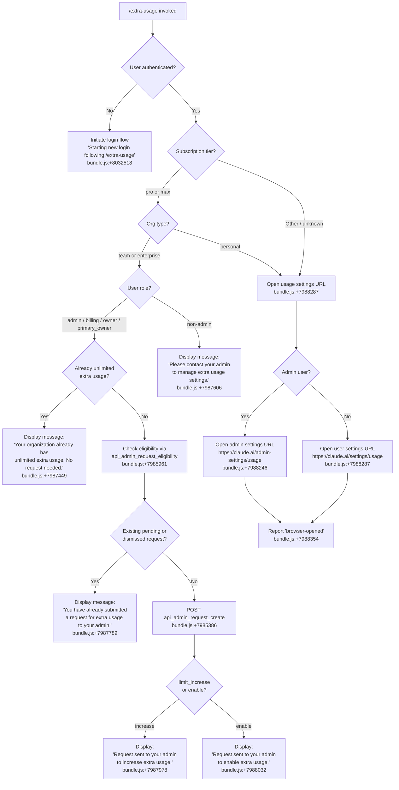

# `/extra-usage`

> Analysis basis: CC v2.1.132 bundle.js (AST extraction + Claude interpretation)
> Minimum version: v2.1.132

---

## Overview

The `/extra-usage` command allows users to configure extra API usage so that Claude Code can continue operating when subscription usage limits are hit. Depending on the user's account type and organizational role, it either navigates to a usage management page, submits an admin approval request, or initiates a new login flow. The command adapts its behavior to the subscription tier (`pro`/`max`) and organizational context (team/enterprise, admin role) detected at runtime.

---

## Registration

| Field | Value |
|---|---|
| type | `local-jsx` |
| name | `extra-usage` |
| description | Configure extra usage to keep working when limits are hit |
| module_id | `_Z9` |
| loc_line | 3011 |

Analysis basis: CC v2.1.132 bundle.js:+8033291

---

## Input Branching

The command's top-level dispatch logic (rooted in the command handler `Fz6`) forks across several branches based on account state, subscription type, and organizational role.



Analysis basis: CC v2.1.132 bundle.js:+8032251, +8032281, +8032295, +8032335, +8032343, +8032413

---

## Behavioral Spec

### Authentication Check and Login Flow

When the command is invoked and no authenticated session is detected, the command handler triggers a new login flow.

```
function handleUnauthenticated():
    display("Starting new login following /extra-usage. Exit with Ctrl-C to use existing account.")
    initiate loginFlow()
    on loginFlow success:
        display("Login successful")
        emit telemetry event tengu_ember_latch
        invoke onChangeAPIKey callback
    on loginFlow interruption:
        display("Login interrupted")
```

Analysis basis: CC v2.1.132 bundle.js:+8032518, +8032641, +8032660, +8032618, +8032298

---

### Subscription Tier Detection

The subscription type resolver examines the user's current subscription and maps it to a known tier string.

```
function resolveSubscriptionTier(userState):
    knownTypes = [
        "stripe_subscription",
        "stripe_subscription_contracted",
        "apple_subscription",
        "google_play_subscription"
    ]
    if userState.subscriptionType in knownTypes:
        tier = userState.tier  // "pro" or "max"
        return tier
    return null
```

Analysis basis: CC v2.1.132 bundle.js:+8032262, +8032273, +2883978, +2884005, +2884043, +2884069

---

### Organization Role Check

For team and enterprise organizations, the command checks whether the current user holds an elevated role before allowing admin-level actions.

```
function isAdminRole(userRole):
    elevatedRoles = ["admin", "billing", "owner", "primary_owner"]
    return userRole in elevatedRoles
```

Analysis basis: CC v2.1.132 bundle.js:+1977758, +1977766, +1977776, +1977784

---

### Eligibility Check (Admin Path)

For admin-role users in team/enterprise orgs, the command queries the eligibility endpoint before attempting to create a request.

```
function fetchEligibility(orgUuid, authToken):
    endpoint = resolveEndpoint("api_admin_request_eligibility")
    headers = {
        "Content-Type": "application/json",
        "User-Agent": buildUserAgent(),
        "x-organization-uuid": orgUuid
    }
    timeout = 5000  // ms
    response = httpGET(endpoint, headers, timeout)
    return response
```

Timeout constant: 5000 ms (bundle.js:+7986665)

Analysis basis: CC v2.1.132 bundle.js:+7985961, +7986055, +7986591, +7986606, +7986625, +7986665

---

### Existing Request Detection

Before submitting a new admin request, the command checks whether a request with status `pending` or `dismissed` already exists.

```
function hasExistingRequest(requestList):
    for request in requestList:
        if request.status == "pending" or request.status == "dismissed":
            return true
    return false
```

Analysis basis: CC v2.1.132 bundle.js:+7987720, +7987730, +7987789

---

### Admin Request List Fetch

```
function fetchAdminRequestList(orgUuid, authToken):
    endpoint = resolveEndpoint("api_admin_request_list")
    headers = buildHeaders(orgUuid, authToken)
    response = httpGET(endpoint, headers)
    return response.data
```

Analysis basis: CC v2.1.132 bundle.js:+7985649

---

### Admin Request Creation

```
function createAdminRequest(orgUuid, authToken, requestType):
    endpoint = resolveEndpoint("api_admin_request_create")
    headers = buildHeaders(orgUuid, authToken)
    body = { type: "limit_increase" }  // requestType determined by org state
    response = httpPOST(endpoint, headers, body)
    if response.type == "limit_increase":
        display("Request sent to your admin to increase extra usage.")
    else:
        display("Request sent to your admin to enable extra usage.")
```

Analysis basis: CC v2.1.132 bundle.js:+7985386, +7987542, +7987978, +7988032

---

### Error Handling for API Calls

The command wraps HTTP calls with an Axios error classifier and a generic error boundary.

```
function handleAPIError(error):
    if isAxiosError(error):
        if error.status == 500:
            extractAndDisplay(error.response, "detail")
        else:
            logError(error, "error")
    else:
        raise error
```

HTTP 500 status constant: 500 (bundle.js:+7986946)

Analysis basis: CC v2.1.132 bundle.js:+7986863, +7986946, +7987152, +911916, +911941

---

### 401 Token Refresh and Retry

The HTTP fetch layer implements a single 401-triggered token refresh and retry.

```
function fetchWithRefresh(request, authState):
    response = httpRequest(request)
    if response.status == 401:
        refreshedToken = refreshAuthToken(authState)
        retryResponse = httpRequest(request, refreshedToken)
        logInfo(" (401→refresh→retry succeeded)")
        return retryResponse
    return response
```

Analysis basis: CC v2.1.132 bundle.js:+7986733

---

### API Usage Fetch

A separate usage-fetch call retrieves the current usage data for display.

```
function fetchAPIUsage(orgUuid, authToken):
    endpoint = resolveEndpoint("api_usage_fetch")
    headers = buildHeaders(orgUuid, authToken)
    response = httpGET(endpoint, headers)
    return response.data
```

Analysis basis: CC v2.1.132 bundle.js:+7986290

---

### Browser URL Opening

When redirecting the user to a web settings page, the command selects the appropriate URL based on admin status and opens it using a platform-specific method.

```
function openBrowserURL(isAdmin):
    if isAdmin:
        url = "https://claude.ai/admin-settings/usage"
    else:
        url = "https://claude.ai/settings/usage"

    platform = process.platform
    if platform == "darwin":
        exec("open", url)
    elif platform == "win32":
        exec("rundll32", "url,OpenURL", url)
    else:
        exec("xdg-open", url)

    report("browser-opened")
```

Analysis basis: CC v2.1.132 bundle.js:+7988246, +7988287, +7988354, +7355523, +7355558, +7355574, +7355658, +7355670, +7355732, +7355739

---

### Telemetry Latch (Login Path)

When a new login is completed following `/extra-usage`, the command fires a single telemetry event and invokes the API key change callback.

```
function onLoginSuccess(apiKey):
    emit("tengu_ember_latch")
    invokeCallback(onChangeAPIKey, apiKey)
```

Analysis basis: CC v2.1.132 bundle.js:+8032298, +8032618

---

### Random Delay Utility

A jitter utility is used in retry or polling paths within the implementation.

```
function randomDelay(maxMs):
    delayMs = Math.random() * maxMs  // maxMs constant: 2 (used as multiplier)
    setTimeout(resolve, delayMs)
```

Analysis basis: CC v2.1.132 bundle.js:+12264285, +12264322, +12264283

---

### API Key Environment Variable Resolution

The command checks for an `ANTHROPIC_API_KEY` environment variable and an `apiKeyHelper` configuration value when resolving credentials.

```
function resolveAPIKey(config):
    envKey = process.env["ANTHROPIC_API_KEY"]
    if envKey != null and envKey != "":
        return envKey
    helperKey = config["apiKeyHelper"]
    return helperKey
```

Analysis basis: CC v2.1.132 bundle.js:+2866642, +2866652, +2866677

---

### Telemetry Traffic Classification

The network layer classifies outbound telemetry as `essential-traffic` or `no-telemetry`, with a `default` fallback.

```
function classifyTraffic(requestType):
    if requestType == "essential":
        return "essential-traffic"
    elif requestType == "disabled":
        return "no-telemetry"
    else:
        return "default"
```

Analysis basis: CC v2.1.132 bundle.js:+910466, +910525, +910599

---

## State & Side Effects

| Item | Detail |
|---|---|
| Telemetry | `tengu_ember_latch` — emitted on successful login completion following `/extra-usage` (bundle.js:+8032298) |
| Hook registration | `onChangeAPIKey` callback invoked after login success (bundle.js:+8032618) |
| appState changes | Auth state updated on login completion; API key stored |
| Browser | Opens `https://claude.ai/admin-settings/usage` (admin) or `https://claude.ai/settings/usage` (non-admin) via platform-native launcher (bundle.js:+7988246, +7988287) |
| Network | HTTP GET to `api_usage_fetch`, `api_admin_request_eligibility`, `api_admin_request_list`; HTTP POST to `api_admin_request_create` |
| Error logging | Axios errors logged via `EQ.logError` with severity `"error"` (bundle.js:+911941) |
| Sound | <!-- TODO: not found in depth-2 traversal; needs --depth 4 --> |

---

## Version History

| Version | Change |
|---|---|
| v2.1.132 | Initial analysis |

---

## Common Mistakes

1. **Running `/extra-usage` as a non-admin member of a team/enterprise org** — the command will display "Please contact your admin to manage extra usage settings." and take no further action. Only users with roles `admin`, `billing`, `owner`, or `primary_owner` can submit requests.
2. **Expecting immediate effect after submitting a request** — the POST to `api_admin_request_create` only sends a request to the org admin; actual approval and enablement is performed outside Claude Code.
3. **Submitting a duplicate request** — if a `pending` or `dismissed` request already exists for the organization, the command will display "You have already submitted a request for extra usage to your admin." and refuse to create another.
4. **Assuming the browser will open for all account types** — browser-based URL opening is only triggered for personal/non-enterprise accounts or when the admin path is taken. Team/enterprise admins are routed through the in-CLI request flow.
5. **Interrupting login with Ctrl-C** — if the user exits the login flow started by `/extra-usage`, the session remains unauthenticated and the command's intent is not fulfilled. The message "Login interrupted" is displayed.
6. **Setting `ANTHROPIC_API_KEY` in the environment while also having `apiKeyHelper` configured** — the environment variable takes precedence; the `apiKeyHelper` value is ignored when `ANTHROPIC_API_KEY` is non-empty (bundle.js:+2866652).

---

## Appendix — Identifier Mapping

> For bundle debugging only. Identifiers change across versions.

| Identifier | Role |
|---|---|
| `Fz6` | Top-level command handler for `/extra-usage` |
| `F9` | Authentication state reader / session resolver |
| `wx_` | Auth state accessor (sub-call of session resolver) |
| `Yx_` | Auth token accessor (sub-call of session resolver) |
| `nY` | API key and subscription type resolver |
| `TZ` | Subscription tier classifier |
| `j6` | Request deduplication / in-flight tracker |
| `hq6` | Request set initializer |
| `Rq6` | Request queue processor |
| `Oo` | In-flight request state accessor |
| `uQ6` | Request deduplication check and registration |
| `R6` | HTTP request executor with timestamp and retry |
| `w5H` | Subscription type to tier mapping utility |
| `g7` | Combined subscription + request resolver |
| `R_` | Auth-aware fetch wrapper |
| `kq` | Traffic classification / network policy resolver |
| `h1_` | Traffic class tag applicator |
| `JL8` | Main extra-usage workflow orchestrator |
| `Qb` | Role-gated action dispatcher |
| `IQH` | Usage fetch with 401-refresh-retry logic |
| `fH` | Error handler with logging and telemetry push |
| `ST9` | Admin request list fetcher |
| `hT9` | Admin request eligibility fetcher |
| `yT9` | Admin request creator (POST) |
| `pN4` | Axios error classifier |
| `LL` | Cross-platform browser URL opener |
| `H` | Random jitter / delay utility |
| `A` | App-level callback registry (holds `onChangeAPIKey`) |