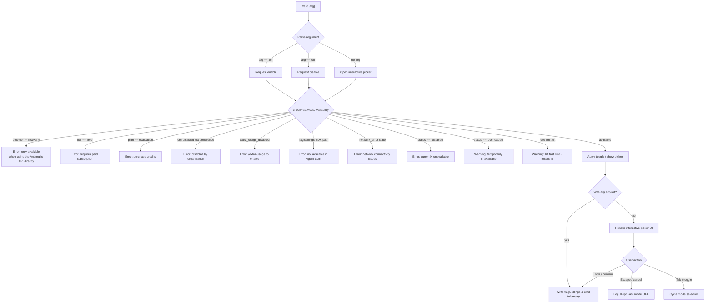

# `/fast`

> Analysis basis: CC v2.1.133 bundle.js (AST extraction + Claude interpretation)
> Minimum version: v2.1.133

---

## Overview

The `/fast` command toggles **Fast mode** (research preview) in Claude Code, which switches the active inference tier to a higher-throughput model path. When invoked without an argument it opens an interactive confirmation picker; when given an explicit `on` or `off` argument it applies the change directly. Availability is gated by subscription plan, API provider type, and organization policy settings.

---

## Registration

| Field | Value |
|---|---|
| type | `local-jsx` |
| name | `fast` |
| description | `null` |
| argumentHint | `[on\|off]` |
| thinClientDispatch | `control-request` |
| module_id | `vfq` |

Analysis basis: CC v2.1.133 bundle.js:+11126914

---

## Input Branching

The command entry point (`commandHandler`) receives the raw argument string, then immediately delegates to the availability checker (`checkFastModeAvailability`) and the toggle orchestrator (`toggleFastMode`). Depending on the argument value and the current availability state, execution follows one of several paths.



Analysis basis: CC v2.1.133 bundle.js:+11125961, +2106431, +2106463, +2106531, +2105959, +2106117, +2106172, +2106296, +2106375, +11125159

---

## Behavioral Spec

### Argument Normalization

```
function normalizeArgument(rawInput):
    trimmed = rawInput.trim()
    upper  = trimmed.toUpperCase()
    if upper in ["YES", "ON"]:
        return "on"
    if upper == "OFF":
        return "off"
    return null   // triggers picker
```

The normalization logic accepts both `yes` and `on` as affirmative tokens, delegating the case-folding to `String.toUpperCase`.

Analysis basis: CC v2.1.133 bundle.js:+25237, +25243, +162681, +162704

---

### Availability Check (`checkFastModeAvailability`)

```
function checkFastModeAvailability(authContext, flagSettings):

    provider = resolveProvider(authContext)  // Q_ → kH path

    if provider not in ["firstParty"]:
        // bedrock, foundry, anthropicAws, mantle, vertex all blocked
        return error("Fast mode is only available when using the Anthropic API directly")

    status = flagSettings.fastMode

    if status == "free":
        return error("Fast mode requires a paid subscription")

    if status == "evaluation":
        return error("Fast mode unavailable during evaluation. Please purchase credits.")

    if flagSettings source == "preference" and status == disabled-by-org:
        return error("Fast mode has been disabled by your organization")

    if status == "extra_usage_disabled":
        return error("Fast mode requires extra usage billing · /extra-usage to enable")

    if flagSettings path == "flagSettings" and SDK-agent path active:
        return error("Fast mode is not available in the Agent SDK")

    if status == "network_error":
        return error("Fast mode unavailable due to network connectivity issues")

    if status == "disabled":
        return error("Fast mode is currently unavailable")

    return available
```

Provider enumeration checked: `"bedrock"`, `"foundry"`, `"anthropicAws"`, `"mantle"`, `"vertex"` (all non-firstParty), and `"firstParty"`.

Analysis basis: CC v2.1.133 bundle.js:+1980750, +1980800, +1980856, +1980910, +1980958, +1980967, +2105985, +2106026, +2106117, +2106201, +2106296, +2106375, +2106463, +2106531, +2106715

---

### Fast Mode Toggle Orchestrator (`toggleFastMode`)

```
function toggleFastMode(requestedState, currentConfig):

    // Re-read settings layers: policySettings, userSettings, projectSettings, localSettings
    merged = mergeSettingsLayers(policySettings, userSettings, projectSettings, localSettings)

    newValue = (requestedState == "on") ? "enabled" : "disabled"

    // Check for in-flight prefetch
    if prefetchPromise is active:
        log("Fast mode prefetch in progress, returning in-flight promise")
        return prefetchPromise

    // Check prefetch cache recency
    if lastFetchTimestamp exists and (Date.now() - lastFetchTimestamp) < cooldownThreshold:
        log("Skipping fast mode prefetch, fetched recently")
        return cached result

    merged.flagSettings.fastMode = newValue
    writeSettingsFile(merged)   // utf-8, honours saveGlobalConfig auth-loss guard

    emitTelemetry("tengu_fast_mode_toggled", { value: newValue })
    return newValue
```

The settings write respects the auth-loss prevention guard: if a re-read of the config is missing auth credentials that the cache holds, the write is refused (see GH #3117).

Analysis basis: CC v2.1.133 bundle.js:+2110008, +2110024, +2110057, +2110091, +2110338, +1165169, +1165720, +1165835, +1165858, +1165772, +3108482, +11122135

---

### Prefetch & Availability Refresh (`fetchFastModeStatus`)

```
function fetchFastModeStatus(authContext):

    if noAuthAvailable(authContext):
        throw Error("No auth available")

    headers = buildHeaders(authContext)  // sets x-api-key or anthropic-beta oauth token

    response = httpGet(fastModeEndpoint, headers)

    if response.status == 401:
        // OAuth token revoked path
        handleRevoked("OAuth token has been revoked")
        return status("disabled", reason="network_error")

    if response.status == 403:
        return status("disabled", reason="disabled")

    recordTimestamp(Date.now())
    return parseAvailability(response)
```

Auth header selection: `"x-api-key"` for API-key auth type, `"anthropic-beta"` / `"accessToken"` for OAuth type.

Analysis basis: CC v2.1.133 bundle.js:+2109631, +2109690, +2109712, +2110514, +2110607, +2110649, +2110675, +2110741

---

### Cooldown Timer (`cooldownManager`)

```
function cooldownManager(cooldownState):
    // H uses Math.random with multiplier 2 for jitter
    jitter = Math.random() * 2
    setTimeout(callback, baseDelay + jitter)

    when cooldown expires:
        log("Fast mode cooldown expired, re-enabling fast mode")
        emitEvent(ld_.emit, "active")
```

Analysis basis: CC v2.1.133 bundle.js:+12285769, +12285806, +2107599, +2107652, +2107735

---

### Interactive Picker UI (`fastModePickerComponent`)

The picker is a JSX component rendered via `o4.createElement`. It registers keyboard handlers through the global handler registry and uses `React.useSyncExternalStore` to subscribe to app state.

```
function renderFastModePicker(props):

    [localState, setLocalState] = useState(initialMode)

    // Subscribe to external store (app state provider)
    currentFastMode = useSyncExternalStore(store.subscribe, store.getState)

    useEffect(() => {
        registerHandler("Global", "Confirmation", {
            "escape"  : "cancel",
            "tab"     : "toggle",
            "enter"   : "confirm",
            "confirm:yes"        : ...,
            "confirm:nextField"  : ...,
            "confirm:next"       : ...,
            "confirm:previous"   : ...,
            "confirm:cycleMode"  : ...,
            "confirm:toggle"     : ...
        })
        return () => unregisterHandler()
    }, [deps])

    // Display states rendered:
    //   "Fast mode" label with "ON " / "OFF" badge
    //   Warning banner when status == "overloaded"
    //   Rate-limit banner: "You've hit your fast limit · resets in <countdown>"
    //   Documentation link: https://code.claude.com/docs/en/fast-mode
    //   Label: " Fast mode (research preview)"

    onCancel:
        log("Kept Fast mode OFF")
        emitTelemetry("tengu_fast_mode_picker_shown", ...)
        close picker

    onConfirm:
        applyToggle(selectedMode)
        emitTelemetry("tengu_fast_mode_toggled", ...)
        close picker
```

The picker UI uses column/row layout primitives and renders a `promptBorder` with `theme: dark` styling.

Analysis basis: CC v2.1.133 bundle.js:+11124165, +11122886, +11122918, +3820851, +3820915, +3821003, +11123838, +11123854, +11123876, +11123893, +11123914, +11123936, +11124417, +11124433, +11124496, +11124547, +11124562, +11124931, +11125000, +11125006, +11125137, +11125159, +11125172, +11125226, +11125255, +11125446, +11123619, +11121840, +11121848, +11121885, +11121919

---

### Countdown Formatter (`formatCountdown`)

```
function formatCountdown(remainingMs):
    if remainingMs < 1000:
        return "0s"
    if remainingMs < 60000:
        seconds = Math.floor(remainingMs / 1000)
        return seconds + "s"
    if remainingMs < 3600000:
        minutes = Math.round(remainingMs / 60000)
        return minutes + "m"
    if remainingMs < 86400000:
        hours = Math.floor(remainingMs / 3600000)
        return hours + "h"
    days = Math.floor(remainingMs / 86400000)
    return days + "d"
```

Analysis basis: CC v2.1.133 bundle.js:+166719, +166741, +166765, +166794, +166846, +166880, +166921, +166953

---

### Status Emission (`emitFastModeStatusEvent`)

```
function emitFastModeStatusEvent(status):
    // Formats display string for logging
    if status == "enabled":
        label = "enabled (cached)"
    else if status == "network_error":
        label = "disabled (network_error)"

    // Pads columns with "  " (two spaces) for tabular alignment
    row = columns.map(col => col.padEnd(width, "  "))
    emit(ug8, row)
```

Analysis basis: CC v2.1.133 bundle.js:+2111437, +2111456, +14179329, +14179342, +14179363, +2111141

---

### Settings Layer Write-Back (`writeSettingsFile`)

The write path merges four named settings layers in priority order:

| Priority | Layer name |
|---|---|
| 1 (highest) | `policySettings` |
| 2 | `userSettings` |
| 3 | `projectSettings` |
| 4 (lowest) | `localSettings` |

Encoding: `utf-8`. If the re-read of the on-disk config is missing auth credentials that the in-memory cache holds, the write is aborted and a `tengu_config_auth_loss_prevented` event is emitted.

Analysis basis: CC v2.1.133 bundle.js:+1165169, +1165720, +1165835, +1165858, +1165772, +3108482, +3108610

---

### Thin-Client Dispatch

The command registration carries `thinClientDispatch: "control-request"`, meaning that in thin-client (VS Code extension) mode the command is forwarded as a control-request message to the host process rather than executed locally. The `"claude-vscode"` client identifier is used during this path.

Analysis basis: CC v2.1.133 bundle.js:+11126914, +46300

---

### Essential-Traffic Classification

The prefetch request for Fast mode availability is classified as `"essential-traffic"` for the purposes of network prioritization, allowing it to pass through even under constrained connectivity.

Analysis basis: CC v2.1.133 bundle.js:+911558

---

## State & Side Effects

| Item | Detail |
|---|---|
| Telemetry: `tengu_fast_mode_toggled` | Fired on every confirmed toggle (both explicit arg and picker confirm path) — bundle.js:+11122491 |
| Telemetry: `tengu_fast_mode_picker_shown` | Fired when the interactive picker is rendered — bundle.js:+11126184 |
| Telemetry: `tengu_penguins_off` | Fired when Fast mode is turned off via the `toggleFastMode` path — bundle.js:+2106569 |
| Telemetry: `tengu_org_penguin_mode_fetch_failed` | Fired when the organization Fast-mode availability fetch fails — bundle.js:+2111510 |
| Telemetry: `tengu_config_auth_loss_prevented` | Fired when a settings write is aborted due to auth-loss guard — bundle.js:+3108610 |
| Telemetry: `tengu_mcp_retry_failed_remote` | Fired from the MCP retry path reachable through the shared connection registry — bundle.js:+13870729 |
| Hook registration | Keyboard handler registered under scope `"Global"` / context `"Confirmation"` for the duration the picker is open; unregistered on close |
| appState changes | `fastMode` field in app state updated via `useSetAppState`; guarded by `AppStateProvider` context (throws `ReferenceError` if called outside provider) |
| Settings file write | `flagSettings.fastMode` set to `"enabled"` or `"disabled"`; written as UTF-8; auth-loss guard active |
| Cooldown timer | `setTimeout` with `Math.random()`-based jitter (multiplier 2) used to schedule re-enable after cooldown expiry |
| Event emission | `ld_.emit` fired with `"active"` on cooldown expiry; `ug8.emit` fired with formatted status row; `uk6.emit` fired from settings write completion |
| Prefetch dedup | In-flight promise is reused if a prefetch is already running; result is cached with `Date.now()` timestamp to suppress redundant fetches |
| Sound | <!-- TODO: not found in depth-2 traversal; needs --depth 4 --> |

---

## Version History

| Version | Change |
|---|---|
| v2.1.133 | Initial analysis — `/fast [on\|off]` with interactive picker, multi-provider availability gating, cooldown timer, and thin-client dispatch support |

---

## Common Mistakes

1. **Using Fast mode with a non-Anthropic provider**: Invoking `/fast on` while authenticated via AWS Bedrock, Google Vertex, Azure Foundry, Anthropic AWS, or Mantle will always fail with "Fast mode is only available when using the Anthropic API directly." There is no workaround; provider must be `firstParty`.

2. **Expecting Fast mode on a free-tier account**: The command will reject with "Fast mode requires a paid subscription." Upgrade the account before attempting to enable it.

3. **Invoking outside an `AppStateProvider`**: Programmatic callers that trigger the command outside the React provider tree will receive a `ReferenceError` ("useAppState/useSetAppState cannot be called outside of an `<AppStateProvider />`").

4. **Forgetting the Agent SDK restriction**: When running inside the Agent SDK (flagSettings path), Fast mode is unconditionally unavailable regardless of subscription or provider.

5. **Assuming immediate re-enable after cooldown**: The cooldown timer includes random jitter (up to 2× base delay via `Math.random()`), so the exact moment Fast mode re-enables after a rate-limit event is non-deterministic.

6. **Not enabling extra-usage billing**: If the account has `extra_usage_disabled` status, `/fast on` produces an actionable error pointing to `/extra-usage`. The user must run `/extra-usage` first.

7. **Interpreting `"disabled (network_error)"` as permanent**: This status is transient; it reflects a connectivity failure during the availability prefetch, not a permanent account restriction.

---

## Appendix — Identifier Mapping

> For bundle debugging only. Identifiers change across versions.

| Identifier | Role |
|---|---|
| `Dz7` | Command entry-point / handler dispatcher for `/fast` |
| `aq` | Argument parser / normalization utility |
| `Q_` | Provider resolver (maps auth context to provider string) |
| `kH` | String coercion helper (wraps `String()`) |
| `H` | Cooldown timer / jitter scheduler (uses `Math.random` + `setTimeout`) |
| `Tr` | Fast mode toggle orchestrator |
| `J6` | Connection / flag registry accessor (checks `b5H`, `cU`, `pq6` sets) |
| `k` | Log/debug emitter (uses `debug` level, `trim`, `toUpperCase`) |
| `NA` | VS Code / thin-client identifier resolver |
| `ZaH` | Client-type gate (checks for `"claude-vscode"`) |
| `_V` | Flag settings writer |
| `h8` | Settings layer merger (`policySettings` / `userSettings` etc.) |
| `Cg8` | String-to-enum status coercer for fast mode values |
| `_6K` | Post-toggle side-effect emitter |
| `mRH` | Availability prefetch / HTTP fetch orchestrator |
| `yq` | Essential-traffic classifier |
| `HX` | Network request dispatcher |
| `GE` | Response parser / availability extractor |
| `R6` | Timestamp recorder and cache entry writer |
| `K6K` | Auth token builder (constructs `x-api-key` / `accessToken` headers) |
| `q` | Temp-file cleanup utility (calls `unlinkSync`) |
| `tQ` | In-flight promise deduplicator (`Ea8` map get/set/delete) |
| `xA` | Settings file writer (UTF-8, multi-layer merge, `uk6.emit`) |
| `e6` | Auth-loss prevention guard for `saveGlobalConfig` |
| `d` | React rendering helper / JSX utility |
| `L` | Status row formatter (uses `padEnd` with two-space separator) |
| `Pz8` | Fast mode picker container component |
| `A` | Generic app-state accessor |
| `jz8` | Picker initialization / prefetch trigger sub-component |
| `pDH` | Picker theme/style configurator (`theme`, `dark`, `promptBorder`, `fastMode`) |
| `FY` | Model-label resolver (maps `opus-4-6` / `opus-4-7` to display names) |
| `mV` | Current model display renderer ("Opus 4.7" / "Opus 4.6") |
| `EE` | Picker confirm-action handler |
| `sXH` | Picker cancel / dismiss handler |
| `Wz8` | Full interactive picker UI component (root JSX, keyboard wiring) |
| `O6` | App state store subscriber (uses `useSyncExternalStore`) |
| `MAA` | App state context consumer (throws `ReferenceError` if outside provider) |
| `cA` | Secondary context accessor for app state |
| `xg8` | Cooldown-expiry re-enable emitter (fires `ld_.emit` with `"active"`) |
| `_` | String lowercase normalizer (uses `f.toLowerCase`) |
| `f` | Stream/connection close handler (`_.close`, `q.close`) |
| `$` | Timestamp-aware event dispatcher (`XDq` path, `Date.now`) |
| `XDq` | Session-event recorder with dedup (`yr`, `iY`, `Sj6`, `SH`) |
| `rA` | Global keyboard handler registration component (`useRef`, `useEffect`, `registerHandler`) |
| `AG` | Context accessor for keyboard handler scope |
| `M` | MCP connection registry iterator (`K.values`, `J6`, `Og7`) |
| `xq` | Countdown time formatter (`Math.floor`, `Math.round`) |