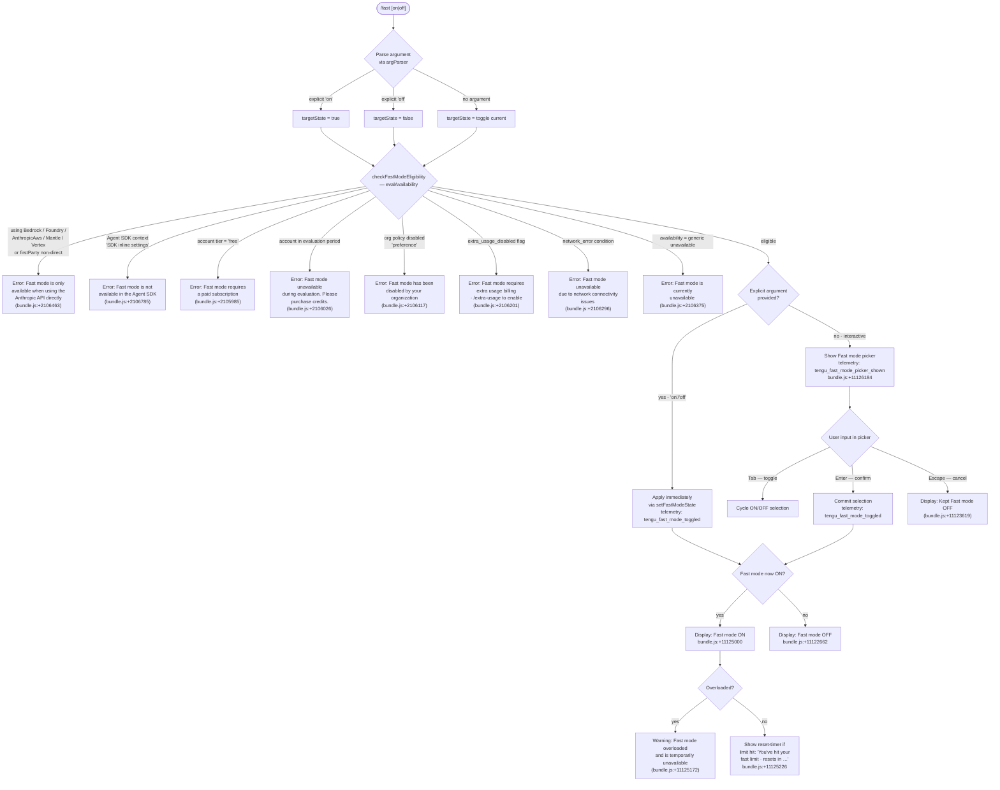

# `/fast`

> Analysis basis: CC v2.1.133 bundle.js (AST extraction + Claude interpretation)
> Minimum version: v2.1.133

---

## Overview

The `/fast` command toggles **Fast mode** — a research-preview feature that routes inference through a faster (but capacity-limited) serving path available only to direct Anthropic API users. When invoked, the command checks eligibility against a rich set of account, billing, and network conditions, then either applies the requested state immediately or presents an interactive confirmation picker that lets the user cycle through enable/disable choices before committing.

---

## Registration

| Field | Value |
|---|---|
| `type` | `local-jsx` |
| `name` | `fast` |
| `description` | `"Toggle fast mode ( ... only)"` |
| `argumentHint` | `[on\|off]` |
| `thinClientDispatch` | `control-request` |
| `immediate` | `null` |
| `isHidden` | `null` |
| `module_id` | `vfq` |
| `load_inline` | `true` |
| `loc_byte` | `11126914` |
| `loc_byte_end` | `11127191` |
| **`arbor_handler.name`** | `Dz7` |
| **`arbor_handler.fqn`** | `claude-2.1.133::Dz7` |
| **`arbor_handler.kind`** | `AsyncFunction` |
| **`arbor_handler.resolution_path`** | `module_id` |
| **`arbor_handler.n_hits`** | `3` |
| `arbor_handler.name` | `Dz7` |
| `arbor_handler.kind` | `AsyncFunction` |
| `arbor_handler.resolution_path` | `module_id` |
| `arbor_handler.fqn` | `claude-2.1.133::Dz7` |
| `arbor_handler.n_hits` | `3` |

Analysis basis: CC v2.1.133 bundle.js:+11126914

---

## Input Branching

Seven or more distinct outcomes are observable from the literals and callGraph (free tier, evaluation period, org-disabled, extra-usage-disabled, network error, SDK context, direct API + eligibility pass, overloaded state, plus the on/off argument parse). A Mermaid flowchart is therefore required.



---

## Behavioral Spec

### 1 — Handler entry-point (`Dz7`)

`Dz7` is the primary async handler resolved via `module_id` → `vfq` by the Arbor symbol graph.

```
async function fastCommandHandler(args, context):
    argument = parseArgument(args)          // aq / argParser
    state    = resolveTargetState(argument) // "on", "off", or toggle

    eligibility = checkFastModeEligibility(context)  // Tr → evalAvailability
    if eligibility.blocked:
        return renderError(eligibility.reason)

    if argument is explicit:
        applyFastModeState(state, context)   // mRH
        emitTelemetry("tengu_fast_mode_toggled")
    else:
        showFastModePicker(context)          // Pz8 / Wz8
        emitTelemetry("tengu_fast_mode_picker_shown")
```

Analysis basis: CC v2.1.133 bundle.js:+11125961

---

### 2 — Argument parsing (`aq` / `argParser`)

```
function parseArgument(rawArgs):
    token = rawArgs.trim().toLowerCase()
    if token in ["yes", "on", "1"]:   // literals at +25237, +25243, +25147
        return ENABLE
    if token == "off":                 // literal at +11126075
        return DISABLE
    return NO_PREFERENCE               // triggers interactive picker
```

Analysis basis: CC v2.1.133 bundle.js:+11125961 (call `Dz7` → `aq`)

---

### 3 — Eligibility check (`Tr` / `evalAvailability`)

`Tr` calls `aq` (re-parse), `Q_` (resolve current config), `J6` (check feature flags / experiment state), `k` (settings merge), `NA`/`ZaH` (org policy), `_V` (SDK context detection), `h8` (settings store lookup), `Cg8` (config accessor), `kH` (platform resolver), `V_` (auth context), and `_6K` (network status). Results map to one of the error strings catalogued in the flowchart above.

Availability strings emitted on the `tengu_penguins_off` telemetry event (bundle.js:+2106569):

| Condition code | User-facing message |
|---|---|
| API not direct | `"Fast mode is only available when using the Anthropic API directly"` (bundle.js:+2106463) |
| `"Fast mode is not available"` generic | bundle.js:+2106531 |
| Agent SDK | `"Fast mode is not available in the Agent SDK"` (bundle.js:+2106785) |
| `free` tier | `"Fast mode requires a paid subscription"` (bundle.js:+2105985) |
| evaluation | `"Fast mode unavailable during evaluation…"` (bundle.js:+2106026) |
| `preference` / org | `"Fast mode has been disabled by your organization"` (bundle.js:+2106117) |
| `extra_usage_disabled` | `"Fast mode requires extra usage billing · /extra-usage to enable"` (bundle.js:+2106201) |
| `network_error` | `"Fast mode unavailable due to network connectivity issues"` (bundle.js:+2106296) |
| generic unavailable | `"Fast mode is currently unavailable"` (bundle.js:+2106375) |

Analysis basis: CC v2.1.133 bundle.js:+2106431 (call `Tr` → `J6`)

---

### 4 — State application (`mRH` / `applyFastModeState`)

```
async function applyFastModeState(targetEnabled, context):
    // Prefetch guard — skip if fetched recently
    if withinPrefetchCooldown():
        log("Skipping fast mode prefetch, fetched recently")  // +2110338
        return cachedState

    // In-flight deduplication
    if prefetchInFlight:
        log("Fast mode prefetch in progress, returning in-flight promise")  // +2110091
        return inFlightPromise

    auth = getAuthContext(context)    // HX → _O
    if not auth:
        throw Error("No auth available")   // +2110514

    response = callFastModeEndpoint(auth)  // R6 → config store

    on HTTP 401:
        attemptOAuthRefresh(context)   // tQ → pYK
    on HTTP 403:
        markDisabled()

    on success:
        persistFastModeState(targetEnabled)   // e6 → config writer
        emitEvent("ug8.emit")                 // +2111141
        emitTelemetry("tengu_fast_mode_toggled")

    on error:
        emitTelemetry("tengu_org_penguin_mode_fetch_failed")  // +2111510
        return { status: "network_error" }
```

Status display literals:
- `"enabled (cached)"` — bundle.js:+2111437
- `"disabled (network_error)"` — bundle.js:+2111456

Analysis basis: CC v2.1.133 bundle.js:+11126022 (call `Dz7` → `mRH`)

---

### 5 — Interactive picker (`Pz8` / `Wz8` / `fastModePicker`)

`Pz8` builds the picker component; `Wz8` is the React component that renders it (type `local-jsx`). The picker is labeled `" Fast mode (research preview)"` (bundle.js:+11124224).

```
function fastModePicker(currentState, eligibility):
    render SelectionWidget:
        title   = "Fast mode"           // +11124931
        options = ["ON ", "OFF"]        // +11125000, +11125006

    keyboard bindings:
        Tab    → action "toggle"        // +11124509
        Enter  → action "confirm"       // +11124562
        Escape → action "cancel"        // +11124433

    if userConfirms:
        applyFastModeState(selection)
        emitTelemetry("tengu_fast_mode_toggled")
    if userCancels:
        display "Kept Fast mode OFF"    // +11123619

    post-render status decorations:
        if overloaded:
            show warning "Fast mode overloaded and is temporarily unavailable"  // +11125172
        if rateLimitHit:
            show "You've hit your fast limit · resets in <countdown>"           // +11125226
        docs link = "https://code.claude.com/docs/en/fast-mode"                 // +11125446
```

Analysis basis: CC v2.1.133 bundle.js:+11126094 (call `Dz7` → `Pz8`)

---

### 6 — Cooldown / prefetch timer (`xg8`)

`xg8` tracks cooldown state using `Date.now()` and emits `ld_.emit` when the cooldown expires.

```
function cooldownWatcher(state):
    if state == "cooldown":                              // +2107599
        wait until Date.now() >= cooldownExpiry
        log("Fast mode cooldown expired, re-enabling fast mode")  // +2107652
        ld_.emit(cooldownExpiredEvent)
```

Analysis basis: CC v2.1.133 bundle.js:+2107611 (`xg8` → `Date.now`)

---

### 7 — Model label resolution (`uRH` / `Hx` / `LX`)

The picker display resolves the current model name to a human-readable label:

| Internal alias | Display label | Source literal |
|---|---|---|
| `opus` | `"Opus 4.7"` | bundle.js:+2107204 |
| `claude-opus-4-6` | `"Opus 4.6"` | bundle.js:+2107215 |
| `[1m]` token budget marker | shown inline | bundle.js:+2107285 |

Analysis basis: CC v2.1.133 bundle.js:+2107248 (`uRH` → `Hx`)

---

### 8 — Settings persistence path

Fast mode preference is written through the layered settings stack (`vWL` / `loadSettingsFromDisk`):

```
settingsHierarchy = [
    "policySettings",   // +1164615 — read-only org overrides
    "userSettings",     // +1161120 — ~/.claude/settings.json
    "projectSettings",  // +1161168 — .claude/settings.json
    "localSettings",    // +1161190 — .claude/settings.local.json
    "flagSettings",     // +1161273 — CLI flag overrides
]
key = "fastMode"        // +11121919
```

Config write uses `fe8` (saveConfigWithLock) with a lock-contention guard and auth-loss prevention (see `tengu_config_stale_write`, `tengu_config_auth_loss_prevented`).

Lock acquisition timeout: `60000` ms (bundle.js:+3111954).

Analysis basis: CC v2.1.133 bundle.js:+1167214 (`vWL` → `loadSettingsFromDisk_start`)

---

## State & Side Effects

| Item | Detail |
|---|---|
| **Telemetry — toggle** | `tengu_fast_mode_toggled` (bundle.js:+11122491) — fired on every committed state change |
| **Telemetry — picker shown** | `tengu_fast_mode_picker_shown` (bundle.js:+11126184) — fired when no explicit argument, picker is displayed |
| **Telemetry — eligibility blocked** | `tengu_penguins_off` (bundle.js:+2106569) — fired when any eligibility check rejects |
| **Telemetry — fetch failed** | `tengu_org_penguin_mode_fetch_failed` (bundle.js:+2111510) — network or auth failure during state sync |
| **Telemetry — config events** | `tengu_config_lock_contention`, `tengu_config_stale_write`, `tengu_config_auth_loss_prevented` — config write guards |
| **Telemetry — OAuth recovery** | `tengu_oauth_401_sdk_callback_refreshed`, `tengu_oauth_401_recovered_from_disk`, `tengu_oauth_401_recovered_from_keychain` |
| **Telemetry — feature flag** | `tengu_feature_ok` / `tengu_feature_bad` — GrowthBook experiment gate |
| **appState changes** | `fastMode` key written to layered config (policy → user → project → local → flag); `appState` store updated via `O6` / `MAA` / `IfH.useSyncExternalStore` |
| **Event emitter** | `ug8.emit` fired after successful state application (bundle.js:+2111141); `ld_.emit` fired on cooldown expiry (bundle.js:+2107712) |
| **Hook registration** | `rA` registers a handler via `L.registerHandler` (bundle.js:+3821003) — scoped to the `"Global"` key (bundle.js:+3820816) |
| **Prefetch cache** | In-flight promise deduplicated; skip-if-recent guard uses `Date.now` timestamp |
| **Sound** | None observed in depth-2 traversal |
| **thinClientDispatch** | `control-request` — the command is forwarded as a control request in thin-client (remote) sessions |

---

## Version History

| Version | Change |
|---|---|
| v2.1.133 | Initial analysis — interactive picker, eligibility branching, cooldown watcher, layered settings persistence |

---

## Common Mistakes

1. **Invoking `/fast` outside the direct Anthropic API** — Using Bedrock, Vertex, Foundry, Mantle, or any non-direct provider silently returns the eligibility-blocked error (`"Fast mode is only available when using the Anthropic API directly"`, bundle.js:+2106463). No state is written.

2. **Expecting `/fast on` to work on a free-tier account** — The `free` tier check fires before any network call; the command returns immediately with `"Fast mode requires a paid subscription"` (bundle.js:+2105985).

3. **Expecting `/fast` to toggle inside the Agent SDK** — The SDK context (`"SDK inline settings"`, bundle.js:+1160245) is detected separately from the provider check; the command returns `"Fast mode is not available in the Agent SDK"` (bundle.js:+2106785) regardless of API key type.

4. **Misreading the overloaded state as "off"** — When Fast mode is ON but the serving path is overloaded, the picker still shows `ON` with an additional warning banner (bundle.js:+11125172). The setting itself is not reverted.

5. **Pressing Escape in the picker and assuming state changed** — Escape emits `"Kept Fast mode OFF"` (bundle.js:+11123619) and makes no write; no `tengu_fast_mode_toggled` event is fired in that path.

6. **Omitting `/extra-usage` when `extra_usage_disabled` is set** — The error message explicitly instructs using `/extra-usage` to unblock billing (bundle.js:+2106201); `/fast on` alone cannot override this flag.

---

## Appendix — Identifier Mapping

> For bundle debugging only. Identifiers change across versions.

| Identifier | Role |
|---|---|
| `Dz7` | Main async handler for `/fast` command (Arbor-resolved entry point) |
| `aq` | Argument parser / input tokeniser |
| `Q_` | Config resolver / settings reader |
| `kH` | Platform / provider identifier |
| `Tr` | Fast mode eligibility evaluator (`evalAvailability`) |
| `J6` | Feature-flag / experiment gate checker |
| `Bq6` | Experiment variant resolver A |
| `gq6` | Experiment variant resolver B |
| `Po` | Eligibility sub-check helper |
| `jo` | Experiment condition evaluator |
| `_d6` | GrowthBook experiment dispatcher |
| `pt8` | Experiment event emitter |
| `ct8` | Experiment result cacher |
| `R6` | Config file reader / writer with backup |
| `F6` | File-system path helper |
| `He8` | Config schema validator |
| `m5H` | Backup-aware config file writer |
| `u2K` | File watcher registration helper |
| `k` | Merged-settings accessor |
| `Ztq` | Log channel selector |
| `xcA` | Log output formatter |
| `SH` | JSON stringify wrapper |
| `Uf` | String redaction helper (`[REDACTED]`) |
| `rnA` | Sensitive-key mapper |
| `LkH` | TTY write helper |
| `UnA` | Raw stream writer |
| `vtq` | Conversation / transcript logger |
| `uNH` | Debounced flush writer |
| `aHH` | Log file path builder |
| `dG8` | Filesystem error classifier |
| `_iA` | Log directory resolver |
| `AiA` | Log file rotation helper |
| `Vtq` | Log file append-and-rotate handler |
| `y1` | Active-session set manager |
| `NA` | Org policy accessor |
| `ZaH` | VS Code integration adapter |
| `_V` | SDK context detector |
| `h8` | Settings store cache getter |
| `OcA` | Settings cache lookup |
| `j5_` | Settings loader orchestrator |
| `X5_` | Policy settings merger |
| `ZO` | User settings file loader |
| `Hr` | Project settings file loader |
| `Y5_` | Local / flag settings merger |
| `zcA` | Settings cache setter |
| `Cg8` | Config value accessor |
| `_6K` | Network status checker |
| `mRH` | Fast mode state application function (`applyFastModeState`) |
| `yq` | Auth token resolver |
| `J9_` | OAuth token reader |
| `HX` | Auth context builder |
| `_O` | API credential resolver |
| `HK` | Platform string formatter |
| `Wx` | API key helper runner |
| `Ta8` | API key helper resolver |
| `rT` | Credential mode selector |
| `xB8` | File-descriptor credential reader |
| `OS` | Token slicer (truncation helper) |
| `GE` | Auth state propagator |
| `K6K` | Access-token extractor |
| `q_` | OAuth token builder |
| `q1_` | Token field extractor |
| `PwL` | OAuth endpoint resolver |
| `q` | File unlink helper |
| `tQ` | OAuth 401 recovery handler |
| `pYK` | OAuth refresh orchestrator |
| `SPH` | OAuth client provider |
| `r96` | Token refresh requester |
| `JaH` | Refresh request builder |
| `d` | Generic config value getter |
| `hH` | Feature-flag "ok" reporter |
| `uH` | Feature-flag "bad" reporter |
| `Gr` | File-descriptor token reader |
| `dK` | Disk-based token reader |
| `xHH` | Keychain token reader |
| `fH` | API request dispatcher |
| `A7` | Response parser helper |
| `xA` | Agent / project config loader |
| `OE` | File content loader |
| `Fp` | Source-file reader with slice |
| `D8` | Disk write helper |
| `w8` | Error normaliser |
| `rh8` | Module load timestamp recorder |
| `C6H` | Config file path resolver |
| `LA` | Config directory locator |
| `oLH` | Settings merge helper |
| `KhH` | Atomic file writer (temp + rename) |
| `O` | File-stat symbolic-link checker |
| `f` | File-handle close/read wrapper |
| `l2` | Settings cache invalidator |
| `iN6` | Git-ignore-aware config writer |
| `N6` | Git check-ignore runner |
| `Ch8` | YAML/JSON config parser |
| `mh8` | Git binary locator |
| `yPL` | User config directory builder |
| `Qb` | Project `.claude` path builder |
| `db` | Settings-load orchestrator |
| `Yp` | Settings object constructor |
| `vWL` | `loadSettingsFromDisk` implementation |
| `Oq` | Memory-usage sampler |
| `$cA` | Settings load finaliser |
| `e6` | Global config save (fallback path) |
| `fe8` | `saveConfigWithLock` implementation |
| `K` | Lock / async-queue helper |
| `ql_` | Config merge-and-assign helper |
| `lq6` | Config integrity checker |
| `Me8` | Backup directory path builder |
| `fxH` | Config field accessor |
| `jX1` | Config entry iterator |
| `MxH` | Config save timestamp recorder |
| `Ke8` | Fallback config writer |
| `L` | Pad-and-format helper |
| `Pz8` | Fast mode picker builder |
| `jz8` | Flag-settings applicator |
| `I7H` | Flag settings reader |
| `Dv` | CCR mode detector |
| `oM` | Remote-workspace flag reader |
| `uRH` | Model label resolver |
| `Hx` | Opus model name formatter |
| `LX` | Model selection dispatcher |
| `FY` | Model argument parser |
| `fW` | Model selector state machine |
| `Gq` | Model alias normaliser |
| `pDH` | Theme/prompt-border renderer |
| `ko` | Theme resolver |
| `qL6` | Theme value extractor |
| `Ik6` | Theme list validator |
| `U5H` | Theme prefix stripper |
| `KP1` | Prompt border style getter |
| `_5` | Display settings compositor |
| `Lk` | Active MCP server set manager |
| `K_` | Foreground colour resolver |
| `a5H` | ANSI / 256 / RGB colour renderer |
| `cp` | Colour passthrough helper |
| `mV` | Model display name formatter |
| `EE` | Token-count formatter |
| `Ac_` | Number-to-fixed formatter |
| `sXH` | Arg-list serialiser |
| `Wz8` | Fast mode picker React component |
| `O6` | App-state context subscriber |
| `MAA` | App-state context accessor |
| `cA` | App-state read helper |
| `xg8` | Cooldown expiry watcher |
| `$` | Conversation message dispatcher |
| `XDq` | Message persistence writer |
| `yr` | Message type normaliser |
| `y7H` | Message trimmer |
| `iY` | Atomic file write helper |
| `Sj6` | Daemon status file path builder |
| `rA` | Global keyboard handler registrar |
| `AG` | Keyboard context provider accessor |
| `M` | MCP server lifecycle manager |
| `iZH` | MCP connection initialiser |
| `zt` | MCP tool schema builder |
| `$I` | MCP result formatter |
| `AA` | MCP capability reporter |
| `AJ6` | MCP server filter |
| `so4` | MCP OAuth initiator |
| `G98` | MCP tool registry builder |
| `K8` | MCP debug logger |
| `gZA` | MCP OAuth flow handler |
| `QZA` | MCP OAuth callback handler |
| `Yl9` | MCP session persistence writer |
| `BZA` | MCP billing/rate-limit handler |
| `kJA` | MCP include-filter checker |
| `J` | Process kill helper |
| `S` | Stream write helper |
| `T7` | MCP error logger |
| `vH` | String coercion helper |
| `$l9` | MCP connection health checker |
| `_J6` | MCP retry counter parser |
| `fIA` | MCP failure threshold parser |
| `mFq` | MCP update applier |
| `XM8` | MCP state serialiser |
| `hI` | MCP cleanup invoker |
| `Og7` | MCP server reconciler |
| `T98` | MCP tool permission checker |
| `r8` | Timeout/abort helper |
| `DlH` | MCP state logger |
| `xq` | Duration formatter (ms → human-readable) |

---

Note: index built via Arbor fallback; some signals (telemetry, literals) may be missing — see arbor-fallback.js.