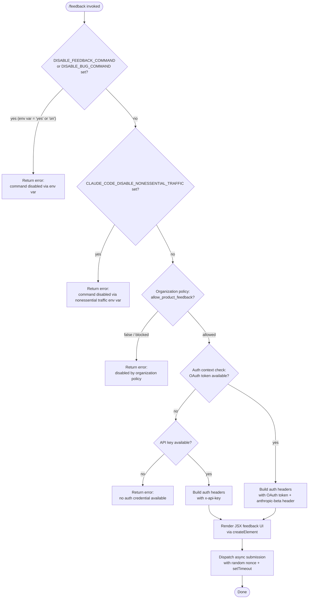

# `/feedback`

> Analysis basis: CC v2.1.132 bundle.js (AST extraction + Claude interpretation)
> Minimum version: v2.1.132

---

## Overview

The `/feedback` command (also aliased as `/bug`) allows users to submit feedback or bug reports about Claude Code. It is a `local-jsx` command that performs several gate checks — environment variable flags, telemetry policy, organizational policy — before constructing a JSX UI element and dispatching the feedback submission via an async handler. If any gate fails, the command returns an early error message rather than proceeding.

---

## Registration

| Field | Value |
|---|---|
| type | `local-jsx` |
| name | `feedback` |
| description | `Submit feedback about Claude Code` |
| argumentHint | `[report]` |
| aliases | `["bug"]` |
| module_id | `ir9` |
| load_inline | `true` |
| handler | `Ie4` (AsyncFunction, resolved via `module_id` path) |
| `loc_byte_end` | `9813694` |
| `arbor_handler.name` | `Ie4` |
| `arbor_handler.kind` | `AsyncFunction` |
| `arbor_handler.resolution_path` | `module_id` |
| `arbor_handler.fqn` | `claude-2.1.132::Ie4` |
| `arbor_handler.n_hits` | `0` |

Analysis basis: CC v2.1.132 bundle.js:+9813486 – +9813694

---

## Input Branching

The handler (`Ie4`) and its downstream utilities perform a cascading series of gate checks before rendering the feedback UI. The flowchart below captures all branching paths identified within depth-2 traversal.



Analysis basis: CC v2.1.132 bundle.js:+9813312 (handler entry), +9797610 (env gate 1), +9797739 (env gate 2), +9797832 (nonessential traffic gate), +9797939 (org policy gate)

---

## Behavioral Spec

### Gate 1 — Environment Variable Disable Checks

The command handler delegates first to the environment-check utility (`IM8`), which reads two distinct environment variables.

```
function checkEnvDisableFlags():
    if env("DISABLE_FEEDBACK_COMMAND") in ["yes", "on"]:
        return Error("/feedback has been disabled via the DISABLE_FEEDBACK_COMMAND environment variable")
    if env("DISABLE_BUG_COMMAND") in ["yes", "on"]:
        return Error("/feedback has been disabled via the DISABLE_BUG_COMMAND environment variable")
    return null
```

The truthiness test compares the environment variable value against the string literals `"yes"` and `"on"` (case-sensitive comparison inferred from literal values).

Analysis basis: CC v2.1.132 bundle.js:+9797610, +9797739, +25237, +25243

---

### Gate 2 — Non-Essential Traffic Policy Check

After the environment gate, a secondary check (`kq` → `h1_`) verifies whether non-essential network traffic has been suppressed. The traffic classification literals `"essential-traffic"`, `"no-telemetry"`, and `"default"` govern this routing.

```
function checkNonessentialTrafficPolicy():
    trafficMode = getCurrentTrafficMode()  // returns "essential-traffic" | "no-telemetry" | "default"
    if trafficMode == "essential-traffic":
        return Error("/feedback has been disabled via the CLAUDE_CODE_DISABLE_NONESSENTIAL_TRAFFIC environment variable")
    return null
```

Analysis basis: CC v2.1.132 bundle.js:+9797832, +910466, +910525, +910599

---

### Gate 3 — Organization Policy Check

The org-policy check (`AL`) inspects an application-state set (`Ft4`) and, if needed, fetches organizational entitlements.  
The policy key `"allow_product_feedback"` must be truthy for the command to proceed. Account tier literals `"enterprise"` and `"team"` are examined during entitlement resolution (`zm` → `j6`).

```
function checkOrgPolicy():
    if Ft4.has(currentContext):
        // cached result available
    else:
        entitlements = resolveEntitlements(accountTier)  // checks "enterprise", "team"
    if not entitlements["allow_product_feedback"]:
        return Error("/feedback has been disabled by your organization's policy")
    return null
```

A telemetry event (`tengu_slate_kestrel`) is fired during the entitlement resolution path within `j6`.

Analysis basis: CC v2.1.132 bundle.js:+9769494, +9797939, +9797971, +9766163, +9766249, +9766284

---

### Gate 4 — Authentication Credential Resolution

The auth-resolution utility (`hP`) wraps two sub-utilities: a credential reader (`R_` → `nY`) and a header builder (`Hj`).

```
function resolveAuthCredential():
    token = readOAuthToken()
    if token is null:
        apiKey = readApiKey()  // checks env "ANTHROPIC_API_KEY"
        if apiKey is null:
            raise Error("ANTHROPIC_API_KEY or CLAUDE_CODE_OAUTH_TOKEN env var is required")
        return buildHeaders(type="api-key", value=apiKey)
            // sets header "x-api-key": apiKey
    return buildHeaders(type="oauth", value=token)
        // sets header "anthropic-beta": <beta-tag>
```

The `apiKeyHelper` config path is also consulted during API key resolution (`co8` branch within `o$`).

Analysis basis: CC v2.1.132 bundle.js:+9798034, +2893213, +2893273, +2893357, +2893420, +2893460, +2868107, +2868201, +2868528

---

### Provider Context Check

During credential and traffic checks, the platform context utility (`yH` → `g_`) detects the active provider. Known provider identifiers checked against: `"bedrock"`, `"foundry"`, `"anthropicAws"`, `"mantle"`, `"vertex"`, `"firstParty"`. The canonical API host `"api.anthropic.com"` is referenced during routing.

```
function detectProvider(config):
    provider = config.provider  // one of: "bedrock", "foundry", "anthropicAws",
                                //         "mantle", "vertex", "firstParty"
    if provider in ["bedrock", "foundry", "anthropicAws", "mantle", "vertex"]:
        // third-party or enterprise routing; may restrict features
    else:
        // default first-party path via api.anthropic.com
    return provider
```

Analysis basis: CC v2.1.132 bundle.js:+1975229, +1975269, +1975319, +1975375, +1975429, +1975477, +1975486, +1976104

---

### JSX UI Rendering

After all gates pass, the render component (`nr9`) is called via `LVA.createElement` to produce the feedback UI element. This is the JSX rendering step that surfaces the form or prompt to the user in the CLI interface.

```
function renderFeedbackUI(props):
    return createElement(FeedbackComponent, props)
```

Analysis basis: CC v2.1.132 bundle.js:+9813182, +9813359

---

### Async Submission Dispatch

The main handler (`Ie4`) invokes a nonce/delay utility (`H`) after rendering. This utility generates a random identifier and introduces a `setTimeout`-based delay before finalizing submission.

```
async function dispatchFeedbackSubmission(payload):
    nonce = Math.floor(Math.random() * 2)   // 2 is the upper bound literal
    await delay(setTimeout, nonce)
    submit(payload)
```

Analysis basis: CC v2.1.132 bundle.js:+9813330, +12264283, +12264285, +12264322

---

## State & Side Effects

| Item | Detail |
|---|---|
| Telemetry | `tengu_slate_kestrel` — fired during organizational entitlement resolution (bundle.js:+9766163) |
| Hook registration | None identified within depth-2 traversal |
| appState changes | Organizational entitlement cache (`Ft4`) may be populated as a side effect of the org-policy gate (bundle.js:+9769494) |
| Auth headers | `x-api-key` or `anthropic-beta` header constructed in memory; not persisted (bundle.js:+2893357, +2893460) |
| Sound | <!-- TODO: not found in depth-2 traversal; needs --depth 4 --> |
| Async delay | `setTimeout` used in submission dispatch; introduces a non-deterministic short delay (bundle.js:+12264322) |

---

## Version History

| Version | Change |
|---|---|
| v2.1.132 | Initial analysis |

---

## Common Mistakes

1. **Forgetting the `/bug` alias**: `/feedback` and `/bug` are registered as the same command. Both invoke identical logic; using either name is equivalent.
2. **Setting `DISABLE_FEEDBACK_COMMAND=1`**: The gate checks only for the values `"yes"` and `"on"` — setting the variable to `"1"`, `"true"`, or any other truthy string will **not** disable the command.
3. **Enterprise/team accounts with restricted policy**: If an organization has set `allow_product_feedback` to false in their policy, the command will silently fail with a policy error rather than any network error — this is not a connectivity issue.
4. **Using non-first-party providers**: Users on `bedrock`, `vertex`, `foundry`, `anthropicAws`, or `mantle` may encounter auth routing differences that affect whether the feedback submission reaches Anthropic's endpoint.
5. **Expecting synchronous completion**: The submission step uses `setTimeout`-based async dispatch; the command may return a success UI state before the underlying HTTP request has completed.

---

## Appendix — Identifier Mapping

> For bundle debugging only. Identifiers change across versions.

| Identifier | Role |
|---|---|
| `nr9` | Feedback JSX render component (called via `LVA.createElement`) |
| `Ie4` | Main async handler for `/feedback` command (entry point, AsyncFunction) |
| `IM8` | Top-level gate orchestrator (env checks, traffic policy, org policy, auth) |
| `yH` | Provider/platform context string normalizer |
| `kq` | Non-essential traffic policy checker |
| `h1_` | Traffic mode reader (returns "essential-traffic" / "no-telemetry" / "default") |
| `AL` | Organizational policy gate (checks `allow_product_feedback`) |
| `Mr9` | Entitlement fetch sub-routine called within org-policy gate |
| `FIA` | Entitlement resolution wrapper (calls `zm` and `Kr9`) |
| `zm` | Core entitlement resolver; dispatches to account-tier and telemetry paths |
| `g_` | Provider detection utility (reads provider string from config) |
| `a3` | <!-- TODO: not found in depth-2 traversal; needs --depth 4 --> |
| `o$` | API credential loader (checks `ANTHROPIC_API_KEY`, `apiKeyHelper`, OAuth) |
| `j6` | Entitlement cache and set manager; fires `tengu_slate_kestrel` telemetry |
| `hP` | Auth header resolution orchestrator |
| `R_` | OAuth token reader |
| `nY` | Low-level credential fetch (reads env vars, calls `o$` for API key) |
| `fU` | Boolean coercion helper for credential presence check |
| `Hj` | Auth header builder (constructs `x-api-key` or `anthropic-beta` headers) |
| `H` | Nonce + async delay utility (`Math.random` + `setTimeout`) |