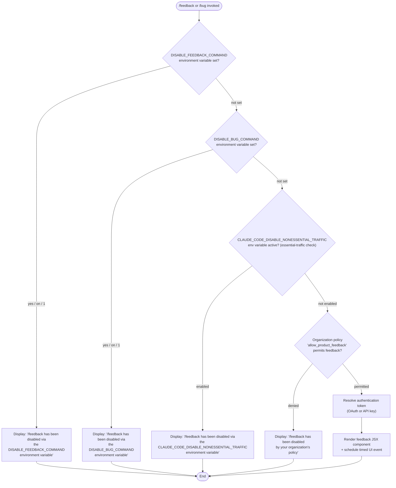

# `/feedback`

> Analysis basis: CC v2.1.133 bundle.js (AST extraction + Claude interpretation)
> Minimum version: v2.1.133

---

## Overview

The `/feedback` command (aliased as `/bug`) allows users to submit feedback or bug reports about Claude Code directly from the CLI. Before opening any feedback submission UI or flow, the command performs a multi-stage gate check — evaluating environment variables, network-traffic policy, and organizational policy — and short-circuits with an informational message if any gate is closed. When all gates pass, the command renders a JSX component and initiates the submission process.

---

## Registration

| Field | Value |
|---|---|
| type | `local-jsx` |
| name | `feedback` |
| description | `Submit feedback about Claude Code` |
| argumentHint | `[report]` |
| aliases | `bug` |
| module_id | `Io9` |

Analysis basis: CC v2.1.133 bundle.js:+9827617

---

## Input Branching

The command evaluates four sequential gate conditions before proceeding to the feedback UI. Each gate may terminate execution early with a descriptive message.



Analysis basis: CC v2.1.133 bundle.js:+9811715, +9811844, +9811937, +9812076

---

## Behavioral Spec

### Gate 1 — `DISABLE_FEEDBACK_COMMAND` Environment Variable Check

```
function checkDisableFeedbackEnvVar():
    value = getEnvironmentVariable("DISABLE_FEEDBACK_COMMAND")
    normalizedValue = String(value).toLowerCase()
    if normalizedValue is in {"yes", "on"} or numeric value equals 1:
        return DisabledResult(
            message = "/feedback has been disabled via the DISABLE_FEEDBACK_COMMAND environment variable"
        )
    return PassResult()
```

The string is coerced via `String()` before comparison against the canonical truthy literals `"yes"` and `"on"`.

Analysis basis: CC v2.1.133 bundle.js:+9811715, +25188, +25237, +25243, +25147

---

### Gate 2 — `DISABLE_BUG_COMMAND` Environment Variable Check

```
function checkDisableBugEnvVar():
    value = getEnvironmentVariable("DISABLE_BUG_COMMAND")
    normalizedValue = String(value).toLowerCase()
    if normalizedValue is in {"yes", "on"} or numeric value equals 1:
        return DisabledResult(
            message = "/feedback has been disabled via the DISABLE_BUG_COMMAND environment variable"
        )
    return PassResult()
```

Because the command is aliased as `/bug`, this gate mirrors the previous one but targets the `DISABLE_BUG_COMMAND` variable. The same truthy-literal set applies.

Analysis basis: CC v2.1.133 bundle.js:+9811844

---

### Gate 3 — Non-Essential Traffic Policy Check

```
function checkNonessentialTrafficPolicy():
    trafficCategory = "essential-traffic"
    if globalTrafficPolicySet.has(trafficCategory):
        return DisabledResult(
            message = "/feedback has been disabled via the CLAUDE_CODE_DISABLE_NONESSENTIAL_TRAFFIC environment variable"
        )
    return PassResult()
```

The implementation queries a policy set (`YH7`) using the string key `"essential-traffic"`. If that key is present in the set, feedback submission is classified as non-essential and is blocked.

Analysis basis: CC v2.1.133 bundle.js:+9811937, +911558, +9783599

---

### Gate 4 — Organizational Policy Check

```
function checkOrganizationPolicy():
    policyKey = "allow_product_feedback"
    allowed = evaluatePolicy(policyKey)
    if not allowed:
        return DisabledResult(
            message = "/feedback has been disabled by your organization's policy"
        )
    return PassResult()
```

The `evaluatePolicy` call consults the active organization policy store for the boolean key `"allow_product_feedback"`. A falsy result blocks the command entirely.

Analysis basis: CC v2.1.133 bundle.js:+9812044, +9812076

---

### Authentication Token Resolution

```
function resolveAuthToken():
    oauthToken = getOAuthToken()
    if oauthToken is null or empty:
        raise AuthError("No OAuth token available")

    apiKey = getApiKey()
    if apiKey is null or empty:
        raise AuthError("No API key available")

    headers = buildHeaders({
        "anthropic-beta": <beta-header-value>,
        "x-api-key":      apiKey
    })
    return AuthContext(oauthToken, headers)
```

The implementation attempts OAuth token retrieval first, then falls back to an API key check. Both must be available; the absence of either raises an authentication error before any network call is made. The `"anthropic-beta"` header is included unconditionally in the outbound request headers.

Analysis basis: CC v2.1.133 bundle.js:+2899032, +2899044, +2899092, +2899176, +2899239, +2899279

---

### JSX Rendering and Timed UI Event

```
function renderFeedbackComponent(authContext):
    element = createElement(FeedbackView, { auth: authContext })

    delay = Math.random() * 2          // random value in [0, 2)
    setTimeout(scheduledUIAction, delay)

    return element
```

Once all gates pass and authentication is resolved, the command renders a JSX element (via `nVA.createElement`). A random delay in the range **[0, 2)** (the literal `2` appears at the call site) is computed using `Math.random()` and passed to `setTimeout`, which schedules a deferred UI action such as focus management or animation triggering.

Analysis basis: CC v2.1.133 bundle.js:+9827313, +12285767, +12285769, +12285806

---

## State & Side Effects

| Item | Detail |
|---|---|
| Telemetry | No `tengu_*` telemetry events were found in the depth-2 traversal for this command. |
| Hook registration | <!-- TODO: not found in depth-2 traversal; needs --depth 4 --> |
| appState changes | <!-- TODO: not found in depth-2 traversal; needs --depth 4 --> |
| Network requests | Outbound HTTP call using OAuth token + API key, with `anthropic-beta` and `x-api-key` headers. Analysis basis: CC v2.1.133 bundle.js:+2899176, +2899279 |
| Sound | <!-- TODO: not found in depth-2 traversal; needs --depth 4 --> |
| Environment reads | `DISABLE_FEEDBACK_COMMAND`, `DISABLE_BUG_COMMAND`, `CLAUDE_CODE_DISABLE_NONESSENTIAL_TRAFFIC` |
| Organization policy reads | `allow_product_feedback` |
| Timed side effect | `setTimeout` with a `Math.random()`-derived delay in [0, 2) ms/s. Analysis basis: CC v2.1.133 bundle.js:+12285806 |

---

## Version History

| Version | Change |
|---|---|
| v2.1.133 | Initial analysis |

---

## Common Mistakes

1. **Setting only `DISABLE_BUG_COMMAND` and expecting `/feedback` to still work.** Both `DISABLE_FEEDBACK_COMMAND` and `DISABLE_BUG_COMMAND` are checked independently; either one blocks the command regardless of how it is invoked.
2. **Expecting the command to work without a valid OAuth token.** The authentication resolution step requires both an OAuth token and an API key. Environments that have only an API key (e.g., raw API access without an OAuth session) will hit the `"No OAuth token available"` error.
3. **Assuming `CLAUDE_CODE_DISABLE_NONESSENTIAL_TRAFFIC` only affects data collection.** This variable also suppresses the `/feedback` command, which may be surprising when the variable is set for privacy reasons.
4. **Assuming the `/bug` alias behaves differently.** `/bug` is a true alias; the implementation is identical and all four gates apply equally.
5. **Expecting the command to respect only one disable mechanism.** All four gate checks are sequential and independent — passing one does not skip the others.

---

## Appendix — Identifier Mapping

> For bundle debugging only. Identifiers change across versions.

| Identifier | Role |
|---|---|
| `Zo9` | Feedback JSX view component (renders the feedback UI element) |
| `oH7` | Top-level command handler (orchestrates gate checks, auth, and rendering) |
| `aM8` | Gate evaluation pipeline (runs all four disable-checks in sequence) |
| `kH` | Environment variable string coercion helper (wraps `String()`) |
| `yq` | Non-essential traffic policy resolver (queries the `essential-traffic` key) |
| `LL` | Policy set membership checker (calls `.has()` on the traffic policy set) |
| `FP` | Authentication token resolver (retrieves OAuth token and API key, builds headers) |
| `H` | Timed UI event scheduler (calls `Math.random()` and `setTimeout`) |