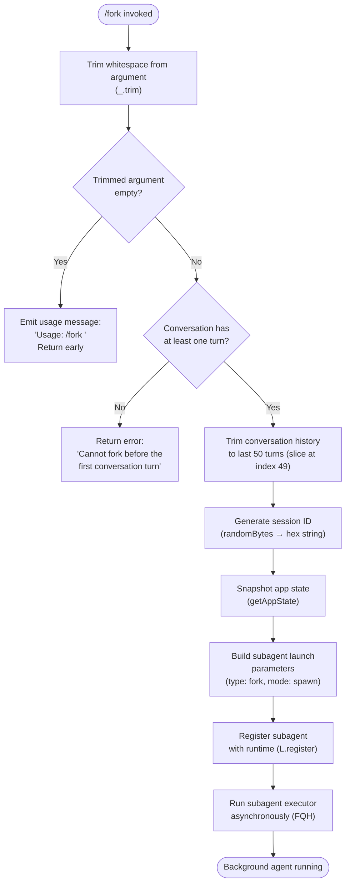

# `/fork`

> Analysis basis: CC v2.1.133 bundle.js (AST extraction + Claude interpretation)
> Minimum version: v2.1.133

---

## Overview

The `/fork` slash command spawns a background subagent that inherits a snapshot of the full current conversation history, then immediately begins executing a user-supplied directive inside that isolated agent context. It operates by deep-copying the current session state, generating a fresh agent identity, registering the agent with the runtime, and launching it asynchronously — leaving the parent conversation unaffected.

---

## Registration

| Field | Value |
|---|---|
| type | `local-jsx` |
| name | `fork` |
| description | `Spawn a background agent that inherits the full conversation` |
| argumentHint | `<directive>` |
| module_id | `xXq` |

Analysis basis: CC v2.1.133 bundle.js:+11716079

---

## Input Branching

The command handler first validates the raw argument string, then branches on the result before handing off to the fork execution pipeline.



Analysis basis: CC v2.1.133 bundle.js:+11715683, +11715707, +11715816, +11713652, +11713665

---

## Behavioral Spec

### Argument Validation

```
function validateForkArgument(rawInput):
    directive = trim(rawInput)
    if directive is empty:
        display("Usage: /fork <directive>")
        return INVALID
    return VALID(directive)
```

If the argument string is absent or contains only whitespace after trimming, the command emits the usage string `"Usage: /fork <directive>"` and performs no further action.

Analysis basis: CC v2.1.133 bundle.js:+11715683, +11715707

---

### Pre-Fork Guard: Conversation Turn Check

```
function checkConversationHasTurns(conversationHistory):
    if conversationHistory has no turns yet:
        emitError("Cannot fork before the first conversation turn")
        return BLOCKED
    return ALLOWED
```

The fork is blocked entirely if the parent conversation has not yet completed at least one exchange. The literal error message is fixed.

Analysis basis: CC v2.1.133 bundle.js:+11715816

---

### Conversation History Snapshot

```
function snapshotHistory(fullHistory):
    // Take up to the last 50 messages; slice boundary is index 49
    sliced = fullHistory.slice(startIndex)   // keeps last 50 entries
    trimmedMessages = trimMessageContent(sliced, maxMessages=24, trimLength=3)
    return sliced
```

The implementation slices the conversation to a maximum window of **50 messages** (slice index 49) before passing it to the fork executor.
Analysis basis: CC v2.1.133 bundle.js:+11713652, +11713665

An internal trim helper (`$07`) additionally trims individual message content, applying a trim depth of **3** and a message limit of **24**.
Analysis basis: CC v2.1.133 bundle.js:+11715374, +11715404, +11715505

---

### Session Identity Generation

```
function generateForkSessionId():
    rawBytes = crypto.randomBytes(8)          // 8 bytes of entropy
    hexId = rawBytes.toString("hex")          // 16-character hex string
    return hexId
```

Each forked agent receives a unique 16-character hexadecimal session identifier derived from 8 cryptographically random bytes.

Analysis basis: CC v2.1.133 bundle.js:+5261396, +5261412, +5261424

A secondary UUID (`dEA.randomUUID`) is also generated for internal message tracking within the subagent session.

Analysis basis: CC v2.1.133 bundle.js:+9057457

---

### App State Snapshot

```
function captureAppState(agentContext):
    state = agentContext.getAppState()
    replContexts = agentContext.getReplContexts()
    toolPermissions = agentContext.getToolPermissionContext()
    return { state, replContexts, toolPermissions }
```

The fork captures the parent session's full application state, REPL contexts, and tool permission context at the moment of invocation. These are passed into the child agent to reproduce the environment.

Analysis basis: CC v2.1.133 bundle.js:+11714949, +11713507, +11713954

---

### Subagent Launch Parameter Construction

```
function buildSubagentLaunchParams(directive, sessionId, stateSnapshot, history):
    params = {
        launchType:   "fork",
        executionMode: "spawn",
        agentKind:    "subagent",
        sessionId:    sessionId,
        directive:    directive,
        historySlice: history,
        appState:     stateSnapshot,
        agentProfile: "local_agent",
        status:       "running",
        category:     "general-purpose",
        hookEvent:    "SubagentStart"
    }

    // Inherit tool permissions from parent
    params.toolPermissions = stateSnapshot.toolPermissions

    // Set permission mode based on parent context
    // Possible values: "bypassPermissions", "acceptEdits", "auto", "bubble"

    return params
```

The `launchType` is the string `"fork"` and the execution mode is `"spawn"`. The agent is categorised as `"local_agent"` with initial status `"running"` and profile `"general-purpose"`.

Analysis basis: CC v2.1.133 bundle.js:+11713467, +11714199, +11714134, +9547089, +9547134, +9547208

---

### Hook Registration and Agent Lifecycle

```
function registerSubagentWithRuntime(params):
    agentRecord = buildAgentRecord(params)
    agentRecord.type = "local_agent"
    agentRecord.status = "running"
    runtime.register(agentRecord)           // L.register

    // Fire SubagentStart hook
    fireHook("SubagentStart", { sessionId: params.sessionId })

    // On completion, fire SubagentStop hook
    onAgentComplete:
        fireHook("SubagentStop", { progress: "hook_progress" })
```

The runtime registration (`L.register`) persists the agent record so it can be monitored and cancelled by the user. Hook events `"SubagentStart"` and `"SubagentStop"` bracket the agent's lifetime.

Analysis basis: CC v2.1.133 bundle.js:+9547400, +9057431, +9061015

---

### Subagent Executor (Background Run Loop)

```
function runSubagentExecutor(agentParams, abortSignal):
    watchdogInterval = 600000   // 10 minutes in ms (600 000 ms / 10 intervals)
    stall_check_ms   = watchdogInterval / 10   // 60 000 ms per tick

    agentState = initialise(agentParams)
    activeToolUses = new Set()

    loop:
        turnResult = await executeOneTurn(agentState)

        if turnResult.type == "tool_use":
            activeToolUses.add(turnResult.id)
            result = await dispatchTool(turnResult)
            activeToolUses.delete(turnResult.id)
            agentState.messages.push(toolResult(result))

        else if turnResult.type == "tool_result":
            // Continue loop

        else if turnResult.stopReason == "max_turns_reached":
            finalise(agentState, reason="max_turns_reached")
            break

        else if turnResult.stopReason == "end_turn":
            finalise(agentState, reason="completed")
            break

        if stall detected (no progress within watchdog window):
            emitTelemetry("tengu_async_agent_stall_timeout")
            abort(agentState, reason="subagent_stall_timeout")
            break

        if abortSignal.cancelled:
            emitTelemetry("tengu_agent_tool_terminated")
            abort(agentState, reason="cancelled")
            break

    reportFinalStatus(agentState)
```

Key limits surfaced in the executor:
- Watchdog timeout period: **600,000 ms** (10 minutes). Analysis basis: CC v2.1.133 bundle.js:+7964495
- Stall log levels cycle through `"none"`, `"unknown"`, `"error"`, `"warn"`, `"info"`. Analysis basis: CC v2.1.133 bundle.js:+7964511, +7964703
- Minimum back-off multiplier: **0.1**. Analysis basis: CC v2.1.133 bundle.js:+7965861
- Maximum subagent progress message timeout: **5,000 ms**. Analysis basis: CC v2.1.133 bundle.js:+9062199
- Transcript tail sent to agent on error: last **80 messages**. Analysis basis: CC v2.1.133 bundle.js:+7967812
- Completion status strings: `"completed"`, `"failed"`, `"cancelled"`, `"killed"`. Analysis basis: CC v2.1.133 bundle.js:+7966751, +7965715, +7967352, +7967626

---

### CLAUDE.md Injection into Forked Context

```
function injectSlimClaudeMd(subagentContext, parentState):
    claudeMdContent = parentState.getCacheBreakerPhrase()
    // Filtered and injected as a "system" role message
    subagentContext.messages.prepend({
        role: "system",
        content: claudeMdContent
    })
    emitTelemetry("tengu_slim_subagent_claudemd")
```

The forked agent receives a trimmed CLAUDE.md injection. The `tengu_slim_subagent_claudemd` event is fired upon successful injection.

Analysis basis: CC v2.1.133 bundle.js:+9055693, +9055760

---

### Prompt Mode Selection

```
function resolvePromptMode(subagentParams):
    match subagentParams.requestedMode:
        case "Explore":  return exploreMode()
        case "Plan":     return planMode()
        default:         return defaultMode()
```

The subagent executor supports at least two named prompt modes (`"Explore"`, `"Plan"`) in addition to a default mode, each resolved at launch time.

Analysis basis: CC v2.1.133 bundle.js:+9055863, +9055888

---

### Async Watchdog and Stall Detection

```
function watchdogLoop(agentId, getLastActivityTimestamp):
    timer = setInterval(checkStall, stall_check_ms)

    function checkStall():
        elapsed = Date.now() - getLastActivityTimestamp()
        if elapsed > watchdog_threshold:
            log("watchdog_stall", level="warn")
            clearTimeout(pendingRetryTimer)
            triggerAbort(agentId, reason="subagent_stall_timeout")
            clearInterval(timer)
```

The watchdog uses `setTimeout`/`clearTimeout` cycling (not a simple `setInterval`) and applies `Math.min` to cap retry delays.

Analysis basis: CC v2.1.133 bundle.js:+7964981, +7965047, +7965084, +7965850

---

### Random Jitter for Agent Startup

```
function computeStartupJitter():
    // Returns a value in [1, 2) to stagger simultaneous fork launches
    jitter = Math.random() * 2 + 1   // random in [1,3) — uses literals 2 and 1
    delay = setTimeout(startAgent, jitter * baseDelay)
    return delay
```

A jitter delay using `Math.random()` scaled between the constants **2** and **1** is applied before an agent starts, preventing thundering-herd on simultaneous forks.

Analysis basis: CC v2.1.133 bundle.js:+12285769, +12285783, +12285806, +12285767

---

### Session Context Isolation

```
function isolateForkedSession(parentState, newSessionId):
    forkedState = deepCopy(parentState)
    forkedState.sessionId = newSessionId
    forkedState.liveMessages = []
    forkedState.shellTasks = []
    forkedState.mcpMonitors = []
    forkedState.sentSkillNames = new Set()
    forkedState.readFileState = {}
    forkedState.promptCacheTracking = {}
    forkedState.replHydrationSnapshot = null
    forkedState.todos = []
    forkedState.transcriptSubdir = derivedSubdir(newSessionId)
    return forkedState
```

The forked context zeroes out all ephemeral runtime fields while preserving conversation history and configuration. Fields explicitly reset include `liveMessages`, `shellTasks`, `mcpMonitors`, `sentSkillNames`, `readFileState`, `promptCacheTracking`, `replHydrationSnapshot`, `todos`, and `transcriptSubdir`.

Analysis basis: CC v2.1.133 bundle.js:+9062528, +9062567, +9062613, +9062663, +9062472, +9062418, +9062802, +9062856, +9062970, +9063020, +9062761

---

### Agent Mode Tagging

The forked subagent is tagged with agent mode strings used elsewhere in the runtime for capability routing:

- `"agent:default"` — standard tool-capable agent profile. Analysis basis: CC v2.1.133 bundle.js:+6427547  
- `"agent:custom"` — custom-profile agent. Analysis basis: CC v2.1.133 bundle.js:+6427592

The `"inherit"` value propagates the parent's model configuration to the child agent rather than resetting it to a default.

Analysis basis: CC v2.1.133 bundle.js:+7842365

---

## State & Side Effects

| Item | Detail |
|---|---|
| Telemetry: `tengu_feature_ok` | Fired on successful subagent completion (Analysis basis: CC v2.1.133 bundle.js:+907381) |
| Telemetry: `tengu_feature_bad` | Fired when the subagent encounters a bad feature condition (Analysis basis: CC v2.1.133 bundle.js:+907437) |
| Telemetry: `tengu_async_agent_stall_timeout` | Fired when the watchdog detects no progress within the 600,000 ms window (Analysis basis: CC v2.1.133 bundle.js:+7965386) |
| Telemetry: `tengu_agent_tool_terminated` | Fired when a running tool is terminated due to agent cancellation (Analysis basis: CC v2.1.133 bundle.js:+7967376) |
| Telemetry: `tengu_slim_subagent_claudemd` | Fired when the trimmed CLAUDE.md is injected into the forked agent context (Analysis basis: CC v2.1.133 bundle.js:+9055760) |
| Hook registration | `L.register` registers the subagent record in the runtime hook registry (Analysis basis: CC v2.1.133 bundle.js:+9547400) |
| Hook events fired | `SubagentStart` on launch; `SubagentStop` on termination (Analysis basis: CC v2.1.133 bundle.js:+9057431, +9061015) |
| appState changes | A new isolated session state is created; parent session state is read-only during fork setup. The parent's `getReplContexts` and `setReplContext` are called to hydrate the child. (Analysis basis: CC v2.1.133 bundle.js:+9062886, +9062935) |
| REPL context | `V6.clearAllTimers()` and `V6.run()` manage the child REPL lifecycle (Analysis basis: CC v2.1.133 bundle.js:+9062915, +9063141) |
| Abort signal propagation | `A.abort()` on the executor's AbortController propagates cancellation to all active tool calls (Analysis basis: CC v2.1.133 bundle.js:+7965500) |
| Sound | <!-- TODO: not found in depth-2 traversal; needs --depth 4 --> |

---

## Version History

| Version | Change |
|---|---|
| v2.1.133 | Initial analysis |

---

## Common Mistakes

1. **Invoking `/fork` with no argument.** The command requires a non-empty `<directive>`. An empty or whitespace-only argument prints the usage string and does nothing — no agent is launched.

2. **Invoking `/fork` before the first conversation turn.** The guard check will block the fork entirely with the error `"Cannot fork before the first conversation turn"`. Send at least one message and receive a reply before forking.

3. **Expecting the fork to share live state with the parent.** The forked agent operates in a completely isolated session. Mutations to the child's state (file edits, shell tasks, todos) do not propagate back to the parent conversation.

4. **Assuming unlimited conversation history is passed to the child.** The fork snapshots at most the last **50 messages** of the parent conversation; older history is not forwarded.

5. **Expecting immediate, synchronous output.** The forked agent runs asynchronously in the background. Its progress and final output appear through the agent monitoring UI, not inline in the parent conversation.

6. **Relying on the child agent running indefinitely.** The built-in watchdog terminates agents that stall for longer than **600,000 ms** (10 minutes) with a `subagent_stall_timeout` result.

---

## Appendix — Identifier Mapping

> For bundle debugging only. Identifiers change across versions.

| Identifier | Role |
|---|---|
| `O07` | Top-level fork command handler (entry point for `/fork`) |
| `CXq` | Fork executor — orchestrates snapshot, identity generation, and agent launch |
| `M07` | App state reader — retrieves current application state for snapshot |
| `uH` | Telemetry/feature reporter utility |
| `U78` | Message role classifier / conversation message builder |
| `$07` | Message content trimmer — trims individual message bodies in history slice |
| `Eu` | Session ID generator — wraps `crypto.randomBytes` to produce hex IDs |
| `OdH` | Subagent runtime registration handler |
| `rf` | Shared async utility (used in both `CXq` and `FQH`) |
| `GOH` | Model/profile configuration builder for the child agent |
| `FU` | Async context runner — wraps `pJ1.run` for async store management |
| `Ij` | Async store accessor — wraps `pJ1.getStore` |
| `GU` | Promise/async utility — wraps `pP` |
| `FQH` | Background subagent run-loop executor (watchdog, tool dispatch, lifecycle) |
| `DC` | Full subagent session constructor — builds isolated state and fires hooks |
| `$8` | UUID generator wrapper — wraps `SG.randomUUID` |
| `L76` | <!-- TODO: not found in depth-2 traversal; needs --depth 4 --> |
| `nBH` | <!-- TODO: not found in depth-2 traversal; needs --depth 4 --> |
| `hH` | Feature flag / telemetry gate utility |
| `_` | Parent session context / app state accessor (ambient reference) |
| `f` | Agent close / cleanup handler |
| `H` | Startup jitter scheduler — uses `Math.random` + `setTimeout` |
| `A` | Conversation message array / tool context reference |