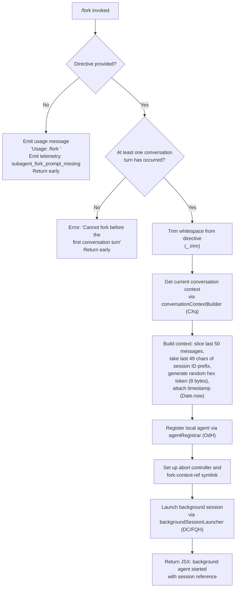

# `/fork`

> Analysis basis: CC v2.1.133 bundle.js (AST extraction + Claude interpretation)
> Minimum version: v2.1.133

---

## Overview

The `/fork` command spawns a background agent that inherits the full conversation history of the current session. It accepts a `<directive>` argument that instructs the forked agent on its specific task, while the child agent operates independently in a new background session that shares the parent's context, working directory, and tool permissions.

---

## Registration

| Field | Value |
|---|---|
| type | `local-jsx` |
| name | `fork` |
| description | `Spawn a background agent that inherits the full conversation` |
| argumentHint | `<directive>` |
| module_id | `xXq` |
| load_inline | `true` |
| loc_byte | `11716079` |
| loc_byte_end | `11716275` |
| loc_line | `7857` |
| arbor_handler.name | `O07` |
| arbor_handler.kind | `AsyncFunction` |
| arbor_handler.resolution_path | `module_id` |
| arbor_handler.fqn | `claude-2.1.133::O07` |
| arbor_handler.n_hits | `0` |

Analysis basis: CC v2.1.133 bundle.js:+11716079

---

## Input Branching

The command has 3 distinct input paths: directive absent, conversation not yet started, and normal fork execution.



---

## Behavioral Spec

### Handler Entry Point — forkCommandHandler (O07)

Analysis basis: CC v2.1.133 bundle.js:+11715683

```
async function forkCommandHandler(args, context):
    directive = trim(args)

    if directive is empty:
        emit telemetry "subagent_fork_prompt_missing"  // loc:+11713418
        return usage message "Usage: /fork <directive>"  // loc:+11715707

    if no conversation turns have occurred yet:
        return error "Cannot fork before the first conversation turn"  // loc:+11715816

    // Build system instruction with "system" role  // loc:+11715747
    // Inject usage hint into message context

    randomToken = generateHex(8 bytes)  // via Eu / randomBytes, loc:+5261396
    timestamp   = Date.now()             // loc:+11713709

    conversationSlice = buildConversationContext(CXq, context)
    agentConfig       = registerLocalAgent(OdH, context)
    backgroundSession = launchBackground(DC/FQH, conversationSlice, directive)

    return JSX rendering background-agent-started UI
```

### Conversation Context Builder — conversationContextBuilder (CXq)

Analysis basis: CC v2.1.133 bundle.js:+11713380

```
function conversationContextBuilder(session, directive):
    // Retrieve full conversation history from REPL context
    replContexts = session.getReplContexts()    // loc:+11713507

    // Slice to at most last 50 messages           // loc:+11713652 (literal 50)
    // Keep last 49 characters of session-ID prefix// loc:+11713665 (literal 49)
    messageSlice = history.slice(-50)

    // Append directive as a "resume" role message // loc:+11713586
    // Inject "fork" tag into context metadata     // loc:+11713467

    systemPrompt = buildSystemPromptForAgent(M07, session)
    toolPermCtx  = session.getToolPermissionContext()  // loc:+11713954

    // Configure spawned agent with:
    //   type: "subagent"                          // loc:+11714134
    //   mode: "spawn"                             // loc:+11714199
    //   asyncStorageContext via asyncLocalStorageRunner (FU/Ij)  // loc:+11714061,+11714089

    return {messageSlice, systemPrompt, toolPermCtx}
```

### System Prompt Assembly — agentSystemPromptBuilder (M07)

Analysis basis: CC v2.1.133 bundle.js:+11714949

```
function agentSystemPromptBuilder(appState, session):
    state        = appState.getAppState()     // loc:+11714949
    messageArray = Array.from(state.messages) // loc:+11715049

    // Build full system prompt via systemPromptComposer (aW)
    // which assembles many sub-sections:
    //   - env info static/simple (LT7, qT7)
    //   - output style / bg-session / worktree directives
    //   - memory load prompt (CP6)
    //   - session guidance (sE7)
    //   - tool result summarization config
    //   - reproduce/verify workflow
    //   - focus, language, scratchpad settings

    // Inject note about absolute paths for agent threads:
    // "Agent threads always have their cwd reset between bash calls…
    //  please only use absolute file paths."   // loc:+12026090

    // Get overall system prompt via AC.getSystemPrompt  // loc:+7843717
    return assembledSystemPrompt
```

### Local Agent Registration — agentRegistrar (OdH)

Analysis basis: CC v2.1.133 bundle.js:+9547042

```
function agentRegistrar(config, session):
    // Create subagent directory structure
    //   mkdir for subagents path            // via ExA / xn.mkdir, loc:+11892232
    //   create symlink "fork-context-ref"   // xn.symlink, loc:+11894374 (literal loc:+11818739)
    //   handle EEXIST gracefully            // loc:+11894410

    // Open agent output file               // tq8 / xn.open, loc:+11894199
    // Register with pending set (Hw8):
    //   $Pq.add(agentId)                   // loc:+11892338
    //   register finally handler to $Pq.delete

    // Register agent as type "local_agent" // loc:+9547089
    // Set initial state "running"           // loc:+9547134
    // Set kind "general-purpose"           // loc:+9547208

    // Register with timestamp tracker (_2):
    //   record Date.now() and agent path    // loc:+11895333,+11895355

    // Register abort controller (Xv):
    //   lC1.setMaxListeners                 // loc:+4170043
    //   bind abort/signal handlers

    // Register with L.register              // loc:+9547400
    return agentHandle
```

### Background Session Launcher — backgroundSessionLauncher (FQH)

Analysis basis: CC v2.1.133 bundle.js:+7964429

```
async function backgroundSessionLauncher(config, messages, directive):
    // Parse and validate config
    //   parseInt timeout: 10 intervals × 600000 ms max  // loc:+7964490, +7964495
    //   initial status "none"                            // loc:+7964511

    // Build initial message queue (Q):
    //   read any queued messages from file (aJ6 / VC.readFile)
    //   clean up temp files (Ce9 / VC.unlink)

    // Dispatch to main query loop (rM6) with:
    //   conversation slice
    //   directive as first user message
    //   session type "bg-session"   // loc:+12020868

    // Monitor agent lifecycle:
    //   subagent_complete telemetry    // loc:+7965623
    //   subagent_stall_timeout         // loc:+7965643 (1000 ms stall check, loc:+7965578)
    //   watchdog_stall detection       // loc:+7964981
    //   user_kill_async handling       // loc:+7967546
    //   subagent_async_errored         // loc:+7967853

    // Emit "subagent_launch" on dispatch  // loc:+11713400

    // On completion:
    //   update task state (Rz6, t1H)
    //   emit task_local_agent or task_local_agent_failed  // loc:+9546874, +9546893
    //   mark completed/Unknown error status               // loc:+9544707, +9544784
```

### Agent Shutdown & Output Handling — subagentExitHandler (SR → Kd4)

Analysis basis: CC v2.1.133 bundle.js:+9033690

```
function subagentExitHandler(result, session):
    // Full query-loop execution for the forked agent (Kd4):
    //   build messages, tool list, system prompt
    //   call model API (Y.callModel)            // loc:+9038527
    //   stream responses, handle tool use
    //   auto-compact if context limit approached
    //   emit subagent_exit telemetry            // loc:+9033749

    // Safety classifier check for sub-agent output
    // If classifier unavailable, emit warning:
    //   "Handoff classifier unavailable, allowing sub-agent
    //    output with warning"                   // loc:+7963561

    // Write output to agent mailbox file (JD6):
    //   SK.mkdir + SK.writeFile (.jsonl)        // loc:+11803309, +11803354
    //   SK.mkdir + SK.writeFile (.meta.json)    // loc:+11803252

    // Flush internal events and delivery acks
    return exitResult
```

---

## State & Side Effects

| Item | Detail |
|---|---|
| Telemetry: subagent_launch | Fired when fork is dispatched (bundle.js:+11713400) |
| Telemetry: subagent_fork_prompt_missing | Fired when no directive is provided (bundle.js:+11713418) |
| Telemetry: subagent_complete | Fired on normal agent completion (bundle.js:+7965623) |
| Telemetry: subagent_stall_timeout | Fired on stall detection after 1000 ms (bundle.js:+7965643) |
| Telemetry: subagent_async_errored | Fired on unhandled error in background agent (bundle.js:+7967853) |
| Telemetry: task_local_agent | Fired on successful task completion update (bundle.js:+9546874) |
| Telemetry: task_local_agent_failed | Fired on task failure (bundle.js:+9546893) |
| Telemetry: tengu_async_agent_stall_timeout | Fired in async stall watchdog (bundle.js:+7965386) |
| Telemetry: tengu_forked_agent_default_turns_exceeded | Fired when forked agent exceeds default turn limit (bundle.js:+5267888) |
| Telemetry: tengu_agent_tool_completed | Fired on individual tool completion in child agent (bundle.js:+7961789) |
| Telemetry: tengu_agent_tool_terminated | Fired when tool is terminated in child agent (bundle.js:+7967376) |
| Telemetry: tengu_auto_mode_decision | Fired during auto-mode classifier evaluation (bundle.js:+7963128) |
| File system: symlink | Creates `fork-context-ref` symlink in subagents directory (bundle.js:+11818739) |
| File system: mkdir | Creates subagent working directory (bundle.js:+11892232) |
| File system: .jsonl/.meta.json | Agent transcript and metadata written at completion (bundle.js:+11803354, +11803252) |
| appState changes | Agent registered in pending set `$Pq`; removed on completion via `finally` handler |
| Abort controller | New `AbortController` created per fork; bound to parent session's signal chain |
| Session type | Background session uses type label `bg-session` (bundle.js:+12020868) |
| Agent kind | Registered as `general-purpose` local agent (bundle.js:+9547208) |
| Initial agent state | Registered as `running` (bundle.js:+9547134) |
| Sound | <!-- TODO: not found in depth-2 traversal; needs --depth 4 --> |

---

## Version History

| Version | Change |
|---|---|
| v2.1.133 | Initial analysis |

---

## Common Mistakes

1. **Omitting the directive**: Running `/fork` with no argument is explicitly rejected with a usage message and a `subagent_fork_prompt_missing` telemetry event. The `<directive>` argument is required.
2. **Forking before any conversation turn**: The command validates that at least one conversation exchange has occurred. Attempting to fork at the very start of a session raises the error "Cannot fork before the first conversation turn" (bundle.js:+11715816).
3. **Assuming the fork is synchronous**: The forked agent runs as a background session. Results are not immediately visible in the current conversation; they are written asynchronously to `.jsonl` transcript files.
4. **Expecting the forked agent to share a mutable state**: The fork inherits a *snapshot* of the conversation (last 50 messages). Subsequent changes in the parent session are not propagated to the child.
5. **Using relative paths in the forked agent's tasks**: The system prompt injected into the child agent explicitly warns that bash calls reset `cwd` between invocations and that only absolute file paths should be used (bundle.js:+12026090).
6. **Expecting context beyond 50 messages**: The conversation slice is capped at the last 50 messages (literal at bundle.js:+11713652); earlier history is not passed to the forked agent.

---

## Appendix — Identifier Mapping

> For bundle debugging only. Identifiers change across versions.

| Identifier | Role |
|---|---|
| `O07` | Main fork command handler (AsyncFunction, Arbor-resolved) |
| `CXq` | Conversation context builder for forked agent |
| `M07` | Agent system prompt assembler |
| `aW` | System prompt section composer (assembles all subsections) |
| `OdH` | Local agent registrar (creates directory, symlink, registers agent) |
| `JZH` | Agent filesystem setup (mkdir, symlink, open output file) |
| `Hw8` | Pending-agent set manager (add/delete from `$Pq`) |
| `ExA` | Subagent directory creator (xn.mkdir wrapper) |
| `L3` | Agent path joiner (WxA.join wrapper) |
| `tq8` | Agent output file opener (xn.open wrapper) |
| `_2` | Agent timestamp tracker (Date.now + L3) |
| `Xv` | Abort controller factory with max-listeners setup |
| `FQH` | Background session launcher and lifecycle manager |
| `DC` | Full background query session runner |
| `SR` | Subagent exit handler orchestrator |
| `Kd4` | Core query loop for forked agent (API calls, tool execution) |
| `rM6` | Query dispatch and streaming coordinator |
| `eE` | Streaming event processor for agent output |
| `Rz6` | Task state updater on agent completion |
| `t1H` | Task-notification state writer |
| `mO` | Agent output flusher (tY8 map, flush, delete) |
| `EIA` | Agent state timestamp updater |
| `IL8` | Subagent end handler (classifier check, output handoff) |
| `kz6` | Auto-mode classifier runner |
| `EL8` | Classifier result processor |
| `VL8` | Task state updater (running→complete) |
| `SOH` | Repl tool call state recorder |
| `mzH` | Tool call state machine |
| `CP6` | Memory/CLAUDE.md prompt loader for child agent |
| `sE7` | Session-guidance section builder |
| `LT7` | Environment-info (static) section builder |
| `qT7` | Environment-info (simple/worktree) section builder |
| `pE7` | Model override section builder |
| `ixA` | Output-style section builder |
| `df6` | Feature-flag section builder |
| `BE7` | Feature-flag wrapper |
| `wT7` | Focus-directive section builder |
| `HT7` | Summarize-tool-results section builder |
| `lE7` | System section builder |
| `nE7` | Doing-tasks section builder |
| `rE7` | Using-tools section builder |
| `tE7` | Tone-and-style section builder |
| `MT7` | Scratchpad section builder |
| `njq` | Memory-disabled telemetry emitter |
| `T5H` | Provider-type (firstParty/anthropicAws) resolver |
| `AC` | Agent memory loader (getSystemPrompt + tengu_agent_memory_loaded) |
| `GOH` | Model alias resolver (default/inherit/sonnet/opus/haiku/best) |
| `Gq` | Model string normalizer (trim, toLowerCase, replace) |
| `mG9` | Model inclusion checker |
| `uG9` | Model alias dispatcher |
| `hG` | Subagents path resolver (ibA.get + O$.join) |
| `Eu` | Random hex token generator (Vt1.randomBytes) |
| `$07` | Session-ID prefix trimmer |
| `U78` | REPL context message formatter |
| `mU4` | Assistant message filter |
| `pU4` | User message filter |
| `uU4` | Tool-use/code message filter |
| `UU4` | Tool-result/error message filter |
| `FU` | AsyncLocalStorage runner (pJ1.run) |
| `Ij` | AsyncLocalStorage store getter (pJ1.getStore) |
| `GU` | Permission-store getter |
| `pP` | Permission-context store reader (Qg8.getStore) |
| `dxA` | Context key builder |
| `N6` | Context value normalizer |
| `Bi9` | Plugin/MCP tool context builder |
| `mA` | Memory accessor (db wrapper) |
| `jG` | Context merge helper |
| `UE7` | Model-version section builder |
| `JT7` | Output-style delegator (→ixA) |
| `QE7` | Language section builder |
| `dE7` | Additional context builder |
| `fT7` | FRC section builder |
| `$T7` | Summarize-tool-results config builder |
| `zT7` | Reproduce-verify-workflow section builder |
| `eE7` | Empty/no-op section |
| `cE7` | Empty/no-op section |
| `Rt1` | Tool-result compressor |
| `iE7` | Output-style delegator (→ixA) |
| `gE7` | Ant-model-override section builder |
| `njq` | Memory-dir disabled notifier |
| `K6` | Full interactive session runner (used by forked agent) |
| `NH` | Session runner alias (shares K6 logic) |
| `IH` | Hook-filtered tool list assembler |
| `hl` | Tool permission context evaluator |
| `DX` | Permission decision emitter (cli/remote modes) |
| `Tz` | Permission propagation helper |
| `nBH` | Background-session notification handler |
| `L76` | Background-session launch config builder |
| `hH` | Debug/verbose logger (d wrapper) |
| `uH` | Info logger (d wrapper) |
| `vH` | String coercer (String wrapper) |
| `kH` | String coercer (String wrapper, alternate site) |
| `fH` | Error logger with stack push |
| `dq` | Conversation-history accessor |
| `$w` | System-prompt accessor |
| `rf` | Resource finalizer |
| `YZH` | Agent state batch updater |
| `kmH` | Message queue batch pusher |
| `mp9` | Multi-agent state coordinator |
| `Rv` | State-update resolver |
| `d` | Base logger / debug emitter |

---

Note: index built via Arbor fallback; some signals (telemetry, literals) may be missing — see arbor-fallback.js.