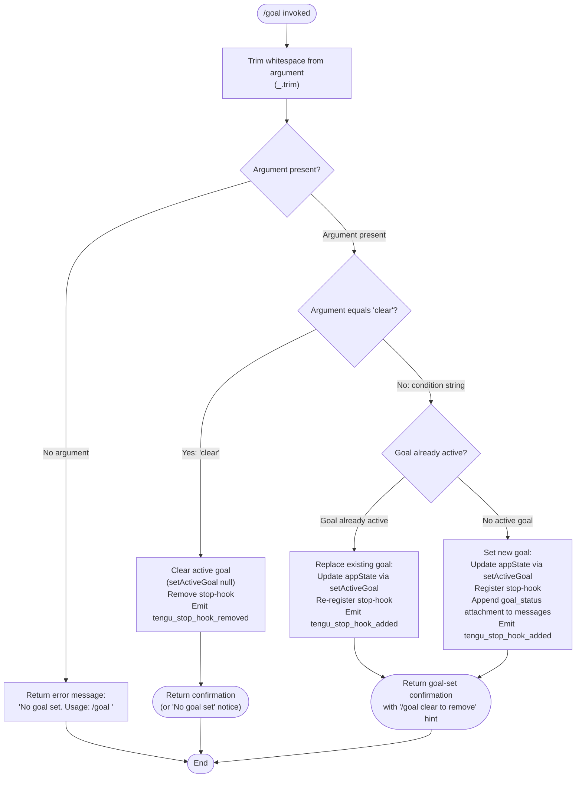

# `/goal`

> Analysis basis: CC v2.1.133 bundle.js (AST extraction + Claude interpretation)
> Minimum version: v2.1.133

---

## Overview

The `/goal` command sets a persistent goal condition that Claude Code will keep working toward until the condition is met. It accepts an arbitrary natural-language condition string or the special keyword `clear` to remove any active goal. When a goal is active, the agent loop is extended with a stop-hook that re-evaluates the condition after each iteration, driving continued work automatically.

---

## Registration

| Field | Value |
|---|---|
| `type` | `local-jsx` |
| `name` | `goal` |
| `description` | `Set a goal — keep working until the condition is met` |
| `argumentHint` | `[<condition> \| clear]` |
| `immediate` | `true` |
| `module_id` | `PJq` |
| `load_inline` | `true` |
| `loc_byte` | `11632048` |
| `loc_byte_end` | `11632268` |
| `loc_line` | `7644` |
| **`arbor_handler.name`** | `Z27` |
| **`arbor_handler.fqn`** | `claude-2.1.133::Z27` |
| **`arbor_handler.kind`** | `AsyncFunction` |
| **`arbor_handler.resolution_path`** | `module_id` |
| **`arbor_handler.n_hits`** | `0` |
| `arbor_handler.name` | `Z27` |
| `arbor_handler.kind` | `AsyncFunction` |
| `arbor_handler.resolution_path` | `module_id` |
| `arbor_handler.fqn` | `claude-2.1.133::Z27` |
| `arbor_handler.n_hits` | `0` |

Analysis basis: CC v2.1.133 bundle.js:+11632048

---

## Input Branching

Four distinct branches are observable from the literals and call graph, so a Mermaid flowchart is used.



Analysis basis: CC v2.1.133 bundle.js:+11630962 (trim), +11631054 (clear literal), +11631094 (no-goal notice), +11630309 (usage error string)

---

## Behavioral Spec

### 1 — Handler Entry: Argument Parsing

The main async handler (`Z27`) immediately trims leading and trailing whitespace from the raw argument string.

```
async function handleGoalCommand(rawArgument):
    trimmedArg = trim(rawArgument)

    if trimmedArg is empty:
        return errorMessage("No goal set. Usage: `/goal <condition>`")

    normalizedArg = trimmedArg.toLowerCase()

    if normalizedArg == "clear":
        return clearGoal(currentAppState)
    else:
        return setGoal(currentAppState, trimmedArg)
```

- Error message when no argument is supplied: `"No goal set. Usage: \`/goal <condition>\`"` — Analysis basis: CC v2.1.133 bundle.js:+11630309
- The `clear` keyword comparison is case-insensitive via `toLowerCase` — Analysis basis: CC v2.1.133 bundle.js:+14181260, +11631054

---

### 2 — Setting a New Goal (`setGoal` / `ziH`)

When a non-empty condition is provided and it is not `"clear"`, the handler registers the goal in application state and installs a persistent stop-hook.

```
async function setGoal(appState, condition):
    currentState = appState.getAppState()

    // Persist goal condition into app state
    appState.setActiveGoal({
        condition: condition,
        status: "not yet evaluated",
        setAt: Date.now()
    })

    // Register stop-hook so agent loop re-checks goal after every iteration
    stopHookHandle = registerStopHook(goalEvaluationHook)
    emit("tengu_stop_hook_added")

    // Append a goal_status attachment to the conversation
    applyMessageOp("append", {
        type: "attachment",
        attachmentKind: "goal_status",
        goalId: generateUUID(),     // via crypto.randomUUID
        goalKind: "goal",
        condition: condition
    })

    return confirmationMessage(condition, hint: "`/goal clear` to remove")
```

- Initial goal evaluation status: `"not yet evaluated"` — Analysis basis: CC v2.1.133 bundle.js:+11630374
- Hint shown to user after goal is set: `` "`/goal clear` to remove" `` — Analysis basis: CC v2.1.133 bundle.js:+11630531
- `setActiveGoal` is called on the app-state accessor — Analysis basis: CC v2.1.133 bundle.js:+11181793
- Timestamp captured via `Date.now()` — Analysis basis: CC v2.1.133 bundle.js:+11181841
- UUID generated for the new goal record — Analysis basis: CC v2.1.133 bundle.js:+11182259
- Attachment kind stored as `"goal_status"` — Analysis basis: CC v2.1.133 bundle.js:+11182328
- Goal type stored as `"goal"` — Analysis basis: CC v2.1.133 bundle.js:+11182202
- Message operation used is `"append"` — Analysis basis: CC v2.1.133 bundle.js:+11182140

---

### 3 — Clearing an Active Goal (`clearGoal` / `DiH`)

When the argument is `"clear"`, the handler tears down the stop-hook and removes the active goal from state.

```
async function clearGoal(appState):
    currentState = appState.getAppState()

    if currentState.activeGoal is null:
        return infoMessage("No goal set")

    // Remove the stop-hook registered during setGoal
    deregisterStopHook(existingHandle)
    emit("tengu_stop_hook_removed")

    // Clear goal from app state
    appState.setActiveGoal(null)

    // Inject a "Stop" system prompt segment to signal termination
    injectSystemSegment("Stop")

    return confirmationMessage("Goal cleared")
```

- `"No goal set"` message when clear is invoked with no active goal — Analysis basis: CC v2.1.133 bundle.js:+11631094
- `"Stop"` string injected as a system-level prompt segment — Analysis basis: CC v2.1.133 bundle.js:+11181486
- Telemetry event `tengu_stop_hook_removed` emitted — Analysis basis: CC v2.1.133 bundle.js:+11182171

---

### 4 — Stop-Hook Lifecycle (`K` / file-tracking internals)

The stop-hook mechanism uses a tracked-set pattern to ensure only one hook is active per goal session.

```
function registerStopHook(hookFn):
    handle = openHookHandle()
    activeHookSet.add(handle)
    hookFn.finally(() => {
        activeHookSet.delete(handle)
    })
    return handle

function deregisterStopHook(handle):
    handle.close()
    underlyingQueue.close()
    cleanupTempFile()        // Ydq.unlinkSync
```

- Hook set uses `.add` / `.delete` operations — Analysis basis: CC v2.1.133 bundle.js:+14161309, +14161332
- Underlying file descriptor closed via `.close()` on both the handle and its queue — Analysis basis: CC v2.1.133 bundle.js:+14167103, +14167113
- Temporary file removed via `unlinkSync` on deregistration — Analysis basis: CC v2.1.133 bundle.js:+14137065
- A `.finally()` cleanup is chained to guarantee removal from the active set — Analysis basis: CC v2.1.133 bundle.js:+14161318

---

### 5 — Relative-Time Formatting (`tHH`)

The goal-status display uses a human-readable relative-time formatter. The formatter converts a millisecond duration to the most appropriate unit, caching locale-aware `Intl.RelativeTimeFormat` instances.

```
function formatRelativeTime(fromDate, toDate):
    diffMs = toDate.getTime() - fromDate.getTime()
    diffSec = Math.trunc(Math.abs(diffMs) / 1000)   // 1000 ms/s

    thresholds = [
        ("year",   31536000),
        ("month",   2592000),
        ("week",     604800),
        ("day",       86400),
        ("hour",       3600),
        ("minute",       60),
        ("second",        1)
    ]

    for (unit, seconds) in thresholds:
        if diffSec >= seconds:
            value = Math.trunc(diffSec / seconds)
            formatter = getOrCreateFormatter("en", "long")   // cached in KiA
            return formatter.format(sign * value, unit)

    // Sub-second fallback
    if diffMs >= 0:
        return "0s ago"
    else:
        return "in 0s"
```

- Milliseconds-per-second divisor: `1000` — Analysis basis: CC v2.1.133 bundle.js:+167629
- Year threshold: `31536000` seconds — Analysis basis: CC v2.1.133 bundle.js:+167659
- Month threshold: `2592000` seconds — Analysis basis: CC v2.1.133 bundle.js:+167705
- Week threshold: `604800` seconds — Analysis basis: CC v2.1.133 bundle.js:+167750
- Day threshold: `86400` seconds — Analysis basis: CC v2.1.133 bundle.js:+167792
- Hour threshold: `3600` seconds — Analysis basis: CC v2.1.133 bundle.js:+167834
- Minute threshold: `60` seconds — Analysis basis: CC v2.1.133 bundle.js:+167877
- Locale hardcoded to `"en"` — Analysis basis: CC v2.1.133 bundle.js:+164619
- Format style: `"long"` — Analysis basis: CC v2.1.133 bundle.js:+168096
- Zero-positive fallback: `"0s ago"` — Analysis basis: CC v2.1.133 bundle.js:+168146
- Zero-negative fallback: `"in 0s"` — Analysis basis: CC v2.1.133 bundle.js:+168155
- Formatter instances cached in a `Map` (`KiA.get` / `KiA.set`) — Analysis basis: CC v2.1.133 bundle.js:+164572, +164645

---

### 6 — Iteration Counter Display (`I27`)

A secondary helper constructs the per-iteration display label for the goal status attachment.

```
function buildIterationLabel(state):
    count = getIterationCount(state)     // d8
    elapsed = getElapsedTime(state)      // cN → tHH
    return formatLabel("iteration", count, elapsed)
```

- Label uses the literal string `"iteration"` — Analysis basis: CC v2.1.133 bundle.js:+11630429
- Column display uses `padEnd(40, "  ")` for fixed-width layout — Analysis basis: CC v2.1.133 bundle.js:+14181334, +14179342

---

### 7 — Jitter Utility (`H`)

A small jitter function is reachable from the handler; it generates a random delay in a narrow range for retry or polling cadence.

```
function jitter():
    randomFraction = Math.random()    // [0, 1)
    base = 2
    scale = 1
    delayMs = base + scale * randomFraction
    return setTimeout(resolve, delayMs)
```

- Uses `Math.random()` seeded at runtime — Analysis basis: CC v2.1.133 bundle.js:+12285769
- Constants `2` and `1` anchor the range — Analysis basis: CC v2.1.133 bundle.js:+12285767, +12285783
- Executed via `setTimeout` — Analysis basis: CC v2.1.133 bundle.js:+12285806

---

### 8 — Post-Clear Hook Confirmation (`T27`)

After the goal is cleared, a final call to `T27` is made. Its full internals are not resolved at depth-2 traversal depth.

<!-- TODO: T27 internals not found in depth-2 traversal; needs --depth 4 -->

---

## State & Side Effects

| Item | Detail |
|---|---|
| **Telemetry: `tengu_stop_hook_added`** | Emitted whenever a new goal stop-hook is registered (both new-goal and replace-goal paths). Analysis basis: +11181856 |
| **Telemetry: `tengu_stop_hook_removed`** | Emitted when the stop-hook is deregistered, either via `/goal clear` or on goal completion. Analysis basis: +11182171 |
| **Telemetry: `tengu_feature_ok`** | Emitted on successful feature execution via `hH`. Analysis basis: +907381 |
| **`appState.setActiveGoal`** | Written on both the set and clear paths; set to `null` on clear. Analysis basis: +11181793, +11182093 |
| **`appState.applyMessageOp`** | An `"append"` operation adds a `"goal_status"` attachment to the conversation message list when a goal is set. Analysis basis: +11182117, +11182140 |
| **Stop-hook registration** | A persistent hook is added to a tracked set (`activeHookSet`) on goal set and removed (with `.finally()` cleanup) on goal clear or completion. Analysis basis: +14161309, +14161332 |
| **Temporary file** | A temp file is created to back the stop-hook handle and removed via `unlinkSync` on deregistration. Analysis basis: +14137065 |
| **System prompt injection** | The string `"Stop"` is injected as a system-level prompt segment when clearing a goal. Analysis basis: +11181486 |
| **UUID allocation** | `crypto.randomUUID()` allocates a new goal ID on each `/goal <condition>` invocation. Analysis basis: +11182259 |
| **Sound** | No sound-related literals or call edges found in depth-2 traversal. |

---

## Version History

| Version | Change |
|---|---|
| v2.1.133 | Initial analysis |

---

## Common Mistakes

1. **Invoking `/goal` with no argument** — The handler immediately returns a usage error (`"No goal set. Usage: \`/goal <condition>\`"`); no state is changed. Always supply either a condition string or `clear`.

2. **Using `/goal clear` when no goal is active** — The handler detects the absence of an active goal and returns `"No goal set"` without error, but no hook removal or state mutation occurs. This is safe but a no-op.

3. **Assuming the goal completes synchronously** — The `immediate: true` flag means the command is dispatched immediately in the UI, but goal evaluation happens asynchronously via the stop-hook on each agent iteration. The condition is initially marked `"not yet evaluated"`.

4. **Setting a new goal while one is already active** — The handler replaces the existing goal rather than queuing it. The old stop-hook is deregistered and a new one registered. There is no goal stack; only one active goal exists at a time.

5. **Case sensitivity of `clear`** — The argument is lowercased before comparison, so `/goal Clear`, `/goal CLEAR`, etc. all work, but be aware that a condition string that happens to be `"clear"` (in any casing) will be interpreted as the clear command.

6. **Expecting a locale-localised relative-time display** — The relative-time formatter is hardcoded to the `"en"` locale regardless of system locale settings. Analysis basis: CC v2.1.133 bundle.js:+164619

---

## Appendix — Identifier Mapping

> For bundle debugging only. Identifiers change across versions.

| Identifier | Role |
|---|---|
| `Z27` | Main async handler for the `/goal` command (Arbor-resolved entry point) |
| `I27` | Iteration-label builder; formats count + elapsed time for goal-status display |
| `DiH` | Clear-goal helper; deregisters stop-hook and nulls active goal state |
| `ziH` | Set-goal helper; registers stop-hook and writes active goal to app state |
| `tHH` | Relative-time formatter; converts millisecond delta to human-readable string |
| `zE8` | `Intl.RelativeTimeFormat` instance cache (get/set against a `Map`) |
| `cOH` | App-state mutation helper invoked within the clear path |
| `kN9` | Array-mapping utility used during stop-hook set operations |
| `mz7` | UUID-generation wrapper around `crypto.randomUUID` |
| `hH` | Feature-OK confirmation helper; emits `tengu_feature_ok` |
| `T27` | Post-clear confirmation step (internals unresolved at depth-2) |
| `d8` | Iteration-count accessor called by the iteration-label builder |
| `cN` | Elapsed-time accessor feeding into `tHH` |
| `v6` | Shared utility called from both set-goal and clear-goal paths |
| `Tz8` | State-writer helper used within both `DiH` and `ziH` |
| `K` | Stop-hook lifecycle manager (add / finally / delete on the active set) |
| `H` | Jitter utility (`Math.random` + `setTimeout`) |
| `_` | Shared utility (toLowerCase path; also trim target) |
| `f` | File-handle / queue abstraction; `.close()` called on deregistration |
| `q` | Underlying queue object paired with `f`; `unlinkSync` path |
| `L` | Column-layout helper; `padEnd` + `map` for fixed-width status display |
| `A` | App-state accessor object (`getAppState` / `setActiveGoal`) |
| `d` | Shared low-level utility (called from multiple helpers) |

---

Note: index built via Arbor fallback; some signals (telemetry, literals) may be missing — see arbor-fallback.js.