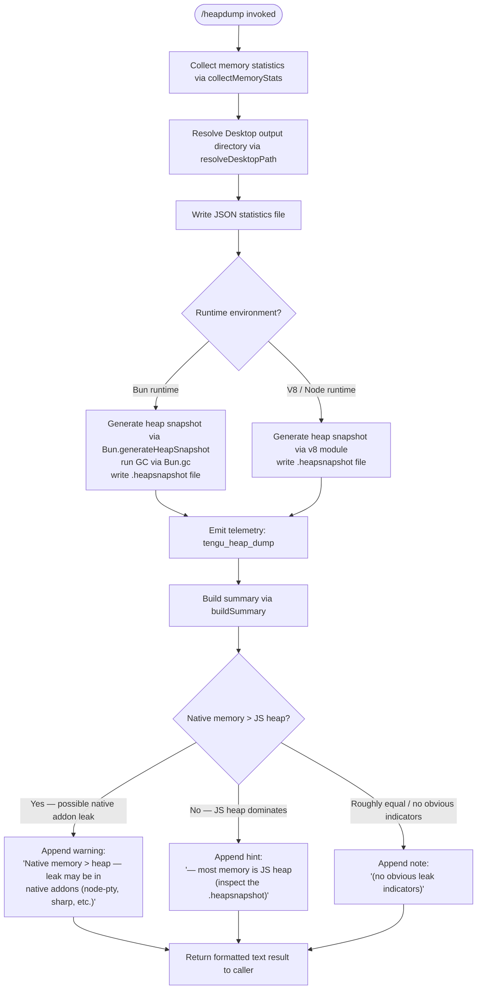

# `/heapdump`

> Analysis basis: CC v2.1.133 bundle.js (AST extraction + Claude interpretation)
> Minimum version: v2.1.133

---

## Overview

The `/heapdump` command is a hidden diagnostic slash command that captures a full JavaScript heap snapshot and a rich memory-statistics report, then writes both to the user's Desktop directory. It is intended for developer/maintainer use only and supports non-interactive (headless) invocation. On completion it emits a human-readable summary describing which memory region (JS heap vs. native) dominates and whether any obvious leak indicators were detected.

---

## Registration

| Field | Value |
|---|---|
| `type` | `local` |
| `name` | `heapdump` |
| `description` | `"Dump the JS heap to ~/Desktop"` |
| `supportsNonInteractive` | `true` |
| `isHidden` | `true` |
| `module_id` | `D$q` |
| `load_inline` | `true` |
| `loc_byte` | `11280031` |
| `loc_byte_end` | `11280194` |
| `loc_line` | `7085` |
| `arbor_handler.name` | `fY7` |
| `arbor_handler.fqn` | `claude-2.1.133::fY7` |
| `arbor_handler.kind` | `AsyncFunction` |
| `arbor_handler.resolution_path` | `module_id` |
| `arbor_handler.n_hits` | `0` |

Analysis basis: CC v2.1.133 bundle.js:+11280031

---

## Input Branching

The command itself takes no user-supplied arguments; branching is driven entirely by runtime state (platform detection, memory ratios, and Bun vs. V8 runtime). Four distinct paths exist in the implementation.



Analysis basis: CC v2.1.133 bundle.js:+11278900 (handler entry `fY7`), +11277643 (statistics collection), +11278182 (snapshot writer), +11279019 (summary builder)

---

## Behavioral Spec

### 1. Top-level Handler (`fY7`)

The Arbor-resolved handler is `fY7` (AsyncFunction, resolved via `module_id` → `D$q`).

```
async function heapdumpHandler(context):
    statsReport  = await collectAndWriteStats(context)
    summaryLines = buildSummary(statsReport)
    summaryLines.push(
        "Open the .heapsnapshot in Chrome DevTools → Memory → Load to inspect retainers."
    )
    return { type: "text", content: summaryLines.join("\n") }
```

Analysis basis: CC v2.1.133 bundle.js:+11278900, +11279046, +11279168

---

### 2. Memory Statistics Collector (`collectMemoryStats` / `LY7`)

Gathers all memory metrics in a single async pass. Uses Linux-specific `/proc` paths when available and falls back gracefully.

```
async function collectMemoryStats():
    stats = {}

    // Node/Bun built-in metrics
    stats.memoryUsage      = process.memoryUsage()
    stats.heapStatistics   = v8module.getHeapStatistics()         // Qz8 = v8 module
    stats.resourceUsage    = process.resourceUsage()
    stats.uptime           = process.uptime()
    stats.heapSpaceStats   = v8module.getHeapSpaceStatistics()

    // Active handles / requests (internal Node diagnostics)
    stats.activeHandles    = process._getActiveHandles().length
    stats.activeRequests   = process._getActiveRequests().length

    // Linux /proc entries (best-effort)
    try:
        fdEntries          = await fs.readdir("/proc/self/fd")     // loc_byte 11275375/11275387
        stats.openFdCount  = fdEntries.length
    catch: stats.openFdCount = null

    try:
        smaps              = await fs.readFile(                    // loc_byte 11275437/11275450
                                 "/proc/self/smaps_rollup", "utf8")
        stats.smapsRollup  = parseSmaps(smaps)
    catch: stats.smapsRollup = null

    // bun:jsc module (available only under Bun runtime)          // loc_byte 11275535
    try:
        jscStats           = require("bun:jsc").getHeapStatistics()
        stats.jscHeap      = jscStats
    catch: stats.jscHeap = null

    // Compute native memory delta
    // Scale: 1 048 576 bytes per MiB (loc_byte 11275681)
    // Time window cap: 3 600 seconds (loc_byte 11275676)
    stats.nativeDeltaMiB   = computeNativeDelta(stats)

    // Leak heuristic threshold: 100 MiB above heap (loc_byte 11275828)
    if stats.nativeDeltaMiB > 100:
        stats.leakWarning  =
            "Native memory > heap - leak may be in native addons (node-pty, sharp, etc.)"
                                                                    // loc_byte 11275914

    return stats
```

Analysis basis: CC v2.1.133 bundle.js:+11277643 (call to `LY7`), +11275144–11275729 (body of `LY7`)

---

### 3. Desktop Path Resolver (`resolveDesktopPath` / `Rq_`)

Determines the correct Desktop folder across platforms.

```
function resolveDesktopPath(platform):
    homeDir = os.homedir()                               // ky8.homedir — loc_byte 955370

    if platform == "windows":                            // loc_byte 955434
        // WSL path: /mnt/c/Users/<username>/Desktop   // loc_byte 955638
        // Skips: Public, Default, "Default User",
        //        "All Users"                           // loc_byte 955682–955746
        return deriveWindowsDesktop(homeDir)

    // macOS / Linux default
    return path.join(homeDir, "Desktop")                 // loc_byte 955406/955416
```

Analysis basis: CC v2.1.133 bundle.js:+11277939 (call to `Rq_`), +955363–955855 (body of `Rq_`)

---

### 4. Stats File Writer (`collectAndWriteStats` / `O$q`)

Orchestrates stat collection, path resolution, and writing both output files.

```
async function collectAndWriteStats(context):
    stats      = await collectMemoryStats()              // LY7
    desktopDir = resolveDesktopPath(platform)            // Rq_
    outputDir  = path.join(desktopDir, ...)              // KRA.join — loc_byte 11278048

    // Write JSON stats report (permissions mode 0o600 = 384 decimal)
    // loc_byte 11278091, mode value loc_byte 11278126
    await fs.writeFile(outputPath, toJSON(stats), { mode: 384 })

    emitTelemetry("tengu_heap_dump")                     // loc_byte 11278233

    // Generate heap snapshot
    await writeHeapSnapshot(outputDir)                   // KY7

    return stats
```

Analysis basis: CC v2.1.133 bundle.js:+11277643–11278415 (body of `O$q`)

---

### 5. Heap Snapshot Writer (`writeHeapSnapshot` / `KY7`)

Branches on runtime identity to invoke the appropriate snapshot API.

```
async function writeHeapSnapshot(outputDir):
    if runtime == "bun":
        // Bun path                                     // loc_byte 11278600
        snapshot = Bun.generateHeapSnapshot()
        Bun.gc(true)                                    // force GC — loc_byte 11278657
        fs.writeFileSync(snapshotPath, snapshot)        // $$q.writeFileSync — loc_byte 11278580

    else:
        // V8/Node path — format: "v8", encoding: "arraybuffer"
        // loc_byte 11278625 / 11278630
        v8.writeHeapSnapshot(snapshotPath)

    // Heap memory auto-threshold label: "auto-1.5GB"   // loc_byte 11278299
```

Analysis basis: CC v2.1.133 bundle.js:+11278182 (call to `KY7`), +11278580–11278657 (body of `KY7`)

---

### 6. Summary Builder (`buildSummary` / `MY7`)

Produces the human-readable output returned to the user.

```
function buildSummary(stats):
    lines = []
    jsHeapMiB    = stats.memoryUsage.heapUsed / 1_073_741_824  // 1 GiB constant — loc_byte 11279949
    nativeMiB    = stats.nativeDeltaMiB

    // Columns formatted with Math.max padding (loc_byte 11279275)
    // Column width: 8 characters (loc_byte 11279675)

    if nativeMiB > jsHeapMiB:
        lines.push("— most memory is native (NOT in the .heapsnapshot)")
                                                         // loc_byte 11279403
    else:
        lines.push("— most memory is JS heap (inspect the .heapsnapshot)")
                                                         // loc_byte 11279343

    if not stats.leakWarning:
        lines.push("  (no obvious leak indicators)")     // loc_byte 11279540

    // GiH appended — platform label "macos" or "darwin" (loc_byte 11276768 / 11277187)
    // Fallback: "No obvious leak indicators. Check heap snapshot for retained objects."
    //           (loc_byte 11277033)

    return lines
```

Analysis basis: CC v2.1.133 bundle.js:+11279019 (call to `MY7`), +11279275–11279587 (body of `MY7`)

---

## State & Side Effects

| Item | Detail |
|---|---|
| Telemetry | `tengu_heap_dump` (loc_byte 11278233) — fired once per invocation after stats file is written. All other `tengu_bg_*` events in the traversal originate from shared background-dispatch infrastructure, not from `/heapdump` itself. |
| File I/O — stats JSON | Written to `~/Desktop/<name>.json` with Unix permission mode `0o600` (decimal 384, loc_byte 11278126) |
| File I/O — heap snapshot | Written to `~/Desktop/<name>.heapsnapshot` via `Bun.generateHeapSnapshot` (Bun) or `v8.writeHeapSnapshot` (Node) |
| GC side effect | Under Bun runtime, `Bun.gc(true)` is called immediately after snapshot generation (loc_byte 11278657), forcing a full garbage collection |
| `/proc` reads | Attempts `readdir("/proc/self/fd")` and `readFile("/proc/self/smaps_rollup")` on Linux; errors are silently swallowed (loc_byte 11275375, 11275450) |
| `appState` changes | <!-- TODO: not found in depth-2 traversal; needs --depth 4 --> |
| Sound | None observed |
| Hook registration | None observed |

---

## Version History

| Version | Change |
|---|---|
| v2.1.133 | Initial analysis |

---

## Common Mistakes

1. **Expecting output in the current working directory.** The command always writes to `~/Desktop` (or the WSL equivalent), never to the project directory. If the Desktop directory does not exist on a headless Linux system the write will fail with `ENOENT`.

2. **Running on a system without a Desktop folder.** CI environments and Docker containers typically lack `~/Desktop`. Create the directory manually before invoking the command, or the stats file and snapshot will not be produced.

3. **Inspecting the `.heapsnapshot` with a text editor.** The heap snapshot is a large JSON graph format intended for Chrome DevTools (Memory tab → Load Profile). Opening it as text is rarely useful; the command's own summary output is the first place to look for actionable information.

4. **Confusing native-memory warnings with JS leaks.** The heuristic threshold of 100 MiB (loc_byte 11275828) only flags when native allocations exceed the JS heap by that margin. The warning text explicitly names the likely culprits (`node-pty`, `sharp`, etc.) — the `.heapsnapshot` itself will **not** contain native allocations.

5. **Calling the command in an environment where Bun APIs are unavailable and expecting Bun output.** Under a standard Node.js runtime the `Bun.generateHeapSnapshot` / `Bun.gc` path is skipped entirely; the V8 code path is used instead and the snapshot format differs slightly.

6. **Assuming the command is visible in `/help`.** The registration sets `isHidden: true`, so the command does not appear in user-facing help listings and must be typed in full.

---

## Appendix — Identifier Mapping

> For bundle debugging only. Identifiers change across versions.

| Identifier | Role |
|---|---|
| `fY7` | Top-level heapdump handler (AsyncFunction; Arbor-resolved entry point) |
| `O$q` | Stats-collection + file-write orchestrator (`collectAndWriteStats`) |
| `LY7` | Memory statistics gatherer (`collectMemoryStats`) |
| `KY7` | Heap snapshot writer (`writeHeapSnapshot`; calls `Bun.generateHeapSnapshot` or V8) |
| `MY7` | Human-readable summary builder (`buildSummary`) |
| `Rq_` | Desktop path resolver (`resolveDesktopPath`; handles macOS/Linux/WSL) |
| `v6` | Shared utility — likely path/string helper (called from `O$q` and `LY7`) |
| `a6` | Shared utility — called from `LY7` and `Rq_`; role unclear at depth-2 |
| `G` | Shared formatting/rendering helper (called from `LY7`) |
| `AJ6` | Sub-utility called by `G` |
| `jP8` | Sub-utility called by `G` and `P` |
| `P` | Connection/transport layer (called from `LY7`; involves `Promise.all`) |
| `fH` | Error-logging helper (called from `P`, `O$q`, `Rq_`, and `w`) |
| `HA` | Error constructor wrapper (called from `P` and `O$q`) |
| `j` | IPC/stream object (buffer concat, index-of, off, setTimeout, subarray operations) |
| `X` | Buffer/stream accumulator (used by `j`) |
| `w` | Background session dispatcher (spawns processes, manages memory, kills sessions) |
| `ff` | Stream finalizer called from `j` |
| `md7` | Terminal/session multiplexer message handler |
| `vH` | String converter utility |
| `k` | Telemetry dispatch / log-level router (emits `"debug"` level) |
| `Ztq` | Sub-router called by `k` |
| `xcA` | Sub-utility called by `Ztq` |
| `H` | General-purpose collection / set-like object (also calls `Math.random`, `setTimeout`) |
| `SH` | JSON serializer wrapper (`JSON.stringify`) |
| `A` | Accumulator array used by `fY7` for summary lines |
| `Uf` | String sanitizer / redactor (inserts `"[REDACTED]"` tokens) |
| `rnA` | Sub-utility called by `Uf` (maps over token list) |
| `_` | Lodash-style utility (get, set, values, lastIndexOf, slice, toLowerCase) |
| `LkH` | File-write helper |
| `UnA` | Low-level stream writer called by `LkH` |
| `vtq` | Rotating/append log-file writer |
| `uNH` | Buffered async writer (uses `setImmediate`, `setTimeout`, join queues) |
| `aHH` | Log-line formatter |
| `F6` | Path or format utility (called from `vtq`, `Rq_`, `O$q`) |
| `dG8` | Date/time formatter |
| `_iA` | Path joiner utility |
| `AiA` | File rotation handler (stat, rename, unlink) |
| `Vtq` | Log-file append/rotate handler |
| `y1` | Active-set tracker (add/delete/assign) |
| `L` | Column-padding formatter (map + `padEnd`) |
| `K` | File-descriptor lifecycle manager (add, delete, finally) |
| `q` | Temp-file cleaner (unlinkSync on close) |
| `f` | Async file handle (close, finally) |
| `d` | Generic disposal/cleanup helper |
| `GiH` | Platform label emitter (appended to summary by `MY7`) |

---

Note: index built via Arbor fallback; some signals (telemetry, literals) may be missing — see arbor-fallback.js.