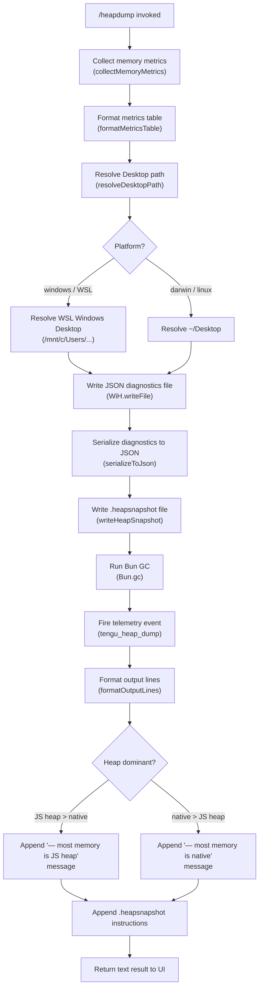

# `/heapdump`

> Analysis basis: CC v2.1.133 bundle.js (AST extraction + Claude interpretation)
> Minimum version: v2.1.133

---

## Overview

The `/heapdump` command is a hidden diagnostic slash command that captures a comprehensive snapshot of the Claude Code process's memory state and writes the output to the user's Desktop directory. It collects Node/Bun runtime memory metrics, generates a V8 heap snapshot file, performs a diagnostic analysis of memory composition, and returns a formatted text report with actionable guidance. The command is designed for internal debugging of potential memory leaks and performance regressions.

---

## Registration

| Field | Value |
|---|---|
| type | `local` |
| name | `heapdump` |
| description | `Dump the JS heap to ~/Desktop` |
| supportsNonInteractive | `true` |
| isHidden | `true` |
| module_id | `D$q` |

Analysis basis: CC v2.1.133 bundle.js:+11280031

---

## Input Branching

The command's top-level handler (the command entry point, `fY7`) delegates immediately to the core execution function (`O$q`). The core function branches across several sub-phases: metrics collection, platform-aware Desktop path resolution, file writing, and result formatting. The output formatter (`MY7`) branches on whether the dominant memory type is JS heap or native.



Analysis basis: CC v2.1.133 bundle.js:+11278900, +11277643, +11279019, +11279343, +11279403

---

## Behavioral Spec

### Phase 1 — Memory Metrics Collection (`collectMemoryMetrics`)

```
async function collectMemoryMetrics():
    memUsage     = process.memoryUsage()           # RSS, heapTotal, heapUsed, external, arrayBuffers
    heapStats    = v8.getHeapStatistics()           # V8 heap breakdown
    resourceUsage = process.resourceUsage()         # CPU time, maxRSS, etc.
    uptimeSec    = process.uptime()                 # seconds since process start
    heapSpaces   = v8.getHeapSpaceStatistics()      # per-space breakdown

    # Linux-only: open file descriptor count
    if /proc/self/fd is readable:
        fdList    = await fs.readdir("/proc/self/fd")
        fdCount   = fdList.length

    # Linux-only: native/smaps memory
    if /proc/self/smaps_rollup is readable:
        smapsText = await fs.readFile("/proc/self/smaps_rollup", "utf8")
        # parse Rss, Pss, etc. from smapsText

    activeHandles   = process._getActiveHandles().length
    activeRequests  = process._getActiveRequests().length

    # Convert raw bytes to MiB for display
    # Conversion divisor: 1 048 576 bytes per MiB
    heapUsedMiB  = memUsage.heapUsed  / 1048576
    rssMiB       = memUsage.rss       / 1048576

    # Uptime formatted in hours
    # Divisor: 3600 seconds per hour, displayed with 1 decimal place
    uptimeHours  = (uptimeSec / 3600).toFixed(1)

    # Leak heuristic: native memory > JS heap
    nativeMiB    = rssMiB - heapUsedMiB
    if nativeMiB > heapUsedMiB:
        leakWarning = "Native memory > heap - leak may be in native addons (node-pty, sharp, etc.)"

    # Heap-space saturation heuristic
    for each space in heapSpaces:
        usedRatio = space.space_used_size / space.space_size * 100
        if usedRatio > 500:                        # threshold: 500 %
            flag space as anomalous

    return metrics record
```

Analysis basis: CC v2.1.133 bundle.js:+11275144, +11275168, +11275194, +11275220, +11275245, +11275287, +11275324, +11275375, +11275437, +11275476, +11275681, +11275676, +11275828, +11275914, +11276047, +11276069

**Key numeric constants**

| Constant | Purpose | Source byte |
|---|---|---|
| `1 048 576` | Bytes-to-MiB divisor | bundle.js:+11275681 |
| `3 600` | Seconds-to-hours divisor | bundle.js:+11275676 |
| `100` | Percentage multiplier for heap-space ratio | bundle.js:+11275828 |
| `500` | Anomalous heap-space saturation threshold (%) | bundle.js:+11276069 |
| `1` | Decimal places passed to `toFixed` for MiB values | bundle.js:+11276047 |

**Leak hint string**: `"Native memory > heap - leak may be in native addons (node-pty, sharp, etc.)"` (bundle.js:+11275914)

**No-leak fallback string**: `"No obvious leak indicators. Check heap snapshot for retained objects."` (bundle.js:+11277033)

---

### Phase 2 — Platform-Aware Desktop Path Resolution (`resolveDesktopPath`)

```
function resolveDesktopPath():
    home = os.homedir()

    platform = detectPlatform()    # returns "darwin", "linux", "windows", or "macos"

    if platform == "windows":
        # WSL path: scan /mnt/c/Users for the first non-system profile
        excluded = ["Public", "Default", "Default User", "All Users"]
        candidates = listDir("/mnt/c/Users")
        userDir = first candidate not in excluded
        desktopPath = join("/mnt/c/Users", userDir, "Desktop")
    else:
        # macOS / Linux
        desktopPath = join(home, "Desktop")

    return desktopPath
```

Analysis basis: CC v2.1.133 bundle.js:+955363, +955370, +955406, +955416, +955434, +955638, +955682, +955701, +955721, +955746

**Platform label constants**

| Literal | Purpose | Source byte |
|---|---|---|
| `"Desktop"` | Subdirectory appended to home | bundle.js:+955416 |
| `"windows"` | Platform identifier for WSL branch | bundle.js:+955434 |
| `"/mnt/c/Users"` | WSL Windows user root | bundle.js:+955638 |
| `"Public"` | Excluded Windows profile | bundle.js:+955682 |
| `"Default"` | Excluded Windows profile | bundle.js:+955701 |
| `"Default User"` | Excluded Windows profile | bundle.js:+955721 |
| `"All Users"` | Excluded Windows profile | bundle.js:+955746 |
| `"macos"` | Platform label (internal) | bundle.js:+11276768 |
| `"darwin"` | `process.platform` string for macOS | bundle.js:+11277187 |

---

### Phase 3 — Diagnostics JSON File Write (`writeDiagnosticsJson`)

```
function writeDiagnosticsJson(desktopPath, metrics):
    # Serialize the full metrics record, including:
    #   - version metadata (package name, version, build timestamp, commit hash)
    #   - process uptime
    #   - memoryUsage fields
    #   - heapStatistics fields
    #   - heapSpaceStatistics array
    #   - resourceUsage fields
    #   - active handle / request counts
    #   - smaps data (Linux only)
    #   - fd count (Linux only)
    #   - leak heuristic flags

    jsonPayload = JSON.stringify(metrics)           # via serializeToJson helper

    filename = buildFilename(desktopPath)           # timestamp-based filename
    await fs.writeFile(filename, jsonPayload, "utf8")
```

**Embedded version constants written into the JSON payload**

| Literal | Purpose | Source byte |
|---|---|---|
| `"@anthropic-ai/claude-code"` | Package name field | bundle.js:+11277335 |
| `"2.1.133"` | Version field | bundle.js:+11277425 |
| `"https://code.claude.com/docs/en/overview"` | Docs URL field | bundle.js:+11277374 |
| `"https://github.com/anthropics/claude-code/issues"` | Issues URL field | bundle.js:+11277452 |
| `"2026-05-07T18:26:46Z"` | Build timestamp | bundle.js:+11277514 |
| `"cba57ffec4f5d5c279b5f66ea9d7a2544fa410ec"` | Commit hash | bundle.js:+11277545 |
| `"report the issue at https://github.com/anthropics/claude-code/issues"` | Support note | bundle.js:+11277252 |

Analysis basis: CC v2.1.133 bundle.js:+11278091, +11277939, +11278048

**Metrics table column padding**: two-space separator (`"  "`) used between label and value columns.
Analysis basis: CC v2.1.133 bundle.js:+14179363

---

### Phase 4 — Heap Snapshot Generation (`writeHeapSnapshot`)

```
function writeHeapSnapshot(desktopPath):
    # Generate snapshot via Bun JSC API
    snapshot = Bun.generateHeapSnapshot("v8", "arraybuffer")

    # Write raw binary arraybuffer to disk synchronously
    fs.writeFileSync(join(desktopPath, snapshotFilename), snapshot)

    # Trigger a full garbage-collection cycle after capture
    Bun.gc(true)
```

Analysis basis: CC v2.1.133 bundle.js:+11278580, +11278600, +11278657

**Heap snapshot format constants**

| Literal | Purpose | Source byte |
|---|---|---|
| `"v8"` | Snapshot format passed to `Bun.generateHeapSnapshot` | bundle.js:+11278625 |
| `"arraybuffer"` | Output encoding passed to `Bun.generateHeapSnapshot` | bundle.js:+11278630 |

The snapshot file format is compatible with Chrome DevTools Memory panel (`.heapsnapshot`).

---

### Phase 5 — Telemetry Emission (`emitTelemetry`)

```
function emitTelemetry(metrics):
    fire event "tengu_heap_dump" with:
        trigger  = "manual"       # literal
        exitCode = 0              # literal; indicates success
```

Analysis basis: CC v2.1.133 bundle.js:+11278233, +11277619, +11277630

---

### Phase 6 — Output Formatting (`formatOutputLines`)

```
function formatOutputLines(metrics, desktopPath, snapshotPath):
    lines = []

    # Build the metrics table header and rows
    # Column widths computed via Math.max across all row labels (padEnd alignment)
    for each metric row:
        lines.push(label.padEnd(maxLabelWidth, " ") + "  " + value)

    # Memory composition annotation
    # Threshold: 1 073 741 824 bytes (1 GiB) used as scale reference
    if jsHeapBytes > nativeBytes:
        lines.push("— most memory is JS heap (inspect the .heapsnapshot)")
    else:
        lines.push("— most memory is native (NOT in the .heapsnapshot)")

    # Leak indicator line
    if noLeakIndicators:
        lines.push("  (no obvious leak indicators)")

    # DevTools guidance (always appended)
    lines.push(
        "Open the .heapsnapshot in Chrome DevTools → Memory → Load to inspect retainers."
    )

    # Label column width computed per table using Math.max, step 8
    # (alignment constant: 8)

    return lines.join("\n")
```

Analysis basis: CC v2.1.133 bundle.js:+11279019, +11279046, +11279168, +11279275, +11279343, +11279403, +11279540, +11279675, +11279949, +11279056

**Output string literals**

| Literal | Purpose | Source byte |
|---|---|---|
| `"— most memory is JS heap (inspect the .heapsnapshot)"` | JS-heap-dominant annotation | bundle.js:+11279343 |
| `"— most memory is native (NOT in the .heapsnapshot)"` | Native-dominant annotation | bundle.js:+11279403 |
| `"  (no obvious leak indicators)"` | Clean-bill note | bundle.js:+11279540 |
| `"Open the .heapsnapshot in Chrome DevTools → Memory → Load to inspect retainers."` | DevTools guidance | bundle.js:+11279056 |
| `"auto-1.5GB"` | V8 heap-size limit label (included in metrics table) | bundle.js:+11278299 |
| `1 073 741 824` | 1 GiB reference constant used in output logic | bundle.js:+11279949 |
| `8` | Column alignment step size | bundle.js:+11279675 |

**Return type**: `"text"` — the command returns a plain-text message, not a React/JSX component.
Analysis basis: CC v2.1.133 bundle.js:+11278932

---

### Error Handling (`handleError`)

```
function handleError(err):
    # Wrap raw errors into a normalized error object
    normalized = Error(String(err))

    # Push error into the shared error display channel (cyH)
    # Log via yQ.logError at level "error"
    logError("error", normalized)

    # Surface error string to the caller for display in the CLI output
    return normalized
```

Analysis basis: CC v2.1.133 bundle.js:+11278402, +11278415, +912461, +912821, +912861

---

### Log-Level / Debug Output (`logLine`)

The implementation calls a general-purpose log-line helper (`v6`) at multiple points.
Log level `"debug"` is used for internal trace output.
Analysis basis: CC v2.1.133 bundle.js:+11277643, +11276190, +162555

---

### Metrics Table Formatting Detail (`formatMetricsTable`)

```
function formatMetricsTable(rows):
    # rows: array of [label, value] pairs
    maxWidth = Math.max(...rows.map(r => r[0].length))
    # Align to next multiple of 8
    alignedWidth = Math.ceil(maxWidth / 8) * 8

    return rows.map(([label, value]):
        paddedLabel = label.padEnd(alignedWidth, " ")
        return paddedLabel + "  " + value
    ).join("\n")
```

Analysis basis: CC v2.1.133 bundle.js:+14179329, +14179342, +11279275, +11279675

---

## State & Side Effects

| Item | Detail |
|---|---|
| Telemetry | `tengu_heap_dump` fired once per invocation (bundle.js:+11278233) |
| Files written | One JSON diagnostics file and one `.heapsnapshot` binary file, both on `~/Desktop` (or WSL Windows Desktop) |
| Bun GC | `Bun.gc(true)` is called synchronously after heap snapshot generation (bundle.js:+11278657) |
| Hook registration | <!-- TODO: not found in depth-2 traversal; needs --depth 4 --> |
| appState changes | <!-- TODO: not found in depth-2 traversal; needs --depth 4 --> |
| Sound | <!-- TODO: not found in depth-2 traversal; needs --depth 4 --> |
| Error channel | Errors are pushed into the shared error display array and logged via `yQ.logError` (bundle.js:+912821, +912861) |
| Active handles/requests | Counted via `process._getActiveHandles()` and `process._getActiveRequests()` — read-only, no mutation (bundle.js:+11275287, +11275324) |
| Return type | `"text"` plain-text response (bundle.js:+11278932) |

---

## Version History

| Version | Change |
|---|---|
| v2.1.133 | Initial analysis; command confirmed present, hidden, and non-interactive-capable |

---

## Common Mistakes

1. **Running on a platform without a Desktop directory**: On headless Linux servers `~/Desktop` typically does not exist. The command will fail to write files. Create the directory manually (`mkdir -p ~/Desktop`) before invoking `/heapdump`.
2. **Expecting output in the working directory**: Both the `.heapsnapshot` and the JSON diagnostics file are always written to the Desktop path, never to the current working directory or the project root.
3. **Ignoring the native-vs-heap annotation**: When the output reads `"— most memory is native (NOT in the .heapsnapshot)"`, opening the `.heapsnapshot` in Chrome DevTools will not show the dominant allocation. Investigate native addons (e.g., `node-pty`, `sharp`) instead.
4. **Not running on Bun**: Heap snapshot generation calls `Bun.generateHeapSnapshot`. Running Claude Code under plain Node.js will cause this phase to throw.
5. **Misreading the JSON diagnostics file as the heap snapshot**: The JSON file contains numeric metrics and metadata; the `.heapsnapshot` file is the binary V8 snapshot. Only the `.heapsnapshot` can be loaded into Chrome DevTools → Memory.
6. **WSL path resolution edge cases**: On WSL, the command scans `/mnt/c/Users` and skips `Public`, `Default`, `Default User`, and `All Users`. If the Windows user profile name matches one of these (unlikely but possible for `Default`-prefixed names), path resolution may pick the wrong directory.

---

## Appendix — Identifier Mapping

> For bundle debugging only. Identifiers change across versions.

| Identifier | Role |
|---|---|
| `fY7` | Command entry-point function; orchestrates output assembly and delegates to `O$q` |
| `O$q` | Core execution function; coordinates all phases (metrics → path → write → telemetry → format) |
| `v6` | General-purpose log-line / debug output helper |
| `LY7` | Memory metrics collection function (`collectMemoryMetrics`) |
| `k` | Log-level / debug-output routing helper (uses `"debug"` level) |
| `L` | Metrics table formatting function (`formatMetricsTable`; uses `padEnd`) |
| `Rq_` | Desktop path resolution function (`resolveDesktopPath`) |
| `F6` | Path join / filesystem utility helper |
| `SH` | JSON serialization helper (wraps `JSON.stringify`) |
| `KY7` | Heap snapshot write function (`writeHeapSnapshot`; calls `Bun.generateHeapSnapshot`, `Bun.gc`) |
| `d` | <!-- TODO: not found in depth-2 traversal; needs --depth 4 --> (called from `O$q` at bundle.js:+11278231) |
| `HA` | Error normalization helper (wraps `Error(String(raw))`) |
| `fH` | Error dispatch / surface helper; pushes to error channel and calls `yQ.logError` |
| `MY7` | Output line formatting function (`formatOutputLines`; uses `Math.max`, `GiH`) |
| `GiH` | Sub-helper called within output formatting (role: <!-- TODO: not found in depth-2 traversal; needs --depth 4 -->) |
| `A` | Output lines accumulator array (used via `A.push` and `A.join`) |