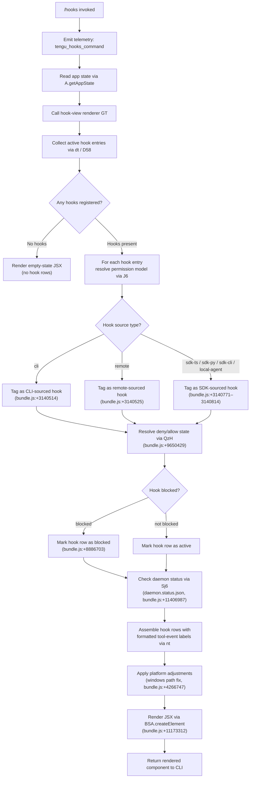

# `/hooks`

> Analysis basis: CC v2.1.133 bundle.js (AST extraction + Claude interpretation)
> Minimum version: v2.1.133

---

## Overview

The `/hooks` command provides an in-session read-only view of all hook configurations currently active for tool events. It reads application state, assembles a structured representation of each registered hook, and renders the result as a JSX component directly in the CLI interface. No hook mutation is performed by this command — it is a diagnostic and inspection tool.

---

## Registration

| Field | Value |
|---|---|
| `type` | `local-jsx` |
| `name` | `hooks` |
| `description` | `View hook configurations for tool events` |
| `immediate` | `true` |
| `module_id` | `DMq` |
| `load_inline` | `true` |
| `loc_byte` | `11173437` |
| `loc_byte_end` | `11173587` |
| `loc_line` | `6963` |
| `arbor_handler.name` | `Cz7` |
| `arbor_handler.fqn` | `claude-2.1.133::Cz7` |
| `arbor_handler.kind` | `AsyncFunction` |
| `arbor_handler.resolution_path` | `module_id` |
| `arbor_handler.n_hits` | `0` |

Analysis basis: CC v2.1.133 bundle.js:+11173437

**Notes on registration shape:**

- `type: "local-jsx"` — the handler returns a JSX element rendered inline in the terminal UI, not a plain text response.
- `immediate: true` — the command executes without requiring any additional user confirmation step.
- `load_inline: true` — the handler (`Cz7`) is inlined via a `Promise.resolve({call: Cz7})` shape rather than a separate dynamic import. The `arbor_handler.resolution_path` value `module_id` confirms Arbor reached `Cz7` by following the `module_id` (`DMq`) → module exports → name lookup chain.
- The registration block spans bytes `11173437`–`11173587` (150 bytes).

---

## Input Branching

The `/hooks` command accepts no user-supplied arguments. Its branching logic is entirely internal — driven by the shape of the hook registry read from application state. Five or more structurally distinct paths are present in the call graph (hooks present vs. absent, per-hook type resolution, permission-model variants, daemon-status checks), so a Mermaid flowchart is the appropriate representation.



Analysis basis: CC v2.1.133 bundle.js:+11173208–11173312

---

## Behavioral Spec

### 1. Command Entry and Telemetry Emission

The handler `Cz7` (AsyncFunction) is the sole entry point, resolved via `module_id` → `DMq`.

```
async function hooksCommandHandler(context):
    emitTelemetry("tengu_hooks_command")          // bundle.js:+11173210
    appState = context.getAppState()              // bundle.js:+11173242
    hookView = renderHookView(appState)           // bundle.js:+11173282
    return createElement(hookView)               // bundle.js:+11173312
```

Analysis basis: CC v2.1.133 bundle.js:+11173208

---

### 2. Hook View Renderer (`GT`)

`GT` is the main JSX-producing orchestrator. It calls a set of sub-functions to collect, classify, and render each hook.

```
function renderHookView(appState):
    rawHookList  = collectHookEntries(appState)         // dt, bundle.js:+8887345
    permissions  = resolvePermissionContext(appState)   // eGA, bundle.js:+8887369
    hookRows     = buildHookRows(appState)              // nt, bundle.js:+8887468

    // Gate: feature flag check
    if featureFlag("hooks").isEnabled():                 // Q9.isEnabled, bundle.js:+8887536
        filteredRows = hookRows.filter(
            row => !blockedSet.has(row.id)              // WxH.has, bundle.js:+8887627
        )
    else:
        filteredRows = hookRows

    mappedRows = filteredRows.map(row =>
        renderHookRow(row, permissions)                 // bundle.js:+8887655
    )

    // Secondary feature flag for alternate rendering path
    if altFlag.isEnabled():                             // O.isEnabled, bundle.js:+8887666
        return renderAltLayout(mappedRows)
    else:
        return renderDefaultLayout(mappedRows)          // bundle.js:+8887708
```

Analysis basis: CC v2.1.133 bundle.js:+8887274

---

### 3. Hook Entry Collection (`dt` + `D58`)

Collects all currently registered hook entries from application state, filtering and normalising them.

```
function collectHookEntries(appState):
    // Filter raw hook list; remove entries that fail predicate
    filtered = appState.hookList.filter(entry =>
        hookEntryFilter(entry)                          // D58, bundle.js:+8886657
    )

    for entry in filtered:
        // Resolve deny-mode entries
        denyEntries = resolveDenyEntries(entry)         // QzH, bundle.js:+9650352
        // Resolve allow-mode entries
        allowEntries = resolveAllowEntries(entry)       // oIA, bundle.js:+9650675

    return normalised(filtered)
```

The `"deny"` string literal (bundle.js:+9650429) distinguishes deny-mode hooks from allow-mode hooks during this phase. The `"cliArg"` literal (bundle.js:+9650999) marks hooks that originated from command-line arguments rather than configuration files.

Analysis basis: CC v2.1.133 bundle.js:+8886642

---

### 4. Permission Context Resolution (`eGA` + `ox` + `A_`)

Determines the permission scope for each hook entry, taking into account platform and session origin.

```
function resolvePermissionContext(appState):
    // Platform-specific path normalisation
    if platform == "windows":                           // bundle.js:+4266747
        hookPaths = normalisePaths(hookPaths)           // ox, bundle.js:+4266740

    permissionMap = buildPermissionMap(appState)        // J6, bundle.js:+4266838
    emitTelemetry("tengu_cobalt_ridge")                 // bundle.js:+4266841

    // Module initialisation bookkeeping
    initModule()                                        // A_, bundle.js:+8887231
    return permissionMap
```

The `A_` function handles ESModule interop setup (the `"__esModule"` literal at bundle.js:+1507 is consistent with this pattern) and registers a cleanup handler via `R06.bind` (bundle.js:+1630).

Analysis basis: CC v2.1.133 bundle.js:+8887201

---

### 5. Permission Map Builder (`J6` + `_d6` + `R6`)

Constructs the per-hook permission map, classifying hooks by source and checking for deduplication.

```
function buildPermissionMap(appState):
    permissionMap = {}

    for hookEntry in appState.hooks:
        source = determineSource(hookEntry)             // Po, bundle.js:+3091371
        if source == "cli":                             // bundle.js:+3140514
            type = "cli"
        else if source == "remote":                     // bundle.js:+3140525
            type = "remote"
        else:
            type = detectSdkType(source)               // one of sdk-ts/sdk-py/sdk-cli/local-agent

        // Deduplication check
        if not seenSet.has(hookEntry.id):               // b5H.has, bundle.js:+3091388
            resolvedEntry = resolveHookEntry(hookEntry) // _d6, bundle.js:+3091399
            seenSet.add(hookEntry.id)                   // pq6.add, bundle.js:+3091411

        // Cache lookup
        if hookCache.has(hookEntry.key):                // cU.has, bundle.js:+3091425
            cached = hookCache.get(hookEntry.key)       // cU.get, bundle.js:+3091442
            permissionMap[hookEntry.key] = cached
        else:
            record = createPermissionRecord(            // R6, bundle.js:+3091462
                hookEntry,
                timestamp = Date.now()                  // bundle.js:+3110190
            )
            permissionMap[hookEntry.key] = record

        emitTelemetry("tengu_slate_harbor")             // bundle.js:+3140544

    return permissionMap
```

Analysis basis: CC v2.1.133 bundle.js:+3091299

---

### 6. Hook Entry Deduplication (`_d6`)

Prevents duplicate hook entries from appearing in the rendered list.

```
function resolveHookEntry(entry):
    if processedSet.has(entry.id):                      // Ut8.has, bundle.js:+3089099
        existing = entryCache.get(entry.id)             // b5H.get, bundle.js:+3089123
        return existing
    else:
        processedSet.add(entry.id)                      // Ut8.add, bundle.js:+3089139
        primary   = buildPrimaryRecord(entry)           // pt8, bundle.js:+3089150
        secondary = buildSecondaryRecord(entry)         // ct8, bundle.js:+3089224
        return merge(primary, secondary)
```

Analysis basis: CC v2.1.133 bundle.js:+3089099

---

### 7. Hook Row Builder (`nt`)

Iterates over resolved hook entries and constructs displayable rows, including label formatting, blocked-state annotation, and agent-team flags.

```
function buildHookRows(appState):
    rows = []

    for entry in resolvedPermissionMap:
        label = formatLabel(entry)                      // Tz, bundle.js:+8886056
        shellCommand = resolveShellCommand(entry)       // vX, bundle.js:+8886160

        // Agent-team hooks (--agent-teams flag)
        if entry.hasAgentTeamFlag:                      // "--agent-teams", bundle.js:+3064954
            agentRow = buildAgentRow(entry)             // i1, bundle.js:+8886368
            emitTelemetry("tengu_amber_flint")          // bundle.js:+3065066
            rows.append(agentRow)

        // Blocked hooks
        if entry.status == "blocked":                   // bundle.js:+8886703
            blockedRow = buildBlockedRow(entry)         // GcH, bundle.js:+8886308
            rows.append(blockedRow)

        // Standard rows: three rendering variants
        standardRow = buildStandardRow(entry)           // Og4 / Mg4 / $g4
        rows.append(standardRow)

        // Permission/environment context row
        envRow = buildEnvRow(entry, permissionContext)  // eGA, bundle.js:+8886531
        rows.append(envRow)

        // Model/runtime context
        modelRow = buildModelRow(entry)                 // fm, bundle.js:+8886599
        rows.append(modelRow)

    return rows
```

The three standard row builders (`Og4`, `Mg4`, `$g4`) differ in rendering variant — each calls `A_` for module setup and a distinct layout helper (`TU9`, `AU9`, `MU9`) before constructing the row.

Analysis basis: CC v2.1.133 bundle.js:+8886040

---

### 8. Model/Runtime Row Builder (`fm` + `IZA`)

Determines the model provider tier and formats the corresponding context row.

```
function buildModelRow(entry):
    tier = resolveModelTier(entry)                      // IZA, bundle.js:+9372816

    // Tier classification literals (bundle.js:+9372338–9372467):
    // "standard" → standard tier
    // "tst"      → test tier (cap: 100, bundle.js:+9372430)
    // "tst-auto" → automatic test tier

    if tier == "debug":                                 // bundle.js:+162555
        row = buildDebugRow(entry)
    else:
        row = buildNormalRow(tier, entry)

    // Provider classification (bundle.js:+1980750–1980967):
    // "bedrock", "foundry", "anthropicAws", "mantle", "vertex", "firstParty"
    provider = resolveProvider(entry)                   // Q_, bundle.js:+9373008

    if provider == "vertex":
        // ToolSearch disabled on Vertex AI unless override set
        // "[ToolSearch:optimistic] disabled: Vertex AI..." (bundle.js:+9373352)
        disableToolSearch(row)

    return finaliseRow(row, provider)                   // o3, bundle.js:+9373030
```

Analysis basis: CC v2.1.133 bundle.js:+9372816

---

### 9. Daemon Status Check (`Sj6`)

During hook view assembly, the renderer queries the daemon status file to determine whether background-session hooks should be shown with an active or inactive indicator.

```
function checkDaemonStatus():
    statusPath = pathJoin(baseDir, "daemon.status.json")  // bundle.js:+11406987
    statusData = readStatusFile(statusPath)               // n8, bundle.js:+11406982

    if statusData.state == "stopped":                     // bundle.js:+14191200
        return { active: false, label: "background session" }
                                                          // bundle.js:+14191243
    return { active: true }
```

Analysis basis: CC v2.1.133 bundle.js:+11406973

---

### 10. Session / File Tracking (`$` → `XDq` → `iY`)

The call graph shows that the hooks display path reaches file-write utilities (`iY`) via the session-tracking subsystem (`XDq`). This is consistent with the hooks view writing or refreshing a session state snapshot, not with user-facing hook mutation.

```
function updateSessionSnapshot(sessionId):
    timestamp = Date.now()                              // bundle.js:+11407099
    randomSuffix = randomBytes(4).toString("hex")       // bundle.js:+2867033
    tmpPath = buildTmpPath(randomSuffix)

    writeFile(tmpPath, payload, "utf8")                 // bundle.js:+2867079
    rename(tmpPath, finalPath)                          // bundle.js:+2867105

    // Integrity checks
    if checksumSet.has(finalPath):                      // o41.has, bundle.js:+2867156
        copyFile(backup, finalPath)                     // bundle.js:+2867178
    if orphanSet.has(finalPath):                        // a41.has, bundle.js:+2867207
        unlink(finalPath)                               // bundle.js:+2867232
```

The use of `randomBytes(4)` (4 bytes → 8 hex chars) for temporary file naming reduces collision probability during concurrent writes.

Analysis basis: CC v2.1.133 bundle.js:+11407084

---

## State & Side Effects

| Item | Detail |
|---|---|
| Telemetry — `tengu_hooks_command` | Emitted once on command entry (bundle.js:+11173210) |
| Telemetry — `tengu_slate_harbor` | Emitted per hook entry during permission-map construction (bundle.js:+3140544) |
| Telemetry — `tengu_cobalt_ridge` | Emitted during permission context resolution (bundle.js:+4266841) |
| Telemetry — `tengu_amber_flint` | Emitted for hook entries that carry the `--agent-teams` flag (bundle.js:+3065066) |
| App state read | `A.getAppState()` is called read-only; no mutations to the hook registry are performed (bundle.js:+11173242) |
| Session snapshot write | `iY` may write/rename a session state file as a side effect of the display path (bundle.js:+2867052–2867105) |
| Daemon status file read | `daemon.status.json` is read from disk to determine background-session hook status (bundle.js:+11406987) |
| Feature flags checked | `Q9.isEnabled` and `O.isEnabled` gate filtering and alternate layout paths (bundle.js:+8887536, +8887666) |
| Blocked-hook set | `WxH` (a `Set`) is consulted to filter rows marked blocked; not mutated (bundle.js:+8887627) |
| Hook deduplication sets | `Ut8` and `b5H` track processed entries to prevent duplicate rows; populated as a side effect of rendering (bundle.js:+3089099–3089139) |
| Sound | <!-- TODO: not found in depth-2 traversal; needs --depth 4 --> |
| Platform path normalisation | Windows-specific path normalisation applied when `platform == "windows"` (bundle.js:+4266747) |

---

## Version History

| Version | Change |
|---|---|
| v2.1.133 | Initial analysis — `local-jsx` command rendering hook configurations read from app state |

---

## Common Mistakes

1. **Expecting output to reflect live filesystem changes without re-running the command.** The `/hooks` command reads app state at invocation time. Hook configuration changes made after the command runs are not reflected until `/hooks` is invoked again.

2. **Assuming `/hooks` can mutate hook configuration.** The command is display-only. The call graph shows no write path back to the hook registry. To add, remove, or modify hooks, use the settings configuration or the appropriate CLI flags.

3. **Confusing "blocked" status with "no hooks".** A hook entry with `status == "blocked"` (bundle.js:+8886703) is displayed as a distinct row type, not silently omitted. An empty output means no hooks are registered at all.

4. **Misreading the daemon indicator.** The `"background session"` label (bundle.js:+14191243) appears when `daemon.status.json` reports `"stopped"` (bundle.js:+14191200) — it indicates the background daemon is not running, not that the hook itself is inactive.

5. **Expecting hooks sourced from `--agent-teams` to appear without the corresponding flag.** Agent-team hooks are only included in the rendered output when the `--agent-teams` argument is present (literal at bundle.js:+3064954); missing this flag causes those rows to be silently omitted.

6. **Assuming consistent output across providers.** The `"vertex"` provider path (bundle.js:+1980958) suppresses ToolSearch-related hook context rows unless `ENABLE_TOOL_SEARCH=true` is set in the environment (bundle.js:+9373352).

---

## Appendix — Identifier Mapping

> For bundle debugging only. Identifiers change across versions.

| Identifier | Role |
|---|---|
| `Cz7` | Main async handler for `/hooks` command (entry point, `AsyncFunction`) |
| `d` | Telemetry emission helper (called at command entry, bundle.js:+11173208) |
| `GT` | Hook view renderer — orchestrates collection, permission resolution, and JSX assembly |
| `kH` | String/value coercion utility (used throughout) |
| `DX` | Hook source-type classifier (tags entries as `cli`, `remote`, or SDK variants) |
| `ah` | Auxiliary classifier helper used by `DX` |
| `Zq` | String normalisation helper |
| `J6` | Permission map builder — iterates hooks and resolves per-entry permissions |
| `Bq6` | Sub-helper of `J6` (role 1 of permission construction) |
| `gq6` | Sub-helper of `J6` (role 2 of permission construction) |
| `Po` | Hook source-origin resolver (determines `cli` vs `remote`) |
| `_d6` | Hook entry deduplication resolver |
| `R6` | Permission record creator (stamps `Date.now` timestamp) |
| `dt` | Hook entry collector — filters raw hook list |
| `H` | Random/timeout utility (uses `Math.random` and `setTimeout`) |
| `D58` | Hook entry normaliser — drives deny/allow entry resolution |
| `QzH` | Deny-entry resolver (flatMap over hook deny list) |
| `oIA` | Allow-entry resolver |
| `Di9` | Post-normalisation finaliser for hook entries |
| `eGA` | Permission context resolver (platform-aware) |
| `ox` | Platform-specific hook path normaliser (Windows branch) |
| `A_` | ESModule interop / module initialisation helper |
| `R06` | Cleanup/teardown handler (bound via `R06.bind`) |
| `KL` | Shared layout helper used in permission context (calls `a6`, `v6H`) |
| `nt` | Hook row builder — assembles displayable rows for each hook entry |
| `Tz` | Hook label formatter |
| `vX` | Shell command resolver for hook entries |
| `NA` | Auxiliary helper used by `vX` |
| `GcH` | Blocked-hook row builder |
| `Og4` | Standard hook row builder — variant A (uses `TU9`) |
| `i1` | Agent-team hook row builder (triggered by `--agent-teams` flag) |
| `lPK` | Helper used by agent-team row builder |
| `Mg4` | Standard hook row builder — variant B (uses `AU9`) |
| `$g4` | Standard hook row builder — variant C (uses `MU9`) |
| `fm` | Model/runtime context row builder |
| `IZA` | Model tier resolver (`standard`, `tst`, `tst-auto`) |
| `k` | Debug/log formatting helper (uses `toUpperCase`, `trim`) |
| `Q_` | Provider classifier (`bedrock`, `foundry`, `vertex`, etc.) |
| `o3` | Row finaliser used by model row builder |
| `_` | Session/file tracker (uses `f.toLowerCase`) |
| `f` | Session file handle manager (opens/closes session files) |
| `q` | Temp file set tracker (uses `unlinkSync` on cleanup) |
| `K` | File operation wrapper (add/finally/delete pattern) |
| `L` | Session list utility (map + padEnd for display, pad width 40 chars) |
| `AK` | Auxiliary layout helper called by `GT` |
| `O` | Secondary feature-flag checker (`O.isEnabled`) |
| `d8` | Underlying feature-flag state reader used by `O` |
| `$` | Session snapshot trigger (calls `XDq`) |
| `XDq` | Session snapshot writer (coordinates `yr`, `iY`, `Sj6`, `SH`) |
| `yr` | Session record builder (uses `y7H`) |
| `iY` | Atomic file writer (randomBytes temp name → rename) |
| `Sj6` | Daemon status file path builder (`daemon.status.json`) |
| `SH` | JSON serialisation helper (`JSON.stringify`) |

---

Note: index built via Arbor fallback; some signals (telemetry, literals) may be missing — see arbor-fallback.js.