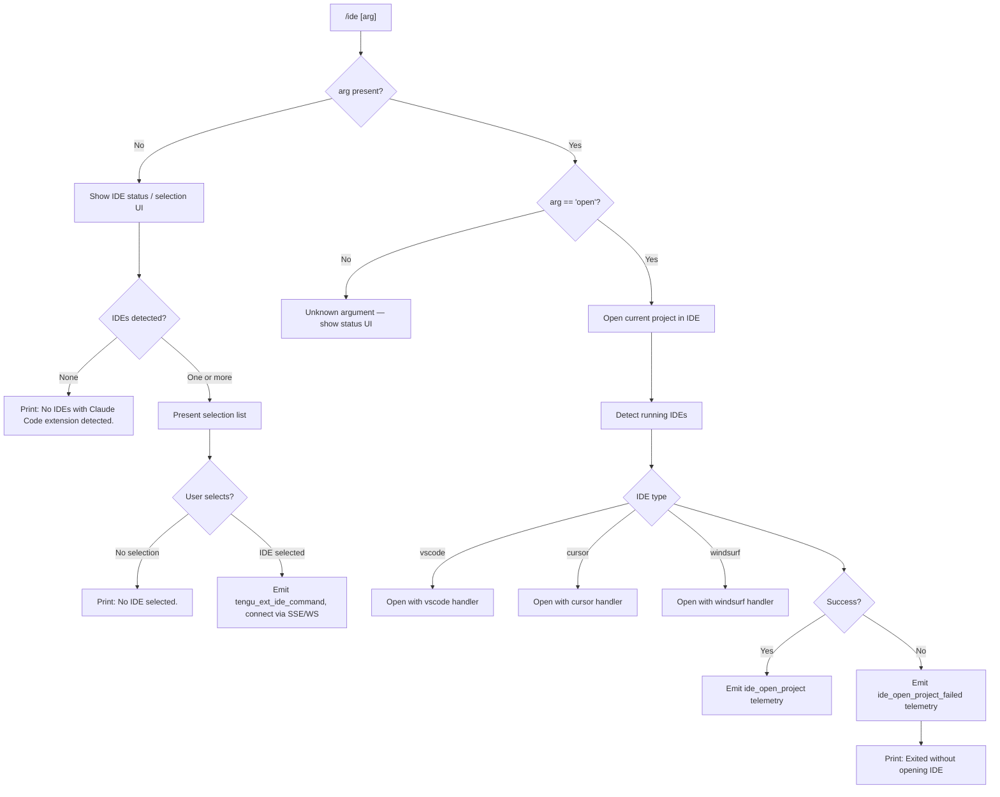

# `/ide`

> Analysis basis: CC v2.1.133 bundle.js (AST extraction + Claude interpretation)
> Minimum version: v2.1.133

---

## Overview

The `/ide` command manages IDE integrations for Claude Code. It detects running IDEs that have the Claude Code extension installed, allows the user to select one, and optionally opens the current project or worktree inside that IDE. The command also provides live connection status via SSE (`sse-ide`) and WebSocket (`ws-ide`) channels.

---

## Registration

| Field | Value |
|---|---|
| type | `local-jsx` |
| name | `ide` |
| description | `Manage IDE integrations and show status` |
| argumentHint | `[open]` |
| module_id | `X6q` |

Analysis basis: CC v2.1.133 bundle.js:+10365083

---

## Input Branching

The command entry point (`ideCommandHandler`) inspects the trimmed argument string to decide which sub-flow to execute.



Analysis basis: CC v2.1.133 bundle.js:+10361251, +10361360, +10361498, +10361558, +10361599, +10361640, +10362095

---

## Behavioral Spec

### IDE Detection

```
function detectRunningIDEs(platform):
    if platform == "linux":
        run shell: "ps aux | grep -E '...' | grep -v grep"
        parse output lines to identify IDE process names
    else if platform == "macos":
        query running applications via OS API
    else if platform == "windows":
        query running processes via OS API

    normalise each detected name to lowercase
    apply NFC unicode normalisation to process strings
    map process entries to known IDE identifiers:
        "vscode", "cursor", "windsurf", jetbrains family
        (idea, pycharm, webstorm, phpstorm, rubymine,
         clion, goland, rider, datagrip, dataspell,
         aqua, gateway, fleet, android-studio, appcode)

    emit telemetry "ide_detect" on success
    emit telemetry "ide_detect_failed" on failure

    return list of detected IDE records
```

Analysis basis: CC v2.1.133 bundle.js:+5039034, +5039008, +5039804, +5035559, +5035623, +10364688

---

### IDE Selection UI

```
function showIDESelectionUI(detectedIDEs):
    if detectedIDEs is empty:
        print "No IDEs with Claude Code extension detected."
        return null

    render interactive list from detectedIDEs
    await user selection

    if no selection made:
        print "No IDE selected."
        return null

    return selectedIDE
```

Analysis basis: CC v2.1.133 bundle.js:+10361360, +10361498

---

### Open Project in IDE

```
function openProjectInIDE(selectedIDE, projectContext):
    determine context type:
        if git worktree   → contextType = "worktree"
        else              → contextType = "project"

    emit telemetry "ide_open_project" with fields:
        ide  = selectedIDE.type   (e.g. "vscode", "cursor", "windsurf")
        type = contextType

    launch IDE open command appropriate for selectedIDE.type

    if IDE process exits without opening:
        emit telemetry "ide_open_project_failed"
        print "Exited without opening IDE"
        advise user to "restart your IDE"
```

Analysis basis: CC v2.1.133 bundle.js:+10361698, +10361732, +10361743, +10361805, +10362095, +10362363

---

### Connection Status Display

```
function showConnectionStatus(connectionMap):
    for each entry in connectionMap:
        label = entry.type padded to fixed width (pad character: space×2)
        render status line with bold IDE name and connection state

    connection state values observed:
        "connected", "Connection failed"

    transport protocols monitored:
        "sse-ide"  (Server-Sent Events channel)
        "ws-ide"   (WebSocket channel)
```

Analysis basis: CC v2.1.133 bundle.js:+10359130, +10359150, +14009808, +14009957, +14179342

---

### Background Daemon Interaction

The `/ide` command interacts with the Claude Code background daemon subsystem when spawning or claiming spare worker processes for IDE-linked sessions.

```
function acquireBackgroundSession(ideContext):
    attempt to claim a spare daemon slot via backgroundDaemonClaim()

    if spare slot available:
        emit telemetry "tengu_bg_spare_claim"
        connect socket via NP8.connect
        register "data", "connect", "kill", "done" event handlers

    if claim fails:
        emit telemetry "tengu_bg_spare_claim_fail"
        record error codes:
            ENOENT / enoent       → socket file missing
            ECONNREFUSED / econnrefused → daemon not listening
            unknown               → unclassified failure

    if low memory condition detected (via os.freemem()):
        emit telemetry "tengu_bg_dispatch_low_mem"

    spare refill label used internally: "daemon_bg_spare_refill"
    session creation label used internally: "daemon_bg_session_create"
```

Analysis basis: CC v2.1.133 bundle.js:+14158355, +14158618, +14158527, +14158536, +14158549, +14158564, +14158606, +14157350, +14157619, +14137952

---

### Spare Worker Pool Management

```
function manageSpareWorkerPool(config):
    pool parameters (observed constants):
        randomBytes length : 4 bytes   → hex string of 8 chars
        encoding           : "hex"
        directory mode     : 448 (octal 0700)
        CLI flag           : "--bg-pty-host"
        pool size arg      : "200"
        spare count arg    : "50"
        separator          : "--"
        spare flag         : "--bg-spare"
        stdin/stdout mode  : "ignore"
        kill signal        : "SIGTERM"
        escalation signal  : "SIGKILL"

    on spawn:
        emit telemetry "tengu_bg_spare_spawn"
        call Bun.spawn with above flags
        call process.unref() so daemon does not block exit

    on exit hook registered via H.onExit
    on SIGKILL escalation:
        emit telemetry "tengu_bg_dispatch_sigkill_escalate"

    on enable:
        emit telemetry "tengu_bg_spare_enable"
        check platform:
            "macos"   → apply 1024 MB threshold
            "windows" → apply different threshold
        emit telemetry "tengu_bg_low_mem_mb" with free-memory reading
```

Analysis basis: CC v2.1.133 bundle.js:+14138009, +14138021, +14138085, +14138209, +14138227, +14138233, +14138238, +14138250, +14138293, +14138819, +14157040, +14156207, +14156229, +14156457, +14156817

---

### IDE Extension Installation Helper

```
function detectAndOfferExtensionInstall(ideList):
    for each ide in ideList:
        determine platform ("linux", "macos", "windows")
        look up extension metadata via SeK (extensionMetadataResolver)
        check known IDE identifiers:
            "IDE", "vscode", "cursor", "windsurf", "jetbrains", "appcode"
        if extension not installed:
            call A.onInstallIDEExtension(ide)

    detected IDE type string normalised to lowercase before comparison
```

Analysis basis: CC v2.1.133 bundle.js:+10362272, +5039804, +5039008, +5039408, +5031250

---

### Session State Labels

The following session lifecycle labels are used internally when tracking IDE-connected daemon sessions:

| Label | Meaning |
|---|---|
| `done` | Session completed normally |
| `killed` | Session was explicitly killed |
| `stopped` | Session was stopped |
| `failed` | Session encountered an error |
| `blocked` | Session is waiting on a blocking condition |
| `crashed` | Session process crashed |
| `working` | Session is actively processing |
| `active` | Session is active but not processing |
| `bg` | Session is running in background |
| `daemon` | Session is the daemon itself |
| `idle` | Session is idle |
| `resuming` | Session is resuming from suspension |
| `spare` | Session is a pre-spawned spare |

Analysis basis: CC v2.1.133 bundle.js:+14161445, +14161463, +14161472, +14161482, +14161565, +14161579, +14161639, +14161665, +14161764, +14162084, +14162199, +14162839, +14157754

---

### Argument List Rendering

```
function renderIDEList(ideList, maxDisplay):
    MAX_ITEMS_BEFORE_TRUNCATION = 3   (derived from Math.floor usage)
    SEPARATOR = ", "
    OVERFLOW_SUFFIX = ", …"

    items = ideList
        .map(ide => normalise(ide.name, "NFC"))
        .slice(0, MAX_ITEMS_BEFORE_TRUNCATION)

    if ideList.length > MAX_ITEMS_BEFORE_TRUNCATION:
        append OVERFLOW_SUFFIX
    else:
        join with SEPARATOR

    return formatted string
```

Analysis basis: CC v2.1.133 bundle.js:+10364620, +10364651, +10364676, +10364688, +10364845, +10364859

---

### Random Jitter Utility

```
function randomJitter(base, scale):
    // Used to stagger daemon retry timing
    BASE   = 100           // milliseconds
    OFFSET = 0
    DIGITS = 2             // decimal places for Math.random result

    delay = BASE + Math.floor(Math.random() * scale)
    setTimeout(callback, delay)
```

Analysis basis: CC v2.1.133 bundle.js:+10364547, +10364566, +12285767, +12285783

---

## State & Side Effects

| Item | Detail |
|---|---|
| Telemetry — `tengu_ext_ide_command` | Fired at command entry when IDE action is initiated (bundle.js:+10361145) |
| Telemetry — `ide_detect` | Fired after successful IDE process scan (bundle.js:+5035559) |
| Telemetry — `ide_detect_failed` | Fired when IDE scan throws an exception (bundle.js:+5035623) |
| Telemetry — `ide_open_project` | Fired when IDE open is requested; carries `ide` and `type` fields (bundle.js:+10361698) |
| Telemetry — `ide_open_project_failed` | Fired when IDE exits before opening the project (bundle.js:+10361805) |
| Telemetry — `tengu_bg_spare_enable` | Fired when background spare pool is enabled (bundle.js:+14156457) |
| Telemetry — `tengu_bg_low_mem_mb` | Fired with free-memory reading when low memory is detected (bundle.js:+14156207) |
| Telemetry — `tengu_bg_spare_spawn` | Fired each time a new spare daemon process is spawned (bundle.js:+14156817) |
| Telemetry — `tengu_bg_spare_claim` | Fired when a spare slot is successfully claimed (bundle.js:+14158355) |
| Telemetry — `tengu_bg_spare_claim_fail` | Fired when spare claim fails (bundle.js:+14158618) |
| Telemetry — `tengu_bg_dispatch_low_mem` | Fired when dispatcher detects low memory during dispatch (bundle.js:+14157619) |
| Telemetry — `tengu_bg_dispatch_sigkill_escalate` | Fired when SIGTERM→SIGKILL escalation occurs (bundle.js:+14157040) |
| Telemetry — `tengu_bg_sendclaim_failed` | Fired when background send-claim operation fails (bundle.js:+14139405) |
| Telemetry — `tengu_mcp_retry_failed_remote` | Fired when MCP remote retry is exhausted (bundle.js:+13870729) |
| Telemetry — `tengu_feature_ok` | Generic feature success counter (bundle.js:+907381) |
| Telemetry — `tengu_feature_bad` | Generic feature failure counter (bundle.js:+907437) |
| Telemetry — `tengu_feature_sad` | Generic feature soft-failure counter (bundle.js:+907507) |
| Hook registration | `H.onExit` registered by spare-worker pool manager to clean up daemon sockets on process exit (bundle.js:+14138951) |
| Socket I/O | Unix domain socket connected via `NP8.connect`; uses `$.write` for framing, `x.retireIfSettled` for cleanup (bundle.js:+14139552, +14150473) |
| File system side effects | Spare daemon creates temp directory (mode 0700), writes lock file (`.lock`), unlinks stale socket files on exit (bundle.js:+14138052, +14138111, +5031464) |
| Process spawn | Background worker spawned via `Bun.spawn` with `--bg-pty-host`, `--bg-spare` flags; stdin/stdout set to `"ignore"` (bundle.js:+14138191, +14138293) |
| appState changes | IDE roster entry updated via `A.rosterEntry` when connection state changes (bundle.js:+14162513) |
| Sound | <!-- TODO: not found in depth-2 traversal; needs --depth 4 --> |

---

## Version History

| Version | Change |
|---|---|
| v2.1.133 | Initial analysis |

---

## Common Mistakes

1. **Passing an unrecognised argument** — only `open` is a meaningful argument (argumentHint: `[open]`). Any other string falls through to the status UI rather than producing an error, which can be confusing.
2. **Expecting IDE detection without the extension installed** — `/ide` only lists IDEs that have the Claude Code extension active. A running VS Code without the extension will not appear.
3. **Running `/ide open` outside a git repository** — the open sub-command distinguishes between `worktree` and `project` context; outside a repo the project-open path may behave unexpectedly because no worktree root is resolvable.
4. **Assuming cross-platform parity** — the Linux detection path runs a `ps aux` shell command, whereas macOS and Windows use native OS APIs. The Linux path is therefore sensitive to process naming and may miss snap/flatpak-packaged IDEs.
5. **Ignoring the "restart your IDE" advisory** — when `ide_open_project_failed` fires, the bundle explicitly advises restarting the IDE (bundle.js:+10362363). Retrying without doing so typically reproduces the failure.
6. **Confusing SSE and WebSocket channels** — the command registers both `sse-ide` and `ws-ide` transports (bundle.js:+10359130, +10359150); external tooling that only monitors one transport may see an incomplete connection picture.

---

## Appendix — Identifier Mapping

> For bundle debugging only. Identifiers change across versions.

| Identifier | Role |
|---|---|
| `tNA` | IDE argument normaliser / list renderer (top-level command helper) |
| `N6` | IDE store accessor / connection state reader |
| `zN6` | Store getter — retrieves raw IDE connection map from store |
| `LA` | Connection state label formatter |
| `H` | Random jitter / timer utility; also general collection helpers |
| `_` | IDE registry map (get / set / values / normalize) |
| `f` | Generic closeable resource handle (close / unref) |
| `q` | Socket unlink / pending-set manager |
| `Y` | Background daemon normaliser / spare-pool orchestrator |
| `J6` | IDE socket roster manager (has / get / add / claim) |
| `$` | Disposable resource wrapper (dispose / write) |
| `sFA` | Spare-pool enable gate (checks platform + memory) |
| `lFA` | Spare daemon spawner (randomBytes, mkdir, Bun.spawn) |
| `d` | Generic async state cell / deferred value |
| `fH` | Feature telemetry emitter (ok / bad / sad counters) |
| `w` | IDE session dispatch controller (kill, claim, reconnect) |
| `y` | Process kill wrapper (WrH / GrH signals) |
| `uH` | Feature-bad recorder |
| `hH` | Feature-ok recorder |
| `x` | Socket retire-if-settled helper (clearTimeout / write) |
| `nFA` | Socket claim connector (NP8.connect, on/once/write/end) |
| `tFA` | Session lifecycle manager (done/killed/stopped/failed states) |
| `K` | Pending-operation set tracker (add / finally / delete) |
| `w8` | Session worker state cell |
| `u` | Disposable IDE connection handle |
| `bq7` | Main `/ide` command JSX render function |
| `vf` | Argument presence checker |
| `uUH` | IDE open-project orchestrator (detects IDEs, opens in IDE) |
| `Wt6` | Lock-file based IDE instance resolver |
| `TeK` | JetBrains IDE instance finder |
| `kH` | String coercion utility |
| `Br1` | IDE process name matcher (H.match) |
| `L` | Display row formatter (map + padEnd) |
| `W` | Debounced event emitter (setTimeout / clearTimeout / emit) |
| `j` | Framed binary socket reader (Buffer.concat / subarray) |
| `P` | SDK/MCP connection handler (jP8 / sv / Dm / fH / HA) |
| `sr1` | Process kill wrapper using `process.kill` |
| `M` | MCP remote retry manager (K.get / K.values / J6 / Og7) |
| `jJ` | IDE type classifier (toLowerCase / basename / d0H) |
| `A` | App-state mutation object (push / filter / onInstallIDEExtension / rosterEntry) |
| `Z8` | Feature-sad recorder |
| `Y8` | IDE status UI component (GA / N6) |
| `GA` | IDE connection row renderer (sJH / Y / qPL / fH) |
| `a5A` | IDE extension installation suggester |
| `SeK` | Extension metadata resolver (entries / includes / toLowerCase) |
| `mc` | IDE connection monitor / health checker |
| `kq7` | IDE list filter + final render helper |