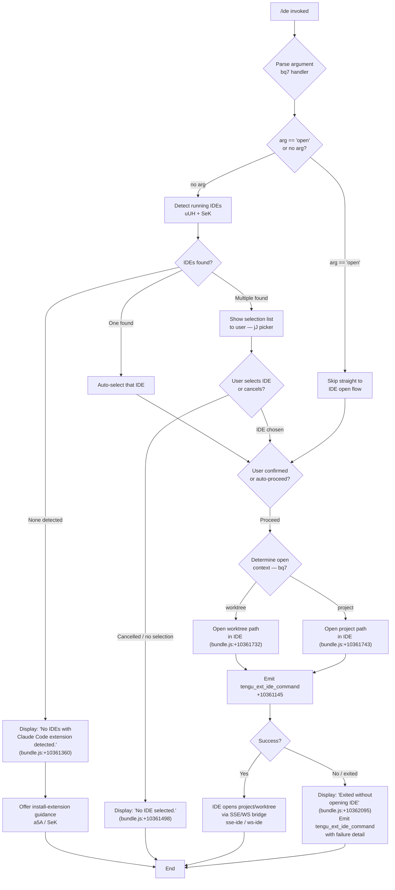

# `/ide`

> Analysis basis: CC v2.1.133 bundle.js (AST extraction + Claude interpretation)
> Minimum version: v2.1.133

---

## Overview

The `/ide` slash command manages IDE integrations within Claude Code, allowing users to view integration status, open projects in a detected IDE, and install or configure IDE extensions. It detects running IDE processes (VS Code, Cursor, Windsurf, JetBrains family, etc.), presents the user with a selection UI when multiple IDEs are active, and then opens the current project or worktree in the chosen editor. The command is rendered as a local JSX component and communicates with the background daemon layer to coordinate IDE-side extension communication.

---

## Registration

| Field | Value |
|---|---|
| type | `local-jsx` |
| name | `ide` |
| description | `Manage IDE integrations and show status` |
| argumentHint | `[open]` |
| module_id | `X6q` |
| load_inline | `true` |
| loc_byte | `10365083` |
| loc_byte_end | `10365239` |
| loc_line | `5749` |
| arbor_handler.name | `bq7` |
| arbor_handler.fqn | `claude-2.1.133::bq7` |
| arbor_handler.kind | `AsyncFunction` |
| arbor_handler.resolution_path | `module_id` |
| arbor_handler.n_hits | `0` |

Analysis basis: CC v2.1.133 bundle.js:+10365083

---

## Input Branching

The command has four distinct paths based on the subcommand argument and detected IDE state: no argument with no IDEs detected, no argument with IDEs detected (optional `open` selection flow), explicit `open` subcommand, and installation/extension-setup path. A Mermaid flowchart is used per the 3+ branch rule.



---

## Behavioral Spec

### Handler Entry — `ideCommandHandler` (`bq7`)

`bq7` is an `AsyncFunction` resolved via `module_id` resolution path against module `X6q`.

Analysis basis: CC v2.1.133 bundle.js:+10361143

```
async function ideCommandHandler(commandContext):
    emit telemetry event "tengu_ext_ide_command"    # +10361145

    subArg = commandContext.args[0]                  # "open" or undefined

    # Step 1 — Resolve current working context
    cwd = resolveCurrentDirectory(commandContext)    # d  (+10361143)

    # Step 2 — Detect connected IDEs
    ideList = await detectIDEInstances(commandContext)   # uUH (+10361303)

    if ideList is empty:
        display "No IDEs with Claude Code extension detected."  # +10361360
        show installExtensionGuide()                            # a5A (+10362228)
        return

    # Step 3 — Render status display for each found IDE
    displayIDEStatusHeader(ideList)                  # hH/uH/bq7 render block (+10361695)

    # Step 4 — IDE selection when multiple present or when 'open' requested
    if subArg == "open" or userWantsToOpen:
        selectedIDE = await promptIDESelection(ideList)   # jJ (+10362338)
        if selectedIDE is null:
            display "No IDE selected."                    # +10361498
            return

        # Step 5 — Determine open context (worktree vs project)
        openContext = resolveOpenContext(commandContext)  # +10361732 / +10361743
        # openContext.type is either "worktree" or "project"

        success = await openProjectInIDE(selectedIDE, openContext)  # mc (+10362299)
        if not success:
            display "Exited without opening IDE"          # +10362095
            emit telemetry "tengu_ext_ide_command" with failure info
            return

    # Step 6 — Apply any post-open filter (e.g. exclude non-matching connections)
    filterIDEConnections(ideList)                    # K.filter (+10362693)
    finalizeIDEView(commandContext)                  # kq7 (+10362754)
```

---

### IDE Detection — `detectIDEInstances` (`uUH`)

Analysis basis: CC v2.1.133 bundle.js:+5034250

```
async function detectIDEInstances(context):
    emit telemetry "ide_detect"              # +5035559

    # Platform branch
    platform = getPlatform()                 # a6 (+5034347)

    if platform == "linux":                  # +5039008
        # Use ps-based process scan
        rawProcs = shellScan(
            "ps aux | grep -E 'code|cursor|windsurf|...' | grep -v grep"
        )                                    # +5039034
        processes = parseProcessList(rawProcs)

    else:  # macOS / Windows
        # Use OS-native running app enumeration
        processes = enumerateNativeApps()    # Wt6 (+5034299)

    # Walk socket/config directories per IDE type
    ideEntries = []
    for proc in processes:
        socketPaths = resolveIDESocketPaths(proc)   # IeK (+5031354)
        for path in socketPaths:
            # Validate .claude marker directory
            if pathHas(".claude", path):             # +5032683
                entry = buildIDEEntry(path, proc)    # TeK (+5034339)
                ideEntries.push(entry)

    # Additional WSL path handling
    if platform == "wsl":                    # +5032566
        wslPaths = resolveWSLPaths()         # +5032730 (base: /mnt/c/Users)
        # Exclude system pseudo-accounts: Public, Default, Default User, All Users
        #  (+5032824, +5032843, +5032863, +5032888)
        wslPaths = filterExcludedWSLUsers(wslPaths)
        ideEntries.extend(wslPaths)

    if ideEntries is empty:
        emit telemetry "ide_detect_failed"   # +5035623

    return ideEntries
```

---

### IDE Socket Resolution — `resolveIDESocketDir` (`IeK`)

Analysis basis: CC v2.1.133 bundle.js:+5031354

```
function resolveIDESocketDir(process, basePath):
    resolvedPath = path.join(basePath, ...)     # Vy.join (+5032535)
    configRoot = getConfigRoot()                 # a6 (+5032559)

    # Identify IDE type from process name / path
    if process.path.includes(".claude"):         # +5032683
        ideType = "ide"                          # +5032548
    elif process.path.includes("wsl"):
        ideType = "wsl"                          # +5032566

    # Stat and validate directory; handle symlinks
    stat = fs.stat(resolvedPath)
    if stat.isDirectory() or stat.isSymbolicLink():   # +5032766 / +5032784
        return buildSocketEntry(resolvedPath)

    # Error path — emit structured error
    on permission errors (EACCES, EPERM, ENOTDIR, ELOOP):
        logError(...)                            # fH (+5033054)

    return null
```

---

### IDE Selection Picker — `ideSelectionPicker` (`jJ`)

Analysis basis: CC v2.1.133 bundle.js:+5039859

```
function ideSelectionPicker(ideList):
    # Normalize IDE names for display
    normalizedNames = ideList.map(ide => ide.name.toLowerCase())  # H.toLowerCase (+5039859)

    # Extract basename for display label
    for ide in ideList:
        label = path.basename(ide.executablePath)    # Vy.basename (+5039917)
        displayLabel = extractLabel(label)           # d0H (+5039991), s9 (+5039903)

    # Present interactive list; return user selection or null
    selected = renderInteractiveList(normalizedNames)
    return selected   # null if user pressed Escape / Ctrl+C
```

---

### Install Extension Guide — `installExtensionGuide` (`a5A` → `SeK`)

Analysis basis: CC v2.1.133 bundle.js:+5039496

```
function installExtensionGuide(context):
    platform = getPlatform()          # a6 (+5038145)
    connState = getConnectionState()  # RP (+5038179)

    # Build per-IDE install instructions
    for [ideName, installInfo] in Object.entries(ideExtensionMap):  # +5038448
        if ideSupported(ideName):                                    # q.includes (+5038505)
            instructions.push(buildInstallStep(ideName, installInfo))  # H.push (+5038520)

    # Filter to only IDEs matching current platform
    filtered = instructions.filter(i => i.platform.includes(platform))   # L.includes (+5038950)

    # Normalize display labels to lowercase
    display filtered.map(i => i.name.toLowerCase())   # M.toLowerCase (+5038961)

    # On error, log via fH
    on error:
        logError(...)    # fH (+5039448)
```

---

### Open Project in IDE — `openProjectInIDE` (`mc`)

Analysis basis: CC v2.1.133 bundle.js:+10362299 (called from `bq7`)

```
async function openProjectInIDE(selectedIDE, openContext):
    # Determine IDE type for targeted open command
    if selectedIDE.type == "vscode":     # +10361558
        protocol = "sse-ide"             # +10359130
    elif selectedIDE.type == "cursor":   # +10361599
        protocol = "sse-ide"
    elif selectedIDE.type == "windsurf": # +10361640
        protocol = "ws-ide"              # +10359150
    else:
        protocol = "sse-ide"             # default

    # Send open request via daemon bridge
    result = await daemonBridgeSend(protocol, {
        type: openContext.type,          # "worktree" or "project"
        path: openContext.path
    })

    # Emit telemetry
    if result.success:
        emit "ide_open_project"          # +10361698
        if openContext.type == "worktree":
            emit context "worktree"      # +10361732
        else:
            emit context "project"       # +10361743
    else:
        emit "ide_open_project_failed"   # +10361805

    return result.success
```

---

### Background Daemon Integration — `backgroundSessionCreate` (`w` / `nFA`)

The `/ide` command relies on the background daemon subsystem for session management. The relevant sub-layer operates as follows.

Analysis basis: CC v2.1.133 bundle.js:+14158288

```
function backgroundSessionCreate(ideHandle, context):
    # Claim a spare PTY session from the pool
    gm.claim(...)                    # nFA.gm.claim (+14139279)

    # If no spare available, connect via socket
    socketPath = buildSocketPath(context)   # kd7 (+14139365)
    socket = NP8.connect(socketPath)        # nFA.NP8.connect (+14139552)

    # Attach event handlers for data / kill signals
    socket.on("data", handleIncomingData)   # f.on (+14139575)
    socket.once("kill", handleKill)         # f.once (+14139596)

    # Encode and send claim frame
    frame = buildClaimFrame(context)        # Nd7.gm.buildClaimFrame (+14139706)
    encodedFrame = encodeFrame(frame)       # Em (+14139626)
    socket.write(encodedFrame)              # f.write (+14139618)

    return socket
```

---

### Daemon Status Reporting — `readDaemonStatus` (`Sj6`)

Analysis basis: CC v2.1.133 bundle.js:+11406973

```
function readDaemonStatus(basePath):
    statusFilePath = path.join(basePath, "daemon.status.json")  # +11406987
    # Status file read is part of the dispose/reconnect cycle (XDq)
    return parseStatusFile(statusFilePath)   # n8 (+11406982)
```

---

### IDE Normalization and Path Handling — `normalizeIDEPath` (`tNA`)

Analysis basis: CC v2.1.133 bundle.js:+10364583

```
function normalizeIDEPath(rawPathList, activeConnections):
    # Generate a random display seed (Math.random, max=100, min=0)
    # Constants: 100 (+10364547), 0 (+10364566)
    seed = Math.floor(Math.random() * 100)    # +10364583 / +10364590 / +10364651

    # Normalize raw paths to NFC form
    normalizedRaw = rawPathList.map(p => p.normalize("NFC"))   # +10364688 / +10364676

    # Normalize active connection paths
    normalizedActive = activeConnections.map(c => normalizeConnectionPath(c))
                                                                # Y.normalize (+10364715)

    # Filter: only keep paths starting with the known IDE prefix
    filtered = normalizedRaw.filter(p => p.startsWith(prefix)) # w.startsWith (+10364737)

    # Slice to bounded display window
    displaySlice = filtered.slice(0, limit)   # w.slice (+10364763)
    activeSlice  = normalizedActive.slice(0, limit)   # Y.slice (+10364822)

    # Format join separator constants: ", " (+10364845), ", …" (+10364859)
    return format(displaySlice, activeSlice)
```

---

### IDE Type Detection via JetBrains Enumeration — `resolveNativeApps` (`Wt6`)

Analysis basis: CC v2.1.133 bundle.js:+5031354

```
async function resolveNativeApps(platform):
    # Enumerate per-IDE socket directories
    socketDirs = await Promise.all(
        IDE_TYPES.map(type => findSocketDir(type))   # H.map (+5031385)
    )                                                 # Promise.all (+5031373)

    results = []
    for dir in socketDirs:
        if not dir: continue

        # F6 guards: skip if disabled / null
        if isDisabled(dir): continue                  # F6 (+5031419)

        # Map per socket entry
        entries = dir.map(entry => buildEntry(entry)) # L.map (+5031499)
        joinedPath = path.join(socketBase, entry)     # Vy.join (+5031522)

        # Error handling with structured Z9 / fH
        on error:
            logStructuredError(...)                   # Z9 (+5031656), fH (+5031662)

        results.extend(entries)

    return results
```

---

## State & Side Effects

| Item | Detail |
|---|---|
| Telemetry — `tengu_ext_ide_command` | Fired at handler entry and on open success/failure (bundle.js:+10361145, +10361805) |
| Telemetry — `ide_detect` | Fired when IDE detection begins (bundle.js:+5035559) |
| Telemetry — `ide_detect_failed` | Fired when no IDEs are found after full scan (bundle.js:+5035623) |
| Telemetry — `ide_open_project` | Fired on successful project-open RPC (bundle.js:+10361698) |
| Telemetry — `ide_open_project_failed` | Fired when the open RPC returns failure (bundle.js:+10361805) |
| Telemetry — `tengu_bg_spare_claim` | Fired when a spare PTY session is claimed from pool (bundle.js:+14158355) |
| Telemetry — `tengu_bg_spare_claim_fail` | Fired when spare claim fails (bundle.js:+14158618) |
| Telemetry — `tengu_bg_sendclaim_failed` | Fired when the daemon claim frame cannot be delivered (bundle.js:+14139405) |
| Telemetry — `tengu_daemon_control` | Fired during daemon start/stop control paths (bundle.js:+14191366) |
| Telemetry — `tengu_config_parse_error` | Fired if IDE config file cannot be parsed (bundle.js:+3113854) |
| Telemetry — `tengu_bg_spare_enable` | Fired when spare session pool is enabled (bundle.js:+14156457) |
| Telemetry — `tengu_bg_low_mem_mb` | Fired when available memory falls below threshold (bundle.js:+14156207) |
| Telemetry — `tengu_bg_spare_spawn` | Fired when a new spare session is spawned (bundle.js:+14156817) |
| Telemetry — `tengu_feature_ok` / `tengu_feature_bad` / `tengu_feature_sad` | Feature-flag gate checks in the IDE integration stack (bundle.js:+907381, +907437, +907507) |
| Telemetry — `tengu_bg_dispatch_sigkill_escalate` | SIGKILL escalation during dispatch (bundle.js:+14157040) |
| Telemetry — `tengu_bg_dispatch_low_mem` | Low-memory condition during dispatch (bundle.js:+14157619) |
| Telemetry — `tengu_bg_attach` | Fired when a session attach begins (bundle.js:+14150138) |
| Telemetry — `tengu_bg_attach_stall_ms` | Fired when attach stalls, records ms elapsed (bundle.js:+14142600) |
| Telemetry — `tengu_bg_attach_stall_gave_up` | Fired when stall recovery is abandoned (bundle.js:+14150972) |
| Telemetry — `tengu_bg_attach_stall_respawn` | Fired when stall triggers respawn (bundle.js:+14151241) |
| Telemetry — `tengu_bg_attach_legacy_autorespawn` | Legacy PTY worker auto-respawn during attach (bundle.js:+14149728) |
| Telemetry — `tengu_bg_proto_mismatch` | Protocol version mismatch between client and daemon (bundle.js:+14146608) |
| Telemetry — `tengu_bg_dispatch_stale_drop` | Stale dispatch entry dropped (bundle.js:+14147847) |
| Telemetry — `tengu_daemon_idle_exit` | Daemon exited due to idle timeout (bundle.js:+14175380) |
| Telemetry — `tengu_bg_roster_parse_failed` | Roster file could not be parsed (bundle.js:+10295889) |
| Telemetry — `tengu_run_hook` | Hook runner invoked within IDE command lifecycle (bundle.js:+11967438) |
| Telemetry — `tengu_mcp_retry_failed_remote` | MCP remote tool retry exhausted (bundle.js:+13870729) |
| Daemon socket | Reads/writes a Unix domain socket for the daemon claim frame; path derived from `pty-pids` subdirectory (bundle.js:+10293116) |
| Daemon status file | Reads `daemon.status.json` at startup for connection state (bundle.js:+11406987) |
| Spare PTY pool | Manages a pool of pre-spawned background PTY workers; refill signal: `daemon_bg_spare_refill` (bundle.js:+14137952) |
| Background process spawn | Uses `Bun.spawn` with `--bg-pty-host 200 50 -- --bg-spare` arguments (bundle.js:+14138191, +14138209, +14138227, +14138233, +14138250) |
| Memory threshold | Spare-pool refill is gated on `hP8.freemem()` vs 1024 MB threshold (bundle.js:+14156229) |
| File-watch | `Yd6.watchFile` / `Yd6.unwatchFile` used to monitor config files for changes (bundle.js:+3109613, +3109940) |
| Config state changes | Config-change events propagate as `ConfigChange` hook type (bundle.js:+11920664) |
| Sound | None detected in depth-2 traversal |
| appState changes | IDE selection state stored/updated in the JSX component's local state; no top-level appState mutation identified at depth ≤ 2 |

---

## Version History

| Version | Change |
|---|---|
| v2.1.133 | Initial analysis — `local-jsx` type, handler `bq7`, IDE detection covering VS Code, Cursor, Windsurf, JetBrains family; SSE and WebSocket bridge paths (`sse-ide`, `ws-ide`); spare PTY pool integration |

---

## Common Mistakes

1. **Running `/ide open` when no IDE extension is installed.** The command detects running IDE processes at the OS level, but the Claude Code extension must also be installed and active inside the IDE. If only the process is running without the extension, the socket handshake will fail and `ide_detect_failed` will be emitted. Follow the on-screen install-extension guide that appears.

2. **Expecting instant response on WSL.** WSL path resolution scans `/mnt/c/Users/*` and filters excluded system accounts (`Public`, `Default`, `Default User`, `All Users`). This directory walk adds latency on slower file systems; wait for the scan to complete before concluding no IDEs are present.

3. **Multiple IDEs open simultaneously without selecting.** When both VS Code and Cursor are running with the extension, the command presents a picker. Pressing Enter without navigating to a specific entry returns `null` ("No IDE selected.") rather than defaulting to the first entry. Explicitly select an IDE from the list.

4. **Assuming `/ide` restarts a crashed daemon.** The command reports daemon status and facilitates IDE open, but daemon recovery (SIGTERM/SIGKILL escalation, spare pool respawn) happens automatically in the background. If `ide_open_project_failed` fires repeatedly, restart the daemon separately rather than re-invoking `/ide`.

5. **Confusing `worktree` and `project` open contexts.** When a Git worktree is active the command sends the worktree path, not the repository root. Opening a path in an IDE that does not have the worktree root as its workspace folder may cause the extension to not recognize the session.

6. **Path normalization sensitivity on macOS.** Paths are normalized to NFC Unicode form before comparison (bundle.js:+10364688). Paths that differ only in Unicode normalization form (e.g. decomposed diacritics) are treated as identical by the command but may appear different in the Finder. Ensure consistent path encoding when configuring project directories.

---

## Appendix — Identifier Mapping

> For bundle debugging only. Identifiers change across versions.

| Identifier | Role |
|---|---|
| `bq7` | Main `/ide` async handler (`ideCommandHandler`) — Arbor-resolved entry point |
| `tNA` | IDE path normalization and display formatting function |
| `uUH` | IDE instance detection orchestrator (`detectIDEInstances`) |
| `IeK` | Per-IDE socket directory resolver (`resolveIDESocketDir`) |
| `Wt6` | Native OS app enumeration for IDE discovery (`resolveNativeApps`) |
| `TeK` | IDE entry builder from socket path |
| `fc_` | Process entry parser for `ps aux` output |
| `jJ` | Interactive IDE selection picker (`ideSelectionPicker`) |
| `s9` | Label extraction helper (index/slice on strings) |
| `a5A` | Install-extension guide orchestrator |
| `SeK` | Per-IDE extension install instruction builder |
| `RP` | Connection-state resolver for install guide |
| `sJH` | Low-level connection state machine |
| `mc` | Open-project-in-IDE RPC sender (`openProjectInIDE`) |
| `kq7` | Post-open IDE view finalizer |
| `Y8` | IDE status/connection state renderer |
| `GA` | Connection state helper used by renderer |
| `N6` | Context/store retrieval helper |
| `zN6` | Async store getter |
| `eg` | Store value extractor |
| `LA` | Logging/alerting helper |
| `J6` | IDE connection normalization utility |
| `Bq6` | IDE type constant resolver |
| `gq6` | IDE name normalizer |
| `Po` | Connection property mapper |
| `kH` | String conversion utility |
| `jo` | Low-level connection initializer |
| `_d6` | IDE registry deduplication logic |
| `pt8` | IDE session emitter |
| `ct8` | Config-change watcher for IDE sessions |
| `R6` | IDE config reader with file-watch |
| `F6` | Null/disabled guard predicate |
| `He8` | Config entry validator |
| `m5H` | Config file I/O with backup/migration |
| `u2K` | File-watch subscription manager (`Yd6.watchFile`) |
| `XDq` | Daemon status writer (`daemon.status.json`) |
| `yr` | Atomic write helper wrapper |
| `iY` | Atomic file write with temp-rename |
| `Sj6` | Daemon status file path builder |
| `SH` | JSON serializer (`JSON.stringify`) |
| `sFA` | Spare session availability checker |
| `lFA` | Background spare PTY spawner (`daemon_bg_spare_refill`) |
| `hd7` | Spawn argument builder |
| `UM` | Array validation helper |
| `vd7` | Spawn options constructor (`Object.assign`) |
| `_N` | PTY-pids path resolver |
| `vIH` | PTY-pids file locator |
| `d` | Utility: current working directory resolver |
| `fH` | Structured error logger |
| `HA` | Error formatter |
| `yq` | Log queue helper |
| `J9_` | Queue stringifier |
| `NJL` | Rolling log queue (shift/push) |
| `w` | IDE connection manager / session loop |
| `y` | Clipboard/image paste handler (indirectly reached) |
| `WrH` | Image capture helper |
| `BEq` | PNG path resolver |
| `QEq` | Image command builder |
| `GrH` | Image write helper |
| `gEq` | Atomic image file writer |
| `x` | Retire-if-settled session guard |
| `nFA` | Background daemon claim sender (`backgroundSessionCreate`) |
| `kd7` | Daemon socket connector with timeout |
| `yd7` | Low-level socket connect-and-ping |
| `w8` | Error code extractor |
| `r8` | TCP retry/back-off helper |
| `Nd7` | Claim frame builder |
| `vH` | String coercion guard |
| `k` | Subprocess executor / shell command runner |
| `Ztq` | Shell argument sanitizer |
| `Uf` | Path redactor (`[REDACTED]`) |
| `LkH` | Universal path normalizer |
| `vtq` | Shell command builder with byte-length check |
| `Em` | Binary frame encoder (Buffer-based) |
| `tFA` | Session roster entry manager |
| `L` | Roster display formatter (padEnd) |
| `xL` | Jobs directory path resolver |
| `VW` | Jobs base path builder |
| `r9` | Job file reader/writer with stat cache |
| `D8` | Error-code wrapper |
| `p6` | JSON parser |
| `Hw` | Session state classifier |
| `CE` | State label mapper (`active`) |
| `Pf` | Roster entry writer |
| `lP` | Roster entry deleter |
| `tlH` | Roster parse-and-refresh loop |
| `vm` | Roster file reader |
| `j97` | Roster mkdir + write helper |
| `$qH` | PTY-pids socket path helper |
| `Vm` | PTY socket path builder |
| `NNA` | PTY base directory resolver |
| `alH` | PTY socket file path builder |
| `vf` | Version/feature flag checker |
| `Wt6` | Native IDE process enumerator (also listed above) |
| `Br1` | Process name regex matcher |
| `W` | Global skill/session dispatcher |
| `z` | Active IDE connection set manager |
| `bS` | IDE connection initializer |
| `cC` | Concurrent session race handler (`Promise.race`) |
| `rfH` | Hook runner for `ConfigChange` events |
| `aK` | Hook context builder |
| `YP` | Hook execution engine |
| `_mH` | Hook presence checker |
| `Zf8` | Hook result accumulator |
| `et` | Hook event emitter |
| `f1H` | Hook filter |
| `a58` | Hook abort handler |
| `Eg9` | Hook error emitter |
| `BcH` | Cache invalidation on config change |
| `j` | Daemon protocol message handler |
| `X` | Message routing table |
| `ff` | Socket end/close helper |
| `md7` | Full daemon message dispatcher (protocol core) |
| `pd7` | Protocol write helper |
| `M` | MCP connection registry |
| `_Y` | Background service label |
| `oFA` | Dispatch acknowledgement handler |
| `Pdq` | Dispatch timeout manager |
| `h0` | PTY path joiner |
| `r$` | PTY realpath resolver |
| `aKH` | Log-tail readline helper |
| `xd7` | PTY dimension calculator |
| `Z` | Session state tracker |
| `HqH` | Session heartbeat handler |
| `ud7` | Attach+connect orchestrator |
| `v` | Focus/blur timer manager |
| `l` | Permission allow-list |
| `c` | Permission filter |
| `Q` | Output stream writer |
| `p` | Transient output writer |
| `g` | Classification engine |
| `QW6` | Socket destroy/write helper |
| `G` | Permission check dispatcher |
| `P` | SDK/SSE connection handler |
| `jP8` | SSE/dynamic connection type constant |
| `sr1` | Process kill helper (`process.kill`) |
| `Z8` | CWD fallback resolver |
| `mc` | IDE open-project RPC (also listed above) |

---

Note: index built via Arbor fallback; some signals (telemetry, literals) may be missing — see arbor-fallback.js.