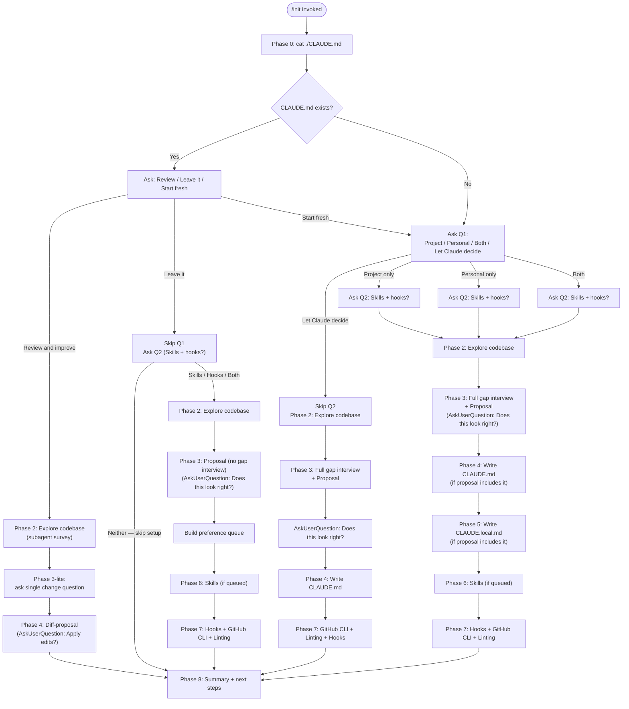

# `/init`

> Analysis basis: CC v2.1.133 bundle.js (AST extraction + Claude interpretation)
> Minimum version: v2.1.133

---

## Overview

The `/init` command bootstraps a repository's Claude Code configuration by guiding the agent through an eight-phase interactive workflow. It detects existing project state (CLAUDE.md, skills, hooks, formatters, Git worktrees), asks the user focused questions via `AskUserQuestion`, and then writes the approved set of artefacts — `CLAUDE.md`, `CLAUDE.local.md`, `.claude/skills/*/SKILL.md`, and hook entries in `.claude/settings.json` or `.claude/settings.local.json`. The command is implemented as a `prompt`-type registration: invoking `/init` causes the agent to receive a large, structured system prompt (22 449 characters) that encodes the entire workflow as phased instructions.

---

## Registration

| Field | Value |
|---|---|
| `type` | `prompt` |
| `name` | `init` |
| `description` | "Initialize new CLAUDE.md file(s) and optional skills/hooks with codebase documentation \| Initialize a new CLAUDE.md file with codebase documentation" |
| `loc_byte` | `10388352` |
| `loc_byte_end` | `10388745` |
| `loc_line` | `5991` |
| `handler_method` | `getPromptForCommand` |
| `handler_method_start` | `10388668` |
| `handler_method_end` | `10388744` |
| `prompt_body.length` | `22449` characters |
| `prompt_body.trace` | `conditional; identifier→Bq7 (var template, 20850 chars); identifier→Uq7 (var template, 1592 chars)` |
| **Arbor handler — name** | `getPromptForCommand` |
| **Arbor handler — kind** | `Method` |
| **Arbor handler — FQN** | `claude-2.1.133::getPromptForCommand` |
| **Arbor handler — resolution_path** | `direct` (symbol falls inside the registration byte range) |
| **Arbor handler — n_hits** | `2` |
| `arbor_handler.name` | `getPromptForCommand` |
| `arbor_handler.kind` | `Method` |
| `arbor_handler.resolution_path` | `direct` |
| `arbor_handler.fqn` | `claude-2.1.133::getPromptForCommand` |
| `arbor_handler.n_hits` | `2` |

Analysis basis: CC v2.1.133 bundle.js:+10388352

### Prompt body structure

The body is assembled conditionally at runtime from two template variables:

- **Primary template** (`Bq7`, 20 850 chars) — the full eight-phase workflow prompt covering Phase 0 through Phase 8 (CLAUDE.md existence check → interactive setup → codebase exploration → gap interview → proposal → write artefacts → optimisations → summary).
- **Secondary template** (`Uq7`, 1 592 chars) — a shorter fallback/suffix prompt whose content covers the simpler "create a CLAUDE.md" path (build/test/lint commands, high-level architecture, usage notes about not repeating obvious instructions).

The `getPromptForCommand` method selects between these two templates (or concatenates them) at invocation time. Analysis basis: CC v2.1.133 bundle.js:+10388668

---

## Input Branching

The workflow has more than three distinct top-level branches. A Mermaid flowchart is used below.



Analysis basis: CC v2.1.133 bundle.js:+10388352 (prompt body phases 0–8)

---

## Behavioral Spec

The agent receives the structured prompt from `getPromptForCommand` and executes the phases below. All pseudocode uses descriptive English names derived from the call graph.

### Phase 0 — Detect existing CLAUDE.md

```
function detectExistingClaudeMd():
    result = shell_exec("cat ./CLAUDE.md")
    # only the project-root file counts; no directory walk
    if result.success:
        return EXISTS
    else:
        return ABSENT
```

Analysis basis: CC v2.1.133 bundle.js:+10388352

### Phase 1 — Ask what to set up

```
function askSetupScope(existenceState):
    print_primer_text()          # explains CLAUDE.md, Skills, Hooks concepts

    if existenceState == EXISTS:
        choice = AskUserQuestion(
            "I found an existing CLAUDE.md. What would you like to do?",
            options=["Review and improve it", "Leave it, set up other things",
                     "Start fresh (replace it)"]
        )
        return routeExistingFile(choice)
    else:
        # existenceState == ABSENT or user chose "Start fresh"
        q1 = AskUserQuestion(
            "Which CLAUDE.md files should /init set up?",
            options=["Project CLAUDE.md", "Personal CLAUDE.local.md",
                     "Both project + personal", "Let Claude decide"]
        )
        if q1 != "Let Claude decide":
            q2 = AskUserQuestion(
                "Also set up skills and hooks?",
                options=["Skills + hooks", "Skills only",
                         "Hooks only", "Neither, just CLAUDE.md"]
            )
        return (q1, q2)

function routeExistingFile(choice):
    match choice:
        "Review and improve" →
            goto Phase2, then Phase3Lite, then Phase4DiffProposal, then Phase8
        "Leave it" →
            ask Q2 (rename fourth option to "Neither — skip setup")
            if Q2 == "Neither — skip setup":
                goto Phase8 with message "Nothing to set up — your CLAUDE.md is unchanged."
            else:
                goto Phase2 → Phase3Proposal(no_gap_interview) → Phase6/7 → Phase8
                # hook target default: .claude/settings.json (project path)
        "Start fresh" →
            treat as ABSENT; continue to Q1
```

Analysis basis: CC v2.1.133 bundle.js:+10388352

### Phase 2 — Explore the codebase

```
function exploreCodbase():
    # Launch a subagent to read:
    manifest_files = ["package.json", "Cargo.toml", "pyproject.toml",
                      "go.mod", "pom.xml", ...]
    config_files   = ["README", "Makefile", "CI config",
                      ".claude/rules/", "AGENTS.md",
                      ".cursor/rules", ".cursorrules",
                      ".github/copilot-instructions.md",
                      ".windsurfrules", ".clinerules", ".mcp.json"]

    detect = {
        build_test_lint_commands,   # especially non-standard ones
        languages_frameworks_pkg_manager,
        project_structure,          # monorepo / multi-module / single
        code_style_deviations,
        gotchas_env_vars_quirks,
        existing_skills_rules_dirs,
        formatter_config,           # prettier / biome / ruff / black / gofmt / rustfmt
        git_worktrees               # run `git worktree list`
    }

    gaps = items_that_cannot_be_inferred_from_code()
    return (detect, gaps)
```

Analysis basis: CC v2.1.133 bundle.js:+10388352

### Phase 3 — Fill in the gaps and build a proposal

```
function gapInterviewAndProposal(scope, exploreResult):
    if scope includes PROJECT or "Let Claude decide":
        ask_about_codebase_practices(exploreResult.gaps)
        # non-obvious commands, branch/PR conventions, env setup, testing quirks
        # do NOT mark options as "recommended"

    if scope includes PERSONAL:
        ask_about_user_preferences()
        # role, familiarity, sandbox URLs, worktree topology (if multiple worktrees),
        # communication preferences
        # do NOT mark options as "recommended"

    if phase0_choice == "Review and improve":
        ask_single_change_question()   # "Has anything changed…?"
        # skip full gap interview; go directly to Phase 4 diff-proposal

    # Classify each finding into an artifact type:
    for finding in (exploreResult + gap_answers):
        match finding:
            deterministic_fast_shell_command  → artifact = HOOK
            on_demand_multistep_workflow      → artifact = SKILL
            behavioural_guidance_not_enforced → artifact = CLAUDE_MD_NOTE

    proposal = build_proposal(scope, artifacts)
    # Print proposal as normal assistant text before calling AskUserQuestion
    print_proposal(proposal)

    confirmation = AskUserQuestion(
        "Does this look right?",
        options=["Looks good — proceed", "Drop the hook",
                 "Drop the skill", ...]   # tool auto-adds "Other"
    )
    # do NOT use the `preview` field — proposal is already visible

    preference_queue = build_queue(accepted_proposal)
    # queue entries: {type, description, target_file, phase2_details}
    return preference_queue
```

Analysis basis: CC v2.1.133 bundle.js:+10388352

### Phase 4 — Write CLAUDE.md

```
function writeClaudeMd(preference_queue, review_mode):
    if review_mode == "Review and improve":
        existing = read_file("./CLAUDE.md")
        diffs = compare(existing, exploreResult, phase3LiteAnswer)
        print_diffs_with_reasons()
        confirm = AskUserQuestion(
            "Apply these edits?",
            options=["Apply all", "Let me pick which", "Skip — leave it as is"]
        )
        if confirm != "Skip":
            apply_selected_diffs()
        return

    # Fresh write or "Start fresh":
    content = []
    content.append(REQUIRED_PREFIX)
    # "# CLAUDE.md\n\nThis file provides guidance to Claude Code…"

    include_if_applicable = [
        non_standard_build_test_lint_commands,
        code_style_deviations_from_defaults,
        testing_instructions_and_quirks,
        repo_etiquette,
        required_env_vars_or_setup,
        non_obvious_gotchas_architectural_decisions,
        important_parts_from_existing_ai_tool_configs
    ]

    exclude = [
        file_by_file_structure,
        standard_language_conventions,
        generic_advice,
        detailed_api_docs,          # use @path/to/import instead
        frequently_changing_info,   # use @path/to/import instead
        long_tutorials,             # move to separate file + @import
        commands_obvious_from_manifest
    ]

    # Consume CLAUDE.md-targeted notes from preference_queue
    for note in preference_queue where note.target == "CLAUDE.md":
        append_note_to_relevant_section(content, note)

    write_file("./CLAUDE.md", content)

    if project_has_multiple_concerns:
        suggest_rules_subdirectory()   # .claude/rules/code-style.md, etc.
    if project_is_monorepo_or_multimodule:
        offer_subdirectory_claude_md_files()
```

Analysis basis: CC v2.1.133 bundle.js:+10388352

### Phase 5 — Write CLAUDE.local.md

```
function writeClaudeLocalMd(preference_queue, worktree_topology):
    if file_exists("./CLAUDE.local.md"):
        existing = read_file("./CLAUDE.local.md")
        propose_specific_additions(existing)
        # do NOT silently overwrite

    if worktree_topology == SIBLING_OR_EXTERNAL:
        # upward file walk won't find one CLAUDE.local.md from all worktrees
        home_file = "~/.claude/<project-name>-instructions.md"
        write_personal_content_to(home_file)
        stub = "@" + home_file
        write_file("./CLAUDE.local.md", stub)
        # never put this import in project CLAUDE.md
    else:
        # nested worktrees or no worktrees — standard path
        content = build_personal_content(
            user_role_and_familiarity,
            personal_sandbox_urls_test_accounts,
            workflow_and_communication_prefs
        )
        # Consume CLAUDE.local.md-targeted notes from preference_queue
        for note in preference_queue where note.target == "CLAUDE.local.md":
            content.append(note)
        write_file("./CLAUDE.local.md", content)

    add_to_gitignore("CLAUDE.local.md")
```

Analysis basis: CC v2.1.133 bundle.js:+10388352

### Phase 6 — Create skills

```
function createSkills(preference_queue, existing_skills_dir):
    if existing_skills_dir exists:
        review_existing_skills()
        # do NOT overwrite existing skills — only add new ones

    # Process queued skill preferences first
    for skill_entry in preference_queue where skill_entry.type == SKILL:
        name = derive_name(skill_entry)
        body = compose_body(skill_entry, phase2_commands_and_details)
        if maps_to_bundled_skill(name):
            notify_user("Bundled skill still exists; this is additive.")
        if skill_entry.underspecified:
            clarify = AskUserQuestion("Which command should <name> run?")
        write_skill_file(".claude/skills/" + name + "/SKILL.md", {
            frontmatter: {name, description},
            instructions: body
        })
        if skill_has_side_effects(skill_entry):
            set_frontmatter("disable-model-invocation", true)
            use_ARGUMENTS_placeholder()

    # Suggest additional skills beyond the queue
    for candidate in find_repeatable_workflows(exploreResult):
        suggest(candidate.name, candidate.purpose, candidate.rationale)
```

Analysis basis: CC v2.1.133 bundle.js:+10388352

### Phase 7 — Additional optimisations (hooks, GitHub CLI, linting)

```
function suggestAdditionalOptimisations(preference_queue, scope, exploreResult):

    # GitHub CLI check
    gh_path = shell_exec("which gh")  # or "where gh" on Windows
    if gh_path.missing and project_uses_github(git_remote_v):
        AskUserQuestion(
            "Install GitHub CLI?",
            options=["Yes — install it", "No thanks"]
        )

    # Linting check
    if exploreResult.no_lint_config_found:
        AskUserQuestion(
            "Set up linting for this codebase?",
            options=["Yes — set it up", "No thanks"]
        )

    # Hook construction
    hook_entries = preference_queue where type == HOOK
    if hook_entries.empty and exploreResult.formatter_found:
        offer_format_on_edit_fallback()

    # Determine target file ONCE for all hooks:
    if scope == PROJECT:
        target_file = ".claude/settings.json"
    elif scope == PERSONAL:
        target_file = ".claude/settings.local.json"
    else:  # "both" or ambiguous
        AskUserQuestion("Which settings file for hooks?", ...)

    # Load hook reference ONCE before first hook
    invoke_skill_tool("update-config",
                      args="[hooks-only] <one-line summary of hook being built>")

    for hook in hook_entries:
        event, matcher = map_preference_to_event(hook)
        # "after every edit"           → PostToolUse / Write|Edit
        # "when Claude finishes"       → Stop
        # "before running bash"        → PreToolUse / Bash
        # "before committing" (literal)→ NOT a hooks entry;
        #                                route to git pre-commit hook instead
        #                                (offer to write .git/hooks/pre-commit / husky)

        follow_constructing_hook_flow(
            dedup_check,
            construct_for_project,
            pipe_test_raw,
            wrap,
            write_json,
            jq_validate,      # `jq -e` validate
            live_proof,       # for Pre|PostToolUse on triggerable matchers
            cleanup,
            handoff
        )

    act_on_each_yes_before_continuing()
```

Analysis basis: CC v2.1.133 bundle.js:+10388352

### Phase 8 — Summary and next steps

```
function summaryAndNextSteps(artefacts_written, exploreResult):
    recap_artefacts(artefacts_written)
    remind("These files are a starting point — run /init again anytime to re-scan.")

    todo_list = []

    if frontend_detected(exploreResult):
        todo_list.append(
            "/plugin install frontend-design@claude-plugins-official"
        )
        todo_list.append(
            "/plugin install playwright@claude-plugins-official"
        )

    if phase7_gaps_user_declined:
        todo_list.append_with_reason(declined_items)

    if tests_missing_or_sparse(exploreResult):
        todo_list.append("Set up a test framework.")

    # Always include:
    todo_list.append(
        "/plugin install skill-creator@claude-plugins-official"
    )
    todo_list.append("Browse official plugins with /plugin.")

    print_sorted_by_impact(todo_list)
```

Analysis basis: CC v2.1.133 bundle.js:+10388352

### Config I/O sub-system (call graph depth ≤ 2 from handler)

The call graph reveals that the handler calls into a configuration read/write sub-system (`configAccessor` → `configFileWriter`). Key observed behaviours:

- **Config access guard**: accessing config before it is allowed raises "Config accessed before allowed." (bundle.js:+3113217)
- **File encoding**: config files are read and written as `"utf-8"` (bundle.js:+3113300)
- **ENOENT handling**: missing config files are handled gracefully via the `"ENOENT"` error code branch (bundle.js:+3113447)
- **Lock contention warning**: if lock acquisition takes longer than expected, a `tengu_config_lock_contention` event is emitted and the user-visible message is: "Lock acquisition took longer than expected - another Claude instance may be running" (bundle.js:+3111184)
- **Auth-loss guard**: if a re-read of the config is missing auth data that the cache holds, the write is refused to avoid wiping `~/.claude.json` (bundle.js:+3111600, +3115224). This corresponds to the `tengu_config_auth_loss_prevented` telemetry event.
- **Backup rotation**: a maximum of **5** backup copies are retained (bundle.js:+3112203); backup file names include the `".backup."` infix (bundle.js:+3112070); a **60 000 ms** (60 s) lock timeout governs config writes (bundle.js:+3111954).
- **EEXIST handling**: directory creation races are tolerated silently via the `"EEXIST"` branch (bundle.js:+3114068).
- **Atomic write**: `KhH` (atomicFileWriter) uses `randomBytes(6).toString("hex")` to generate a temp-file name (bundle.js:+953963), writes via `writeFileSync`, `fsyncSync`, then `renameSync` for atomicity.

Analysis basis: CC v2.1.133 bundle.js:+3113211 through +3115224

### Onboarding completion signal

After the full workflow completes, the handler calls `onboardingCompletionNotifier` (`hH`), which fires the `"onboarding_project_complete"` event (bundle.js:+3759317). This marks the repository as having been initialised in the global config/state.

Analysis basis: CC v2.1.133 bundle.js:+3759314

---

## State & Side Effects

| Item | Detail |
|---|---|
| **Telemetry — config parse error** | `tengu_config_parse_error` emitted when config JSON cannot be parsed (bundle.js:+3113854) |
| **Telemetry — lock contention** | `tengu_config_lock_contention` emitted when config lock takes longer than expected (bundle.js:+3111273) |
| **Telemetry — stale write** | `tengu_config_stale_write` emitted when an in-flight write is detected as stale (bundle.js:+3111409) |
| **Telemetry — auth loss prevented** | `tengu_config_auth_loss_prevented` emitted when a write is refused to avoid losing auth data (bundle.js:+3111752) |
| **Telemetry — feature flag** | `tengu_feature_ok` emitted by feature-flag checker (bundle.js:+907381) |
| **Telemetry — experiment** | `tengu_slate_harbor_experiment` emitted during prompt variant selection (bundle.js:+10365313) |
| **Files written** | `./CLAUDE.md`, `./CLAUDE.local.md` (gitignored), `.claude/skills/<name>/SKILL.md`, `.claude/settings.json` or `.claude/settings.local.json` (hooks) |
| **Files read** | `./CLAUDE.md`, manifest files, README, Makefile, CI config, `.claude/rules/*`, `AGENTS.md`, `.cursor/rules`, `.cursorrules`, `.github/copilot-instructions.md`, `.windsurfrules`, `.clinerules`, `.mcp.json` |
| **Shell commands run** | `cat ./CLAUDE.md`, `git worktree list`, `git remote -v`, `which gh` / `where gh`, `jq -e <hook-file>` |
| **Skill tool invocation** | Invokes `update-config` skill with `[hooks-only]` prefix exactly once per `/init` run when hooks are being constructed |
| **Config backup rotation** | Up to 5 backups retained in a `backups/` subdirectory; backup names contain `".backup."` infix (bundle.js:+3112070, +3112203) |
| **Config lock timeout** | 60 000 ms (60 s) (bundle.js:+3111954) |
| **Onboarding state** | `onboarding_project_complete` stored in global config after successful run (bundle.js:+3759317) |
| **Experiment / A-B variant** | Prompt body is selected between two templates (`Bq7` 20 850 chars vs `Uq7` 1 592 chars) at runtime, gated by `tengu_slate_harbor_experiment` (bundle.js:+10365313) |
| **Growthbook experiment** | `growthbook_experiment` event emitted during command dispatch; `GrowthbookExperimentEvent` type used (bundle.js:+3085163, +3085590) |
| **File permissions** | Atomic writer applies original file permissions to temp file before rename: "Applied original permissions to temp file" (bundle.js:+954478); mode `384` (octal 0600) used as fallback (bundle.js:+3112485) |

---

## Version History

| Version | Change |
|---|---|
| v2.1.133 | Initial analysis; eight-phase workflow with `getPromptForCommand` handler at byte range 10388352–10388745 |

---

## Common Mistakes

1. **Running `/init` without being at the project root.** Phase 0 checks for `./CLAUDE.md` at the current working directory. If the shell is inside a subdirectory, the check will always report "no CLAUDE.md" even if one exists at the repo root.

2. **Expecting `/init` to be non-interactive.** The command is `prompt`-type, not `action`-type. It sends instructions to the agent, which then conducts a multi-turn `AskUserQuestion` interview. Piping or scripting it non-interactively will stall waiting for user responses.

3. **Treating Q2 (skills and hooks) as a hard filter.** Q2 is explicitly described as a hint, not a filter. The agent may propose hooks even if the user selected "Skills only" if the codebase evidence justifies them; it will explain the deviation at the top of the proposal.

4. **Choosing "Let Claude decide" and expecting Q2 to be asked.** "Let Claude decide" unconditionally skips Q2. The agent treats it as project CLAUDE.md with no skills/hooks constraint and proceeds directly to Phase 2.

5. **Putting a `@~/.claude/<project>-instructions.md` import in the project CLAUDE.md.** The prompt explicitly forbids this. Personal home-directory imports must live in `CLAUDE.local.md` only, to avoid checking personal preferences into the team-shared file.

6. **Expecting "before committing" to map to a Claude hooks entry.** The agent routes literal `git commit` gates to a git pre-commit hook (`.git/hooks/pre-commit`, husky, or pre-commit framework), not to `.claude/settings.json`, because Claude hook matchers cannot filter Bash commands by content.

7. **Re-invoking the `update-config` skill for each hook.** The prompt instructs the agent to invoke it exactly once per `/init` run (before the first hook). Subsequent hooks reuse the already-loaded context.

8. **Expecting the same prompt body every time.** The `getPromptForCommand` handler conditionally selects between two templates (`Bq7` and `Uq7`) at runtime, mediated by the `tengu_slate_harbor_experiment` A/B gate. The shorter template (1 592 chars) represents a simplified path that some users may see.

---

## Appendix — Identifier Mapping

> For bundle debugging only. Identifiers change across versions.

| Identifier | Role |
|---|---|
| `__handler_init` | Synthetic BFS entry point for the `/init` command handler (not a real bundle symbol) |
| `guH` | Top-level init orchestrator function; called by the handler to drive the eight-phase workflow |
| `dM` | Config file reader; reads and parses the Claude config JSON file |
| `R6` | Config file watcher / change-detector; monitors config file for external changes |
| `F6` | File-system path resolver utility |
| `He8` | Config schema validator |
| `m5H` | Config file accessor (read path); enforces "config accessed before allowed" guard |
| `u2K` | File-watch subscription manager; sets up and tears down `fs.watchFile` listeners |
| `IN1` | CLAUDE.md path resolver; locates the target CLAUDE.md within the project root |
| `aAA` | Project-root CLAUDE.md existence checker; resolves `"CLAUDE.md"` literal via path join |
| `N6` | Feature-flag / remote config lookup (calls `zN6`, `LA`) |
| `IN6` | Config section accessor for a named key (calls `F6`, `D8`) |
| `G$` | Config file writer (main save path); handles backup rotation and lock-based atomic write |
| `fe8` | Config file writer (core); implements dedup, backup (max 5), atomic rename, EEXIST/ENOENT handling |
| `A` | Generic utility / string helper |
| `K` | Async operation tracker (add/delete/finally set) |
| `ql_` | Config object merger; uses `Object.assign` to merge partial config updates |
| `k` | Log emitter / debug logger (emits `"debug"` level messages) |
| `d` | Async defer / promise utility |
| `w8` | Error classifier / error-code extractor |
| `lq6` | Config auth-loss guard; compares re-read config against in-memory cache |
| `_` | String normaliser (calls `f.toLowerCase`) |
| `SH` | JSON serialiser wrapper (calls `JSON.stringify`) |
| `Me8` | Backup directory manager; joins path with `"backups"` segment |
| `Z` | String prefix checker (calls `Z.startsWith`) |
| `P` | MCP/SDK connection manager (handles `"connected"` / `"failed"` states) |
| `I` | Array/slice utility |
| `KhH` | Atomic file writer; generates hex temp name, writes, fsyncs, renames, handles ELOOP/ENOTDIR |
| `f` | File handle / stream manager |
| `H` | Randomised delay / jitter utility (uses `Math.random` + `setTimeout`) |
| `fxH` | Config write pre-flight checker |
| `MxH` | Write timestamp recorder (calls `Date.now`) |
| `Ke8` | Project-level config saver; writes `.claude/settings.json` (calls `KhH` for atomic write) |
| `hH` | Onboarding completion notifier; fires `"onboarding_project_complete"` event |
| `pq7` | Experiment / A-B variant dispatcher; selects prompt template via `tengu_slate_harbor_experiment` |
| `kH` | String coercion helper (calls `String`) |
| `J6` | Command registry lookup; resolves command entry from registered command map |
| `Bq6` | Primary command set / map initialiser |
| `gq6` | Secondary command set / map initialiser |
| `Po` | Command descriptor builder |
| `jo` | Command executor core |
| `_d6` | Deduplication / seen-command tracker (uses `Ut8` Set and `b5H` Map) |
| `pt8` | First-party command dispatcher; emits `GrowthbookExperimentEvent`, calls `Xo.emit` |
| `ct8` | Command context builder (calls `I71`, `mA`, `LX1`, `CyH`) |

---

Note: index built via Arbor fallback; some signals (telemetry, literals) may be missing — see arbor-fallback.js.