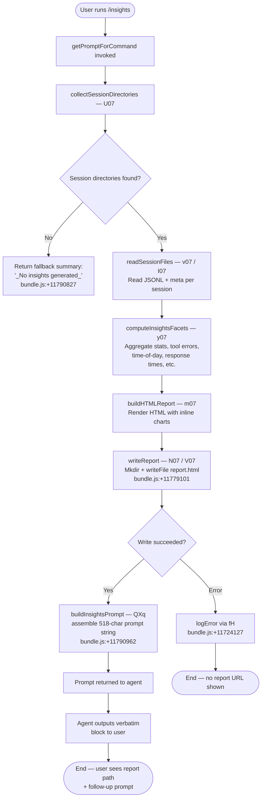

# `/insights`

> Analysis basis: CC v2.1.133 bundle.js (AST extraction + Claude interpretation)
> Minimum version: v2.1.133

---

## Overview

The `/insights` command generates a self-contained HTML usage-analytics report from the user's stored Claude Code session data (JSONL transcripts and facet files), writes it to disk, and instructs the agent to present the report location verbatim to the user. The command operates as a `prompt`-type command: after data collection and HTML generation complete synchronously inside `getPromptForCommand`, a pre-composed prompt string (518 characters) is returned to the agent, which then outputs the `<message>` block without further inference.

---

## Registration

| Field | Value |
|---|---|
| `type` | `prompt` |
| `name` | `insights` |
| `description` | `Generate a report analyzing your Claude Code sessions` |
| `loc_byte` | `11789751` |
| `loc_byte_end` | `11791073` |
| `loc_line` | `8755` |
| `handler_method` | `getPromptForCommand` |
| `handler_method_start` | `11789925` |
| `handler_method_end` | `11791072` |
| `prompt_body.length` | `518` characters |
| `prompt_body.trace` | `call→QXq(...) (1 literals)` |
| `arbor_handler.name` | `getPromptForCommand` |
| `arbor_handler.fqn` | `claude-2.1.133::getPromptForCommand` |
| `arbor_handler.kind` | `Method` |
| `arbor_handler.resolution_path` | `direct` |
| `arbor_handler.n_hits` | `1` |

Analysis basis: CC v2.1.133 bundle.js:+11789751

---

## Input Branching

The command has 3+ distinct execution paths depending on whether session data exists, whether the insights pipeline succeeds, and whether a report URL and HTML file are produced. A Mermaid flowchart is used below.



Analysis basis: CC v2.1.133 bundle.js:+11789931 (handler entry), +11790962 (QXq call), +11790827 (fallback literal)

---

## Behavioral Spec

### 1. Handler Entry — `getPromptForCommand`

The Arbor symbol graph resolves the handler as an ObjectMethod named `getPromptForCommand` located directly inside the registration block (resolution_path: `direct`, n_hits: 1).

```
async function getPromptForCommand(commandContext):
    sessionDirs = await collectSessionDirectories()          // U07
    if sessionDirs is empty:
        return buildInsightsPrompt(null, "_No insights generated_")  // QXq fallback

    sessionRecords = await Promise.all(
        sessionDirs.slice(0, SESSION_LIMIT)                  // _.slice  +11777118
            .map(dir => readSessionData(dir))                // v07
    )

    facets = computeInsightsFacets(sessionRecords)           // y07 → gXq interior
    htmlContent = buildHTMLReport(facets)                    // m07
    reportPath = await writeReportToDisk(htmlContent)        // N07 / V07

    summaryText = buildAtAGlanceSummary(facets)              // S07 → "at_a_glance"
    promptString = buildInsightsPrompt(reportPath, summaryText)  // QXq

    return promptString
```

Analysis basis: CC v2.1.133 bundle.js:+11789931 (handler open), +11777118 (slice), +11790962 (QXq), +11791072 (handler close)

---

### 2. Session Directory Collection — `collectSessionDirectories` (`U07`)

Reads the top-level projects directory and enumerates sub-directories that contain session JSONL files.

```
async function collectSessionDirectories():
    projectsRoot = path.join(dataRoot, "projects")          // literal "projects" +11802784
    entries = await fs.readdir(projectsRoot)                 // Mh.readdir +11776672
    dirs = entries.filter(e => e.isDirectory())             // L.isDirectory +11776740

    results = []
    for dir of dirs:
        jsonlFiles = await listJsonlFiles(dir)               // PP6 +11776830
        if jsonlFiles.length > 0:
            results.push({ dir, files: jsonlFiles })

    await setImmediate()                                     // yield +11776952
    results.sort(...)                                        // q.sort +11776976
    return results
```

Numeric constants observed in `U07` context:
- Minimum directory index: `0` (bundle.js:+11776701)
- Batch sizes `10` and `9` for directory scanning (bundle.js:+11776922, +11776927)

Analysis basis: CC v2.1.133 bundle.js:+11777045 (U07 entry), +11776672 (readdir), +11776952 (setImmediate)

---

### 3. JSONL File Enumeration — `listJsonlFiles` (`PP6`)

Scans a single project directory for `.jsonl` session transcript files and collects their `stat` metadata.

```
async function listJsonlFiles(dirPath):
    entries = await fs.readdir(dirPath)                      // SK.readdir +11853364
    files = entries
        .filter(e => e.isFile())                             // L.isFile +11853441
        .filter(e => matchesJsonlExtension(e))               // ic → DA4.test +11853495
    // extension literal: ".jsonl" +11853470

    fileMetas = new Map()
    await Promise.all(
        files.map(async f =>
            stat = await fs.stat(path.join(dirPath, f))      // SK.stat +11853673
            fileMetas.set(f, stat)                           // A.set +11853684
        )
    )
    return fileMetas
```

Analysis basis: CC v2.1.133 bundle.js:+11853364 (PP6 readdir), +11853470 (".jsonl"), +11853495 (ic regex test)

---

### 4. Session Data Reading — `readSessionData` (`v07`)

Reads a session JSONL file and its associated metadata file, then parses JSON.

```
async function readSessionData(sessionInfo):
    usageDataPath = path.join(sessionInfo.dir, "usage-data")   // literal +11716555
    sessionMetaPath = path.join(sessionInfo.dir, "session-meta") // literal +11716651
    facetsPath = path.join(sessionInfo.dir, "facets")           // literal +11716605

    rawContent = await fs.readFile(usageDataPath, "utf-8")      // Mh.readFile +11722577
                                                                 // literal "utf-8" +11722601
    parsed = parseJsonSafe(rawContent)                           // p6 → JSON.parse +11722618

    metaContent = await readWithFallback(sessionMetaPath)        // mbA → SY8 +11722542
    return { parsed, meta: metaContent, facetsPath }
```

Analysis basis: CC v2.1.133 bundle.js:+11722534 (v07 entry), +11716555 ("usage-data"), +11716651 ("session-meta"), +11716605 ("facets"), +11722601 ("utf-8")

---

### 5. Facets Computation — `computeInsightsFacets` (`y07`)

Aggregates per-session records into report-ready data structures. Covers tool usage, error classification, time-of-day bucketing, response-time histogram, and top-project ranking.

```
function computeInsightsFacets(sessionRecords):
    toolStats = {}           // tool call counts and error rates
    timeOfDay = {            // hour buckets
        "Morning (6-12)": [],   // hours 7,11    +11734063,+11734089,+11734098
        "Afternoon (12-18)": [], // hours 12-17   +11734110
        "Evening (18-24)": [],   // hours 18-23   +11734164
        "Night (0-6)": []        // hours 0-4     +11734216
    }
    responseTimes = {
        "2-10s": 0, "10-30s": 0, "30s-1m": 0,   // literals +11733215–+11733236
        "1-2m": 0,  "2-5m": 0,  "5-15m": 0, ">15m": 0  // literals +11733247–+11733275
    }
    // response-time thresholds (seconds): 120 +11733435, 900 +11733517

    for record of sessionRecords:
        accumulateToolStats(record, toolStats)         // FXq +11728100
        accumulateTimeOfDay(record, timeOfDay)
        accumulateResponseTimes(record, responseTimes)

    topProjects = rankProjects(toolStats)              // b07 +11771550
    atAGlance = buildAtAGlanceSummary(facets)          // S07; literal "at_a_glance" +11730242
    return { toolStats, timeOfDay, responseTimes, topProjects, atAGlance }
```

Session age cutoff: `1800000` ms (30 minutes, bundle.js:+11724470)
Maximum context token budget during facet serialisation: `4096` (bundle.js:+11723976)

Analysis basis: CC v2.1.133 bundle.js:+11725833 (y07 entry), +11730242 ("at_a_glance"), +11724470 (age cutoff), +11723976 (token budget)

---

### 6. HTML Report Generation — `buildHTMLReport` (`m07`)

Renders an inline-HTML report from the computed facets. Applies HTML entity escaping, builds bar/ring charts with inline hex colour literals, and assembles section markup.

```
function buildHTMLReport(facets):
    html = []

    // HTML-escape helper: escapeHtml (Z7 → k5)
    // Escapes &, <, >, ", '  (literals +4167618 – +4167741)

    // Tool usage section — cqH
    toolRows = renderToolRows(facets.toolStats)              // cqH +11770858
    // Chart colours: #2563eb +11770880, #0891b2 +11771018,
    //                #10b981 +11771190, #8b5cf6 +11771333

    // Error section
    errorRows = renderErrorRows(facets.toolStats)
    // No-data placeholder: "<p class=\"empty\">No tool errors</p>" +11774607
    // Error colour: #dc2626 +11774596
    // Success colour: #16a34a +11774845
    // Warning colour: #eab308 +11775338

    // Response-time histogram — b07
    rtSection = renderResponseTimeChart(facets.responseTimes)  // b07 +11771550
    // No-data placeholder: "<p class=\"empty\">No response time data</p>" +11733163

    // Time-of-day section — x07
    todSection = renderTimeOfDayChart(facets.timeOfDay)        // x07 +11774383

    // Markdown-to-HTML for suggestions: bold via "<strong>$1</strong>" +11734921
    // Bullet conversion: "• " +11734964, line-break: "<br>" +11734994

    // "Add to CLAUDE.md" inline action label literal +11738559

    html.push(renderAtAGlance(facets.atAGlance))
    html.push(toolRows, rtSection, todSection, errorRows)

    // Max HTML size cap: 8192 chars for inline content +11732384
    return html.join("")
```

Analysis basis: CC v2.1.133 bundle.js:+11734849 (m07 entry), +11732384 (8192 cap), +11734921 (bold template), +11770880 (chart colours)

---

### 7. Report File Write — `writeReportToDisk` (`N07` / `V07`)

Creates the output directory if needed and writes `report.html`.

```
async function writeReportToDisk(htmlContent, sessionMeta):
    outDir = path.join(dataRoot, sessionMeta.facetsDir)  // yg.join +11722712
    await fs.mkdir(outDir, { recursive: true })           // Mh.mkdir +11722675

    reportFile = path.join(outDir, "report.html")         // literal +11779101
    await fs.writeFile(reportFile, htmlContent, "utf-8")  // Mh.writeFile +11722756

    // JSON.stringify for side-car metadata: SH +11722771
    maxMetaBytes = 384                                     // literal +11722807
    return reportFile
```

Analysis basis: CC v2.1.133 bundle.js:+11722675 (mkdir), +11779101 ("report.html"), +11722756 (writeFile), +11722807 (384 byte meta cap)

---

### 8. Prompt Assembly — `buildInsightsPrompt` (`QXq`)

Constructs the 518-character prompt string that `getPromptForCommand` returns. The prompt:

1. Declares that the user ran `/insights`.
2. Embeds the full insights data payload (report URL, HTML file path, facets directory).
3. Provides an **at-a-glance summary** labelled as context-only (the user has not yet seen any output).
4. Instructs the agent to output the text between `<message>` tags **verbatim**, without omitting any line.
5. The `<message>` block contains the shareable report URL/path and a follow-up question inviting the user to explore sections or suggestions.

The fallback string `"_No insights generated_"` (bundle.js:+11790827) is substituted when no sessions were found or report generation failed.

```
function buildInsightsPrompt(reportPath, atAGlanceSummary):
    if reportPath is null:
        messageBody = "_No insights generated_"   // +11790827
    else:
        messageBody = formatReportLinks(reportPath)

    roundedStat = Math.round(...)                 // __handler_insights +11790317
    separator = " · "                             // literal +11790388

    prompt = interpolateTemplate(
        insightsPromptTemplate,                   // 518-char body via QXq
        { reportPath, atAGlanceSummary, messageBody }
    )
    return prompt
```

Analysis basis: CC v2.1.133 bundle.js:+11790962 (QXq call), +11790827 ("_No insights generated_"), +11790317 (Math.round), +11790388 (" · ")

---

### 9. Transcript Chain Walking — `Tt` / `CY8`

The `gXq` pipeline internally uses `CY8` (session context builder) which calls `Tt` (transcript chain walker). This sub-system reads JSONL transcript entries and resolves parent-child message chains, applying deduplication and cycle detection.

```
function walkTranscriptChain(transcriptEntries):
    visited = new Set()
    for entry of transcriptEntries.values():        // H.values
        if visited.has(entry.uuid): continue        // cycle guard
        visited.add(entry.uuid)

        resolveParent(entry)                        // Gjq — relink walk
        classifyMessage(entry)                      // _xA → XG7, jG7

    // Telemetry fired on anomalies:
    // tengu_transcript_phantom_parent  +11840508
    // tengu_transcript_parent_cycle    +11843920
    // tengu_chain_parent_cycle         +11823697
    // tengu_chain_timestamp_fallback   +11823846
    // tengu_chain_parallel_tr_recovered +11825712
    // tengu_relink_walk_broken         +11822681
```

Analysis basis: CC v2.1.133 bundle.js:+11854114 (CY8→Tt), +11843920 (cycle telemetry), +11840508 (phantom parent telemetry)

---

## State & Side Effects

| Item | Detail |
|---|---|
| **Filesystem writes** | Creates `report.html` under the project's facets output directory (bundle.js:+11779101). Creates directory with `recursive: true` if absent (+11722675). Writes a JSON side-car capped at 384 bytes (+11722807). |
| **Filesystem reads** | Reads `usage-data` (+11716555), `session-meta` (+11716651), and `facets` sub-paths (+11716605) for each discovered session. Reads JSONL transcripts encoded as UTF-8 (+11722601). |
| **Async scheduling** | `setImmediate` is called once after directory enumeration to yield the event loop (+11776952). |
| **Telemetry** | `tengu_transcript_phantom_parent` (+11840508), `tengu_transcript_parent_cycle` (+11843920), `tengu_chain_parent_cycle` (+11823697), `tengu_chain_timestamp_fallback` (+11823846), `tengu_chain_parallel_tr_recovered` (+11825712), `tengu_relink_walk_broken` (+11822681). None of these are specific to `/insights`; they are emitted by the shared transcript-chain walker triggered during session data assembly. |
| **appState changes** | None observed in depth-2 traversal. <!-- TODO: not found in depth-2 traversal; needs --depth 4 --> |
| **Sound** | None observed. |
| **Hook registration** | None observed. |
| **Network** | None. All data is sourced locally from stored session files. |
| **Session limit** | Sessions are sliced before parallel processing; slice start: `0`, observed batch limit constant `50` (bundle.js:+11777064) and `200` (bundle.js:+11777069). |

---

## Version History

| Version | Change |
|---|---|
| v2.1.133 | Initial analysis. Command confirmed present with `prompt`-type registration at bundle.js:+11789751–+11791073. |

---

## Common Mistakes

1. **Expecting streaming output**: `/insights` is a `prompt`-type command. The agent outputs the pre-composed `<message>` block verbatim; there is no iterative generation of report content — the HTML file is written before the prompt is even returned to the model.
2. **Running in a directory with no session history**: If no `.jsonl` files are found under the `projects` directory, the command returns the fallback string `"_No insights generated_"` (bundle.js:+11790827). No `report.html` is written in this case.
3. **Assuming the report URL is a remote URL**: The report is a local HTML file at the path embedded in the `<message>` block. The "Report URL" in the prompt refers to a `file://` or local path, not a hosted service.
4. **Editing `report.html` manually between invocations**: Each invocation of `/insights` unconditionally overwrites `report.html` in the facets output directory (+11722756). Manual edits are lost.
5. **Expecting real-time session data**: The report reflects session files flushed to disk at the time of invocation. In-progress session data not yet persisted to JSONL will not appear.
6. **Misinterpreting the at-a-glance summary in the agent's context**: The prompt explicitly marks the at-a-glance block as "for your context only — the user has not seen any output yet". The user only sees the content within the `<message>` tags.

---

## Appendix — Identifier Mapping

> For bundle debugging only. Identifiers change across versions.

| Identifier | Role |
|---|---|
| `__handler_insights` | Synthetic BFS entry point for the `/insights` command handler (not a real bundle symbol) |
| `gXq` | Core insights pipeline orchestrator — collects sessions, builds facets, writes report |
| `U07` | `collectSessionDirectories` — enumerates project sub-directories containing JSONL files |
| `Jn` | Directory path join helper used inside session enumeration |
| `PP6` | `listJsonlFiles` — scans a single project directory for `.jsonl` files and stats them |
| `ic` | JSONL filename regex matcher (delegates to `DA4.test`) |
| `v07` | `readSessionData` — reads usage-data + session-meta files for a single session |
| `mbA` | `readWithFallback` — reads session-meta with graceful error handling |
| `SY8` | Low-level file reader composing the usage-data path |
| `p6` | `parseJsonSafe` — wraps `JSON.parse` with error protection |
| `gXq` | Top-level insights orchestrator (also entry from `__handler_insights`) |
| `y07` | `computeInsightsFacets` — aggregates per-session records into report structures |
| `FXq` | `accumulateToolStats` — sorts and deduplicates tool usage events |
| `S07` | `buildAtAGlanceSummary` — produces the "at_a_glance" summary block |
| `UXq` | Per-session HTML section renderer used inside `S07` |
| `m07` | `buildHTMLReport` — assembles the full self-contained HTML report string |
| `cqH` | `renderToolRows` — builds the tool-usage table/chart HTML section |
| `b07` | `renderResponseTimeChart` — builds the response-time histogram section |
| `x07` | `renderTimeOfDayChart` — builds the time-of-day usage section |
| `hY8` | Sub-renderer for time-of-day bars |
| `u07` | HTML serialisation helper used by `m07`; delegates to `SH` (JSON.stringify) |
| `Z7` | `escapeHtml` — escapes `&`, `<`, `>`, `"`, `'` for HTML output |
| `k5` | Inner `replaceAll` loop inside `escapeHtml` |
| `N07` | `writeReportToDisk` (primary path) — mkdir + writeFile for `report.html` |
| `V07` | `writeReportToDisk` (alternate/facets path) — same shape as `N07` |
| `I07` | `readCachedFacets` — reads previously written facets JSON, unlinks stale file |
| `RY8` | Facets file path builder |
| `dXq` | Stale-file unlink helper |
| `k07` | `generateInsightsReport` — outer pipeline that calls `OzH` (report renderer) and `BXq` |
| `Z07` | `batchProcessSessions` — fans out session processing with `Promise.all` |
| `G07` | Per-session processor inside the batch; calls `UbA` for stat computation |
| `OzH` | `renderReportHTML` — delegates to `Ff8` and `HVH` for final HTML assembly |
| `Ff8` | Full report HTML builder; computes SHA-1 hash, writes output via `d9H.writeFile` |
| `$8` | UUID generator for report identification |
| `HVH` | Report assembly validator; raises error if no assistant message found |
| `BXq` | `buildInsightsContext` — constructs the context block passed to `k07`; calls `Ek` |
| `Ek` | Context encoder/compressor (delegates to `zM`, `DM`) |
| `NL` | Filter helper applied to assistant messages |
| `QXq` | `buildInsightsPrompt` — constructs the 518-char prompt string returned by `getPromptForCommand` |
| `SH` | `jsonStringify` — thin wrapper around `JSON.stringify` |
| `UbA` | `computeSessionStats` — per-session stat aggregator; calls `j07` and `GM` |
| `j07` | `classifyToolCalls` — classifies tool calls by name (WebSearch, WebFetch, Edit, Write, etc.) |
| `GM` | Summary stats finaliser inside `UbA` |
| `P07` | `isNaNCheck` — guards NaN in numeric stat fields |
| `pbA` | Session progress/metadata accessor inside the pipeline |
| `riH` | `objectEntriesHelper` used in `y07` for iterating stat maps |
| `s9` | Substring/index utility used in facet helpers |
| `B07` | `buildObjectKeysSection` — enumerates object keys for the report |
| `CY8` | `buildSessionContext` — orchestrates transcript chain walking for a single session |
| `Tt` | `walkTranscriptChain` — traverses parent-child JSONL message entries with deduplication |
| `Gjq` | `relinkMessageChain` — re-links broken parent references in transcript |
| `Q1H` | `sortAndDedupMessages` — sorts messages and removes duplicates |
| `mjq` | `insertMessageByTimestamp` — inserts message into sorted structure |
| `wG7` | `findDuplicateMessages` — detects duplicate UUIDs in chain |
| `JG7` | `mergeParallelTranscripts` — merges concurrent transcript branches |
| `DG7` | `queueMessageProcessing` — batches messages for processing |
| `HxA` | `formatMessageContent` — formats message content for facet extraction |
| `Hj6` | `renderMessageBlock` — renders a single message block |
| `_xA` | `classifyMessageType` — dispatches to `XG7` and `jG7` |
| `XG7` | `isImageOrDocumentMessage` — checks for image/document content types |
| `jG7` | `isArrayContentMessage` — checks array-typed content |
| `IQH` | `mapMessageIds` — maps message list to ID array |
| `QY8` | `getCachedMessage` — retrieves a message from internal cache |
| `dY8` | `getMessageArray` — converts map values to array |
| `vG7` | `parseTranscriptFile` — low-level binary JSONL parser using sync file I/O |
| `NG7` | `readTranscriptHeader` — reads first bytes of a JSONL file to detect format |
| `LXH` | `loadProtocolLibrary` — loads pPL/UPL/FPL/BPL protocol modules |
| `fH` | `logErrorWithContext` — error logger (delegates to `yQ.logError`) |
| `HA` | `wrapError` — wraps raw errors with descriptive string |
| `kH` | `stringifyId` — converts identifier to string |
| `M` | MCP connection manager used inside facet pipeline (MCP-adjacent, not insights-specific) |
| `iZH` | MCP client initialiser (MCP-adjacent, reached via `M.push`) |
| `mFq` | MCP update applier (MCP-adjacent) |
| `Og7` | MCP server reconnect orchestrator (MCP-adjacent) |
| `T7` | MCP error logger (MCP-adjacent) |
| `vH` | `toString` coercion helper |
| `DlH` | `formatStatusLabel` (MCP-adjacent) |
| `hI` | MCP cleanup handler |
| `XM8` | MCP state string serialiser |
| `$l9` | MCP status getter |
| `_J6` | `parseIntWithRadix` (radix 3) |
| `fIA` | `parseIntWithRadix` (radix 20) |
| `Yl9` | MCP write-file helper |
| `BZA` | MCP connection broker |
| `kJA` | MCP capability include-checker |
| `gZA` | MCP OAuth flow initiator |
| `QZA` | MCP OAuth callback handler |
| `so4` | MCP timestamp / date helper |
| `G98` | MCP object-keys iterator |
| `K8` | MCP debug logger (pushes to `cyH`, logs via `yQ.logMCPDebug`) |
| `Z9` | Async utility using `w8` |
| `dq` | Report upload / remote delivery helper (reached via `OzH` / `k07`) |
| `GW` | Report post-process helper inside `OzH` |

---

Note: index built via Arbor fallback; some signals (telemetry, literals) may be missing — see arbor-fallback.js.