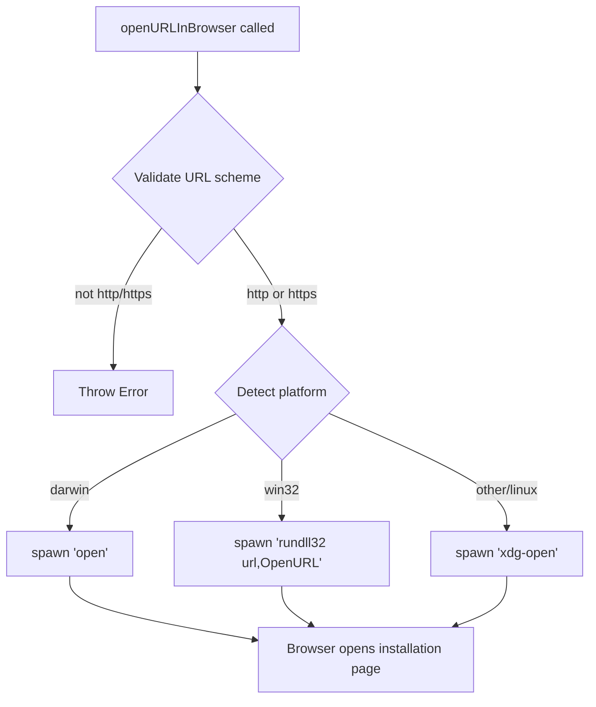

# `/install-slack-app`

> Analysis basis: CC v2.1.133 bundle.js (AST extraction + Claude interpretation)
> Minimum version: v2.1.133

---

## Overview

The `/install-slack-app` command installs the Claude Slack application by opening the Slack app installation page in the user's default browser. It is a lightweight, non-interactive local command that fires a telemetry event, opens the browser to the installation URL, and immediately returns a confirmation text message to the user.

---

## Registration

| Field | Value |
|---|---|
| `type` | `local` |
| `name` | `install-slack-app` |
| `description` | `Install the Claude Slack app` |
| `supportsNonInteractive` | `false` |
| `module_id` | `h8q` |
| `load_inline` | `true` |
| `loc_byte` | `10451815` |
| `loc_byte_end` | `10452001` |
| `loc_line` | `6381` |
| `arbor_handler.name` | `qL7` |
| `arbor_handler.fqn` | `claude-2.1.133::qL7` |
| `arbor_handler.kind` | `AsyncFunction` |
| `arbor_handler.resolution_path` | `module_id` |
| `arbor_handler.n_hits` | `0` |

Analysis basis: CC v2.1.133 bundle.js:+10451815

> **Handler note**: The handler was resolved via `module_id` → `h8q` → export `qL7`. Because `load_inline: true` is set, the module is inlined as `Promise.resolve({call: qL7})` rather than lazily required. The Arbor symbol graph confirms `qL7` as an `AsyncFunction` at `claude-2.1.133::qL7`.

---

## Input Branching

This command has a simple linear flow with no user-input branches (it takes no arguments). A numbered pseudocode list is used.

1. User invokes `/install-slack-app` (no arguments expected).
2. Handler `qL7` fires immediately — no argument parsing occurs.
3. Telemetry event `tengu_install_slack_app_clicked` is emitted.
4. The config-persisting helper (`saveConfigWithLock` / `e6`) is called to record any relevant state.
5. The URL-open helper (`openURL` / `ML`) is called to launch the browser.
6. A text message `"Opening Slack app installation page in browser…"` is returned to the CLI output.

Analysis basis: CC v2.1.133 bundle.js:+10451419, +10451459, +10451534, +10451554, +10451567

---

## Behavioral Spec

### 1. Main Handler — `qL7` (AsyncFunction)

```
async function installSlackAppHandler(context):
    // Step 1: fire click telemetry
    emitTelemetry("tengu_install_slack_app_clicked")          // +10451421

    // Step 2: persist any pending config changes (via saveConfigWithLock)
    await saveConfigWithLock(context)                          // +10451459

    // Step 3: open the installation URL in the default browser
    await openURLInBrowser(SLACK_INSTALL_URL)                  // +10451534

    // Step 4: return confirmation message to the user
    return {
        type: "text",                                          // +10451554
        content: "Opening Slack app installation page in browser…"  // +10451567
    }
```

Analysis basis: CC v2.1.133 bundle.js:+10451419

---

### 2. Config Save with Lock — `e6` (saveConfigWithLock)

The handler delegates to `e6`, which in turn calls `fe8` (the core locked-write routine). The high-level behavior is:

```
async function saveConfigWithLock(context):
    acquire filesystem lock (with timeout)
    if lock contention detected:
        emit "tengu_config_lock_contention"                   // +3111273
        warn: "Lock acquisition took longer than expected…"   // +3111184

    re-read config from disk
    if re-read config is missing auth that in-memory cache has:
        emit "tengu_config_auth_loss_prevented"               // +3111752
        log: "saveConfigWithLock: re-read config is missing auth…"  // (fragment "saveConfigWithLock: re-read")
        refuse write to avoid wiping credentials
        return

    if stale-write condition detected:
        emit "tengu_config_stale_write"                       // +3111409

    write updated config to disk atomically
    release lock
```

Key constants observed in this path:
- Lock wait warning string: `"Lock acquisition took longer than expected - another Claude instance may be running"` (bundle.js:+3111184)
- File-not-found sentinel: `"ENOENT"` (bundle.js:+3111539)
- Config encoding: `"utf-8"` (bundle.js:+3113300)
- Auth-loss guard message fragment: `"saveConfigWithLock: re-read"` (bundle.js:+3111600)
- Maximum backup copies retained: `5` (bundle.js:+3112203)
- Backup directory name: `"backups"` (bundle.js:+3112785)
- Backup filename marker: `".backup."` (bundle.js:+3112070)
- Lock-file timeout: `60000` ms (bundle.js:+3111954)
- Temp-file permission bits: `384` (octal `0o600`) (bundle.js:+3112485)

Analysis basis: CC v2.1.133 bundle.js:+3108275

---

### 3. URL Opener — `ML` (openURLInBrowser)

```
async function openURLInBrowser(url):
    validate url scheme:
        if not "http:" or "https:":                           // +7365727, +7365749
            throw Error                                       // +7365677

    detect platform (process.platform):
        case "darwin":                                        // +7365999
            spawn "open" <url>                                // +7366173
        case "win32":                                         // +7366015
            spawn "rundll32" "url,OpenURL" <url>              // +7366099, +7366111
        default (linux/other):
            spawn "xdg-open" <url>                            // +7366180
```

Analysis basis: CC v2.1.133 bundle.js:+10451534, +7365964



Analysis basis: CC v2.1.133 bundle.js:+7365964, +7366048

---

### 4. Atomic Config Write — `fe8` (atomicWriteConfig)

The locked write uses a temporary file with random suffix (6 random bytes as hex), applies original file permissions, fsyncs, then renames atomically:

```
function atomicWriteConfig(targetPath, data):
    tmpPath = targetPath + "." + randomBytes(6).toString("hex")  // +953963, +953991
    fd = fs.openSync(tmpPath, ...)                               // +953497
    fs.writeFileSync(tmpPath, data)                              // +954399
    originalMode = fs.statSync(targetPath).mode                  // +954028
    fs.fchmodSync(fd, originalMode)                              // +954457
    log("Applied original permissions to temp file")             // +954478
    fs.fsyncSync(fd)                                             // +954523
    fs.closeSync(fd)                                             // +953484
    fs.renameSync(tmpPath, targetPath)                           // +954651
    if tmpPath still exists:
        fs.unlinkSync(tmpPath)                                   // +954808
```

Analysis basis: CC v2.1.133 bundle.js:+3110973

---

### 5. Config Parse Helper — `m5H` (readAndParseConfig)

```
function readAndParseConfig(filePath):
    if not initialized:
        throw Error("Config accessed before allowed.")          // +3113217
    raw = fs.readFileSync(filePath, "utf-8")                    // +3113273, +3113300
    parsed = JSON.parse(raw)                                    // (via p6 / +144287)
    if parse error:
        emit "tengu_config_parse_error"                         // +3113854
    return parsed
```

Analysis basis: CC v2.1.133 bundle.js:+3111562

---

## State & Side Effects

| Item | Detail |
|---|---|
| **Telemetry** | `tengu_install_slack_app_clicked` (+10451421) — emitted on every invocation of `/install-slack-app` |
| **Telemetry (config path)** | `tengu_config_lock_contention` (+3111273), `tengu_config_stale_write` (+3111409), `tengu_config_parse_error` (+3113854), `tengu_config_auth_loss_prevented` (+3111752) — emitted only on config-write edge cases |
| **Telemetry (bg session path)** | `tengu_bg_dispatch_sigkill_escalate`, `tengu_bg_dispatch_low_mem`, `tengu_bg_spare_enable`, `tengu_bg_spare_claim`, `tengu_bg_spare_claim_fail`, `tengu_bg_spare_spawn` — emitted by the background-session dispatcher reached via the call graph but not triggered by this command in normal operation |
| **Filesystem** | Potentially writes/updates `~/.claude.json` (config file) via the locked-write path; creates `backups/` subdirectory with up to 5 rotating `.backup.` copies |
| **Process spawn** | Spawns one external process (`open`, `rundll32`, or `xdg-open`) to open the browser |
| **appState changes** | <!-- TODO: not found in depth-2 traversal; needs --depth 4 --> |
| **Hook registration** | None observed in this command's direct call graph |
| **Sound** | None |
| **Return value** | `{ type: "text", content: "Opening Slack app installation page in browser…" }` — displayed immediately to the user |
| **supportsNonInteractive** | `false` — this command must run in an interactive session |

---

## Version History

| Version | Change |
|---|---|
| v2.1.133 | Initial analysis — command confirmed present; handler `qL7` resolved via `module_id: h8q`; telemetry event `tengu_install_slack_app_clicked` confirmed |

---

## Common Mistakes

1. **Running in non-interactive mode**: `supportsNonInteractive` is `false`. Attempting to invoke `/install-slack-app` from a headless/scripted pipeline will fail or be silently ignored.
2. **No browser available**: On headless Linux servers without a desktop environment, `xdg-open` may fail silently or return an error because there is no default browser registered. The command does not fall back or surface this error clearly.
3. **Expecting a URL in the output**: The command prints only the message `"Opening Slack app installation page in browser…"` — it does not print the target URL. Users who need the URL (e.g., for copy-paste into a remote browser) must obtain it independently.
4. **Assuming the config write is a no-op**: The handler calls the full `saveConfigWithLock` path. Under high concurrency (multiple Claude instances running simultaneously), this can emit `tengu_config_lock_contention` and temporarily block for up to the lock timeout of 60,000 ms (bundle.js:+3111954).
5. **Mistaking this for a reversible operation**: There is no `/uninstall-slack-app` command in this version. The command solely opens an external browser page; actual installation state is managed by Slack/Anthropic infrastructure, not the CLI.

---

## Appendix — Identifier Mapping

> For bundle debugging only. Identifiers change across versions.

| Identifier | Role |
|---|---|
| `qL7` | Main async handler for `/install-slack-app` (AsyncFunction, resolved via `module_id: h8q`) |
| `d` | Telemetry emit helper — records `tengu_*` events |
| `e6` | `saveConfigWithLock` — persists config with filesystem locking |
| `fe8` | `atomicWriteConfig` — core locked-write routine; handles backup rotation, temp-file rename |
| `A` | Filesystem abstraction (read operations) |
| `F6` | Path resolution / join utility |
| `K` | Filesystem abstraction (write/stat operations), also lock-set manager |
| `q` | Secondary filesystem abstraction (readFileSync, statSync, etc.) |
| `f` | File handle / stream close helper |
| `ql_` | Config object merge/update helper (uses `Object.assign`) |
| `jQ8` | Config schema validator or transformer |
| `k` | HTTP request builder (constructs and dispatches HTTP calls) |
| `Ztq` | HTTP transport layer (calls `aT`, `Ttq`, `xcA`) |
| `H` | Jitter/retry scheduler (uses `Math.random`, `setTimeout`) |
| `SH` | JSON serialization helper (wraps `JSON.stringify`) |
| `Uf` | URL path builder / normalizer |
| `LkH` | URL encoding utility |
| `vtq` | HTTP response stream handler / body reader |
| `w8` | Error factory / error-code normalizer |
| `m5H` | `readAndParseConfig` — reads and JSON-parses the config file |
| `p6` | JSON parse wrapper (wraps `JSON.parse`) |
| `nh` | String prefix-strip utility (uses `startsWith` / `slice`) |
| `PX1` | Directory walker / backup-file locator |
| `fH` | Error logger (calls `yQ.logError`, pushes to error list) |
| `Me8` | Path join + normalization helper |
| `w` | Background session dispatcher / process manager |
| `lq6` | Auth-loss guard checker |
| `_` | String lowercasing utility |
| `Z` | Config section accessor (uses `startsWith`) |
| `P` | MCP connection manager (handles `sdk`/`http`/`sse`/`dynamic` transports) |
| `jP8` | MCP transport factory |
| `HA` | Error-wrapping helper (wraps raw errors with `String()`) |
| `I` | Array/buffer slicer |
| `KhH` | Atomic file write with locking (random temp name, fchmod, fsync, rename) |
| `O` | File stat/symlink checker |
| `D8` | Error code extractor |
| `fxH` | Config read pre-check helper |
| `jX1` | Config entry iterator (uses `Object.entries`) |
| `MxH` | Timestamp recorder for config operations (uses `Date.now`) |
| `Ke8` | Config backup writer |
| `ML` | `openURLInBrowser` — detects platform and spawns appropriate URL-open command |
| `rG4` | URL scheme validator (checks `http:`/`https:`) |
| `Y8` | Browser-open orchestrator (calls `GA`, `N6`) |
| `GA` | Platform-specific spawn wrapper for browser open |
| `sJH` | Child-process spawn helper with event binding |
| `Y` | Background spare-session lifecycle manager |
| `qPL` | Process output string coercer |
| `N6` | Async-local-storage context accessor for session |
| `zN6` | Store reader (`ON6.getStore`) |
| `LA` | Session context fallback provider |

---

Note: index built via Arbor fallback; some signals (telemetry, literals) may be missing — see arbor-fallback.js.