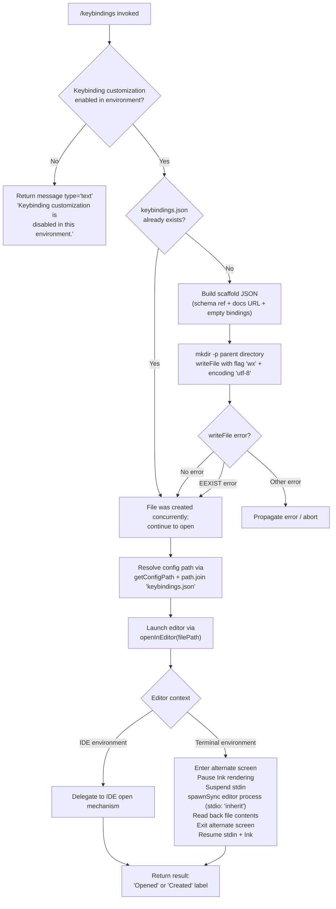

# `/keybindings`

> Analysis basis: CC v2.1.133 bundle.js (AST extraction + Claude interpretation)
> Minimum version: v2.1.133

---

## Overview

The `/keybindings` command opens or creates the user's `keybindings.json` configuration file in the system's default editor. When the file does not yet exist, the command generates a JSON scaffold (with a JSON Schema reference and documentation link) before launching the editor. If keybinding customization has been administratively disabled in the current environment, the command exits early with an informational message instead of opening any file.

---

## Registration

| Field | Value |
|---|---|
| type | `local` |
| name | `keybindings` |
| description | `Open or create your keybindings configuration file` |
| supportsNonInteractive | `false` |
| module\_id | `N6q` |

Analysis basis: CC v2.1.133 bundle.js:+10400044

---

## Input Branching

The command handler (`commandHandler`) follows three high-level paths depending on environment state and file existence.



Analysis basis: CC v2.1.133 bundle.js:+10399438, +10399552, +10399603, +10399619, +10399667, +10399714

---

## Behavioral Spec

### 1. Environment Guard

Before any file I/O, the command checks whether keybinding customization is permitted in the current environment.

```
function checkCustomizationEnabled(appContext):
    featureFlags = resolveFeatureFlags(appContext)   // calls checkFeatureEnabled
    if NOT featureFlags.keybindingCustomizationEnabled:
        return earlyExit(
            type  = "text",
            text  = "Keybinding customization is disabled in this environment."
        )
    // otherwise continue
```

- Return type is `"text"` when the guard fires.
  Analysis basis: CC v2.1.133 bundle.js:+10399455, +10399468

### 2. Config-Path Resolution

The config path is resolved by joining the platform config directory with the literal filename `"keybindings.json"`.

```
function resolveKeybindingsPath(configDir):
    parts = getConfigPathSegments(configDir)   // getConfigPath helper
    parts.append("keybindings.json")
    return path.join(...parts)
```

Analysis basis: CC v2.1.133 bundle.js:+3609051, +3609065

### 3. Scaffold Generation

When the file does not yet exist, a JSON object is built and serialised before being written to disk.

```
function buildScaffold(existingBindings):
    doc = {
        "$schema": "https://www.schemastore.org/claude-code-keybindings.json",
        "documentation": "https://code.claude.com/docs/en/keybindings",
        "bindings": mergeBindings(existingBindings)
    }
    // mergeBindings iterates default binding map via $K6.map,
    // filters with A.has, enumerates Object.entries / Object.keys
    return JSON.stringify(doc, null, 2)   // indented 2 spaces
```

- Schema URL: `https://www.schemastore.org/claude-code-keybindings.json`
  Analysis basis: CC v2.1.133 bundle.js:+10399191
- Documentation URL: `https://code.claude.com/docs/en/keybindings`
  Analysis basis: CC v2.1.133 bundle.js:+10399256
- Indent level constant: `2`
  Analysis basis: CC v2.1.133 bundle.js:+10399338
- Serialisation via `JSON.stringify`
  Analysis basis: CC v2.1.133 bundle.js:+143548

### 4. File Creation

The scaffold is written with exclusive creation semantics so that a concurrent writer wins gracefully.

```
function createKeybindingsFile(filePath, content):
    parentDir = path.dirname(filePath)
    fs.mkdir(parentDir, { recursive: true })        // flag value 1 = recursive
    try:
        fs.writeFile(filePath, content, {
            encoding: "utf-8",
            flag:     "wx"                          // exclusive create; fails if exists
        })
    catch error:
        if error.code == "EEXIST":
            pass   // another process created it; treat as success
        else:
            raise error
```

- `recursive` flag numeric value: `1`
  Analysis basis: CC v2.1.133 bundle.js:+10399544
- Encoding: `"utf-8"`
  Analysis basis: CC v2.1.133 bundle.js:+10399635
- Write flag: `"wx"` (exclusive creation)
  Analysis basis: CC v2.1.133 bundle.js:+10399648
- EEXIST suppression
  Analysis basis: CC v2.1.133 bundle.js:+10399675

### 5. Editor Launch

The resolved file path is handed off to `openInEditor`, which dispatches on IDE vs. terminal context.

```
function openInEditor(filePath, environment):
    if environment == "IDE":
        delegateToIdeOpenHandler(filePath)
        return

    // Terminal path
    tui.enterAlternateScreen()
    tui.pause()                    // pause Ink renderer
    tui.suspendStdin()

    editorCmd = resolveEditorCommand()          // inspects $EDITOR / $VISUAL / fallback
    args      = buildEditorArgs(editorCmd)      // split + slice editor string
    spawnSync(editorCmd, args + [filePath], { stdio: "inherit" })

    updatedContent = fs.readFileSync(filePath)

    tui.exitAlternateScreen()
    tui.resumeStdin()
    tui.resume()                   // resume Ink renderer

    return updatedContent
```

- IDE detection literal: `"IDE"`
  Analysis basis: CC v2.1.133 bundle.js:+5039804
- `stdio` option: `"inherit"`
  Analysis basis: CC v2.1.133 bundle.js:+10338777
- Ink pause/resume sequence: `enterAlternateScreen` → `pause` → `suspendStdin` / `exitAlternateScreen` → `resumeStdin` → `resume`
  Analysis basis: CC v2.1.133 bundle.js:+10338623, +10338653, +10338663, +10339125, +10339154, +10339170
- Error thrown when Ink instance is absent: `"Ink instance not found - cannot pause rendering"`
  Analysis basis: CC v2.1.133 bundle.js:+10338470
- `spawnSync` used (blocking call)
  Analysis basis: CC v2.1.133 bundle.js:+10338745
- File read-back after editor exits via `readFileSync`
  Analysis basis: CC v2.1.133 bundle.js:+10339047

### 6. Result Label

After the editor session completes, the command returns a label indicating whether a new file was created or an existing one was opened.

```
function buildResultLabel(wasCreated):
    if wasCreated:
        return "Created"
    else:
        return "Opened"
```

- `"Opened"` literal
  Analysis basis: CC v2.1.133 bundle.js:+10399761
- `"Created"` literal
  Analysis basis: CC v2.1.133 bundle.js:+10399770

### 7. Keybinding Feature-Flag Check Detail

The feature-flag lookup (`checkFeatureEnabled`) is called early in the execution flow and emits a telemetry event on each invocation.

```
function checkFeatureEnabled(featureName, context):
    emit("tengu_keybinding_customization_release", { feature: featureName })
    result = featureFlagRegistry.has(featureName)
              ? featureFlagRegistry.get(featureName)
              : resolveDefault(featureName)
    return result
```

Analysis basis: CC v2.1.133 bundle.js:+3608548, +3091299, +3091336, +3091371, +3091388, +3091399, +3091411, +3091425, +3091442, +3091462

---

## State & Side Effects

| Item | Detail |
|---|---|
| Telemetry | `tengu_keybinding_customization_release` — fired during feature-flag resolution (CC v2.1.133 bundle.js:+3608551) |
| File system writes | Creates `keybindings.json` (with parent directories) if absent; uses exclusive `"wx"` flag |
| File system reads | Reads back file contents after editor process exits (`readFileSync`) |
| TUI state | Enters alternate screen, pauses Ink rendering, and suspends stdin while the editor is running; fully restored afterward |
| Process spawning | Blocks via `spawnSync` with `stdio: "inherit"` for the duration of the editor session |
| appState changes | <!-- TODO: not found in depth-2 traversal; needs --depth 4 --> |
| Sound | <!-- TODO: not found in depth-2 traversal; needs --depth 4 --> |
| Hook registration | <!-- TODO: not found in depth-2 traversal; needs --depth 4 --> |

---

## Version History

| Version | Change |
|---|---|
| v2.1.133 | Initial analysis — command registered as `local`, scaffold generation with JSON Schema URL, exclusive-write file creation, IDE/terminal editor dispatch |

---

## Common Mistakes

1. **Running in non-interactive mode**: `supportsNonInteractive` is `false`; invoking `/keybindings` from a script or pipe will fail or be silently skipped because the TUI pause/resume sequence requires an interactive terminal.
2. **Assuming the file always pre-exists**: The command creates `keybindings.json` on first use, including any missing parent directories. Do not manually place a file with restricted permissions in that location, or the `"wx"` write will fail with a non-`EEXIST` error and the command will abort.
3. **Editing the file while the command is running**: The file content is read back by Claude Code _after_ the editor process exits. External modifications made after the editor opens but before it closes will be captured; modifications made after the editor closes will not be reflected in the session.
4. **Expecting IDE behaviour in a terminal session**: The `"IDE"` detection branch delegates to a separate handler. In a plain terminal session, the full alternate-screen / `spawnSync` path is used. Mixing IDE and terminal contexts (e.g., running CC inside an IDE terminal) may result in unexpected TUI transitions.
5. **Ignoring the disabled-environment message**: If the environment has keybinding customization disabled, the command returns a plain text message and performs no file I/O. This is not an error state and will not appear in the error log.

---

## Appendix — Identifier Mapping

> For bundle debugging only. Identifiers change across versions.

| Identifier | Role |
|---|---|
| `dq7` | Top-level command handler function for `/keybindings` |
| `mx` | Feature-flag check wrapper (calls `checkFeatureEnabled` logic) |
| `J6` | Core feature-flag resolution function (registry lookup + default resolution) |
| `gAH` | Config-path builder (joins path segments, appends `keybindings.json`) |
| `I6q` | Scaffold builder orchestrator (calls binding merger and serialiser) |
| `Qq7` | Binding map merger (iterates defaults via `map`, `Object.entries`, `Object.keys`) |
| `SH` | JSON serialisation wrapper (delegates to `JSON.stringify`) |
| `w8` | EEXIST error-code comparator / write-error filter |
| `km` | Editor launch function (IDE/terminal dispatch, TUI lifecycle, `spawnSync`) |
| `F6` | Ink instance retrieval helper |
| `A` | Node `fs` module reference (used for `statSync`, `readFileSync`, `spawnSync` context) |
| `Mq7` | Ink pause pre-flight check (throws if Ink instance absent) |
| `_` | Ink/TUI controller object (`enterAlternateScreen`, `pause`, `suspendStdin`, `exitAlternateScreen`, `resumeStdin`, `resume`) |
| `K` | Active-process registry manager (`q.add` / `q.delete` around editor lifecycle) |
| `f` | Editor child-process handle (`close`, `finally` cleanup) |
| `jJ` | Editor command resolver (inspects environment, lowercases editor name, resolves basename) |