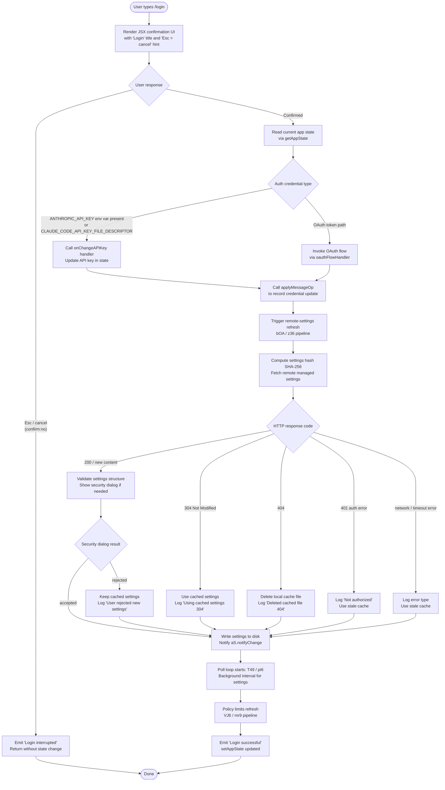

# `/login`

> Analysis basis: CC v2.1.133 bundle.js (AST extraction + Claude interpretation)
> Minimum version: v2.1.133

---

## Overview

The `/login` command allows a user to switch Anthropic accounts or sign in with an Anthropic account from within a running Claude Code session. It presents an interactive JSX-based confirmation UI, initiates the OAuth flow, manages API key transitions, and synchronises application state and remote-managed settings upon completion.

---

## Registration

| Field | Value |
|---|---|
| type | `local-jsx` |
| name | `login` |
| description | `"Switch Anthropic accounts \| Sign in with your Anthropic account"` |
| module_id | `WZ9` |
| load_inline | `true` |
| loc_byte | `10400262` |
| loc_byte_end | `10400495` |
| loc_line | `6233` |
| arbor_handler.name | `S6q` |
| arbor_handler.fqn | `claude-2.1.133::S6q` |
| arbor_handler.kind | `Function` |
| arbor_handler.resolution_path | `direct` (symbol falls within the registration byte range) |
| arbor_handler.n_hits | `2` |

Analysis basis: CC v2.1.133 bundle.js:+10400262

---

## Input Branching

The command exhibits more than three distinct execution branches (confirmation accepted, confirmation cancelled/interrupted, API-key change path, OAuth token path, remote-settings refresh path), so a Mermaid flowchart is used.



Analysis basis: CC v2.1.133 bundle.js:+7994629, +7994629, +6576495, +6574720, +9784262

---

## Behavioral Spec

### 1. JSX Shell and Confirmation Gate

The top-level render function (`$y4` / `xOH`) creates a React element tree. It renders a confirmation component titled `"Login"` with an `"Esc"` / `"cancel"` affordance and a `"confirm:no"` sentinel value.

```
function loginCommandShell(props):
    state = useAppState()
    onDone = props.onDone

    return createElement(ConfirmationWidget, {
        title: "Login",
        escLabel: "Esc",
        cancelValue: "confirm:no",
        onConfirm: (result) =>
            if result == "confirm:no":
                emitStatusMessage("Login interrupted")
                onDone()
                return
            runLoginFlow(state, onDone)
    })
```

Analysis basis: CC v2.1.133 bundle.js:+7995349, +7995373, +7995391, +7995328, +7995074, +7995093

---

### 2. Login Flow Orchestration (`xL8`)

The main login flow handler (obfuscated: `xL8`) sequences the credential update, state sync, and remote-settings refresh.

```
async function loginFlowOrchestrator(appState, onDone):
    // 1. Record message operation for credential change
    applyMessageOp(appState, { kind: "update" })          // loc +7994648, +7994671

    // 2. Trigger remote-managed settings refresh
    refreshRemoteSettings()                                // z36 pipeline, loc +7994710

    // 3. Start OAuth / API-key exchange
    initiateOAuthOrKeyExchange(appState)                   // iz6 pipeline, loc +7994716

    // 4. Reload permission / auto-mode state
    reloadPermissionState(appState)                        // dz6, loc +7994810

    // 5. Reload session configuration
    reloadSessionConfig(appState)                          // cz6, loc +7994872

    // 6. Persist updated app state
    setAppState(appState)                                  // loc +7994926

    emitStatusMessage("Login successful")                 // loc +7995074
    onDone()
```

Analysis basis: CC v2.1.133 bundle.js:+7994629, +7994648, +7994710, +7994716, +7994810, +7994872, +7994926

---

### 3. API Key / OAuth Credential Handling (`xL8` → `onChangeAPIKey`, `iz6`)

When an API key change is detected the handler (`xL8`) calls `H.onChangeAPIKey`. The credential resolution logic (`_O`) checks, in priority order:

```
function resolveCredential(env):
    if env["ANTHROPIC_API_KEY"] is set:               // loc +2874043
        return { type: "api_key", value: env["ANTHROPIC_API_KEY"] }

    if env["CLAUDE_CODE_API_KEY_FILE_DESCRIPTOR"] is set:   // loc +1997795
        fd = parseInt(env["CLAUDE_CODE_API_KEY_FILE_DESCRIPTOR"])
        return { type: "api_key", value: readFromFd(fd) }   // loc +1997783

    if oauthToken is set:
        return { type: "oauth", value: oauthToken }    // loc +9782713

    raise Error("ANTHROPIC_API_KEY or CLAUDE_CODE_OAUTH_TOKEN env var is required")
                                                       // loc +2874464
```

Known credential type strings: `"api_key"` (bundle.js:+9782703), `"oauth"` (bundle.js:+9782713).

---

### 4. Remote-Managed Settings Refresh Pipeline (`z36` → `bOA`)

After a credential change, the settings-fetch pipeline is triggered unconditionally. The pipeline logs `"Remote settings: Refreshed after auth change"` (bundle.js:+6576585).

```
async function refreshRemoteSettingsAfterAuth(currentSettings):
    // Build request headers including User-Agent and If-None-Match ETag
    headers = buildHeaders(currentSettings)             // loc +6572984, +6573010

    // Compute SHA-256 hash of current settings for cache validation
    hash = sha256(serialize(currentSettings))           // loc +6572176, +6572161

    response = await httpGet(remoteSettingsEndpoint, headers, timeout=10000)

    switch response.statusCode:
        case 200, 201:
            validate(response.body)                     // loc +6573522, +6573760
            if securityDialogRequired(response.body):
                result = await showSecurityDialog()     // tengu_managed_settings_security_dialog_shown
                if result == "rejected":
                    log("Remote settings: User rejected new settings, using cached settings")
                    return cachedSettings               // loc +6575481
            writeSettingsToDisk(response.body)          // loc +6574364, +6574399
            notifyChange()                              // aS.notifyChange, loc +6576997
            log("Remote settings: Applied new settings successfully")  // loc +6575611

        case 304:
            log("Remote settings: Using cached settings (304)")        // loc +6573164
            return cachedSettings

        case 404:
            deleteLocalCacheFile()                      // xGH.unlink, loc +6575760
            log("Remote settings: Deleted cached file (404 response)") // loc +6575776

        case 401:
            log("Not authorized for remote settings")                  // loc +6574061

        default:
            log("remote_managed_settings_unexpected")                  // loc +6576077
            useStaleCacheIfAvailable()
```

HTTP status codes observed: 200 (bundle.js:+6573104), 204 (bundle.js:+6573113), 304 (bundle.js:+6573122), 404 (bundle.js:+6573131).

---

### 5. Policy Limits Fetch (`iz6` → `VJ6` → `mr9`)

Immediately after the credential exchange the policy-limits pipeline refreshes. It logs `"Policy limits: Refreshed after auth change"` (bundle.js:+9784336).

```
async function refreshPolicyLimits(authContext):
    data = readPolicyLimitsFile()                       // ur9 / br9.readFileSync, loc +9782221
    hash = computeHash(data)                            // MH7 / Cr9.createHash, loc +9779993

    response = await fetchPolicyLimits(authContext, ifNoneMatchHash=hash)

    // Retry with exponential backoff
    backoffDelay = calculateBackoff(attempt,
        base=32000,                                     // loc +9774524
        multiplier=0.25,                                // loc +9774587
        maxAttempts=10)                                 // loc +9774617

    switch response:
        case 200 / new content:
            applyNewRestrictions()
            log("Policy limits: Applied new restrictions successfully") // loc +9783312
            emit telemetry("tengu_policy_limits_fetch", { authType, ... })

        case 304:
            log("Policy limits: Cache still valid (304 Not Modified)") // loc +9783158

        case stale cache fallback:
            log("Policy limits: Using stale cache after fetch failure") // loc +9782989
            emit telemetry with outcome="stale_cache_used"             // loc +9783055

        case unexpected error:
            emit telemetry with outcome="unexpected_error"             // loc +9783536

    // Start background polling interval
    startPollingInterval(policyLimitsPollHandler)       // pi6 / setInterval, loc +3994860
```

Analysis basis: CC v2.1.133 bundle.js:+9784262, +9782743, +9780888

---

### 6. Background Poll Registration (`T49` / `XM4` / `pi6`)

After successful login, both the remote-managed settings and the policy-limits subsystems register background polling intervals.

```
function registerBackgroundPolls(settingsContext, policyContext):
    settingsPollId = setInterval(
        () => pollSettingsAndNotify(settingsContext),   // XM4 → bOA, loc +6576904
        pollInterval                                   // <!-- TODO: not found in depth-2 traversal; needs --depth 4 -->
    )

    policyPollId = setInterval(
        () => pollPolicyLimits(policyContext),          // Ur9 → JH7 → mr9, loc +9784516
        pollInterval
    )

    // Both intervals are clearInterval-safe on session teardown
    registerCleanup(() => {
        clearInterval(settingsPollId)                  // loc +3994928
        clearInterval(policyPollId)
    })
```

Analysis basis: CC v2.1.133 bundle.js:+6577079, +6577095, +9784681

---

### 7. Session Teardown on Re-Login (`A2H` / `AxH`)

Before new credentials are accepted, the existing session is torn down:

```
function teardownCurrentSession():
    process.off("exit")                                // loc +3092210
    clearAllSubscriptionSets()                         // b5H.clear, pq6.clear, Ut8.clear, cU.clear
                                                       // loc +3092329–3092365
    clearTimers()                                      // nt8 → clearInterval, loc +3092855
    removeProcessListeners()                           // process.removeListener, loc +3092890
    emitTeardownEvent()                                // HxH.emit, loc +3092082
```

Analysis basis: CC v2.1.133 bundle.js:+3092060, +3092076, +3092082

---

### 8. Security Dialog for Remote Managed Settings (`w49`)

When newly fetched remote settings differ from the locally cached copy a security confirmation dialog is shown to the user:

```
function showRemoteSettingsSecurityDialog(newSettings, cachedSettings):
    emit telemetry("tengu_managed_settings_security_dialog_shown")   // loc +6570054

    result = await showSecurityConfirmation(newSettings)

    if result == "approved":                           // loc +6570138
        emit telemetry("tengu_managed_settings_security_dialog_accepted") // loc +6570149
        return "approved"

    if result == "rejected":
        emit telemetry("tengu_managed_settings_security_dialog_rejected") // loc +6570199
        return "rejected"
```

Security-check event string: `"remote_managed_settings_security_check"` (bundle.js:+6570271).

---

### 9. Trusted-Device Enrollment (`F$A`)

After OAuth succeeds (macOS `"darwin"` platform, bundle.js:+6459084), the command attempts trusted-device enrollment:

```
async function enrollTrustedDevice(oauthToken, appState):
    if env["CLAUDE_TRUSTED_DEVICE_TOKEN"] is set:
        log("[trusted-device] CLAUDE_TRUSTED_DEVICE_TOKEN env var is set, skipping enrollment")
        return                                         // loc +6458452

    if not oauthToken:
        log("[trusted-device] No OAuth token, skipping enrollment")
        return                                         // loc +6458795

    if isEssentialTrafficOnly():
        log("[trusted-device] Essential traffic only, skipping enrollment")
        return                                         // loc +6458880

    await waitForPolicyLimitsToLoad()                  // loc +6458591

    if not isPolicyAllowed():                          // loc +6458622
        return

    response = await httpPost(enrollmentEndpoint, {
        headers: { "Content-Type": "application/json" },// loc +6459134
        timeout: 10000,                                 // loc +6459177
        retries: 500                                    // loc +6459203
    })

    emit telemetry("bridge_trusted_device_enroll", { outcome })  // loc +6459279

    if response.statusCode != 201:                     // loc +6459365
        emit telemetry with outcome="http_error"       // loc +6459484
        return

    if not response.body.device_token:
        log("[trusted-device] Enrollment response missing device_token field")
        emit with outcome="missing_token"              // loc +6459663
        return

    persistDeviceToken(response.body.device_token)    // q.update / uH, loc +6459867
```

Analysis basis: CC v2.1.133 bundle.js:+6458067, +6458238, +6458989

---

## State & Side Effects

| Item | Detail |
|---|---|
| Telemetry — `tengu_feature_ok` | Fired when a feature flag check succeeds (bundle.js:+907381) |
| Telemetry — `tengu_feature_bad` | Fired when a feature flag check fails (bundle.js:+907437) |
| Telemetry — `tengu_feature_sad` | Fired on an unexpected feature flag state (bundle.js:+907507) |
| Telemetry — `tengu_managed_settings_security_dialog_shown` | Remote-settings security dialog displayed (bundle.js:+6570054) |
| Telemetry — `tengu_managed_settings_security_dialog_accepted` | User accepted new remote settings (bundle.js:+6570149) |
| Telemetry — `tengu_managed_settings_security_dialog_rejected` | User rejected new remote settings (bundle.js:+6570199) |
| Telemetry — `tengu_slate_kestrel` | Policy-limits subsystem event (bundle.js:+9780268) |
| Telemetry — `tengu_policy_limits_fetch` | Fired after each policy-limits HTTP fetch (bundle.js:+9782782) |
| Telemetry — `tengu_disable_bypass_permissions_mode` | Fired if bypass-permissions mode is disabled (bundle.js:+9678739) |
| Telemetry — `tengu_auto_mode_config` | Auto-mode configuration evaluated (bundle.js:+9676808) |
| Telemetry — `tengu_daemon_config_reload` | Daemon config reloaded after login (bundle.js:+14170592) |
| appState changes | `setAppState` called at end of flow (bundle.js:+7994926); `getAppState` read at start (bundle.js:+7994794) |
| Credential storage | API key written via secure storage (`l41`); plaintext fallback logged with `"plaintext_fallback_used"` (bundle.js:+2864665) |
| Remote settings file | Written to disk (`wM4` → `_.writeFile`, +6574364); deleted on 404 (`xGH.unlink`, +6575760) |
| Background intervals | Two `setInterval` loops registered: remote-settings poll (`pi6`, +3994860) and policy-limits poll (`Ur9`, +9784681) |
| Process listeners | `process.off("exit")` and `process.removeListener("beforeExit")` called during session teardown (bundle.js:+3092210, +3092913) |
| Subscription sets | `b5H`, `pq6`, `Ut8`, `cU` cleared during teardown (bundle.js:+3092329–3092365) |
| Cache invalidation | `JG6.clear` and `Q28.clear` called on credential reset (`l2`, bundle.js:+24901, +24913) |
| Sound | None observed in depth-2 traversal |

---

## Version History

| Version | Change |
|---|---|
| v2.1.133 | Initial analysis |

---

## Common Mistakes

1. **Running `/login` with `ANTHROPIC_API_KEY` set in the environment** — The command will attempt to update the key from the environment variable rather than launching the browser OAuth flow. Clear `ANTHROPIC_API_KEY` before invoking `/login` if a full OAuth re-authentication is desired.

2. **Pressing Esc / sending `confirm:no` and expecting a clean state** — The `"Login interrupted"` path exits before any credential or settings update; the existing session credentials remain unchanged. No partial writes occur, but the background poll timers from the *previous* session are still active.

3. **Expecting instant effect after cancellation of the remote-settings security dialog** — When the security dialog is dismissed with "rejected", the old cached settings remain in force (`"Remote settings: User rejected new settings, using cached settings"`). The next background poll will re-present the dialog.

4. **Attempting `/login` in an environment where `CLAUDE_TRUSTED_DEVICE_TOKEN` is set** — Trusted-device enrollment is silently skipped; the login itself completes normally but the device will not be enrolled.

5. **Network-isolated environments** — Remote-settings and policy-limits fetches both fall back to stale cache on network error, but the command does not surface this failure to the user; always verify effective settings afterwards.

---

## Appendix — Identifier Mapping

> For bundle debugging only. Identifiers change across versions.

| Identifier | Role |
|---|---|
| `S6q` | Arbor-resolved handler function for `/login` command (primary entry point) |
| `xL8` | Login flow orchestrator (sequences credential update, settings refresh, OAuth) |
| `$y4` | JSX shell component — renders login confirmation wrapper |
| `xOH` | Outer JSX component — wires confirmation callbacks and `onDone` |
| `yD` | Inner state-connected component — binds app state to confirmation UI |
| `wZ9` | `useReducer` / `useEffect` hook wrapper for login state |
| `z36` | Remote-managed settings refresh entry point (called after auth change) |
| `bOA` | Remote-managed settings fetch-and-apply pipeline |
| `ROA` | Settings change notifier — calls `aS.notifyChange` |
| `T49` | Background poll scheduler for settings after login |
| `XM4` | Settings background poll handler — calls `bOA`, notifies on change |
| `pi6` | Generic interval manager (`setInterval` / `clearInterval` wrapper) |
| `iz6` | OAuth / policy-limits post-login refresh orchestrator |
| `VJ6` | Policy-limits refresh controller |
| `mr9` | Policy-limits fetch-and-apply implementation |
| `ur9` | Policy-limits cache file reader (`br9.readFileSync`) |
| `MH7` | Settings/policy hash computation (`Cr9.createHash`, SHA-256) |
| `OH7` | Policy-limits backoff and retry handler |
| `Ur9` | Policy-limits background poll scheduler |
| `JH7` | Policy-limits poll handler — calls `mr9` |
| `DH7` | Policy-limits cache file writer (`IJ6.writeFile`) |
| `A2H` | Session teardown orchestrator (clears listeners, subscriptions) |
| `AxH` | Subscription set and interval cleanup helper |
| `nt8` | Timer and process-listener removal on teardown |
| `F$A` | Trusted-device enrollment handler |
| `eL9` | OAuth environment / URL builder |
| `q_` | OAuth URL validator / sanitiser |
| `B$A` | Credential store read/update dispatcher |
| `dK` | Credential persistence adapter (`l41`) |
| `l41` | Secure storage read/write for API key/OAuth token |
| `_O` | Credential resolution logic (env var priority chain) |
| `xB8` | `CLAUDE_CODE_API_KEY_FILE_DESCRIPTOR` file-descriptor reader |
| `OS` | API key trimmer (slices first 20 chars for logging, loc +1999137) |
| `R6` | HTTP request helper used for settings/policy fetches |
| `vs` | Exponential backoff calculator (`Math.min`, `Math.pow`, `Math.random`) |
| `r8` | Async retry/abort wrapper (`setTimeout`, `clearTimeout`) |
| `wM4` | Settings file atomic writer (`xGH.open`, `_.writeFile`, `_.datasync`, `_.close`) |
| `OM4` | Settings serialiser and hash builder (`W49.createHash`, SHA-256) |
| `SOA` | Recursive settings structure normaliser (`Array.isArray`, `Object.keys`) |
| `DM4` | Settings fetch dispatcher — calls `YM4` with backoff |
| `YM4` | Settings HTTP fetch implementation (sets `User-Agent`, `If-None-Match`) |
| `w49` | Remote-settings security-check and approval workflow |
| `KFH` | Settings header builder (`Object.entries`, `L.toUpperCase`) |
| `O68` | Settings object key enumerator |
| `OK9` | Settings serialisation helper |
| `rKH` | Credential cache invalidation (`l2`) |
| `l2` | Dual-cache clear (`JG6.clear`, `Q28.clear`) |
| `P49` | Settings deep-clone helper (`Ch` / `structuredClone`) |
| `J49` | Settings validation entry point (`fL`) |
| `fL` | Settings structure validator |
| `dz6` | Permission / auto-mode state reloader |
| `bL8` | Permission state loader helper |
| `lt8` | Auto-mode gate evaluator (`Bq6`, `gq6`, `Po`, `R6`) |
| `NGH` | Permission-mode configuration applicator (`Wf`) |
| `Wf` | Permission rules writer (`_.set`, `_.delete`) |
| `cz6` | Session configuration reloader |
| `lz6` | Full session config load pipeline |
| `Wo` | Session permission initialiser (`qd6`) |
| `mq` | Model-selection logic (`Gq`, `fX`) |
| `Gq` | Model string normaliser (trim, toLowerCase, alias map) |
| `fX` | Model alias resolver |
| `TbH` | Model tier and capability checker |
| `NlH` | Auto-mode opt-in checker (`ip`) |
| `D` | Daemon/supervisor config reload handler |
| `eDH` | Config file reader (`Cwq.readFile`) |
| `lU` | Event subscription helper (`HxH.subscribe`, `queueMicrotask`) |
| `HX1` | Async subscription bootstrap (`Promise.resolve`, `fH`) |
| `fH` | Error-queue logger (`yq`, `NJL`, `cyH.push`, `yQ.logError`) |
| `INH` | Timestamp helper (`Date.now`) |
| `kH` | String coercion / normaliser |
| `SH` | JSON serialiser (`JSON.stringify`) |
| `Ch` | Deep-clone utility (`structuredClone`) |
| `np` | Settings notification emitter (`wWL`, `XWL`) |
| `uH` | Secure-storage feature-flag write helper (`d`) |
| `hH` | Secure-storage feature-flag read helper (`d`) |
| `y1` | Async task tracker (`d08.add`, `d08.delete`, `Object.assign`) |
| `Qoq` | Undefined-safe property accessor |
| `k` | HTTP client / fetch wrapper (includes header and body helpers) |
| `Ztq` | HTTP base configuration (`aT`, `Ttq`, `xcA`) |
| `Uf` | URL path builder (`rnA`, `H.replace`, `_.lastIndexOf`, `_.slice`) |
| `vtq` | HTTP request executor with buffering (`Buffer.byteLength`, `gE6.then`) |
| `LkH` | HTTP header utility (`UnA`) |
| `J6` | Concurrent request deduplicator (`Bq6`, `gq6`, `Po`, `b5H`, `_d6`, `pq6`) |
| `xS` | Request scheduler with policy check (`Bq6`, `gq6`, `Po`, `R6`) |
| `_d6` | In-flight request tracker (`Ut8`, `b5H`, `pt8`) |
| `pt8` | Request initiator (`jo`, `pU`, `ut8.randomUUID`, `Xo.emit`) |
| `ct8` | Response handler (`I71`, `mA`, `LX1`, `CyH`) |
| `KX1` | Feature-gate checked request wrapper |
| `fW` | Model display-name formatter (`C_`, `kr`, `k7H`, `Ek`, `zM`, `DM`, `LX`, `pV`) |
| `C_` | Model name renderer (`rY`, `wU`, `V_`) |
| `rY` | Model string tokeniser (`HK`, `NS`, `kH`, `L_`, `_O`) |
| `U9` | Token-sequence builder (`zu_`, `Ou_`, `rY`, `V_`) |
| `Ko` | Token post-processor (`$u_`, `rY`, `V_`) |
| `Ek` | Model label builder (`zM`, `DM`) |
| `zM` | Display-string composer (`Q_`) |
| `DM` | Styled-string builder (`VNH`, `BsL`, `_u_`, `_x6`, `Q_`) |
| `LX` | Layout composer (`T8H`, `Z8H`, `Q_`, `C_`, `U9`) |
| `pV` | Paragraph-level renderer (`zM`, `DM`) |
| `Q_` | Text span renderer (`kH`) |
| `kr` | Emphasis renderer (`U9`) |
| `k7H` | Bold/italic renderer (`U9`, `Ko`) |
| `FRH` | Strikethrough renderer (`U9`, `j71`) |
| `O6` | App-state context reader (`MAA`, `A.getState`, `IfH.useSyncExternalStore`) |
| `MAA` | App-state context hook (`IfH.useContext`, `ReferenceError`) |
| `yj` | Secondary context hook (`HWH.useContext`) |
| `Po` | Base HTTP poster (`kH`, `jo`) |
| `jo` | Request builder (`Ex`) |
| `Ex` | Low-level transport (`WPK`, `NH6`) |
| `pa` | Event emitter helper (`I4`) |
| `I4` | Structured event emitter (`bW8`, `k`, `jpH`, `haH`, `K.split`, `_.emit`) |
| `o9H` | Session object mapper (`Wf`, `L.map`) |
| `a9H` | App-state auxiliary loader |
| `pN` | Plan metadata reader |
| `Bdq` | Heartbeat scheduler (`Go`) |
| `bwq` | Config diff calculator (`Object.keys`, `Math.max`, `n3`) |
| `n4` | Permission rule helper (`HWL`) |
| `NVA` | OAuth timeout canceller (`SVA`, `clearTimeout`) |
| `QM8` | OAuth prompt renderer (`Wm`, `setTimeout`, `k`, `$e`) |
| `Wm` | OAuth UI component (`Q_`, `o3`, `_O`, `V_`, `J6`) |
| `dM8` | OAuth file-path builder (`xr9.join`, `n8`) |
| `SVA` | OAuth timer reference holder |
| `IJ6` | OAuth file-system adapter (`unlink`, `writeFile`) |
| `ZaH` | Environment-name resolver (`NA`) |
| `Ta8` | API-key helper config reader |
| `Wx` | Flag settings reader (`HK`, `h8`, `L_`) |
| `HK` | Settings property getter (`kH`) |
| `R06` | Module initialisation helper |
| `A_` | Module export bootstrapper (`OwH`, `P28`, `S06.call`, `R06.bind`, `Llq`, `SgA.set`) |
| `q` | File-system unlink wrapper (`Ydq.unlinkSync`) |
| `_` | File/path helper (toLowerCase, various path ops) |
| `wF` | Settings write flow (`qM4`) |
| `Z8` | Storage event emitter (`d`) |

---

Note: index built via Arbor fallback; some signals (telemetry, literals) may be missing — see arbor-fallback.js.