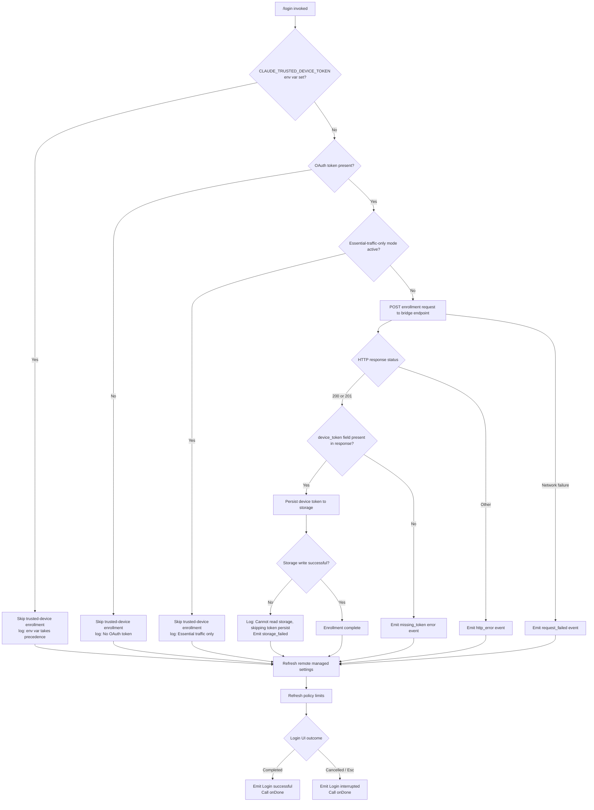

# `/login`

> Analysis basis: CC v2.1.133 bundle.js (AST extraction + Claude interpretation)
> Minimum version: v2.1.133

---

## Overview

The `/login` command initiates an interactive OAuth-based authentication flow within the Claude Code CLI, allowing users to authenticate with Anthropic's backend. Upon successful completion, it persists the resulting API key and OAuth token to application state, optionally enrolls the device as a trusted device, and refreshes remote managed settings and policy limits. The command renders a JSX confirmation UI, handles cancellation via Escape, and emits completion signals for both successful and interrupted login outcomes.

---

## Registration

| Field | Value |
|---|---|
| type | `local-jsx` |
| name | `login` |
| description | `null` |
| loc_line | `6233` |
| module_id | `WZ9` |

Analysis basis: CC v2.1.133 bundle.js:+10400262

---

## Input Branching

The `/login` command does not accept free-text arguments. Its branching logic is driven entirely by internal state transitions during the OAuth flow and the environment conditions detected at execution time.



Analysis basis: CC v2.1.133 bundle.js:+7994629, +6458452, +6458795, +6458880, +6459279, +6459349, +6459365, +6459562, +6459663, +6459715, +6459813, +7995074, +7995093

---

## Behavioral Spec

### 1. Command Entry Point and State Setup

```
function loginCommandHandler(props):
    appState = props.getAppState()
    setState(initialLoginState)

    render LoginConfirmationUI(
        onChangeAPIKey  = handleApiKeyChange,
        applyMessageOp  = handleMessageOp,
        onDone          = handleCompletion
    )
```

Analysis basis: CC v2.1.133 bundle.js:+7994794, +7994926, +7994629, +7994648

---

### 2. OAuth URL Resolution

```
function resolveOAuthEndpoint(environment):
    allowed = ["local", "staging", "prod"]

    if environment == "local":
        base = LOCAL_OAUTH_BASE
    elif environment == "staging":
        base = STAGING_OAUTH_BASE
    else:
        base = PRODUCTION_OAUTH_BASE

    customUrl = readEnv("CLAUDE_CODE_CUSTOM_OAUTH_URL")
    if customUrl is not null:
        if customUrl not in approvedEndpoints:
            raise Error("CLAUDE_CODE_CUSTOM_OAUTH_URL is not an approved endpoint.")
        append "-custom-oauth" suffix to flow identifier

    return resolvedEndpoint
```

Analysis basis: CC v2.1.133 bundle.js:+892507, +892532, +892562, +892692, +893208

---

### 3. API Key Validation and Normalization

```
function validateAndNormalizeApiKey(rawKey):
    trimmed = rawKey.trim()
    upper   = trimmed.toUpperCase()

    if upper contains known debug prefix:
        applyDebugKeyPath(trimmed)
        return

    normalizedKey = normalize(trimmed)   // strips whitespace variants
    store(normalizedKey)
    return normalizedKey
```

Analysis basis: CC v2.1.133 bundle.js:+162619, +162681, +162704, +162555

---

### 4. Remote Managed Settings Refresh

After authentication state changes, the settings subsystem is re-triggered:

```
function refreshRemoteSettings(authChanged):
    if authChanged:
        log("Remote settings: Refreshed after auth change")

    result = fetchRemoteSettings()

    if result.status == 304:
        log("Remote settings: Cache still valid (304 Not Modified)")
        return cachedSettings

    if result.failed:
        log("Remote settings: Using stale cache after fetch failure")
        emitTelemetry("remote_managed_settings_fetch_failed")
        return cachedSettings

    if result.status == 404:
        deleteLocalCacheFile()
        log("Remote settings: Deleted cached file (404 response)")
        return null

    if userRejectedNewSettings:
        log("Remote settings: User rejected new settings, using cached settings")
        return cachedSettings

    applyNewSettings()
    log("Remote settings: Applied new settings successfully")
    emitTelemetry("remote_managed_settings_pull")
    notifyChange("policySettings")
    return newSettings
```

Analysis basis: CC v2.1.133 bundle.js:+6576585, +6575251, +6575082, +6575031, +6575776, +6575481, +6575611, +6575000, +6576680, +6576696

---

### 5. Policy Limits Refresh

```
function refreshPolicyLimits(authChanged):
    if authChanged:
        log("Policy limits: Refreshed after auth change")

    clearExistingTimeout()
    promise = loadPolicyLimits()

    timeoutId = setTimeout(function():
        log("Policy limits: Loading promise timed out, resolving anyway")
        resolveAnyway()
    , POLICY_LOAD_TIMEOUT)

    result = await promise
    clearTimeout(timeoutId)
    emitTelemetry("policy_limits_load", { result })
    return result
```

Analysis basis: CC v2.1.133 bundle.js:+9784336, +9779399, +9779515, +9779544, +9784131, +9784208

---

### 6. Trusted-Device Enrollment

```
function enrollTrustedDevice(oauthToken):
    if env("CLAUDE_TRUSTED_DEVICE_TOKEN") is set:
        log("[trusted-device] CLAUDE_TRUSTED_DEVICE_TOKEN env var is set, skipping enrollment (env var takes precedence)")
        return

    if oauthToken is null or empty:
        log("[trusted-device] No OAuth token, skipping enrollment")
        return

    if isEssentialTrafficOnly():
        log("[trusted-device] Essential traffic only, skipping enrollment")
        emitTelemetry("bridge_trusted_device_enroll", { result: "essential-traffic" })
        return

    headers = { "Content-Type": "application/json" }
    timeout = 10000   // ms  (bundle.js:+6459177)
    retryDelay = 500  // ms  (bundle.js:+6459203)

    try:
        response = POST(enrollmentEndpoint, body, headers, timeout)
    catch networkError:
        emitTelemetry("bridge_trusted_device_enroll", { result: "request_failed" })
        return

    if response.status not in [200, 201]:
        emitTelemetry("bridge_trusted_device_enroll", { result: "http_error" })
        return

    if response.body.device_token is missing:
        log("[trusted-device] Enrollment response missing device_token field")
        emitTelemetry("bridge_trusted_device_enroll", { result: "missing_token" })
        return

    storageOk = writeDeviceToken(response.body.device_token)
    if not storageOk:
        log("[trusted-device] Cannot read storage, skipping token persist")
        emitTelemetry("bridge_trusted_device_enroll", { result: "storage_failed" })
        return

    emitTelemetry("bridge_trusted_device_enroll", { result: "unknown" })  // success path default
```

Analysis basis: CC v2.1.133 bundle.js:+6458452, +6458795, +6458880, +6459134, +6459149, +6459177, +6459203, +6459279, +6459310, +6459349, +6459365, +6459484, +6459562, +6459663, +6459715, +6459813, +6459952

---

### 7. Session Cleanup on Re-Login

Before a new login is applied, existing process listeners and in-memory caches are cleared:

```
function teardownExistingSession():
    process.off("beforeExit", exitHandler)
    process.off("exit", exitHandler)
    clearCacheSet(sessionCacheA)
    clearCacheSet(sessionCacheB)
    clearCacheSet(sessionCacheC)
    clearCacheSet(sessionCacheD)
    emitInternalEvent(sessionResetSignal)
```

Analysis basis: CC v2.1.133 bundle.js:+3092200, +3092210, +3092222, +3092268, +3092329, +3092341, +3092353, +3092365, +3092082

---

### 8. Auto-Mode Configuration After Login

```
function reconfigureAutoMode(settings):
    emitTelemetry("tengu_auto_mode_config", { source: "settings" })

    if settings.disableAutoMode == true:
        log("auto mode disabled: disableAutoMode in settings")
        return MODE_DISABLED

    circuitBreakerState = readCircuitBreaker()
    if circuitBreakerState == "disabled":
        log("auto mode disabled: tengu_auto_mode_config.enabled === \"disabled\" (circuit breaker)")
        emitTelemetry("tengu_auto_mode_config", { source: "circuit-breaker" })
        return MODE_DISABLED

    if circuitBreakerState == "enabled":
        return MODE_ENABLED

    // Evaluate plan/model eligibility
    plan  = derivePlanFromState()
    model = deriveModelFromState()

    if plan == "auto" or eligibleByModel(model):
        return MODE_AUTO
    else:
        emitTelemetry("auto_gate_denied")
        return MODE_DEFAULT
```

Analysis basis: CC v2.1.133 bundle.js:+9676808, +9676936, +9677045, +9677560, +9677573, +9677630, +9677664, +9677684, +9677793, +9677918, +9678053, +9678221

---

### 9. Login UI Component

```
function renderLoginComponent(props):
    [state, dispatch] = useReducer(loginReducer, initialState)

    useEffect(function():
        runLoginFlow(dispatch)
    , [])

    plan  = useMemo(computePlan, [state])
    model = useMemo(computeModel, [state])

    if state == COMPLETED:
        appendMessage("Login successful")   // literal: bundle.js:+7995074
        props.onDone()

    if state == INTERRUPTED:
        appendMessage("Login interrupted")  // literal: bundle.js:+7995093
        props.onDone()

    return createElement(
        ConfirmationWidget,
        {
            keyBinding: "Esc",              // bundle.js:+7995373
            confirmId:  "confirm:no",       // bundle.js:+7995328
            title:      "Confirmation",     // bundle.js:+7995349
            cancelText: "cancel",           // bundle.js:+7995391
            label:      "Login",            // bundle.js:+7995770
            category:   "permission"        // bundle.js:+7995795
        },
        children
    )
```

Analysis basis: CC v2.1.133 bundle.js:+7993081, +7993115, +7993376, +7995014, +7995061, +7995074, +7995093, +7995139, +7995299, +7995328, +7995349, +7995373, +7995391, +7995770, +7995795

---

### 10. Bypass-Permissions Mode Reset

If `bypassPermissions` mode was active in the prior session, it is cleared and the mode is reset to `default` upon login:

```
function resetBypassPermissionsMode(currentState):
    emitTelemetry("tengu_disable_bypass_permissions_mode")
    newMode = applyModeChange("setMode", "default")   // literals: bundle.js:+9679679, +9679694
    if sessionScope:
        applyModeChange("setMode", "session")          // literal: bundle.js:+9679716
    return newMode
```

Analysis basis: CC v2.1.133 bundle.js:+9678739, +9679646, +9679679, +9679694, +9679716

---

### 11. Random Delay Jitter (Anti-Thundering-Herd)

A short randomized delay is applied before certain upstream requests to avoid simultaneous bursts after login:

```
function scheduleWithJitter(callback):
    delay = Math.floor(Math.random() * 2) + 1   // values 1–2 (bundle.js:+12285767, +12285783)
    setTimeout(callback, delay)
```

Analysis basis: CC v2.1.133 bundle.js:+12285769, +12285783, +12285806

---

## State & Side Effects

| Item | Detail |
|---|---|
| Telemetry — `tengu_auto_mode_config` | Fired when auto-mode configuration is evaluated post-login (bundle.js:+9676808) |
| Telemetry — `tengu_disable_bypass_permissions_mode` | Fired when bypass-permissions mode is cleared on new login (bundle.js:+9678739) |
| Telemetry — `tengu_feature_ok` | Fired on successful feature gate evaluation (bundle.js:+907381) |
| Telemetry — `tengu_feature_bad` | Fired on failed feature gate evaluation (bundle.js:+907437) |
| Telemetry — `tengu_slate_kestrel` | Fired as part of policy-limits load completion (bundle.js:+9780268) |
| Telemetry — `bridge_trusted_device_enroll` | Fired at each enrollment outcome with a `result` sub-key (`request_failed`, `http_error`, `missing_token`, `storage_failed`, `unknown`) (bundle.js:+6459279) |
| Telemetry — `remote_managed_settings_pull` | Fired when new remote settings are successfully applied (bundle.js:+6575000) |
| Telemetry — `remote_managed_settings_fetch_failed` | Fired when remote settings fetch fails (bundle.js:+6575031) |
| Telemetry — `remote_managed_settings_unexpected` | Fired on unexpected error in settings fetch (bundle.js:+6576077) |
| Telemetry — `policy_limits_load` | Fired after policy limits load attempt resolves (bundle.js:+9784131) |
| `appState` — API key | Written via `onChangeAPIKey` after successful authentication (bundle.js:+7994629) |
| `appState` — general update | Written via `setAppState` / `applyMessageOp` at command completion (bundle.js:+7994648, +7994926) |
| `appState` — mode | Reset to `default` (or `session`) if `bypassPermissions` was active (bundle.js:+9679694) |
| Process event hooks | `beforeExit` and `exit` listeners are detached during session teardown (bundle.js:+3092222, +3092268) |
| Internal event bus | `HxH.emit` fires a session-reset signal during teardown (bundle.js:+3092082) |
| File system | Trusted-device token is persisted to local storage; 404 responses from remote settings cause deletion of the local cache file via `xGH.unlink` (bundle.js:+6575760) |
| In-memory cache | Four cache sets are cleared on re-login: `b5H`, `pq6`, `Ut8`, `cU` (bundle.js:+3092329–3092365) |
| Storage (OAuth) | Device token written via storage update mechanism; stale file removed via `Ydq.unlinkSync` when appropriate (bundle.js:+14137065) |
| Sound | <!-- TODO: not found in depth-2 traversal; needs --depth 4 --> |

---

## Version History

| Version | Change |
|---|---|
| v2.1.133 | Initial analysis |

---

## Common Mistakes

1. **Running `/login` when `CLAUDE_TRUSTED_DEVICE_TOKEN` is set via environment variable**: Trusted-device enrollment is silently skipped when this variable is present; the env var always takes precedence over the OAuth-based enrollment flow (bundle.js:+6458452).

2. **Expecting `/login` to accept arguments**: The command's `description` field is `null` and no argument parser is registered. Passing text after `/login` has no documented effect and is not processed by the command handler (bundle.js:+10400262).

3. **Interrupting the flow with Escape expecting a clean state**: Cancelling via Escape key produces an "Login interrupted" message and calls `onDone`, but does **not** roll back any partial state changes (such as API key fields already written). Users should re-run `/login` to ensure a consistent state (bundle.js:+7995093, +7995373).

4. **Assuming immediate policy-limit availability**: Policy limits are loaded asynchronously after login. A built-in timeout forces the promise to resolve regardless; callers must tolerate a brief window where limits are not yet enforced (bundle.js:+9779544).

5. **Expecting remote managed settings to always be fresh**: If the settings endpoint returns a non-200/304 error, the CLI falls back to stale cached settings silently. A 404 deletes the cache entirely, resulting in no managed settings until the next successful fetch (bundle.js:+6575082, +6575776).

6. **Re-logging in without expecting session teardown**: Every `/login` invocation triggers full session cleanup — process listeners are detached, all four in-memory caches are wiped, and an internal reset event is emitted — before the new credentials are applied (bundle.js:+3092082, +3092210, +3092329).

---

## Appendix — Identifier Mapping

> For bundle debugging only. Identifiers change across versions.

| Identifier | Role |
|---|---|
| `xL8` | Login command core handler / props processor |
| `H` | General utility / state context object (varies by call site) |
| `INH` | Timestamp utility (wraps `Date.now`) |
| `z36` | Remote managed settings orchestrator |
| `Z49` | Settings sub-initializer A |
| `kOA` | Settings sub-initializer B (delegates to `_q_`) |
| `$l` | Account-type resolver (`firstParty`, `local-agent`, `enterprise`, `team`) |
| `ROA` | Settings change notifier (calls `aS.notifyChange`) |
| `bOA` | Settings fetch and cache reconciliation handler |
| `k` | API key validation and normalization function |
| `V6H` | Shared value accessor / config reader |
| `T49` | Settings post-apply handler |
| `iz6` | Policy limits orchestrator |
| `NVA` | Policy limits timeout canceller |
| `QM8` | Policy limits loader with timeout guard |
| `Wm` | Policy limits core loader |
| `dM8` | Path joiner for policy limits file resolution |
| `VJ6` | Policy limits refresh-after-auth-change handler |
| `v5H` | Supplemental login side-effect handler A |
| `A2H` | Session teardown / re-login reset coordinator |
| `Po` | Process lifecycle hook installer |
| `AxH` | Cache and listener cleanup executor |
| `fH` | Error logging and event-push handler |
| `HA` | Error string coercer |
| `B$A` | Storage read/update wrapper A |
| `O$H` | Internal event dispatcher (wraps `J6`) |
| `dK` | Low-level storage accessor |
| `F$A` | Trusted-device enrollment orchestrator |
| `xS` | OAuth session state inspector |
| `eL9` | Enrollment endpoint builder |
| `A_` | Module export initializer / binding registrar |
| `A` | Generic application state or config accessor |
| `yq` | Network/traffic-category checker |
| `q_` | OAuth URL resolver and validator |
| `vH` | String coercion utility |
| `uH` | Feature flag / config accessor |
| `SH` | JSON serializer wrapper |
| `q` | Persistent storage object (read/update/unlinkSync) |
| `hH` | Secondary feature/config accessor |
| `JZ9` | Login flow entry initializer |
| `dz6` | App-state loader for login component |
| `bL8` | App-state sub-reader |
| `NGH` | App-state notifier / Wf dispatcher |
| `rjA` | Login completion signal emitter |
| `cz6` | Login UI state coordinator |
| `lz6` | Auto-mode configuration evaluator |
| `$y4` | Login JSX factory (top-level component wrapper) |
| `xOH` | Login confirmation UI renderer |
| `yD` | Login view state manager |
| `O6` | External store sync hook wrapper |
| `wZ9` | Login reducer and effect setup |
| `Gq` | Plan/model string normalizer |
| `fW` | Model capability classifier |
| `yj` | React context consumer for login UI |