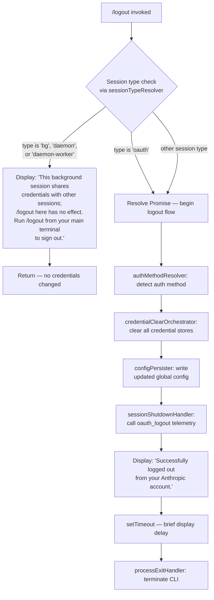

# `/logout`

> Analysis basis: CC v2.1.132 bundle.js (AST extraction + Claude interpretation)
> Minimum version: v2.1.132

---

## Overview

The `/logout` command signs the user out of their Anthropic account within Claude Code CLI. It detects whether the current session is a background (daemon) session and, if so, refuses to perform logout with an informational message; otherwise it executes a full credential-clearing sequence, emits telemetry, displays a success message, and terminates the CLI process cleanly.

---

## Registration

| Field | Value |
|---|---|
| type | `local-jsx` |
| name | `logout` |
| description | Sign out from your Anthropic account |
| module_id | `zw9` |
| loc_line | 6232 |

Analysis basis: CC v2.1.132 bundle.js:+10383506

---

## Input Branching

The command's top-level handler (`E04`) first determines the session context, then either blocks the action or proceeds with the full logout sequence.



Analysis basis: CC v2.1.132 bundle.js:+7353848 (top-level command component `E04`), +7353921 (call to logout executor `m$6`), +7353981 (background-session guard message), +7354156 (success message), +7354219 (setTimeout before exit)

---

## Behavioral Spec

### Top-Level Command Component

```
function logoutCommandComponent(sessionContext):
    sessionType = sessionTypeResolver(sessionContext)
    lowercasedType = sessionType.toLowerCase()

    if lowercasedType is one of ["bg", "daemon", "daemon-worker"]:
        render JSX element with message:
            "This background session shares credentials with other sessions;
             /logout here has no effect.
             Run /logout from your main terminal to sign out."
        return  // no credential changes made

    // Proceed with actual logout
    result = logoutExecutor(sessionContext)
    render JSX element for result
    setTimeout(processExitHandler, <delay>)
```

Analysis basis: CC v2.1.132 bundle.js:+7353848, +7353956 (JSX createElement), +7354219 (setTimeout), +2121040 (`"bg"`), +2121050 (`"daemon"`), +2121064 (`"daemon-worker"`)

---

### Session Type Resolver

```
function sessionTypeResolver(context):
    // Reads session type string from process/app context
    // Returns one of: "bg", "daemon", "daemon-worker", "oauth", or other string
    return context.sessionType
```

Analysis basis: CC v2.1.132 bundle.js:+2121117 (call to `Tr` within `G9`), +7353151 (call to `G9` from `m$6`)

---

### Logout Executor (Core Logout Flow)

```
function logoutExecutor(context):
    Promise.resolve()                    // begin async chain
    authMethod = authMethodResolver()    // determine auth method (e.g. "oauth")
    credentialClearOrchestrator()        // clear all stored credentials
    configPersister()                    // persist updated config to disk
    sessionShutdownHandler()             // emit oauth_logout signal/event
```

Analysis basis: CC v2.1.132 bundle.js:+7353096 (Promise.resolve), +7353126 (authMethodResolver `qwA`), +7353147 (string normalizer `_`), +7353151 (sessionTypeResolver `G9`), +7353163 (credentialClearOrchestrator `u$6`), +7353225 (configPersister `ZHH`), +7353241 (configWriteHelper `$a8`), +7353247 (storageLayerAccessor `EK`), +7353647 (sessionShutdownHandler `SH`)

---

### Credential Clear Orchestrator

```
function credentialClearOrchestrator():
    primarySecureStoreClearer()       // FM6: clear primary secure store
    secondaryKeyClearer()             // kF6: clear secondary key material
    cacheStoreClearer()               // RF6: clears in-memory/disk cache via G41.clear
    sessionTokenClearer()             // X5H: clear session tokens
    oauthTokenClearer()               // aPH: revoke / clear OAuth tokens
    fileCredentialClearer()           // SK9: remove credential files (yGH.unlink)
    linkCredentialClearer()           // KwA: remove linked credential files (zJ6.unlink)
```

Analysis basis: CC v2.1.132 bundle.js:+7353707 (`FM6`), +7353713 (`kF6`), +7353719 (`RF6`), +2863607 (`G41.clear`), +7353725 (`X5H`), +7353750 (`aPH`), +7353803 (`SK9`), +6564232 (`yGH.unlink`), +7353815 (`KwA`), +9770314 (`zJ6.unlink`)

---

### OAuth Token Clearer

```
function oauthTokenClearer():
    eventEmitter = getEventEmitter()         // Oo
    tokenStore = getTokenStore()             // ubH
    eventBus.emit(logoutEvent)               // xbH.emit
    keyWriter = getKeyWriter()               // KW
    fileHandle = getFileHandle()             // fH
    headerAccessor = getHeaderAccessor()     // HA
```

Analysis basis: CC v2.1.132 bundle.js:+3086182, +3086198, +3086204, +3086219, +3086243, +3086246

---

### File Credential Clearer

```
function fileCredentialClearer():
    pathResolver = credentialPathResolver()  // CK9
    configAccessor = globalConfigAccessor()  // g$A
    dirResolver = dirPathResolver()          // Y6H
    filePathBuilder = filePathBuilder()      // PH6
    fs.unlink(credentialFilePath)            // yGH.unlink — removes credential file from disk
```

Analysis basis: CC v2.1.132 bundle.js:+6564168, +6564174, +6564197, +6564220, +6564232

---

### Link Credential Clearer

```
function linkCredentialClearer():
    linkedAccountResolver = linkedAccountResolver()  // UIA
    fs.unlink(linkedCredentialPath)                  // zJ6.unlink — removes linked credential file
    additionalCleaner = additionalCleaner()          // XM8
```

Analysis basis: CC v2.1.132 bundle.js:+9770298, +9770314, +9770325

---

### Config Write Helper

```
function configWriteHelper():
    globalConfigWriter = globalConfigWriter()   // h41 → Vx_, fH
    globalConfigUpdater = globalConfigUpdater() // A8
        // A8 sub-steps:
        //   read current config (Nt8, B2)
        //   merge changes (H, FbH, CJ1)
        //   check auth-loss guard (gbH)
        //   write result (k, k5H, uq6)
        //   if auth loss detected:
        //     emit tengu_config_auth_loss_prevented telemetry
        //     log warning: "saveGlobalConfig fallback: re-read config is missing
        //                   auth that cache has; refusing to write. See GH #3117."
    subscriptionSwitchHandler = subscriptionSwitchHandler() // go8
        // handles "subscription-switch" flow if required
```

Analysis basis: CC v2.1.132 bundle.js:+2878473, +2878479, +2878538, +3102400–3102847, +3102607 (fallback warning string), +3102735 (auth-loss telemetry), +7353495 (`"subscription-switch"`)

---

### Storage Layer Accessor

```
function storageLayerAccessor():
    // Provides read/write/delete access to two credential storage backends:
    //   H — primary storage (secure keychain / system credential store)
    //   A — secondary/fallback storage (plaintext file)
    //
    // Operations available on each: read, readAsync, update, delete
    // Telemetry emitted during credential write:
    //   "secure_storage_credentials_write"   (primary path)
    //   "plaintext_fallback_used"            (fallback path used)
    //   "primary_and_fallback_failed"        (both stores unavailable)
    //
    // On success, emits: tengu_feature_ok
```

Analysis basis: CC v2.1.132 bundle.js:+2858378, +2858427, +2858471, +2858531, +2858577, +2858615, +2858633 (`"secure_storage_credentials_write"`), +2858680, +2858718, +2858736, +2858774 (`"plaintext_fallback_used"`), +2858877 (`"primary_and_fallback_failed"`), +906461 (`tengu_feature_ok`)

---

### Session Shutdown Handler / Process Exit

```
function processExitHandler():
    clearTimeout(existingTimer)
    activeInstances = instanceMap.get(currentKey)
    if activeInstances > 0:
        activeInstances.forEach(instance -> instance.unmount())
    cleanupHook()                    // mk
    finalCleanup()                   // nc6, yH
    process.exit(0)                  // or process.kill(pid, "SIGKILL") if exit stalls
```

Analysis basis: CC v2.1.132 bundle.js:+5042966, +5042999, +5043047, +5043072 (SIGKILL fallback), +5043097 (`"SIGKILL"`), +5042447 (unmount)

---

### Telemetry Event Emitter (within Logout Flow)

```
function telemetryEventEmitter(eventName, properties):
    // Constructs event payload with:
    //   event.name        → eventName
    //   event.timestamp   → current timestamp
    //   event.sequence    → monotonically increasing sequence number
    //   prompt.id         → current prompt identifier
    //   workspace.host_paths → current workspace paths
    // Dispatches via _.emit(eventPayload)
    // Logs at "warn" level if dispatch encounters issues
```

Analysis basis: CC v2.1.132 bundle.js:+4400648, +4400663, +4400706, +4400745, +4400818, +4400924, +4400616

---

### CLI Output Handler (qL / graceful exit coordinator)

```
function gracefulExitCoordinator():
    // Coordinates the terminal output sequence before process exit:
    //   1. writeSync final output to stdout (XUH.writeSync)
    //   2. Race Promise.resolve against AbortSignal.timeout
    //   3. Wait up to 5000ms total, with inner deadline of 3500ms (Math.max)
    //   4. After 2000ms abort, force clearTimeout
    //   5. Emit "session_end" marker
    //   6. writeSync exit marker (fd=2, exit code byte)
    //   7. Call processExitHandler (P5A → process.exit / process.kill SIGKILL)
```

Timeout values observed:
- Outer coordination timeout: 5000 ms (bundle.js:+5044273)
- Inner deadline: 3500 ms (bundle.js:+5044280)
- Abort grace period: 2000 ms (bundle.js:+5044458)
- Pre-exit write delay: 500 ms (bundle.js:+5044883)

Analysis basis: CC v2.1.132 bundle.js:+5043187, +5044176, +5044227, +5044264, +5044273, +5044280, +5044393, +5044447, +5044458, +5044535, +5044644 (`"session_end"`), +5044920

---

## State & Side Effects

| Item | Detail |
|---|---|
| Telemetry — `tengu_config_auth_loss_prevented` | Fired when config re-read after write is missing auth that the in-memory cache holds; write is aborted to prevent data loss (bundle.js:+3102735) |
| Telemetry — `tengu_feature_ok` | Fired on successful credential storage operation within the storage layer accessor (bundle.js:+906461) |
| Telemetry — `tengu_cache_eviction_hint` | Fired during graceful exit coordination, signals cache eviction hint to downstream consumers (bundle.js:+5044609) |
| Credential files unlinked | Two `fs.unlink` calls remove credential and linked-credential files from disk (bundle.js:+6564232, +9770314) |
| In-memory cache cleared | `G41.clear()` evicts the in-memory credential cache (bundle.js:+2863607) |
| OAuth token revocation | Event bus emission via `xbH.emit` signals OAuth token invalidation (bundle.js:+3086204) |
| `oauth_logout` signal | `SH` emits the `"oauth_logout"` string as a session shutdown signal (bundle.js:+7353650) |
| Global config rewrite | Global config file is rewritten without auth fields; guarded against auth-loss regression (GH #3117) (bundle.js:+3102607) |
| `"subscription-switch"` event | Handled within the config write path; may trigger subscription state update (bundle.js:+7353495) |
| `"session_end"` marker | Written to output stream during graceful process shutdown (bundle.js:+5044644) |
| JSX component unmounted | All active Ink/JSX render instances are unmounted before process exit (bundle.js:+5042447) |
| Process termination | `process.exit` called after logout sequence; SIGKILL fallback if exit stalls (bundle.js:+5043047, +5043072) |
| Background session guard | No state changes occur when session type is `bg`, `daemon`, or `daemon-worker` (bundle.js:+2121040, +2121050, +2121064) |
| Sound | <!-- TODO: not found in depth-2 traversal; needs --depth 4 --> |

---

## Version History

| Version | Change |
|---|---|
| v2.1.132 | Initial analysis — full logout flow with background-session guard, multi-store credential clearing, auth-loss prevention (GH #3117), and graceful process shutdown |

---

## Common Mistakes

1. **Running `/logout` in a background or daemon session**: The command will display an informational message and take no action. Credentials are shared across sessions; logout must be performed from the main (foreground) terminal session.
2. **Expecting an immediate process exit**: The shutdown sequence waits up to 5000 ms to flush output and coordinate cleanup before calling `process.exit`. Do not treat a brief delay after the success message as a hang.
3. **Assuming `/logout` only clears one credential store**: The logout flow clears multiple independent stores — primary secure storage, secondary/fallback plaintext storage, in-memory cache, OAuth tokens, and on-disk credential files — in sequence. Partial failures in one store do not necessarily prevent clearance of others.
4. **Re-running `/logout` after a background-session warning**: The warning message is a hard guard; repeated invocations in a daemon session will continue to produce the same message without modifying credentials.
5. **Conflating the `oauth_logout` signal with an HTTP revocation call**: The extracted call graph shows an event-bus emission (`xbH.emit`) and a shutdown signal (`SH` / `"oauth_logout"`), not necessarily a remote API revocation endpoint call. Whether a server-side token invalidation is performed is <!-- TODO: not found in depth-2 traversal; needs --depth 4 -->.

---

## Appendix — Identifier Mapping

> For bundle debugging only. Identifiers change across versions.

| Identifier | Role |
|---|---|
| `m$6` | Logout executor — core async logout function called by the command component |
| `_` | String normalizer — applies `.toLowerCase()` to session type string |
| `f` | Socket/connection closer — calls `.close()` on two connection objects |
| `G9` | Session type resolver — reads and returns the current session type |
| `Tr` | Session type reader — inner helper called by `G9` |
| `u$6` | Credential clear orchestrator — sequences all credential-clearing sub-steps |
| `FM6` | Primary secure store clearer |
| `kF6` | Secondary key material clearer |
| `RF6` | Cache store clearer — calls `G41.clear()` |
| `X5H` | Session token clearer |
| `aPH` | OAuth token clearer — emits event bus signal and revokes tokens |
| `SK9` | File credential clearer — unlinks credential file via `yGH.unlink` |
| `KwA` | Link credential clearer — unlinks linked credential file via `zJ6.unlink` |
| `ZHH` | Config persister — writes updated global config after credential removal |
| `$a8` | Config write helper — coordinates global config update and subscription-switch |
| `h41` | Global config writer — outer write wrapper calling `Vx_` and `fH` |
| `A8` | Global config updater — reads, merges, guards, and writes global config |
| `go8` | Subscription switch handler — processes subscription-switch events in config flow |
| `EK` | Storage layer accessor — provides read/write/delete to primary and fallback stores |
| `f41` | Dual-backend storage driver — implements H (primary) and A (fallback) store operations |
| `SH` | Session shutdown handler — emits `oauth_logout` signal and `tengu_feature_ok` telemetry |
| `d` | Low-level data writer — called by `SH` for final state persistence |
| `E04` | Top-level logout command component — entry point, background-session guard, JSX render |
| `omH` | Telemetry event emitter — constructs and dispatches structured telemetry events |
| `OV` | HTTP error classifier — classifies errors by type (auth, timeout, network, http) |
| `T4` | Telemetry payload builder — assembles event fields and calls `_.emit` |
| `qL` | Graceful exit coordinator — sequences final output flush and process shutdown |
| `F1` | Async shutdown runner — races timeouts, flushes output, emits `session_end` |
| `k` | Log-level router — routes messages by level (debug, warn, etc.) |
| `WUH` | Output unmounter — unmounts JSX instances and runs cleanup hooks before exit |
| `X5A` | Terminal output formatter — formats and writes final terminal output with `writeSync` |
| `P5A` | Process exit finalizer — calls `process.exit` or `process.kill(SIGKILL)` as fallback |