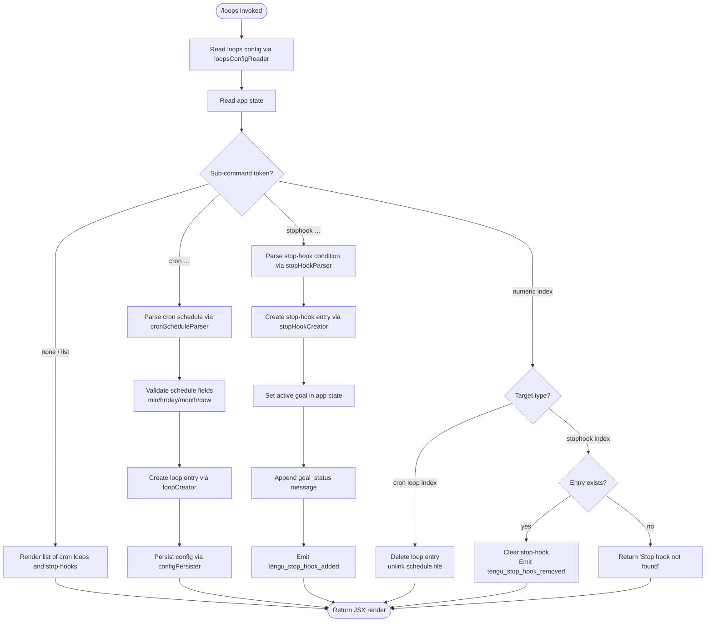

# `/loops`

> Analysis basis: CC v2.1.133 bundle.js (AST extraction + Claude interpretation)
> Minimum version: v2.1.133

---

## Overview

The `/loops` command is a slash command that provides a unified management interface for two related scheduling primitives: **recurring loops** (cron-style timed tasks) and **stop-hooks** (condition-triggered hooks that fire when a session ends). Users can list all active loops and stop-hooks, create new ones by specifying a schedule or condition, and delete existing entries by index. The command renders its output as JSX and fires immediately upon invocation (`immediate: true`).

---

## Registration

| Field | Value |
|---|---|
| type | `local-jsx` |
| name | `loops` |
| description | `List, create, and delete recurring loops and stop-hooks` |
| immediate | `true` |
| module_id | `EMq` |

Analysis basis: CC v2.1.133 bundle.js:+11183954

---

## Input Branching

The command entry-point (the **command renderer** function) examines the current app state and the sub-command tokens extracted from the user's raw input, then branches into one of several action handlers.



Analysis basis: CC v2.1.133 bundle.js:+11182918, +11183016, +11183102, +11183205, +11183344, +11183470, +11183568, +11183650

---

## Behavioral Spec

### Command Entry Point

```
function commandRenderer(context):
    emit telemetry("tengu_loops_command")
    config = loopsConfigReader(context)
    appState = context.getAppState()
    tokens = buildTokenList(context.rawInput)
    subCommand = tokens[0] ?? "list"

    if subCommand == "cron":
        return loopCreator(tokens[1..], config, appState)
    else if subCommand == "stophook":
        return stopHookCreator(tokens[1..], config, appState)
    else if subCommand matches numeric index:
        targetType = tokens[1]  // "cron" or "stophook"
        return deleteHandler(parseInt(tokens[0]), targetType, config, appState)
    else:
        return listRenderer(config, appState)
```

Analysis basis: CC v2.1.133 bundle.js:+11182918, +11182958, +11182966, +11182970, +11182986, +11182998

---

### Loops Config Reader

Reads the persisted loops configuration from disk. The file is encoded as UTF-8.

```
function loopsConfigReader(context):
    path = resolveConfigPath(context)   // uses F6 path resolver
    raw = filesystem.readFile(path, encoding="utf-8")
    if not Array.isArray(raw):
        return []
    entries = []
    for each item in raw:
        validated = validateEntry(item)  // SH validator
        if valid:
            entries.push(validated)
    return entries
```

Analysis basis: CC v2.1.133 bundle.js:+4246400, +4246419, +4246447, +4246563, +4246789

---

### Token List Builder

Builds the list of command tokens from raw user input. Token strings are lower-cased before matching.

```
function buildTokenList(rawInput):
    tokens = rawInput.split(whitespace)
    return tokens.map(t => t.toLowerCase())
```

Analysis basis: CC v2.1.133 bundle.js:+11181602, +14181260

---

### List Renderer

Renders the current loops and stop-hooks as a formatted JSX output. Each entry is padded to a fixed column width of **40 characters** for display alignment.

```
function listRenderer(config, appState):
    cronEntries   = config.filter(e => e.type == "cron")
    hookEntries   = config.filter(e => e.type == "stophook")
    rows = []
    for each entry in cronEntries:
        label = entry.schedule.padEnd(40)   // 40-char column
        rows.push(renderRow(index, label, entry))
    for each entry in hookEntries:
        label = entry.condition.padEnd(40)
        rows.push(renderRow(index, label, entry))
    return createElement(rows)
```

Analysis basis: CC v2.1.133 bundle.js:+11182998, +14181334

---

### Cron Schedule Parser

Parses a human-readable or cron-expression schedule string and converts it to a normalised cron object. Known shorthand labels include `"Every minute"` and `"Every hour"`.

```
function cronScheduleParser(scheduleTokens):
    raw = scheduleTokens.join(" ").trim()

    // Fast-path shorthand detection
    if raw matches /every\s+minute/i:
        return { minute: "*", hour: "*", day: "*", month: "*", dow: "*" }
    if raw matches /every\s+hour/i:
        minuteOffset = parseInt(raw) or 0   // extract :MM offset if present
        return { minute: minuteOffset, hour: "*", day: "*", month: "*", dow: "*" }

    // Standard five-field cron parse
    fields = raw.split(whitespace)
    minute = parseField(fields[0], min=0, max=59)
    hour   = parseField(fields[1], min=0, max=23)
    day    = parseField(fields[2], min=1, max=31)
    month  = parseField(fields[3], min=1, max=12)   // implicit from literal 5
    dow    = parseField(fields[4], min=0, max=7)

    // Day-of-week UTC alignment
    date = new Date()
    date.setUTCDate(...)
    date.setUTCHours(...)
    utcDow = date.getUTCDay()
    localDow = date.getDay()

    // Weekday range shorthand "1-5"
    if dow matches "1-5":
        dow = { range: [1,5] }

    return buildCronString(minute, hour, day, month, dow)
```

Cron field numeric bounds confirmed by literals:
- minute: 0–59  (Analysis basis: CC v2.1.133 bundle.js:+11182685)
- hour: 0–23    (Analysis basis: CC v2.1.133 bundle.js:+11182756)
- day: 1–31     (Analysis basis: CC v2.1.133 bundle.js:+11182809)
- Modulus divisor for rounding: 60 (Analysis basis: CC v2.1.133 bundle.js:+11182651)

Parsing uses `Math.max`, `Math.ceil`, and `Math.round` for field normalisation.
Analysis basis: CC v2.1.133 bundle.js:+11182543, +11182628, +11182639, +11182712

---

### Loop Creator

Creates a new cron-loop entry, persists it to the `.claude` config directory, and registers the entry in the active loops collection.

```
function loopCreator(scheduleTokens, config, appState):
    schedule = cronScheduleParser(scheduleTokens)
    id       = crypto.randomUUID()           // Jx1.randomUUID
    now      = Date.now()
    entry    = {
        id:        id,
        type:      "cron",
        schedule:  schedule,
        createdAt: now,
        prompt:    scheduleTokens.join(" "),  // raw prompt preserved
    }
    config.loops.push(entry)
    configPersister(config)                  // writes to .claude dir
    notifyLoopRunners(appState)              // v6 notify
    return renderConfirmation(entry)
```

Analysis basis: CC v2.1.133 bundle.js:+11183568, +4247747, +4247809, +4247899, +4247912, +4247944

---

### Config Persister

Writes the updated loops configuration back to disk under the `.claude` directory.

```
function configPersister(config):
    dir  = path.join(projectRoot, ".claude")
    fs.mkdir(dir, { recursive: true })
    entries = config.loops.map(serialiseEntry)
    fs.writeFile(configFilePath, entries)
    notifySubscribers()                       // J_H, SH
```

The config directory name is always `.claude`.
Analysis basis: CC v2.1.133 bundle.js:+4247556, +4247567, +4247577, +4247628, +4247664, +4247588

---

### Stop-Hook Creator

Registers a new stop-hook. A stop-hook fires when a session terminates and the supplied condition evaluates to true. It sets an active goal in app state, appends a `goal_status` message of type `attachment` via `applyMessageOp`, and emits a telemetry event.

```
function stopHookCreator(conditionTokens, config, appState):
    condition = conditionTokens.join(" ").trim()
    id        = crypto.randomUUID()          // GMq.randomUUID
    entry     = {
        id:        id,
        type:      "stophook",
        condition: condition,
        role:      "goal",
    }
    appState.setActiveGoal(entry)
    appState.applyMessageOp({
        op:      "append",
        role:    "system",
        kind:    "attachment",
        subKind: "goal_status",
        content: condition,
    })
    config.hooks.push(entry)
    configPersister(config)
    emit telemetry("tengu_stop_hook_added")
    loopStateUpdater(appState)              // Tz8
    return renderConfirmation("Stop hook set")
```

The confirmation string `"Stop hook set"` is a fixed literal.
Analysis basis: CC v2.1.133 bundle.js:+11183650, +11181645, +11181663, +11181793, +11181841, +11181854, +11181856, +11181916, +11181919, +11182117, +11182140, +11182159, +11182202, +11182241, +11182328, +11183671

---

### Loop State Updater

Registers the current hooks list in an internal Map-based registry, keyed by a string derived from the hook type. The string `"Stop"` is used as the key prefix for stop-hooks, and `"prompt"` identifies the prompt field.

```
function loopStateUpdater(appState):
    existing = registry.get("Stop")         // map key literal "Stop"
    updated  = mergeHookState(existing, appState)
    registry.set("Stop", updated)
    notifyObservers()                        // kN9
```

Analysis basis: CC v2.1.133 bundle.js:+11181478, +11181486, +11181593, +8204379, +8204387

---

### Delete Handler

Deletes a loop or stop-hook by its displayed list index.

```
function deleteHandler(index, targetType, config, appState):
    if targetType == "cron":
        entry = config.loops[index]
        if entry exists:
            fs.unlinkSync(entry.filePath)       // removes schedule file
            config.loops.removeAt(index)
            configPersister(config)
        return renderList(config, appState)

    else if targetType == "stophook":
        entries  = config.hooks.filter(e => e.type == "stophook")
        filtered = entries that match index
        if filtered is empty:
            return renderError("Stop hook not found")
        for each matched entry:
            appState.setActiveGoal(null)
            config.hooks.remove(entry)
        configPersister(config)
        emit telemetry("tengu_stop_hook_removed")
        return renderConfirmation("Stop hook cleared")
```

Fixed error/confirmation strings:
- `"Stop hook not found"` (Analysis basis: CC v2.1.133 bundle.js:+11183362)
- `"Stop hook cleared"` (Analysis basis: CC v2.1.133 bundle.js:+11183384)

Analysis basis: CC v2.1.133 bundle.js:+11183205, +11183344, +11183470, +14137065, +4248077, +4248126, +4248135, +4248150

---

### Background Session / Loop Runner

The loop runner manages execution of recurring loop tasks in background sessions. It monitors system memory and escalates process signals when necessary.

```
function loopRunner(entry, sessionRegistry):
    session = sessionRegistry.get(entry.id)

    // Memory guard
    freeMemMB = os.freemem() / 1024
    if freeMemMB < LOW_MEM_THRESHOLD:
        emit telemetry("tengu_bg_dispatch_low_mem")
        return

    // Attempt to claim or spawn a spare session
    spareSession = spareSessionPool.claim()
    if spareSession is null:
        emit telemetry("tengu_bg_spare_claim_fail")
        spawn new background session via gm.spawn
        emit telemetry("tengu_bg_spare_spawn")
    else:
        emit telemetry("tengu_bg_spare_claim")

    // Run with signal escalation on hang
    try:
        result = session.run(entry.prompt)
        session.retireIfSettled()
    catch timeout:
        session.kill("SIGKILL")
        emit telemetry("tengu_bg_dispatch_sigkill_escalate")

    // Spare pool management
    if spareEnabled:
        emit telemetry("tengu_bg_spare_enable")
        sparePool.set(newSpare)
```

Numeric constants observed in loop runner:
- Memory divisor: **1024** (bytes → KB) (Analysis basis: CC v2.1.133 bundle.js:+14157513)
- SIGKILL signal string: `"SIGKILL"` (Analysis basis: CC v2.1.133 bundle.js:+14157088)
- SIGTERM signal string: `"SIGTERM"` (Analysis basis: CC v2.1.133 bundle.js:+14158853)
- Post-kill delay: **100** ms (Analysis basis: CC v2.1.133 bundle.js:+14157112)
- Spare pool timeout: **2000** ms (Analysis basis: CC v2.1.133 bundle.js:+14156750)
- Memory thresholds: **30**, **15** (Analysis basis: CC v2.1.133 bundle.js:+14156995, +14157006)
- Random jitter multiplier: **2** (Analysis basis: CC v2.1.133 bundle.js:+12285767)

Analysis basis: CC v2.1.133 bundle.js:+14157038, +14157347, +14157405, +14157449, +14157465, +14157500, +14157619, +14157688, +14157699, +14158234, +14158355, +14158618, +14158677

---

### Availability Guard

Before operating on hooks, the command checks whether the loops feature is available in the current environment.

```
function availabilityGuard(context):
    if not featureFlags.has("loops"):
        return { available: false }
    emit telemetry("tengu_feature_ok")
    return { available: true }
```

Analysis basis: CC v2.1.133 bundle.js:+47230, +907379, +907381

---

### Cleanup / Close Handler

When the command panel is closed or unmounted, open background sessions and queue entries are flushed.

```
function closeHandler(state):
    state.backgroundSessions.close()
    state.taskQueue.close()
    state.loops.cleanup()          // K collection cleanup
```

Analysis basis: CC v2.1.133 bundle.js:+11183788, +14167103, +14167113, +14167253

---

## State & Side Effects

| Item | Detail |
|---|---|
| Telemetry — command entry | `tengu_loops_command` (emitted on every invocation; bundle.js:+11182920) |
| Telemetry — stop-hook added | `tengu_stop_hook_added` (bundle.js:+11181856) |
| Telemetry — stop-hook removed | `tengu_stop_hook_removed` (bundle.js:+11182171) |
| Telemetry — SIGKILL escalation | `tengu_bg_dispatch_sigkill_escalate` (bundle.js:+14157040) |
| Telemetry — low memory | `tengu_bg_dispatch_low_mem` (bundle.js:+14157619) |
| Telemetry — spare pool enabled | `tengu_bg_spare_enable` (bundle.js:+14158234) |
| Telemetry — spare session claimed | `tengu_bg_spare_claim` (bundle.js:+14158355) |
| Telemetry — spare claim failed | `tengu_bg_spare_claim_fail` (bundle.js:+14158618) |
| Telemetry — spare session spawned | `tengu_bg_spare_spawn` (bundle.js:+14156817) |
| Telemetry — MCP retry failed | `tengu_mcp_retry_failed_remote` (bundle.js:+13870729) |
| Telemetry — feature availability | `tengu_feature_ok` (bundle.js:+907381) |
| Hook registration | Stop-hooks registered via internal Map registry keyed on `"Stop"` string; stored in app state and persisted to `.claude` config directory |
| appState changes | `setActiveGoal` called on stop-hook create and clear; `applyMessageOp` appends a `goal_status` attachment message on create |
| File system | Reads and writes UTF-8 config files under `.claude/`; `unlinkSync` used to remove cron schedule files on delete |
| Background processes | Loop runner may spawn child processes via `gm.spawn`; processes may be sent `SIGTERM` or `SIGKILL` |
| UUID generation | Both `Jx1.randomUUID` (loop entries) and `GMq.randomUUID` (stop-hook entries) are called at creation time |
| Sound | <!-- TODO: not found in depth-2 traversal; needs --depth 4 --> |

---

## Version History

| Version | Change |
|---|---|
| v2.1.133 | Initial analysis — list, create (cron + stophook), and delete operations confirmed; background loop runner with spare session pool and SIGKILL escalation confirmed |

---

## Common Mistakes

1. **Omitting the sub-command keyword**: Running `/loops` with only a schedule string (no `cron` keyword) will fall through to the list renderer rather than creating a new loop. Always use `/loops cron <schedule>`.
2. **Wrong index type for deletion**: Providing a non-numeric index, or an index that is out of range for the chosen type (`cron` vs `stophook`), will produce a "Stop hook not found" error or silently no-op on cron entries. Verify the index from the list view first.
3. **Expecting immediate loop execution**: Newly created cron loops are scheduled, not run immediately. The first execution occurs at the next matching cron tick.
4. **Assuming stop-hooks persist across project reloads without the config file**: The `.claude` directory must be accessible and writable; if the directory is missing or read-only, persistence will silently fail because `fs.mkdir` with `recursive: true` is attempted but errors are not surfaced in the UI.
5. **Using localised day-of-week values**: The cron schedule parser performs UTC-to-local day-of-week alignment internally. Supplying a local day number without accounting for the UTC offset may result in the loop firing on an unexpected day.
6. **Clearing a stop-hook by cron index**: The delete handler branches on the `targetType` token (`cron` vs `stophook`). Mixing up the second token will attempt deletion from the wrong list, returning "Stop hook not found" for a valid stop-hook index if `cron` is passed instead of `stophook`.

---

## Appendix — Identifier Mapping

> For bundle debugging only. Identifiers change across versions.

| Identifier | Role |
|---|---|
| `Bz7` | Command renderer — top-level `/loops` handler function |
| `d` | Shared utility / logger (called from multiple sites) |
| `VMH` | Loops config reader orchestrator |
| `UWH` | Config file reader — reads and validates loops config from disk |
| `mN` | Post-read config normaliser |
| `Tz8` | Loop state updater — syncs hook state into internal Map registry |
| `cOH` | Registry writer — calls `L.set` and notifies observers |
| `_` | Token / collection helper (push, map, has, set, get, values, close) |
| `A` | App state accessor (getAppState) and feature-flag checker |
| `v6` | Loop runner notifier — signals active loop runners of state change |
| `UE` | Cron schedule parser |
| `H` | Randomised delay helper / app state proxy in `DiH` / `ziH` contexts |
| `L` | Column formatter — pads strings and maps rows for list display |
| `w` | Background session executor — manages spawn, kill, and retire lifecycle |
| `K` | Task queue / collection — add, delete, values, cleanup |
| `J` | Stop-all handler — iterates sessions and sends SIGTERM |
| `Y` | Spare session spawner — manages spare background session pool |
| `$` | MCP retry handler |
| `X` | Date/time helper for UTC day-of-week alignment |
| `q` | File-system operation wrapper (unlinkSync for cron file removal; filter) |
| `X_H` | Delete handler — routes deletion to cron or stop-hook sub-handler |
| `ji` | Availability guard — checks feature-flag Map before proceeding |
| `omH` | Config persister — writes updated config to `.claude` directory |
| `DiH` | Stop-hook creator (variant A — used in one call site) |
| `mz7` | UUID generator wrapper for stop-hook entries (calls `GMq.randomUUID`) |
| `Uz7` | Cron schedule field parser and normaliser |
| `BZ` | Cron field string builder / validator (trim, push) |
| `Yo6` | Loop (cron) creator — assembles entry object and persists it |
| `hwH` | Loop entry serialiser helper |
| `M` | Background session registry — get, values, notify on MCP retry |
| `yr` | Session notification relay |
| `ziH` | Stop-hook creator (variant B — second call site, sets goal and timestamp) |
| `hH` | Goal-set confirmation helper — emits `tengu_stop_hook_added` via `d` |
| `f` | Close / cleanup handler — flushes sessions and task queue on unmount |