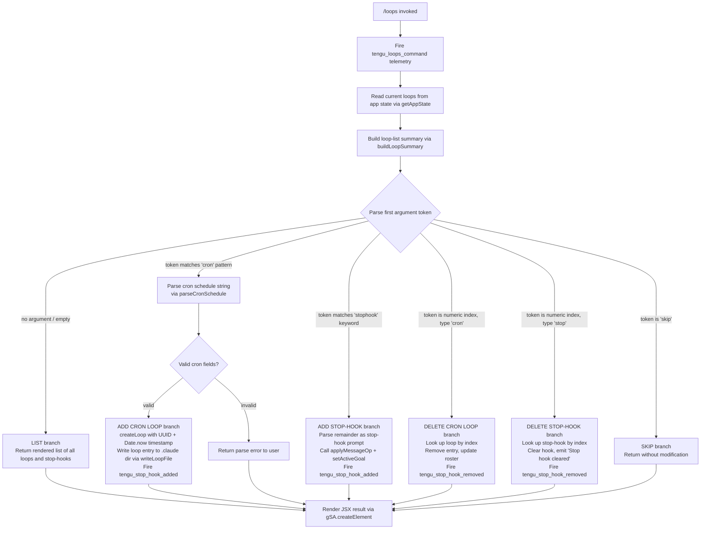

# `/loops`

> Analysis basis: CC v2.1.133 bundle.js (AST extraction + Claude interpretation)
> Minimum version: v2.1.133

---

## Overview

The `/loops` command provides a unified interface for managing **recurring loops** and **stop-hooks** within Claude Code. It allows users to list currently active loops, create new loops (cron-style or stop-hook type), and delete existing loops or stop-hooks by index. The command is implemented as an async handler (`Bz7`) that inspects app state, parses user-provided arguments, and dispatches one of several sub-operations (list, add cron loop, add stop-hook, delete loop, delete stop-hook) before rendering the result as a JSX component.

---

## Registration

| Field | Value |
|---|---|
| `type` | `local-jsx` |
| `name` | `loops` |
| `description` | `List, create, and delete recurring loops and stop-hooks` |
| `immediate` | `true` |
| `module_id` | `EMq` |
| `load_inline` | `true` |
| `loc_byte` | `11183954` |
| `loc_byte_end` | `11184136` |
| `loc_line` | `6963` |
| `arbor_handler.name` | `Bz7` |
| `arbor_handler.fqn` | `claude-2.1.133::Bz7` |
| `arbor_handler.kind` | `AsyncFunction` |
| `arbor_handler.resolution_path` | `module_id` |
| `arbor_handler.n_hits` | `0` |

Analysis basis: CC v2.1.133 bundle.js:+11183954

**Notes on registration fields:**

- `immediate: true` — the command executes without waiting for further user confirmation; results are rendered directly into the UI.
- `load_inline: true` — the handler is inlined via a `Promise.resolve({call: Bz7})` shape inside the load factory. The `arbor_handler` was resolved by following `module_id` → `EMq` → exported symbol `Bz7`.
- Registration block spans bytes `11183954`–`11184136`.

---

## Input Branching

The handler distinguishes **five or more distinct execution paths** based on the parsed sub-command token and the presence or absence of additional arguments. A Mermaid flowchart is used.



Analysis basis: CC v2.1.133 bundle.js:+11182918 (handler entry), +11183016 (cron branch), +11183102 (stophook branch), +11183205 (delete/filter branch), +11183470 (schedule parse), +11183650 (stop-hook set), +11183820 (skip branch)

---

## Behavioral Spec

### 1. Handler Entry and Telemetry (`Bz7`)

```
async function loopsCommandHandler(context):
    fire telemetry event "tengu_loops_command"          // loc +11182920
    loopList = await readLoopsFromDisk(context)         // calls readLoopData (VMH)
    summary  = buildLoopSummary(loopList)               // calls buildSummary (Tz8)
    appState = context.getAppState()
    parsedArgs = parseArguments(context.input)          // calls parseArgTokens (v6)

    result = dispatchSubCommand(parsedArgs, loopList, appState, summary)
    return renderJSX(result)                            // gSA.createElement
```

Analysis basis: CC v2.1.133 bundle.js:+11182918

---

### 2. Reading Loops from Disk (`VMH` → `UWH`)

```
async function readLoopData(context):
    loopsDir = path.join(configDir, ".claude")          // zo6.join, loc +4247577
    rawText  = fs.readFile(loopsFilePath, "utf-8")      // encoding literal loc +4246447
    parsed   = parseLoopEntries(rawText)                // J_H
    validated = validateEachEntry(parsed)               // Z9, fH
    return validated
```

- File encoding is `"utf-8"` (bundle.js:+4246447).
- If the file is absent (`ENOENT`), the function returns an empty list (error codes `ENOENT`, `EACCES`, `EPERM`, `ENOTDIR`, `ELOOP` are handled; bundle.js:+134757–134813).
- Entries that fail validation are logged via the error-logging utility (`yQ.logError`, bundle.js:+912861) with level `"error"` (bundle.js:+912836).

Analysis basis: CC v2.1.133 bundle.js:+4248407, +4246400, +4246419

---

### 3. Building the Loop Summary (`Tz8` → `cOH`, `kN9`)

```
function buildLoopSummary(loopEntries):
    labelMap = new Map()
    for entry in loopEntries:
        label = formatLabel(entry)                      // cOH: L.set, loc +8204379
        labelMap.set(entry.id, label.padEnd(colWidth))  // padding with "  " literal loc +14179363
    summaryLines = loopEntries.map(e => labelMap.get(e.id))  // kN9: H.map, loc +8204148
    return summaryLines
```

Analysis basis: CC v2.1.133 bundle.js:+11182966, +8204379, +8204387

---

### 4. Parsing a Cron Schedule String (`Uz7` → `BZ` → `UUK`)

```
function parseCronSchedule(inputString):
    trimmed = inputString.trim()                        // BZ: H.trim, loc +4243020
    fields  = splitCronFields(trimmed)                  // UUK: H.split, loc +4242440

    // Validate field counts; maximum expected fields: 5 (loc +4243056)
    // Individual field limits parsed via K.match + parseInt (loc +4242460, +4242505)
    // Numeric range bounds enforced:
    //   minutes : 0–59     (literals loc +11182651, +11182685)
    //   hours   : 0–23     (literal loc +11182756)
    //   days    : 1–31     (literal loc +11182809)
    // "Every minute" human label (loc +4244311)
    // "Every hour"   human label (loc +4244528)
    // Range notation "1-5" supported (literal loc +4245235)

    if fields.length < 3 or fields.length > 5:
        return ParseError("invalid cron field count")

    parsed = parseEachField(fields, parseInt)
    deduplicatedSet = new Set(parsed)                   // L.add, loc +4242566
    return Array.from(deduplicatedSet)                  // loc +4242968
```

- The parser accepts between 3 and 5 cron fields (bundle.js:+4243056).
- Numeric range notation (e.g., `"1-5"`) is supported (bundle.js:+4245235).
- Day-of-week handling uses UTC methods (`X.getUTCDay`, `X.setUTCDate`, `X.setUTCHours`) alongside local `X.getDay` (bundle.js:+4245068–4245147).
- `Math.max`, `Math.ceil`, and `Math.round` are used to clamp or round computed next-run timestamps (bundle.js:+11182628, +11182639, +11182712).
- Field count limit of 5, step size of 10 for range expansion (bundle.js:+4242519).

Analysis basis: CC v2.1.133 bundle.js:+11183470, +11182506, +4243020, +4242440

---

### 5. Creating a New Cron Loop (`Yo6` → `omH`)

```
async function createCronLoop(schedule, context):
    id        = crypto.randomUUID()                     // Jx1.randomUUID, loc +4247747
    createdAt = Date.now()                              // loc +4247809
    loopEntry = buildLoopEntry(id, schedule, createdAt) // hwH
    await writeLoopFile(loopEntry, context)             // omH

    // writeLoopFile (omH):
    //   ensureDir ".claude" via Oo6.mkdir           (loc +4247567)
    //   filePath = path.join(configDir, ".claude")  (loc +4247577)
    //   serialise entry via JSON (SH)               (loc +4247685)
    //   Oo6.writeFile(filePath, serialised)         (loc +4247664)

    loopList.push(loopEntry)                            // M.push, loc +4247912
    fire telemetry "tengu_stop_hook_added"
    return loopEntry
```

Analysis basis: CC v2.1.133 bundle.js:+11183568, +4247747, +4247809, +4247567, +4247899

---

### 6. Adding a Stop-Hook (`DiH`)

```
async function addStopHook(hookPrompt, context):
    appState = context.getAppState()                   // DiH: H.getAppState, loc +11181964
    buildSummary(appState)                             // Tz8, loc +11181960

    // Construct message operation of type "append" (literal loc +11182140)
    // with content type "goal" (literal loc +11182202)
    // and attachment type "attachment" (literal loc +11182241)
    // goal status field "goal_status" (literal loc +11182328)
    context.applyMessageOp("append", hookData)         // H.applyMessageOp, loc +11182117
    context.setActiveGoal(goal)                        // H.setActiveGoal, loc +11182093

    newId = crypto.randomUUID()                        // GMq.randomUUID, loc +11182259
    fire telemetry "tengu_stop_hook_added"             // loc +11181856

    return { message: "Stop hook set" }                // literal loc +11183671
```

Analysis basis: CC v2.1.133 bundle.js:+11183344, +11181953, +11182093, +11182117, +11182169

---

### 7. Deleting a Loop (`X_H` → `UWH`, `omH`)

```
async function deleteLoop(indexToken, loopList, context):
    // Determine type from loopList entry at parsed index
    target = loopList.filter(...)                      // X_H: q.filter, loc +4248135
    exists = target !== undefined

    if not exists:
        return { message: "Stop hook not found" }      // literal loc +11183362

    if target.type == "stophook":                      // literal loc +11183102
        clearStopHook(context)
        fire telemetry "tengu_stop_hook_removed"
        return { message: "Stop hook cleared" }        // literal loc +11183384

    if target.type == "cron":                          // literal loc +11183016
        updatedList = loopList without target
        writeLoopFile(updatedList, context)            // omH, loc +4248199
        fire telemetry "tengu_stop_hook_removed"
        return { message: "Stop hook cleared" }
```

Analysis basis: CC v2.1.133 bundle.js:+11183205, +4248077, +4248126, +4248135

---

### 8. Deleting a Stop-Hook (`ziH`)

```
async function deleteStopHook(context):
    appState = context.getAppState()                   // ziH: A.getAppState, loc +11181667
    buildSummary(appState)                             // Tz8, loc +11181663
    context.setActiveGoal(null)                        // A.setActiveGoal, loc +11181793
    timestamp = Date.now()                             // loc +11181841
    fire telemetry "tengu_stop_hook_removed"

    // Dispatch background task completion signal via hH (loc +11181916)
    // Record "goal_set" event (literal loc +11181919)
```

Analysis basis: CC v2.1.133 bundle.js:+11183650, +11181645, +11181793, +11181841

---

### 9. Formatting and Rendering the Result (`gSA.createElement`)

```
function renderLoopsResult(subCommandResult, summary):
    // Build JSX tree using gSA.createElement
    // Columns padded to fixed width using padEnd with "  " separator (loc +14179363)
    // Loop type labels: "Stop" for stop-hooks (literal loc +11181486),
    //                   "prompt" for prompt-type entries (literal loc +11181593)
    // Final element pushed to output array (_.push, loc +11181602)
    return <LoopsDisplay summary=summary result=subCommandResult />
```

Analysis basis: CC v2.1.133 bundle.js:+11183714, +11183764, +11183788

---

## State & Side Effects

| Item | Detail |
|---|---|
| **Telemetry: `tengu_loops_command`** | Fired on every invocation of `/loops` (bundle.js:+11182920) |
| **Telemetry: `tengu_stop_hook_added`** | Fired when a new cron loop or stop-hook is successfully created (bundle.js:+11181856) |
| **Telemetry: `tengu_stop_hook_removed`** | Fired when a loop or stop-hook is successfully deleted (bundle.js:+11182171) |
| **Telemetry: `tengu_bg_dispatch_sigkill_escalate`** | Fired in background-loop dispatch path if SIGKILL escalation occurs (bundle.js:+14157040) |
| **Telemetry: `tengu_bg_spare_enable`** | Fired when a spare background agent slot is enabled (bundle.js:+14156457) |
| **Telemetry: `tengu_bg_spare_spawn`** | Fired when a spare background agent is spawned (bundle.js:+14156817) |
| **Telemetry: `tengu_feature_bad`** / **`tengu_feature_ok`** | Feature-flag probe results logged during loop execution (bundle.js:+907437, +907381) |
| **Telemetry: `tengu_bg_low_mem_mb`** | Emitted when memory is low during background loop dispatch (bundle.js:+14156207) |
| **Telemetry: `tengu_bg_dispatch_low_mem`** | Emitted on low-memory dispatch path (bundle.js:+14157619) |
| **Telemetry: `tengu_bg_sendclaim_failed`** | Emitted if the background agent send-claim step fails (bundle.js:+14139405) |
| **Telemetry: `tengu_bg_spare_claim`** | Emitted when a spare agent slot is claimed (bundle.js:+14158355) |
| **Telemetry: `tengu_bg_spare_claim_fail`** | Emitted when spare claim fails (bundle.js:+14158618) |
| **Telemetry: `tengu_daemon_yield`** | Emitted when daemon yields to foreground/service (bundle.js:+14174626) |
| **Telemetry: `tengu_mcp_retry_failed_remote`** | Emitted on MCP remote retry failure (bundle.js:+13870729) |
| **File I/O** | Loop entries are stored under the `.claude` directory (bundle.js:+4247588). `writeFile` and `mkdir` are called on create; the file path is rewritten on delete. |
| **App state mutations** | `setActiveGoal` is called when adding or removing stop-hooks (bundle.js:+11182093, +11181793). `applyMessageOp` with type `"append"` is called when setting a stop-hook (bundle.js:+11182117). |
| **UUID generation** | Each new loop or stop-hook receives a `crypto.randomUUID()` identifier (bundle.js:+4247747, +11182259). |
| **Background agent lifecycle** | The loop dispatch path interacts with background agent spawning (`gm.spawn`), claiming (`gm.claim`), and SIGKILL/SIGTERM escalation (bundle.js:+14158677, +14157088, +14139643). Send-claim timeout is **5000 ms** (bundle.js:+14139830); retry back-off is **500 ms** (bundle.js:+14140034). |
| **Sound** | No sound effects detected in depth-2 traversal. |
| **Hook registration** | The `immediate: true` flag means no hook confirmation step; the command runs inline. |

---

## Version History

| Version | Change |
|---|---|
| v2.1.133 | Initial analysis — list, add cron, add stop-hook, delete loop, delete stop-hook sub-commands documented |

---

## Common Mistakes

1. **Providing an out-of-range index for deletion.** If the numeric index passed to `/loops <n>` does not match any existing loop or stop-hook, the command returns `"Stop hook not found"` (bundle.js:+11183362) and makes no changes.
2. **Malformed cron expression.** The cron parser (`Uz7`/`UUK`) requires between 3 and 5 fields (bundle.js:+4243056). Providing fewer than 3 or more than 5 fields causes a parse error. Minute values must be 0–59, hour values 0–23, day values 1–31.
3. **Expecting synchronous persistence.** Loop entries are written to `"${configDir}/.claude"` asynchronously. Immediately reading back the file list before the write resolves may yield stale data.
4. **Conflating loop types.** The command handles two distinct entity types: `"cron"` (scheduled loops) and `"stophook"` (stop-hooks). Deletion dispatches different code paths per type; using the wrong index can inadvertently target the wrong entity type.
5. **Assuming stop-hook survives session reload without persistence.** Stop-hooks are applied via `setActiveGoal` and `applyMessageOp`; the goal state must be persisted by the session layer independently.
6. **Using `/loops` on an unsupported version.** This command was first observed in v2.1.133; behaviour on earlier versions is undefined.

---

## Appendix — Identifier Mapping

> For bundle debugging only. Identifiers change across versions.

| Identifier | Role |
|---|---|
| `Bz7` | Main async handler for the `/loops` command (arbor_handler) |
| `d` | Shared utility / logger dispatch (called from handler entry) |
| `VMH` | Read-loops-from-disk coordinator |
| `UWH` | Loop file parser and validator |
| `F6` | File existence / stat helper |
| `J_H` | Loop entry line parser (joins path via `zo6.join`) |
| `uK` | Path/config directory resolver |
| `Z9` | Entry validation wrapper |
| `w8` | Low-level write/logging primitive |
| `fH` | Per-entry validation and error handler |
| `HA` | Error classification helper |
| `kH` | String coercion helper |
| `yq` | Traffic-type filter (`"essential-traffic"`) |
| `NJL` | Queue shift/push manager |
| `k` | Tool-call / sub-command dispatcher |
| `Ztq` | Sub-dispatch helper A |
| `SH` | JSON serialiser wrapper |
| `Uf` | Path redaction utility (replaces portions with `"[REDACTED]"`) |
| `LkH` | Unary normaliser |
| `vtq` | File-read with byte-length check and buffering |
| `BZ` | Cron string trimmer and field splitter |
| `UUK` | Cron field tokeniser (split → match → parseInt → Set) |
| `mN` | Metadata normaliser for loop entries |
| `Tz8` | Loop summary builder (populates label map) |
| `cOH` | Label formatter (calls `L.set` and `kN9`) |
| `kN9` | Map-over-entries for display labels |
| `v6` | Argument parser / token extractor |
| `UE` | Schedule-string-to-next-run-time converter |
| `w` | Background agent loop runner / dispatcher |
| `y` | Agent process kill handler |
| `WrH` | Kill signal sender A |
| `GrH` | Kill signal sender B |
| `Y` | Background agent spare-enable / spawn logic |
| `uH` | Feature-bad telemetry emitter |
| `hH` | Feature-ok telemetry emitter |
| `sFA` | Low-memory check utility |
| `J6` | Spare-agent slot manager |
| `x` | Agent timeout / retire-if-settled helper |
| `$` | Agent write / dispose wrapper |
| `nFA` | Background agent send-claim logic |
| `kd7` | Claim frame timeout handler |
| `Nd7` | Claim frame builder |
| `vH` | String cast / coerce utility |
| `Em` | Binary frame encoder (Buffer operations) |
| `tFA` | Agent roster entry lifecycle manager |
| `xL` | Roster path joiner |
| `r9` | Roster file read/write with stat and cache |
| `Hw` | Active-state setter |
| `Pf` | Roster entry serialiser |
| `tlH` | Hook execution timer / runner |
| `$qH` | Hook file path builder |
| `_N` | Hook argument splitter |
| `Vm` | Hook directory resolver |
| `J` | Agent values iterator / kill-all |
| `v` | Agent process blur/focus handler |
| `rU` | Agent connection reset utility |
| `Z` | Agent state machine |
| `I` | Agent initialiser |
| `bRq` | Agent backoff calculator |
| `X` | Loop-runner context (wraps `w`) |
| `X_H` | Delete-loop dispatcher (filter + has check) |
| `ji` | Presence check helper |
| `omH` | Loop file writer (`mkdir` + `writeFile`) |
| `DiH` | Add-stop-hook handler |
| `mz7` | Stop-hook UUID creator |
| `Uz7` | Cron expression parser (full) |
| `Yo6` | Create-cron-loop factory |
| `hwH` | Loop entry struct builder |
| `M` | MCP/agent push handler |
| `iZH` | MCP connection initialiser |
| `zt` | MCP transport selector |
| `$I` | MCP channel builder |
| `AA` | MCP auth handler |
| `AJ6` | MCP filter helper |
| `so4` | MCP OAuth flow initiator |
| `G98` | MCP key enumerator |
| `K8` | MCP debug log emitter |
| `gZA` | MCP OAuth tool handler |
| `QZA` | MCP callback-URL handler |
| `Yl9` | MCP session file writer |
| `BZA` | MCP retry/backoff handler |
| `kJA` | MCP include-list checker |
| `S` | Supervisor write / transient marker |
| `T7` | MCP error log emitter |
| `$l9` | MCP GMH wrapper |
| `_J6` | MCP parseInt field A |
| `fIA` | MCP parseInt field B |
| `mFq` | MCP update applier |
| `XM8` | MCP update serialiser |
| `hI` | MCP cleanup handler |
| `Og7` | MCP client-entry object builder |
| `T98` | MCP type-set membership checker |
| `r8` | Retry-with-timeout primitive |
| `DlH` | MCP debug log serialiser |
| `yr` | Loop metadata normaliser |
| `y7H` | Metadata trim helper |
| `oh` | Output slice / pipe helper |
| `ziH` | Delete-stop-hook handler |

---

Note: index built via Arbor fallback; some signals (telemetry, literals) may be missing — see arbor-fallback.js.