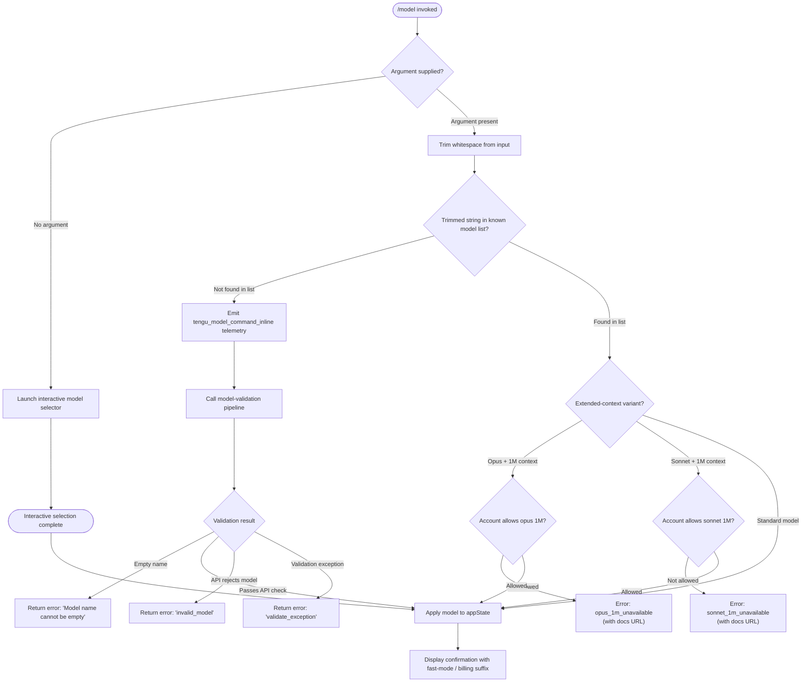

# `/model`

> Analysis basis: CC v2.1.133 bundle.js (AST extraction + Claude interpretation)
> Minimum version: v2.1.133

---

## Overview

The `/model` slash command allows users to set or switch the active AI model used by Claude Code. When given a model name argument it validates the name, checks account-level availability for special configurations such as 1M-context variants, and applies the change to application state; when invoked without an argument it presents an interactive model-selection flow.

---

## Registration

| Field | Value |
|---|---|
| type | `local` |
| name | `model` |
| description | Set the AI model for Claude Code |
| argumentHint | `<model>` |
| supportsNonInteractive | `true` |
| module\_id | `_zq` |

Analysis basis: CC v2.1.133 bundle.js:+11367608

---

## Input Branching

The command entry point (`commandHandler`) receives the raw user input string and immediately branches on whether a model name was provided inline.



Analysis basis: CC v2.1.133 bundle.js:+11360405, +11360421, +11360488, +11360508, +11360561, +11360563, +11360628

---

## Behavioral Spec

### 1. Command Handler — Inline vs. Interactive dispatch

```
function commandHandler(rawInput, appContext):
    trimmedInput = rawInput.trim()                     // +11360405

    if trimmedInput is empty:
        result = launchInteractiveSelector(appContext)
        return result

    if trimmedInput in knownModelList:                 // +11360421
        return handleKnownModelSwitch(trimmedInput, appContext)
    else:
        emit telemetry("tengu_model_command_inline")   // +11360563
        emit telemetry call to featureBad pathway      // +11360561
        state = appContext.getAppState()               // +11360444
        return runModelValidationPipeline(trimmedInput, state)
```

Analysis basis: CC v2.1.133 bundle.js:+11360405

---

### 2. Interactive Selector (`az8` — interactiveModelSelector)

When no argument is provided, the interactive selector is invoked.

```
function interactiveModelSelector(appContext):
    items = buildModelList()                           // calls fh → gA6, fW  (+11327755)
    selectedModel = presentSelectionUI(items)          // calls A (UI renderer) (+11327886)
    return selectedModel
```

The selector builds the displayed list through a sub-function (`fh`) that itself calls two helpers: one to retrieve available model identifiers (`gA6`) and one to format display labels (`fW`).

Analysis basis: CC v2.1.133 bundle.js:+11360488, +11327755, +11327676, +11327683, +11327886

---

### 3. Model Validation Pipeline (`oz8` — modelValidationOrchestrator)

This orchestrator coordinates all validation steps before a model change is committed.

```
function modelValidationOrchestrator(modelName, appState):

    // Step A: Parse and normalise the model string
    parseResult = parseModelString(modelName)          // v7H, +11325612

    // Step B: Check for a "not_allowed" account restriction
    switchCheck = checkModelSwitchAllowed(modelName)   // uH,  +11325626
    if switchCheck.status == "not_allowed":            // +11325644
        return error("not_allowed")

    // Step C: Opus 1M availability check
    if modelIdentifiesAsOpus(modelName) AND          // Aw7, +11325759
       modelRequestsOneMillionContext(modelName):     // literal "[1m]" +11327538
        if NOT accountAllowsOpus1M():
            emit event("opus_1m_unavailable")        // +11325791
            return error(OPUS_1M_ERROR_MSG)          // +11325829

    // Step D: Sonnet 1M availability check
    if modelIdentifiesAsSonnet1M(modelName):         // _w7, +11325976
        if NOT accountAllowsSonnet1M():
            emit event("sonnet_1m_unavailable")      // +11326008
            return error(SONNET_1M_ERROR_MSG)        // +11326048

    // Step E: Provider prefix check
    providerAllowed = checkProviderPrefix(modelName) // Hw7, +11326202

    // Step F: Build confirmation message and apply state
    confirmResult = applyModelAndBuildConfirmation(modelName, appState)  // wOq, +11326230

    // Step G: Validate via live API probe
    apiResult = validateModelViaApiProbe(modelName, appState)            // rz8, +11326258

    // Step H: Convert result to text output
    return convertResultToText(apiResult)                                // vH,  +11326476
```

Analysis basis: CC v2.1.133 bundle.js:+11325612, +11325626, +11325759, +11325976, +11326202, +11326230, +11326258, +11326476

---

### 4. Model String Parser (`v7H` — parseModelString)

```
function parseModelString(rawModelName):
    parts = splitOnDelimiter(rawModelName)             // _.map  +2114840
    trimmedParts = parts.map(trim)                     // M.trim +2114851, H.trim +2114877
    if any part startsWith("anthropic."):              // L.startsWith +2114903, literal +2114916
        isAnthropicNamespace = true
    if rawModelName includes known variant token:      // q.includes +2114931
        parseExtendedVariant(rawModelName)             // qx6 +2114960
    metadata = buildModelMetadata(parts)               // pRH +2115010, qc_ +2115019
    contextSize = resolveContextWindow(metadata)       // w6K +2115074, W8H +2115095
    return finaliseModelRecord(metadata, contextSize)  // Gq +2115109, J6K +2115265
```

Analysis basis: CC v2.1.133 bundle.js:+2114763, +2114840, +2114851, +2114877, +2114903, +2114916, +2114931

---

### 5. Opus 1M Availability Check (`Aw7` — checkOpus1MAvailability)

```
function checkOpus1MAvailability(modelName, accountFeatures):
    normalised = modelName.toLowerCase()               // +11327471
    isOpus = checkOpusFeatureFlag(normalised)          // yt  +11327494
    hasExtension = normalised includes "[1m]"          // literal +11327538
    isInAllowedList = accountFeatures.includes(...)    // A.includes +11327507
    if isOpus AND hasExtension AND NOT isInAllowedList:
        return { allowed: false, reason: "opus_1m_unavailable" }
    return { allowed: true }
```

Analysis basis: CC v2.1.133 bundle.js:+11327471, +11327494, +11327501, +11327507, +11327518, +11327538

---

### 6. Sonnet 1M Availability Check (`_w7` — checkSonnet1MAvailability)

```
function checkSonnet1MAvailability(modelName, accountFeatures):
    normalised = modelName.toLowerCase()               // +11327568
    isSonnet1M = normalised matches "sonnet[1m]"       // literal +11327610
                 OR normalised matches "sonnet-4-6[1m]"// literal +11327636
    isInAllowedList = accountFeatures.includes(...)    // A.includes +11327599
    if isSonnet1M AND NOT isInAllowedList:
        return { allowed: false, reason: "sonnet_1m_unavailable" }
    return { allowed: true }
```

Analysis basis: CC v2.1.133 bundle.js:+11327568, +11327591, +11327599, +11327610, +11327636

---

### 7. Provider Prefix Check (`Hw7` — checkProviderPrefix)

```
function checkProviderPrefix(modelName):
    normalised = modelName.toLowerCase()               // +11327425
    if allowedProviderPrefixes.includes(normalised):   // P8H.includes +11327412
        return { allowed: true }
    return { allowed: false }
```

Analysis basis: CC v2.1.133 bundle.js:+11327412, +11327425

---

### 8. Apply Model and Build Confirmation (`wOq` — applyModelAndBuildConfirmation)

```
function applyModelAndBuildConfirmation(modelName, appState):
    currentState = getAppState()                       // A  +11326512
    modelRecord  = resolveModelRecord(modelName)       // zXH +11326527
    appState["model"] = modelRecord                    // literal "model" +11326531

    // Determine fast-mode and billing display suffix
    isFastMode = evaluateFastMode(modelRecord)         // h8 +11326544
    billingExtra = evaluateBillingExtra(modelRecord)   // _  +11326564

    label = formatModelLabel(modelRecord)              // hH +11326626
    boldLabel = label.bold()                           // M6.bold +11326667

    // Build confirmation line helper
    confirmLine = buildConfirmLine(boldLabel, isFastMode, billingExtra)  // fh +11326675

    suffix = ""
    if isFastMode:
        suffix = " · Fast mode ON"                    // literal +11326775
        billingNote = " · Billed as extra usage"      // literal +11326826
    else:
        suffix = " · Fast mode OFF"                   // literal +11326869

    applyStateChange(appState)                        // aq  +11326696
    persistModelSetting(modelRecord)                  // I7H +11326705
    triggerUiRefresh()                                // FY  +11326712

    handleLegacyOverride(modelRecord)                 // rzH +11326804
    resolveAlias(modelRecord)                         // LX  +11326817
    emitConfirmationEvent(modelRecord)                // eY7 +11326901

    return { confirmationText: boldLabel + suffix }
```

Analysis basis: CC v2.1.133 bundle.js:+11326512, +11326527, +11326531, +11326544, +11326564, +11326626, +11326667, +11326675, +11326696, +11326704, +11326712, +11326775, +11326804, +11326817, +11326826, +11326869, +11326901

---

### 9. Live API Validation Probe (`rz8` — validateModelViaApiProbe)

The command sends a minimal probe request to verify the model string is accepted by the API before committing the change.

```
function validateModelViaApiProbe(modelName, appState):
    trimmed = modelName.trim()                         // H.trim  +11323825
    if trimmed is empty:
        return error("Model name cannot be empty")     // literal +11323862

    parseResult = parseModelString(trimmed)            // v7H     +11323896
    normalised  = trimmed.toLowerCase()                // A.toLowerCase +11323986

    if allowedProviderList.includes(normalised):       // P8H.includes  +11324005
        // already known; skip probe
        return { valid: true, model: parseResult }

    if probeCache.has(normalised):                     // YOq.has +11324107
        return probeCache.get(normalised)

    // Construct a minimal "Hi" probe message
    probeMessages = [
        { role: "user", content: "Hi" }               // literals +11324237, +11324271
    ]
    probeOptions = { cacheControl: "ephemeral" }       // literal +11324296

    apiResponse = callApiForValidation(               // NR      +11324152
        normalised, probeMessages, probeOptions
    )

    probeCache.set(normalised, apiResponse)            // YOq.set +11324315
    processValidationResponse(apiResponse)             // sY7     +11324356

    if apiResponse is error:
        emit event("model_validation")                 // literal +11324202
        return { valid: false, reason: "invalid_model" }

    return { valid: true, model: parseResult }
```

**Key constants:**

- Probe message content: `"Hi"` (bundle.js:+11324271)
- Cache control header value: `"ephemeral"` (bundle.js:+11324296)
- Probe message role: `"user"` (bundle.js:+11324237)
- Error label for API rejection: `"invalid_model"` (bundle.js:+11326302)
- Error label for thrown exception: `"validate_exception"` (bundle.js:+11326410)
- Telemetry event for validation failure: `"model_validation"` (bundle.js:+11324202)

Analysis basis: CC v2.1.133 bundle.js:+11323825, +11323862, +11323896, +11323986, +11324005, +11324107, +11324152, +11324202, +11324237, +11324271, +11324296, +11324315, +11324356

---

### 10. `tengu_feature_bad` pathway (`uH` — featureBadReporter)

When model switching is blocked at the account level, a `tengu_feature_bad` telemetry event is emitted before returning the error to the user.

```
function featureBadReporter(context, reason):
    emit telemetry("tengu_feature_bad", { reason })    // +907437
    return buildErrorResult(context, reason)           // d +907435
```

Analysis basis: CC v2.1.133 bundle.js:+907435, +907437

---

### 11. Result-to-Text Converter (`vH` — resultToText)

```
function resultToText(result):
    return String(result)                              // +134176
```

Analysis basis: CC v2.1.133 bundle.js:+134176

---

### 12. Output type

Confirmation messages are returned with content type `"text"`.

Analysis basis: CC v2.1.133 bundle.js:+11360472

---

## State & Side Effects

| Item | Detail |
|---|---|
| Telemetry — inline switch | `tengu_model_command_inline` fired when an unrecognised model name is supplied as an inline argument (bundle.js:+11360563) |
| Telemetry — feature blocked | `tengu_feature_bad` fired when the account is not permitted to use the requested model (bundle.js:+907437) |
| appState changes | `appState["model"]` is updated to the resolved model record upon successful validation (bundle.js:+11326531) |
| Model setting persistence | The resolved model record is written to persistent settings via `persistModelSetting` (bundle.js:+11326705) |
| UI refresh | A UI refresh is triggered after state is applied (bundle.js:+11326712) |
| Probe cache | A module-level `Map` (`YOq`) caches API probe results keyed on the lowercased model name to avoid redundant network calls (bundle.js:+11324107, +11324315) |
| Sound | <!-- TODO: not found in depth-2 traversal; needs --depth 4 --> |
| Hook registration | <!-- TODO: not found in depth-2 traversal; needs --depth 4 --> |

---

## Version History

| Version | Change |
|---|---|
| v2.1.133 | Initial analysis. Covers inline argument dispatch, interactive selector, provider-prefix validation, Opus/Sonnet 1M account checks, live API probe with `"Hi"` message, fast-mode and billing suffix rendering. |

---

## Common Mistakes

1. **Omitting the argument**: Invoking `/model` with no argument launches the interactive selector rather than printing the current model. There is no "print current model" sub-command at this depth.
2. **Using an alias that includes `[1m]` on an ineligible account**: The command will surface an account-restriction error with a documentation URL before any API call is made. The error is not a transient failure — it indicates a plan limitation.
3. **Assuming the command is purely client-side**: The validation pipeline sends a live `"Hi"` probe to the API when the model string is unrecognised and not already cached. This requires an active network connection and valid credentials.
4. **Expecting instant fallback on API rejection**: The probe result is cached in a module-level `Map`; a rejected model will continue to be rejected for the lifetime of the process without a restart.
5. **Case sensitivity**: All provider-prefix and variant checks normalise the input to lowercase before comparison. Submitting `Opus` and `opus` are equivalent, but the stored model name may differ from what was entered — always verify via the confirmation message.
6. **Non-interactive mode assumptions**: The command declares `supportsNonInteractive: true`. In non-interactive contexts the interactive selector path is unavailable; an explicit model argument must be supplied.

---

## Appendix — Identifier Mapping

> For bundle debugging only. Identifiers change across versions.

| Identifier | Role |
|---|---|
| `dw7` | Command handler — entry point; trims input, dispatches to interactive or inline path |
| `H` | Generic async helper / UI animation scheduler (uses `Math.random` and `setTimeout`) |
| `A` | App-state accessor / UI renderer used in multiple sub-functions |
| `az8` | Interactive model selector — launched when no argument is given |
| `fh` | Model-list builder — constructs the list of selectable models for display |
| `d` | Error-result builder — constructs structured error return values |
| `oz8` | Model validation orchestrator — coordinates all validation and state-application steps |
| `v7H` | Model string parser — splits, trims, and annotates a raw model name string |
| `uH` | Feature-bad reporter — emits `tengu_feature_bad` and returns a blocked-account error |
| `Aw7` | Opus 1M availability checker — detects `opus` + `[1m]` and verifies account permission |
| `_w7` | Sonnet 1M availability checker — detects `sonnet[1m]` / `sonnet-4-6[1m]` and verifies account permission |
| `Hw7` | Provider-prefix checker — validates that the model name begins with an allowed provider prefix |
| `wOq` | Apply-model-and-build-confirmation — writes model to appState and constructs the confirmation string with fast-mode/billing suffix |
| `rz8` | Live API validation probe — sends a minimal `"Hi"` message to confirm the model is accepted; caches results |
| `vH` | Result-to-text converter — wraps the final result in `String()` for output |