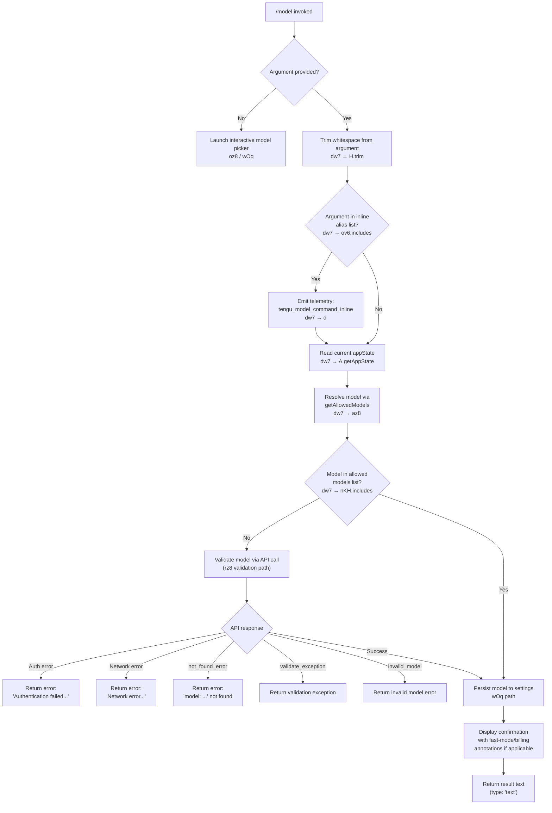

# `/model`

> Analysis basis: CC v2.1.133 bundle.js (AST extraction + Claude interpretation)
> Minimum version: v2.1.133

---

## Overview

The `/model` command allows users to switch the active AI model for the current Claude Code session. When invoked with a model name argument, it validates the requested model against the current account's allowed models and, if valid, updates the session's active model. When invoked without an argument (interactive mode), it presents an interactive model-selection picker.

---

## Registration

| Field | Value |
|---|---|
| `type` | `local` |
| `name` | `model` |
| `description` | `Set the AI model for Claude Code` |
| `argumentHint` | `<model>` |
| `supportsNonInteractive` | `true` |
| `module_id` | `_zq` |
| `load_inline` | `true` |
| `loc_byte` | `11367608` |
| `loc_byte_end` | `11367782` |
| `loc_line` | `7116` |
| `arbor_handler.name` | `dw7` |
| `arbor_handler.fqn` | `claude-2.1.133::dw7` |
| `arbor_handler.kind` | `AsyncFunction` |
| `arbor_handler.resolution_path` | `module_id` |
| `arbor_handler.n_hits` | `0` |

The registration block spans bytes `11367608`–`11367782`.
Analysis basis: CC v2.1.133 bundle.js:+11367608

---

## Input Branching

The command has four distinct top-level branches based on whether an argument is provided, whether the model name is in the inline alias list, and whether it resolves to a known/valid model. A Mermaid flowchart is used accordingly.



Analysis basis: CC v2.1.133 bundle.js:+11360405, +11360421, +11360444, +11360488, +11360508, +11360561, +11360628

---

## Behavioral Spec

### Main Handler (`dw7`)

```
async function handleModelCommand(args, context):
    modelArg = args.trim()                          // bundle.js:+11360405

    if modelArg in INLINE_ALIAS_LIST:               // bundle.js:+11360421
        emit telemetry("tengu_model_command_inline") // bundle.js:+11360563
        // inline alias path continues below

    appState = context.getAppState()                // bundle.js:+11360444
    allowedModels = getAllowedModels(appState)       // bundle.js:+11360488

    if modelArg not in allowedModels:               // bundle.js:+11360508
        // fall through to API validation path
        result = validateModelViaApi(modelArg)      // bundle.js:+11360628
        return result
    else:
        return persistAndConfirmModel(modelArg, appState)
```

Analysis basis: CC v2.1.133 bundle.js:+11360405

---

### Get Allowed Models (`az8`)

```
function getAllowedModels(appState):
    modelList = buildModelList(appState)            // calls fh → gA6
    filteredList = applyPlatformFilters(modelList)  // calls fh → fW
    return filteredList
```

The model-list builder (`gA6`) normalises model aliases through a normalisation function (`Gq`) that:
1. Trims and lower-cases the input string (bundle.js:+2120307, +2120318)
2. Replaces formatting tokens such as `[1m]` (bundle.js:+2120429)
3. Resolves short aliases: `"sonnet"` → full model ID (bundle.js:+2120444), `"haiku"` (bundle.js:+2120483), `"opus"` (bundle.js:+2120522), `"best"` (bundle.js:+2120559)
4. Handles the special alias `"opusplan"` → `"Opus in plan mode, else Sonnet"` (bundle.js:+2118961, +2118978)
5. Applies platform-tier filtering: `"firstParty"` (bundle.js:+2119169), with tier checks for `"max"` (bundle.js:+2890157), `"team"` (bundle.js:+2890228), `"default_claude_max_5x"` (bundle.js:+2890243), `"enterprise"` (bundle.js:+2890338), `"enterprise_usage_based"` (bundle.js:+2890360)
6. Applies cloud-provider mapping: `"anthropicAws"` (bundle.js:+1981378), `"bedrock"` (bundle.js:+1980750), `"foundry"` (bundle.js:+1980800), `"mantle"` (bundle.js:+1980910), `"vertex"` (bundle.js:+1980958)

Analysis basis: CC v2.1.133 bundle.js:+11360488

---

### Model Validation via API (`rz8`)

```
async function validateModelViaApi(modelName):
    if modelName is empty:
        return error("Model name cannot be empty")  // bundle.js:+11323862

    modelList = buildModelList()                    // bundle.js:+11323896
    normalised = modelName.toLowerCase()            // bundle.js:+11323986

    if normalised in PROVIDER_PREFIX_LIST:          // bundle.js:+11324005
        // provider prefix matched; skip API call

    if normalised already in validationCache:       // bundle.js:+11324107
        return cached result

    // Perform live API validation call (NR / globalThis.fetch)
    response = await apiRequest(                    // bundle.js:+12081910
        model   = modelName,
        message = "Hi",                             // bundle.js:+11324271
        cacheType = "ephemeral"                     // bundle.js:+11324296
    )

    store result in validationCache                 // bundle.js:+11324315

    switch response.errorType:
        case "model_validation":                    // bundle.js:+11324202
            // check sub-reasons:
            case auth failure:
                emit telemetry result "not_allowed" // bundle.js:+11325644
                return "Authentication failed. Please check your API credentials."
                                                    // bundle.js:+11324562
            case network error:
                return "Network error. Please check your internet connection."
                                                    // bundle.js:+11324664
            case not_found_error + "model:" in msg: // bundle.js:+11324783, +11324865
                return model-not-found message
            case "invalid_model":                   // bundle.js:+11326302
                return invalid-model message
            case "validate_exception":              // bundle.js:+11326410
                return exception message
        default:
            return success → proceed to persistAndConfirmModel
```

Known model IDs validated by the API path include (literals found in traversal):
- `claude-opus-4-0`, `claude-opus-4-1`, `claude-opus-4-5`, `claude-opus-4-6` (bundle.js:+2861525, +2861718, +2861741, +2861764)
- `claude-sonnet-4-0`, `claude-sonnet-4-5`, `claude-sonnet-4-6` (bundle.js:+2861548, +2861812, +2861837)
- `claude-haiku-4-5` (bundle.js:+2861862)
- `claude-3-` prefixed models (bundle.js:+2861507)

Analysis basis: CC v2.1.133 bundle.js:+11323825

---

### Extended-Context (1 M) Availability Checks

Two availability guards are applied before confirming a 1 M-context model:

**Opus 1 M guard (`Aw7`)**

```
function checkOpus1MAvailability(accountInfo):
    if account does not support 1M context:
        emit result code "opus_1m_unavailable"      // bundle.js:+11325791
        return error(
            "Opus with 1M context is not available for your account. " +
            "Learn more: https://code.claude.com/docs/en/model-config#extended-context-with-1m"
        )                                           // bundle.js:+11325829
```

**Sonnet 1 M guard (`_w7`)**

```
function checkSonnet1MAvailability(accountInfo):
    if account does not support 1M context:
        emit result code "sonnet_1m_unavailable"    // bundle.js:+11326008
        return error(
            "Sonnet 4.6 with 1M context is not available for your account. " +
            "Learn more: https://code.claude.com/docs/en/model-config#extended-context-with-1m"
        )                                           // bundle.js:+11326048
```

The `[1m]` suffix token (bundle.js:+2120429) and aliases `"sonnet[1m]"` / `"sonnet-4-6[1m]"` (bundle.js:+11327610, +11327636) are recognised and routed through these guards.

Analysis basis: CC v2.1.133 bundle.js:+11325791, +11326008

---

### Persist and Confirm Model (`wOq`)

```
function persistAndConfirmModel(resolvedModel, appState):
    settingsObj = readSettings()                    // zXH → Lk
    settingsObj["model"] = resolvedModel            // bundle.js:+11326531

    // Determine display annotations
    annotation = ""
    if fastModeActive:
        annotation += " · Fast mode ON"            // bundle.js:+11326775
    if billedAsExtraUsage:
        annotation += " · Billed as extra usage"   // bundle.js:+11326826
    if fastModeOff:
        annotation += " · Fast mode OFF"           // bundle.js:+11326869

    displayLine = bold(resolvedModel) + annotation  // bundle.js:+11326667

    // Build full response using formatModelList (eY7)
    modelRows = formatModelRows(allowedModels)      // eY7 → Qb, M6.dim, M6.bold, WU
    writeSettings(settingsObj)                      // h8 path
    return { type: "text", body: displayLine + modelRows }
                                                    // bundle.js:+11360472
```

Settings persistence writes to:
- `projectSettings` → `.claude/settings.json` (bundle.js:+1161331, +1161364, +1161374)
- `localSettings` → `.claude/settings.local.json` (bundle.js:+1161395, +1161436)
- `flagSettings` and `policySettings` fields are also consulted (bundle.js:+1034576, +1034598)

Analysis basis: CC v2.1.133 bundle.js:+11326230

---

### Interactive Model Picker (`oz8`)

```
async function launchInteractivePicker(context):
    modelList = buildDisplayableModelList()         // v7H
    // v7H filters models:
    //   - strips "anthropic." prefix          bundle.js:+2114916
    //   - accepts "claude-" prefix entries    bundle.js:+2114536
    //   - pads display columns to width 40    bundle.js:+14181334
    
    userSelection = await renderInteractiveList(
        items = modelList,
        default = "default"                         // bundle.js:+11325588
    )                                               // uH → d (interactive UI)

    if userSelection is null:
        return                                      // user cancelled

    return persistAndConfirmModel(userSelection, context.appState)
```

The display list builder (`v7H`) calls `qx6` for alias expansion (bundle.js:+2114960), `pRH` for prefix checks (bundle.js:+2115010), `qc_` for index lookup (bundle.js:+2115019), and `W8H` / `Gq` for normalisation (bundle.js:+2115095, +2115109).

The `"opusplan"` entry renders as `"Opus Plan"` in the picker UI (bundle.js:+2119269).

Analysis basis: CC v2.1.133 bundle.js:+11325612

---

### Model Switch Telemetry Sub-handler (`sY7` / `tY7`)

```
function emitModelSwitchTelemetry(newModel, previousModel):
    eventData = {
        event: "model_switch",                      // bundle.js:+11325629
        from: previousModel,
        to:   newModel
    }
    // tY7 checks specific model identifiers:
    //   opus_4_7  bundle.js:+11325156
    //   opus_4_6  bundle.js:+11325225
    //   opus-4-5  bundle.js:+11325270  (opus_4_5  bundle.js:+11325294)
    //   sonnet_4_6 bundle.js:+11325365
    //   sonnet-4-5 bundle.js:+11325414  (sonnet_4_5 bundle.js:+11325440)
    emit(eventData)
```

Analysis basis: CC v2.1.133 bundle.js:+11324356

---

## State & Side Effects

| Item | Detail |
|---|---|
| Telemetry — `tengu_model_command_inline` | Fired when the argument matches an inline alias (bundle.js:+11360563) |
| Telemetry — `tengu_mcp_retry_failed_remote` | Fired by MCP retry subsystem reached during model resolution (bundle.js:+13870729) |
| Telemetry — `tengu_feature_bad` | Fired on feature-flag check failure inside interactive UI helper (bundle.js:+907437) |
| Telemetry — `tengu_feature_ok` | Fired on successful feature-flag check (bundle.js:+907381) |
| Telemetry — `tengu_prompt_cache_1h_config` | Fired when 1-hour prompt-cache configuration is active during API validation (bundle.js:+12045606) |
| Telemetry — `tengu_api_success` | Fired after a successful API round-trip during model validation (bundle.js:+12083281) |
| `appState` changes | `model` key updated via `getAppState` → settings write path (bundle.js:+11360444, +11326531) |
| Settings files written | `.claude/settings.json` and/or `.claude/settings.local.json` depending on scope |
| Validation cache | Result of API validation stored in `YOq` (Map); `YOq.has` checked before re-querying (bundle.js:+11324107); `YOq.set` stores result (bundle.js:+11324315) |
| Sound | <!-- TODO: not found in depth-2 traversal; needs --depth 4 --> |
| Hook registration | <!-- TODO: not found in depth-2 traversal; needs --depth 4 --> |

---

## Version History

| Version | Change |
|---|---|
| v2.1.133 | Initial analysis |

---

## Common Mistakes

1. **Passing an empty string as the model argument** — the handler explicitly guards against empty model names and returns `"Model name cannot be empty"` (bundle.js:+11323862) rather than performing any lookup.
2. **Expecting immediate API calls for well-known models** — if the provided name already appears in the allowed-models list (`nKH.includes`), no network request is made; the model is applied directly. Network validation is only triggered for unknown names.
3. **Using short aliases in non-interactive (scripted) mode** — aliases such as `"sonnet"`, `"haiku"`, `"opus"`, and `"best"` are resolved through the normaliser (`Gq`); however, the `"opusplan"` alias is only fully rendered in the interactive picker and may produce unexpected output in `--non-interactive` invocations.
4. **Assuming 1 M context is universally available** — the `[1m]` suffix and `"sonnet[1m]"` / `"sonnet-4-6[1m]"` aliases trigger explicit account-eligibility checks; ineligible accounts receive a link to the documentation rather than a model switch.
5. **Expecting instant settings persistence without API latency** — for models not in the cached allowed list, a live `globalThis.fetch` validation call is made (bundle.js:+12081910); the command is async and the caller should await completion.

---

## Appendix — Identifier Mapping

> For bundle debugging only. Identifiers change across versions.

| Identifier | Role |
|---|---|
| `dw7` | Main async handler for `/model` command (Arbor-resolved entry point) |
| `az8` | Get-allowed-models orchestrator |
| `fh` | Model-list builder coordinator (calls `gA6` and `fW`) |
| `gA6` | Core model-list constructor; invokes alias normaliser `Gq` |
| `Gq` | Model alias/name normaliser (trim, toLowerCase, alias resolution) |
| `aw` | Helper called by `gA6` (model metadata lookup) |
| `fW` | Platform filter applicator for model list |
| `C_` | Model filter sub-step (calls `rY`, `wU`, `V_`) |
| `kr` | Tier filter: checks `"max"` tier |
| `k7H` | Tier filter: checks `"team"` / `"default_claude_max_5x"` |
| `FRH` | Tier filter: checks `"enterprise"` / `"enterprise_usage_based"` |
| `Ek` | Model-entry formatter (calls `zM`, `DM`) |
| `LX` | Model-list layout helper |
| `zM` | Model display-name builder |
| `Q_` | Provider-type resolver (bedrock, foundry, mantle, vertex) |
| `DM` | Additional provider resolver |
| `pV` | Picker-value formatter |
| `oz8` | Interactive model-picker launcher |
| `v7H` | Display-list builder for interactive picker |
| `uH` | Interactive UI renderer (calls `d`) |
| `Aw7` | Opus 1 M context availability check |
| `_w7` | Sonnet 1 M context availability check |
| `Hw7` | Provider-prefix inclusion check |
| `wOq` | Persist-and-confirm model handler |
| `zXH` | Settings reader/writer coordinator |
| `Lk` | Settings file accessor (flagSettings, policySettings) |
| `h8` | Settings write helper |
| `hH` | Display helper (calls `d`) |
| `aq` | Output formatter |
| `kH` | String coercion utility |
| `I7H` | Inline annotation builder |
| `FY` | Fast-mode annotation resolver (opus-4-6, opus-4-7 checks) |
| `Hx` | Annotation string builder |
| `rzH` | Billing-annotation resolver (sonnet-4-6 check) |
| `fX` | Model-string formatter calling `Gq` / `fW` |
| `B0` | Base model-ID resolver |
| `eY7` | Full model-list formatter for confirmation output |
| `Qb` | Settings path joiner |
| `WU` | Model row display builder |
| `rz8` | API-validation orchestrator |
| `NR` | Low-level API request executor (`globalThis.fetch`) |
| `Jx` | HTTP request builder (headers, auth, user-agent) |
| `j` | Stream/buffer reader for API responses |
| `yPH` | Response classifier (claude-3-, claude-opus-4-0, claude-sonnet-4-0) |
| `G` | Response accumulator |
| `rT7` | Response finder/parser |
| `oxA` | Request hash generator (sha256) |
| `Gd6` | Retry / cache-control handler |
| `Wd6` | Prompt-cache query helper |
| `zTH` | Prompt-cache 1 h config checker |
| `VZ` | Token/auth validator |
| `v` | Retry back-off scheduler |
| `r2q` | Request metadata builder |
| `mP` | Model-name sanitiser |
| `lF6` | Temperature / claude-3 model classifier |
| `xP` | Message-map helper |
| `LMH` | Response structure validator |
| `TwH` | Telemetry emitter for api_success |
| `F76` | Cache-control tag writer |
| `ma` | Cache-control tag reader |
| `YaH` | Cache-control cache_control field handler |
| `sY7` | Model-switch telemetry orchestrator |
| `tY7` | Model-switch telemetry detail emitter |
| `vH` | String-to-display converter |
| `iZH` | MCP connection initialiser |
| `mFq` | MCP update applier |
| `Og7` | MCP client manager |
| `J6` | MCP server connection tracker |
| `qx6` | Model alias expander |
| `mA` | Alias database accessor |
| `pRH` | Prefix-check helper |
| `qc_` | Index-of helper for model list |
| `w6K` | Model inclusion checker |
| `W8H` | Provider prefix checker |
| `J6K` | Model-entry key builder |
| `_c_` | Model-ID prefix validator |
| `yt` | Context-limit resolver |
| `T8H` | Token-limit helper |
| `qZ9` | Context-window query |
| `_9H` | Extended context-limit resolver |
| `K` | Active-task tracker |
| `k` | Model-display-name formatter |
| `$` | Query dispatcher |
| `d` | Core interactive UI primitive |
| `f` | UI close handler |
| `M` | MCP manager |
| `L` | Column-padding utility |
| `q` | File unlink / includes helper |
| `H` | Jitter/delay utility (Math.random + setTimeout) |

---

Note: index built via Arbor fallback; some signals (telemetry, literals) may be missing — see arbor-fallback.js.