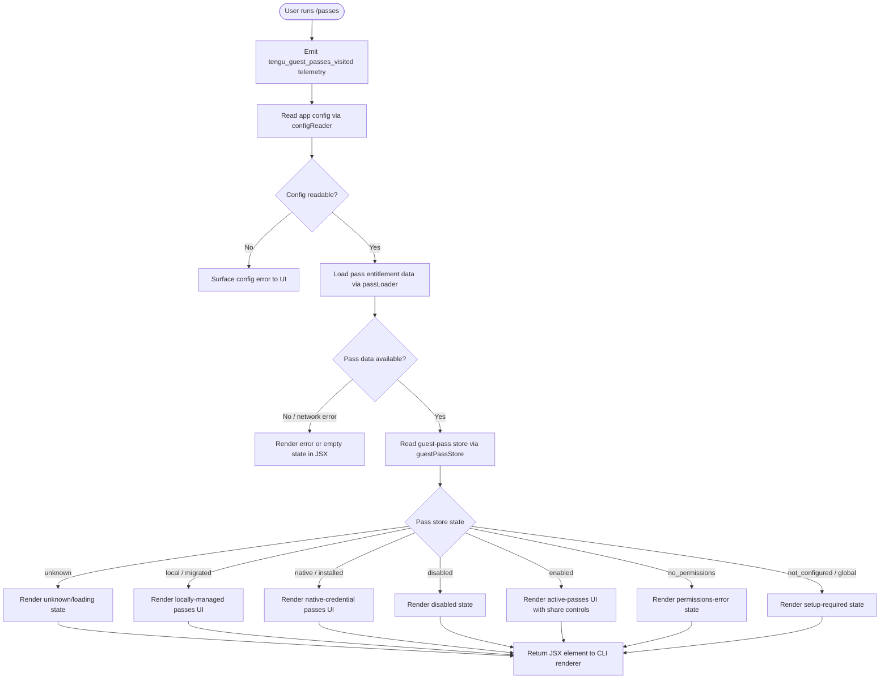

# `/passes`

> Analysis basis: CC v2.1.133 bundle.js (AST extraction + Claude interpretation)
> Minimum version: v2.1.133

---

## Overview

The `/passes` command allows a user to share a free week of Claude Code with friends by presenting and managing guest-pass tokens. It is implemented as a `local-jsx` command, meaning its output is rendered as a React JSX element directly in the CLI. The command records a telemetry visit event when it is invoked.

---

## Registration

| Field | Value |
|---|---|
| `type` | `local-jsx` |
| `name` | `passes` |
| `description` | Share a free week of Claude Code with friends |
| `module_id` | `bfq` |
| `load_inline` | `true` |
| `isHidden` | `null` (not hidden) |
| `loc_byte` | `11131881` |
| `loc_byte_end` | `11132201` |
| `loc_line` | `6869` |
| `arbor_handler.name` | `Xz7` |
| `arbor_handler.fqn` | `claude-2.1.133::Xz7` |
| `arbor_handler.kind` | `AsyncFunction` |
| `arbor_handler.resolution_path` | `module_id` |
| `arbor_handler.n_hits` | `2` |

Analysis basis: CC v2.1.133 bundle.js:+11131881

---

## Input Branching

The command's top-level handler (`Xz7`) delegates to three distinct internal paths before assembling a JSX result: it fetches configuration state (via the config reader `R6`), fetches pass data (via the pass-data loader `PO8`/`F7`), and reads the current guest-pass store (`e6`). Three or more clearly distinct branches are present, so a flowchart is used.



Analysis basis: CC v2.1.133 bundle.js:+11131564 (handler entry), +3108914 (state literals)

---

## Behavioral Spec

### 1. Top-level Handler — `guestPassesCommandHandler` (`Xz7`)

```
async function guestPassesCommandHandler(context):
    emit telemetry("tengu_guest_passes_visited")       // +11131704

    config    = await readConfig(context)              // R6, +11131564
    passData  = await loadPassEntitlement(context)     // PO8 → F7, +11131598
    passStore = await readGuestPassStore(context)      // e6, +11131604

    element = CSA.createElement(
        PassesUIComponent,
        { config, passData, passStore, ...context }    // +11131753
    )
    return element
```

Analysis basis: CC v2.1.133 bundle.js:+11131564, +11131598, +11131604, +11131702, +11131753

---

### 2. Config Reader — `readConfig` (`R6`)

```
function readConfig(context):
    startTime = Date.now()                             // +3110190
    rawConfig = configFileReader(context)              // F6, +3110101
    parsed    = parseConfigObject(rawConfig)           // t2, +3110115
    merged    = mergeConfigDefaults(parsed)            // He8, +3110134
    result    = applyConfigTransforms(merged)          // m5H, +3110138
    watchedResult = watchConfigFile(result)            // u2K, +3110243
    return watchedResult
```

Analysis basis: CC v2.1.133 bundle.js:+3110101

---

### 3. Config File Transformer — `applyConfigTransforms` (`m5H`)

Reads and transforms the on-disk config file. Includes a guard against accessing config before it is ready:

```
function applyConfigTransforms(configObj):
    if not configObj.ready:
        throw Error("Config accessed before allowed.")   // +3113217

    raw = fs.readFileSync(configPath, "utf-8")           // +3113273, +3113300

    parsed = safeJsonParse(raw)                          // p6 → JSON.parse, +3113320
    parsed = stripAnthropicPrefix(parsed)                // nh, +3113323

    // Map numeric/string status to canonical string constants
    // Status values: "unknown", "local", "migrated", "installed",
    //                "native", "disabled", "enabled",
    //                "no_permissions", "not_configured", "global"
    //                (+3108914 … +3109141)

    if parsed.status == ENOENT_SENTINEL:                 // +3113447
        return defaultConfigObject()

    result = buildTypedConfig(parsed)                    // A, +3113340
    result.statusCode = String(result.code)              // +3113394

    backupPath = resolveBackupPath(configPath)           // PX1, +3113463
    result.backupInfo = backupPath

    if ioError (EEXIST etc.):                            // +3114068
        emit telemetry("tengu_config_parse_error")       // +3113854

    fs.statSync(configPath)                              // +3113814
    fs.copyFileSync(src, dest)                           // +3114362
    return result
```

Analysis basis: CC v2.1.133 bundle.js:+3113211, +3113273, +3113854

---

### 4. Backup Path Resolver — `resolveBackupPath` (`PX1`)

```
function resolveBackupPath(configPath):
    base    = path.basename(configPath)                 // Ez.basename, +3112825
    backDir = buildBackupDirectory(configPath)          // Me8, +3112842
    // Me8 joins configDir with "backups" literal       // +3112785

    entries = fs.readdirStringSync(backDir)             // A.readdirStringSync, +3112858

    // Filter entries starting with backup prefix       // M.startsWith, +3112893
    // Walk directory tree resolving symlinks           // Ez.join, +3112949
    //                                                     Ez.dirname, +3112975
    // Entries starting with "." are skipped            // $.startsWith, +3113034

    stats = fs.statSync(backupCandidate)                // A.statSync, +3113134
    return resolvedBackupPath
```

Analysis basis: CC v2.1.133 bundle.js:+3112818

---

### 5. Pass Entitlement Loader — `loadPassEntitlement` (`PO8` → `F7`)

```
async function loadPassEntitlement(context):
    sessionData = await fetchSession(context)           // F7, +10804373
    // F7 internally calls rY (sessionFetcher) which:
    //   - resolves HK (headerBuilder)
    //   - resolves NS (networkSender)
    //   - resolves _O (responseObjectBuilder)
    //     which reads env ANTHROPIC_API_KEY (+2874043)
    //     throws if neither API key nor OAuth token present (+2874464)
    //   - resolves o96 (statusCodeChecker)
    configResult = await readConfig(context)            // R6, +10804421
    return { sessionData, configResult }
```

Analysis basis: CC v2.1.133 bundle.js:+10804373, +10804421, +2874043, +2874464

---

### 6. Guest-Pass Store Reader — `readGuestPassStore` (`e6`)

```
async function readGuestPassStore(context):
    parsed    = parseConfigObject(context)              // t2, +3108279
    randomCtx = getRandomContext()                      // H, +3108299
    flagState = featureFlag(context)                    // fxH, +3108331

    entries = buildPassEntries(context)                 // jX1 → Object.entries, +3108350
    // jX1 iterates over pass records

    timestamps = getTimestamps()                        // MxH → Date.now, +3108375

    configData = readConfig(context)                    // k, +3108391
    rawPasses  = applyConfigTransforms(context)         // m5H, +3108456

    storeState = resolveStoreState(rawPasses)           // lq6, +3108472
    // storeState is one of the status literals:
    //   "unknown"(+3108935), "migrated"(+3108997), "local"(+3109010),
    //   "installed"(+3109028), "native"(+3109042),
    //   "disabled"(+3109061), "enabled"(+3109087),
    //   "no_permissions"(+3109101), "not_configured"(+3109122),
    //   "global"(+3109141)

    disk   = readFromDisk(storeState)                   // d, +3108608
    render = buildRenderInfo(storeState)                // Ke8, +3108722
    // Ke8 calls KhH (atomicFileWriter) which performs
    //   temp-file → fsync → rename cycle              // +3110883

    if storeState includes backup sentinel:
        backupInfo = resolveBackupPath(configPath)      // PX1, implied via Ke8→KhH

    return { storeState, disk, render, entries }
```

Analysis basis: CC v2.1.133 bundle.js:+3108275, +3108914, +3109141

---

### 7. Config Lock / Save Guard — `saveConfigWithLock` (`fe8`)

Called as a side-effect when the command mutates pass state (e.g., claiming a pass):

```
async function saveConfigWithLock(config):
    dir = path.dirname(configPath)                      // Ez.dirname, +3110979
    fs.mkdirSync(dir, { recursive: true })              // K.mkdirSync, +3111000
    lockStart = Date.now()                              // +3111045
    lockObj = acquireLock(configPath)                   // ql_, +3111058

    if lock took too long:
        emit telemetry("tengu_config_lock_contention")  // +3111273
        log warn "Lock acquisition took longer..."      // +3111184

    reRead = fs.statSync(configPath)                    // K.statSync, +3111349

    if reRead is missing auth that cache has:
        emit telemetry("tengu_config_auth_loss_prevented") // +3111752
        log error "saveConfigWithLock: re-read config..." // +3111600
        return // refuse write

    emit telemetry("tengu_config_stale_write")          // +3109 area, +3111409

    backupCount = keepLastN(backups, 5)                 // +3112203
    // Backup files tagged with ".backup." substring   // +3112070

    atomicWrite(configPath, newConfig)                  // KhH, +3112443
    // atomicWrite uses 6-byte random hex temp name    // +3112785..+3113979
    // sets permissions mode 384 (0o600)               // +3112485
    // fsync before rename for durability              // KhH→az.fsyncSync

    return savedConfig
```

Analysis basis: CC v2.1.133 bundle.js:+3111058, +3111184, +3111273, +3111752, +3112203, +3112443, +3112485

---

### 8. Atomic File Writer — `atomicFileWriter` (`KhH`)

```
function atomicFileWriter(targetPath, content):
    lstat = fs.lstatSync(targetPath)                    // +953733

    if lstat.isSymbolicLink():
        linkTarget = fs.readlinkSync(targetPath)        // +953338
        if not path.isAbsolute(linkTarget):
            linkTarget = path.resolve(dirname, linkTarget)  // +953358/953388

    randomSuffix = crypto.randomBytes(6).toString("hex")  // +953963, value 6 (+953979), "hex" (+953991)
    tempPath = targetPath + "." + randomSuffix

    fd = fs.openSync(tempPath, flags)                   // +953497
    fs.writeFileSync(tempPath, content)                 // +954399
    fs.fchmodSync(fd, originalMode)                     // +954457, mode 384 (+3112485)
    fs.fsyncSync(fd)                                    // +954523
    fs.closeSync(fd)                                    // +953484

    if ELOOP or ENOTDIR error:                          // +953624, +953637
        throw Error(...)

    fs.renameSync(tempPath, targetPath)                 // +954651
    // On failure, fs.unlinkSync(tempPath)              // +954808

    return targetPath
```

Analysis basis: CC v2.1.133 bundle.js:+953251, +953963, +954399, +954523, +954651

---

## State & Side Effects

| Item | Detail |
|---|---|
| Telemetry — `tengu_guest_passes_visited` | Fired immediately on command invocation (bundle.js:+11131704) |
| Telemetry — `tengu_config_parse_error` | Fired when the config file cannot be parsed (bundle.js:+3113854) |
| Telemetry — `tengu_config_lock_contention` | Fired when config lock acquisition is slower than expected (bundle.js:+3111273) |
| Telemetry — `tengu_config_stale_write` | Fired when a stale-write condition is detected during config save (bundle.js:+3111409) |
| Telemetry — `tengu_config_auth_loss_prevented` | Fired when a write is refused to prevent loss of auth credentials (bundle.js:+3111752) |
| Telemetry — `tengu_feature_ok` | Fired on successful feature-flag resolution (bundle.js:+907381) |
| Telemetry — `tengu_feature_bad` | Fired on failed feature-flag resolution (bundle.js:+907437) |
| Telemetry — `tengu_mcp_retry_failed_remote` | Fired if a background MCP retry is exhausted during pass data fetch (bundle.js:+13870729) |
| Telemetry — `tengu_bg_*` events | Background-session lifecycle events reachable via `w`/`nFA`/`tFA`/`Y` call paths (bundle.js:+14157040, +14157619, +14158234, +14158355, +14158618, +14156817, etc.) |
| Config file | May be read, backed up (up to 5 backups, `.backup.` suffix), and atomically rewritten with mode `0o600` (384) |
| File-system side effects | Backup directory created if absent (`q.mkdirSync`, +3114033); temp files cleaned up on error |
| JSX render | Returns a `CSA.createElement` call; the CLI renders the resulting React element in-terminal (bundle.js:+11131753) |
| appState changes | Pass store state is updated to one of the canonical status strings listed under `readGuestPassStore` |
| Sound | None detected in depth-2 traversal |
| Hook registration | `Yd6.watchFile` / `Yd6.unwatchFile` registered on the config path via `u2K` (bundle.js:+3109613, +3109940) |

---

## Version History

| Version | Change |
|---|---|
| v2.1.133 | Initial analysis |

---

## Common Mistakes

1. **Running `/passes` without authentication** — The pass-entitlement loader (`PO8`/`F7`) checks for `ANTHROPIC_API_KEY` or `CLAUDE_CODE_OAUTH_TOKEN`. If neither is present the command throws immediately with a descriptive error (bundle.js:+2874464).
2. **Expecting a text response** — `/passes` is type `local-jsx`; it renders a React component, not a markdown/text reply. Piping or scripting its output will not yield plain text.
3. **Assuming passes are always available** — The guest-pass store can be in one of ten status states (`unknown`, `local`, `migrated`, `installed`, `native`, `disabled`, `enabled`, `no_permissions`, `not_configured`, `global`). Most states do not expose a share action.
4. **Concurrent Claude instances** — A second Claude process writing the config simultaneously may trigger `tengu_config_lock_contention`. The lock guard will eventually succeed but may be slow.
5. **Modifying the config file externally while `/passes` is open** — The `watchFile` listener on the config path will reload state, potentially resetting UI display mid-session.

---

## Appendix — Identifier Mapping

> For bundle debugging only. Identifiers change across versions.

| Identifier | Role |
|---|---|
| `Xz7` | Top-level handler for `/passes` (`guestPassesCommandHandler`) |
| `R6` | Config reader / loader |
| `F6` | Config file reader (low-level) |
| `He8` | Config defaults merger |
| `m5H` | Config file transformer / applier |
| `PX1` | Backup path resolver |
| `Me8` | Backup directory path builder |
| `M` | MCP / remote connection state accessor |
| `p6` | Safe JSON parse wrapper |
| `nh` | Anthropic-prefix string stripper |
| `H` | Random context / utility (uses `Math.random`, `setTimeout`) |
| `A` | Typed config object builder |
| `w8` | Shared write utility |
| `k` | Environment / header config builder |
| `Ztq` | Config environment resolver |
| `SH` | JSON stringify wrapper |
| `Uf` | Path redaction utility (replaces with `[REDACTED]`) |
| `LkH` | Config unlock helper |
| `vtq` | File content encoder (uses `Buffer.byteLength`) |
| `fH` | Error log dispatcher |
| `HA` | Error string normalizer |
| `kH` | String coercion helper |
| `yq` | Essential-traffic network requester |
| `NJL` | Queue shift/push manager |
| `d` | Disk read/write utility |
| `w` | Background session dispatcher |
| `_` | Process/value map utility |
| `y` | Child-process wrapper |
| `uH` | Background session "bad" reporter |
| `hH` | Background session "ok" reporter |
| `sFA` | System-free-memory reporter |
| `x` | Settled-promise cleaner (uses `clearTimeout`) |
| `J6` | Job/task queue dispatcher |
| `nFA` | Background session network connector |
| `tFA` | Task lifecycle tracker (done/killed/stopped/failed/blocked/crashed/working/active) |
| `K` | Task set manager (add/delete) |
| `Y` | Background session lifecycle handler |
| `u` | Disposable resource handle |
| `u2K` | Config file watcher (watchFile / unwatchFile) |
| `kd` | Key derivation helper |
| `y1` | Reactive state updater |
| `Qoq` | Undefined-value sentinel checker |
| `PO8` | Pass entitlement loader |
| `F7` | Session fetcher |
| `rY` | HTTP session builder |
| `HK` | HTTP header builder |
| `NS` | Network sender |
| `_O` | Response object builder |
| `o96` | HTTP status code checker |
| `e6` | Guest-pass store reader |
| `fe8` | Config save-with-lock handler |
| `ql_` | Lock acquisition wrapper |
| `jQ8` | Lock object constructor |
| `lq6` | Store state resolver |
| `Z` | Pass store entry iterator |
| `P` | MCP connection/SDK adapter |
| `jP8` | MCP protocol frame builder |
| `I` | In-memory pass list |
| `KhH` | Atomic file writer |
| `O` | File stat / symlink checker |
| `D8` | Write-mode flag resolver |
| `f` | Stream/socket handle |
| `fxH` | Feature flag accessor |
| `jX1` | Pass entry iterator (uses `Object.entries`) |
| `MxH` | Timestamp helper (uses `Date.now`) |
| `Ke8` | Pass render info builder |
| `$` | MCP / XDq adapter |

---

Note: index built via Arbor fallback; some signals (telemetry, literals) may be missing — see arbor-fallback.js.