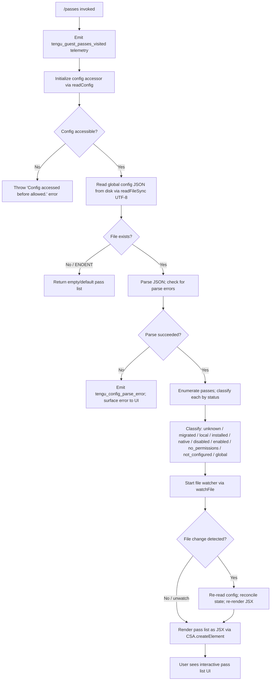

# `/passes`

> Analysis basis: CC v2.1.133 bundle.js (AST extraction + Claude interpretation)
> Minimum version: v2.1.133

---

## Overview

The `/passes` command is a local JSX-rendered slash command that displays and manages "guest passes" — a feature governing access permissions for guest or third-party users of a Claude Code session. When invoked, it emits a telemetry visit event, reads and renders the current pass configuration from the global config file, and presents an interactive UI allowing the user to inspect or modify pass state. Its implementation is tightly coupled to the shared config read/write subsystem, including file-locking, backup rotation, and auth-loss protection.

---

## Registration

| Field | Value |
|---|---|
| type | `local-jsx` |
| name | `passes` |
| description | `null` |
| module_id | `bfq` |
| loc_line | 6869 |

Analysis basis: CC v2.1.133 bundle.js:+11131881

---

## Input Branching

The command's top-level render function (`CommandRoot`) coordinates three major sub-systems: the config read/watch subsystem, the pass-list enumeration subsystem, and the JSX rendering layer. The branching logic at invocation time is shown below.



Analysis basis: CC v2.1.133 bundle.js:+11131564 (command root dispatch), +3108275 (config session initializer), +3109608 (file watcher setup), +3113211 (guard throw), +3113854 (parse error telemetry)

---

## Behavioral Spec

### Command Root — Entry Point

```
function commandRoot(context):
    emit telemetry event "tengu_guest_passes_visited"
    initialize configSession = newConfigSession()
    initialize passWatcher  = newFileWatcher(configSession)
    render JSX tree using CSA.createElement with:
        - configSession
        - passWatcher
        - application state (d)
    return rendered JSX element
```

Analysis basis: CC v2.1.133 bundle.js:+11131564, +11131598, +11131604, +11131702, +11131704, +11131753

---

### Config Reader — Reading the Global Config File

```
function readGlobalConfig(guardFlag):
    if guardFlag is not set:
        throw Error("Config accessed before allowed.")   // guard check

    raw = fs.readFileSync(configFilePath, "utf-8")       // encoding: utf-8

    if readFileSync throws with code == "ENOENT":
        return defaultConfig()                           // file absent → defaults

    parsed = JSON.parse(raw)

    if parse raises an exception:
        emit telemetry "tengu_config_parse_error"
        log error with level "error"
        return defaultConfig()

    return parsed
```

Analysis basis: CC v2.1.133 bundle.js:+3113211 (guard error), +3113273 (readFileSync), +3113300 (utf-8 encoding), +3113447 (ENOENT handling), +3113768 (error log level), +3113854 (parse error telemetry)

---

### Pass Status Classification

Each pass entry returned from the config is classified into one of ten status strings. Classification proceeds by inspecting fields on the raw pass object.

```
function classifyPassStatus(passEntry):
    if passEntry is missing or unrecognized:
        return "unknown"
    if passEntry.origin == "migrated":
        return "migrated"
    if passEntry.scope == "local":
        return "local"
    if passEntry.installState == "installed":
        return "installed"
    if passEntry.kind == "native":
        return "native"
    if passEntry.enabled == false or numeric 0:
        return "disabled"
    if passEntry.enabled == true or numeric 1:
        return "enabled"
    if passEntry.permissions == null or missing:
        return "no_permissions"
    if passEntry.scope == "global":
        return "global"
    return "not_configured"
```

Status values (string literals):
- `"unknown"` — Analysis basis: CC v2.1.133 bundle.js:+3108935
- `"migrated"` — Analysis basis: CC v2.1.133 bundle.js:+3108997
- `"local"` — Analysis basis: CC v2.1.133 bundle.js:+3109010
- `"installed"` — Analysis basis: CC v2.1.133 bundle.js:+3109028
- `"native"` — Analysis basis: CC v2.1.133 bundle.js:+3109042
- `"disabled"` — Analysis basis: CC v2.1.133 bundle.js:+3109061
- `"enabled"` — Analysis basis: CC v2.1.133 bundle.js:+3109087
- `"no_permissions"` — Analysis basis: CC v2.1.133 bundle.js:+3109101
- `"not_configured"` — Analysis basis: CC v2.1.133 bundle.js:+3109122
- `"global"` — Analysis basis: CC v2.1.133 bundle.js:+3109141

Numeric sentinels used: `0` (disabled) and `1` (enabled) — Analysis basis: CC v2.1.133 bundle.js:+3108914, +3109075

---

### Config Session Initializer

```
function newConfigSession():
    configPath = resolveGlobalConfigPath()
    dirPath    = path.dirname(configPath)
    ensure directory exists: fs.mkdirSync(dirPath, { recursive: true })
    timestamp  = Date.now()
    lock       = acquireLock(configPath, maxRetries=100)
    if lock not acquired within retries:
        emit telemetry "tengu_config_lock_contention"
        log warning "Lock acquisition took longer than expected - another Claude instance may be running"
    read config via readGlobalConfig()
    return session object { configPath, timestamp, lock, data }
```

Maximum lock retry iterations: 100 — Analysis basis: CC v2.1.133 bundle.js:+3111178
Lock contention warning message: "Lock acquisition took longer than expected - another Claude instance may be running" — Analysis basis: CC v2.1.133 bundle.js:+3111184

---

### Config Writer with Lock and Backup Rotation

```
function saveGlobalConfigWithLock(session, newData):
    // Re-read from disk before writing to detect stale state
    freshData = readGlobalConfig()

    if freshData differs from cached data by timestamp or version:
        emit telemetry "tengu_config_stale_write"

    // Auth-loss guard (GH #3117 protection)
    if cachedData.auth exists AND freshData.auth is missing:
        emit telemetry "tengu_config_auth_loss_prevented"
        log warning "saveConfigWithLock: re-read config is missing auth that cache has; refusing to write to avoid wiping ~/.claude.json. See GH #3117."
        return without writing

    // Backup rotation
    backupDir  = path.join(path.dirname(configPath), "backups")
    fs.mkdirSync(backupDir, ignoreEEXIST=true)
    existingBackups = fs.readdirStringSync(backupDir)
                        .filter(name => name.startsWith(".backup."))
                        .map(name => { ts: Number(name.split(".")[...]), name })
                        .filter(entry => not Number.isNaN(entry.ts))
                        .sort by timestamp ascending

    // Prune oldest backups if count exceeds limit
    maxBackups = 5
    while existingBackups.length >= maxBackups:
        oldest = existingBackups.shift()
        fs.unlinkSync(path.join(backupDir, oldest.name))

    // Copy current file as backup before overwriting
    backupName = ".backup." + Date.now()
    fs.copyFileSync(configPath, path.join(backupDir, backupName))

    // Write new data
    write newData serialized as JSON to configPath
    release lock

    // Prune again after write if needed (keep at most 2 extra)
    // (secondary pruning pass using slice and unlink)
```

Maximum backup files retained: 5 — Analysis basis: CC v2.1.133 bundle.js:+3112203
Backup file name prefix: `".backup."` — Analysis basis: CC v2.1.133 bundle.js:+3112070
Secondary pruning constant: 2 — Analysis basis: CC v2.1.133 bundle.js:+3112459
Auth-loss warning (GH #3117): "saveConfigWithLock: re-read config is missing auth that cache has; refusing to write to avoid wiping ~/.claude.json. See GH #3117." — Analysis basis: CC v2.1.133 bundle.js:+3111600
Global config fallback warning (GH #3117): "saveGlobalConfig fallback: re-read config is missing auth that cache has; refusing to write. See GH #3117." — Analysis basis: CC v2.1.133 bundle.js:+3108482

---

### File Watcher — Live Config Updates

```
function newFileWatcher(configSession):
    configPath = configSession.configPath
    currentStat = fs.statSync(configPath)

    startWatching():
        Yd6.watchFile(configPath, callback = onChange)

    onChange(newStat):
        if newStat.mtime != currentStat.mtime:
            freshData = readGlobalConfig()
            reconcileState(freshData)
            rerenderPassList()
            currentStat = newStat

    stopWatching():
        Yd6.unwatchFile(configPath)

    // Watcher is torn down when the command UI is unmounted
    return { startWatching, stopWatching }
```

Watcher uses `Yd6.watchFile` / `Yd6.unwatchFile` (Node.js `fs` module wrappers). Analysis basis: CC v2.1.133 bundle.js:+3109613, +3109940

Stale write maximum age: 60000 ms — Analysis basis: CC v2.1.133 bundle.js:+3111954

---

### Pass Entry Enumeration

```
function enumeratePasses(configData):
    passes = []
    for each [key, value] in Object.entries(configData.passes or {}):
        status = classifyPassStatus(value)
        passes.push({ key, value, status })
    return passes
```

Analysis basis: CC v2.1.133 bundle.js:+3109457 (Object.entries)

---

### Random Jitter for Retry / Debounce

```
function jitteredDelay(baseMs):
    jitter = Math.random() * someMultiplier
    setTimeout(callback, baseMs + jitter)
```

Used to avoid thundering-herd when multiple Claude instances contend for the config lock or file watcher.

Analysis basis: CC v2.1.133 bundle.js:+12285769 (Math.random), +12285806 (setTimeout)

---

### Log-Level Routing

```
function routeLog(level, message, metadata):
    if level == "debug":
        send to debug sink
    elif level in ["error", "warn", "info"]:
        send to appropriate sink
    // level string "debug" used in pass-related config paths
```

Log level constant `"debug"` used in this call path — Analysis basis: CC v2.1.133 bundle.js:+162555

---

## State & Side Effects

| Item | Detail |
|---|---|
| Telemetry — visit | `tengu_guest_passes_visited` fired once on every `/passes` invocation (Analysis basis: CC v2.1.133 bundle.js:+11131704) |
| Telemetry — config parse error | `tengu_config_parse_error` fired when global config JSON cannot be parsed (Analysis basis: CC v2.1.133 bundle.js:+3113854) |
| Telemetry — lock contention | `tengu_config_lock_contention` fired when config lock is not acquired within 100 retries (Analysis basis: CC v2.1.133 bundle.js:+3111273) |
| Telemetry — stale write | `tengu_config_stale_write` fired when an in-flight write detects the on-disk config has changed since the cache was populated (Analysis basis: CC v2.1.133 bundle.js:+3111409) |
| Telemetry — auth loss prevented | `tengu_config_auth_loss_prevented` fired when a write is blocked because the freshly-read config is missing auth credentials that the cache still holds (Analysis basis: CC v2.1.133 bundle.js:+3111752) |
| File watcher registration | `Yd6.watchFile` registered on the global config path while `/passes` UI is mounted; torn down via `Yd6.unwatchFile` on unmount (Analysis basis: CC v2.1.133 bundle.js:+3109613, +3109940) |
| Disk reads | `fs.readFileSync` (utf-8) on global config path on mount and on each file-change event (Analysis basis: CC v2.1.133 bundle.js:+3113273) |
| Disk writes | `fs.copyFileSync` (backup), `fs.mkdirSync` (backup dir), `fs.unlinkSync` (old backups), JSON write to config path on save (Analysis basis: CC v2.1.133 bundle.js:+3114362, +3114033, +3112321, +3112177) |
| appState changes | Reads and potentially mutates application-level state `d` for rendering (Analysis basis: CC v2.1.133 bundle.js:+11131702) |
| Sound | <!-- TODO: not found in depth-2 traversal; needs --depth 4 --> |
| JSX rendering | Uses `CSA.createElement` to produce the interactive pass list UI (Analysis basis: CC v2.1.133 bundle.js:+11131753) |

---

## Version History

| Version | Change |
|---|---|
| v2.1.133 | Initial analysis — command registered as `local-jsx`, module `bfq`, with guest-pass visit telemetry and full config lock/backup subsystem |

---

## Common Mistakes

1. **Invoking `/passes` before config initialization completes** — The config accessor throws `"Config accessed before allowed."` if the internal guard flag has not been set by the time the read is attempted. This can surface as an unhandled error in the UI if the command is invoked at startup before the config subsystem is ready. (Analysis basis: CC v2.1.133 bundle.js:+3113217)

2. **Concurrent Claude instances corrupting the config** — The lock contention path emits `tengu_config_lock_contention` and logs a warning but does not abort. If two instances race to write, the stale-write detection (`tengu_config_stale_write`) may still allow the write to proceed. Users running multiple Claude Code sessions sharing the same `~/.claude.json` should be aware of this risk.

3. **Assuming `/passes` has a description** — The `description` field in the registration is `null`. Any UI that renders command descriptions will display nothing or a fallback for `/passes`. (Analysis basis: CC v2.1.133 bundle.js:+11131881)

4. **Expecting backup files to accumulate indefinitely** — The backup rotation hard-caps retained backup files at **5**. Older backups are silently deleted. Do not rely on the backup directory for long-term config history. (Analysis basis: CC v2.1.133 bundle.js:+3112203)

5. **Misreading the auth-loss guard as a bug** — The deliberate refusal to overwrite `~/.claude.json` when the freshly-read file is missing auth credentials is an intentional safety measure (GH #3117), not a crash. The `tengu_config_auth_loss_prevented` telemetry event confirms a blocked write. (Analysis basis: CC v2.1.133 bundle.js:+3111752, +3111600)

---

## Appendix — Identifier Mapping

> For bundle debugging only. Identifiers change across versions.

| Identifier | Role |
|---|---|
| `Xz7` | Command root render function for `/passes` |
| `R6` | Config read entry point (reads global config from disk) |
| `F6` | Path resolution utility (resolves config file path) |
| `He8` | Config guard / access-allowed flag checker |
| `m5H` | Low-level config file reader with ENOENT and parse-error handling |
| `u2K` | File watcher setup and teardown (watchFile / unwatchFile wrapper) |
| `PO8` | Pass-list orchestrator (coordinates config read + pass enumeration) |
| `F7` | Intermediate dispatcher connecting pass-list orchestrator to config reader |
| `e6` | Config session initializer (sets up lock, directory, timestamp) |
| `fe8` | Config writer with lock acquisition, stale-write check, backup rotation, and auth-loss guard |
| `H` | Jittered retry / debounce helper (Math.random + setTimeout) |
| `fxH` | Pass entry formatter or filter helper |
| `jX1` | Pass enumeration function (Object.entries iteration over passes map) |
| `MxH` | Stale-write timestamp comparator (Date.now based) |
| `k` | Log-level router (debug / error / warn / info sink dispatcher) |
| `lq6` | Config lock acquisition utility |
| `d` | Application state accessor / store reference |
| `Ke8` | Directory-and-path setup helper (dirname + mkdirSync + path join) |