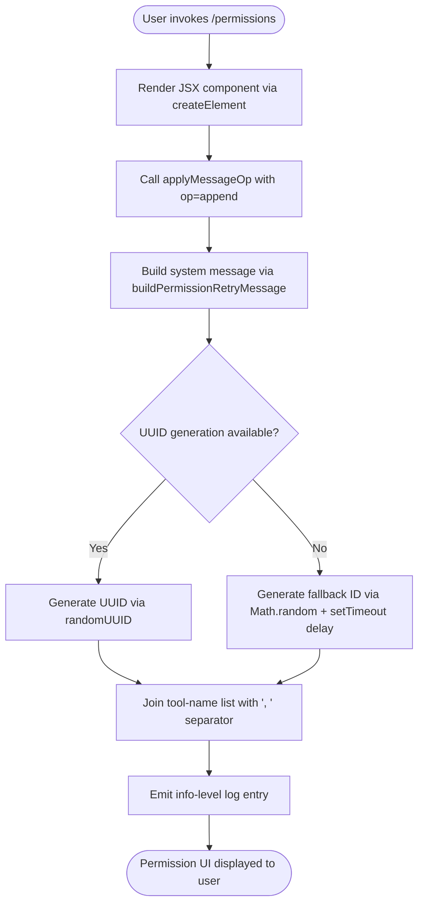

# `/permissions`

> Analysis basis: CC v2.1.133 bundle.js (AST extraction + Claude interpretation)
> Minimum version: v2.1.133

---

## Overview

The `/permissions` command (also accessible via `/allowed-tools`) provides an interactive interface for managing allow and deny rules governing which tools Claude Code may invoke during a session. It renders a JSX component that appends a system-level permission-retry message into the conversation state, enabling the user to inspect and modify tool permission rules without restarting the session.

## Registration

| Field | Value |
|---|---|
| type | `local-jsx` |
| name | `permissions` |
| description | `Manage allow & deny tool permission rules` |
| aliases | `["allowed-tools"]` |
| module\_id | `wfq` |

Analysis basis: CC v2.1.133 bundle.js:+11119116

## Input Branching

The command accepts no user-supplied arguments. Its execution path is determined entirely by internal state at the moment of invocation. The flowchart below captures the branching derived from the call graph.



Analysis basis: CC v2.1.133 bundle.js:+11118934, +11118987, +11119029, +9748907, +12285769, +12285806

## Behavioral Spec

### JSX Render Entry Point

```
function renderPermissionsCommand(context):
    element = createElement(PermissionsUI, context.props)
    applyMessageOp(context.conversation, op="append", message=buildPermissionRetryMessage())
    return element
```

Analysis basis: CC v2.1.133 bundle.js:+11118934, +11118987, +11119010

### Permission Retry Message Construction

```
function buildPermissionRetryMessage():
    messageId = generateMessageId()
    toolList  = joinToolNames(context.allowedTools, separator=", ")
    message = {
        role:    "system",
        subtype: "permission_retry",
        id:      messageId,
        level:   "info",
        content: toolList
    }
    return message
```

Analysis basis: CC v2.1.133 bundle.js:+9748763, +9748780, +9748825, +9748850

### Message ID Generation

The ID generation strategy uses `crypto.randomUUID()` when the Web Crypto API is available. When it is not, a fallback path combines `Math.random()` with a `setTimeout`-based deferred execution. The fallback uses a numeric precision constant of `2` and a delay multiplier constant of `1`.

```
function generateMessageId():
    if cryptoAPI.randomUUID is available:
        return cryptoAPI.randomUUID()
    else:
        base    = Math.random().toString(36).slice(2)
        suffix  = Math.random().toString(36).slice(2, 2 + 2)   // constant 2
        schedule deferred cleanup with setTimeout(callback, 1)  // constant 1
        return base + suffix
```

Analysis basis: CC v2.1.133 bundle.js:+9748907, +12285767, +12285769, +12285783, +12285806

### Tool Name List Formatting

```
function joinToolNames(toolNames):
    return toolNames.join(", ")
```

The separator is the two-character string `", "` (comma followed by space).

Analysis basis: CC v2.1.133 bundle.js:+9748818, +9748825

## State & Side Effects

| Item | Detail |
|---|---|
| Telemetry | None detected — `telemetry` array is empty in this version |
| Message op | Appends a `system` / `permission_retry` message to the active conversation via `applyMessageOp` with op `"append"` |
| Log emission | Emits an `"info"`-level log entry during message construction |
| ID side effect | When crypto API is unavailable, schedules a `setTimeout` callback (delay constant `1`) as part of fallback ID generation |
| appState changes | <!-- TODO: not found in depth-2 traversal; needs --depth 4 --> |
| Hook registration | <!-- TODO: not found in depth-2 traversal; needs --depth 4 --> |
| Sound | <!-- TODO: not found in depth-2 traversal; needs --depth 4 --> |

## Version History

| Version | Change |
|---|---|
| v2.1.133 | Initial analysis |

## Common Mistakes

1. **Using `/allowed-tools` expecting different behavior** — `/allowed-tools` is a registered alias and is functionally identical to `/permissions`; both resolve to the same `wfq` module handler.
2. **Expecting telemetry events** — No `tengu_*` telemetry events are fired by this command in v2.1.133; do not rely on telemetry for observing permission changes in analytics pipelines.
3. **Assuming argument parsing** — The command registers no argument schema; any text typed after `/permissions` is ignored. Permission rules must be modified through the rendered UI component, not via command arguments.
4. **Assuming synchronous ID generation** — When the Web Crypto API is unavailable (certain Node.js environments), the message ID fallback schedules a `setTimeout` callback, meaning parts of the ID lifecycle are asynchronous.
5. **Expecting a new conversation turn** — The command appends a `system`-role message with subtype `permission_retry` rather than a user or assistant turn, so it does not trigger a model completion round-trip.

## Appendix — Identifier Mapping

> For bundle debugging only. Identifiers change across versions.

| Identifier | Role |
|---|---|
| `_z7` | Permissions command render entry point (JSX component function) |
| `A` | Conversation state manager exposing `applyMessageOp` |
| `Yr9` | Permission retry message builder (constructs system message with UUID and tool list) |
| `H` | Message ID fallback generator (uses `Math.random` and `setTimeout`) |