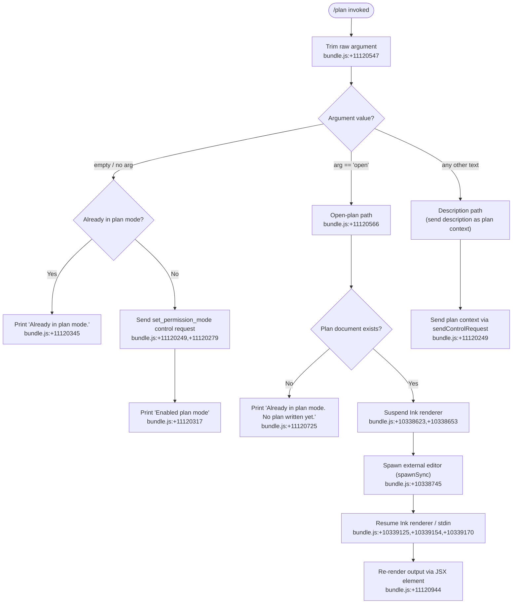

# `/plan`

> Analysis basis: CC v2.1.133 bundle.js (AST extraction + Claude interpretation)
> Minimum version: v2.1.133

---

## Overview

The `/plan` command activates "plan mode" for the current Claude Code session, or opens the existing session plan in an external editor when the `open` sub-command is given. When invoked without arguments, it sends a `set_permission_mode` control request to the active session; when invoked with the literal argument `open`, it suspends the terminal UI and launches an external editor so the user can view or edit the current plan document directly.

---

## Registration

| Field | Value |
|---|---|
| type | `local-jsx` |
| name | `plan` |
| description | Enable plan mode or view the current session plan |
| argumentHint | `[open\|<description>]` |
| module_id | `Wfq` |

Analysis basis: CC v2.1.133 bundle.js:+11121166

---

## Input Branching

The command handler (`Kz7`) evaluates the trimmed argument string and routes to one of several distinct code paths.



---

## Behavioral Spec

### 1. Argument Normalization

```
function normalizeArgument(rawInput):
    trimmed = rawInput.trim()          // bundle.js:+11120547
    return trimmed
```

Analysis basis: CC v2.1.133 bundle.js:+11120547

---

### 2. Plan-Mode Activation (no argument)

When no argument is provided the handler checks whether the session is already in plan mode. If it is not, it calls `sendControlRequest` with the action type `"set_permission_mode"` and the target scope `"session"`.

```
function activatePlanMode(sessionState):
    if sessionState.isPlanMode:
        renderMessage("Already in plan mode.")    // bundle.js:+11120345
        return

    sendControlRequest({
        action : "set_permission_mode",           // bundle.js:+11120279
        scope  : "session"                        // bundle.js:+11120234
    })
    renderMessage("Enabled plan mode")            // bundle.js:+11120317
```

Analysis basis: CC v2.1.133 bundle.js:+11120249, +11120279, +11120234, +11120317, +11120345

---

### 3. Permission-Mode Control Request Dispatch

The control-request pathway (`sendControlRequest` → `permissionModeDispatcher`) internally enumerates active MCP server entries, applies permission-mode rules, and may emit a telemetry event `tengu_mcp_retry_failed_remote` when a remote MCP server fails during retry.

```
function permissionModeDispatcher(servers, mode):
    for each (key, server) in Object.entries(servers):     // bundle.js:+13871290
        if server.status == "disabled":                    // bundle.js:+9474877
            continue
        clients = server.getClients()                      // bundle.js:+13871337
        applyPermissionMode(clients, mode)

    if allRemoteServersRecovered():
        log("[MCP] Retry: all remote servers recovered, stopping")
        // bundle.js:+13871486
        stopRetry()
```

Analysis basis: CC v2.1.133 bundle.js:+13870586, +13871290, +13871337, +13871486

---

### 4. Permission-Rule Application (`setMode` / `addRules` / `replaceRules` / `removeRules`)

The permission sub-system (`permissionRuleApplicator`) handles the following named operations discovered in literals. The `bypassPermissions` mode is explicitly guarded: if the session was not launched with bypass permissions enabled, the update is silently ignored with a debug log.

```
function permissionRuleApplicator(operation, payload):
    if operation == "setMode":                                   // bundle.js:+3891788
        if payload.mode == "bypassPermissions":                  // bundle.js:+3891810
            if not session.bypassPermissionsAvailable:
                debugLog(
                  "Ignoring permission update: setMode 'bypassPermissions' " +
                  "rejected — mode is not available ..."
                )                                                // bundle.js:+3891876
                return

    if operation == "addRules":                                  // bundle.js:+3892152
        applyRuleSet("allow",        payload.alwaysAllowRules)   // bundle.js:+3892337,+3892345
        applyRuleSet("deny",         payload.alwaysDenyRules)    // bundle.js:+3892377,+3892384
        applyRuleSet("alwaysAsk",    payload.alwaysAskRules)     // bundle.js:+3892402
        addDirectories(payload.addDirectories)                   // bundle.js:+3892811

    if operation == "replaceRules":                              // bundle.js:+3892500
        replaceExistingRuleSet(payload)

    if operation == "removeRules":                               // bundle.js:+3893157
        removeMatchingRules(payload)
        removeDirectories(payload.removeDirectories)             // bundle.js:+3893541
```

Analysis basis: CC v2.1.133 bundle.js:+3891788, +3891810, +3891876, +3892152, +3892337, +3892345, +3892377, +3892384, +3892402, +3892500, +3892811, +3893157, +3893541

---

### 5. Open Sub-Command — External Editor Launch

When the argument is exactly `"open"`, the handler enters the editor-launch path. It first checks that the plan file exists (using `statSync`), then suspends the Ink terminal renderer, spawns an external editor process, and finally resumes the renderer.

```
function openPlanInEditor(planFilePath, editorCommand):
    try:
        fs.statSync(planFilePath)                        // bundle.js:+10338563
    catch ENOENT:                                        // bundle.js:+134316
        renderMessage("Already in plan mode. No plan written yet.")
        // bundle.js:+11120725
        return

    inkInstance = getInkInstance()
    if not inkInstance:
        throw Error("Ink instance not found - cannot pause rendering")
        // bundle.js:+10338470

    inkInstance.enterAlternateScreen()                   // bundle.js:+10338623
    inkInstance.pause()                                  // bundle.js:+10338653
    inkInstance.suspendStdin()                           // bundle.js:+10338663

    editorArgs = editorCommand.split(...)                // bundle.js:+10338702
    args       = editorArgs.slice(...)                   // bundle.js:+10338727

    result = child_process.spawnSync(
        editorArgs[0],
        args + [planFilePath],
        { stdio: "inherit" }                             // bundle.js:+10338777
    )                                                    // bundle.js:+10338745

    planContent = fs.readFileSync(planFilePath, "utf-8") // bundle.js:+10339047, +5019821

    inkInstance.exitAlternateScreen()                    // bundle.js:+10339125
    inkInstance.resumeStdin()                            // bundle.js:+10339154
    inkInstance.resume()                                 // bundle.js:+10339170
```

Analysis basis: CC v2.1.133 bundle.js:+10338563, +10338623, +10338653, +10338663, +10338702, +10338745, +10338777, +10339047, +10339125, +10339154, +10339170, +11120566, +11120725

---

### 6. Editor Resolution

The editor to launch is resolved by `editorResolver` (`jJ`), which checks `$VISUAL` / `$EDITOR` environment variables, falls back to platform detection, and additionally detects whether the session is running inside an IDE integration (detected via the literal string `"IDE"`).

```
function resolveEditor():
    name = detectEditorName()                    // bundle.js:+5039859 (toLowerCase)
    if isIDESession():                           // bundle.js:+5039804
        return ideEditor()
    base = path.basename(name)                   // bundle.js:+5039917
    return resolveEditorPath(base)               // bundle.js:+5039991
```

Analysis basis: CC v2.1.133 bundle.js:+11120919, +5039804, +5039859, +5039917, +5039991

---

### 7. Output Rendering

After each code path completes, a JSX element is created via `UG.createElement` and rendered to the terminal. ANSI escape sequences are stripped from any captured output using `Bun.stripANSI` before display.

```
function renderPlanOutput(content):
    clean = Bun.stripANSI(content)          // bundle.js:+3582221
    element = UG.createElement(PlanView, { content: clean })
    // bundle.js:+11120944
    renderToTerminal(element)
```

Analysis basis: CC v2.1.133 bundle.js:+11120944, +3582221

---

### 8. MCP Connection State During Plan Activation

When `sendControlRequest` is called during plan-mode activation, the MCP subsystem evaluates each configured server's transport type against the set `{ "stdio", "sse", "http", "sse-ide", "ws-ide", "claudeai-proxy" }`. Servers in `"needs-auth"` state are skipped with a log message.

```
function evaluateMcpServerForControlRequest(server):
    transport = server.transport
    validTransports = ["stdio", "sse", "http", "sse-ide", "ws-ide", "claudeai-proxy"]
    // bundle.js:+9474979, +9475013, +9475045, +9475078, +9475114, +9475386

    if server.authState == "needs-auth":
        log("Skipping connection (cached needs-auth)")   // bundle.js:+9475506
        return skip

    if server.status == "connected":                     // bundle.js:+9475674
        processServer(server)
    else if server.status == "failed":                   // bundle.js:+9476241
        scheduleRetry(server)
```

Analysis basis: CC v2.1.133 bundle.js:+9474979, +9475013, +9475045, +9475078, +9475114, +9475386, +9475506, +9475572, +9475674, +9476241

---

### 9. Session Context Log Format

The logging subsystem (`sessionLogger`) uses a two-space padding constant and a numeric pad-width of `40` when formatting session log lines.

- Padding string: `"  "` (two spaces) — Analysis basis: CC v2.1.133 bundle.js:+14179363
- Pad width: `40` characters — Analysis basis: CC v2.1.133 bundle.js:+14181334

---

## State & Side Effects

| Item | Detail |
|---|---|
| Telemetry | `tengu_mcp_retry_failed_remote` — emitted when all remote MCP servers recover during retry (bundle.js:+13870729) |
| Plan mode flag | Session-scoped; set via `set_permission_mode` control request (bundle.js:+11120279) |
| Terminal renderer | Ink renderer is paused (`pause`, `enterAlternateScreen`, `suspendStdin`) and resumed (`exitAlternateScreen`, `resumeStdin`, `resume`) during editor launch (bundle.js:+10338623–+10339170) |
| External process | `child_process.spawnSync` with `stdio: "inherit"` — blocks the process until the editor exits (bundle.js:+10338745, +10338777) |
| File I/O | `fs.statSync` to check plan file existence; `fs.readFileSync` with encoding `"utf-8"` to read plan content after editor closes (bundle.js:+10338563, +10339047) |
| File deletion | `unlinkSync` is reachable in the call graph (bundle.js:+14137065); exact trigger condition not determinable at depth-2 traversal <!-- TODO: not found in depth-2 traversal; needs --depth 4 --> |
| Permission rules | `alwaysAllowRules`, `alwaysDenyRules`, `alwaysAskRules` collections may be mutated during plan-mode activation (bundle.js:+3892337–3892402) |
| ANSI stripping | `Bun.stripANSI` applied to all rendered output (bundle.js:+3582221) |
| Sound | <!-- TODO: not found in depth-2 traversal; needs --depth 4 --> |
| Hook registration | <!-- TODO: not found in depth-2 traversal; needs --depth 4 --> |

---

## Version History

| Version | Change |
|---|---|
| v2.1.133 | Initial analysis |

---

## Common Mistakes

1. **Passing `open` when no plan exists yet** — If the session is already in plan mode but no plan document has been written, `/plan open` prints `"Already in plan mode. No plan written yet."` and exits without launching an editor (bundle.js:+11120725). You must first interact with the session so that a plan document is generated before using `open`.

2. **Expecting `bypassPermissions` mode to activate via `/plan`** — The `bypassPermissions` mode is silently rejected unless the session was originally launched with bypass permissions enabled. No error is shown to the user; the update is discarded with only a `debug`-level internal log (bundle.js:+3891876).

3. **Assuming `/plan` works in IDE-embedded sessions the same way** — The editor-resolution path detects `"IDE"` sessions (bundle.js:+5039804) and may select a different editor binary or skip external editor launch entirely; the behavior may differ from a standard terminal session.

4. **Running `/plan open` while MCP servers are in `needs-auth` state** — Servers flagged `needs-auth` are skipped during the control-request dispatch cycle (bundle.js:+9475506). If all servers are in this state, the control request may not be delivered.

5. **Expecting synchronous UI during editor session** — The Ink renderer is fully paused for the duration of the external editor process. No Claude Code UI updates, streaming responses, or notifications are rendered until the editor exits.

---

## Appendix — Identifier Mapping

> For bundle debugging only. Identifiers change across versions.

| Identifier | Role |
|---|---|
| `Kz7` | Plan command handler (main entry point) |
| `q` | File-unlink utility (wraps `unlinkSync`) |
| `oM` | Internal sub-command router |
| `RwH` | Route handler helper |
| `Pi` | Argument parser / pre-processor |
| `L` | Session log formatter (uses `padEnd`) |
| `K` | Async task tracker (add / delete / finally set) |
| `f` | Stream / channel abstraction (close operations) |
| `Wf` | Permission-rule applicator (`setMode`, `addRules`, `replaceRules`, `removeRules`) |
| `k` | Permission-mode validator / classifier |
| `n4` | Rule normalization helper |
| `SH` | JSON serializer wrapper |
| `_` | Settings / state store (get/set/delete, toLowerCase) |
| `$ZH` | MCP server enumeration and dispatch coordinator |
| `fVA` | MCP connection factory |
| `pN` | MCP connection pool manager |
| `o9H` | MCP server-entry iterator |
| `_g` | MCP server-state aggregator |
| `M` | Control-request sender (`sendControlRequest`) |
| `iZH` | Per-server control-request dispatcher |
| `mFq` | MCP update applicator (`applyMcpUpdate`, `cleanup`) |
| `$` | MCP client selector (wraps `XDq`) |
| `J6` | MCP retry scheduler |
| `Og7` | MCP retry-recovery coordinator |
| `H` | Jitter/delay helper (uses `Math.random`, `setTimeout`) |
| `SUH` | Plan-mode sub-command switcher |
| `sLH` | Plan sub-command label resolver |
| `v6` | Plan state accessor |
| `UW` | `open` sub-command handler |
| `YG` | Plan file path resolver |
| `F6` | File-system utility facade |
| `D8` | ENOENT error handler |
| `fH` | Log-error emitter |
| `km` | External editor launcher (spawnSync orchestrator) |
| `A` | Node.js `fs` / `child_process` facade |
| `Mq7` | Ink instance locator |
| `jJ` | Editor binary resolver |
| `YJ9` | Post-editor output renderer |
| `kgH` | Ink stream listener / JSX bridge |
| `v5` | ANSI-strip output post-processor |