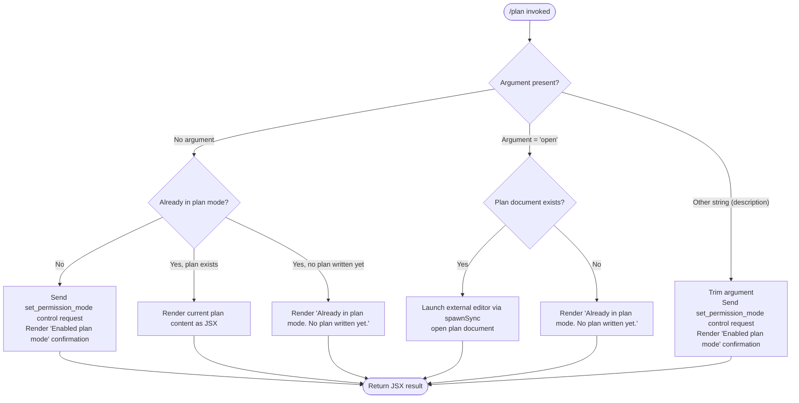

# `/plan`

> Analysis basis: CC v2.1.133 bundle.js (AST extraction + Claude interpretation)
> Minimum version: v2.1.133

---

## Overview

The `/plan` command enables **plan mode** for the current Claude Code session or displays the current session plan if one already exists. When invoked without arguments or with a description, it sends a `set_permission_mode` control request to the agent runtime and renders a JSX confirmation in the terminal. When invoked with the special argument `open`, it opens the existing plan document in an external editor via a subprocess.

---

## Registration

| Field | Value |
|---|---|
| type | `local-jsx` |
| name | `plan` |
| description | `Enable plan mode or view the current session plan` |
| argumentHint | `[open\|<description>]` |
| module_id | `Wfq` |
| load_inline | `true` |
| loc_byte | `11121166` |
| loc_byte_end | `11121365` |
| loc_line | `6869` |
| arbor_handler.name | `Kz7` |
| arbor_handler.fqn | `claude-2.1.133::Kz7` |
| arbor_handler.kind | `AsyncFunction` |
| arbor_handler.resolution_path | `module_id` |
| arbor_handler.n_hits | `0` |

Analysis basis: CC v2.1.133 bundle.js:+11121166

---

## Input Branching

The handler has four distinct branches driven by the argument string and session state, so a flowchart is used.



Analysis basis: CC v2.1.133 bundle.js:+11120041 (handler entry `Kz7`), +11120566 (`"open"` literal), +11120317 (`"Enabled plan mode"` literal), +11120345 (`"Already in plan mode."` literal), +11120725 (`"Already in plan mode. No plan written yet."` literal)

---

## Behavioral Spec

### Handler Entry — `planCommandHandler` (`Kz7`)

The handler is an `AsyncFunction` resolved via `module_id` → `Wfq`.

```
async function planCommandHandler(args, context):
    rawArg = getArgumentString(args)          // Kz7 → q at +11120041
    sessionMode = getSessionMode(context)     // Kz7 → oM at +11120074
    permissionState = getPermissionState()    // Kz7 → Pi at +11120113
    planContent = getPlanContent()            // Kz7 → L  at +11120126

    trimmedArg = rawArg.trim()               // +11120547

    if trimmedArg == "open":                 // +11120566
        return handleOpenPlan(context)       // Kz7 → km at +11120826

    if trimmedArg != "":
        return enablePlanMode(trimmedArg, context)

    if alreadyInPlanMode(sessionMode):
        if planContent exists:
            return renderCurrentPlan(planContent)  // Kz7 → YG at +11120683
        else:
            return renderMessage("Already in plan mode. No plan written yet.")
                                                   // +11120725
    else:
        return enablePlanMode("", context)
```

Analysis basis: CC v2.1.133 bundle.js:+11120041

---

### Enable Plan Mode — `enablePlanMode` (via `sendControlRequest`)

When plan mode is not yet active, the handler dispatches a `set_permission_mode` control request through the session manager.

```
function enablePlanMode(description, context):
    payload = {
        type: "set_permission_mode",          // literal at +11120279
        description: description
    }
    result = context.M.sendControlRequest(payload)  // +11120249
    if result == success:
        render JSX message "Enabled plan mode"      // +11120317
    else:
        propagate error
```

The `sendControlRequest` call (identifier `M`) dispatches through `iZH`, which coordinates MCP server state, session storage, and permission-rule management.

Analysis basis: CC v2.1.133 bundle.js:+11120249, +11120279, +11120317

---

### Already-In-Plan-Mode Path — `renderCurrentPlan` / `renderAlreadyMessage`

When the session is already in plan mode:

```
function renderPlanModeStatus(planContent):
    if planContent is non-empty:
        planText = formatPlanContent(planContent)  // Kz7 → YG at +11120683
        return JSX view of plan text
    else:
        return JSX text "Already in plan mode. No plan written yet."
                                                   // +11120725

function formatPlanContent(content):
    // YG delegates to m3H which reads plan state via q.get
    // and joins path segments via Yu.join
    return formattedPlanString
```

Analysis basis: CC v2.1.133 bundle.js:+11120683, +11120725

---

### Open Plan in External Editor — `openPlanInEditor` (`km`)

When the argument is exactly `"open"`:

```
async function openPlanInEditor(context):
    planPath = resolvePlanPath(context)          // km → Mq7 at +10338611
    if planPath not found:
        raise Error                              // +10338464

    // Suspend terminal rendering before handing off to editor
    context.terminal.enterAlternateScreen()      // +10338623
    context.terminal.pause()                     // +10338653
    context.terminal.suspendStdin()              // +10338663

    editorArgs = resolveEditorCommand()          // km → jJ at +10338845
    editorArgs = editorArgs.split(delimiter)     // +10338702
    editorArgs = editorArgs.concat([planPath])   // via f.slice at +10338727

    result = BHq.spawnSync(editor, args, {
        stdio: "inherit"                         // literal at +10338777
    })                                           // +10338745

    // Read any changes the editor may have written
    updatedContent = A.readFileSync(planPath)    // +10339047

    // Restore terminal
    context.terminal.exitAlternateScreen()       // +10339125
    context.terminal.resumeStdin()               // +10339154
    context.terminal.resume()                    // +10339170

    return JSX confirmation or updated plan view
```

The editor resolution helper (`jJ`) lower-cases the editor name, resolves the basename, and handles IDE-specific paths (literal `"IDE"` at +5039804).

Analysis basis: CC v2.1.133 bundle.js:+11120826, +10338623, +10338745, +10339125

---

### Permission-Mode Control Infrastructure — `sendControlRequest` (`M` → `iZH`)

`sendControlRequest` (identifier `M`) routes through `iZH`, which manages the full MCP server and session-control lifecycle. Relevant sub-operations reachable within depth 2:

```
function sendControlRequest(payload):
    // iZH coordinates:
    // 1. Serialize and dispatch the control message (zt + SEH)
    // 2. Apply permission rule updates (Wf: allow/deny/ask rules)
    // 3. Persist session state (Yl9 → l9H.writeFile)
    // 4. Hash and track config state (GJ → BX9.createHash with "sha256"/"hex")
    // 5. Debug-log via K8 / yQ.logMCPDebug
    // 6. Handle server reconnection if required (gZA → eF)
    for each server entry in Object.entries(serverMap):
        dispatchToServer(entry, payload)   // zt at +7478628
    persist()                              // Yl9 at +9475772
    return result
```

Analysis basis: CC v2.1.133 bundle.js:+11120249, +9474779, +9475772

---

### Permission-Rule Management — `applyPermissionRules` (`Wf`)

Called from `iZH` when processing `set_permission_mode`. Manages allow, deny, and ask rule sets:

```
function applyPermissionRules(update):
    if update.type == "bypassPermissions":
        // Guard: reject if bypassPermissions mode unavailable
        log("Ignoring permission update: setMode 'bypassPermissions' rejected…")
        // literal at +3891876
        return

    switch update.mode:
        case "setMode":             // +3891788
            applyMode(update)
        case "addRules":            // +3892152
            merge rules into allowRules / denyRules / askRules
        case "replaceRules":        // +3892500
            replace rule sets entirely
        case "removeRules":         // +3893157
            remove matching entries
        case "addDirectories":      // +3892811
            add directories to allowList
        case "removeDirectories":   // +3893541
            remove directories from allowList

    // Rule categories: "allow"/"alwaysAllowRules", "deny"/"alwaysDenyRules",
    //                  "alwaysAskRules"  (+3892337, +3892345, +3892377,
    //                                    +3892384, +3892402)
    persistUpdatedRules()
```

Analysis basis: CC v2.1.133 bundle.js:+3891788, +3891810, +3891876, +3892152, +3892337

---

### JSX Rendering — `renderPlanJSX` (`Kz7` → `UG.createElement`)

The command is registered as `local-jsx`, so its return value is a React/Ink JSX element rendered inline in the terminal.

```
function renderPlanJSX(message):
    return UG.createElement(PlanView, { message })  // +11120944
```

The `YJ9` / `kgH` call chain handles Ink rendering internals (terminal output stream, ANSI stripping via `Bun.stripANSI` at +3582221).

Analysis basis: CC v2.1.133 bundle.js:+11120944, +7372119, +3582221

---

## State & Side Effects

| Item | Detail |
|---|---|
| Telemetry | No `tengu_*` events are emitted directly from the `/plan` handler (`Kz7`). Events found in the depth-2 call graph belong to shared infrastructure traversed by `M.sendControlRequest` and `iZH` (see list below). |
| Telemetry — shared infra (depth ≤ 2) | `tengu_auto_mode_config` (+2861933), `tengu_mcp_oauth_flow_start` (+9406234), `tengu_mcp_oauth_flow_success` (+9410609), `tengu_mcp_oauth_flow_error` (+9411696), `tengu_bg_spare_enable` (+14156457), `tengu_bg_spare_spawn` (+14156817), `tengu_daemon_config_reload` (+14170592), `tengu_config_auth_loss_prevented` (+3108610), `tengu_daemon_control` (+14191366), `tengu_daemon_yield` (+14174626), `tengu_config_parse_error` (+3113854), `tengu_mcp_retry_failed_remote` (+13870729) |
| Permission-mode state | Sets session permission mode to plan mode via `set_permission_mode` control message; modifies in-memory rule sets (allow/deny/ask) through `Wf`. |
| Session persistence | Plan content written to disk via `Yl9` → `l9H.writeFile`; MCP needs-auth cache written via `JM8` → `wM8.join` (filename: `"mcp-needs-auth-cache.json"` at +9468948). |
| Config hash | SHA-256 hash of config state computed via `GJ` → `BX9.createHash` (`"sha256"`, `"hex"`, +7458734, +7458761). |
| Terminal side effects | When argument is `"open"`: alternate screen entered, stdin suspended, external editor spawned synchronously (`BHq.spawnSync`), then terminal fully restored. |
| File I/O | `open` path: `A.readFileSync` reads updated plan file after editor exits (+10339047). Rename/unlink of `.txt`-suffixed temp files possible via `AiA` → `$V.rename` / `$V.unlink` (+161577, +161617). |
| Sound | <!-- TODO: not found in depth-2 traversal; needs --depth 4 --> |
| Hook registration | <!-- TODO: not found in depth-2 traversal; needs --depth 4 --> |
| appState changes | `bypassPermissions` mode guard active; mode transitions recorded via `setMode` control message. |

---

## Version History

| Version | Change |
|---|---|
| v2.1.133 | Initial analysis. Handler `Kz7` registered as `local-jsx` under module `Wfq`. Four-branch input logic: no-arg/already-in-mode/description/open. |

---

## Common Mistakes

1. **Passing `open` when plan mode is not active.** The `"open"` branch does not first enable plan mode — it attempts to open a plan file that does not yet exist and will produce an error. Enable plan mode first (run `/plan` with no argument or a description), then use `/plan open`.
2. **Expecting immediate tool-call blocking.** Plan mode changes the permission model for the session, but the change is communicated asynchronously via `sendControlRequest`; there is no synchronous lock that prevents tool calls between the invocation and the acknowledgment.
3. **Editing the plan file externally while Claude Code is running.** The `open` path suspends the Ink renderer and spawns an editor synchronously; typing in another terminal window while the editor is open may corrupt terminal state because stdin is suspended.
4. **Assuming `/plan open` re-renders the plan inline.** The `open` branch launches an external editor process; it does not display the plan content inside the Claude Code UI. To view the plan inline, run `/plan` with no arguments while already in plan mode.
5. **Passing a description argument when already in plan mode.** The handler does not check for existing plan mode before processing a non-`open` argument string — it will re-send `set_permission_mode`, which may reset or duplicate permission rules accumulated during the session.

---

## Appendix — Identifier Mapping

> For bundle debugging only. Identifiers change across versions.

| Identifier | Role |
|---|---|
| `Kz7` | Main `/plan` command handler (`AsyncFunction`, arbor-resolved via `module_id` → `Wfq`) |
| `q` | Argument string extractor (reads raw CLI argument; also calls `Ydq.unlinkSync` in cleanup path) |
| `oM` | Session mode reader (delegates to `RwH`) |
| `RwH` | Session mode backing store / getter |
| `Pi` | Permission state accessor |
| `L` | Plan content reader (delegates to `K.map`; pads output via `f.padEnd`) |
| `K` | Plan content collection manager (`q.add`, `q.delete`, `f.finally`) |
| `Wf` | Permission-rule application engine (allow/deny/ask/addDirectories/removeDirectories/setMode) |
| `k` | Shared logging / policy-check utility (used by many subsystems) |
| `Ztq` | Policy settings aggregator (reads `aT`, `Ttq`, `xcA`) |
| `xcA` | Policy flag resolver (`doq`, `coq`) |
| `SH` | JSON serializer wrapper (`JSON.stringify`) |
| `Uf` | String redaction/sanitization helper (replaces sensitive fragments with `"[REDACTED]"`) |
| `rnA` | Rule-name mapper (`jtq.map`) |
| `LkH` | Rule write helper (`UnA` → `H.write`) |
| `vtq` | Session file I/O coordinator (read/write/rotate plan file; delegates to `uNH`, `aHH`, `AiA`, `Vtq`, `LiA`) |
| `uNH` | Debounced write scheduler (`clearTimeout`, `setTimeout`, `setImmediate`) |
| `aHH` | Path-building helper for plan storage (`tnA`, `iwH.join`, `n8`, `v6`) |
| `dG8` | Plan content formatter (delegates to `w8`) |
| `_iA` | Path resolver for plan directory (`iwH.join`, `v6`) |
| `AiA` | Atomic file-rename helper (`$V.stat`, `$V.rename`, `$V.unlink`; `.txt` temp suffix) |
| `Vtq` | Append-and-rotate writer (`$V.mkdir`, `$V.appendFile`) |
| `y1` | Active-set tracker (`Qoq`, `d08.add`, `d08.delete`, `Object.assign`) |
| `n4` | Text normalizer / escape handler (`HWL` → `H.replaceAll`) |
| `HWL` | Backslash / parenthesis escape processor |
| `$ZH` | Context-info builder passed to `sendControlRequest` (calls `fVA`, `o9H`, `_g`, `k`) |
| `fVA` | Policy-settings fetcher (`ip`, `iy`, `nS8`) |
| `ip` | Permission-settings reader (`h8`, `k`) |
| `h8` | Settings object accessor (`OcA`, `j5_`, `zcA`) |
| `iy` | Auth/mode resolver (`_VA`, `TbH`, `mq`) |
| `_VA` | Mode-disable check (`L_`) |
| `TbH` | Auto-mode telemetry emitter (`tengu_auto_mode_config`; resolves `B9`, `J6`, `Q_`, `kr`) |
| `mq` | Mode-query helper (`PU`, `Gq`, `fX`) |
| `nS8` | Nested settings reader (delegates to `h8`) |
| `pN` | Context property extractor |
| `o9H` | Server-entries mapper (`Object.entries`, `Wf`, `L.map`) |
| `_g` | Tool-list builder (allowed-tools from CLI arg `"--allowed-tools"`, session config; delegates to `o$`, `eIA`, `yi9`, `hi9`) |
| `o$` | Tool-entry formatter (`_WL`, `YE`, `qWL`, `AWL`, `H.substring`) |
| `AWL` | Tool-name escape helper (`H.replaceAll`) |
| `eIA` | Tool-entry accumulator (`Ei9`, `tIA`, `_.push`, `q.match`) |
| `Ei9` | Tool-type constants holder (`Vi9`, `Ni9`, `ki9`) |
| `tIA` | Path-relative resolver (`KZ.includes`, `ZO`, `Zi9.relative`, `N6`) |
| `yi9` | Tool-membership checker (`GV.includes`) |
| `hi9` | Session-tool-state getter/setter (`yi9`, `_.get`, `_.set`, `f.push`, `Wf`) |
| `M` | Session control-request dispatcher (`iZH`, `mFq`, `K.get`, `K.values`, `J6`, `Og7`) |
| `iZH` | MCP session manager — full lifecycle (connect, persist, rule-apply, reconnect) |
| `zt` | Per-server dispatch router (`kF`, `SEH`, `e$H`, `Ot`, `XO6`, `Object.assign`) |
| `SEH` | Server-entry handler (applies enterprise/mcp/user/project/local configs; error tags: `"mcp-config-invalid"`, `"mcpb-*"`) |
| `Ot` | SDK-type server handler (`Object.entries`, `ngH`, `_.push`) |
| `XO6` | SSE/HTTP server handler (`W98`, `G98`, `FX9`, `HOH`, `q.has/set/get`) |
| `$I` | Message formatter/dispatcher (`dM`, `CJA`) |
| `dM` | Output formatter (`OxH`, `R6`, `I9`) |
| `AA` | Async accumulator (`A`) |
| `AJ6` | Server-list filter |
| `so4` | Needs-auth cache reader (`KIA` → `l9H.readFile`; `Date.now`) |
| `KIA` | Cache-file reader (`l9H.readFile`, `JM8`, `p6`) |
| `G98` | Config hasher (`Vl`, `W98`, `GJ`; SHA-256) |
| `Vl` | Config value accessor (`kH`) |
| `W98` | Config key normalizer (`dK`) |
| `GJ` | Hash builder (`SH`, `BX9.createHash`) |
| `K8` | MCP debug logger (`cyH.push`, `yQ.logMCPDebug`) |
| `gZA` | MCP connection orchestrator (`qo4`, `lp`, `Ho4`, `_e`, `KlH`, `AM8`, `eF`, `Fb`, `D`, `yI`, `T7`, `vH`, `Lo4`, `_o4`) |
| `_e` | MCP transport runner (OAuth, HTTP server, token exchange, step-up auth) |
| `KlH` | In-flight request tracker (`of8.set/get/delete`) |
| `AM8` | Needs-auth cache deleter (`l9H.unlink`, `JM8`) |
| `eF` | Reconnection handler (`CV`, `hI`, `sv`, `K8`, `DlH`, `Z8`, `Yl9`, `BZA`, `kJA`, `Promise.all`, `Dm`, `n9H`, `Dc`, `AK`, `hH`, `uH`, `T7`, `vH`) |
| `T7` | MCP error logger (`cyH.push`, `yQ.logMCPError`) |
| `vH` | Error-to-string converter (`String`) |
| `_o4` | SSH/URL transport selector (`DA.isSSH`, `kH`, `RA`) |
| `QZA` | OAuth authenticate-tool builder (`lp`, `Ao4`, `LlH`, `flH`, `K`, `vH`) |
| `LlH` | Active-request map reader (`rf8.get`) |
| `flH` | Pending-request map reader (`of8.get`) |
| `Yl9` | Plan/session file writer (`l9H.writeFile`, `KIA`, `JM8`, `SH`) |
| `JM8` | Cache-file path builder (`wM8.join`, `n8`) |
| `BZA` | Auth-token clearer (`GJ`, `dK`, `Bw6`) |
| `dK` | Config key builder (`l41`) |
| `Bw6` | Token store updater (`dK`, `_.read`, `GJ`, `_.update`, `K8`) |
| `kJA` | Tool-capability checker (`e6`, `_.includes`) |
| `e6` | Tool schema loader (`fe8`, `t2`, `H`, `fxH`, `jX1`, `MxH`, `k`, `m5H`, `lq6`, `d`, `Ke8`) |
| `J` | Process kill helper (`_.values`, `v.kill`) |
| `v` | Background worker manager (`rU`, `Date.now`, `Math.min`, `Z`, `I`, `bRq`) |
| `S` | Output stream writer (`z.write`, `d`) |
| `z` | Terminal output buffer (`hH`, `uH`, `bS`, `cC`) |
| `GMH` | Async-iterable/stream utility (type checks, event listeners, `AggregateError`) |
| `_J6` | Radix-10 int parser (`parseInt`) |
| `fIA` | Radix-20 int parser (`parseInt`) |
| `mFq` | MCP update applier (`H.applyMcpUpdate`, `XM8`, `_.cleanup`, `hI`, `jD`) |
| `XM8` | Update serializer (`SH`) |
| `hI` | Connection cleanup coordinator (`DlH`, `L.cleanup`) |
| `DlH` | Deep cleanup helper (`SH`) |
| `XDq` | Daemon status writer (`yr`, `Date.now`, `iY`, `Sj6`, `SH`) |
| `yr` | Timestamp formatter (`y7H`) |
| `iY` | Atomic file writer (`Xa8.randomBytes`, `Lo.writeFile`, `Lo.rename`, `w8`) |
| `Sj6` | Daemon status path builder (`JDq.join`, `n8`; filename `"daemon.status.json"`) |
| `J6` | Session event emitter / process tracker (`Bq6`, `gq6`, `Po`, `_d6`, `pq6.add`, `R6`) |
| `Po` | Process lookup (`kH`, `jo`) |
| `jo` | Process object accessor (`Ex`) |
| `_d6` | Process-registration deduplicator (`Ut8.has/add`, `b5H.get`, `pt8`, `ct8`) |
| `pt8` | New-process tracker (`jo`, `ePH`, `pU`, `ybH`, `ut8.randomUUID`, `SH`, `O2K`, `Xo.emit`) |
| `ct8` | Process-state initializer (`I71`, `mA`, `LX1`, `CyH`) |
| `R6` | File-watch session manager (`F6`, `t2`, `He8`, `m5H`, `Date.now`, `u2K`) |
| `m5H` | Config-file reader (reads/creates config dirs; error codes `"ENOENT"`, `"EEXIST"`) |
| `u2K` | File-watcher lifecycle (`Yd6.watchFile/unwatchFile`, `F6`, `I9`, `He8`, `kd`, `y1`) |
| `Og7` | MCP server-retry manager (`Object.entries`, `_.filter`, `A.getClients`, `T98`, `r8`, `iZH`, `mFq`) |
| `T98` | Server-type membership checker (`RT4.has`, `CT4.has`) |
| `r8` | Timeout-backed request sender (`L`, `Error`, `q`, `setTimeout`, `clearTimeout`, `K.unref`) |
| `O` | Output drain helper (`d8`) |
| `SUH` | Plan-path factory (`sLH`, `v6`) |
| `sLH` | Plan storage-root getter |
| `v6` | Config-directory resolver |
| `UW` | Plan-view renderer (reads plan via `YG`, handles error/fallback via `D8`, `fH`) |
| `YG` | Plan-content formatter (`m3H`, `v6`, `Yu.join`, `$O`) |
| `m3H` | Plan-state reader (`v6`, `sLH`, `q.get`, `$O`, `it8`, `_xH`, `Ld6`, `Yu.join`, `F6`, `q.set`) |
| `it8` | Step splitter (`H.split`) |
| `_xH` | Step-item formatter (`Qq6`) |
| `Ld6` | Step-list formatter (`Qq6`) |
| `D8` | Error display helper (`w8`) |
| `w8` | Low-level error formatter |
| `fH` | Structured error logger (`HA`, `kH`, `yq`, `NJL`, `cyH.push`, `yQ.logError`) |
| `HA` | Error/string coercer (`Error`, `String`) |
| `yq` | Error-queue reader (`J9_`) |
| `J9_` | Error-queue accessor (`kH`) |
| `NJL` | Rolling error-log manager (`AN6.shift`, `AN6.push`) |
| `km` | External-editor launcher (resolves editor, suspends terminal, `BHq.spawnSync`, restores terminal) |
| `Mq7` | Plan-file path resolver (`cNA`) |
| `cNA` | Filename normalizer (`A$8.basename`, `s9`, `_q7.find`, `A.includes`) |
| `s9` | String index/slice helper |
| `jJ` | Editor-command resolver (lower-cases name, resolves basename, handles `"IDE"` path) |
| `YJ9` | Ink render wrapper (`kgH`, `v5`) |
| `kgH` | Ink stream handler (`L.on`, `f.toString`, `bx`, `Ht.createElement`) |
| `bx` | JSX element creator shim (`$Z1`, `KI1`) |
| `KI1` | React element factory (`LI1.createElement`) |
| `v5` | ANSI stripper wrapper (`Bun.stripANSI`) |

---

Note: index built via Arbor fallback; some signals (telemetry, literals) may be missing — see arbor-fallback.js.