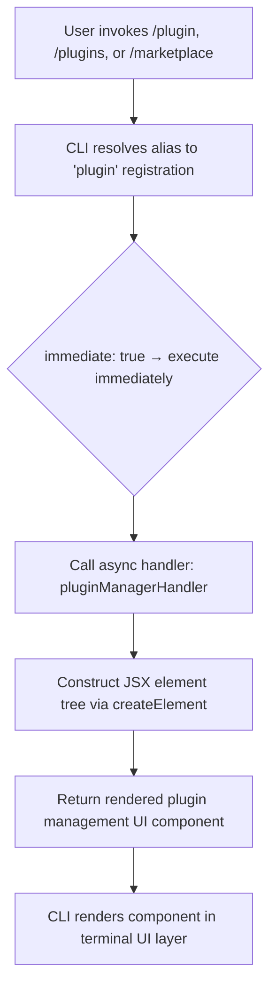

# `/plugin`

> Analysis basis: CC v2.1.132 bundle.js (AST extraction + Claude interpretation)
> Minimum version: v2.1.132

---

## Overview

The `/plugin` command provides a plugin management interface within Claude Code, allowing users to discover, install, and manage Claude Code plugins. It is implemented as a `local-jsx` command, meaning its output is rendered as a React JSX component rather than plain text, indicating a rich interactive UI surface. The command is also accessible via the aliases `/plugins` and `/marketplace`.

---

## Registration

| Field | Value |
|---|---|
| type | `local-jsx` |
| name | `plugin` |
| description | `Manage Claude Code plugins` |
| aliases | `["plugins", "marketplace"]` |
| immediate | `true` |
| module_id | `X3q` |
| load_inline | `true` |
| handler | `Ez7` (AsyncFunction, resolved via `module_id` path) |
| `loc_byte_end` | `11253906` |
| `arbor_handler.name` | `Ez7` |
| `arbor_handler.kind` | `AsyncFunction` |
| `arbor_handler.resolution_path` | `module_id` |
| `arbor_handler.fqn` | `claude-2.1.132::Ez7` |
| `arbor_handler.n_hits` | `0` |

Analysis basis: CC v2.1.132 bundle.js:+11253735 – +11253906

**Notes on registration shape:**

- `immediate: true` means the command executes and renders its UI immediately upon invocation, without requiring any further user confirmation step.
- `load_inline: true` indicates the handler module is resolved inline (i.e., `load: () => Promise.resolve({call: Ez7})`) rather than via a dynamic import boundary.
- The `local-jsx` type distinguishes this from text-only prompt commands: the handler returns a JSX element tree that the CLI renders directly in the terminal UI layer.
- The handler `Ez7` was resolved via Arbor's `module_id` resolution path (`module_id: "X3q"` → module exports → name lookup). This is the unambiguous entry point for the command.

---

## Input Branching

The depth-2 call graph for this command is minimal: the handler (`Ez7`) calls `JSA.createElement` directly, indicating the primary logic is JSX component construction rather than a branching text-processing pipeline.



Because `literals` and `telemetry` arrays are empty in the extracted data, no string-constant-driven branching paths or sub-command routing logic were detectable at depth ≤ 2.

<!-- TODO: internal UI component branching (e.g., list vs install vs remove sub-views) not found in depth-2 traversal; needs --depth 4 -->

---

## Behavioral Spec

### Plugin Manager UI Rendering

The handler is an `AsyncFunction` that, when invoked, constructs and returns a JSX component tree representing the plugin management interface. The CLI framework then mounts this component into the terminal rendering pipeline.

```
async function pluginManagerHandler(context):
    // Build the plugin management JSX UI tree
    uiElement = createElement(PluginManagerComponent, props_derived_from_context)
    return uiElement
```

Analysis basis: CC v2.1.132 bundle.js:+11253614 (call edge: `Ez7` → `JSA.createElement`)

**Behavioral properties observable from registration and call graph:**

1. **Immediate execution**: Because `immediate: true` is set, the CLI does not prompt the user for confirmation or additional arguments before invoking the handler. The UI surface appears as soon as the slash command is entered.

2. **JSX rendering path**: The `local-jsx` type instructs the CLI runtime to treat the handler's return value as a renderable React element rather than a string message. This enables interactive UI elements (lists, buttons, input fields) within the plugin manager.

3. **Async handler**: The handler is an `AsyncFunction`, implying it may perform asynchronous operations (e.g., fetching available plugins from a registry, reading local plugin state) before resolving the component to render.

4. **Alias unification**: All three entry points — `/plugin`, `/plugins`, `/marketplace` — resolve to the same handler (`Ez7`) and produce identical behavior. There is no alias-specific branching detected at depth ≤ 2.

<!-- TODO: specific plugin operations (install, remove, list, search, enable/disable) not found in depth-2 traversal; needs --depth 4 -->

<!-- TODO: any network calls or filesystem interactions within the plugin manager not found in depth-2 traversal; needs --depth 4 -->

---

## State & Side Effects

| Item | Detail |
|---|---|
| Telemetry | None detected at depth ≤ 2 traversal (`telemetry: []`) |
| Hook registration | <!-- TODO: not found in depth-2 traversal; needs --depth 4 --> |
| appState changes | <!-- TODO: not found in depth-2 traversal; needs --depth 4 --> |
| Filesystem I/O | <!-- TODO: not found in depth-2 traversal; needs --depth 4 --> |
| Network calls | <!-- TODO: not found in depth-2 traversal; needs --depth 4 --> |
| Sound | None detected |

**Note on telemetry absence**: The empty `telemetry` array means no `tengu_*` event strings were found within the depth-2 call graph from `Ez7`. This may indicate telemetry is fired from deeper component lifecycle methods not reached at this traversal depth, or that telemetry is absent by design for this command.

---

## Version History

| Version | Change |
|---|---|
| v2.1.132 | Initial analysis. `local-jsx` plugin manager command with aliases `plugins` and `marketplace`; handler `Ez7` confirmed via Arbor `module_id` resolution. |

---

## Common Mistakes

1. **Expecting text output**: Because this is a `local-jsx` command, it renders an interactive UI component — not a plain text response. Automation or scripting that captures stdout text output from this command may receive no meaningful plain-text content.

2. **Using `/marketplace` expecting a distinct behavior**: All three aliases (`/plugin`, `/plugins`, `/marketplace`) are registered to the same handler and produce identical behavior. There is no separate marketplace-specific view detectable at depth ≤ 2; the alias distinction is cosmetic/discoverability only.

3. **Assuming the command requires arguments**: With `immediate: true`, the command fires without any argument prompt. Passing sub-command arguments (e.g., `/plugin install foo`) may not be handled if the JSX component manages its own internal navigation — this is <!-- TODO: not confirmed at depth ≤ 2; needs --depth 4 -->.

4. **Expecting telemetry-visible invocation tracking**: No `tengu_*` telemetry events were found at depth ≤ 2. Do not rely on telemetry signals from this command for usage analytics without deeper verification.

---

## Appendix — Identifier Mapping

> For bundle debugging only. Identifiers change across versions.

| Identifier | Role |
|---|---|
| `Ez7` | Async handler function for the `/plugin` command; entry point resolved via `module_id: "X3q"` through Arbor symbol graph (`fqn: claude-2.1.132::Ez7`). Constructs the plugin manager JSX element tree. |