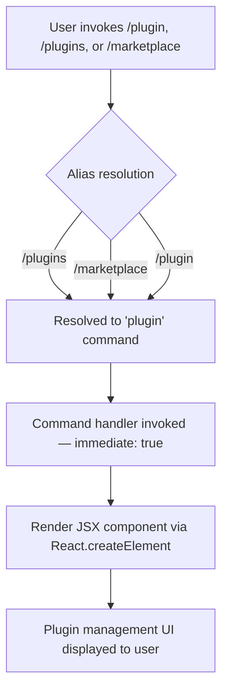

# `/plugin`

> Analysis basis: CC v2.1.133 bundle.js (AST extraction + Claude interpretation)
> Minimum version: v2.1.133

---

## Overview

The `/plugin` command provides a plugin management interface within Claude Code, allowing users to discover, install, and manage Claude Code plugins. It is registered as a `local-jsx` command, meaning its output is rendered as a JSX component rather than plain text. The command is also accessible via the aliases `/plugins` and `/marketplace`.

---

## Registration

| Field | Value |
|---|---|
| type | `local-jsx` |
| name | `plugin` |
| description | `Manage Claude Code plugins` |
| aliases | `plugins`, `marketplace` |
| immediate | `true` |
| module\_id | `o3q` |

Analysis basis: CC v2.1.133 bundle.js:+11270979

---

## Input Branching

The depth-2 call graph for this command contains a single outbound call edge — from the command handler to a React element constructor — indicating that the command handler's primary logic is to render a JSX component unconditionally, regardless of any sub-command arguments passed by the user.



Because `immediate` is `true`, the command fires without requiring the user to press a secondary confirmation key after typing.

Analysis basis: CC v2.1.133 bundle.js:+11270979 (registration), +11270858 (createElement call edge)

---

## Behavioral Spec

### Plugin UI Rendering

The sole documented behavior observable at call-graph depth ≤ 2 is the construction of a React element by the command handler. No argument parsing, conditional branching on user input, or asynchronous data fetching were detected at this traversal depth.

```
function pluginCommandHandler(args, appState):
    element = createElement(PluginManagementComponent, props)
    return element
```

The handler returns a JSX element that the CLI shell renders inline as the command's response. Because no string literals, numeric constants, or conditional branches were found in the traversal, the precise props passed to the component and the internal structure of the plugin management UI are not determinable at depth 2.

Analysis basis: CC v2.1.133 bundle.js:+11270858

### Alias Handling

The command registers two aliases in addition to its canonical name:

| Invocation | Resolves To |
|---|---|
| `/plugin` | `plugin` (canonical) |
| `/plugins` | `plugin` (alias) |
| `/marketplace` | `plugin` (alias) |

All three invocations are functionally equivalent and produce identical behavior.

Analysis basis: CC v2.1.133 bundle.js:+11270979

### Immediate Execution

The `immediate: true` flag means the CLI shell dispatches the command handler as soon as the user submits the slash command, without any intermediate confirmation prompt or secondary keystroke.

Analysis basis: CC v2.1.133 bundle.js:+11270979

---

## State & Side Effects

| Item | Detail |
|---|---|
| Telemetry | None detected at depth ≤ 2 traversal |
| Hook registration | <!-- TODO: not found in depth-2 traversal; needs --depth 4 --> |
| appState changes | <!-- TODO: not found in depth-2 traversal; needs --depth 4 --> |
| Sound | <!-- TODO: not found in depth-2 traversal; needs --depth 4 --> |
| Render target | Inline JSX component rendered in CLI shell output |
| Alias count | 2 aliases registered (`plugins`, `marketplace`) |

---

## Version History

| Version | Change |
|---|---|
| v2.1.133 | Initial analysis — `local-jsx` command with `immediate: true`, aliases `plugins` and `marketplace` confirmed |

---

## Common Mistakes

1. **Expecting plain-text output**: Because this command is registered as `local-jsx`, its output is a rendered UI component. Tooling or scripts that parse `/plugin` output as plain text will not receive a conventional text response.
2. **Assuming `/marketplace` is a separate command**: `/marketplace` is an alias for `/plugin` and is fully equivalent. Any behavioral difference between them would be a bug, not intended design.
3. **Assuming argument-driven sub-commands are documented here**: The depth-2 traversal found no argument parsing literals or branching logic. Sub-command behavior (e.g., `/plugin install <name>`) cannot be confirmed from this analysis and should not be assumed without a deeper traversal.
4. **Expecting telemetry confirmation**: No `tengu_*` telemetry events were found at depth ≤ 2. Plugin-related analytics, if they exist, are likely emitted inside the JSX component at greater call depth.
5. **Omitting the `s` suffix**: Users accustomed to typing `/plugins` (the plural alias) should be aware that `/plugin` (singular) is the canonical name, though both are equivalent at the CLI level.

---

## Appendix — Identifier Mapping

> For bundle debugging only. Identifiers change across versions.

| Identifier | Role |
|---|---|
| `rD7` | Plugin command handler function — the entry point called by the CLI shell when `/plugin` (or an alias) is invoked |