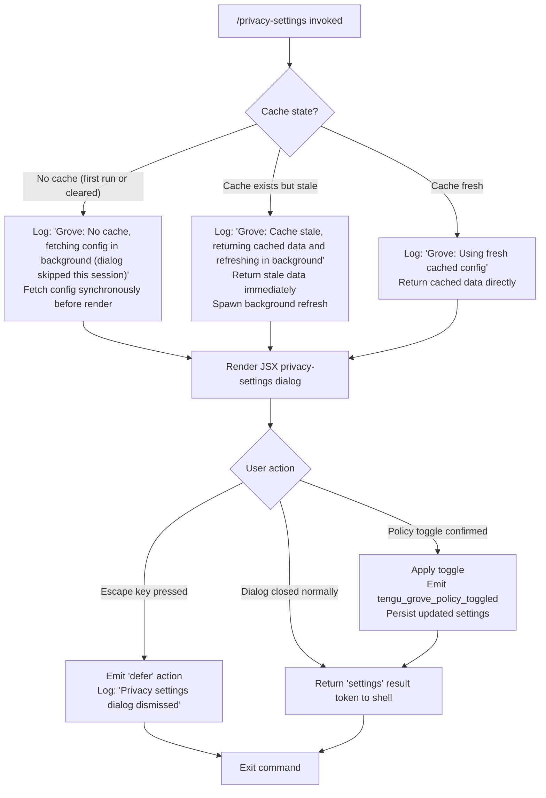

# `/privacy-settings`

> Analysis basis: CC v2.1.133 bundle.js (AST extraction + Claude interpretation)
> Minimum version: v2.1.133

---

## Overview

The `/privacy-settings` command opens an interactive JSX dialog that allows the user to view and toggle their privacy policy settings (referred to internally as "Grove" policies). When invoked, the command fetches the current configuration — serving from cache when fresh, refreshing in the background when stale, or fetching synchronously when no cache exists — then renders a settings panel and emits a telemetry event for each toggled policy.

---

## Registration

| Field | Value |
|---|---|
| type | `local-jsx` |
| name | `privacy-settings` |
| description | `View and update your privacy settings` |
| module_id | `Ufq` |

Analysis basis: CC v2.1.133 bundle.js:+11143262

---

## Input Branching

The command's configuration-fetch logic follows a three-way cache-state branch before rendering the dialog. After the dialog is dismissed, a separate escape/defer branch is evaluated.



Analysis basis: CC v2.1.133 bundle.js:+6461760, +6461880, +6461986, +11142429, +11142443, +11142454, +11142802, +11142863

---

## Behavioral Spec

### Config Fetch with Grove Cache Strategy

The entry handler (`commandEntryPoint`) delegates immediately to the config-fetch orchestrator (`groveConfigFetcher`), which evaluates cache freshness before deciding how to supply configuration data to the dialog renderer.

```
function groveConfigFetcher(cacheStore):
    cacheEntry = cacheStore.get()

    if cacheEntry is null or missing:
        log("debug", "Grove: No cache, fetching config in background (dialog skipped this session)")
        config = fetchConfigSynchronously()
        return config

    else if isStale(cacheEntry):
        log("debug", "Grove: Cache stale, returning cached data and refreshing in background")
        spawnBackgroundRefresh(cacheStore)
        return cacheEntry.data

    else:
        log("debug", "Grove: Using fresh cached config")
        return cacheEntry.data
```

Analysis basis: CC v2.1.133 bundle.js:+6461758, +6461760, +6461880, +6461986

---

### Jitter-Based Background Refresh Scheduler

When a background refresh is needed, a small helper (`jitterScheduler`) introduces randomized delay (using `Math.random` seeded with constant `2`) before triggering the refresh, to avoid thundering-herd effects when multiple sessions start simultaneously.

```
function jitterScheduler(refreshCallback):
    delayFactor = 2
    jitter = Math.random() * delayFactor
    setTimeout(refreshCallback, jitter * BASE_DELAY_MS)
```

Analysis basis: CC v2.1.133 bundle.js:+12285767, +12285769, +12285806

---

### Config Fetch Network Call with Timestamp

The network fetch helper (`configNetworkFetcher`) records `Date.now()` at the moment of request dispatch. It invokes underlying HTTP/transport utilities, annotates the result with a timestamp for staleness evaluation, and resolves via `Promise.all` when parallel sub-requests are needed.

```
function configNetworkFetcher(endpoint):
    requestedAt = Date.now()
    responses = await Promise.all(fetchSubRequests(endpoint))
    return annotateWithTimestamp(responses, requestedAt)
```

Analysis basis: CC v2.1.133 bundle.js:+6461734, +11142306

---

### Policy Toggle Handler

When the user toggles a policy switch in the dialog, `policyToggleHandler` applies the change, persists the updated settings object, and fires the `tengu_grove_policy_toggled` telemetry event.

```
function policyToggleHandler(policyKey, newValue, appState):
    appState.privacySettings[policyKey] = newValue
    persistSettings(appState.privacySettings)
    emitTelemetry("tengu_grove_policy_toggled", { policy: policyKey, value: newValue })
    return "settings"
```

Analysis basis: CC v2.1.133 bundle.js:+11142800, +11142802, +11142863

---

### Dialog Escape / Dismiss Handler

If the user presses Escape or otherwise dismisses the dialog without confirming, the dismiss handler emits a `"defer"` action string and logs the dismissal message. No settings are persisted and no policy telemetry is fired.

```
function dialogDismissHandler():
    log("Privacy settings dialog dismissed")
    return { action: "defer" }
```

Analysis basis: CC v2.1.133 bundle.js:+11142429, +11142443, +11142454

---

### Error Fallback — Config Retrieval Failure

If the config fetch fails (network error or API error), the command surfaces the literal error string `"Unable to retrieve updated privacy settings"` to the user and exits without rendering the dialog.

```
function configErrorFallback(error):
    displayError("Unable to retrieve updated privacy settings")
    return earlyExit()
```

Analysis basis: CC v2.1.133 bundle.js:+11142580

---

### MCP Server Reconciliation (Depth-2 Side Effect)

The dialog's initialization path also triggers MCP server state reconciliation via `mcpServerManager` and its subordinate `mcpUpdateApplier`. This reconciliation:

1. Iterates `Object.entries` over registered MCP server configurations.
2. Filters out disabled entries (literal `"disabled"`).
3. For each transport type (`"stdio"`, `"sse"`, `"http"`, `"sse-ide"`, `"ws-ide"`), routes to the appropriate connection handler.
4. Skips servers with cached `"needs-auth"` status, logging `"Skipping connection (cached needs-auth)"`.
5. On successful connection, marks server status as `"connected"`.
6. On failure, marks status as `"failed"`.
7. If all remote servers recover during a retry cycle, logs `"[MCP] Retry: all remote servers recovered, stopping"` and emits `tengu_mcp_retry_failed_remote`.

```
function mcpServerReconciler(serverConfigs):
    entries = Object.entries(serverConfigs)
    active = entries.filter(entry => entry.status != "disabled")

    for each entry in active:
        if cachedStatus(entry) == "needs-auth":
            log("Skipping connection (cached needs-auth)")
            continue

        transport = entry.transportType
        result = connectByTransport(transport, entry)
            // transport in: "stdio", "sse", "http", "sse-ide", "ws-ide"

        if result.ok:
            setStatus(entry, "connected")
        else:
            setStatus(entry, "failed")

    if allRemoteServersRecovered():
        log("[MCP] Retry: all remote servers recovered, stopping")
        emitTelemetry("tengu_mcp_retry_failed_remote")
```

Analysis basis: CC v2.1.133 bundle.js:+9474779, +9474877, +9474979, +9475013, +9475045, +9475078, +9475114, +9475506, +9475572, +9475674, +9476241, +13870729

---

### JSX Dialog Rendering

The final render step (`dialogRenderer`) calls `wj6.createElement` to construct the privacy settings panel as a React-compatible JSX tree, passing the fetched config and toggle callback as props.

```
function dialogRenderer(config, onToggle):
    return wj6.createElement(PrivacySettingsPanel, {
        config: config,
        onToggle: onToggle,
        onDismiss: dialogDismissHandler
    })
```

Analysis basis: CC v2.1.133 bundle.js:+11142909

---

### Promise Concurrency Wrapper

`parallelFetchWrapper` wraps multiple async operations (config fetch + MCP init) in a single `Promise.all`, ensuring the dialog does not render until both are settled.

```
function parallelFetchWrapper(tasks):
    results = await Promise.all(tasks)
    return results
```

Analysis basis: CC v2.1.133 bundle.js:+11142306

---

## State & Side Effects

| Item | Detail |
|---|---|
| Telemetry | `tengu_grove_policy_toggled` (bundle.js:+11142802) — fired on each policy toggle; `tengu_mcp_retry_failed_remote` (bundle.js:+13870729) — fired when all remote MCP servers recover after retry |
| Hook registration | Escape key listener registered during dialog lifetime; unregistered on dismiss or confirm |
| appState changes | `privacySettings` map updated on policy toggle; persisted via settings writer utility |
| Cache writes | Grove config cache entry updated with fresh data and new timestamp after background refresh completes |
| MCP side effect | MCP server connection reconciliation runs as part of initialization; server statuses (`connected`, `failed`, `needs-auth`) updated in appState |
| Sound | <!-- TODO: not found in depth-2 traversal; needs --depth 4 --> |
| Background async | `setTimeout`-based jitter scheduler may fire after command UI exits, completing cache refresh independently |

---

## Version History

| Version | Change |
|---|---|
| v2.1.133 | Initial analysis |

---

## Common Mistakes

1. **Expecting a blocking fetch on every invocation**: The command uses a stale-while-revalidate cache strategy. When the cache is fresh, no network call occurs during the dialog's visible lifetime. Stale data may be displayed briefly before the background refresh completes.
2. **Assuming Escape cancels all side effects**: Pressing Escape emits `"defer"` and logs a dismissal message, but any in-flight background refresh or MCP reconciliation initiated during startup continues to run asynchronously.
3. **Treating `tengu_grove_policy_toggled` as a dialog-open event**: This event fires only when the user actively toggles a policy switch, not when the dialog opens or closes. Opening and then dismissing without changes produces no policy telemetry.
4. **Ignoring the MCP reconciliation cost**: On first run (no cache), the initialization path includes MCP server connection reconciliation in parallel with the config fetch. Environments with many MCP servers configured may see increased startup latency for this command.
5. **Expecting an error dialog on config failure**: When config retrieval fails, the command surfaces `"Unable to retrieve updated privacy settings"` and exits without rendering the interactive panel. There is no retry prompt within the command's own UI.

---

## Appendix — Identifier Mapping

> For bundle debugging only. Identifiers change across versions.

| Identifier | Role |
|---|---|
| `Ez7` | Command entry point / top-level handler for `/privacy-settings` |
| `_FH` | Grove config fetch orchestrator (cache-strategy router) |
| `CPH` | Cache store accessor (get/set/invalidate) |
| `F7` | Staleness evaluator for cache entries |
| `R6` | Config network fetch utility (stamps `Date.now`, resolves promises) |
| `k` | Debug/log utility (routes to `"debug"` level, includes string normalization) |
| `HK9` | Dialog state manager / escape-key and dismiss handler |
| `H` | Jitter scheduler (uses `Math.random`, `setTimeout`) |
| `M` | MCP + settings parallel initializer (`Promise.all` orchestrator) |
| `iZH` | MCP connection manager (iterates server configs, routes by transport type) |
| `mFq` | MCP update applier (`applyMcpUpdate`, cleanup, retry logic) |
| `K` | Async task deduplication / in-flight request tracker (Set-based add/delete) |
| `$` | MCP retry-state checker |
| `J6` | MCP server registry accessor (has/get/add operations on server sets) |
| `Og7` | MCP server reconciler (filters active servers, drives `iZH` and `mFq`) |
| `d` | JSX dialog renderer / React element factory caller |